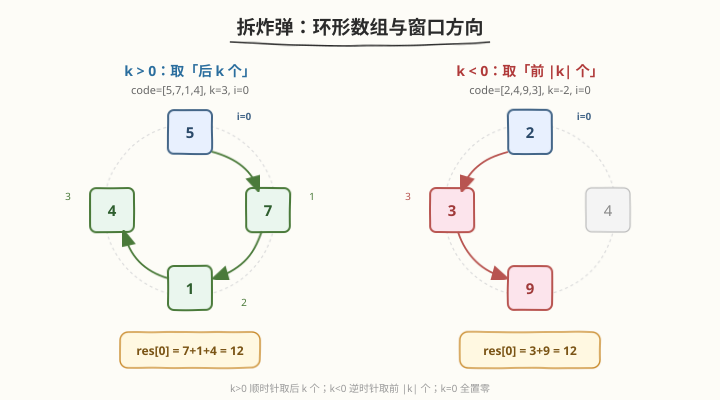
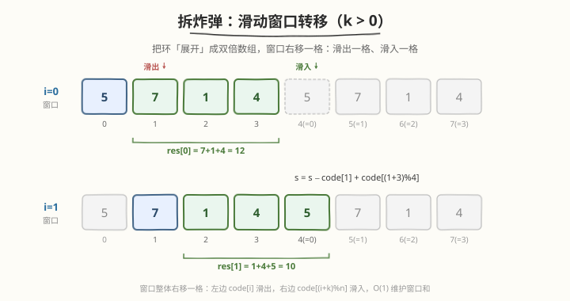
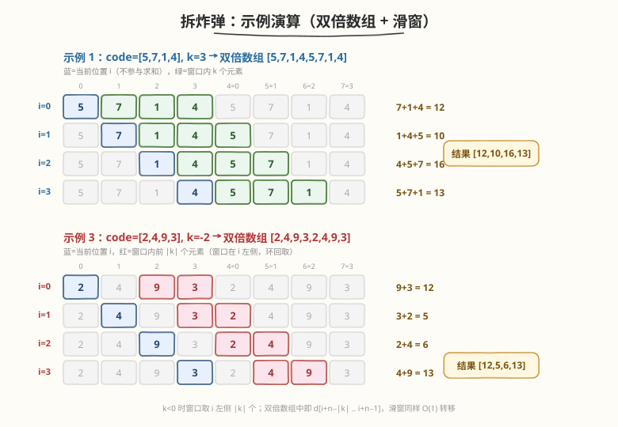

# 拆炸弹

- **题目名称**：拆炸弹
- **链接**：[1652. 拆炸弹](https://leetcode.cn/problems/defuse-the-bomb/)
- **难度**：简单
- **标签**：数组、滑动窗口

## 1. 题目概述

你有一个炸弹需要拆除。炸弹上有一个环形整数数组 `code`（长度为 `n`）和一个密钥 `k`。

为了解密 `code`，需要把每个 `code[i]` 替换成**另外 `k` 个数字之和**：

- 若 $k > 0$，把 `code[i]` 替换成**接下来 `k` 个数字之和**（即 `code[i+1]`, `code[i+2]`, …, `code[i+k]`，环形取下标）。
- 若 $k < 0$，把 `code[i]` 替换成**之前 `|k|` 个数字之和**（即 `code[i-1]`, `code[i-2]`, …, `code[i-|k|]`，环形取下标）。
- 若 $k = 0$，把 `code[i]` 替换成 `0`。

返回解密后的数组。

**示例 1**：

```text
输入：code = [5,7,1,4], k = 3
输出：[12,10,16,13]
解释：k=3，每个数替换为接下来 3 个数之和。
res[0] = code[1]+code[2]+code[3] = 7+1+4 = 12
res[1] = code[2]+code[3]+code[0] = 1+4+5 = 10
res[2] = code[3]+code[0]+code[1] = 4+5+7 = 16
res[3] = code[0]+code[1]+code[2] = 5+7+1 = 13
```

**示例 2**：

```text
输入：code = [1,2,3,4], k = 0
输出：[0,0,0,0]
```

**示例 3**：

```text
输入：code = [2,4,9,3], k = -2
输出：[12,5,6,13]
解释：k=-2，每个数替换为之前 2 个数之和。
res[0] = code[3]+code[2] = 3+9 = 12
res[1] = code[0]+code[3] = 2+3 = 5
res[2] = code[1]+code[0] = 4+2 = 6
res[3] = code[2]+code[1] = 9+4 = 13
```

**约束条件**：

- `n == code.length`
- $1 \leq n \leq 100$
- $1 \leq \text{code}[i] \leq 100$
- $-(n - 1) \leq k \leq (n - 1)$

> 💡 关键约束是「**环形数组**」与「$|k| < n$」。环形意味着下标要在 $n$ 上取模回绕；而 $|k| \leq n-1$ 保证窗口不会重复覆盖同一元素，窗口大小恒为 $|k|$，这正是滑动窗口可 $O(1)$ 转移的前提。

---

## 2. 解题思路

### 2.1 暴力思路：每个位置独立求和

对每个 $i$，按 $k$ 的方向单独累加 $|k|$ 个元素，用取模处理环形下标。共 $n$ 个位置，每次 $O(|k|)$，总时间 $O(n \cdot |k|)$。$n \leq 100$ 时可行，但完全没有利用**相邻位置窗口高度重叠**这一性质——位置 $i$ 与 $i+1$ 的窗口只差首尾两个元素，其余全部相同。

### 2.2 核心观察：环形数组 = 滑动窗口



把环形数组想象成一个圆环：

- $k > 0$：从当前位置 $i$ **顺时针**取接下来 $k$ 个；
- $k < 0$：从当前位置 $i$ **逆时针**取之前 $|k|$ 个；
- $k = 0$：全置零，直接返回。

关键洞察是：**当 $i$ 从 $i$ 变到 $i+1$ 时，窗口整体平移一格**——左端滑出一个元素，右端滑入一个元素。因此只需维护一个「窗口和」变量，每次 $O(1)$ 更新即可，无需重新求和。

### 2.3 算法流程：滑动窗口转移



以 $k > 0$ 为例（$k < 0$ 对称，方向相反）：

1. **算初始窗口**：位置 $i=0$ 的窗口为 `code[1], code[2], …, code[k]`（$k < n$ 无需取模），求和得 $s$，`res[0] = s`。
2. **逐位滑动**：从 $i=1$ 到 $i=n-1$，每步：
   - **滑出**左端元素 `code[i]`（即上一个窗口的首元素）；
   - **滑入**右端元素 `code[(i+k) \% n]`（环形回绕）；
   - $s \mathrel{-}= \text{code}[i]$，$s \mathrel{+}= \text{code}[(i+k) \% n]$，`res[i] = s`。

$k < 0$（设 $m = |k|$）时对称：初始窗口为 `code[n-1], …, code[n-m]`（位置 0 的前 $m$ 个）；每步滑出 `code[(i-1-m+n) \% n]`、滑入 `code[i-1]`。

> 💡 **为什么能 $O(1)$ 转移？** 因为 $|k| \leq n-1$，窗口大小恒为 $|k|$ 且不回绕重叠。相邻窗口只差首尾两元素，所以 `s = s − 滑出 + 滑入` 即可。这和 [239. 滑动窗口最大值] 的窗口平移是同一种结构，只是这里维护的是「和」而非「最大值」。

> ⚠️ **初始窗口的取模**：$k > 0$ 时 $j \in [1, k]$ 且 $k \leq n-1$，故 `code[j]` 不越界无需取模；$k < 0$ 时窗口下标为 $n-1, n-2, \ldots, n-m$，同样在 $[1, n-1]$ 内不越界。但**滑动阶段的滑入/滑出下标必须取模**，否则 $i+k$ 可能 $\geq n$。

### 2.4 示例演算



以**示例 1** `code = [5,7,1,4], k = 3` 为例，把环展成双倍数组 `[5,7,1,4,5,7,1,4]`，窗口随之右移：

| 步骤 | 位置 $i$ | 滑出 | 滑入 | 窗口元素 | 窗口和 $s$ |
|------|----------|------|------|----------|-----------|
| 初值 | 0 | — | — | 7,1,4 | 12 |
| 1 | 1 | code[1]=7 | code[0]=5 | 1,4,5 | 10 |
| 2 | 2 | code[2]=1 | code[1]=7 | 4,5,7 | 16 |
| 3 | 3 | code[3]=4 | code[2]=1 | 5,7,1 | 13 |

结果 `[12,10,16,13]`，每步只需一次减、一次加。

**示例 3** `code = [2,4,9,3], k = -2`（$m=2$）方向相反，窗口取位置左侧 2 个：

| 步骤 | 位置 $i$ | 滑出 | 滑入 | 窗口元素 | 窗口和 $s$ |
|------|----------|------|------|----------|-----------|
| 初值 | 0 | — | — | 9,3 | 12 |
| 1 | 1 | code[2]=9 | code[0]=2 | 3,2 | 5 |
| 2 | 2 | code[3]=3 | code[1]=4 | 2,4 | 6 |
| 3 | 3 | code[0]=2 | code[2]=9 | 4,9 | 13 |

结果 `[12,5,6,13]`。

---

## 3. 参考代码

### C++

```cpp
class Solution {
public:
    vector<int> decrypt(vector<int>& code, int k) {
        int n = code.size();
        vector<int> res(n, 0);
        if (k == 0) return res;
        int m = abs(k);
        // 初始窗口：位置 0 的 |k| 个邻居之和
        int s = 0;
        if (k > 0) {
            for (int j = 1; j <= m; ++j) s += code[j];          // code[1..k]
        } else {
            for (int j = 1; j <= m; ++j) s += code[n - j];      // code[n-1..n-m]
        }
        res[0] = s;
        // 逐位滑动：滑出左端、滑入右端
        for (int i = 1; i < n; ++i) {
            if (k > 0) {
                s += code[(i + k) % n] - code[i];               // 滑入 code[(i+k)%n]，滑出 code[i]
            } else {
                s += code[i - 1] - code[(i - 1 - m + n) % n];   // 滑入 code[i-1]，滑出 code[(i-1-m)%n]
            }
            res[i] = s;
        }
        return res;
    }
};
```

### Python

```python
class Solution:
    def decrypt(self, code: List[int], k: int) -> List[int]:
        n = len(code)
        if k == 0:
            return [0] * n
        m = abs(k)
        # 初始窗口：位置 0 的 |k| 个邻居之和
        if k > 0:
            s = sum(code[1:m + 1])              # code[1..k]
        else:
            s = sum(code[n - m:n])              # code[n-1..n-m]
        res = [0] * n
        res[0] = s
        # 逐位滑动：滑出左端、滑入右端
        for i in range(1, n):
            if k > 0:
                s += code[(i + k) % n] - code[i]
            else:
                s += code[i - 1] - code[(i - 1 - m) % n]
            res[i] = s
        return res
```

> 💡 Python 用切片 `code[1:m+1]` / `code[n-m:n]` 一行算初始窗口；滑动阶段 `(i-1-m) % n` 利用 Python 取模天然处理负数，无需像 C++ 那样手动 `+ n`。

---

## 4. 复杂度分析

| 维度 | 复杂度 | 说明 |
|------|--------|------|
| 时间复杂度 | $O(n)$ | 初始窗口 $O(|k|)$；滑动阶段每个位置 $O(1)$，共 $n-1$ 步；总体 $O(n + |k|) = O(n)$（$|k| \leq n-1$） |
| 空间复杂度 | $O(1)$ | 仅用常数额外变量 $s, m$；输出数组不计入额外空间（若计入则为 $O(n)$） |

> 💡 对比暴力 $O(n \cdot |k|)$，滑动窗口把「每次重算 $|k|$ 个」降为「每次只改 2 个」，这正是**相邻窗口重叠率 = $(|k|-1)/|k|$** 带来的红利——窗口越大、重叠越多、滑窗越划算。

---

## 5. 扩展：双倍数组 + 前缀和

除了滑动窗口，还有一种更直白的 $O(n)$ 写法：**把数组复制一份拼成双倍数组** `d = code + code`，再配合前缀和，每个位置的窗口和变成一次区间求和。

- $k > 0$：`res[i] = sum(d[i+1 .. i+k])`
- $k < 0$（$m = |k|$）：`res[i] = sum(d[i+n-m .. i+n-1])`

用前缀和数组 `pref`（`pref[t] = d[0] + … + d[t-1]`），区间和 $O(1)$：

```python
def decrypt(self, code: List[int], k: int) -> List[int]:
    n = len(code)
    if k == 0:
        return [0] * n
    m = abs(k)
    d = code + code
    pref = [0] * (2 * n + 1)
    for i in range(2 * n):
        pref[i + 1] = pref[i] + d[i]
    res = []
    for i in range(n):
        if k > 0:
            res.append(pref[i + k + 1] - pref[i + 1])
        else:
            res.append(pref[i + n] - pref[i + n - m])
    return res
```

> 💡 双倍数组把「环形回绕」问题转化成「线性区间求和」，思路更不易出错，代价是 $O(n)$ 额外空间。滑动窗口则 $O(1)$ 额外空间，是面试中更优的解法。两者本质相同：都是利用窗口重叠避免重复求和。

---

## 6. 面试要点

1. **为什么能用滑动窗口？相邻窗口重叠多少？**

   - 位置 $i$ 与 $i+1$ 的窗口各有 $|k|$ 个元素，重叠 $|k|-1$ 个，只差首尾各一个。故每次 $O(1)$ 更新即可，无需重算。前提是 $|k| \leq n-1$（窗口不重复覆盖同一元素），本题恰好满足。

2. **$k > 0$ 和 $k < 0$ 的滑入/滑出下标有何不同？**

   - $k > 0$：从 $i-1$ 到 $i$，滑出 `code[i]`（窗口左端），滑入 `code[(i+k) % n]`（窗口右端，环形回绕）。
   - $k < 0$（$m=|k|$）：滑出 `code[(i-1-m+n) % n]`（窗口最远端），滑入 `code[i-1]`（窗口最近端）。两者方向相反，但都是「出一进一」。

3. **为什么初始窗口不用取模，滑动阶段却要取模？**

   - 初始窗口（$k>0$ 时下标 $1..k$，$k<n$）和（$k<0$ 时下标 $n-1..n-m$，$m<n$）都落在 $[1,n-1]$ 内，不越界。滑动时 $i+k$ 可能 $\geq n$（$k>0$）或 $i-1-m$ 可能 $<0$（$k<0$），必须取模回绕。

4. **$k=0$ 为什么要单独处理？**

   - $k=0$ 时窗口大小为 0，没有元素可求和，结果全为 0。若不单独处理，初始窗口循环 `for j in 1..0` 不执行、$s=0$，后续滑动公式 $i+k=i$ 会导致「滑出 code[i]、滑入 code[i]」相抵消，$s$ 恒为 0——其实结果也对，但单独 return 更清晰且避免无意义计算。

5. **双倍数组法和滑动窗口法各有什么取舍？**

   - 双倍数组 + 前缀和：思路直观、不易出错，但 $O(n)$ 额外空间；滑动窗口：$O(1)$ 额外空间、更优，但下标取模需仔细处理负数。面试推荐滑动窗口，若担心边界可用双倍数组快速验证。

---

## 7. 同类练习题

- [239. 滑动窗口最大值](https://leetcode.cn/problems/sliding-window-maximum/)：同为定长窗口平移，但维护的是「最大值」需单调队列，对照「窗口和只需加减」的简洁性
- [209. 长度最小的子数组](https://leetcode.cn/problems/minimum-size-subarray-sum/)：变长滑动窗口求和（正数单调性收缩），对照本题定长窗口的差异
- [713. 乘积小于 K 的子数组](https://leetcode.cn/problems/subarray-product-less-than-k/)：滑窗维护乘积并计数，同为「相邻窗口 $O(1)$ 增量更新」范式
- [918. 环形子数组的最大和](https://leetcode.cn/problems/maximum-sum-circular-subarray/)：环形数组上的 Kadane，本题「环形」+「滑窗」的组合简化版
