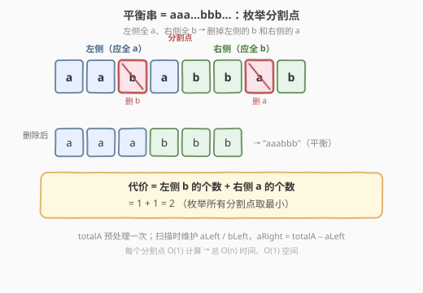
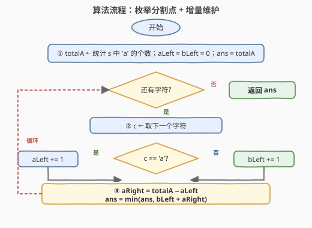
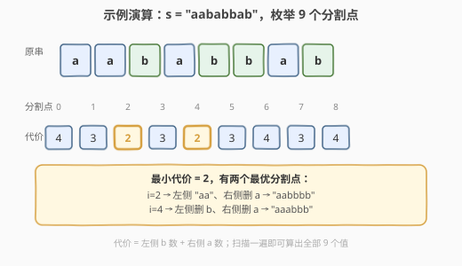

# 使字符串平衡的最少删除次数

- **题目名称**：使字符串平衡的最少删除次数
- **链接**：[1653. 使字符串平衡的最少删除次数](https://leetcode.cn/problems/minimum-deletions-to-make-string-balanced/)
- **难度**：中等
- **标签**：字符串、动态规划、前缀和

## 1. 题目概述

给定一个**只含 `'a'` 和 `'b'`** 的字符串 `s`，你可以删除任意数目的字符，使 `s` 变成**平衡**的。所谓平衡，是指不存在下标对 $(i, j)$ 满足 $i < j$ 且 `s[i] = 'b'`、`s[j] = 'a'`——换句话说，**所有 `'a'` 都在所有 `'b'` 之前**，即串形如 `aaa...bbb...`。返回使 `s` 平衡的**最少删除次数**。

**示例 1**：

```text
输入：s = "aababbab"
输出：2
解释：任选其一：
  - 删除第 2、6 个字符（"aa b abb a b" -> "aaabbb"）
  - 删除第 3、6 个字符（"aab a bb a b" -> "aabbbb"）
```

**示例 2**：

```text
输入：s = "bbaaaaabb"
输出：2
解释：唯一的最优解是删除最前面两个字符，得到 "aaaaabb"。
```

**约束条件**：

- $1 \leq \text{s.length} \leq 10^5$
- `s[i]` 要么是 `'a'`，要么是 `'b'`

> 💡 关键约束是「**只有两种字符**」与「**长度可达 $10^5$**」。前者让「平衡」等价于一个清晰的 `aaa...bbb...` 形态；后者要求解法至少 $O(n)$，排除暴力枚举所有删除子集。

---

## 2. 解题思路

### 2.1 暴力思路：枚举保留子集

最直白的想法是枚举「保留哪些字符」的所有子集（$2^n$ 种），对每个子集检查是否形如 `aaa...bbb...`，取保留最多的那个。这显然 $O(2^n)$，$n = 10^5$ 时完全不可行。

退一步，既然平衡态确定是 `aaa...bbb...`，不妨**直接枚举那个分界**：所有 `'a'` 在前、所有 `'b'` 在后，中间存在唯一一条「分割线」。对每个分割位置，算出「左侧不该有的 `b`」+「右侧不该有的 `a`」即为该分割的删除代价，取最小即可。

### 2.2 核心观察：平衡串 = 单一分割点



把平衡条件翻译成几何形态：**平衡串存在一个分割点 $i \in [0, n]$**，使得 `s[0..i-1]` 全是 `'a'`、`s[i..n-1]` 全是 `'b'`。给定一个分割点 $i$，要把它变成这种形态，必须删除：

- **左侧的 `'b'`**：共 $b_{\text{left}}(i)$ 个（左侧应全 `'a'`，遇到 `'b'` 就得删）；
- **右侧的 `'a'`**：共 $a_{\text{right}}(i)$ 个（右侧应全 `'b'`，遇到 `'a'` 就得删）。

该分割点的代价为

$$
\text{cost}(i) = b_{\text{left}}(i) + a_{\text{right}}(i)
$$

答案即 $\min_{0 \le i \le n} \text{cost}(i)$。两个端点也合法：$i=0$ 表示「左侧为空、全删 `'a'`」，代价 $= \text{totalA}$；$i=n$ 表示「右侧为空、全删 `'b'`」，代价 $= \text{totalB}$。

> 💡 **为何只需枚举分割点而不需枚举删除方案？** 因为一旦分割点固定，每个字符该删还是该留就被唯一确定了（左侧 `'b'` 必删、右侧 `'a'` 必删、其余必留）。所以「选最优分割点」与「选最优删除方案」完全等价，把指数级搜索压成了 $n+1$ 个候选。

### 2.3 算法流程：增量维护前缀计数



直接对每个 $i$ 重新统计 $b_{\text{left}}(i)$、$a_{\text{right}}(i)$ 是 $O(n^2)$。但相邻分割点 $i \to i+1$ 只跨过了一个字符 `s[i]`，计数可 $O(1)$ 增量转移：

1. **预处理**：`totalA =` `s` 中 `'a'` 的总数。
2. **初始化**：`aLeft = 0`、`bLeft = 0`、`ans = totalA`（对应分割点 $i=0$：左侧为空，代价 $=$ 全部 `'a'` 的个数）。
3. **扫描**：对每个字符 `c`（扫描到 `c` 后，分割点落在 `c` 之后）：
   - `c == 'a'`：`aLeft += 1`；
   - `c == 'b'`：`bLeft += 1`；
   - `aRight = totalA - aLeft`；
   - `ans = min(ans, bLeft + aRight)`。
4. **返回** `ans`。

> ⚠️ **初始值为何是 `totalA` 而不是 `+∞`？** 分割点 $i=0$（左侧为空）的代价就是「右侧全是 `s`，要删掉其中所有 `'a'`」$= \text{totalA}$。把它作为初始 `ans`，扫描循环只需覆盖 $i=1..n$，避免再特判。同理，循环结束后 $i=n$ 的情形也已被最后一步覆盖（`aRight` 变为 0，代价 $= b_{\text{left}}$）。

### 2.4 示例演算



以**示例 1** `s = "aababbab"`（`totalA = 4`）为例，逐分割点列出代价（左侧为 `s[0..i-1]`、右侧为 `s[i..n-1]`）：

| 分割点 $i$ | 左侧 | $b_{\text{left}}$ | 右侧 | $a_{\text{right}}$ | 代价 |
|-----------|------|-------------------|------|---------------------|------|
| 0 | (空) | 0 | aababbab | 4 | 4 |
| 1 | a | 0 | ababbab | 3 | 3 |
| 2 | aa | 0 | babbab | 2 | **2** ← min |
| 3 | aab | 1 | abbab | 2 | 3 |
| 4 | aaba | 1 | bbab | 1 | **2** ← min |
| 5 | aabab | 2 | bab | 1 | 3 |
| 6 | aababb | 3 | ab | 1 | 4 |
| 7 | aababba | 3 | b | 0 | 3 |
| 8 | aababbab | 4 | (空) | 0 | 4 |

最小代价 $= 2$，对应 $i=2$（得到 `"aabbbb"`）或 $i=4$（得到 `"aaabbb"`）。

扫描过程只维护 `aLeft / bLeft` 两个计数器，每步一次加法、一次减法、一次 `min`，共 $n$ 步。

---

## 3. 参考代码

### C++

```cpp
class Solution {
public:
    int minimumDeletions(string s) {
        int totalA = count(s.begin(), s.end(), 'a');
        int aLeft = 0, bLeft = 0;
        int ans = totalA;                 // 分割点 i=0：左侧为空，删掉所有 'a'
        for (char c : s) {
            if (c == 'a') aLeft += 1;
            else          bLeft += 1;
            int aRight = totalA - aLeft;  // 右侧 'a' 数 = 总 'a' - 左侧 'a'
            ans = min(ans, bLeft + aRight);
        }
        return ans;
    }
};
```

### Python

```python
class Solution:
    def minimumDeletions(self, s: str) -> int:
        total_a = s.count('a')
        a_left = b_left = 0
        ans = total_a                       # 分割点 i=0：左侧为空，删掉所有 'a'
        for c in s:
            if c == 'a':
                a_left += 1
            else:
                b_left += 1
            a_right = total_a - a_left      # 右侧 'a' 数 = 总 'a' - 左侧 'a'
            ans = min(ans, b_left + a_right)
        return ans
```

> 💡 **写法细节**：
> - **`totalA` 用 `count` / `s.count`** 一次性预处理，避免在循环里再维护 `totalB`。
> - **`aRight` 不单独计数**：右侧 `'a'` 数 $=$ 总 `'a'` $-$ 左侧 `'a'` 数，由 `totalA - aLeft` 即得，省去从右向左扫一遍。
> - **初始 `ans = totalA`** 等价于把分割点 $i=0$ 提前计入，循环内只需处理 $i=1..n$，代码更短且无特判。

---

## 4. 复杂度分析

| 维度 | 复杂度 | 说明 |
|------|--------|------|
| 时间复杂度 | $O(n)$ | 预处理 `totalA` 一趟 $O(n)$；主循环 $n$ 步，每步 $O(1)$ 增量更新与 `min` |
| 空间复杂度 | $O(1)$ | 仅常数变量 `totalA / aLeft / bLeft / ans`，无额外数组 |

> 💡 对比「每个分割点重新统计」的 $O(n^2)$，增量维护把「每次重数 $i$ 个」降为「每次只改 1 个」——这正是相邻分割点计数只差一个字符带来的红利。$n = 10^5$ 下 $O(n)$ 约 $10^5$ 次操作，轻松通过。

---

## 5. 扩展：一趟状态机 DP

除了「枚举分割点」，还有一种更紧凑的 $O(n)/O(1)$ 写法：**边读字符边维护「使当前前缀平衡的最少删除数」**。设：

- `del` = 处理到当前位置时，使**已扫描前缀**平衡的最少删除次数；
- `bCount` = 已扫描前缀中 `'b'` 的个数（不论删没删，都先记着，供后续 `'a'` 决策用）。

对每个字符 `c`：

- **`c == 'a'`**：要么**保留**它（它属于 `'a'` 段，则此前所有 `'b'` 必须删掉 $\to$ 代价 `bCount`），要么**删除**它（代价 `del + 1`）。取较小：`del = min(bCount, del + 1)`。
- **`c == 'b'`**：保留它不会破坏平衡（在平衡串末尾追加 `'b'` 仍平衡）$\to$ `del` 不变；但 `bCount += 1`（万一后面来个 `'a'` 想保留，得删掉这个 `'b'`）。

```cpp
class Solution {
public:
    int minimumDeletions(string s) {
        int del = 0, bCount = 0;
        for (char c : s) {
            if (c == 'a') del = min(bCount, del + 1);  // 留 a：删光前面的 b；删 a：del+1
            else          ++bCount;                     // 留 b：del 不变，记下这个 b
        }
        return del;
    }
};
```

```python
class Solution:
    def minimumDeletions(self, s: str) -> int:
        del_ = b_count = 0
        for c in s:
            if c == 'a':
                del_ = min(b_count, del_ + 1)   # 留 a：删光前面的 b；删 a：del+1
            else:
                b_count += 1                     # 留 b：del 不变，记下这个 b
        return del_
```

> 💡 **两种解法的关系**：「枚举分割点」是**站在结果形态**上选最优分界；「状态机 DP」是**站在过程**上对每个字符做「留 / 删」二选一。两者本质同构：DP 中「保留 `'a'` 则删光前面所有 `'b'`」正是把分割点设在当前 `'a'` 之前。DP 版只需两个变量、循环体更短，适合面试现场速写；枚举版思路更直观、便于讲解「平衡 = 单一分割点」这一关键观察。

> ⚠️ **DP 中 `bCount` 为何统计「全部 `'b'`」而非「保留的 `'b'`」？** 因为一旦决定保留某个 `'a'`，分割点就落在它之前，**此前所有 `'b'`（无论之前是否打算保留）都得删**——之前的「保留」决策会被这次 `'a'` 推翻。所以 `bCount` 必须是前缀 `'b'` 总数，而非可累积的「已保留 `'b'`」。

---

## 6. 面试要点

**Q1：为什么「平衡」等价于存在单一分割点？**

> 平衡条件「不存在 $i<j$ 且 `s[i]='b'`、`s[j]='a'`」等价于「所有 `'b'` 都不出现在任何 `'a'` 之前」。设最后一个 `'a'` 的下标为 $p$（若无 `'a'` 则 $p=-1$），则 $p$ 之后不能有……反推可得：所有 `'a'` 的下标 $<$ 所有 `'b'` 的下标。于是存在分界 $i$ 使左侧全 `'a'`、右侧全 `'b'`，$i$ 可取在「最后一个 `'a'` 与第一个 `'b'` 之间」的任意位置。

**Q2：为什么初始 `ans = totalA`，而不是把 $i=0$ 放进循环？**

> $i=0$ 表示左侧为空，此时 `aLeft = bLeft = 0`，代价 $= 0 + \text{totalA}$。若从 `ans = +∞` 起步，循环得从「分割点在首个字符之前」开始，下标与字符的对应关系容易绕晕。直接把 `ans` 初始化为 `totalA`（即 $i=0$ 的代价），循环内每读完一个字符就算「分割点在该字符之后」的代价，覆盖 $i=1..n$，逻辑最干净。

**Q3：枚举分割点法和状态机 DP 法，时间/空间复杂度分别如何？**

> 两者都是 $O(n)$ 时间、$O(1)$ 额外空间。枚举法维护 `aLeft / bLeft / totalA / ans` 四个量；DP 法维护 `del / bCount` 两个量。DP 法变量更少、代码更短，但枚举法把「平衡 = 单一分割点」这一洞察表达得更显式，讲解时更易被面试官接受。面试推荐先讲枚举法说清思路，再提 DP 法作为更精简的实现。

**Q4：若字符集从 `{a, b}` 扩展到 `{a, b, c}`，要求 `aaa...bbb...ccc...` 形态，如何推广？**

> 「单一分割点」推广为「两个分割点」$i \le j$，代价 $=$ 左段 `'b'`+'`c'` 数 $+$ 中段 `'a'`+'`c'` 数 $+$ 右段 `'a'`+'`b'` 数。可固定 $i$ 扫 $j$，用前缀计数 $O(n)$ 维护；总体仍 $O(n)$。这是「分割点计数」范式从 1 维到 2 维的自然推广，思路与 [1647. 字符频次唯一的最小删除次数](../1601-1700/1647_字符频次唯一的最小删除次数.md) 的「频次整理」不同，更接近排序型整理。

**Q5：`s` 全是 `'a'` 或全是 `'b'` 时，算法返回什么？正确吗？**

> 全 `'a'`：`totalA = n`，初始 `ans = n`；扫描中每读一个 `'a'`，`aLeft` 增、`aRight = totalA - aLeft` 减、`bLeft = 0`，代价 $= 0 + a_{\text{right}}$，一路降到 $i=n$ 时代价 $0$，返回 $0$（本就平衡）。全 `'b'`：`totalA = 0`，初始 `ans = 0`；扫描中 `bLeft` 增但 `aRight` 恒 $0$，代价恒 $= b_{\text{left}} \ge 0$，`ans` 始终保持 $0$，返回 $0$。两种极端都正确返回 $0$。

---

## 7. 同类练习题

- [918. 环形子数组的最大和](https://leetcode.cn/problems/maximum-sum-circular-subarray/)：同为「枚举分界点 + 前缀计数」范式，对照本题在「单字符集」上的简洁性
- [1647. 字符频次唯一的最小删除次数](https://leetcode.cn/problems/minimum-deletions-to-make-character-frequencies-unique/)（[题解](../1601-1700/1647_字符频次唯一的最小删除次数.md)）：同区间同属「最小删除」系列，但目标是「频次唯一」而非「顺序整理」，对照两种不同的整理目标
- [1312. 让字符串成为回文串的最少插入次数](https://leetcode.cn/problems/minimum-insertion-steps-to-make-a-string-palindrome/)：字符串整理型 DP，对照本题「删字符换顺序」与彼题「插字符凑回文」的差异
- [1147. 最长等差数列](https://leetcode.cn/problems/longest-chunked-palindrome-decomposition/)：另一类「分割点 + 增量」思路，体会「枚举分界」在字符串题中的普适性
