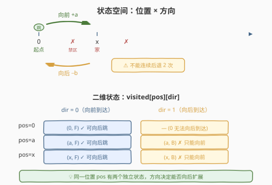
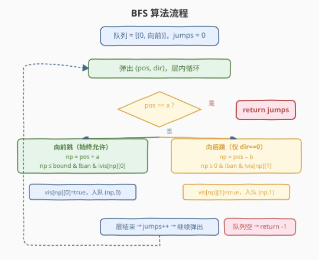
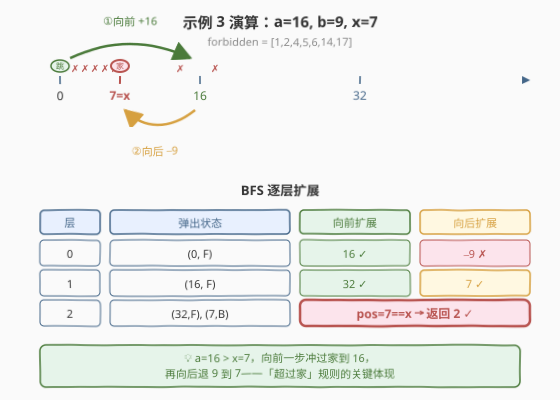

# 到家的最少跳跃次数

- **题目名称**：到家的最少跳跃次数
- **链接**：[1654. 到家的最少跳跃次数](https://leetcode.cn/problems/minimum-jumps-to-reach-home/)
- **难度**：中等
- **标签**：广度优先搜索（BFS）、数组、哈希表

## 1. 题目概述

一只跳蚤在数轴上的位置 `0` 出发，要到达位置 `x` 处的家。跳跃规则：

- 可以**向前**（右）跳恰好 `a` 个位置。
- 可以**向后**（左）跳恰好 `b` 个位置。
- **不能连续**向后跳 2 次。
- 不能跳到 `forbidden` 数组中的任何位置。
- 不能跳到负数位置（但可以超过家位置 `x`）。

返回最少跳跃次数；无法到达返回 `-1`。

**示例 1**：

```text
输入：forbidden = [14,4,18,1,15], a = 3, b = 15, x = 9
输出：3
解释：0 → 3 → 6 → 9，连续向前跳 3 次即到家。
```

**示例 2**：

```text
输入：forbidden = [8,3,16,6,12,20], a = 15, b = 13, x = 11
输出：-1
```

**示例 3**：

```text
输入：forbidden = [1,6,2,14,5,17,4], a = 16, b = 9, x = 7
输出：2
解释：0 → 16（向前），16 → 7（向后），2 次跳跃到家。
```

**约束条件**：

- $1 \leq \text{forbidden.length} \leq 1000$
- $1 \leq a, b, \text{forbidden}[i] \leq 2000$
- $0 \leq x \leq 2000$
- `forbidden` 中所有位置互不相同，且 `x` 不在 `forbidden` 中。

> 💡 关键约束是「**不能连续向后跳**」。这让跳蚤的状态不能只用位置描述——同样在位置 `p`，上一步是向前还是向后，决定了能否再向后跳。状态必须升级为 `(位置, 方向)` 二元组。

---

## 2. 解题思路

### 2.1 暴力思路：DFS 枚举所有跳跃序列

从位置 0 出发，每步尝试向前 / 向后（若允许），递归搜索所有可能的跳跃序列，记录到达 `x` 的最小步数。

问题：跳跃序列可以无限长（向前 → 向后 → 向前 → 向后 … 反复横跳），状态空间无界。不加剪枝的 DFS 会无限递归或指数爆炸。即使加记忆化，也需明确「状态」的边界与去重维度——这正是本题的考点。

### 2.2 核心观察：BFS 求最短路 + 状态 = (位置, 上一步方向)



**观察一：BFS 天然求最少跳跃次数。**

跳跃是**无权图**的最短路问题——每步代价为 1，BFS 逐层扩展，第一次到达 `x` 的层数即为答案。这与 [994. 腐烂的橘子](https://leetcode.cn/problems/rotting-oranges/)、[1926. 迷宫的最短路径](https://leetcode.cn/problems/nearest-exit-from-entrance-in-maze/) 的结构完全一致。

**观察二：状态必须包含「方向」维度。**

跳蚤在同一个位置 `p`，如果上一步是**向前**跳来的，则可以选择向前或向后；如果上一步是**向后**跳来的，则**只能向前**（不能连续后退）。因此位置相同但方向不同的状态不可等同——`(p, 向前)` 和 `(p, 向后)` 是两个独立状态，必须分别记录是否访问过。

> ⚠️ **只记录位置会漏解**：若只标记 `visited[p]` 而不区分方向，可能出现「位置 `p` 已通过向前到达，后续想从 `p` 向后跳但被错误跳过」的情况——而 `(p, 向后)` 这个本可继续向后扩展的状态从未被探索，导致漏掉最优解。

**观察三：搜索空间有上界。**

跳蚤可以无限向前跳，但**超过某个阈值后继续向前是无意义的**——回不来。设 $M = \max(\max(\text{forbidden}),\, x)$，则跳蚤不需要到达超过 $M + a + b$ 的位置：

- 若跳蚤在位置 $p > M + b$，向后跳到 $p - b > M$，仍超过所有 `forbidden` 和 `x`，无法回到有意义的位置。
- 因此向前的有效落点上界为 $M + a + b$（从 $\leq M + b$ 处向前跳一步可达的最远位置）。

> 💡 **上界公式**：$\text{bound} = \max(\max(\text{forbidden}),\, x) + a + b$。由约束 $a, b, \text{forbidden}[i], x \leq 2000$，上界最大 $2000 + 2000 + 2000 = 6000$，状态数 $\leq 6001 \times 2 \approx 1.2 \times 10^4$，BFS 完全可行。

### 2.3 算法流程



1. **初始化**：将 `forbidden` 存入哈希集合 `ban`；计算上界 `bound`；`visited[pos][dir]` 二维布尔数组（`dir = 0` 表示上一步向前，`dir = 1` 表示上一步向后）。
2. **BFS 起点**：队列放入 `(0, 0)`——位置 0，方向为向前（初始状态可自由选择第一步方向）。
3. **逐层扩展**（每层 `jumps` 递增 1）：
   - 弹出 `(pos, dir)`，若 `pos == x` 返回当前 `jumps`。
   - **向前跳**（始终允许）：`np = pos + a`。若 `np ≤ bound`、不在 `ban` 中、`visited[np][0]` 为假，则标记并入队 `(np, 0)`。
   - **向后跳**（仅当 `dir == 0`）：`np = pos - b`。若 `np ≥ 0`、不在 `ban` 中、`visited[np][1]` 为假，则标记并入队 `(np, 1)`。
4. **队列耗尽**仍未到达 `x`，返回 `-1`。

### 2.4 示例演算



以**示例 3** `forbidden = [1,6,2,14,5,17,4], a = 16, b = 9, x = 7` 为例，$M = \max(17, 7) = 17$，$\text{bound} = 17 + 16 + 9 = 42$。

| 层数 | 队列状态（位置, 方向） | 弹出 | 向前扩展 | 向后扩展 | 命中？ |
|------|------------------------|------|----------|----------|--------|
| 0 | `[(0, F)]` | (0, F) | 0+16=16 ✓ | 0−9=−9 ✗ | 否 |
| 1 | `[(16, F)]` | (16, F) | 16+16=32 ✓ | 16−9=7 ✓ | 否 |
| 2 | `[(32, F), (7, B)]` | (32, F) → … ; (7, B) | — | — | **是！pos=7==x** |

第 2 层弹出 `(7, B)` 时 `pos == x`，返回 `jumps = 2`。

> 💡 **为什么需要「超过家」？** 示例 3 中 `x = 7 < a = 16`，向前一步直接跳过家到 16，再向后跳 9 到 7。这正是「可以超过家位置」规则的用途——当 `a > x` 时，必须先冲过去再退回来。

---

## 3. 参考代码

### C++

```cpp
class Solution {
public:
    int minimumJumps(vector<int>& forbidden, int a, int b, int x) {
        unordered_set<int> ban(forbidden.begin(), forbidden.end());
        int maxBan = *max_element(forbidden.begin(), forbidden.end());
        int bound = max(maxBan, x) + a + b;
        // visited[pos][0] = 上一步向前到达 pos；visited[pos][1] = 上一步向后到达 pos
        vector<vector<bool>> visited(bound + 1, vector<bool>(2, false));
        queue<pair<int, int>> q;  // {位置, 上一步方向}，0=向前，1=向后
        q.push({0, 0});
        visited[0][0] = true;
        int jumps = 0;
        while (!q.empty()) {
            int sz = q.size();
            while (sz--) {
                auto [pos, dir] = q.front(); q.pop();
                if (pos == x) return jumps;
                // 向前跳（始终允许）
                int np = pos + a;
                if (np <= bound && !ban.count(np) && !visited[np][0]) {
                    visited[np][0] = true;
                    q.push({np, 0});
                }
                // 向后跳（仅当上一步不是向后）
                if (dir == 0) {
                    np = pos - b;
                    if (np >= 0 && !ban.count(np) && !visited[np][1]) {
                        visited[np][1] = true;
                        q.push({np, 1});
                    }
                }
            }
            jumps++;
        }
        return -1;
    }
};
```

### Python

```python
class Solution:
    def minimumJumps(self, forbidden: List[int], a: int, b: int, x: int) -> int:
        ban = set(forbidden)
        bound = max(max(forbidden), x) + a + b
        # visited[pos][0] = 向前到达 pos；visited[pos][1] = 向后到达 pos
        visited = [[False, False] for _ in range(bound + 1)]
        from collections import deque
        q = deque([(0, 0)])  # (位置, 上一步方向)，0=向前，1=向后
        visited[0][0] = True
        jumps = 0
        while q:
            for _ in range(len(q)):
                pos, dir = q.popleft()
                if pos == x:
                    return jumps
                # 向前跳（始终允许）
                np = pos + a
                if np <= bound and np not in ban and not visited[np][0]:
                    visited[np][0] = True
                    q.append((np, 0))
                # 向后跳（仅当上一步不是向后）
                if dir == 0:
                    np = pos - b
                    if np >= 0 and np not in ban and not visited[np][1]:
                        visited[np][1] = True
                        q.append((np, 1))
            jumps += 1
        return -1
```

> 💡 **层序 BFS 的两种写法**：一是记录层数（本题解法，外层 `while` 每轮 `jumps++`）；二是在队列元素中存步数 `{pos, dir, step}`。前者更省空间，后者更直观。本题用前者，因为「第一次到达 `x`」的层数即为最少跳跃次数。注意在**弹出时检查** `pos == x`（而非入队时），保证最短。

---

## 4. 复杂度分析

| 维度 | 复杂度 | 说明 |
|------|--------|------|
| 时间复杂度 | $O(\text{bound})$ | 每个状态 $(pos, dir)$ 至多入队一次，状态数 $\leq 2 \times (\text{bound}+1) \leq 12002$；每状态 $O(1)$ 扩展 |
| 空间复杂度 | $O(\text{bound})$ | `visited` 数组 $O(\text{bound})$ + BFS 队列 $O(\text{bound})$ + `ban` 集合 $O(\|\text{forbidden}\|)$ |

> 💡 $\text{bound} = \max(\max(\text{forbidden}),\, x) + a + b \leq 6000$，故时间空间均 $\leq O(6000)$，远低于题面数据规模限制。

---

## 5. 扩展：上界的严格讨论

为什么上界是 $\max(\max(\text{forbidden}), x) + a + b$？分两种情况讨论：

**情况一：$a \geq b$（向前跳不弱于向后跳）**

跳蚤一旦到达位置 $p > M + b$（$M = \max(\max(\text{forbidden}), x)$），向后跳到 $p - b > M$，仍超出所有 `forbidden` 与 $x$。此后每轮「向前 + 向后」净位移 $a - b \geq 0$，**无法向左回归**。因此跳蚤不会到达超过 $M + b$ 的位置，向前落点上界为 $M + b + a = M + a + b$。

**情况二：$a < b$（向后跳更强）**

跳蚤可通过「向前 + 向后」循环净左移 $b - a$。若已到达 $p > M + a + b$，则 $p - b > M + a$，即向后跳后仍超出 $M + a$。此时再向前跳到 $> M + 2a$，再向后到 $> M + 2a - b$。若 $2a < b$ 仍超出 $M$，但跳蚤完全可以在更近的位置（$\leq M + a + b$）完成同样的左移——远的绕路不比近的更优。BFS 的最短性保证了不会走多余弯路。

> ⚠️ 若上界设得太小（如只取 $\max(\text{forbidden}) + b$ 而不加 $\max$ 与 $x$ 的比较），当 $x$ 较大或 `forbidden` 堵住近路时可能误判 $-1$。$\max(\max(\text{forbidden}), x) + a + b$ 是经验证的安全上界。

---

## 6. 面试要点

1. **为什么状态要包含方向？只用位置做 visited 会怎样？**

   > 「不能连续向后跳」意味着同一位置 `p` 有两种不等价的状态：上一步向前（可向后跳）与上一步向后（不可向后跳）。若只标记 `visited[p]`，从 `(p, 向前)` 先访问后，`(p, 向后)` 会被错误跳过，可能漏掉最优解。

2. **上界为什么是 $\max(\max(\text{forbidden}), x) + a + b$？**

   > 超过 $\max(\max(\text{forbidden}), x) + b$ 后，即使向后跳也回不到任何有意义的位置（仍超过所有 `forbidden` 和 $x$）。所以有效位置上界为 $M + b$，向前落点上界为 $M + b + a$。取 $\max(\text{forbidden})$ 和 $x$ 的较大者保证不被任一侧截断。

3. **BFS 的层数和跳跃次数如何对应？**

   > 起点 `(0, F)` 在第 0 层（0 次跳跃）。每扩展一层，跳跃次数 +1。第一次从队列中弹出 `pos == x` 的状态时，当前层数 = 跳跃次数。注意是在**弹出时检查**而非入队时检查，保证最短。

4. **`x = 0` 时返回什么？**

   > 返回 0。起点就是家，无需跳跃。BFS 第一轮弹出 `(0, F)`，`pos == 0 == x`，立即返回 `jumps = 0`。

5. **能否用双向 BFS 或 A\* 优化？**

   > 本题状态空间 $\leq 1.2 \times 10^4$，单向 BFS 已足够快（毫秒级）。双向 BFS 需从 `x` 反向搜索，但「不能连续后退」的反向规则复杂（需推导反向边），实现难度大且收益不显著。面试中单向 BFS 是最优选。

---

## 7. 同类练习题

- [994. 腐烂的橘子](https://leetcode.cn/problems/rotting-oranges/)：多源 BFS 求最短传播时间，与本题同为「无权图 BFS 求最少步数」范式
- [1926. 迷宫的最短路径](https://leetcode.cn/problems/nearest-exit-from-entrance-in-maze/)：网格 BFS 求最短出口，对照本题在数轴上的 BFS
- [847. 访问所有节点的最短路径](https://leetcode.cn/problems/shortest-path-visiting-all-nodes/)：状态压缩 BFS（状态 = (当前节点, 已访问集合)），与本题「状态 = (位置, 方向)」同为扩展状态维度的 BFS
- [1293. 网格中的最短路径](https://leetcode.cn/problems/shortest-path-in-a-grid-with-obstacles-elimination/)：状态 = (位置, 剩余消除次数)，三维状态 BFS，对照本题的二维状态
- [2059. 转化数字的最小运算数](https://leetcode.cn/problems/minimum-operations-to-convert-number/)：数轴上的 BFS 求最少运算，与本题结构高度相似
