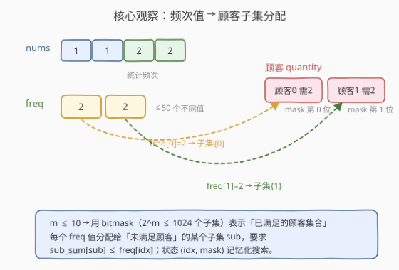
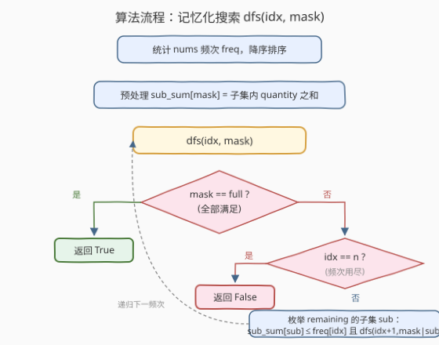
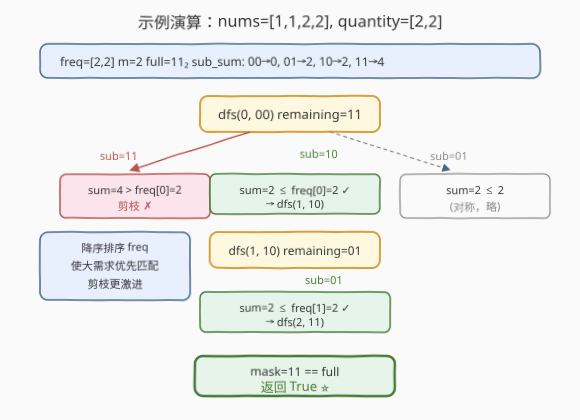

# LeetCode 分配重复整数 题解

## 1. 题目概述

- **标题 / 题号**：分配重复整数（#1655，hard）
- **链接**：https://leetcode.cn/problems/distribute-repeating-integers/
- **难度**：困难
- **标签**：动态规划、状态压缩、回溯、位运算

**题意**：给定长度为 `n` 的整数数组 `nums`（其中至多有 **50 个不同的值**），以及 `m` 个顾客的订单 `quantity`。第 `i` 位顾客**恰好**需要 `quantity[i]` 个**相同**的整数。判断能否把 `nums` 中的整数分配给所有顾客，使每位顾客都拿到指定数量的同一种整数。

**示例 1**：

```text
输入：nums = [1,2,3,4], quantity = [2]
输出：false
解释：没有任何一种整数出现 2 次，无法满足顾客 0。
```

**示例 2**：

```text
输入：nums = [1,2,3,3], quantity = [2]
输出：true
解释：顾客 0 拿到 [3,3]；[1,2] 不使用。
```

**示例 3**：

```text
输入：nums = [1,1,2,2], quantity = [2,2]
输出：true
解释：顾客 0 拿到 [1,1]，顾客 1 拿到 [2,2]。
```

**约束**：

- `n == nums.length`，`1 <= n <= 10^5`
- `1 <= nums[i] <= 1000`，`nums` 中至多有 **50 个不同的数字**
- `m == quantity.length`，`1 <= m <= 10`
- `1 <= quantity[i] <= 10^5`

> ⚠️ **关键信号**：`m ≤ 10` 是**状压 DP / 子集枚举**的甜区——`2^m ≤ 1024` 个子集完全可以枚举。而 `nums` 至多 50 个不同值，意味着「频次表」长度 ≤ 50。两维相乘 $50 \times 2^{10}$ 仍在可控范围内，提示用 `(频次下标, 已满足顾客 mask)` 作状态做记忆化搜索。

## 2. 解题思路

### 2.1 暴力思路

把 `nums` 按值统计频次，得到一个长度 ≤ 50 的 `freq` 列表。对每个顾客，枚举把它分给哪个频次值（即哪种整数）。这本质上是「把 `m` 个顾客分配到 ≤ 50 个频次桶里，每个桶的总需求 ≤ 该桶频次」的**分组问题**。暴力枚举每位顾客的归属是 $50^m$，`m=10` 时约 $10^{17}$，不可行。需要利用「**顾客集合**」而非「逐个顾客」做转移。

### 2.2 核心观察：用位掩码记录「已满足的顾客集合」

每位顾客的需求是独立的，而一个频次值 `freq[idx]` 可以**一次性满足若干个顾客**（只要这些顾客的需求之和 ≤ `freq[idx]`）。因此对当前频次值，我们关心的是「**它去满足未满足顾客中的哪个子集**」，而不是逐个顾客地分配。



用一个 `m` 位的二进制整数 `mask` 表示「**已经满足的顾客集合**」：

- `mask` 第 `j` 位为 `1`，表示顾客 `j` 已被某个频次值满足；
- `remaining = (~mask) & full` 是当前**尚未满足**的顾客集合；
- 对频次值 `freq[idx]`，枚举 `remaining` 的所有子集 `sub`，若 `sub_sum[sub] ≤ freq[idx]`，则把 `sub` 这些顾客交给 `freq[idx]` 满足，转移到 `(idx+1, mask | sub)`。

预处理 `sub_sum[mask]` = 子集 `mask` 内所有 `quantity[j]` 之和（共 $2^m$ 项，$O(m \cdot 2^m)$），转移时即可 $O(1)$ 判断可行性。

### 2.3 算法流程



定义 `dfs(idx, mask)`：用频次 `freq[idx..]` 能否满足 `mask` 之外的所有顾客。

- **终止 1**：`mask == full` → 所有顾客已满足，返回 `true`；
- **终止 2**：`idx == len(freq)` → 频次用尽仍有顾客未满足，返回 `false`；
- **转移**：枚举 `remaining = (~mask) & full` 的所有子集 `sub`（含空集，表示 `freq[idx]` 谁也不满足、直接跳过），若 `sub_sum[sub] ≤ freq[idx]` 且 `dfs(idx+1, mask | sub)` 为真，则返回 `true`；
- 都不成立则返回 `false`。

**子集枚举模板**（重要）：枚举 `remaining` 的所有子集用 `sub = remaining; while true: ...; if sub==0 break; sub = (sub-1) & remaining`，可一次性遍历且自动包含空集。

> 💡 **剪枝优化**：把 `freq` **降序排序**，让大频次值先出场。大频次能覆盖大子集，早期就能确定可行性或快速失败；同时配合记忆化，重复子问题被消除。

### 2.4 示例演算

以示例 3 为例：`nums=[1,1,2,2]`，`quantity=[2,2]`。

- `freq = [2, 2]`（降序），`m=2`，`full = 0b11 = 3`；
- `sub_sum: 00→0, 01→2, 10→2, 11→4`。



```text
dfs(0, 00)  remaining=11
  ├─ sub=11 : sum=4 > freq[0]=2  ✗ 剪枝
  ├─ sub=10 : sum=2 ≤ 2 ✓ → dfs(1, 10)
  │           remaining=01
  │             └─ sub=01 : sum=2 ≤ freq[1]=2 ✓ → dfs(2, 11)
  │                          mask==full → 返回 True ⭐
  └─ sub=01 : (对称，同样成功)
返回 True
```

注意 `sub=11` 因为需求和 4 超过 `freq[0]=2` 被直接剪掉，这正是「频次值 → 子集需求比较」带来的早期剪枝。

## 3. 参考代码

### Python

```python
class Solution:
    def canDistribute(self, nums: List[int], quantity: List[int]) -> bool:
        from collections import Counter
        from functools import lru_cache

        freq = sorted(Counter(nums).values(), reverse=True)
        m = len(quantity)
        full = (1 << m) - 1

        # 预处理每个子集的 quantity 之和
        sub_sum = [0] * (1 << m)
        for mask in range(1 << m):
            s = 0
            for j in range(m):
                if mask >> j & 1:
                    s += quantity[j]
            sub_sum[mask] = s

        n = len(freq)

        @lru_cache(None)
        def dfs(idx: int, mask: int) -> bool:
            if mask == full:
                return True
            if idx == n:
                return False
            remaining = (~mask) & full
            sub = remaining
            while True:
                if sub_sum[sub] <= freq[idx] and dfs(idx + 1, mask | sub):
                    return True
                if sub == 0:
                    break
                sub = (sub - 1) & remaining
            return False

        return dfs(0, 0)
```

### C++

```cpp
class Solution {
  public:
    bool canDistribute(vector<int>& nums, vector<int>& quantity) {
        unordered_map<int, int> cnt;
        for (int x : nums) cnt[x]++;
        vector<int> freq;
        for (auto& p : cnt) freq.push_back(p.second);
        sort(freq.begin(), freq.end(), greater<int>());

        int m = quantity.size();
        int full = (1 << m) - 1;
        vector<int> sub_sum(1 << m, 0);
        for (int mask = 0; mask < (1 << m); ++mask) {
            int s = 0;
            for (int j = 0; j < m; ++j)
                if (mask >> j & 1) s += quantity[j];
            sub_sum[mask] = s;
        }

        int n = freq.size();
        // memo: -1 未计算, 0 false, 1 true
        vector<signed char> memo(n * (1 << m), -1);
        function<bool(int, int)> dfs = [&](int idx, int mask) -> bool {
            if (mask == full) return true;
            if (idx == n) return false;
            int key = idx * (1 << m) + mask;
            if (memo[key] != -1) return memo[key];
            int remaining = (~mask) & full;
            for (int sub = remaining; ; sub = (sub - 1) & remaining) {
                if (sub_sum[sub] <= freq[idx] && dfs(idx + 1, mask | sub)) {
                    return memo[key] = true;
                }
                if (sub == 0) break;
            }
            return memo[key] = false;
        };
        return dfs(0, 0);
    }
};
```

> 💡 **写法细节**：子集枚举循环 `for (sub = remaining; ; sub = (sub-1) & remaining)` 必须在 `sub == 0` 时 `break`，否则 `(0-1) & remaining = remaining` 会死循环。空集 `sub=0` 对应「该频次值不分配给任何顾客」，是合法转移，不能漏。

## 4. 复杂度分析

| 维度 | 复杂度 | 说明 |
|------|--------|------|
| 时间复杂度 | $O\bigl(3^m \cdot n\bigr)$ | 状态数 $\leq n \cdot 2^m$；每个状态枚举 `remaining` 的子集，所有 `mask` 的子集枚举总次数 $\sum_{k=0}^{m} \binom{m}{k} 2^{m-k} = 3^m$，故转移总开销 $O(3^m)$，乘以频次维度 |
| 空间复杂度 | $O(n \cdot 2^m)$ | 记忆化数组大小；`sub_sum` 额外 $O(2^m)$ |

代入数据上限 $m=10,\ n=50$：$3^{10} = 59049$，$50 \times 59049 \approx 3 \times 10^6$，毫秒级完成。即便不做记忆化、纯回溯，配合降序剪枝在很多用例上也能过，但记忆化是稳妥写法。

## 5. 扩展：另一种视角——按「顾客」转移

上面的解法是「**按频次值推进**」：每次决定 `freq[idx]` 去满足哪个子集。也可以反过来「**按顾客推进**」：`dp[mask]` = 已满足 `mask` 中的顾客所需的最少频次「桶数」或可行性，但需要额外记录用了哪些频次值，状态会变成 `dp[i][mask]` 的二维递推（频次前 `i` 个能否凑出 `mask`），转移仍是枚举子集。两者本质同构，**按频次推进 + 记忆化搜索更接近 DFS 直觉、剪枝更自然**，是推荐写法。

另外一种常见优化是「**可行性剪枝**」：若 `remaining` 中某位 `j` 的 `quantity[j]` 超过所有剩余 `freq` 之和，直接返回 `false`。本题数据范围下不写也能过。

## 6. 面试要点

1. **为什么 `m ≤ 10` 提示用状压 DP？**
   - $2^{10}=1024$，子集枚举完全可行；遇到「顾客/任务 ≤ 10~20」且「每个顾客要么满足要么不满足」的分配/分组问题，第一反应应是 bitmask + 子集枚举。

2. **为什么状态是 `(idx, mask)` 而不是只用 `mask`？**
   - `mask` 只刻画「哪些顾客已满足」，但「还剩哪些频次值可用」也是必要信息——不同的频次值组合会得出不同结论。`idx` 表示当前考虑第几个频次值（前 `idx` 个已决策），二者合起来才完整。

3. **子集枚举模板 `(sub-1) & remaining` 的原理？**
   - 这是枚举 `remaining` 所有子集的标准手法：从 `remaining` 自身开始，每次 `sub = (sub-1) & remaining` 得到字典序下一个子集，直到 `sub == 0`（空集）后停止。它只遍历 `remaining` 的子集，跳过所有不属于 `remaining` 的位，比朴素枚举 `0..2^m-1` 再判定快约 $2^{m-\|remaining\|}$ 倍。

4. **降序排序 `freq` 为什么能加速？**
   - 大频次值先出场，能一次性满足大子集，让 `mask` 快速逼近 `full`；若大频次都满足不了某顾客，提前失败。配合记忆化消除重复子问题，常数显著降低。

5. **如何输出一种具体分配方案？**
   - 在 DFS 命中 `true` 时回溯记录「`freq[idx]` → `sub`」的对应关系，即可还原每位顾客拿了哪种整数。本题只问可行性，故不必还原。

## 同类练习题

| # | 题目 | 与本题的关联 |
|---|------|-------------|
| 526 | [优美的排列](https://leetcode.cn/problems/beautiful-arrangement/)（[站内题解](../0501-0600/526_优美的排列.md)） | 状压 DP 入门，`mask` 表示已放置数字集合，与本题「`mask` 表示已满足顾客集合」同构，难度低一档 |
| 698 | [划分为 K 个相等的子集](https://leetcode.cn/problems/partition-to-k-equal-sum-subsets/)（[站内题解](../0601-0700/698_划分为K个相等的子集.md)） | 状压 DP / 回溯，`mask` 表示已用元素，把数分成 K 组——「子集划分」型状压，思路与本题的「频次分给顾客子集」一致 |
| 691 | [贴纸拼词](https://leetcode.cn/problems/stickers-to-spell-word/) | `mask` 表示已拼出的目标字符子集，求最少贴纸数（最值型状压 DP，承接本题的可行性型） |
| 1799 | [N 次操作后的最大分数](https://leetcode.cn/problems/maximize-score-after-n-operations/) | `mask` 表示剩余可用数字，成对取数求最大得分，状态设计思路与本题一致 |
| 1659 | [最大化网格幸福感](https://leetcode.cn/problems/maximize-grid-happiness/)（[站内题解](./1659_最大化网格幸福感.md)） | 状压 DP 进阶，轮廓线 DP，与本题同为 bitmask 系列的困难题 |
