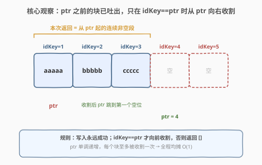
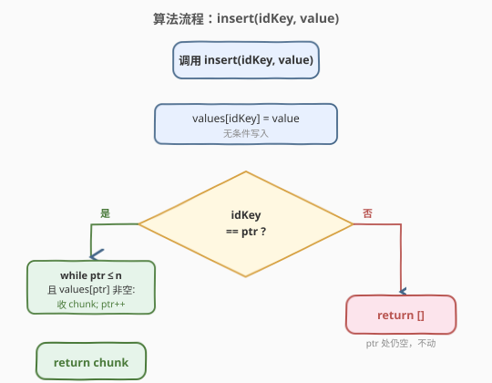
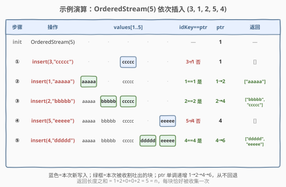

# LeetCode 设计有序流 题解

## 1. 题目概述

- **标题 / 题号**：设计有序流（#1656，easy）
- **链接**：https://leetcode.cn/problems/design-an-ordered-stream/
- **难度**：简单
- **标签**：设计、数组、模拟、指针

**题意**：有 `n` 个**按顺序编号**的块（chunk），编号 `1` 到 `n`。一个长度为 `n` 的流会以**任意顺序**陆续到达 `(idKey, value)` 对，每个对把 `value` 写入编号为 `idKey` 的块。设计 `OrderedStream` 类：

- `OrderedStream(int n)`：构造一个含 `n` 个块的流，并初始化一个指针 `ptr = 1`（指向**当前期望返回的最小块编号**）。
- `List<String> insert(int idKey, String value)`：将 `value` 写入第 `idKey` 个块，随后**从 `ptr` 开始**向右收集**连续且非空**的块，组成一个列表返回；同时把 `ptr` 推进到第一个**未填**的位置。若 `ptr` 处仍为空，则返回**空列表**且 `ptr` 不动。

**示例 1**：

```text
输入：
["OrderedStream", "insert", "insert", "insert", "insert", "insert"]
[[5], [3, "ccccc"], [1, "aaaaa"], [2, "bbbbb"], [5, "eeeee"], [4, "ddddd"]]
输出：
[null, [], ["aaaaa"], ["bbbbb", "ccccc"], [], ["ddddd", "eeeee"]]

解释：
OrderedStream os = new OrderedStream(5);     // ptr = 1
os.insert(3, "ccccc"); // 写入块3，ptr=1 处仍空 → 返回 []，ptr 不动
os.insert(1, "aaaaa"); // 写入块1，ptr=1 处已填 → 收集 [块1]，块2 空 → 停，ptr→2，返回 ["aaaaa"]
os.insert(2, "bbbbb"); // 写入块2，ptr=2 处已填 → 收集 [块2,块3]，块4 空 → 停，ptr→4，返回 ["bbbbb","ccccc"]
os.insert(5, "eeeee"); // 写入块5，ptr=4 处仍空 → 返回 []，ptr 不动
os.insert(4, "ddddd"); // 写入块4，ptr=4 处已填 → 收集 [块4,块5]，越界 → 停，ptr→6，返回 ["ddddd","eeeee"]
```

**约束**：

- $1 \leq n \leq 1000$
- $1 \leq \text{idKey} \leq n$
- `value` 仅由小写英文字母组成
- `idKey` 与 `value` 在所有 `insert` 中**唯一**（每块只写一次）
- `insert` 最多被调用 `n` 次

> 💡 题目本质是**乱序到达、按序输出**的缓冲：写入永远成功，难点只在"何时把已积累的连续块一次性吐出"。关键在于维护一个**只前进不回退**的指针 `ptr`——已吐出的块永远不会被再次访问，这决定了算法的均摊代价。

## 2. 解题思路

### 2.1 暴力思路：每次插入后从 1 重新扫描

最直白的写法：用一个长度 `n+1` 的数组 `values` 存所有已写入的值，每次 `insert` 后**从下标 1 开始**向右扫描，把连续非空的块都收进结果，然后把 `ptr` 推到第一个空位。

```text
insert(idKey, value):
    values[idKey] = value
    res = []
    i = 1                       // 每次都从 1 开始
    while i <= n and values[i] != "":
        res.append(values[i])
        i += 1
    ptr = i
    return res
```

这样写**结果正确**，但有一个明显浪费：`ptr` 之前的块**早就被收集过**、且因为每块只写一次，它们**永远不会变空**。每次都从 1 重新扫，等于把"已经处理完的段"反复重读。最坏情况（按 `1,2,3,...,n` 顺序插入）每次插入扫描长度递增，总代价 $\sum_{k=1}^{n} k = O(n^2)$，对 $n=1000$ 来说约 $10^6$ 次访问——能 AC 但不优雅。

### 2.2 核心观察：ptr 只前进，只在命中时向前收割



关键洞察有两点：

1. **`ptr` 单调递增**。一旦 `ptr` 推进到位置 `k`，意味着 `1..k-1` 都已被收集并返回过。又因为每块**只写一次**，这些位置永远不会重新变空——`ptr` **没有理由回退**。
2. **只有 `idKey == ptr` 这一次插入**会触发收集。写入 `idKey > ptr` 的块时，`ptr` 处仍空（否则 `ptr` 早就越过它了），按规则返回空列表，`ptr` 不动；写入 `idKey < ptr` 是不可能的（该块早已写过，而题目保证 `idKey` 唯一）。于是触发条件精确地退化为 `idKey == ptr`。

由此得到精简流程：

- `values[idKey] = value`（无条件写入）。
- 若 `idKey != ptr`：直接返回 `[]`。
- 若 `idKey == ptr`：从 `ptr` 起**向右扫到第一个空位或越界**，把沿途非空块收进结果，最后把 `ptr` 跳到那个停下的位置。

> 💡 **均摊分析**：每次收集虽然可能向前扫很长（如示例最后一步扫了块 4、5），但**每个块在整个生命周期内最多被这次"向前收割"访问一次**——一旦扫过，`ptr` 就越过它再也不回来。`n` 次插入合计最多访问 $n$ 个块，故**均摊每次 $O(1)$**，总体 $O(n)$。这是"指针只前进"型均摊论证的典型例子，与双指针/并查集按秩合并同源。

> ⚠️ 注意 `ptr` 可能越过 `n`：当块 $1..n$ 全部填满并收集后 `ptr = n+1`。之后任何 `insert` 的 `idKey` 都 $\leq n < \text{ptr}$，但题目保证 `idKey` 唯一且最多调用 `n$ 次，故这种"全部收完后再插入"的情况不会发生，无需特判——不过把 `ptr` 限制在 $[1, n+1]$ 是稳健写法。

### 2.3 算法流程图



流程分两阶段：**先无条件写入**，再**判定是否命中 `ptr`**。命中则向前收割连续非空段并把 `ptr` 跳到停点；未命中则原样返回空列表，`ptr` 不动。决策只走一岔，无回溯、无重扫。

### 2.4 示例演算



以 `OrderedStream(5)` 为例，初始 `values = [_, _, _, _, _, _]`（下标 0 不用），`ptr = 1`：

| 步骤 | 操作 | 写入后 values（下标 1..5） | idKey==ptr ? | 收集过程 | ptr 变化 | 返回 |
|------|------|--------------------------|--------------|----------|----------|------|
| init | `OrderedStream(5)` | `[_, _, _, _, _]` | — | — | 1 | — |
| ① | `insert(3,"ccccc")` | `[_, _, ccccc, _, _]` | 3≠1 否 | 不收集 | 1 | `[]` |
| ② | `insert(1,"aaaaa")` | `[aaaaa, _, ccccc, _, _]` | 1==1 是 | 块1→块2空停 | 1→2 | `["aaaaa"]` |
| ③ | `insert(2,"bbbbb")` | `[aaaaa, bbbbb, ccccc, _, _]` | 2==2 是 | 块2→块3→块4空停 | 2→4 | `["bbbbb","ccccc"]` |
| ④ | `insert(5,"eeeee")` | `[aaaaa, bbbbb, ccccc, _, eeeee]` | 5≠4 否 | 不收集 | 4 | `[]` |
| ⑤ | `insert(4,"ddddd")` | `[aaaaa, bbbbb, ccccc, ddddd, eeeee]` | 4==4 是 | 块4→块5→越界停 | 4→6 | `["ddddd","eeeee"]` |

> 💡 **观察要点**：步骤 ① 写入的"ccccc"在 ③ 才被一并吐出，步骤 ④ 写入的"eeeee"在 ⑤ 才被一并吐出——这正是"乱序到达、按序输出"的缓冲语义。`ptr` 从 1 单调推进到 6，**从不回退**；每次返回的列表长度之和 $= 1+2+0+0+2 = 5 = n$，与"每块恰好被收集一次"的均摊论证吻合。

## 3. 参考代码

### C++

```cpp
class OrderedStream {
    vector<string> values;
    int ptr;
    int n;

  public:
    OrderedStream(int n) : values(n + 1), ptr(1), n(n) {}

    vector<string> insert(int idKey, string value) {
        values[idKey] = move(value);
        vector<string> chunk;
        if (idKey != ptr) {
            return chunk;
        }
        while (ptr <= n && !values[ptr].empty()) {
            chunk.push_back(move(values[ptr]));
            ++ptr;
        }
        return chunk;
    }
};
```

### Python

```python
class OrderedStream:
    def __init__(self, n: int):
        self.values = [""] * (n + 1)
        self.ptr = 1
        self.n = n

    def insert(self, idKey: int, value: str) -> list[str]:
        self.values[idKey] = value
        if idKey != self.ptr:
            return []
        chunk = []
        while self.ptr <= self.n and self.values[self.ptr]:
            chunk.append(self.values[self.ptr])
            self.ptr += 1
        return chunk
```

> 💡 **写法细节**：
> - 数组开成长度 `n+1`，下标 `0` 留空不用，让 1-indexed 的 `idKey` 直接当地址，免去 `-1` 偏移——与 1603 设计停车系统的 `slots[0]` 闲置同构。
> - 用 `idKey != ptr` 提前返回，避免无谓进入循环；命中后再 `while` 向前收割。两条分支互斥，逻辑干净。
> - C++ 用 `move` 转移字符串所有权，避免拷贝大字符串；`vector<string>` 按值返回，编译器会 RVO/move 优化掉拷贝。
> - Python 借助空串 `""` 的 falsy 性质，`while ... and self.values[self.ptr]` 一行兼顾"未越界且非空"两个条件。

## 4. 复杂度分析

| 维度 | 复杂度 | 说明 |
|------|--------|------|
| 时间复杂度（单次 `insert` 最坏） | $O(n)$ | 命中 `ptr` 且其后连续一大段非空时，一次扫到尾，如示例步骤 ⑤ 扫 2 块；极端顺序插入最后一步扫剩余全部 |
| 时间复杂度（全部 `insert` 均摊） | $O(n)$ 总体，每次均摊 $O(1)$ | `ptr` 单调递增，每个块至多被"向前收割"访问一次；$n$ 次插入合计访问 $\leq n$ 次 |
| 空间复杂度 | $O(n)$ | 长度 `n+1` 的数组存放所有值，不计返回列表的输出空间 |

> 💡 暴力法每次从 1 重扫是 $O(n^2)$ 总体；本题的 `ptr` 机制把"重复扫描已处理段"的开销消除，**总体从 $O(n^2)$ 降到 $O(n)$**。这正是均摊分析的价值：单次最坏 $O(n)$ 不可怕，只要"贵"的操作次数被"便宜"的操作次数摊薄到 $O(1)$ 均摊即可。

## 5. 面试要点

1. **为什么 `ptr` 不会回退？**

   - `ptr` 推进到 `k` 意味着 $1..k-1$ 已被收集并返回。题目保证每个 `idKey` 唯一、每块只写一次，故这些位置**永远不会重新变空**——回退没有意义。`ptr` 单调递增是本题均摊 $O(1)$ 的根基，与并查集按秩合并、KMP 的 `next` 指针、双指针的右端点同属"单调指针型均摊"。

2. **为什么只有 `idKey == ptr` 才触发收集？**

   - 若 `idKey > ptr`：写入的位置在 `ptr` 之后，但 `ptr` 处仍空（否则 `ptr` 早已越过它），按规则返回 `[]`，`ptr` 不动。若 `idKey < ptr`：该块早已被写过，与"`idKey` 唯一"矛盾，不会发生。故触发条件精确退化为 `idKey == ptr`，提前判定省去无谓进入循环。

3. **均摊 $O(1)$ 怎么严格说明？**

   - 用"势能法"或直接计数：设 `ptr` 在整个过程中从 1 推进到至多 $n+1$，总共前进 $\leq n$ 步。每次 `while` 循环体执行一次必使 `ptr` 自增一次，故所有 `while` 循环体执行总次数 $\leq n$。加上每次 `insert` 的 $O(1)$ 写入与判定，$n$ 次插入合计 $O(n)$，均摊每次 $O(1)$。

4. **如果 `insert` 总次数可以超过 `n`（同一块可重写）会怎样？**

   - "每块只写一次"的假设被打破后，`ptr` 仍单调不回退，但重写已收集过的位置（`idKey < ptr`）会变成"无效写入"——因为该块早已吐出，新值永远不会被返回。若要求重写后能重新吐出，则需把 `ptr` 改为可回退（如维护"最远连续非空前缀"），退化为动态维护前缀信息，复杂度上升。本题无需考虑。

5. **数组开 `n+1` 还是 `n`？下标 0 闲置有什么好处？**

   - 开 `n+1`、让 `values[0]` 闲置，使得 1-indexed 的 `idKey` 直接当数组下标，免去 `idKey - 1` 的偏移修正，代码更不易错。若开 `n` 则需 `values[idKey - 1]` 并把 `ptr` 也对应改成 0-indexed，等价但多一次心算。与 1603 设计停车系统、剑指 Offer 05 替换空格等"1-indexed 题用长度+1 数组"是同一套套路。

## 同类练习题

| # | 题目 | 与本题的关联 |
|---|------|-------------|
| 1603 | [设计停车系统](https://leetcode.cn/problems/design-parking-system/)（[题解](../1601-1700/1603_设计停车系统.md)） | 设计题入门，用定长数组按下标维护计数，对照本题"1-indexed 直接当数组下标"的写法 |
| 933 | [最近的请求次数](https://leetcode.cn/problems/number-of-recent-calls/) | 设计类，队列维护时间窗口并按"过期就弹出"推进队首指针，与本题 `ptr` 单调前进同属"单调指针型均摊" |
| 232 | [用栈实现队列](https://leetcode.cn/problems/implement-queue-using-stacks/)（[题解](../0201-0300/232_用栈实现队列.md)） | 设计题模板，双栈倒换也是均摊 $O(1)$ 的经典范例，对照本题的均摊论证 |
| 705 | [设计哈希集合](https://leetcode.cn/problems/design-hashset/) | 纯设计题，按值域选底层结构，体会"用基本数组封装状态"的设计范式 |
| 146 | [LRU 缓存](https://leetcode.cn/problems/lru-cache/)（[题解](../0101-0200/146_LRU缓存.md)） | 设计题进阶，哈希 + 双向链表，是本题"单数组 + 指针"思路的复杂度升级版 |
