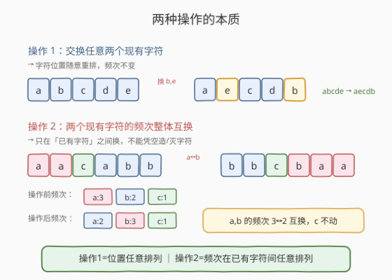
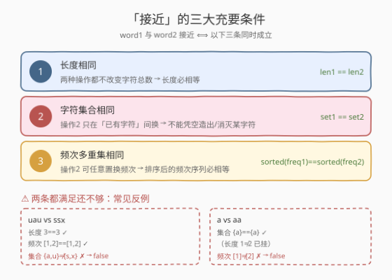
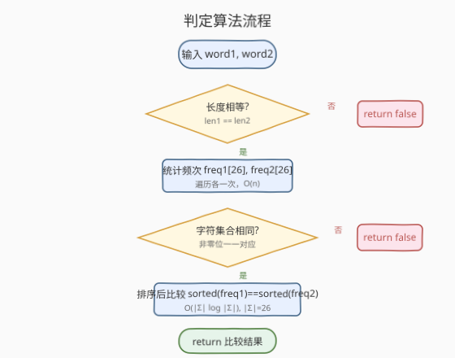

# LeetCode 确定两个字符串是否接近 题解

## 1. 题目概述

- **标题 / 题号**：确定两个字符串是否接近（#1657，medium）
- **链接**：https://leetcode.cn/problems/determine-if-two-strings-are-close/
- **难度**：中等
- **标签**：哈希表、字符串、计数

**题意**：给定两个字符串 `word1` 和 `word2`，如果可以通过下面两种操作（任意多次）把 `word1` 变成 `word2`，则称二者**接近**，返回 `true`；否则返回 `false`。

- **操作 1**：交换任意两个**现有**字符。
  - 例如 `abcde -> aecdb`（交换 `b` 与 `e` 的位置）。
- **操作 2**：把一个**现有**字符的每次出现转换为另一个**现有**字符，并对另一个字符做同样转换（即两个现有字符的频次整体互换）。
  - 例如 `aacabb -> bbcbaa`（所有 `a` 转为 `b`，所有 `b` 转为 `a`，`c` 不动）。

**示例 1**：

```text
输入：word1 = "abc", word2 = "bca"
输出：true
解释：2 次操作 1 即可：abc -> acb -> bca。
```

**示例 2**：

```text
输入：word1 = "a", word2 = "aa"
输出：false
解释：两种操作都不改变长度，且无法凭空增加 a 的个数。
```

**示例 3**：

```text
输入：word1 = "cabbba", word2 = "abbccc"
输出：true
解释：3 次操作：
  操作 1：cabbba -> caabbb
  操作 2：caabbb -> baaccc（a↔b）
  操作 2：baaccc -> abbccc（a↔c）
```

**约束**：

- $1 \le \text{word1.length}, \text{word2.length} \le 10^5$
- `word1` 和 `word2` 仅包含小写英文字母

> 💡 关键不在「怎么一步步操作」，而在「两串能否接近」的**充要条件**——一旦抓住不变量，判定就退化为频次数组的两次比较。

## 2. 解题思路

### 2.1 暴力思路：模拟 BFS 搜索所有可达串

从 `word1` 出发，每一步尝试所有可能的操作 1 和操作 2，BFS 枚举所有可达字符串，看能否命中 `word2`。状态空间随长度指数膨胀，且操作 1 本身就能产生 $n!$ 级别的排列，完全不可行。

### 2.2 核心观察：两种操作各自的不变量

先理解两种操作到底能改变什么、不能改变什么：



- **操作 1**：只搬动字符位置，不改变任何字符的出现次数。等价于「**位置可以任意重排**」——因此字符串的具体顺序无关紧要，只看每个字符出现几次。
- **操作 2**：在两个**已有**字符之间互换它们的全部出现。等价于「**频次可以在已有字符之间任意置换**」——频次多重集本身不变，但哪个字符承担哪个频次可以随意调换。

> ⚠️ **操作 2 的硬约束**：只能在「两个现有字符」之间换。这意味着：
> 1. **不能凭空造出一个原本没有的字符**——`word1` 里没有 `x`，操作再多也变不出 `x`。
> 2. **不能让一个现有字符彻底消失**——频次为 0 的字符不参与交换，已有的字符频次被换走后仍以新身份存在。

把两种操作的能力合起来，就能提炼出三条**充要条件**：



1. **长度相同**：两种操作都不增不减字符，长度必相等。
2. **字符集合相同**：操作 2 不能造出/消灭字符，故两串出现的不同字符的集合必须一致（对每个字母，`freq1[i] > 0` 当且仅当 `freq2[i] > 0`）。
3. **频次多重集相同**：操作 1 让位置无关，操作 2 让频次可在已有字符间任意置换，故把两串的频次**排序后**必须完全相等。

> 💡 **充分性证明**：若三条都满足，先各做若干次操作 1 把两串分别按字符聚拢（同字符相邻），再用操作 2 把 `word1` 的频次按 `word2` 的字符身份重新分配（频次多重集相同 → 一定存在一种分配），最后再用操作 1 排成 `word2` 的精确顺序。故三条件满足即可互推。

### 2.3 算法流程图



具体步骤：

1. 长度不等 → 直接返回 `false`。
2. 用长度 26 的数组统计两串各字符频次，$O(n)$。
3. 检查字符集合：对 `i` in `0..25`，`freq1[i] > 0` 必须等价于 `freq2[i] > 0`；否则返回 `false`。
4. 把两个频次数组排序后逐位比较；完全相等返回 `true`，否则 `false`。

### 2.4 示例演算


以 `word1 = "cabbba"`、`word2 = "abbccc"` 为例：

| 字符 | word1 频次 | word2 频次 |
|------|-----------|-----------|
| a | 2 | 1 |
| b | 3 | 2 |
| c | 1 | 3 |

- ① 长度 $6 = 6$ ✓
- ② 字符集合 $\{a,b,c\} = \{a,b,c\}$ ✓
- ③ 排序后频次 $[1,2,3] = [1,2,3]$ ✓

三条全满足 → 返回 `true`。一种可行的操作序列见上图：先用操作 1 聚拢成 `caabbb`，再用两次操作 2 互换频次身份，最后得到 `abbccc`。

> 💡 **典型反例**：`word1 = "uau"`、`word2 = "ssx"`。长度 $3=3$ ✓，排序频次 $[1,2]=[1,2]$ ✓，但字符集合 $\{a,u\} \ne \{s,x\}$ ✗ → `false`。这正是「字符集合相同」这条条件的用武之地——光看频次不够，还得看是哪些字符在承担这些频次。

## 3. 参考代码

### C++

```cpp
class Solution {
public:
    bool closeStrings(string word1, string word2) {
        if (word1.size() != word2.size()) return false;

        vector<int> freq1(26, 0), freq2(26, 0);
        for (char c : word1) freq1[c - 'a']++;
        for (char c : word2) freq2[c - 'a']++;

        // 条件 2：字符集合相同（非零位一一对应）
        for (int i = 0; i < 26; ++i) {
            if ((freq1[i] == 0) != (freq2[i] == 0)) return false;
        }

        // 条件 3：频次多重集相同
        sort(freq1.begin(), freq1.end());
        sort(freq2.begin(), freq2.end());
        return freq1 == freq2;
    }
};
```

### Python

```python
class Solution:
    def closeStrings(self, word1: str, word2: str) -> bool:
        if len(word1) != len(word2):
            return False

        c1, c2 = Counter(word1), Counter(word2)
        # 条件 2：出现的字符集合相同
        # 条件 3：频次多重集相同
        return c1.keys() == c2.keys() and sorted(c1.values()) == sorted(c2.values())
```

> ⚠️ **易错点**：
> 1. **漏掉「字符集合相同」**：只比较 `sorted(freq1) == sorted(freq2)` 会把 `"uau"` 与 `"ssx"` 误判为 `true`。集合判定不可省。
> 2. **把集合判定写成「频次非零位的值相等」**：错了。集合只要求「有没有」，不要求「有多少」。判定条件是 `(freq1[i]>0) == (freq2[i]>0)`，而非 `freq1[i] == freq2[i]`。
> 3. **先排序再比集合**：排序会打乱字符与下标的对应关系，导致集合判定失效。务必先判集合，再排序比频次。

## 4. 复杂度分析

| 维度 | 复杂度 | 说明 |
|------|--------|------|
| 时间复杂度 | $O(n + |\Sigma| \log |\Sigma|)$ | 统计频次 $O(n)$；集合判定 $O(|\Sigma|)$；排序 $O(|\Sigma| \log |\Sigma|)$，其中 $|\Sigma| = 26$ |
| 空间复杂度 | $O(|\Sigma|)$ | 两个长度 26 的频次数组 |

> 💡 字符集仅 26 个小写字母，排序部分 $O(26 \log 26)$ 近似常数，整体由遍历字符串的 $O(n)$ 主导。

## 5. 扩展：位运算压缩集合判定

「字符集合相同」这一步可用一个 26 位的整数掩码压缩：出现过的字母把对应位置 1，最后比两个掩码是否相等。省去显式循环，常数更小。

```cpp
bool closeStrings(string word1, string word2) {
    if (word1.size() != word2.size()) return false;
    array<int,26> f1{}, f2{};
    int mask1 = 0, mask2 = 0;
    for (char c : word1) { f1[c-'a']++; mask1 |= 1 << (c-'a'); }
    for (char c : word2) { f2[c-'a']++; mask2 |= 1 << (c-'a'); }
    if (mask1 != mask2) return false;
    sort(f1.begin(), f1.end());
    sort(f2.begin(), f2.end());
    return f1 == f2;
}
```

> 💡 掩码法把「集合相同」从 26 次比较压成 1 次整数比较，在 $|\Sigma|=26$ 时收益主要是代码简洁；若字符集扩大到更大字母表，掩码不再适用，仍需哈希集合。

## 6. 面试要点

1. **为什么「字符集合相同」是必要条件？**

   - 操作 2 只能在两个**已有**字符之间互换频次，无法引入新字符或彻底消灭现有字符。因此两串出现的不同字符集合必须一致。反例 `"uau"` 与 `"ssx"`：频次相同但字符集合不同，无法互推。

2. **为什么「频次多重集相同」是必要条件？**

   - 操作 1 不改频次，操作 2 只是置换频次的归属，频次多重集（把所有频次看作一个可重集合）始终保持不变。因此两串的频次排序后必相等。

3. **为什么这三条合起来是充分的？**

   - 长度相等保证字符总数一致；字符集合相同保证操作 2 有足够的「字符身份」可分配；频次多重集相同保证可以把 `word1` 的频次重新分配到 `word2` 的字符身份上（频次排序相等 → 存在一一对应）。配合操作 1 任意重排位置，必能把 `word1` 变成 `word2`。

4. **能不能只比较 `Counter` 而不判集合？**

   - 不能。Python 的 `Counter` 比较 `==` 同时要求键和值都一致，比 `sorted(values)` 更严格——它会要求 `word1` 的 `a` 频次等于 `word2` 的 `a` 频次，这恰恰是错的（操作 2 允许 `a`、`b` 频次互换）。正确做法是 `keys()` 比集合 + `sorted(values())` 比频次多重集。

5. **和「字母异位词」判定有什么区别？**

   - 异位词要求两串频次**逐字符**相同（`a` 的个数必须相等）。本题更宽松：只要求频次**多重集**相同（`a`、`b` 的频次可以互换）。异位词是本题的特例（当两串字符集合相同且频次已经一一对应时）。

## 同类练习题

| # | 题目 | 与本题的关联 |
|---|------|-------------|
| 242 | [有效的字母异位词](https://leetcode.cn/problems/valid-anagram/) | 频次逐字符比较的特例，对照本题「频次多重集」更宽松的判定 |
| 1647 | [字符频次唯一的最小删除次数](https://leetcode.cn/problems/minimum-deletions-to-make-character-frequencies-unique/)（[题解](../1601-1700/1647_字符频次唯一的最小删除次数.md)） | 同样围绕字符频次，目标是让频次互不相同，贪心降序压低 |
| 451 | [根据字符出现频率排序](https://leetcode.cn/problems/sort-characters-by-frequency/) | 频次统计 + 按频次重排字符串，频次数组的基础应用 |
| 383 | [赎金信](https://leetcode.cn/problems/ransom-note/) | 频次数组判定包含关系，与本题的频次统计同源 |
