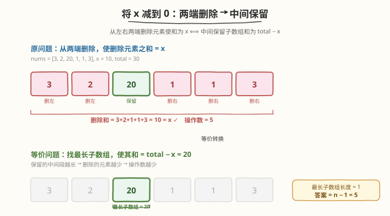
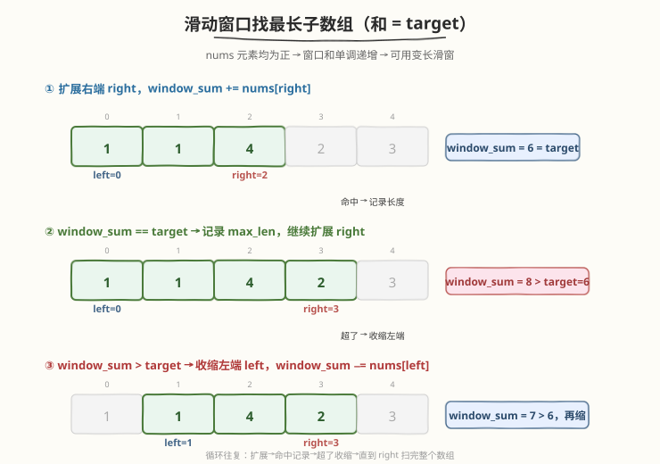

# LeetCode 将x减到0的最小操作数 题解

## 1. 题目概述

- **标题 / 题号**：将x减到0的最小操作数（#1658，medium）
- **链接**：https://leetcode.cn/problems/minimum-operations-to-reduce-x-to-zero/
- **难度**：中等
- **标签**：数组、滑动窗口、前缀和

**题意**：给你一个整数数组 `nums` 和一个整数 `x`。每一次操作时，你可以移除数组 `nums` **最左边**或**最右边**的元素，并从 `x` 中减去该元素的值。注意，数组在移除元素后会改变。

返回**最小操作数**，使得 `x` 恰好减到 `0`；如果无法做到，返回 `-1`。

**示例 1**：

```text
输入：nums = [1,1,4,2,3], x = 5
输出：2
解释：移除最后两个元素 [2,3]，2+3 = 5 = x，操作数 = 2。
```

**示例 2**：

```text
输入：nums = [5,6,7,8,9], x = 4
输出：-1
解释：数组中没有任何元素 ≤ 4，无法将 x 减到 0。
```

**示例 3**：

```text
输入：nums = [3,2,20,1,1,3], x = 10
输出：5
解释：移除左端 [3,2]（和 5）+ 右端 [1,1,3]（和 5），合计 10 = x，操作数 = 5。
```

**约束**：

- $1 \leq \text{nums.length} \leq 10^5$
- $1 \leq \text{nums}[i] \leq 10^4$
- $1 \leq x \leq 10^9$

> 💡 关键约束是「**只能从两端删除**」与「**元素均为正**」。前者意味着删除的元素在数组中构成一个「左前缀 + 右后缀」的拼接段，中间留下一段连续子数组；后者保证窗口和的单调性，使变长滑动窗口可行。

## 2. 解题思路

### 2.1 暴力思路：枚举左删几个、右删几个

设左删 $l$ 个、右删 $r$ 个（$l + r$ 即操作数），则需满足前 $l$ 个元素之和加后 $r$ 个元素之和等于 $x$。暴力枚举 $l \in [0, n]$，对每个 $l$ 再枚举 $r$，总时间 $O(n^2)$。$n \leq 10^5$ 时不可行。

### 2.2 核心观察：两端删除 ⟺ 中间保留



关键洞察是：**从左右两端删除的元素之和为 $x$，等价于中间保留的连续子数组之和为 $\text{total} - x$**。

设 $\text{total} = \sum \text{nums}[i]$，令 $\text{target} = \text{total} - x$：

- 删除元素和 $= x$ ⟺ 保留子数组和 $= \text{total} - x = \text{target}$
- **最小化操作数**（删除元素个数）⟺ **最大化保留子数组长度**

于是问题转化为：**在 `nums` 中找和为 `target` 的最长连续子数组**。若最长长度为 `max_len`，则答案为 $n - \text{max\_len}$。

> ⚠️ **边界**：若 $\text{target} < 0$（即 $x > \text{total}$，删完都不够），直接返回 $-1$；若 $\text{target} = 0$（即 $x = \text{total}$，需删完整个数组），答案为 $n$。

### 2.3 算法流程：变长滑动窗口



由于 $\text{nums}[i] \geq 1$（均为正数），窗口和随 `right` 扩展单调递增，随 `left` 收缩单调递减，因此可用**变长滑动窗口** $O(n)$ 求解：

1. 计算 $\text{total} = \sum \text{nums}$，$\text{target} = \text{total} - x$。
2. 若 $\text{target} < 0$，返回 $-1$。
3. 初始化 `left = 0`，`window_sum = 0`，`max_len = -1`（$-1$ 表示尚未找到）。
4. 遍历 `right` 从 $0$ 到 $n-1$：
   - **扩展右端**：`window_sum += nums[right]`
   - **收缩左端**：当 `window_sum > target` 且 `left <= right` 时，`window_sum -= nums[left]`，`left++`
   - **命中记录**：若 `window_sum == target`，更新 `max_len = max(max_len, right - left + 1)`
5. 若 `max_len == -1`，返回 $-1$；否则返回 $n - \text{max\_len}$。

> 💡 **为什么正数是滑窗的前提？** 若数组含负数，窗口和不再单调，`window_sum > target` 时不能贪心收缩左端（收缩后和可能反而增大）。本题 $\text{nums}[i] \geq 1$ 天然满足单调性，是变长滑窗的甜区。

### 2.4 示例演算

![示例演算：nums=[1,1,4,2,3], x=5](../images/reduce_x_example_walkthrough.svg)

以**示例 1** `nums = [1,1,4,2,3], x = 5` 为例，$\text{total} = 11$，$\text{target} = 6$：

| 步骤 | right | 窗口元素 | window_sum | 动作 | max_len |
|------|-------|----------|-----------|------|---------|
| 1 | 0 | [1] | 1 | < target，继续 | -1 |
| 2 | 1 | [1,1] | 2 | < target，继续 | -1 |
| 3 | 2 | [1,1,4] | 6 | == target，记录 len=3 | 3 |
| 4 | 3 | [1,1,4,2]→缩→[4,2] | 8→6 | > target，缩两次，== target，len=2 | 3 |
| 5 | 4 | [4,2,3]→缩→[2,3] | 9→5 | > target，缩一次，< target | 3 |

最终 `max_len = 3`（子数组 `[1,1,4]`），答案 $= 5 - 3 = 2$。

## 3. 参考代码

### C++

```cpp
class Solution {
public:
    int minOperations(vector<int>& nums, int x) {
        int total = accumulate(nums.begin(), nums.end(), 0);
        int target = total - x;
        if (target < 0) return -1;
        if (target == 0) return nums.size();
        int n = nums.size();
        int max_len = -1, window_sum = 0, left = 0;
        for (int right = 0; right < n; ++right) {
            window_sum += nums[right];
            while (window_sum > target && left <= right) {
                window_sum -= nums[left];
                ++left;
            }
            if (window_sum == target) {
                max_len = max(max_len, right - left + 1);
            }
        }
        return max_len == -1 ? -1 : n - max_len;
    }
};
```

### Python

```python
class Solution:
    def minOperations(self, nums: List[int], x: int) -> int:
        total = sum(nums)
        target = total - x
        if target < 0:
            return -1
        if target == 0:
            return len(nums)
        max_len = -1
        window_sum = 0
        left = 0
        for right, val in enumerate(nums):
            window_sum += val
            while window_sum > target and left <= right:
                window_sum -= nums[left]
                left += 1
            if window_sum == target:
                max_len = max(max_len, right - left + 1)
        return -1 if max_len == -1 else len(nums) - max_len
```

## 4. 复杂度分析

| 维度 | 复杂度 | 说明 |
|------|--------|------|
| 时间复杂度 | $O(n)$ | `right` 从 $0$ 遍历到 $n-1$，`left` 最多从 $0$ 推进到 $n-1$，两指针各移动一次，总体线性 |
| 空间复杂度 | $O(1)$ | 仅用常数变量 `total, target, window_sum, left, max_len`；`accumulate` 不额外存数组 |

> 💡 对比暴力 $O(n^2)$，滑动窗口利用「正数单调性 + 两指针各走一次」把双重枚举压成单趟扫描。与 [209. 长度最小的子数组] 是同一套变长滑窗模板，只是那题求**最短**、本题求**最长**，收缩条件与记录条件对称翻转。

## 5. 扩展：前缀和 + 哈希（支持负数）

若数组可能含负数（窗口和不再单调），滑动窗口失效，可改用**前缀和 + 哈希表**：

- 计算前缀和 `pref[i] = nums[0] + … + nums[i-1]`
- 对每个 `i`，查哈希表中是否存在 `pref[i] - target`，若存在则 `j = hash[pref[i] - target]`，子数组 `[j, i)` 和为 `target`，长度 `i - j`
- 哈希表存「每个前缀和首次出现的下标」，保证取最长

```python
def minOperations(self, nums: List[int], x: int) -> int:
    target = sum(nums) - x
    if target < 0:
        return -1
    pref = 0
    seen = {0: 0}          # 前缀和 0 出现在下标 0（空前缀）
    max_len = -1
    for i, val in enumerate(nums, 1):
        pref += val
        if pref - target in seen:
            max_len = max(max_len, i - seen[pref - target])
        if pref not in seen:    # 只存首次出现，保证最长
            seen[pref] = i
    return -1 if max_len == -1 else len(nums) - max_len
```

> 💡 前缀和 + 哈希通用性更强（兼容负数），代价是 $O(n)$ 额外空间。本题元素均为正，两种方法都可行，滑动窗口更省空间。

## 6. 面试要点

1. **如何想到「两端删除 ⟺ 中间保留」这个转化？**

   - 从两端删除的元素在原数组中是「左前缀 + 右后缀」，它们之间夹着一段连续子数组。删除和 $= x$ 意味着保留和 $= \text{total} - x$。最小化删除数 ⟺ 最大化保留长度。这是「正难则反」的经典思路——直接枚举两端组合困难，转化后变成标准的「最长子数组和」问题。

2. **为什么要求元素均为正？**

   - 滑动窗口依赖窗口和的单调性：`right` 右移使和增大，`left` 右移使和减小。若含负数，收缩左端后和可能增大，无法贪心判断何时停止收缩。本题 $\text{nums}[i] \geq 1$ 保证单调，是滑窗可行的前提。

3. **`target < 0` 和 `target == 0` 为什么要单独处理？**

   - `target < 0`（$x > \text{total}$）：删完整个数组都不够减，直接 $-1$，无需进滑窗。`target == 0`（$x = \text{total}$）：需删完所有元素，答案为 $n$；若不单独处理，滑窗中 `window_sum == 0` 只有在空窗口时成立，`max_len` 会记为 $0$，答案 $n - 0 = n$ 其实也对，但单独 return 更清晰且避免 `max_len = -1` 的歧义。

4. **`max_len` 初始化为 $-1$ 而非 $0$ 有什么区别？**

   - $-1$ 表示「从未命中过 target」。若初始化为 $0$，当没有任何子数组和为 target 时会返回 $n - 0 = n$，这是错误答案（应为 $-1$）。用 $-1$ 作为哨兵可以区分「命中长度 $0$（target 为 $0$，已提前返回）」与「从未命中」。

5. **滑动窗口和前缀和+哈希各有什么取舍？**

   - 滑动窗口：$O(n)$ 时间、$O(1)$ 空间，但仅适用于正数数组；前缀和+哈希：$O(n)$ 时间、$O(n)$ 空间，兼容负数。面试中若确认元素为正，优先滑窗；若不确定或题目含负数，用前缀和+哈希。

## 同类练习题

| # | 题目 | 与本题的关联 |
|---|------|-------------|
| 209 | [长度最小的子数组](https://leetcode.cn/problems/minimum-size-subarray-sum/) | 同为变长滑窗求和，但求「最短」而非「最长」，收缩与记录条件对称翻转 |
| 713 | [乘积小于 K 的子数组](https://leetcode.cn/problems/subarray-product-less-than-k/) | 变长滑窗维护乘积并计数，同为「正数单调性 + 双指针」范式 |
| 325 | [和等于 K 的最长子数组](https://leetcode.cn/problems/maximum-size-subarray-equal-k/) | 前缀和+哈希求最长子数组（支持负数），本题的通用版本 |
| 560 | [和为 K 的子数组](https://leetcode.cn/problems/subarray-sum-equals-k/) | 前缀和+哈希计数子数组个数，同套路不同问法 |
