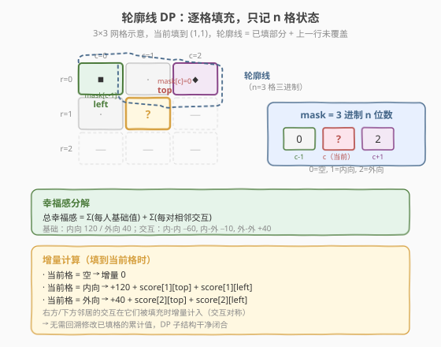
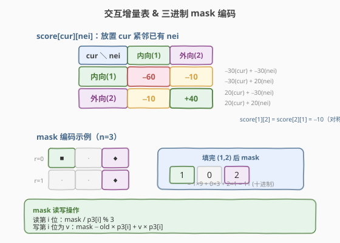
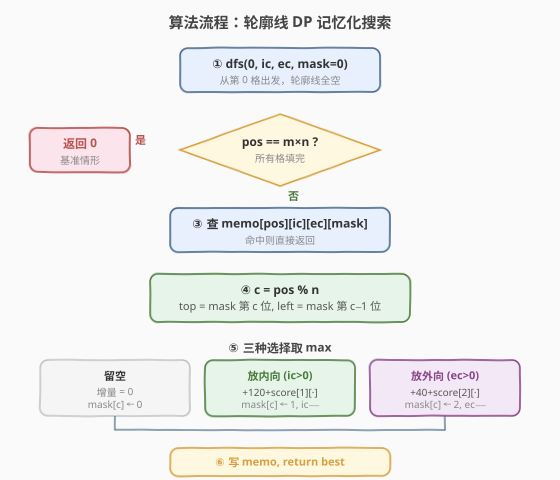
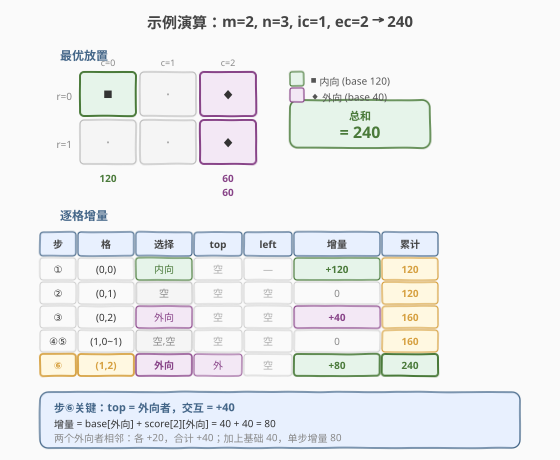

# 最大化网格幸福感

- **题目名称**：最大化网格幸福感
- **链接**：[1659. 最大化网格幸福感](https://leetcode.cn/problems/maximize-grid-happiness/)
- **难度**：困难
- **标签**：动态规划、状态压缩、轮廓线 DP

## 1. 题目概述

给定一个 $m \times n$ 网格，以及 `introvertsCount` 个**内向者**和 `extrovertsCount` 个**外向者**。为每个人分配一个网格单元（不必全部分配），使网格幸福感总和最大。

每个人的幸福感规则：

| 类型 | 初始幸福感 | 每有一个邻居（上/下/左/右） |
|------|-----------|---------------------------|
| 内向者 | $120$ | $-30$ |
| 外向者 | $40$ | $+20$ |

**示例 1**：

```text
输入：m = 2, n = 3, introvertsCount = 1, extrovertsCount = 2
输出：240
解释：内向者放 (1,1)，外向者放 (1,3) 和 (2,3)。
  内向者 (1,1)：120 − 0×30 = 120（0 位邻居）
  外向者 (1,3)： 40 + 1×20 = 60 （1 位邻居）
  外向者 (2,3)： 40 + 1×20 = 60 （1 位邻居）
  总和 = 120 + 60 + 60 = 240
```

**示例 2**：

```text
输入：m = 3, n = 1, introvertsCount = 2, extrovertsCount = 1
输出：260
解释：内向者放 (1,1) 和 (3,1)，外向者放 (2,1)。
  内向者 (1,1)：120 − 1×30 = 90
  外向者 (2,1)： 40 + 2×20 = 80
  内向者 (3,1)：120 − 1×30 = 90
  总和 = 90 + 80 + 90 = 260
```

**示例 3**：

```text
输入：m = 2, n = 2, introvertsCount = 4, extrovertsCount = 0
输出：240
```

**约束条件**：

- $1 \leq m, n \leq 5$
- $0 \leq \text{introvertsCount}, \text{extrovertsCount} \leq \min(m \times n, 6)$

> 💡 网格至多 $5 \times 5 = 25$ 格，每种人至多 6 个。数据规模极小，指向**状态压缩 DP**。关键在于如何设计状态，使得「相邻格之间的交互」被正确地增量计入。

---

## 2. 解题思路

### 2.1 暴力思路：枚举所有放置方案

每格有 3 种选择（空 / 内向 / 外向），共 $3^{m \times n}$ 种方案。$m = n = 5$ 时 $3^{25} \approx 8.5 \times 10^{11}$，远超时限。需要利用**子结构**压缩搜索空间。

### 2.2 核心观察：幸福感分解 + 轮廓线 DP



#### 观察一：幸福感可分解为「基础值 + 配对交互」

每个人贡献一份**基础幸福感**（内向 $120$，外向 $40$），每对**相邻**的人贡献一份**交互增量**。交互是**对称**的——放置 A 时 B 已就位，A 的出现同时改变 A 和 B 的幸福感：

| 当前放置 \ 已有邻居 | 内向 | 外向 |
|---------------------|------|------|
| **内向** | $-30 + (-30) = -60$ | $-30 + 20 = -10$ |
| **外向** | $20 + (-30) = -10$ | $20 + 20 = +40$ |

> 💡 **为什么能分解？** 总幸福感 $=$ 每人基础值之和 $+$ 每对相邻交互之和。验证：内向者 $A$ 与外向者 $B$ 相邻时，$A$ 的幸福感 $= 120 - 30$（因 $B$ 是邻居），$B$ 的 $= 40 + 20$（因 $A$ 是邻居），合计 $= 120 + 40 + (-30 + 20) = 160 + (-10)$。基础值 $120 + 40 = 160$，交互 $-10$，与表中一致 ✓。分解后，放置时只需累加「当前格基础值」与「与上方、左方已填邻居的交互」。

#### 观察二：轮廓线 DP —— 只需记住「上一行 + 当前行已填部分」

逐格从左到右、从上到下填充。填到格 $(r, c)$ 时，影响该格的**已填邻居**只有两个：

- **上方** $(r-1, c)$：来自上一行
- **左方** $(r, c-1)$：来自当前行已填部分

右方和下方尚未填充，其交互会在**未来填充时**增量计入（因为交互对称，放置新格时同时为双方结算）。

于是只需维护一条**轮廓线**——长度为 $n$ 的三进制数，记录「当前行已填部分 $+$ 上一行未覆盖部分」的每格状态（$0$=空，$1$=内向，$2$=外向）。



当位于格 $(r, c)$ 时，轮廓线 `mask` 的第 $c$ 位是上方邻居、第 $c-1$ 位是左方邻居（$c > 0$ 时）。做出选择后，将第 $c$ 位更新为该选择，推进到下一格——轮廓线自然滑动。

$$
\text{dp}(pos,\; ic,\; ec,\; mask) = \max \text{幸福感}
$$

其中 $pos$ 为当前格序号（$0 \sim m \times n - 1$），$ic/ec$ 为剩余内向/外向名额，$mask$ 为 $n$ 位三进制轮廓线。

### 2.3 算法流程图



流程要点：

1. **初始化**：`dfs(0, introvertsCount, extrovertsCount, 0)`，即从第 0 格出发，两类名额满额，轮廓线全空。
2. **提取邻居**：从 `mask` 取第 $c$ 位 `top`、第 $c-1$ 位 `left`。
3. **三种选择**：
   - **空**：不增幸福感，`mask` 第 $c$ 位置 $0$，名额不变。
   - **内向**（若 $ic > 0$）：$+120 + \text{score}[1][top] + \text{score}[1][left]$，$ic - 1$，`mask` 第 $c$ 位置 $1$。
   - **外向**（若 $ec > 0$）：$+40 + \text{score}[2][top] + \text{score}[2][left]$，$ec - 1$，`mask` 第 $c$ 位置 $2$。
4. **记忆化**：四元组 $(pos, ic, ec, mask)$ 唯一标识子问题，命中直接返回。
5. **终止**：$pos = m \times n$ 时返回 $0$。

> ⚠️ **维度优化**：为缩小 `mask` 取值范围，令 $n$ 为较短边。若 $n > m$ 则交换 $m, n$（网格旋转不影响幸福感）。$n \leq 5$ 时 $3^n \leq 243$，状态空间 $\leq 25 \times 7 \times 7 \times 243 \approx 3 \times 10^5$。

### 2.4 示例演算

以示例 1 `m=2, n=3, ic=1, ec=2` 为例，最优放置路径如下（`■`=内向，`◆`=外向，`·`=空）：



逐格填充过程（处理顺序 $(0,0) \to (0,1) \to (0,2) \to (1,0) \to (1,1) \to (1,2)$）：

| 步 | 格 | 选择 | top | left | 增量幸福感 | mask（3 进制） | 累计 |
|----|----|------|------|-------|-----------|---------------|------|
| ① | (0,0) | 内向 | 空(0) | — | $120 + 0 + 0 = 120$ | `[1,0,0]` = 9 | 120 |
| ② | (0,1) | 空 | 空(0) | 内(1) | $0$ | `[0,0,0]` = 0 | 120 |
| ③ | (0,2) | 外向 | 空(0) | 空(0) | $40 + 0 + 0 = 40$ | `[0,0,2]` = 2 | 160 |
| ④ | (1,0) | 空 | 内(1) | — | $0$ | `[0,0,2]` = 2 | 160 |
| ⑤ | (1,1) | 空 | 空(0) | 空(0) | $0$ | `[0,0,2]` = 2 | 160 |
| ⑥ | (1,2) | 外向 | 外(2) | 空(0) | $40 + 40 + 0 = 80$ | `[0,0,2]` = 2 | **240** |

> 💡 **增量验证**：步⑥放置外向者时，`top`=外向者，交互 $= +40$（双双各 $+20$）。加上基础 $40$，增量 $= 80$。最终总和 $120 + 40 + 80 = 240$ ✓。

---

## 3. 参考代码

### C++

```cpp
class Solution {
  public:
    int getMaxGridHappiness(int m, int n, int introvertsCount, int extrovertsCount) {
        if (n > m) swap(m, n); // 保证 n 为短边，缩小 mask

        int score[3][3] = {
            {0, 0, 0},
            {0, -60, -10},
            {0, -10, 40}
        };
        int baseVal[3] = {0, 120, 40};

        int p3[6];
        p3[0] = 1;
        for (int i = 1; i <= n; ++i) p3[i] = p3[i - 1] * 3;
        int maxMask = p3[n];

        int total = m * n;
        vector<vector<vector<vector<int>>>> memo(
            total + 1,
            vector<vector<vector<int>>>(
                introvertsCount + 1,
                vector<vector<int>>(
                    extrovertsCount + 1,
                    vector<int>(maxMask, -1))));

        function<int(int, int, int, int)> dfs = [&](int pos, int ic, int ec, int mask) -> int {
            if (pos == total) return 0;
            int &res = memo[pos][ic][ec][mask];
            if (res != -1) return res;

            int c = pos % n;
            int top  = (mask / p3[c]) % 3;
            int left = c > 0 ? (mask / p3[c - 1]) % 3 : 0;

            int mask0 = mask - top * p3[c]; // 第 c 位置 0

            // 选择 0：留空
            res = dfs(pos + 1, ic, ec, mask0);

            // 选择 1：放内向者
            if (ic > 0) {
                int gain = baseVal[1] + score[1][top] + score[1][left];
                res = max(res, gain + dfs(pos + 1, ic - 1, ec, mask0 + p3[c]));
            }

            // 选择 2：放外向者
            if (ec > 0) {
                int gain = baseVal[2] + score[2][top] + score[2][left];
                res = max(res, gain + dfs(pos + 1, ic, ec - 1, mask0 + 2 * p3[c]));
            }
            return res;
        };

        return dfs(0, introvertsCount, extrovertsCount, 0);
    }
};
```

### Python

```python
class Solution:
    def getMaxGridHappiness(self, m: int, n: int,
                            introvertsCount: int, extrovertsCount: int) -> int:
        if n > m:
            m, n = n, m  # 保证 n 为短边，缩小 mask

        # score[cur][nei]：放置 cur 紧邻已有 nei 时的交互增量
        score = [[0, 0, 0],
                 [0, -60, -10],
                 [0, -10, 40]]
        base_val = [0, 120, 40]
        p3 = [3 ** i for i in range(n + 1)]

        from functools import lru_cache

        @lru_cache(None)
        def dfs(pos: int, ic: int, ec: int, mask: int) -> int:
            if pos == m * n:
                return 0
            c = pos % n
            top = (mask // p3[c]) % 3
            left = (mask // p3[c - 1]) % 3 if c > 0 else 0

            mask0 = mask - top * p3[c]  # 第 c 位置 0

            best = dfs(pos + 1, ic, ec, mask0)  # 留空

            if ic > 0:  # 放内向者
                gain = base_val[1] + score[1][top] + score[1][left]
                best = max(best, gain + dfs(pos + 1, ic - 1, ec, mask0 + p3[c]))

            if ec > 0:  # 放外向者
                gain = base_val[2] + score[2][top] + score[2][left]
                best = max(best, gain + dfs(pos + 1, ic, ec - 1, mask0 + 2 * p3[c]))

            return best

        return dfs(0, introvertsCount, extrovertsCount, 0)
```

> 💡 **写法细节**：
> - **三进制编码**：`mask` 的第 $i$ 位取值 $\in \{0, 1, 2\}$，通过 `mask / p3[i] % 3` 读取、`mask - old * p3[i] + new * p3[i]` 更新。比二进制位运算多一层除取余，但 $n \leq 5$ 时开销可忽略。
> - **交互表对称**：`score[cur][nei]` 按「基础 + 双方变化」预计算，`score[1][2] = score[2][1] = -10`。放置时只需查表两次（top、left），无需分别调整邻居已累计的幸福感。
> - **维度交换**：`if (n > m) swap(m, n)` 使轮廓线宽度 $= \min(m, n)$，最坏 $3^5 = 243$ 而非 $3^5$（两者相同但保证 $n \leq m$ 更稳妥）。

---

## 4. 复杂度分析

| 维度 | 复杂度 | 说明 |
|------|--------|------|
| 时间复杂度 | $O(m \cdot n \cdot ic \cdot ec \cdot 3^{n})$ | 状态数 $= m \cdot n \times (ic+1) \times (ec+1) \times 3^{n}$，每状态 $O(1)$ 三选一转移 |
| 空间复杂度 | $O(m \cdot n \cdot ic \cdot ec \cdot 3^{n})$ | 记忆化数组大小；$m,n \le 5,\; ic,ec \le 6$ 时约 $3 \times 10^5$ |

> 💡 最坏情况 $m = n = 5,\; ic = ec = 6$：状态数 $= 25 \times 7 \times 7 \times 243 = 297{,}675$，远在毫秒级以内。若不交换维度使 $n = 5$，结果相同；交换仅在不规则输入时有益。

---

## 5. 扩展：三进制 vs 二进制编码

本题每格有 3 种状态，自然用**三进制**编码轮廓线。但也可用**两位二进制**（`00`=空，`01`=内向，`10`=外向），以 `mask >> (2*c) & 3` 读取。二者优劣：

| 方案 | mask 上限 | 位运算友好 | 适用场景 |
|------|----------|-----------|---------|
| 三进制 | $3^n - 1$ | 需除取余 | 状态数最优，$n$ 较大时省空间 |
| 二进制（2 bit/格） | $2^{2n} - 1$ | 位移与按位与 | C++ 中 `int` 可容纳 $2 \times 5 = 10$ 位，操作更快 |

$n = 5$ 时三进制 $243$ vs 二进制 $1024$，三进制省 $4\times$ 空间。但 $n$ 小时二者均可，本题选择三进制更紧凑。

---

## 6. 面试要点

1. **为什么幸福感能分解为「基础值 + 配对交互」？**

   - 每人的幸福感 $=$ 基础值 $+$「每位邻居带来的增/减」。将总和对所有人求和，每对邻居的交互被计算两次（各算一次），恰好等于「基础值之和 $+$ 配对交互之和」。分解后，放置新格时只需查表累加与已有邻居的交互，无需回溯修改邻居已累计的值。

2. **轮廓线 DP 为什么只需记住 $n$ 格而非整行历史？**

   - 逐格左到右、上到下填充时，当前格只受**上方**和**左方**两个已填邻居影响。左方在同行已填部分，上方在上一行——它们恰好是轮廓线上的两个位置。下方和右方的交互在**未来填充时**增量计入（交互对称）。因此 $n$ 格的轮廓线足以闭合状态。

3. **三进制 mask 如何读取和更新某一位？**

   - 读取第 $i$ 位：`mask / p3[i] % 3`（`p3[i] = 3^i`）。更新第 $i$ 位为 $v$：先减去旧值 `mask - old * p3[i]`，再加新值 `+ v * p3[i]`。比二进制多了除取余，但 $n \le 5$ 时常数极小。

4. **为什么要交换 $m$ 和 $n$ 使 $n$ 为短边？**

   - 轮廓线宽度 $= n$（列数），状态空间含 $3^n$ 因子。令 $n = \min(m, n)$ 最小化 $3^n$。网格旋转 $90°$ 不改变任意两人间的相邻关系，幸福感不变，故可安全交换。

5. **与经典状压 DP（如 1349. 公园座位）有何区别？**

   - 经典状压 DP 通常**逐行**转移，`mask` 表示整行状态，行间用 $3^n \times 3^n$ 双重枚举。本题用**逐格**轮廓线 DP，`mask` 只含 $n$ 格且每步只更新一位，转移 $O(1)$——状态更细粒度但单次转移更轻，总复杂度更低。

---

## 7. 同类练习题

- [1349. 参加考试的最大学生数](https://leetcode.cn/problems/maximum-students-taking-exam/)：经典**逐行状压 DP**，二进制 mask 表示一行座位，行间兼容性判定——对照本题逐格轮廓线的粒度差异
- [526. 优美的排列](https://leetcode.cn/problems/beautiful-arrangement/)（[题解](../0401-0500/526_优美的安排.md)）：状态压缩 DP 入门（bitmask 记已用集合），$n \le 15$ 甜区，与本题同属「小数据 $\to$ 状压」范式
- [1655. 行分配重制](https://leetcode.cn/problems/distribute-repeating-integers/)：将物品分配到集合的状压 DP，子集枚举转移——另一种 mask 使用方式
- [187. 重复的DNA序列](https://leetcode.cn/problems/repeated-dna-sequences/)（[题解](../0101-0200/187_重复的DNA序列.md)）：位编码 + 滚动哈希，与本题三进制编码轮廓线的思想相通（将状态压缩为整数）
- [165. 比较版本号](https://leetcode.cn/problems/compare-version-numbers/)（[题解](../0101-0200/165_比较版本号.md)）：字符串分段处理，非 DP 但同区间间题号，可作题号连续覆盖的衔接参考
