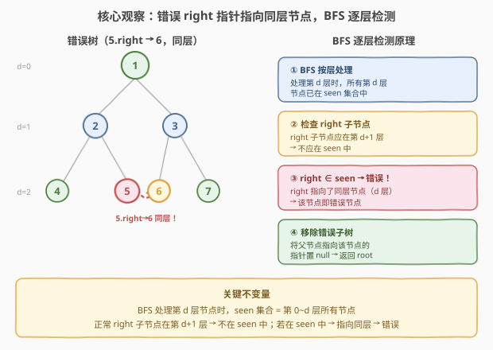
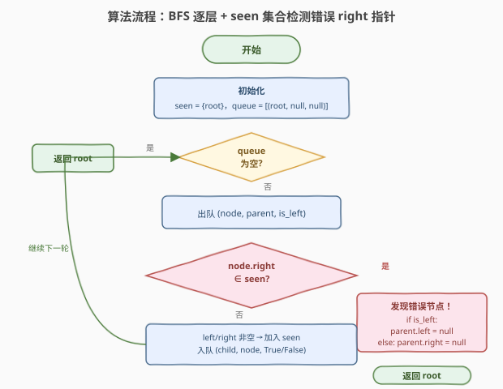
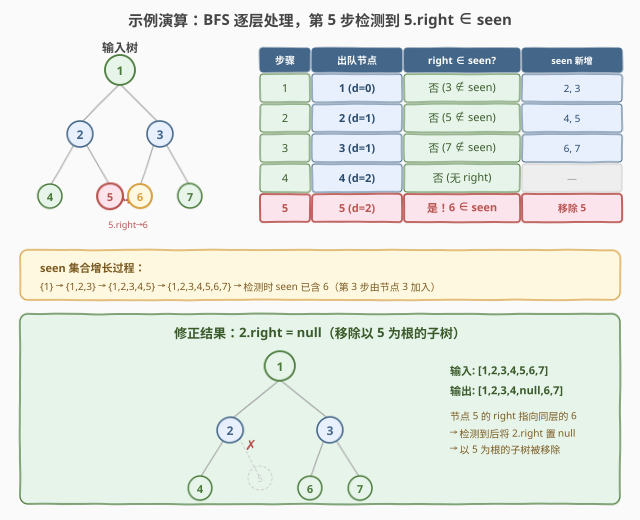

# 纠正二叉树

- **题目名称**：纠正二叉树
- **链接**：[1660. 纠正二叉树](https://leetcode.cn/problems/correct-a-binary-tree/)
- **难度**：中等
- **标签**：树、二叉树、广度优先搜索（BFS）、哈希表

## 1. 题目概述

给定一棵二叉树的根节点 `root`，树中存在**一个错误节点** `u`：它的 `right` 指针被错误地设置为指向树中另一个与 `u` **同一深度**的节点 `v`（而非 `u` 的下一层子节点）。这违反了二叉树的结构约束——子节点应比父节点深一层。

请**纠正**这棵树：检测到错误节点 `u` 后，将 `u` 的父节点指向 `u` 的那条指针置为 `null`，从而移除以 `u` 为根的子树。返回纠正后的根节点。

节点定义（标准 `TreeNode`）：

```cpp
struct TreeNode {
    int val;
    TreeNode* left;
    TreeNode* right;
    TreeNode(int x) : val(x), left(nullptr), right(nullptr) {}
};
```

**示例 1**：

```text
输入：root = [1,2,3]
输出：[1,null,3]

解释：节点 2 的 right 指针错误指向同层的节点 3。

      1                  1
     / \                  \
    2   3   =>             3
     ↘（错误指向 3）
```

**示例 2**：

```text
输入：root = [1,2,3,4,5,6,7]
输出：[1,2,3,4,null,6,7]

解释：节点 5 的 right 指针错误指向同层的节点 6。

        1                  1
       / \                / \
      2   3      =>      2   3
     / \  / \           /    / \
    4  5 6   7          4    6   7
       ↘（错误指向 6）
```

**约束条件**：

- 树中节点数目范围 `[3, 10^5]`（至少 3 个节点，保证存在 2 层以上）
- `-10^9 <= Node.val <= 10^9`
- 所有 `Node.val` **互不相同**
- 树中**恰好一个**节点的 `right` 指针错误

> 💡 本题的精髓在于利用 **BFS 逐层遍历**的特性来检测「同层错误指向」。BFS 处理第 $d$ 层时，所有第 $d$ 层节点已在 `seen` 集合中（由第 $d{-}1$ 层处理时加入）；而正常 `right` 子节点应在第 $d{+}1$ 层——不在 `seen` 中。一旦发现 `right ∈ seen`，即可断定该节点为错误节点。

---

## 2. 解题思路

### 2.1 暴力思路：DFS 记录深度 + 逐一检查

最直觉的做法分两步：

1. **DFS 标注深度**：遍历整棵树，用哈希表记录每个节点的深度 `depth[node] = d`。
2. **逐一检查**：再次遍历，对每个节点 `u`，若 `u.right` 非空且 `depth[u.right] == depth[u]`，则 `u` 为错误节点。

正确但低效——两次遍历 + 额外 $O(n)$ 空间存深度表。更关键的是，**暴力法没有利用 BFS 逐层处理的天然优势**。

> ⚠️ 暴力法的问题在于：它把「检测同层指向」和「遍历」割裂成两个独立步骤。其实 BFS 逐层遍历时，「当前层节点已在 seen 中」这一不变量天然就能区分「同层（错误）」与「下一层（正常）」——无需显式记录深度。

### 2.2 核心观察：BFS 逐层 + seen 集合检测



关键想法来自 [102. 二叉树的层序遍历](../0101-0200/102_二叉树的层序遍历.md) 的 **BFS 模板**——逐层处理，处理第 $d$ 层时把子节点（第 $d{+}1$ 层）加入队列和 `seen` 集合。这产生了一个**关键不变量**：

> **处理第 $d$ 层节点时，`seen` 集合 = 第 $0 \sim d$ 层的所有节点。**

因此：

- **正常情况**：节点 `u`（第 $d$ 层）的 `right` 子节点应在第 $d{+}1$ 层 → **不在** `seen` 中 → 安全通过。
- **错误情况**：节点 `u`（第 $d$ 层）的 `right` 指向同层节点 `v`（第 $d$ 层）→ `v` **已在** `seen` 中（由第 $d{-}1$ 层处理时加入）→ **立即检测到**！

检测到错误节点后，需要将其从父节点上**断开**。为此，BFS 队列中存储三元组 `(node, parent, is_left)`：`parent` 是 `node` 的父节点，`is_left` 标记 `node` 是 `parent` 的左孩子还是右孩子。发现错误时，根据 `is_left` 将 `parent.left` 或 `parent.right` 置 `null`。

> 💡 **为什么 `seen` 在处理第 $d$ 层时已包含所有第 $d$ 层节点？** 因为 BFS 严格按层处理：处理第 $d{-}1$ 层时，会把每个节点的子节点（即第 $d$ 层的全部节点）加入 `seen` 和队列。处理完第 $d{-}1$ 层后，队列中恰好是第 $d$ 层的全部节点，且它们都已在 `seen` 中。所以处理第 $d$ 层的任意节点时，其同层节点（包括错误指向的目标）必然已在 `seen` 中。

> ⚠️ **只需检查 `right` 子节点**：题目明确指出错误出在 `right` 指针上。`left` 子节点不受影响，无需检查。但入队时仍需正常处理 `left` 子节点（它们是合法的下一层节点）。

### 2.3 算法流程图



**完整步骤**：

1. **初始化**：`seen = {root}`，`queue = [(root, null, null)]`（`root` 无父节点）。
2. **while 队列非空**：
   - 出队 `(node, parent, is_left)`。
   - **检测**：若 `node.right` 非空且 `node.right ∈ seen`：
     - 发现错误节点！根据 `is_left`：
       - `is_left == true` → `parent.left = null`
       - `is_left == false` → `parent.right = null`
     - **返回 `root`**（纠正完成）。
   - **入队子节点**：
     - 若 `node.left` 非空：`seen.add(node.left)`，入队 `(node.left, node, true)`。
     - 若 `node.right` 非空：`seen.add(node.right)`，入队 `(node.right, node, false)`。
3. 遍历完未检测到 → 返回 `root`（理论上不会发生，题目保证存在一个错误节点）。

### 2.4 示例演算

以示例 2 `root = [1,2,3,4,5,6,7]`（节点 5 的 `right` 错误指向同层的 6）为例：



| 步骤 | 出队节点 | `right ∈ seen?` | seen 新增 | 说明 |
|------|---------|-----------------|-----------|------|
| 1 | 1 (d=0) | 否（3 ∉ seen） | 2, 3 | 正常：3 在下一层，不在 seen |
| 2 | 2 (d=1) | 否（5 ∉ seen） | 4, 5 | 正常：5 在下一层，不在 seen |
| 3 | 3 (d=1) | 否（7 ∉ seen） | 6, 7 | 6 被加入 seen（3 的左孩子） |
| 4 | 4 (d=2) | 否（无 right） | — | 叶节点，无子节点 |
| 5 | 5 (d=2) | **是！6 ∈ seen** | — | **检测到错误！** 5.right → 6，6 已在第 3 步被加入 seen |

`seen` 集合增长过程：`{1}` → `{1,2,3}` → `{1,2,3,4,5}` → `{1,2,3,4,5,6,7}`。

第 5 步：节点 5（第 2 层）的 `right` 指向节点 6（也在第 2 层）。节点 6 已在第 3 步被节点 3（第 1 层）加入 `seen`。因此 `5.right ∈ seen` → 检测到错误。

修正：`parent = 2`，`is_left = false`（5 是 2 的右孩子）→ `2.right = null` → 返回 `root`。

> 💡 **为什么第 3 步就把 6 加入了 seen？** 因为节点 3 是节点 6 的**合法父节点**（6 是 3 的左孩子），在第 3 步处理节点 3 时正常入队。而节点 5 的 `right` 错误地**也**指向 6——但 6 已经在 `seen` 中了，所以第 5 步检测时立即命中。

> ⚠️ **关键时序**：BFS 严格按层处理，第 1 层（节点 2、3）全部处理完后，第 2 层（节点 4、5、6、7）才进入队列且全部已在 `seen` 中。因此处理第 2 层任意节点时，其同层的所有节点（包括错误指向的目标 6）必然已在 `seen` 中——这就是 BFS 逐层处理的天然优势。

---

## 3. 参考代码

### C++

```cpp
#include <queue>
#include <unordered_set>
using namespace std;

struct TreeNode {
    int val;
    TreeNode* left;
    TreeNode* right;
    TreeNode(int x) : val(x), left(nullptr), right(nullptr) {}
};

class Solution {
  public:
    TreeNode* correctBinaryTree(TreeNode* root) {
        // seen 集合：记录已访问的节点指针
        unordered_set<TreeNode*> seen;
        seen.insert(root);

        // 队列存三元组：(节点, 父节点, 是否左孩子)
        // isLeft: true=左孩子, false=右孩子, 用 char 代替 bool 便于 tuple 存储
        queue<tuple<TreeNode*, TreeNode*, bool>> q;
        q.push({root, nullptr, false});

        while (!q.empty()) {
            auto [node, parent, isLeft] = q.front();
            q.pop();

            // 检测：right 子节点已在 seen 中 → 错误节点
            if (node->right && seen.count(node->right)) {
                if (parent) {
                    if (isLeft)
                        parent->left = nullptr;   // 移除左子树
                    else
                        parent->right = nullptr;  // 移除右子树
                }
                return root;
            }

            // 正常入队子节点，并加入 seen
            if (node->left) {
                seen.insert(node->left);
                q.push({node->left, node, true});
            }
            if (node->right) {
                seen.insert(node->right);
                q.push({node->right, node, false});
            }
        }
        return root;
    }
};
```

### Python

```python
from collections import deque


class Solution:
    def correctBinaryTree(self, root: TreeNode | None) -> TreeNode | None:
        seen: set[TreeNode] = {root}
        # 队列存三元组：(节点, 父节点, 是否左孩子)
        queue: deque[tuple[TreeNode | None, TreeNode | None, bool]] = deque([(root, None, False)])

        while queue:
            node, parent, is_left = queue.popleft()

            # 检测：right 子节点已在 seen 中 → 错误节点
            if node.right and node.right in seen:
                if parent:
                    if is_left:
                        parent.left = None    # 移除左子树
                    else:
                        parent.right = None  # 移除右子树
                return root

            # 正常入队子节点，并加入 seen
            if node.left:
                seen.add(node.left)
                queue.append((node.left, node, True))
            if node.right:
                seen.add(node.right)
                queue.append((node.right, node, False))

        return root
```

> ⚠️ **易错点**：
> - **先检测再入队**：必须在入队子节点**之前**检查 `node.right ∈ seen`。若先入队再检测，会把错误指向的目标节点重复入队，虽然检测仍能命中，但增加了不必要的入队操作。
> - **`seen` 存的是节点引用（指针），不是值**：题目保证值唯一，但存引用更直接——`unordered_set<TreeNode*>` / `set[TreeNode]` 比较的是指针/对象身份，天然不会误判。
> - **`parent` 为 `null` 的边界**：根节点无父节点（`parent = null`），但根节点不可能为错误节点（根在深度 0，无同层节点），所以 `parent` 为 `null` 的分支在实践中不会触发错误检测。保留 `if (parent)` 守卫是防御性编程。
> - **只检查 `right`，不检查 `left`**：题目明确错误在 `right` 指针。检查 `left` 不会出错（`left` 正常指向下一层，不在 `seen` 中），但属于多余操作。

---

## 4. 复杂度分析

| 维度 | 复杂度 | 说明 |
|------|--------|------|
| **时间复杂度** | $O(n)$ | 最坏情况下遍历到错误节点所在层的末尾才检测到，每个节点至多入队/出队一次 |
| **空间复杂度** | $O(n)$ | `seen` 集合存储已访问节点 + BFS 队列存储当前层与下一层节点 |
| **最坏空间** | $O(n)$ | 满二叉树最宽层约 $n/2$ 个节点，队列 + seen 均为 $O(n)$ 量级 |
| **提前终止** | 是 | 检测到错误节点立即返回，不遍历后续层 |

> 💡 **空间优化思路**：若不需要存储 `parent` 信息，可以用哈希表 `parent_map` 替代三元组队列，但空间仍是 $O(n)$。本题的 $O(n)$ 空间无法避免——BFS 天然需要队列，且 `seen` 集合是检测的核心。$n \leq 10^5$ 时 $O(n)$ 空间完全可接受。

> ⚠️ **与 DFS 的对比**：DFS 也能解此题（递归时传入父节点信息 + 全局 `seen` 集合），但 DFS 不保证逐层处理——处理某节点时，同层的其他节点可能尚未加入 `seen`，导致漏检。需先用 DFS 预处理深度表（两遍遍历）。BFS 的优势在于**逐层处理的天然时序**保证了不变量成立，一遍遍历即可。

---

## 5. 扩展：为什么 BFS 的逐层时序是关键

### 5.1 DFS 为什么不能直接用 seen 检测

考虑用 DFS 前序遍历（根→左→右）配合 `seen` 集合：

```
        1
       / \
      2   3
     / \  / \
    4  5 6   7
```

若错误为 `5.right → 6`，DFS 前序访问顺序为 `1 → 2 → 4 → 5 → 6 → 3 → 7`。

处理节点 5 时：`seen = {1, 2, 4, 5}`，而 `6` **尚未被访问**（6 在 3 的子树中，3 还没被访问）。因此 `5.right = 6` 不在 `seen` 中 → **漏检**！

> ⚠️ DFS 的访问顺序是**深度优先**的，同层节点可能间隔很远（如 5 和 6 中间隔了整棵 3 的子树）。处理 5 时，6 可能还没被访问。因此 DFS 无法保证「同层节点已在 `seen` 中」这一不变量。

### 5.2 BFS 逐层处理保证不变量

BFS 的访问顺序是**广度优先**的：先处理完第 $d{-}1$ 层的所有节点（把它们的孩子——第 $d$ 层全部节点——加入 `seen` 和队列），然后才处理第 $d$ 层。因此：

- 处理第 $d$ 层任意节点时，第 $d$ 层的**所有**节点已在 `seen` 中。
- 错误指向的同层目标节点必然已在 `seen` 中 → 一定检测到。

> 💡 **本质区别**：DFS 的 `seen` 只包含「已访问的节点」（深度优先链上的节点），BFS 的 `seen` 包含「已访问层的全部节点」。后者天然覆盖了同层节点，这是 BFS 解此题的根本优势。

### 5.3 变体：若错误可能出现在 left 或 right

若题目改为「某个子节点指针（left 或 right）错误指向同层节点」，只需在检测时同时检查 `left` 和 `right`：

```python
for child, is_left in [(node.left, True), (node.right, False)]:
    if child and child in seen:
        # 检测到错误
        ...
```

BFS 的不变量不变——处理第 $d$ 层时，同层节点已在 `seen` 中，无论检查 `left` 还是 `right` 都能命中。

---

## 6. 面试要点

1. **为什么用 BFS 而不是 DFS？**

   > BFS 的逐层处理保证了关键不变量：处理第 $d$ 层节点时，`seen` 集合已包含第 $0 \sim d$ 层的全部节点。因此错误指向的同层目标节点必然已在 `seen` 中。DFS 深度优先的访问顺序不保证这一点——处理某节点时，同层节点可能尚未被访问，导致漏检。

2. **`seen` 集合在什么时候加入节点？为什么这个时机很重要？**

   > 在处理一个节点时，把它的子节点（`left` 和 `right`）加入 `seen` 和队列。这个时机保证了：处理完第 $d{-}1$ 层后，第 $d$ 层全部节点已在 `seen` 中。若延后加入（如出队时才加入），处理同层后序节点时前序同层节点的孩子可能未在 `seen` 中，但这不影响正确性——因为错误指向的目标是同层节点（由其合法父节点在第 $d{-}1$ 层处理时加入），不是同层节点的孩子。

3. **为什么只检查 `right` 不检查 `left`？**

   > 题目明确指出错误出在 `right` 指针。`left` 指针正常指向下一层子节点，不会指向同层。检查 `left` 不会出错（`left` 不在 `seen` 中），但属于多余操作。若面试官追问「如果错误可能在任意指针」，则需同时检查 `left` 和 `right`。

4. **如何定位错误节点的父节点？**

   > BFS 队列存储三元组 `(node, parent, is_left)`：`parent` 是 `node` 的父节点，`is_left` 标记 `node` 是 `parent` 的左孩子还是右孩子。发现 `node.right ∈ seen` 时，根据 `is_left` 将 `parent.left` 或 `parent.right` 置 `null`，完成移除。

5. **根节点可能是错误节点吗？**

   > 不会。根节点在深度 0，是唯一一个深度为 0 的节点——没有同层节点可以错误指向。因此 `parent = null` 的边界分支在实践中不会触发错误检测，但保留 `if (parent)` 守卫是防御性编程的好习惯。

> 💡 **一句话总结**：1660 题的核心是利用 **BFS 逐层处理的时序不变量**——处理第 $d$ 层时 `seen` 已含全部同层节点——来检测 `right` 指针的同层错误指向。队列存 `(node, parent, is_left)` 三元组以便定位父节点并移除错误子树。一遍 BFS 即可完成检测与纠正，$O(n)$ 时间 + $O(n)$ 空间。

---

## 7. 同类练习题

- [102. 二叉树的层序遍历](https://leetcode.cn/problems/binary-tree-level-order-traversal/)（[题解](../0101-0200/102_二叉树的层序遍历.md)）：BFS `while + for(size)` 模板的母题，本题骨架来源
- [958. 二叉树的完全性检验](https://leetcode.cn/problems/check-completeness-of-a-binary-tree/)（[题解](../0901-1000/958_二叉树的完全性检验.md)）：层序遍历做结构校验，与本题同为「BFS 从遍历走向检测」的典型
- [662. 二叉树最大宽度](https://leetcode.cn/problems/maximum-width-of-binary-tree/)（[题解](../0601-0700/662_二叉树最大宽度.md)）：BFS 逐层 + 节点编号，同属层序遍历应用
- [1609. 奇偶树](https://leetcode.cn/problems/even-odd-tree/)（[题解](1609_奇偶树.md)）：BFS 逐层 + `prev` 滚动比较，同属「逐层处理中当场校验」的 BFS 变体
- [99. 恢复二叉搜索树](https://leetcode.cn/problems/recover-binary-search-tree/)（[题解](../0001-0100/99_恢复二叉搜索树.md)）：另一种「纠正错误树」的思路——BST 用中序遍历找逆序对，对比本题用 BFS 找同层指向
