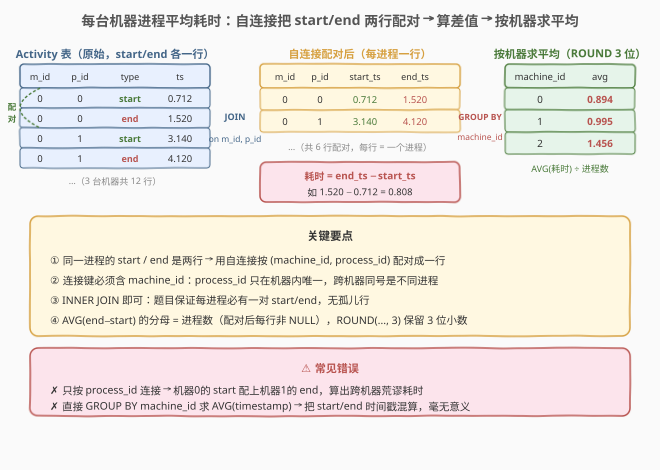
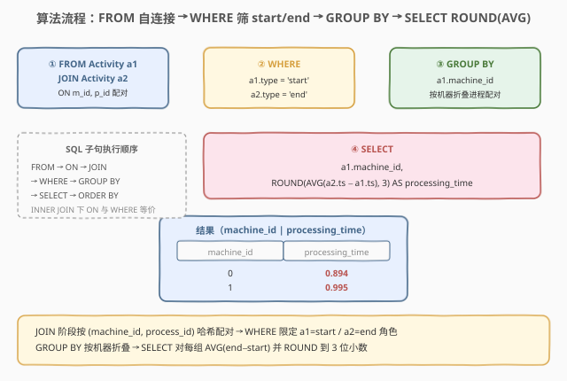
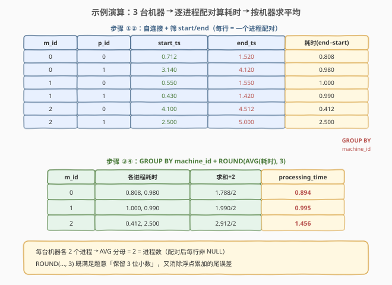

# 每台机器的进程平均运行时间

- **题目名称**：每台机器的进程平均运行时间
- **链接**：[1661. 每台机器的进程平均运行时间](https://leetcode.cn/problems/average-time-of-process-per-machine/)
- **难度**：简单
- **标签**：数据库、SQL、自连接（self-join）、`GROUP BY`、`AVG`、`ROUND`、条件聚合（`CASE`/`MAX`）、配对行折叠

## 1. 题目概述

给定 `Activity`（活动）表，记录工厂中每台机器上每个进程的「开始 / 结束」时间戳。同一台机器、同一个进程一定成对出现一条 `start` 和一条 `end`，且 `start` 时间戳严格小于 `end`。每台机器上运行的进程数相同。编写 SQL 查询，计算**每台机器**完成一个进程的**平均耗时**（`end` 时间戳 − `start` 时间戳的平均值），结果四舍五入保留 3 位小数，返回 `machine_id` 与 `processing_time`。

**表结构**：

```text
Table: Activity
+----------------+---------+
| Column Name    | Type    |
+----------------+---------+
| machine_id     | int     |
| process_id     | int     |
| activity_type  | enum    |  ← ('start', 'end')
| timestamp      | float   |
+----------------+---------+
(machine_id, process_id, activity_type) 是复合主键。
'start' 代表进程开始运行时间戳，'end' 代表进程终止时间戳。
同一机器同一进程必有一对 start/end，且 start < end。
```

**示例 1**：

```text
输入：
Activity 表:
+------------+------------+---------------+-----------+
| machine_id | process_id | activity_type | timestamp |
+------------+------------+---------------+-----------+
| 0          | 0          | start         | 0.712     |
| 0          | 0          | end           | 1.520     |
| 0          | 1          | start         | 3.140     |
| 0          | 1          | end           | 4.120     |
| 1          | 0          | start         | 0.550     |
| 1          | 0          | end           | 1.550     |
| 1          | 1          | start         | 0.430     |
| 1          | 1          | end           | 1.420     |
| 2          | 0          | start         | 4.100     |
| 2          | 0          | end           | 4.512     |
| 2          | 1          | start         | 2.500     |
| 2          | 1          | end           | 5.000     |
+------------+------------+---------------+-----------+

输出:
+------------+-----------------+
| machine_id | processing_time |
+------------+-----------------+
| 0          | 0.894           |
| 1          | 0.995           |
| 2          | 1.456           |
+------------+-----------------+
```

**解释**：

| machine_id | 进程 0 耗时 | 进程 1 耗时 | 计算 | processing_time |
|------------|-------------|-------------|------|-----------------|
| 0 | $1.520 - 0.712 = 0.808$ | $4.120 - 3.140 = 0.980$ | $(0.808 + 0.980) / 2$ | 0.894 |
| 1 | $1.550 - 0.550 = 1.000$ | $1.420 - 0.430 = 0.990$ | $(1.000 + 0.990) / 2$ | 0.995 |
| 2 | $4.512 - 4.100 = 0.412$ | $5.000 - 2.500 = 2.500$ | $(0.412 + 2.500) / 2$ | 1.456 |

3 台机器各运行 2 个进程，每台机器把「各进程 `end − start` 之和」除以「进程数 2」即得平均耗时。

**约束条件**：

- `(machine_id, process_id, activity_type)` 是 `Activity` 表的复合主键——同一机器同一进程不会出现重复的 `start`/`end`。
- 每台机器运行相同数量的进程，且每个进程必有一对 `start`/`end`。
- `start` 时间戳严格小于 `end` 时间戳。
- `processing_time` 四舍五入保留 3 位小数，结果顺序任意。

> 💡 本题是 SQL **"自连接配对 + 分组求平均"招牌题**——核心难点在于「一个进程的开始与结束是两行」，必须先通过自连接（或条件聚合）把同一进程的 `start`/`end` 折叠到同一行算出耗时，再按 `machine_id` 分组求平均。关键是识别出 `activity_type` 是「同一逻辑实体的两种状态行」，需要配对而非各自独立统计。

---

## 2. 解题思路

### 2.1 暴力思路：逐机器逐进程算耗时再求平均

最直觉的过程式思路：遍历每台机器的每个进程，在表里找到对应的 `start` 和 `end` 行，相减得该进程耗时；把同机器所有进程耗时累加再除以进程数，得到该机器的平均耗时。伪代码：

```text
result = []
for each machine_id:
    durations = []
    for each process_id on this machine:
        start_ts = timestamp where activity_type = 'start'
        end_ts   = timestamp where activity_type = 'end'
        durations.append(end_ts - start_ts)
    avg = sum(durations) / len(durations)
    result.append((machine_id, round(avg, 3)))
```

但**纯 SQL 没有显式逐行循环**——"把同一进程的两行折叠成一行算差值"需换成集合式表达。这有两种思路：① **自连接**——把表和自己连接，`ON` 用 `(machine_id, process_id)` 配对，`WHERE` 一侧取 `start`、一侧取 `end`，连接结果每行就是一个进程的「开始 + 结束」配对；② **条件聚合**——先按 `(machine_id, process_id)` 分组，用 `CASE WHEN` 把 `start`/`end` 的 `timestamp` 分到两列，再相减。

### 2.2 核心观察：自连接把 start/end 两行配对成一行



**问题拆解为三个子问题**：

1. **配对 start/end**：`Activity a1 JOIN Activity a2 ON a1.machine_id = a2.machine_id AND a1.process_id = a2.process_id`。把同一进程的两行「拼」成一行——`a1` 取 `start` 行、`a2` 取 `end` 行，连接后每行包含同一进程的开始与结束时间戳。
   - **为什么用 `JOIN`（内连接）而非 `LEFT JOIN`**：题目保证每个 `(machine_id, process_id)` 必有一对 `start`/`end`，不会出现「只有 start 没有 end」的孤儿行。`INNER JOIN` 足矣，且天然过滤掉任何不配对的异常行。若数据可能有缺失（如 end 未记录），则需 `LEFT JOIN` 并处理 `NULL`。
   - **连接键是 `(machine_id, process_id)` 而非仅 `machine_id`**：进程 ID 只在机器内唯一（机器 0 的进程 0 与机器 1 的进程 0 是不同进程），必须机器 + 进程联合才能精确定位同一进程。若只按 `process_id` 连接会把不同机器的同号进程错误配对。

2. **算每个进程的耗时**：`a2.timestamp - a1.timestamp`（`end` − `start`）。配对后的每行都能直接算出差值，得到该进程的运行时长。

3. **按机器分组求平均并保留 3 位小数**：`GROUP BY a1.machine_id` + `ROUND(AVG(a2.timestamp - a1.timestamp), 3)`。`AVG` 把同机器各进程的耗时求平均，`ROUND(..., 3)` 四舍五入到 3 位小数。

> ⚠️ **`AVG` 的分母是进程数，不是行数**：自连接后每行对应一个进程的配对，故 `AVG(end − start)` 的分母恰好是「该机器的进程数」，与题意「总耗时 ÷ 进程数」一致。若误用 `SUM(end − start) / COUNT(*)` 也能得到相同结果（因每进程恰好一行配对），但 `AVG` 语义更直接。

> 💡 **`activity_type` 条件放 `WHERE` 还是 `ON`**：本题 `a1.activity_type = 'start' AND a2.activity_type = 'end'` 放 `WHERE` 或 `ON` 均可——因为是 `INNER JOIN`，两者等价（`INNER JOIN` 的 `ON` 与 `WHERE` 都起过滤作用，无 `LEFT JOIN` 的"保留左表"语义差异）。习惯上配对键放 `ON`、状态筛选放 `WHERE` 更清晰，但合并到 `ON` 也完全正确。这与 1607「`LEFT JOIN` 中条件必须放 `ON`」形成对照——**只有 `LEFT JOIN`/`RIGHT JOIN` 才需区分 `ON` vs `WHERE`**。

### 2.3 算法流程图



**逻辑执行步骤**（注意 SQL 子句执行顺序与书写顺序不同）：

| 步骤 | 子句 | 作用 | 本题对应 |
|------|------|------|----------|
| ① | `FROM Activity a1 JOIN Activity a2 ON ...` | 自连接配对 | 按 `(machine_id, process_id)` 把 start/end 两行拼成一行 |
| ② | `WHERE a1.activity_type='start' AND a2.activity_type='end'` | 筛两侧角色 | `a1` 只留 start 行、`a2` 只留 end 行 |
| ③ | `GROUP BY a1.machine_id` | 按机器分组 | 每台机器折叠成一组（含其全部进程配对） |
| ④ | `SELECT machine_id, ROUND(AVG(a2.ts - a1.ts), 3)` | 求平均并取整 | 组内对各进程耗时求平均，保留 3 位小数 |

> 💡 **SQL 子句执行顺序**：`FROM`（含 `JOIN`/`ON`）→ `WHERE` → `GROUP BY` → `HAVING` → `SELECT` → `ORDER BY` → `LIMIT`。本题 `JOIN` 在 `FROM` 阶段把表和自己笛卡尔积后按 `ON` 过滤成配对行；`WHERE` 再筛 `start`/`end` 角色；`GROUP BY` 把配对行按机器折叠；`SELECT` 阶段对每组求 `AVG`。

### 2.4 示例演算

以示例 1 的 3 台机器、6 个进程（12 行记录）为例，观察「自连接配对 → 算差值 → 按机器求平均」的逐步过程：



**步骤 ①②：自连接 + 筛 start/end（每行 = 一个进程的配对）**

| machine_id | process_id | start_ts (a1) | end_ts (a2) | 耗时 (end − start) |
|------------|------------|---------------|-------------|--------------------|
| 0 | 0 | 0.712 | 1.520 | 0.808 |
| 0 | 1 | 3.140 | 4.120 | 0.980 |
| 1 | 0 | 0.550 | 1.550 | 1.000 |
| 1 | 1 | 0.430 | 1.420 | 0.990 |
| 2 | 0 | 4.100 | 4.512 | 0.412 |
| 2 | 1 | 2.500 | 5.000 | 2.500 |

**步骤 ③④：GROUP BY machine_id + ROUND(AVG(耗时), 3)**

$$\text{processing\_time} = \text{ROUND}\!\left(\frac{\sum (\text{end} - \text{start})}{\text{进程数}},\ 3\right)$$

| machine_id | 各进程耗时 | 求和 | ÷ 进程数 2 | ROUND(, 3) |
|------------|------------|------|-----------|------------|
| 0 | 0.808, 0.980 | 1.788 | 0.894 | 0.894 |
| 1 | 1.000, 0.990 | 1.990 | 0.995 | 0.995 |
| 2 | 0.412, 2.500 | 2.912 | 1.456 | 1.456 |

> 💡 **浮点累加的微小误差**：`0.808 + 0.980` 在 IEEE 754 浮点下可能出现 `1.7880000000000001` 这类尾误差，但 `/ 2 = 0.894` 后 `ROUND(..., 3)` 会修正到 `0.894`。`ROUND` 在此既满足题意「保留 3 位小数」，也起到消除浮点尾误差的作用。生产环境中对金额等敏感数值建议用 `DECIMAL` 定点类型避免累积误差。

---

## 3. 参考代码

### SQL（解法 A：自连接，推荐）

```sql
SELECT a1.machine_id,
       ROUND(AVG(a2.timestamp - a1.timestamp), 3) AS processing_time
FROM Activity a1
JOIN Activity a2
    ON a1.machine_id = a2.machine_id
    AND a1.process_id = a2.process_id
WHERE a1.activity_type = 'start'
  AND a2.activity_type = 'end'
GROUP BY a1.machine_id;
```

> 💡 **写法要点**：
> - **`JOIN Activity a2 ON (machine_id, process_id)`**：自连接，把同一进程的 start/end 两行配对成一行。连接键必须含 `machine_id`——`process_id` 只在机器内唯一。
> - **`WHERE a1.activity_type='start' AND a2.activity_type='end'`**：分别限定 `a1` 取 start 行、`a2` 取 end 行。`INNER JOIN` 下放 `ON` 或 `WHERE` 等价。
> - **`AVG(a2.timestamp - a1.timestamp)`**：组内对各进程耗时求平均，分母 = 进程数（每进程恰好一行配对）。
> - **`ROUND(..., 3)`**：四舍五入到 3 位小数。
> - ✓ **最推荐**：语义清晰，"配对 → 算差 → 求平均"三步一气呵成。

### SQL（解法 B：条件聚合，先配对再求平均）

```sql
SELECT machine_id,
       ROUND(AVG(end_ts - start_ts), 3) AS processing_time
FROM (
    SELECT machine_id,
           process_id,
           MAX(CASE WHEN activity_type = 'start' THEN timestamp END) AS start_ts,
           MAX(CASE WHEN activity_type = 'end'   THEN timestamp END) AS end_ts
    FROM Activity
    GROUP BY machine_id, process_id
) t
GROUP BY machine_id;
```

> 💡 **解法 B 的思路**：子查询先按 `(machine_id, process_id)` 分组，用 `MAX(CASE WHEN activity_type='start' THEN timestamp END)` 把每进程的 `start` 时间戳"提取"到 `start_ts` 列、`end` 时间戳到 `end_ts` 列——每进程折叠成一行且两列都有值。外层再按 `machine_id` 分组对 `end_ts - start_ts` 求 `AVG`。
>
> **`MAX(CASE WHEN ... THEN ... END)` 的原理**：`CASE` 不匹配时返回 `NULL`；每组只有一行满足 `activity_type='start'`，其余为 `NULL`；`MAX` 取非 `NULL` 值即该进程的 start 时间戳（`MAX` 忽略 `NULL`，单值取自身）。用 `MIN` 效果相同（只有一个非 `NULL`）。也可用 `SUM(CASE WHEN ... THEN timestamp ELSE 0 END)`，但 `MAX` 更语义化（不依赖"只有一个匹配行"的隐含假设）。
>
> **与解法 A 的关系**：逻辑等价。解法 A 用连接横向配对，解法 B 用聚合纵向折叠。两者都先得到「每进程一行 + start/end 两列」，再按机器求平均。解法 B 避免自连接的笛卡尔积中间结果，理论上对大表更友好（分组哈希一次即可）；解法 A 更直观易懂。

### SQL（解法 C：`SUM` + `IF` 简写，MySQL 方言）

```sql
SELECT machine_id,
       ROUND(AVG(end_ts - start_ts), 3) AS processing_time
FROM (
    SELECT machine_id,
           process_id,
           SUM(IF(activity_type = 'start', timestamp, 0)) AS start_ts,
           SUM(IF(activity_type = 'end',   timestamp, 0)) AS end_ts
    FROM Activity
    GROUP BY machine_id, process_id
) t
GROUP BY machine_id;
```

> 💡 **解法 C 用 `SUM(IF(...))` 替代 `MAX(CASE WHEN ...)`**：`IF(cond, a, b)` 是 MySQL 方言（等价 `CASE WHEN cond THEN a ELSE b END`）。用 `SUM` + `ELSE 0` 把不匹配行当 0 累加，匹配行只有一行贡献时间戳——结果仍是该进程的时间戳。⚠️ 此写法依赖"每组只有一个 start 和一个 end"，若数据有重复 `start` 行会错误累加；而 `MAX(CASE...)` 取最大值更稳健。**跨数据库用解法 B 的 `CASE WHEN`**，MySQL 专精可用 `IF`。

### Python（pandas）

```python
import pandas as pd

def get_average_time(activity: pd.DataFrame) -> pd.DataFrame:
    start = activity[activity['activity_type'] == 'start']
    end = activity[activity['activity_type'] == 'end']
    merged = start.merge(
        end, on=['machine_id', 'process_id'], suffixes=('_s', '_e')
    )
    merged['duration'] = merged['timestamp_e'] - merged['timestamp_s']
    avg = merged.groupby('machine_id')['duration'].mean().round(3).reset_index()
    avg.columns = ['machine_id', 'processing_time']
    return avg
```

> 💡 **pandas 对照**：
> - `activity[activity['activity_type']=='start']` 对应 `WHERE activity_type='start'`——拆出 start/end 两个子表。
> - `.merge(end, on=['machine_id','process_id'])` 对应 `JOIN Activity a2 ON (machine_id, process_id)`——按进程键配对，`suffixes` 区分两表的同名列 `timestamp`。
> - `merged['timestamp_e'] - merged['timestamp_s']` 对应 `a2.timestamp - a1.timestamp`。
> - `.groupby('machine_id')['duration'].mean()` 对应 `GROUP BY machine_id` + `AVG(...)`。
> - `.round(3)` 对应 `ROUND(..., 3)`。

---

## 4. 复杂度分析

| 维度 | 解法 A（自连接） | 解法 B（条件聚合） | pandas |
|------|------------------|--------------------|--------|
| **时间** | $O(n)$（哈希连接） | $O(n)$（一次分组） | $O(n)$ |
| **空间** | $O(n)$（连接中间表） | $O(n)$（分组哈希表） | $O(n)$ |
| **中间结果** | 自连接产生 $n/2$ 行配对 | 子查询产生 $n/2$ 行 | merge 产生 $n/2$ 行 |
| **可读性** | ✓ 直观 | ✓ 略绕 | — |
| **推荐度** | ✓ **首选** | ✓ 大表友好 | ✓ 验证用 |

> - $n$ = `Activity` 表行数（每进程 2 行，故配对后 $n/2$ 行）。
> - **时间**：解法 A 自连接现代优化器用哈希连接 $O(n)$（按 `(machine_id, process_id)` 哈希一次完成配对）；解法 B 按 `(machine_id, process_id)` 分组一次 $O(n)$，外层再按 `machine_id` 分组 $O(n/2)$，总计 $O(n)$。两者渐近相同，解法 B 避免了自连接的笛卡尔积中间形态，常数因子略小。
> - **空间**：解法 A 自连接中间表含 $n/2$ 行配对（每行两份 `timestamp`）；解法 B 子查询产生 $n/2$ 行（每进程一行）。
> - **索引优化**：在 `Activity(machine_id, process_id, activity_type)` 上建复合索引可让自连接走索引查找；若仅有主键 `(machine_id, process_id, activity_type)`（本题已给定），连接/分组都能利用主键有序性。`activity_type` 是枚举，选择性低，单独建索引意义不大，但作为复合索引尾部列可覆盖查询。

---

## 5. 扩展：自连接 vs 条件聚合的取舍 + `AVG` 语义辨析

### 5.1 自连接 vs 条件聚合：何时用哪个

"把同一实体的多行状态折叠成一行"是 SQL 经典场景。本题 start/end 两行配对即典型。两种通用手法：

| 手法 | 模板 | 适用场景 | 优势 | 劣势 |
|------|------|----------|------|------|
| **自连接** | `T a JOIN T b ON a.k=b.k WHERE a.type='X' AND b.type='Y'` | 状态行数固定且少（2-3 种） | 直观、易读 | 状态多时连接膨胀（3 状态需 2 次连接） |
| **条件聚合** | `MAX(CASE WHEN type='X' THEN val END)` 配 `GROUP BY k` | 状态数不定或较多 | 一次分组搞定、避免多次连接 | 语义略隐晦、需理解 `MAX+CASE` 技巧 |

> 💡 **经验法则**：① 状态固定 2 种且需横向比较（如 start vs end、自连接找"比昨天高"）→ **自连接更直观**；② 状态种类多或不定（如一张表存多种事件类型，需透视成多列）→ **条件聚合更简洁**。本题 2 种状态，两者皆可，解法 A（自连接）更易读故推荐。

### 5.2 `AVG` 的分母到底是什么

`AVG(expr)` 的语义是「`expr` 的非 `NULL` 值之和 ÷ 非 `NULL` 值的个数」。本题自连接后每行 `a2.timestamp - a1.timestamp` 都非 `NULL`（`INNER JOIN` 保证两侧都有值），故 `AVG` 的分母 = 配对行数 = 该机器的进程数，与题意「总耗时 ÷ 进程数」完全吻合。

> ⚠️ **若改用 `LEFT JOIN`**：假设某进程只有 `start` 没有 `end`（异常数据），`LEFT JOIN` 后该行 `a2.timestamp` 为 `NULL`，`a2.timestamp - a1.timestamp` 也为 `NULL`。`AVG` 会**自动跳过 `NULL` 行**——分母变小（不含孤儿进程）。这看似"合理"，但可能不符合业务预期（孤儿进程是否应按 0 或某默认值计入？）。故 **`AVG` 自动忽略 `NULL` 既是便利也是陷阱**：需明确知道分母是"非 NULL 行数"而非"全部行数"。若要分母包含 `NULL` 行，用 `SUM(...) / COUNT(*)`。

### 5.3 连接键为何必须含 `machine_id`

`process_id` 只在**机器内**唯一——机器 0 的进程 0 与机器 1 的进程 0 是两个不同进程。若只按 `process_id` 自连接：

```sql
-- ✗ 错误：只按 process_id 连接，跨机器错误配对
SELECT a1.machine_id, ROUND(AVG(a2.timestamp - a1.timestamp), 3) AS processing_time
FROM Activity a1
JOIN Activity a2 ON a1.process_id = a2.process_id   -- 缺 machine_id！
WHERE a1.activity_type = 'start' AND a2.activity_type = 'end'
GROUP BY a1.machine_id;
```

这会把机器 0 的 start 与机器 1 的 end 错误配对（只要 `process_id` 相同），算出跨机器的荒谬耗时。复合主键 `(machine_id, process_id, activity_type)` 已经暗示：定位一个进程需 `(machine_id, process_id)` 联合，`activity_type` 是该进程的状态维度。**连接键应取能唯一标识逻辑实体的最小列集**——本题逻辑实体是「某机器上的某进程」，即 `(machine_id, process_id)`。

### 5.4 `INNER JOIN` vs `LEFT JOIN` 的选择

| 连接类型 | 行为 | 本题是否合适 |
|----------|------|--------------|
| `INNER JOIN` | 只保留两侧都匹配的行 | ✓ 题目保证每进程有 start/end 配对 |
| `LEFT JOIN` | 保留左表全部行，右表无匹配填 `NULL` | ✗ 多余（无孤儿行），且 `AVG` 跳 `NULL` 改变分母 |

> 💡 题目明确「同一机器同一进程都有一对开始和结束时间戳」，数据完整性有保证，故 `INNER JOIN` 最契合。生产环境中若数据可能不完整（如日志缺失 end 事件），需用 `LEFT JOIN` 并决定如何处理 `NULL`（跳过、按 0、按超时阈值等）。**选择连接类型应基于数据完整性假设**——过度防御（无必要时用 `LEFT JOIN`）反而引入 `NULL` 处理负担。

---

## 6. 面试要点

1. **为什么需要自连接？不能直接 `GROUP BY machine_id` 求 `AVG(timestamp)` 吗？**

   > 因为一个进程的开始和结束是**两行**——`start` 和 `end` 各占一行，`timestamp` 是不同时刻的值。直接 `AVG(timestamp)` 会把 start 和 end 的时间戳混在一起求平均，毫无意义。必须先把同一进程的 start/end 两行**配对到同一行**（通过自连接或条件聚合），算出 `end − start` 的耗时，再按机器分组对耗时求平均。核心是识别"两行属于同一逻辑实体，需先折叠配对"。

2. **自连接的连接键为什么是 `(machine_id, process_id)` 而非仅 `process_id`？**

   > `process_id` 只在机器内唯一——不同机器可能有相同编号的进程（机器 0 的进程 0 与机器 1 的进程 0 是不同进程）。只按 `process_id` 连接会把跨机器的同号进程错误配对。`(machine_id, process_id)` 才能唯一标识一个进程，这是复合主键 `(machine_id, process_id, activity_type)` 的前两列。连接键应取能唯一标识逻辑实体的最小列集。

3. **`WHERE a1.activity_type='start' AND a2.activity_type='end'` 放 `WHERE` 还是 `ON`？**

   > `INNER JOIN` 下两者等价——`INNER JOIN` 的 `ON` 和 `WHERE` 都只起过滤作用，无"保留左表全部行"的语义差异，放哪结果都一样。习惯上配对键放 `ON`、状态筛选放 `WHERE` 更清晰。但**只有 `LEFT JOIN`/`RIGHT JOIN` 才需严格区分 `ON` vs `WHERE`**——`LEFT JOIN` 中 `ON` 决定右表哪些行参与匹配、`WHERE` 决定最终保留哪些行（见 1607）。本题用 `INNER JOIN` 无此纠结。

4. **`AVG(a2.timestamp - a1.timestamp)` 的分母是什么？**

   > 是该机器配对后的**非 `NULL` 行数**，即该机器的进程数。`INNER JOIN` 保证每行 `end − start` 都非 `NULL`，故分母恰好等于进程数，与题意「总耗时 ÷ 进程数」吻合。`AVG` 自动忽略 `NULL`——若改用 `LEFT JOIN` 且有孤儿行，`AVG` 的分母会变小（跳过 `NULL` 行），可能不符合预期，此时应改用 `SUM(...) / COUNT(*)` 显式控制分母。

5. **自连接和条件聚合（`MAX(CASE WHEN ...)`）两种解法有何取舍？**

   > 逻辑等价。自连接把同一进程的两行横向拼成一行，直观易读，适合状态种类少（2-3 种）的场景；条件聚合用 `GROUP BY (machine_id, process_id)` + `MAX(CASE WHEN activity_type='start' THEN timestamp END)` 纵向折叠，一次分组搞定，适合状态种类多或不定的场景（避免多次自连接膨胀）。本题 2 种状态，自连接更易读故首选；大表场景条件聚合常数因子略小。

> 💡 **一句话总结**：1661 是 SQL **"自连接配对 + 分组求平均"** 招牌题——核心模板「`Activity a1 JOIN Activity a2 ON (machine_id, process_id)` → `WHERE a1=start AND a2=end` → `GROUP BY machine_id` → `ROUND(AVG(a2.ts − a1.ts), 3)`」。三大要点：**连接键含 `machine_id`（禁仅 `process_id`）、`INNER JOIN` 即可（题目保证配对完整）、`AVG` 分母即进程数（配对后每行非 `NULL`）**。

---

## 7. 同类练习题

- [197. 上升的温度](https://leetcode.cn/problems/rising-temperature/)（[题解](../0101-0200/197_上升的温度.md)）：自连接跨行比较——`Weather w1 JOIN Weather w2 ON DATEDIFF(w2.recordDate, w1.recordDate)=1` 找比昨天温度高的日期，与 1661 共享"自连接配对两行做差比较"骨架，但 197 是跨日比较、1661 是同进程 start/end 配对
- [1174. 即时食物配送 II](https://leetcode.cn/problems/immediate-food-delivery-ii/)（[题解](../1101-1200/1174_即时食物配送II.md)）：`GROUP BY` + `AVG`/百分比——按顾客分组算首次订单即配送的比例，与 1661 同为"分组后求平均/比率"模板，但 1174 的"首次订单"需子查询取 `MIN`，1661 的"配对耗时"需自连接
- [1211. 查询结果的质量和占比](https://leetcode.cn/problems/queries-quality-and-percentage/)（[题解](../1201-1300/1211_查询结果的质量和占比.md)）：`GROUP BY` + `AVG` + `ROUND`——按 `query_name` 分组算质量均值与劣质率，巩固"分组聚合 + `AVG`/`ROUND`"骨架，比 1661 更直接（无需配对）
- [511. 游戏玩法分析 I](https://leetcode.cn/problems/game-play-analysis-i/)（[题解](../0501-0600/511_游戏玩法分析I.md)）：`GROUP BY` + `MIN`——按玩家分组取首次登录日期，比 1661 更简单（无配对无平均），巩固 `GROUP BY` + 聚合函数骨架
- [608. 树节点](https://leetcode.cn/problems/tree-node/)：自连接 / `CASE WHEN` 判定节点类型——用自连接或条件表达式判断某节点是根/叶/内部节点，与 1661 共享"自连接配对判定"思想，但 608 是父子节点配对、1661 是 start/end 状态配对
