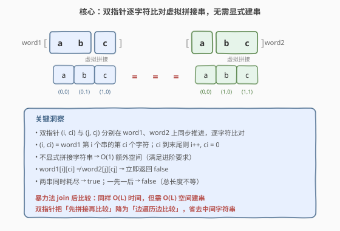
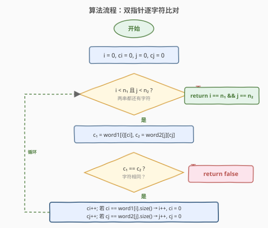
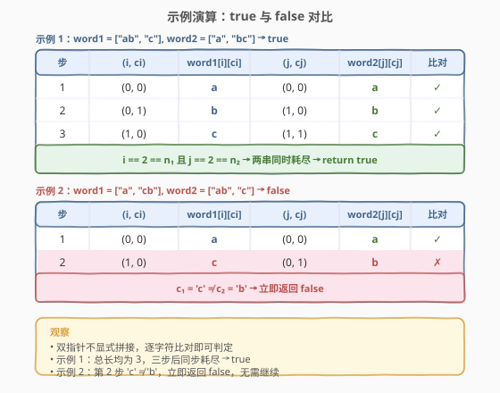

# LeetCode 检查两个字符串数组是否相等 题解

## 1. 题目概述

- **标题 / 题号**：检查两个字符串数组是否相等（#1662，easy）
- **链接**：https://leetcode.cn/problems/check-if-two-string-arrays-are-equivalent/
- **难度**：简单
- **标签**：数组、字符串、双指针

**题意**：给你两个字符串数组 `word1` 和 `word2`。如果两个数组表示的字符串**按顺序拼接**后相同，返回 `true`；否则返回 `false`。

**示例 1**：

```text
输入：word1 = ["ab", "c"], word2 = ["a", "bc"]
输出：true
解释：word1 拼接得 "ab" + "c" = "abc"，word2 拼接得 "a" + "bc" = "abc"。
```

**示例 2**：

```text
输入：word1 = ["a", "cb"], word2 = ["ab", "c"]
输出：false
解释：word1 拼接得 "acb"，word2 拼接得 "abc"，二者不同。
```

**示例 3**：

```text
输入：word1 = ["abc", "d", "defg"], word2 = ["abcddefg"]
输出：true
解释：word1 拼接得 "abc" + "d" + "defg" = "abcddefg"，与 word2 相同。
```

**约束**：

- $1 \leq \text{word1.length}, \text{word2.length} \leq 10^3$
- $1 \leq \text{word1}[i].\text{length}, \text{word2}[i].\text{length} \leq 10^3$
- `word1[i]` 和 `word2[i]` 仅由小写英文字母组成
- `word1` 和 `word2` 中最多只有一个长度为 $1$

> 💡 **进阶要求**：能否用 $O(n)$ 时间和 $O(1)$ 额外空间解决？这里 $n$ 是两数组所有字符串的总字符数 $L$。关键在于**不显式拼接字符串**，而是用双指针逐字符比对。

## 2. 解题思路

### 2.1 暴力思路：拼接后比较

最直观的做法：分别把 `word1` 和 `word2` 的所有字符串拼接成两个完整字符串 `s1` 和 `s2`，再比较 `s1 == s2`。

```python
return "".join(word1) == "".join(word2)
```

时间 $O(L)$，空间 $O(L)$（需建两个拼接字符串）。$L$ 最大可达 $10^3 \times 10^3 = 10^6$，虽然能过，但**不满足进阶的 $O(1)$ 空间要求**。

### 2.2 核心观察：双指针逐字符比对



关键洞察：**拼接后的比较等价于逐字符的同步比较**——无需真正拼出字符串，只需维护两组指针在两个数组上同步前进，每次各取一个字符比对即可。

- **指针状态**：`(i, ci)` 指向 `word1[i][ci]`，`(j, cj)` 指向 `word2[j][cj]`
- **推进规则**：`ci++`；若 `ci` 越过 `word1[i]` 末尾，则 `i++, ci = 0`（跳到下一个字符串的开头）。`word2` 侧同理
- **终止判定**：两串同时耗尽 → `true`；仅一串耗尽 → `false`（总长度不等）；字符不匹配 → `false`

> 💡 这本质上是把两条「逻辑链表」（每个字符串是一个节点，节点内是字符数组）做同步遍历比较，和快慢指针同步推进是同一种结构——都是「两个指针在各自序列上按规则前进，每步做 $O(1)$ 判断」。

### 2.3 算法流程



1. **初始化**：`i = ci = j = cj = 0`
2. **循环**：当 `i < len(word1)` 且 `j < len(word2)` 时：
   - 取 `c1 = word1[i][ci]`，`c2 = word2[j][cj]`
   - 若 `c1 != c2` → 返回 `false`
   - 推进 `word1` 指针：`ci++`；若 `ci == len(word1[i])`，则 `i++, ci = 0`
   - 推进 `word2` 指针：`cj++`；若 `cj == len(word2[j])`，则 `j++, cj = 0`
3. **终止**：返回 `i == len(word1) and j == len(word2)`

> ⚠️ **为什么终止条件是「两串同时耗尽」？** 循环在任一串耗尽时退出。若两串总长度相等，则同时耗尽 → `true`；若长度不等，短串先耗尽、长串还有剩余 → `false`。这一步隐式完成了「长度检查」，无需单独比较总长度。

### 2.4 示例演算



**示例 1** `word1 = ["ab", "c"], word2 = ["a", "bc"]`：

| 步骤 | (i, ci) | word1[i][ci] | (j, cj) | word2[j][cj] | 比对 |
|------|---------|-------------|---------|-------------|------|
| 1 | (0, 0) | a | (0, 0) | a | ✓ |
| 2 | (0, 1) | b | (1, 0) | b | ✓ |
| 3 | (1, 0) | c | (1, 1) | c | ✓ |

三步后 `i = 2 = len(word1)` 且 `j = 2 = len(word2)`，同时耗尽 → `true`。

**示例 2** `word1 = ["a", "cb"], word2 = ["ab", "c"]`：

| 步骤 | (i, ci) | word1[i][ci] | (j, cj) | word2[j][cj] | 比对 |
|------|---------|-------------|---------|-------------|------|
| 1 | (0, 0) | a | (0, 0) | a | ✓ |
| 2 | (1, 0) | c | (0, 1) | b | ✗ |

第 2 步 `'c' ≠ 'b'` → 立即返回 `false`，无需继续比较。

> 💡 **注意示例 2 的指针跳转**：第 1 步比对 `'a' == 'a'` 后，`word1` 侧 `ci` 从 0 增到 1，恰好等于 `len("a") = 1`，于是跳到 `(i=1, ci=0)` 即 `word1[1][0] = 'c'`；而 `word2` 侧 `cj` 从 0 增到 1，仍小于 `len("ab") = 2`，停留在 `(j=0, cj=1)` 即 `word2[0][1] = 'b'`。两侧指针**独立推进**，步调不必一致。

## 3. 参考代码

### C++（双指针 O(1) 空间）

```cpp
class Solution {
public:
    bool arrayStringsAreEqual(vector<string>& word1, vector<string>& word2) {
        int i = 0, ci = 0, j = 0, cj = 0;
        while (i < word1.size() && j < word2.size()) {
            if (word1[i][ci] != word2[j][cj]) return false;
            if (++ci == word1[i].size()) { ++i; ci = 0; }
            if (++cj == word2[j].size()) { ++j; cj = 0; }
        }
        return i == word1.size() && j == word2.size();
    }
};
```

### Python（双指针 O(1) 空间）

```python
class Solution:
    def arrayStringsAreEqual(self, word1: List[str], word2: List[str]) -> bool:
        i = ci = j = cj = 0
        while i < len(word1) and j < len(word2):
            if word1[i][ci] != word2[j][cj]:
                return False
            ci += 1
            if ci == len(word1[i]):
                i += 1
                ci = 0
            cj += 1
            if cj == len(word2[j]):
                j += 1
                cj = 0
        return i == len(word1) and j == len(word2)
```

> 💡 C++ 用 `++ci` 的副作用在一行内完成「自增 + 越界检查」，比 Python 的分步写法更紧凑。两者逻辑完全相同。

### Python（暴力一行，对照用）

```python
class Solution:
    def arrayStringsAreEqual(self, word1: List[str], word2: List[str]) -> bool:
        return "".join(word1) == "".join(word2)
```

## 4. 复杂度分析

| 维度 | 复杂度 | 说明 |
|------|--------|------|
| 时间复杂度 | $O(L)$ | $L = \sum \text{word1}[i].\text{length} + \sum \text{word2}[j].\text{length}$；每组指针各遍历一次，每步 $O(1)$ |
| 空间复杂度 | $O(1)$ | 仅 4 个整型指针变量 `i, ci, j, cj`；暴力法需 $O(L)$ 建拼接串 |

> 💡 对比暴力法的 $O(L)$ 空间，双指针把「先拼接再比较」改为「边遍历边比较」，省去了中间字符串的存储。这在 $L$ 达 $10^6$ 时差异显著。

## 5. 扩展：生成器思路

Python 可用生成器将「逐字符遍历字符串数组」抽象为惰性迭代器，代码更声明式：

```python
from itertools import chain, zip_longest

class Solution:
    def arrayStringsAreEqual(self, word1: List[str], word2: List[str]) -> bool:
        return all(c1 == c2 for c1, c2 in zip_longest(
            chain.from_iterable(word1), chain.from_iterable(word2)))
```

`chain.from_iterable` 将字符串数组展平为字符迭代器，`zip_longest` 逐对比较并在长度不等时用 `None` 填充触发不匹配。时间 $O(L)$，但 `chain` 内部不建完整字符串，空间接近 $O(1)$（迭代器协议开销不计）。不过面试中手写双指针更能展示对边界的掌控力。

## 6. 面试要点

1. **进阶的 $O(1)$ 空间怎么实现？**

   - 用两组指针 `(i, ci)` 和 `(j, cj)` 分别在 `word1` 和 `word2` 上同步推进，逐字符比较 `word1[i][ci]` 与 `word2[j][cj]`。不显式拼接字符串，仅用 4 个整型变量，空间 $O(1)$。

2. **为什么不需要单独比较总长度？**

   - 循环在任一串耗尽时退出。若总长度相等，两串同时耗尽 → `i == n1 && j == n2` 为 `true`；若不等，短串先耗尽 → 条件为 `false`。长度检查被隐式包含在终止判定中。

3. **指针推进的边界条件是什么？**

   - `ci++` 后若 `ci == len(word1[i])`（当前字符串遍历完），则跳到下一个字符串：`i++, ci = 0`。若 `i` 也越界（`i == len(word1)`），说明 `word1` 全部耗尽，循环退出。`word2` 侧完全对称。

4. **暴力法和双指针法各适合什么场景？**

   - 暴力法（`join` + `==`）：代码极简，适合对空间无要求或 $L$ 较小的场景；双指针：满足 $O(1)$ 空间进阶要求，适合 $L$ 很大或内存受限的场景。面试中先说暴力再优化到双指针，展示递进思维。

5. **这道题和哪些「双指针同步遍历」问题是同类？**

   - 本质是两个序列的逐元素同步比对。与 [392. 判断子序列] 的双指针贪心匹配属于同一范式——都是「两个指针在各自序列上按规则前进，每步做 $O(1)$ 判断」。

## 同类练习题

| # | 题目 | 与本题的关联 |
|---|------|-------------|
| 844 | [比较含退格的字符串](https://leetcode.cn/problems/backspace-string-compare/) | 双指针逆向遍历跳过退格后比对，同为「不显式构造字符串」的 $O(1)$ 空间比对 |
| 392 | [判断子序列](https://leetcode.cn/problems/is-subsequence/) | 双指针同步推进贪心匹配，对照本题「等长比对」与「包含关系」的差异 |
| 1507 | [转变日期格式](https://leetcode.cn/problems/reformat-date/) | 字符串 split + join 骨架，对照本题的 join + compare |
| 1614 | [括号嵌套的最大深度](https://leetcode.cn/problems/maximum-nesting-depth-of-the-parentheses/) | 简单字符串单趟扫描，同区间同难度 |
