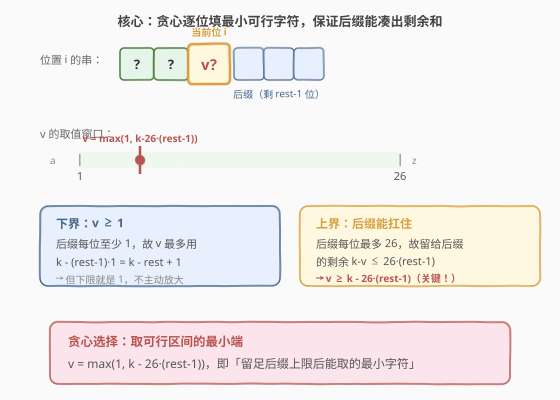
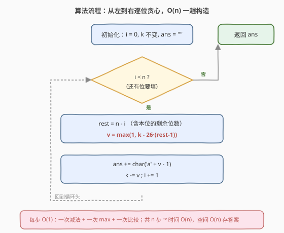
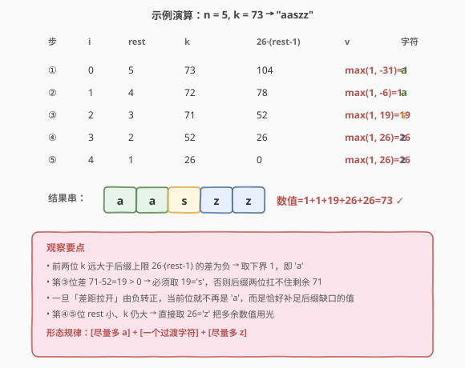

# LeetCode 具有给定数值的最小字符串 题解

## 1. 题目概述

- **标题 / 题号**：具有给定数值的最小字符串（#1663，medium）
- **链接**：https://leetcode.cn/problems/smallest-string-with-a-given-numeric-value/
- **难度**：中等
- **标签**：贪心、字符串

**题意**：小写字符的**数值**为其在字母表中的位置（从 1 开始）：`a=1, b=2, ..., z=26`。字符串的**数值**为各字符数值之和。例如 `"abe"` 的数值 $= 1+2+5 = 8$。

给定两个整数 `n` 和 `k`，返回**长度**等于 `n` 且**数值**等于 `k` 的**字典序最小**字符串。

**示例 1**：

```text
输入：n = 3, k = 27
输出："aay"
解释：1 + 1 + 25 = 27，是数值为 27、长度为 3 的字典序最小串。
```

**示例 2**：

```text
输入：n = 5, k = 73
输出："aaszz"
```

**约束**：

- $1 \leq n \leq 10^5$
- $n \leq k \leq 26 \cdot n$

> 💡 约束 $n \leq k \leq 26n$ 恰好保证解**一定存在**：下界 $k \geq n$ 对应全填 `a`（每位 1），上界 $k \leq 26n$ 对应全填 `z`（每位 26）。在这两个极值之间，任意 $k$ 都能被某个长度 $n$ 的串凑出——这提示我们不必搜索，只需**构造**。

## 2. 解题思路

### 2.1 暴力思路：DFS 回溯枚举

最直白的做法：从左到右逐位试字符，每位从 `'a'` 到 `'z'` 尝试，递归到长度 `n` 且剩余 `k=0` 时返回。配合「字典序最小」只需**按 `a→z` 顺序试、命中即返回**。

```text
dfs(pos, remain):
    if pos == n:  return remain == 0 ? "" : null
    for c in 'a'..'z':
        v = ord(c) - ord('a') + 1
        if v <= remain and remain - v >= 1 * (n - pos - 1):   # 剪枝：后缀能凑出
            res = dfs(pos+1, remain - v)
            if res != null:  return c + res
    return null
```

这样写正确，但最坏要枚举到很深才命中（虽然剪枝让它在「字典序最小」语义下首次命中即返回，实际很快）。问题在于：**我们其实根本不需要试错**——每位该填什么，可以直接算出来。

### 2.2 核心观察：贪心逐位填「最小可行字符」



关键洞察：**字典序最小 = 越靠左的字符越小越好**。于是从左到右逐位贪心：在位置 $i$（0-indexed），设还剩 $\text{rest} = n - i$ 位要填（含本位）、剩余数值为 $k$。当前位取值 $v$ 必须满足**两个可行性约束**：

1. **下界** $v \geq 1$（字符存在）；
2. **上界**：留给后缀 $\text{rest}-1$ 位的数值 $k - v$ 必须落在他们能扛的范围 $[1\cdot(\text{rest}-1),\ 26\cdot(\text{rest}-1)]$ 内。其中下限自动满足（由不变量保证，见下），关键是上限：

$$
k - v \leq 26\cdot(\text{rest}-1) \quad\Longleftrightarrow\quad v \geq k - 26\cdot(\text{rest}-1)
$$

要字典序最小，就取这两个下界的较大值——**可行区间的最小端**：

$$
\boxed{\,v = \max\bigl(1,\ k - 26\cdot(\text{rest}-1)\bigr)\,}
$$

> 💡 **直观理解**：$k - 26\cdot(\text{rest}-1)$ 是「后缀即使全填 `z` 也用不完、必须由本位兜底」的那部分。若它 $\leq 0$，说明后缀全 `z` 就够，本位尽可取最小的 `a`（$v=1$）；若它 $>0$，本位**至少**要承担这部分，否则后缀扛不住。

> ⚠️ **不变量保证下限**：初始 $k \in [n, 26n]$ 即 $k \in [\text{rest}_0, 26\cdot\text{rest}_0]$。每步取上式后，新 $k' = k - v$、新 $\text{rest}' = \text{rest}-1$，可证 $k' \in [\text{rest}', 26\cdot\text{rest}']$ 仍成立——故 $k - v \geq \text{rest}-1$（后缀全 `a` 能凑出）始终自动满足，无需显式约束。

### 2.3 算法流程图



流程要点：

1. **初始化** `i = 0`，`ans` 为空，`k` 保持输入值。
2. **循环** `i` 从 $0$ 到 $n-1$：
   - $\text{rest} = n - i$
   - $v = \max(1,\ k - 26\cdot(\text{rest}-1))$
   - `ans += char('a' + v - 1)`
   - `k -= v`
3. **返回** `ans`（此时 $k$ 恰为 0）。

> 💡 每步只做一次减法、一次 `max`、一次拼接，共 $n$ 步，**无嵌套循环、无回溯**。对比 2.1 的 DFS，本质区别在于：DFS 是「猜一位再验证」，贪心是「直接算出该填什么」——把试错换成了公式。

### 2.4 示例演算



以 `n = 5, k = 73` 为例逐位计算：

| 步 | $i$ | $\text{rest}$ | $k$ | $26\cdot(\text{rest}-1)$ | $v=\max(1,\ k-\cdot)$ | 字符 |
|----|-----|---------------|-----|--------------------------|------------------------|------|
| ① | 0 | 5 | 73 | 104 | $\max(1,-31)=1$ | `a` |
| ② | 1 | 4 | 72 | 78  | $\max(1,-6)=1$  | `a` |
| ③ | 2 | 3 | 71 | 52  | $\max(1,19)=19$ | `s` |
| ④ | 3 | 2 | 52 | 26  | $\max(1,26)=26$ | `z` |
| ⑤ | 4 | 1 | 26 | 0   | $\max(1,26)=26$ | `z` |

结果 `"aaszz"`，数值 $1+1+19+26+26=73$ ✓，与示例 2 一致。

> 💡 **形态规律**：结果总是 `[尽量多的 a] + [至多一个过渡字符] + [尽量多的 z]`。前段 $k$ 充裕、差值为负 → 全 `a`；中段差值由负转正的那一位填过渡值；末段 $\text{rest}$ 小、$k$ 仍大 → 全 `z` 把余额用光。这一形态正是「字典序最小」在数值约束下的必然产物。

## 3. 参考代码

### C++

```cpp
class Solution {
public:
    string getSmallestString(int n, int k) {
        string ans;
        ans.reserve(n);
        for (int i = 0; i < n; i++) {
            int rest = n - i;
            int v = max(1, k - 26 * (rest - 1));
            ans.push_back(char('a' + v - 1));
            k -= v;
        }
        return ans;
    }
};
```

### Python

```python
class Solution:
    def getSmallestString(self, n: int, k: int) -> str:
        ans = []
        for i in range(n):
            rest = n - i
            v = max(1, k - 26 * (rest - 1))
            ans.append(chr(ord('a') + v - 1))
            k -= v
        return "".join(ans)
```

> 💡 **写法细节**：
> - **`reserve(n)` / 预先 `[]`**：避免 `push_back` / `append` 的多次扩容，$O(n)$ 时间内完成拼接。
> - **`char('a' + v - 1)`**：数值 $v$ 到字符的映射，注意是 $v-1$（`a` 对应偏移 0）。
> - **`k -= v` 原地更新**：复用 `k` 作为「剩余数值」，无需额外变量；循环结束时 `k` 恰为 0（由不变量保证）。

## 4. 复杂度分析

| 维度 | 复杂度 | 说明 |
|------|--------|------|
| 时间复杂度 | $O(n)$ | 恰 $n$ 次循环，每次 $O(1)$（一次减法 + 一次 `max` + 一次拼接） |
| 空间复杂度 | $O(n)$ | 存储长度为 $n$ 的答案字符串；不计输出则为 $O(1)$ 额外空间 |

> 💡 $n \leq 10^5$，$O(n)$ 远在时限内。DFS 暴力虽有剪枝、最坏也接近 $O(n)$（每层首次命中），但常数更大且依赖剪枝正确性；公式贪心把「能不能填」直接算成「该填多少」，最稳妥。

## 5. 扩展：等价写法「先全填 a，再从右往左补 z」


换个角度理解同一件事：**每位先都给最小值 1（即 `a`），把多余的 $k - n$ 从右往左尽量塞进各位（每位最多再涨 25 到 `z`）**。从右往左是为了让左侧尽量保持 `a`，从而字典序最小。

```cpp
class Solution {
public:
    string getSmallestString(int n, int k) {
        string ans(n, 'a');        // 全填 a，已用掉 n
        k -= n;                    // 剩余可分配额度，每位最多再 +25
        for (int i = n - 1; i >= 0 && k > 0; i--) {
            int add = min(25, k);  // 本位最多涨到 z
            ans[i] += add;
            k -= add;
        }
        return ans;
    }
};
```

```python
class Solution:
    def getSmallestString(self, n: int, k: int) -> str:
        ans = ['a'] * n
        k -= n
        for i in range(n - 1, -1, -1):
            if k <= 0:
                break
            add = min(25, k)
            ans[i] = chr(ord('a') + add)
            k -= add
        return "".join(ans)
```

> 💡 **两种写法的等价性**：从左到右贪心的公式 $v=\max(1,\ k-26\cdot(\text{rest}-1))$，拆成「基础 1 + 额外 $\max(0,\ k-26\cdot(\text{rest}-1)-1)$」后，额外部分恰好就是「从右往左补」时本位能拿到的额度。两种视角殊途同归：**左侧尽量 `a`、右侧尽量 `z`、中间一个过渡字符**。从右往左的写法不需要 `max` 公式，更易口算，面试中可作为「另一种实现」补充展示。

## 6. 面试要点

1. **为什么贪心是正确的？如何证明？**

   - 用**交换论证**：设贪心解为 $G$、任意最优解为 $O$。在首个不同位置 $i$，贪心取了 $g_i \leq o_i$（贪心取可行区间最小端）。若 $g_i < o_i$，把 $O$ 在 $i$ 位的值降到 $g_i$、并把多出的 $o_i - g_i$ 转移到 $i$ 之后某位（后缀有吸收余量，因为贪心已保证 $k-g_i \leq 26\cdot(\text{rest}-1)$），得到的新串字典序更小且仍合法，与 $O$ 最优矛盾。故 $G = O$。核心是「**左侧取最小不会损害后缀可行性**」。

2. **公式 $v = \max(1,\ k - 26\cdot(\text{rest}-1))$ 中的两项分别来自哪个约束？**

   - `1` 来自字符下界 $v \geq 1$；`k - 26·(rest-1)` 来自后缀上限约束 $k - v \leq 26\cdot(\text{rest}-1)$，即「后缀全 `z` 也只能扛 $26\cdot(\text{rest}-1)$，超出部分必须本位承担」。取二者最大 = 可行区间的最小端。

3. **后缀下限约束 $k - v \geq \text{rest}-1$ 为什么不用显式检查？**

   - 由不变量 $k \in [\text{rest}, 26\cdot\text{rest}]$ 保证。初始成立（题目给 $k \in [n, 26n]$），且取 $v=\max(1,\ k-26\cdot(\text{rest}-1))$ 后新 $k' \in [\text{rest}-1, 26\cdot(\text{rest}-1)]$ 仍成立（分 $v=1$ 与 $v=k-26\cdot(\text{rest}-1)$ 两情形验证）。所以下限自动满足，公式只需管上限。

4. **从右往左补的写法和从左往右贪心等价吗？各自优势？**

   - 等价。从右往左「先全 `a` 再补 `z`」无需 `max` 公式、口算友好、循环可在 $k=0$ 时早停；从左往右「逐位算 $v$」公式更直接对应「字典序最小」的逐位定义、便于讲清可行性约束。面试可先讲从左往右建立正确性直觉，再用从右往左给出更简洁实现。

5. **如果约束改成「字典序最大」怎么改？**

   - 对称处理：从左到右每位取**可行区间的最大端** $v = \min(26,\ k - (\text{rest}-1))$，即「留足后缀下限 1 后能取的最大字符」；或等价地「先全填 `z`，再从右往左把超额降到 `a`」。同一套可行性框架，方向取反即可。

## 同类练习题

| # | 题目 | 与本题的关联 |
|---|------|-------------|
| 1643 | [第K条最小指令](https://leetcode.cn/problems/kth-smallest-instructions/)（[题解](../1601-1700/1643_第K条最小指令.md)） | 同区间同套路——逐位选「最小可行字符」，用组合数 $C(\cdot,\cdot)$ 判定后缀可行性，是本题「可行性窗口」的组合计数版 |
| 60 | [第k个排列](https://leetcode.cn/problems/permutation-sequence/)（[题解](../0001-0100/60_第k个排列.md)） | 康托尔展开逐位定字符，同为「贪心选最小可行 + 后缀计数验证」范式 |
| 1405 | [最长快乐字符串](https://leetcode.cn/problems/longest-happy-string/)（[题解](../1401-1500/1405_最长快乐字符串.md)） | 贪心逐位构造字符串并维护剩余配额，对照本题「数值配额」与该题「连续次数配额」 |
| 316 | [去除重复字母](https://leetcode.cn/problems/remove-duplicate-letters/)（[题解](../0301-0400/316_去除重复字母.md)） | 字典序最小 + 可行性约束（必须包含所有出现过的字符），贪心 + 单调栈，对照本题「数值约束」下的贪心 |
