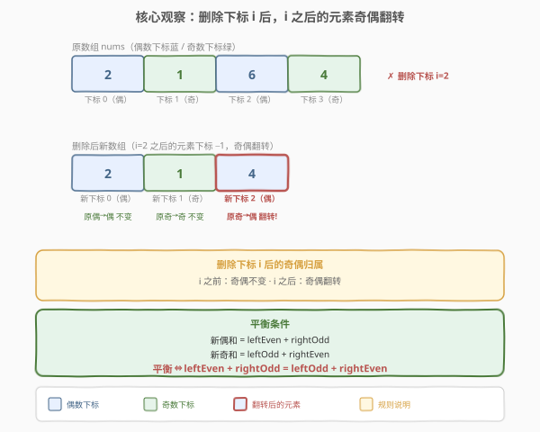
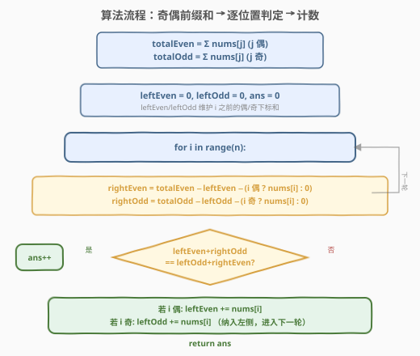
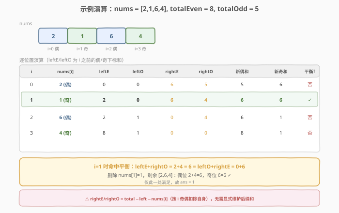

# LeetCode 生成平衡数组的方案数 题解

## 1. 题目概述

- **标题 / 题号**：生成平衡数组的方案数（#1664，medium）
- **链接**：https://leetcode.cn/problems/ways-to-make-a-fair-array/
- **难度**：中等
- **标签**：数组、前缀和、动态规划

**题意**：给定一个整数数组 `nums`，需要选择**恰好一个**下标并删除对应元素（剩余元素下标会因删除而改变）。如果一个数组满足**奇数下标元素之和等于偶数下标元素之和**，则称其为**平衡数组**。返回删除操作后剩余数组成为平衡数组的**方案数**。

**示例 1**：

```text
输入：nums = [2,1,6,4]
输出：1
解释：
删除下标 0：[1,6,4] → 偶位 1+4=5，奇位 6，不平衡。
删除下标 1：[2,6,4] → 偶位 2+4=6，奇位 6，平衡 ✓
删除下标 2：[2,1,4] → 偶位 2+4=6，奇位 1，不平衡。
删除下标 3：[2,1,6] → 偶位 2+6=8，奇位 1，不平衡。
只有 1 种方案。
```

**示例 2**：

```text
输入：nums = [1,1,1]
输出：3
解释：删除任意一个元素，剩余数组都是平衡数组。
```

**示例 3**：

```text
输入：nums = [1,2,3]
输出：0
解释：无论删除哪个元素，剩余数组都不是平衡数组。
```

**约束**：

- $1 \le \text{nums.length} \le 10^5$
- $1 \le \text{nums[i]} \le 10^4$

## 2. 解题思路

### 2.1 暴力思路：枚举删除位置

枚举每个下标 $i$，删除后用 $O(n)$ 重新计算奇位和与偶位和并比较。总时间 $O(n^2)$，$n = 10^5$ 时不可接受。

> 💡 转换视角：删除一个元素后，**它之后的所有元素下标集体减 1**，奇偶性随之**翻转**。抓住这个规律就能在 $O(1)$ 内算出删除任一位置后的奇偶和。

### 2.2 核心观察：删除位置 i 后奇偶翻转



**关键性质**：删除下标 $i$ 后，新数组中：

- **$i$ 之前的元素**：下标不变，奇偶性**不变**。
- **$i$ 之后的元素**：下标减 1，奇偶性**翻转**（原偶位变奇位，原奇位变偶位）。

于是新数组的奇偶和可由原数组的奇偶前缀和拼出：

$$
\text{新偶和} = \text{leftEven} + \text{rightOdd}, \qquad \text{新奇和} = \text{leftOdd} + \text{rightEven}
$$

其中：

- $\text{leftEven} = \sum_{j < i,\ j \text{ 偶}} \text{nums}[j]$（$i$ 之前原偶位和）
- $\text{leftOdd}  = \sum_{j < i,\ j \text{ 奇}} \text{nums}[j]$（$i$ 之前原奇位和）
- $\text{rightEven} = \text{totalEven} - \text{leftEven} - (\text{nums}[i] \text{ 若 } i \text{ 偶})$（$i$ 之后原偶位和）
- $\text{rightOdd}  = \text{totalOdd}  - \text{leftOdd}  - (\text{nums}[i] \text{ 若 } i \text{ 奇})$（$i$ 之后原奇位和）

> ⚠️ 计算 `rightEven` / `rightOdd` 时要**扣除 `nums[i]` 自身**——它被删除了，既不属于左侧也不属于右侧。是否扣除取决于 $i$ 的奇偶：$i$ 为偶则从偶位总量扣除，$i$ 为奇则从奇位总量扣除。

**平衡条件**：

$$
\text{leftEven} + \text{rightOdd} = \text{leftOdd} + \text{rightEven}
$$

### 2.3 算法流程图



整体只需**一次遍历**：用 `leftEven` / `leftOdd` 维护扫描过的偶/奇位前缀和，`rightEven` / `rightOdd` 由总量减去左侧与自身即时推出，无需预存后缀数组——空间 $O(1)$。

### 2.4 示例演算

以**示例 1** `nums = [2,1,6,4]` 为例。原数组偶位（下标 0、2）和 $\text{totalEven} = 2+6 = 8$，奇位（下标 1、3）和 $\text{totalOdd} = 1+4 = 5$。



初始 `leftEven = 0, leftOdd = 0, ans = 0`：

| 步骤 | i | nums[i] | leftEven | leftOdd | rightEven | rightOdd | 新偶和 | 新奇和 | 平衡? |
|------|---|---------|----------|---------|-----------|----------|--------|--------|-------|
| 1 | 0 | 2（偶） | 0 | 0 | $8-0-2=6$ | $5-0-0=5$ | $0+5=5$ | $0+6=6$ | 否 |
| 2 | 1 | 1（奇） | 2 | 0 | $8-2-0=6$ | $5-0-1=4$ | $2+4=6$ | $0+6=6$ | **✓** |
| 3 | 2 | 6（偶） | 2 | 1 | $8-2-6=0$ | $5-1-0=4$ | $2+4=6$ | $1+0=1$ | 否 |
| 4 | 3 | 4（奇） | 8 | 1 | $8-8-0=0$ | $5-1-4=0$ | $8+0=8$ | $1+0=1$ | 否 |

每轮判定后，按 $i$ 奇偶把 `nums[i]` 累入 `leftEven` 或 `leftOdd`。仅 $i=1$ 命中平衡，故 `ans = 1`。

> 💡 **第 2 步**：删除 `nums[1]=1` 后剩余 `[2,6,4]`。原偶位 `2`（下标 0）仍是新偶位；原奇位 `6`（下标 2）翻转成新偶位，故新偶和 $= 2+4 = 6$；原偶位 `6` 翻转成新奇位，新奇和 $= 6$，恰好平衡。

## 3. 参考代码

### C++

```cpp
class Solution {
  public:
    int waysToMakeFair(vector<int>& nums) {
        int totalEven = 0, totalOdd = 0;
        int n = nums.size();
        for (int i = 0; i < n; ++i) {
            if (i & 1) totalOdd += nums[i];
            else       totalEven += nums[i];
        }

        int leftEven = 0, leftOdd = 0, ans = 0;
        for (int i = 0; i < n; ++i) {
            int rightEven = totalEven - leftEven - (i % 2 == 0 ? nums[i] : 0);
            int rightOdd  = totalOdd  - leftOdd  - (i % 2 == 1 ? nums[i] : 0);
            if (leftEven + rightOdd == leftOdd + rightEven) ++ans;
            if (i & 1) leftOdd += nums[i];
            else       leftEven += nums[i];
        }
        return ans;
    }
};
```

### Python

```python
class Solution:
    def waysToMakeFair(self, nums: List[int]) -> int:
        total_even = sum(nums[i] for i in range(0, len(nums), 2))
        total_odd  = sum(nums[i] for i in range(1, len(nums), 2))

        left_even = left_odd = ans = 0
        for i, num in enumerate(nums):
            right_even = total_even - left_even - (num if i % 2 == 0 else 0)
            right_odd  = total_odd  - left_odd  - (num if i % 2 == 1 else 0)
            if left_even + right_odd == left_odd + right_even:
                ans += 1
            if i % 2 == 0:
                left_even += num
            else:
                left_odd += num
        return ans
```

> 💡 **代码要点**：
> - 先用一次遍历统计 `totalEven` / `totalOdd`（按 `i & 1` 分流）。
> - 主循环中**先判定再累入左侧**——判定时 `nums[i]` 尚未进入 `leftEven/leftOdd`，所以右侧和必须显式扣除 `nums[i]` 自身。
> - 用 `i & 1` 判奇偶比 `i % 2 == 1` 更简洁，二者等价（下标非负）。
> - `nums[i] ≤ 10^4`、$n \le 10^5$，总和最多 $10^9$，`int` 足够，无需 `long long`。

## 4. 复杂度分析

| 维度 | 复杂度 | 说明 |
|------|--------|------|
| 时间复杂度 | $O(n)$ | 一次遍历统计奇偶总量 $O(n)$；一次遍历逐位置判定 $O(n)$，每步 $O(1)$ |
| 空间复杂度 | $O(1)$ | 只用 `totalEven/totalOdd/leftEven/leftOdd/ans` 五个变量，无额外数组 |

## 5. 扩展：前缀+后缀数组写法

上面的 $O(1)$ 空间写法把右侧和用"总量减左侧减自身"即时推出。另一种等价但更直观的写法是**预计算前缀和后缀数组**：

- `preEven[i]` / `preOdd[i]`：下标严格小于 $i$ 的原偶/奇位和。
- `sufEven[i]` / `sufOdd[i]`：下标严格大于 $i$ 的原偶/奇位和。

删除 $i$ 后平衡条件为 `preEven[i] + sufOdd[i] == preOdd[i] + sufEven[i]`。前缀正扫、后缀倒扫各 $O(n)$，空间 $O(n)$。思路完全一致，仅把"总量减法"换成了"显式后缀"——便于理解但空间更高，面试中推荐 $O(1)$ 版本。

> 💡 **更精炼的等价视角**：令 $D = \text{偶位和} - \text{奇位和}$。删除 $i$ 后新平衡 $\iff$ 左侧的 $D_{\text{left}}$ 等于右侧的 $D_{\text{right}}$（均按原奇偶计算）。这是把四个量压缩成一个"偶奇差"的差分思想，本质相同。

## 6. 面试要点

1. **删除一个元素后，后续元素的奇偶性如何变化？**

   - 后续元素下标集体减 1，奇偶性**翻转**：原偶位变奇位、原奇位变偶位。这是本题的破局点，所有推导都基于此。

2. **为什么右侧和可以即时推出，不需要后缀数组？**

   - `rightEven = totalEven - leftEven - (nums[i] 若 i 偶)`。`totalEven` 是全量，`leftEven` 是已扫过的偶位和，再扣除 `nums[i]` 自身（若它属于偶位）就是右侧偶位和。空间从 $O(n)$ 降到 $O(1)$。

3. **判定和累入左侧的顺序为何是"先判定后累入"？**

   - 判定时 `nums[i]` 还没进入左侧，对应"删除后它不在数组里"。若先累入再判定，`leftEven/leftOdd` 会错误地包含被删元素，导致右侧扣除逻辑与左侧重叠。

4. **`nums[i]` 自身何时从偶位总量扣除、何时从奇位总量扣除？**

   - 看 $i$ 的奇偶：$i$ 偶则 `nums[i]` 原属偶位，从 `totalEven` 扣除；$i$ 奇则原属奇位，从 `totalOdd` 扣除。扣错位置会导致右侧和算错。

5. **为什么示例 2 `[1,1,1]` 删除任意位置都平衡？**

   - 原偶位和 $= 1+1 = 2$，奇位和 $= 1$。删除任一位置后，新偶和与新奇和都由 "1 个原偶位 + 1 个翻转后的原奇位" 或对称组合构成，恰好都等于 $1+1=2$，恒等。本质是数据对称使然，非通例。

## 同类练习题

| # | 题目 | 与本题的关联 |
|---|------|-------------|
| 1658 | [将 x 减到 0 的最小操作数](https://leetcode.cn/problems/minimum-operations-to-reduce-x-to-zero/) | 同样利用"删除后剩余"的结构，但要从两端删，转化成中间最长子数组和为 `total−x` 的滑动窗口 |
| 1524 | [和为奇数的子数组数目](https://leetcode.cn/problems/number-of-sub-arrays-with-odd-sum/) | 前缀和按奇偶性分组的姊妹题，本题是奇偶分组思想的直接运用 |
| 560 | [和为 K 的子数组](https://leetcode.cn/problems/subarray-sum-equals-k/) | 前缀和 + 哈希的基础模板，理解"前缀差分出区间和"的鼻祖 |
| 238 | [除自身以外数组的乘积](https://leetcode.cn/problems/product-of-array-except-self/) | 同为"前缀×后缀"组合出"除自身外"结果的范式，与本题 $O(1)$ 空间右侧和即时推出的思路同源 |
