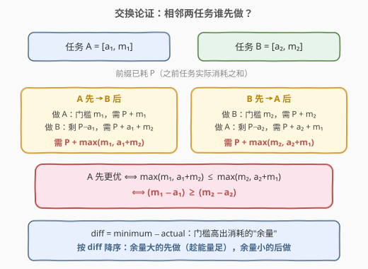
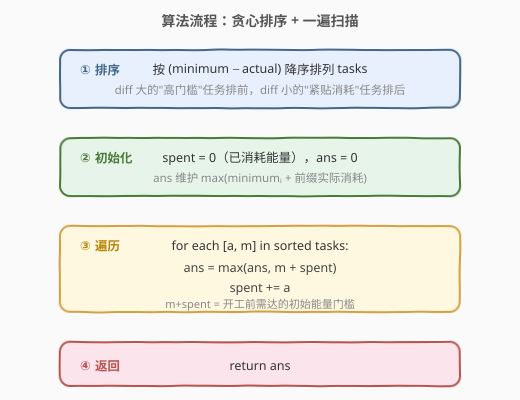
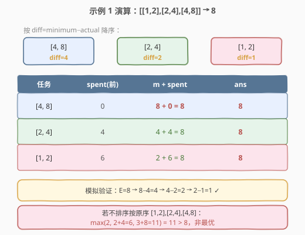

# LeetCode 完成所有任务的最少初始能量 题解

## 1. 题目概述

- **标题 / 题号**：完成所有任务的最少初始能量（#1665，hard）
- **链接**：https://leetcode.cn/problems/minimum-initial-energy-to-finish-tasks/
- **难度**：困难
- **标签**：贪心、排序、交换论证

**题意**：给定任务数组 `tasks`，其中 `tasks[i] = [actual_i, minimum_i]`：

- `actual_i`：完成第 `i` 个任务**需要耗费**的实际能量。
- `minimum_i`：开始第 `i` 个任务前需要达到的**最低能量**（门槛）。

完成一个任务后，剩余能量减去 `actual_i`。可以按**任意顺序**完成任务，求完成所有任务的**最少**初始能量。

**示例 1**：

```text
输入：tasks = [[1,2],[2,4],[4,8]]
输出：8
解释：初始 8 能量，按 [4,8] → [2,4] → [1,2] 顺序：
    完成 [4,8]：8 ≥ 8 ✓，剩 8−4 = 4
    完成 [2,4]：4 ≥ 4 ✓，剩 4−2 = 2
    完成 [1,2]：2 ≥ 2 ✓，剩 2−1 = 1
```

**示例 2**：

```text
输入：tasks = [[1,3],[2,4],[10,11],[10,12],[8,9]]
输出：32
```

**约束**：

- `1 <= tasks.length <= 10^5`
- `1 <= actual_i <= minimum_i <= 10^4`

## 2. 解题思路

### 2.1 暴力思路

枚举所有 $n!$ 种执行顺序，对每种顺序模拟求所需初始能量取最小。$n$ 高达 $10^5$，$n!$ 完全不可行。必须找到**直接确定最优顺序**的贪心策略。

### 2.2 核心观察：贪心排序（交换论证）

**关键转化**：设执行顺序为 $t_1, t_2, \dots, t_n$，记 `spent` 为已处理任务的实际消耗之和（前缀）。开工第 $i$ 个任务前，剩余能量为 $E - \text{spent}$，需满足：

$$E - \text{spent} \geq \text{minimum}_i \quad\Longleftrightarrow\quad E \geq \text{minimum}_i + \text{spent}$$

因此**最少初始能量**为：

$$E = \max_{i}\,\big(\text{minimum}_i + \text{前缀实际消耗}_i\big)$$

问题变为：**如何排序使上式的最大值最小？**

**交换论证**：考察相邻两任务 $A=[a_1, m_1]$、$B=[a_2, m_2]$，设它们之前的已耗前缀为 $P$。



- **A 先 B 后**：需 $P + \max(m_1,\; a_1 + m_2)$
- **B 先 A 后**：需 $P + \max(m_2,\; a_2 + m_1)$

**A 先更优** $\iff \max(m_1, a_1+m_2) \leq \max(m_2, a_2+m_1)$。

由于题目保证 $m_i \geq a_i$，可证（见下方推导）该不等式等价于：

$$\boxed{(m_1 - a_1) \geq (m_2 - a_2)}$$

> 💡 **推导**：令 $d_A = m_1 - a_1$、$d_B = m_2 - a_2$。注意 $a_2 + m_1 = m_1 + a_2 \geq m_2 + a_1 = a_1 + m_2$（因 $d_A \geq d_B$），且 $m_1 + a_2 \geq m_1$、$m_1 + a_2 \geq m_2$，故 $\max(m_2, a_2+m_1) = m_1 + a_2$。而 $\max(m_1, a_1+m_2)$ 无论取 $m_1$ 还是 $a_1+m_2$，都 $\leq m_1 + a_2$（前者显然，后者 $a_1+m_2 \leq m_1+a_2$ 即 $d_A \geq d_B$）。故 A 先更优 ⟺ $d_A \geq d_B$。

**直觉**：$\text{diff} = \text{minimum} - \text{actual}$ 是"门槛高出实际消耗的余量"。diff 大的任务"门槛远高于消耗"，应在能量充裕时尽早做掉；diff 小（门槛≈消耗）的任务"卡得紧"，留到后面能量被消耗后仍能满足。按 diff **降序**排列即为最优序。

> ⚠️ 这是经典的**相邻交换贪心**：只要存在一个全局最优序满足"任意相邻对都按该比较器有序"，则排序后的序列就是最优解。本题比较器 $\text{diff}_A \geq \text{diff}_B$ 满足传递性（纯数值比较），故排序正确。

### 2.3 算法流程图



核心三步：

1. 按 `(minimum - actual)` 降序排序。
2. 一遍遍历，维护 `spent`（前缀实际消耗）和 `ans`（$\max(\text{minimum} + \text{spent})$）。
3. 返回 `ans`。

### 2.4 示例演算

以示例 1 `tasks = [[1,2],[2,4],[4,8]]` 为例：



| 步骤 | 任务 [a, m] | diff | spent(前) | m + spent | ans |
|------|------------|------|-----------|-----------|-----|
| 1 | [4, 8] | 4 | 0 | 8 + 0 = **8** | 8 |
| 2 | [2, 4] | 2 | 4 | 4 + 4 = 8 | 8 |
| 3 | [1, 2] | 1 | 6 | 2 + 6 = 8 | 8 |

最终 `ans = 8`，与示例一致。

> 💡 **对比不排序**：若按原序 `[1,2],[2,4],[4,8]` 计算，$\max(2,\; 2+4=6,\; 3+8=11) = 11 > 8$，可见顺序影响巨大。

## 3. 参考代码

### C++

```cpp
class Solution {
public:
    int minimumEffort(vector<vector<int>>& tasks) {
        // 按 (minimum - actual) 降序排列
        sort(tasks.begin(), tasks.end(), [](const auto& A, const auto& B) {
            return (A[1] - A[0]) > (B[1] - B[0]);
        });

        int ans = 0, spent = 0;
        for (const auto& t : tasks) {
            int actual = t[0], minimum = t[1];
            ans = max(ans, minimum + spent);
            spent += actual;
        }
        return ans;
    }
};
```

### Python

```python
class Solution:
    def minimumEffort(self, tasks: List[List[int]]) -> int:
        # 按 (minimum - actual) 降序排列
        tasks.sort(key=lambda t: t[1] - t[0], reverse=True)

        ans = 0
        spent = 0
        for actual, minimum in tasks:
            ans = max(ans, minimum + spent)
            spent += actual
        return ans
```

> 💡 注意：`ans = max(ans, minimum + spent)` 必须在 `spent += actual` **之前**，因为门槛约束针对的是"开工前"的剩余能量（即还没扣除当前任务的 actual）。

## 4. 复杂度分析

| 维度 | 复杂度 | 说明 |
|------|--------|------|
| 时间复杂度 | $O(n \log n)$ | 排序主导；一遍扫描 $O(n)$ |
| 空间复杂度 | $O(\log n)$ | 排序递归栈（原地排序，无额外数组） |

> ⚠️ 本题无法做到 $O(n)$，因为任意顺序的能量需求不同，必须借助排序确定最优序。若比较器退化为恒等（所有 diff 相等，如示例 3），则顺序无关，但仍需排序或可 $O(n)$ 求 $\max(\text{minimum} + \text{前缀})$。

## 5. 面试要点

1. **为什么能贪心？排序依据是什么？**
   - 由**交换论证**证明：相邻两任务 A、B，A 先更优 $\iff (m_A - a_A) \geq (m_B - a_B)$。该比较器可传递，故全局最优序即按 diff 降序的排序结果。

2. **为什么不是按 minimum 降序或 actual 升序？**
   - 反例：`[1,100]`（diff=99）与 `[50,51]`（diff=1）。按 minimum 降序会先做 `[1,100]`，但 `[50,51]` 的 diff 更小应后做——其实这里 `[1,100]` 的 diff=99 更大应先做，恰巧与 minimum 降序一致；但换 `[10,20]`(diff=10) 与 `[1,12]`(diff=11)，minimum 降序先做 `[10,20]`（diff=10），而最优应先做 `[1,12]`（diff=11）。可见 minimum 或 actual 单独都不对，**只有 diff = minimum − actual 才是正确比较量**。

3. **公式 $E = \max_i(\text{minimum}_i + \text{前缀})$ 是怎么来的？**
   - 开工第 $i$ 个任务前剩余能量 $E - \text{spent}_i$ 必须 $\geq \text{minimum}_i$，即 $E \geq \text{minimum}_i + \text{spent}_i$。对所有 $i$ 取最大即为最少初始能量。

4. **`ans = max(ans, minimum + spent)` 为什么在 `spent += actual` 之前？**
   - 门槛约束是"开工前"的能量，此时还没扣除当前任务的实际消耗。若先扣再比，会少算一个 actual，得到偏小且错误的答案。

5. **交换论证的适用条件？**
   - 需要比较器具有**传递性**（本题是数值大小比较，天然满足）。若比较器不可传递，排序后可能产生矛盾环，贪心失效——这是面试中常被追问的点。

## 同类练习题

| # | 题目 | 与本题的关联 |
|---|------|-------------|
| 435 | [无重叠区间](https://leetcode.cn/problems/non-overlapping-intervals/)（[题解](../0401-0500/435_无重叠区间.md)） | 贪心区间调度，按右端点排序，同为"排序 + 一遍扫描"贪心范式 |
| 452 | [用最少数量的箭引爆气球](https://leetcode.cn/problems/minimum-number-of-arrows-to-burst-balloons/) | 区间贪心按端点排序，与 435 同骨架 |
| 1686 | [石子游戏 VI](https://leetcode.cn/problems/stone-game-vi/) | 两人博弈贪心，按 $a_i + b_i$ 降序排序，同样是交换论证确定比较量 |
| 881 | [救生艇](https://leetcode.cn/problems/boats-to-save-people/) | 排序 + 双指针贪心，"排序确定处理序"的又一典型 |
| 253 | [会议室 II](https://leetcode.cn/problems/meeting-rooms-ii/) | 区间贪心 + 优先队列，与 435 对照（求最大重叠而非最小删除） |
