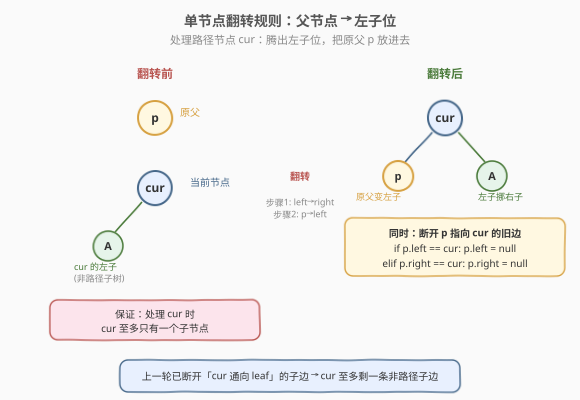
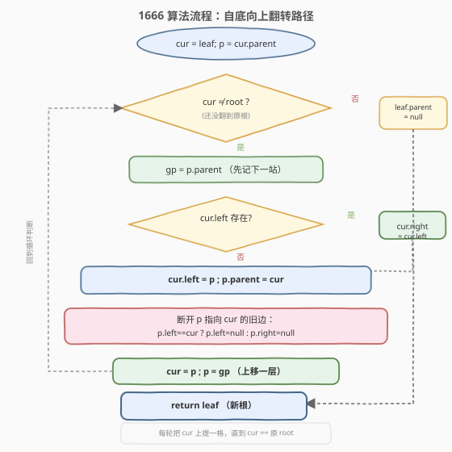
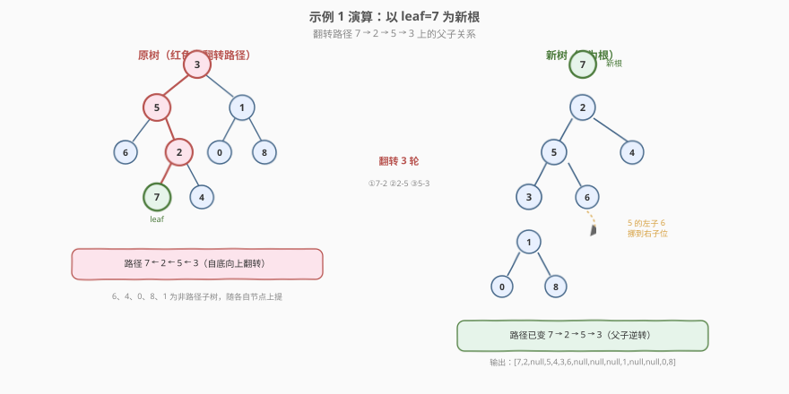

# 改变二叉树的根节点

- **题目名称**：改变二叉树的根节点
- **链接**：[1666. 改变二叉树的根节点](https://leetcode.cn/problems/change-the-root-of-a-binary-tree/)
- **难度**：中等
- **标签**：树、二叉树、指针操作、模拟

## 1. 题目概述

给定一棵**带父指针**的二叉树的根节点 `root` 和一个叶节点 `leaf`，请更改这棵树，使 `leaf` 成为新的根节点。

节点的定义如下（比普通二叉树多了一个 `parent` 指针）：

```cpp
class Node {
public:
    int val;
    Node* left;
    Node* right;
    Node* parent;
};
```

**改根操作规则**：对**从 `leaf` 到 `root` 路径上除 `root` 外的每个节点 `cur`**，依次执行：

1. **步骤 1**：如果 `cur` 有左子节点，则该左子节点变为 `cur` 的**右子节点**。
   > 题目保证：处理 `cur` 时，`cur` 至多只有一个子节点。
2. **步骤 2**：`cur` 的原父节点变为 `cur` 的**左子节点**。

返回修改后新树的根节点（即 `leaf`）。

> ⚠️ **必须维护 `parent` 指针**：操作结束后要确保所有节点的 `parent` 指针正确指向其新父节点，否则判题会判错。

**示例 1**：

```text
输入：root = [3,5,1,6,2,0,8,null,null,7,4], leaf = 7
输出：[7,2,null,5,4,3,6,null,null,null,1,null,null,0,8]

原树：
            3
          /   \
         5     1
        / \   / \
       6   2 0   8
          / \
         7   4

以 leaf=7 为新根后：
            7
           /
          2
         / \
        5   4
       / \
      3   6
       \
        1
       / \
      0   8
```

**示例 2**：

```text
输入：root = [3,5,1,6,2,0,8,null,null,7,4], leaf = 0
输出：[0,1,null,3,8,5,null,null,null,6,2,null,null,7,4]
```

**约束条件**：

- 树中节点数目范围 `[2, 100]`
- $-10^9 \le \text{Node.val} \le 10^9$
- 所有 `Node.val` **互不相同**
- `leaf` 存在于树中，且是叶节点

> 💡 **关键观察**：操作只改写「`leaf` 到 `root` 路径上」的边；路径之外的子树节点**原地不动**，只是它们的父节点可能换了挂载位置。因此只需沿 `parent` 指针从 `leaf` 一路上溯到 `root`，逐个翻转路径上的父子关系即可。

---

## 2. 解题思路

### 2.1 暴力思路：重建整棵树

最直白的想法：从 `leaf` 到 `root` 收集路径上的节点序列，然后按新顺序重新串联——把 `leaf` 当新根，依次把路径上的下一个节点挂成左子，再把各节点的非路径子树重新挂回去。

这种做法能过，但需要额外的数组存路径、还要分情况讨论「非路径子树挂在哪一侧」，代码啰嗦且易错。其实题目给的规则本身就是一套**原地翻转**的操作，无需额外存储。

### 2.2 核心观察：自底向上原地翻转



题目的两条步骤本质上是**对一个路径节点 `cur` 做一次「就地翻转」**：

- **步骤 1** 把 `cur` 原有的左子树（若存在）挪到右子位——腾出左子位；
- **步骤 2** 把 `cur` 的原父节点 `p` 放进刚腾出的左子位，并更新 `p.parent`。

翻转后，`cur` 与 `p` 的父子关系逆转：原来 `p` 是 `cur` 的父亲，现在 `cur` 是 `p` 的父亲。这就是把 `cur` 沿路径「上提」一格。

**为什么「至多一个子节点」的保证成立？** 因为处理是**自底向上**的：处理 `cur` 之前，上一轮已经把 `cur` 通向 `leaf` 方向的那条子边断开（在代码里体现为 `p.left = null` / `p.right = null`）。所以处理 `cur` 时，它最多只剩一条「非路径方向」的子边，步骤 1 把它挪到右子位绝不会冲突。

> ⚠️ **容易踩的坑**：
> 1. **忘记断开 `p` 指向 `cur` 的旧边**。若不断开，`p` 仍认为 `cur` 是它的子节点，而 `cur.parent` 又指向 `p`，形成「互为父子」的环路。
> 2. **忘记把 `leaf.parent` 置空**。循环里只处理了路径中间节点，新根 `leaf` 的 `parent` 仍指向其原父节点，必须最后显式置 `null`。
> 3. **先改 `cur.left = p` 再判 `p.left == cur`**。这样会误判（`p.left` 已被覆盖），必须**先判断 `cur` 是 `p` 的哪一侧子节点、再断开**，或先记录方向。本解法把断开逻辑放在改写之后但用 `p` 自身的指针判断，因为 `p.left`/`p.right` 此时仍指向 `cur`（只改了 `cur.left`，没改 `p` 的子指针），所以顺序安全。

### 2.3 算法流程图



整体是一个**单循环**：从 `leaf` 出发，每轮把当前节点 `cur` 上提一格（翻转 `cur` 与其父 `p` 的关系），然后 `cur ← p`、`p ← gp` 上移一层，直到 `cur` 抵达原 `root`。最后把 `leaf.parent` 置空。

### 2.4 示例演算



以示例 1（`leaf = 7`，路径 `7 → 2 → 5 → 3`）为例，逐步跟踪指针变化：

| 轮次 | `cur` | `p` | `gp` | `cur.left`? | 翻转操作 | 上移后 `cur` |
|------|-------|-----|------|-------------|----------|--------------|
| ① | 7 | 2 | 5 | 无 | `7.left=2`; `2.parent=7`; 断 `2.left`(原指向 7) | 2 |
| ② | 2 | 5 | 3 | 无 | `2.left=5`; `5.parent=2`; 断 `5.right`(原指向 2) | 5 |
| ③ | 5 | 3 | null | 有(6) | `5.right=6`; `5.left=3`; `3.parent=5`; 断 `3.left`(原指向 5) | 3 |

循环结束（`cur = 3 = root`）。最后 `leaf.parent = null`（`7.parent` 置空）。

> 💡 **看路径如何「逆序」**：第①轮把 7-2 逆转为 7→2；第②轮把 2-5 逆转为 2→5；第③轮把 5-3 逆转为 5→3，并把 5 原有的左子 6 挪到右子位（腾出左子位给 3）。三轮过后路径由 `7←2←5←3` 变成 `7→2→5→3`，且 2 的右子 4、3 的右子 1 等非路径子树随各自节点一起上提，结构正确。

---

## 3. 参考代码

### C++

```cpp
/*
// Definition for a Node.
class Node {
public:
    int val;
    Node* left;
    Node* right;
    Node* parent;
};
*/
class Solution {
public:
    Node* flipBinaryTree(Node* root, Node* leaf) {
        Node* cur = leaf;
        Node* p = cur->parent;
        while (cur != root) {
            Node* gp = p->parent;
            // 步骤1：cur 的左子节点（若存在）挪到右子位，腾出左子位
            if (cur->left) {
                cur->right = cur->left;
            }
            // 步骤2：cur 的原父节点 p 变为 cur 的左子节点
            cur->left = p;
            p->parent = cur;
            // 断开 p 指向 cur 的旧边，避免互为父子的环路
            if (p->left == cur) {
                p->left = nullptr;
            } else if (p->right == cur) {
                p->right = nullptr;
            }
            // 上移一层：继续翻转 p 与其父 gp
            cur = p;
            p = gp;
        }
        leaf->parent = nullptr;  // leaf 成为新根，父指针置空
        return leaf;
    }
};
```

### Python

```python
"""
# Definition for a Node.
class Node:
    def __init__(self, val):
        self.val = val
        self.left = None
        self.right = None
        self.parent = None
"""


class Solution:
    def flipBinaryTree(self, root: "Node", leaf: "Node") -> "Node":
        cur = leaf
        p = cur.parent
        while cur is not root:
            gp = p.parent
            # 步骤1：cur 的左子节点（若存在）挪到右子位，腾出左子位
            if cur.left:
                cur.right = cur.left
            # 步骤2：cur 的原父节点 p 变为 cur 的左子节点
            cur.left = p
            p.parent = cur
            # 断开 p 指向 cur 的旧边，避免互为父子的环路
            if p.left is cur:
                p.left = None
            elif p.right is cur:
                p.right = None
            # 上移一层：继续翻转 p 与其父 gp
            cur = p
            p = gp
        leaf.parent = None  # leaf 成为新根，父指针置空
        return leaf
```

> ⚠️ **三处关键细节**（漏任一即判错）：
> 1. **先记 `gp = p.parent`** 再改 `p.parent = cur`，否则丢了上移的「下一站」。
> 2. **断开 `p` 指向 `cur` 的旧子边**（`p.left = null` 或 `p.right = null`），消除环路。
> 3. **循环结束后 `leaf.parent = null`**，新根不能残留父指针。

---

## 4. 复杂度分析

| 维度 | 复杂度 | 说明 |
|------|--------|------|
| 时间复杂度 | $O(h)$ | 每轮上提一格，循环次数 = `leaf` 到 `root` 的路径长度；最坏 $h = O(n)$（链状树），但本题 $n \le 100$，常数极小 |
| 空间复杂度 | $O(1)$ | 只用 `cur`/`p`/`gp` 三个指针，原地修改，无递归栈、无额外数组 |

> 💡 **与「重建法」的对比**：重建法需要 $O(h)$ 额外空间存路径序列，且挂载非路径子树时分支多、易写错；本原地翻转法 $O(1)$ 空间、单循环、分支少，是本题的最优解。

---

## 5. 扩展：换根（Rerooting）思想

「换根」是树上的经典操作，在不同语境下有不同形态：

| 场景 | 操作 | 代表题 |
|------|------|--------|
| **带父指针的树**（本题） | 沿 `parent` 指针上溯，逐个翻转路径上的父子关系 | 1666 |
| **无父指针的树** | 两次 DFS：先以任意根算出信息，再「下推」换根 | [834. 树中距离之和](https://leetcode.cn/problems/sum-of-distances-in-tree/)（换根 DP） |
| **求最优根** | 反复摘除叶节点（拓扑排序）直至剩 1-2 个中心 | [310. 最小高度树](https://leetcode.cn/problems/minimum-height-trees/) |

本题是「换根」最直白的形态：树带父指针，所以换根就是**沿路径翻转父子边**。理解了这一点，再看换根 DP（834）时就会发现：那里不能改边方向，而是用 DP 把「换根后的信息」沿路径传递，本质是同一种「路径上信息逆向流动」的思想。

---

## 6. 面试要点

1. **题目给的两条步骤分别是什么意思？为什么这样设计？**

   - 步骤 1 把 `cur` 的左子树挪到右子位，**腾出左子位**；步骤 2 把原父节点 `p` 放进左子位。设计意图是：让原父节点统一落在「左子」位，便于沿路径一路翻转，且题目用「`cur` 至多一个子节点」的保证避免了挪动时的冲突。

2. **为什么「`cur` 至多一个子节点」的保证在算法执行过程中始终成立？**

   - 处理 `cur` 之前，上一轮已经断开了 `cur` 通向 `leaf` 方向的那条子边（`p.left/right = null`）。因此处理 `cur` 时它最多只剩一条「非路径方向」的子边，步骤 1 把它挪到右子位不会与任何已有子节点冲突。

3. **为什么要断开 `p` 指向 `cur` 的旧边？不断开会怎样？**

   - 不断开则 `p` 仍认为 `cur` 是它的子节点，而 `p.parent` 又被改成 `cur`，形成「`p` 与 `cur` 互为父子」的**双向环**。这棵树不再是树（成图了），且后续遍历会死循环。断开旧边是保证树结构合法的关键。

4. **为什么循环结束后还要单独 `leaf.parent = null`？**

   - 循环只处理路径中间节点（翻转 `cur` 与 `p`）。`leaf` 作为新根，它的 `parent` 仍指向原父节点（第①轮只改了 `leaf.left = p` 和 `p.parent`，没动 `leaf.parent`）。新根不应有父节点，必须最后显式置空。

5. **能否用递归实现？与迭代相比孰优？**

   - 可以：递归函数「翻转 `cur` 与其父，再递归处理 `cur` 的原父」直到 `cur == root`。逻辑等价，但递归用 $O(h)$ 栈空间，迭代用 $O(1)$。本题 $n \le 100$ 两者皆可，但迭代更省空间、也更贴近「指针操作」的面试考点。

---

## 7. 同类练习题

- [1650. 二叉树的最近公共祖先 III](https://leetcode.cn/problems/lowest-common-ancestor-of-a-binary-tree-iii/)（[题解](../1601-1700/1650_二叉树的最近公共祖先III.md)）：同样带 `parent` 指针的树，但目标是**利用** parent 指针求 LCA（双指针走相交链表），对照本题的**改写** parent 指针换根
- [1660. 纠正二叉树](https://leetcode.cn/problems/correct-a-binary-tree/)（[题解](../1601-1700/1660_纠正二叉树.md)）：带 `parent` 指针的树 + BFS 检测结构错误，同为「带父指针的树操作」家族
- [834. 树中距离之和](https://leetcode.cn/problems/sum-of-distances-in-tree/)：经典**换根 DP**，同样研究「换根后信息如何沿路径逆向传递」，从无父指针的视角理解 rerooting
- [310. 最小高度树](https://leetcode.cn/problems/minimum-height-trees/)：通过反复摘叶找到换根后高度最小的根，另一种「寻找最优根」的思路
