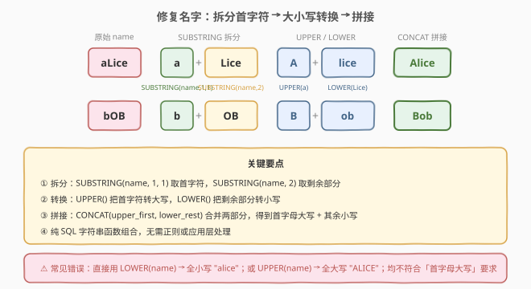
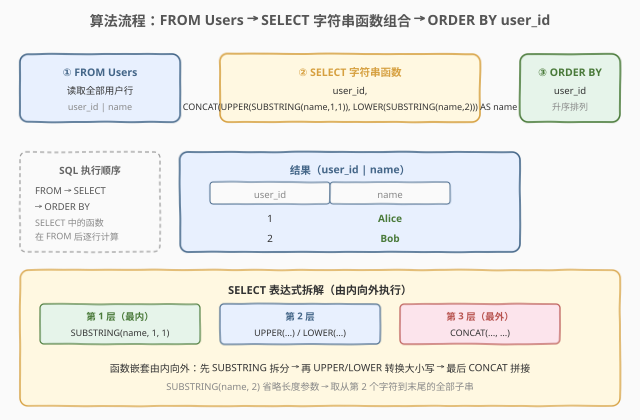
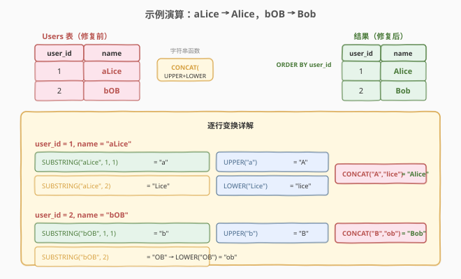

# 修复表中的名字

- **题目名称**：修复表中的名字
- **链接**：[1667. 修复表中的名字](https://leetcode.cn/problems/fix-name-in-a-table/)
- **难度**：简单
- **标签**：数据库、SQL、字符串函数、`CONCAT`、`UPPER`/`LOWER`、`SUBSTRING`/`LEFT`/`RIGHT`、`ORDER BY`

## 1. 题目概述

给定 `Users`（用户）表，其中 `name` 列的大小写不规范。编写 SQL 查询，将每个名字修复为**首字母大写、其余字母小写**的格式（即 Title Case 的单词形式）。结果按 `user_id` 升序返回。

**表结构**：

```text
Table: Users
+---------+---------+
| Column Name | Type    |
+---------+---------+
| user_id | int     |  ← 主键
| name    | varchar |
+---------+---------+
```

**示例 1**：

```text
输入：
Users 表:
+---------+-------+
| user_id | name  |
+---------+-------+
| 1       | aLice |
| 2       | bOB   |
+---------+-------+

输出:
+---------+-------+
| user_id | name  |
+---------+-------+
| 1       | Alice |
| 2       | Bob   |
+---------+-------+
```

**解释**：

| user_id | 原始 name | 修复后 | 首字符 | 剩余部分 |
|---------|-----------|--------|--------|----------|
| 1 | aLice | Alice | `a` → UPPER → `A` | `Lice` → LOWER → `lice` |
| 2 | bOB | Bob | `b` → UPPER → `B` | `OB` → LOWER → `ob` |

**约束条件**：

- `user_id` 是 `Users` 表的主键（非空、唯一）。
- `name` 列包含大小写不规范的字符串。
- 结果按 `user_id` 升序返回。

> 💡 本题是 SQL **"字符串函数组合"招牌题**——核心是将一个字符串拆成「首字符」与「剩余部分」两段，分别用 `UPPER()` 和 `LOWER()` 转换大小写，再用 `CONCAT()` 拼接。MySQL 没有内置的 `INITCAP`（首字母大写）函数，必须手动组合 `SUBSTRING` + `UPPER` + `LOWER` + `CONCAT` 四个函数实现。

---

## 2. 解题思路

### 2.1 暴力思路：应用层逐行处理

最直觉的过程式思路：把 `Users` 表全部拉到应用层，在 Python/Java 中逐行调用字符串方法修复大小写，再写回或返回：

```text
result = []
for row in Users:
    fixed = row.name[0].upper() + row.name[1:].lower()
    result.append((row.user_id, fixed))
result.sort(by user_id)
```

逻辑正确，但**把字符串处理这层数据库天然能做的工作甩给了应用层**——既要全量拉取数据，又产生网络往返开销。更关键的是，它**回避了"如何在纯 SQL 中操作字符串大小写"这一真正考点**。

> ⚠️ 暴力思路的根本问题：**没有正面解决"SQL 如何做字符串大小写转换"**。SQL 标准提供了 `UPPER()`/`LOWER()`/`SUBSTRING()`/`CONCAT()` 等字符串函数，完全可以在查询中一步完成转换，无需应用层介入。

### 2.2 核心观察：拆分 → 转换 → 拼接



**问题拆解为三个子问题**：

1. **拆分字符串**：把 `name` 拆成「首字符」和「剩余部分」两段。
   - 首字符：`SUBSTRING(name, 1, 1)`——从第 1 个字符开始取 1 个字符。
   - 剩余部分：`SUBSTRING(name, 2)`——从第 2 个字符开始取到末尾（省略长度参数表示取到字符串结尾）。

2. **分别转换大小写**：
   - 首字符大写：`UPPER(SUBSTRING(name, 1, 1))`。
   - 剩余部分小写：`LOWER(SUBSTRING(name, 2))`。

3. **拼接结果**：`CONCAT(UPPER(SUBSTRING(name, 1, 1)), LOWER(SUBSTRING(name, 2)))`——把大写后的首字符与小写后的剩余部分拼成一个完整字符串。

> 💡 **`SUBSTRING` 的两种参数形式**：
> - `SUBSTRING(str, pos, len)`——从位置 `pos` 开始取 `len` 个字符。`SUBSTRING(name, 1, 1)` 取首字符。
> - `SUBSTRING(str, pos)`——从位置 `pos` 开始取到字符串结尾，省略 `len`。`SUBSTRING(name, 2)` 取从第 2 个字符到末尾的全部子串。
> - SQL 标准还支持 `SUBSTRING(str FROM pos FOR len)` 和 `SUBSTRING(str FROM pos)` 语法，MySQL/PostgreSQL 均兼容。

> ⚠️ **为什么不能用 `UPPER(name)` 或 `LOWER(name)`**：`UPPER(name)` 会把**整个**字符串转大写（`aLice` → `ALICE`），`LOWER(name)` 会把整个字符串转小写（`aLice` → `alice`），都不符合「首字母大写、其余小写」的要求。必须**拆分后分别处理**，这是本题的核心考点。

### 2.3 算法流程图



**逻辑执行步骤**：

| 步骤 | 子句 | 作用 | 本题对应 |
|------|------|------|----------|
| ① | `FROM Users` | 读取全部用户行 | 获取 `user_id` 和待修复的 `name` |
| ② | `SELECT user_id, CONCAT(UPPER(SUBSTRING(name,1,1)), LOWER(SUBSTRING(name,2))) AS name` | 逐行计算修复后的名字 | 函数嵌套由内向外：先 `SUBSTRING` 拆分 → 再 `UPPER`/`LOWER` 转换 → 最后 `CONCAT` 拼接 |
| ③ | `ORDER BY user_id` | 按 `user_id` 升序 | 满足题面排序要求 |

> 💡 **SQL 子句执行顺序**：`FROM` → `WHERE` → `GROUP BY` → `HAVING` → `SELECT` → `ORDER BY` → `LIMIT`。本题 `SELECT` 中的字符串函数在 `FROM` 读取数据后逐行计算，`ORDER BY` 在 `SELECT` 产出结果后排序。注意 `ORDER BY` 引用的是 `SELECT` 输出的列名（`user_id`），而非原始表列——虽然两者在此题中一致。

### 2.4 示例演算

以示例 1 的 2 个用户为例，观察「拆分 → 转换 → 拼接」的逐步过程：



**步骤 ①②：FROM + SELECT（逐行计算修复后的名字）**

| user_id | 原始 name | SUBSTRING(name,1,1) | UPPER(首字符) | SUBSTRING(name,2) | LOWER(剩余) | CONCAT 拼接 |
|---------|-----------|----------------------|---------------|---------------------|-------------|-------------|
| 1 | aLice | a | A | Lice | lice | Alice |
| 2 | bOB | b | B | OB | ob | Bob |

**步骤 ③：ORDER BY user_id**

| user_id | name |
|---------|------|
| 1 | Alice |
| 2 | Bob |

> 💡 **函数嵌套执行顺序（由内向外）**：`CONCAT(UPPER(SUBSTRING(name, 1, 1)), LOWER(SUBSTRING(name, 2)))` 先执行最内层的 `SUBSTRING` 拆分出首字符和剩余部分，再执行 `UPPER`/`LOWER` 转换大小写，最后执行最外层的 `CONCAT` 拼接。理解嵌套顺序有助于调试复杂表达式。

---

## 3. 参考代码

### SQL（解法 A：`CONCAT` + `SUBSTRING` + `UPPER`/`LOWER`，推荐）

```sql
SELECT user_id,
       CONCAT(UPPER(SUBSTRING(name, 1, 1)), LOWER(SUBSTRING(name, 2))) AS name
FROM Users
ORDER BY user_id;
```

> 💡 **写法要点**：
> - **`SUBSTRING(name, 1, 1)`**：取首字符。MySQL 中字符串位置从 1 开始（非 0）。
> - **`SUBSTRING(name, 2)`**：取从第 2 个字符到末尾的全部子串（省略长度参数）。
> - **`UPPER(...)` / `LOWER(...)`**：分别把首字符转大写、剩余部分转小写。
> - **`CONCAT(..., ...)`**：拼接两段字符串为一个完整名字。
> - **`ORDER BY user_id`**：题面要求按 `user_id` 升序，不可省。
> - ✓ **最推荐**：语义清晰，"拆分 → 转换 → 拼接"三步一气呵成，且 `SUBSTRING` 是 SQL 标准函数，跨数据库通用。

### SQL（解法 B：`CONCAT` + `LEFT`/`RIGHT`，MySQL 方言）

```sql
SELECT user_id,
       CONCAT(UPPER(LEFT(name, 1)), LOWER(RIGHT(name, LENGTH(name) - 1))) AS name
FROM Users
ORDER BY user_id;
```

> 💡 **解法 B 的思路**：用 `LEFT(name, 1)` 替代 `SUBSTRING(name, 1, 1)` 取首字符，用 `RIGHT(name, LENGTH(name) - 1)` 替代 `SUBSTRING(name, 2)` 取剩余部分。
>
> **与解法 A 的区别**：
> - `LEFT(str, n)` / `RIGHT(str, n)` 是 MySQL 方言，语义更直观（"左取 n 个"/"右取 n 个"）。
> - 但取剩余部分时需手动算 `LENGTH(name) - 1`，比 `SUBSTRING(name, 2)` 的"从第 2 位取到末尾"更繁琐。
> - `LEFT`/`RIGHT` 在 PostgreSQL/SQL Server 中也可用，但并非 SQL 标准；`SUBSTRING` 是标准函数。
> - **单字符边界**：当 `name` 仅 1 个字符时，`LENGTH(name) - 1 = 0`，`RIGHT(name, 0)` 返回空字符串 `''`，`CONCAT(UPPER('a'), '')` = `'A'`，结果正确。

### SQL（解法 C：`SUBSTRING FROM` 标准语法）

```sql
SELECT user_id,
       CONCAT(UPPER(SUBSTRING(name FROM 1 FOR 1)),
              LOWER(SUBSTRING(name FROM 2))) AS name
FROM Users
ORDER BY user_id;
```

> 💡 **解法 C 使用 SQL 标准的 `SUBSTRING ... FROM ... FOR ...` 语法**：`SUBSTRING(name FROM 1 FOR 1)` 等价 `SUBSTRING(name, 1, 1)`，`SUBSTRING(name FROM 2)` 等价 `SUBSTRING(name, 2)`。两者在 MySQL/PostgreSQL 中完全等价，只是语法风格不同。`FROM` 语法更接近 SQL 标准（SQL-92），`逗号` 语法更简洁。选哪个看团队风格。

### Python（pandas）

```python
import pandas as pd

def fix_names(users: pd.DataFrame) -> pd.DataFrame:
    users['name'] = users['name'].str.capitalize()
    return users.sort_values('user_id')
```

> 💡 **pandas 对照**：
> - **`str.capitalize()`**：pandas 字符串方法，将首字符转大写、其余转小写——正好对应 SQL 的 `CONCAT(UPPER(SUBSTRING(name,1,1)), LOWER(SUBSTRING(name,2)))`。
> - **`str.title()` ≠ `str.capitalize()`**：`title()` 会把**每个单词**的首字母大写（`"hello world"` → `"Hello World"`），而 `capitalize()` 只把**整个字符串**的首字母大写（`"hello world"` → `"Hello world"`）。本题名字不含空格，两者结果相同，但语义上 `capitalize()` 更准确。
> - **`.sort_values('user_id')`**：对应 `ORDER BY user_id`。

---

## 4. 复杂度分析

| 维度 | 解法 A（`SUBSTRING`） | 解法 B（`LEFT`/`RIGHT`） | pandas |
|------|----------------------|--------------------------|--------|
| **时间** | $O(n \cdot L)$ | $O(n \cdot L)$ | $O(n \cdot L)$ |
| **空间** | $O(n \cdot L)$ | $O(n \cdot L)$ | $O(n \cdot L)$ |
| **可读性** | ✓ 直观 | ✓ 直观 | ✓ 简洁 |
| **跨数据库** | ✓ SQL 标准 | MySQL/PG/SQLServer | — |
| **推荐度** | ✓ **首选** | ✓ 备选 | ✓ 验证用 |

> - $n$ = `Users` 表行数，$L$ = `name` 列平均长度。
> - **时间**：每行对 `name` 做 `SUBSTRING`（$O(L)$）+ `UPPER`/`LOWER`（$O(L)$）+ `CONCAT`（$O(L)$），合计 $O(L)$；$n$ 行总计 $O(n \cdot L)$。实际中 $L$ 很小（名字通常 < 50 字符），可视为 $O(n)$。
> - **空间**：输出结果集与输入等大 $O(n \cdot L)$，无额外中间结构。
> - **索引**：`ORDER BY user_id` 可利用 `user_id` 上的主键索引（B+ 树有序），避免额外排序。

---

## 5. 扩展：`INITCAP` 缺席与替代方案 + 边界情况

### 5.1 为什么 MySQL 没有 `INITCAP`

`INITCAP(str)` 是一个将字符串每个单词首字母大写、其余小写的函数，存在于 **Oracle** 和 **PostgreSQL** 中：

```sql
-- Oracle / PostgreSQL
SELECT INITCAP('aLice') FROM dual;   -- 返回 'Alice'
SELECT INITCAP('hello world') FROM dual;  -- 返回 'Hello World'
```

但 **MySQL 和 SQL Server 均不支持 `INITCAP`**，必须手动组合 `SUBSTRING` + `UPPER` + `LOWER` + `CONCAT` 实现。本题正是在 MySQL 环境下考察这一组合能力。

> 💡 **PostgreSQL 中 `INITCAP` 的行为**：它按**单词边界**（空格、非字母字符）分割，每个单词首字母大写。如果题目要求的是"每个单词首字母大写"（如 `"john smith"` → `"John Smith"`），则 PostgreSQL 的 `INITCAP` 一步到位。而本题只需整个名字的首字母大写，`INITCAP` 在单词场景下的行为反而可能超出预期。

### 5.2 `CONCAT` 与 `NULL` 的关系

`CONCAT()` 在 MySQL 中的 `NULL` 行为：

| 场景 | 表达式 | 结果 |
|------|--------|------|
| 正常值 | `CONCAT('A', 'lice')` | `'Alice'` |
| 任一参数为 `NULL` | `CONCAT(NULL, 'lice')` | `NULL` |
| 空字符串 | `CONCAT('A', '')` | `'A'` |

> ⚠️ **`name` 为 `NULL` 时**：`SUBSTRING(NULL, 1, 1)` 返回 `NULL`，`UPPER(NULL)` 返回 `NULL`，`CONCAT(NULL, ...)` 返回 `NULL`——最终修复后的名字为 `NULL`。本题约束中 `name` 列是否有 `NULL` 未明确说明；若数据可能含 `NULL`，可用 `COALESCE(name, '')` 或 `IFNULL(name, '')` 做空值守卫。
>
> **`CONCAT_WS(separator, ...)` 的差异**：`CONCAT_WS`（With Separator）会**跳过** `NULL` 参数，而 `CONCAT` 遇 `NULL` 返回 `NULL`。本题不需要分隔符，用 `CONCAT` 即可。

### 5.3 单字符名字的边界

当 `name` 仅含 1 个字符（如 `"a"`）时：

| 函数 | 输入 | 结果 |
|------|------|------|
| `SUBSTRING("a", 1, 1)` | `"a"` | `"a"` |
| `UPPER("a")` | `"a"` | `"A"` |
| `SUBSTRING("a", 2)` | `"a"` | `""`（空字符串） |
| `LOWER("")` | `""` | `""` |
| `CONCAT("A", "")` | | `"A"` |

结果 `"A"` 正确——首字母大写且无剩余部分。`SUBSTRING(str, pos)` 当 `pos` 超过字符串长度时返回空字符串 `''`，而非 `NULL`，这是安全的行为。

### 5.4 `LEFT`/`RIGHT` vs `SUBSTRING` 的跨数据库兼容性

| 函数 | MySQL | PostgreSQL | SQL Server | Oracle | SQL 标准 |
|------|-------|------------|------------|--------|----------|
| `SUBSTRING(str, pos, len)` | ✓ | ✓ | ✓（`SUBSTRING`） | ✓（`SUBSTR`） | ✓ |
| `LEFT(str, n)` / `RIGHT(str, n)` | ✓ | ✓ | ✓ | ✗（用 `SUBSTR`） | ✗ |
| `SUBSTRING(str FROM pos FOR len)` | ✓ | ✓ | ✗ | ✓ | ✓ |

> 💡 **跨数据库首选 `SUBSTRING`**：解法 A 的 `SUBSTRING(str, pos, len)` 语法在所有主流数据库中均可用（Oracle 中为 `SUBSTR`），是跨数据库迁移的最安全选择。`LEFT`/`RIGHT` 虽然语义直观但并非 SQL 标准，在 Oracle 中不可用。

---

## 6. 面试要点

1. **为什么不能直接用 `UPPER(name)` 或 `LOWER(name)`？**

   > `UPPER(name)` 把整个字符串转大写（`aLice` → `ALICE`），`LOWER(name)` 把整个字符串转小写（`aLice` → `alice`），都不符合「首字母大写、其余小写」的要求。必须把字符串**拆分**成首字符和剩余部分，分别用 `UPPER()` 和 `LOWER()` 转换后再拼接。这是本题的核心考点——识别出"不同部分需要不同的大小写处理"。

2. **`SUBSTRING(name, 2)` 省略长度参数会怎样？**

   > `SUBSTRING(str, pos)` 省略第三个参数 `len` 时，表示从位置 `pos` 取到字符串**结尾**的全部子串。`SUBSTRING("aLice", 2)` 返回 `"Lice"`。这比用 `RIGHT(name, LENGTH(name) - 1)` 更简洁——后者需要手动计算剩余长度。SQL 标准也支持 `SUBSTRING(str FROM pos)` 的等价写法。

3. **MySQL 有没有类似 Oracle 的 `INITCAP` 函数？**

   > 没有。`INITCAP(str)` 是 Oracle 和 PostgreSQL 的专有函数，将字符串每个单词首字母大写、其余小写。MySQL 和 SQL Server 不支持，必须手动组合 `SUBSTRING` + `UPPER` + `LOWER` + `CONCAT` 实现。本题正是在 MySQL 环境下考察这一组合能力。面试中点出 `INITCAP` 的存在与缺席，是展示数据库知识广度的加分点。

4. **如果 `name` 为 `NULL`，查询结果会怎样？**

   > `SUBSTRING(NULL, ...)` 返回 `NULL`，`UPPER(NULL)` / `LOWER(NULL)` 返回 `NULL`，`CONCAT(NULL, ...)` 在 MySQL 中返回 `NULL`——最终修复后的名字为 `NULL`。若需处理 `NULL`，可用 `COALESCE(name, '')` 将 `NULL` 转为空字符串，或用 `IFNULL(name, '')`（MySQL 方言）。注意 `CONCAT` 遇 `NULL` 返回 `NULL`，而 `CONCAT_WS` 会跳过 `NULL` 参数——这是两者的关键差异。

5. **`LEFT`/`RIGHT` 和 `SUBSTRING` 有何区别？应选哪个？**

   > 逻辑等价。`LEFT(name, 1)` = `SUBSTRING(name, 1, 1)`，`RIGHT(name, LENGTH(name) - 1)` = `SUBSTRING(name, 2)`。区别在于：① `SUBSTRING` 是 SQL 标准函数，跨数据库通用（Oracle 中为 `SUBSTR`）；`LEFT`/`RIGHT` 是 MySQL/PostgreSQL/SQL Server 扩展，Oracle 不支持。② 取剩余部分时 `SUBSTRING(name, 2)` 无需计算长度，比 `RIGHT(name, LENGTH(name) - 1)` 更简洁。**优先选 `SUBSTRING`**——标准、简洁、跨数据库。

> 💡 **一句话总结**：1667 是 SQL **"字符串函数组合"** 招牌题——核心模板「`CONCAT(UPPER(SUBSTRING(name, 1, 1)), LOWER(SUBSTRING(name, 2)))`」。三大要点：**拆分用 `SUBSTRING`（首字符取 1 位、剩余从第 2 位取到末尾）、转换用 `UPPER`/`LOWER` 分别处理、MySQL 无 `INITCAP` 需手动组合**。与 1517/1527 的 `REGEXP`/`LIKE` 字符串匹配不同，本题考察的是字符串**变换**而非匹配。

---

## 7. 同类练习题

- [1517. 查找拥有有效邮箱的用户](https://leetcode.cn/problems/find-users-with-valid-e-mails/)（[题解](../1501-1600/1517_查找拥有有效邮箱的用户.md)）：SQL 字符串模式匹配——用 `REGEXP`/`LIKE` 判定邮箱格式合法性，与 1667 同为"SQL 字符串函数"家族，但 1517 是**匹配判定**（字符串是否符合模式）、1667 是**变换生成**（字符串改为目标格式）
- [1527. 患某种疾病的患者](https://leetcode.cn/problems/patients-with-a-condition/)（[题解](../1501-1600/1527_患某种疾病的患者.md)）：SQL `LIKE` 模式匹配——用 `LIKE '%DIAB1%'` 筛选患病记录，与 1667 共享"SQL 字符串操作"主题，但 1527 是过滤匹配、1667 是转换修复
- [627. 变更性别](https://leetcode.cn/problems/swap-salary/)（[题解](../0601-0700/627_变更性别.md)）：SQL `UPDATE` + `CASE WHEN` 值变换——用 `CASE` 把 `f`↔`m` 互换，与 1667 形成"字符串变换 vs 值变换"对照，同为"SQL 内置函数做数据修正"范式
- [1179. 重新格式化部门表](https://leetcode.cn/problems/reformat-department-table/)（[题解](../1101-1200/1179_重新格式化部门表.md)）：SQL `CASE WHEN` + 聚合做行列转换——用条件表达式重塑数据格式，与 1667 同为"SQL 函数做数据变换"，但 1179 是结构重塑、1667 是内容修正
- [595. 大的国家](https://leetcode.cn/problems/big-countries/)（[题解](../0501-0600/595_大的国家.md)）：SQL `WHERE` 基础过滤——最简单的 SQL 入门题，与 1667 形成"基础过滤 vs 字符串变换"对照，巩固 SQL 查询基本骨架
