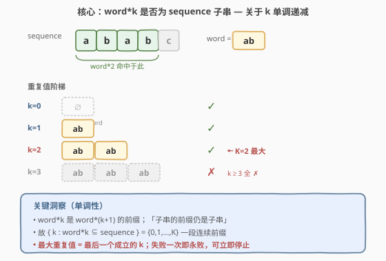
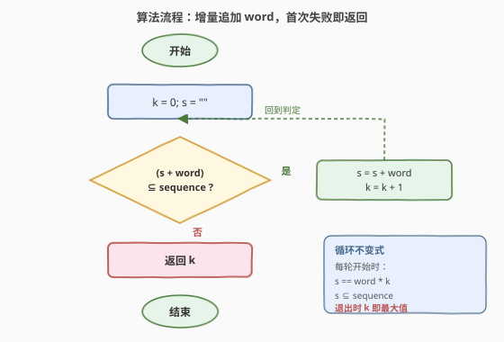
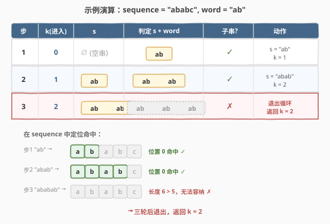

# LeetCode 最大重复子字符串 题解

## 1. 题目概述

- **标题 / 题号**：最大重复子字符串（#1668，easy）
- **链接**：https://leetcode.cn/problems/maximum-repeating-substring/
- **难度**：简单
- **标签**：字符串、枚举

**题意**：给定字符串 `sequence` 和 `word`。如果 `word` **连续重复 `k` 次**得到的字符串 `word * k` 是 `sequence` 的一个子字符串，则称 `word` 的**重复值为 `k`**。要求返回 `word` 在 `sequence` 中的**最大重复值 `k`**；若 `word` 不是 `sequence` 的子串，返回 `0`。

**示例 1**：

```text
输入：sequence = "ababc", word = "ab"
输出：2
解释："abab" 是 "ababc" 的子字符串（"abab"c），而 "ababab" 不是。
```

**示例 2**：

```text
输入：sequence = "ababc", word = "ba"
输出：1
解释："ba" 是 "a ba bc" 的子字符串，但 "baba" 不是 "ababc" 的子字符串。
```

**示例 3**：

```text
输入：sequence = "ababc", word = "ac"
输出：0
解释："ac" 不是 "ababc" 的子字符串。
```

**约束**：

- $1 \leq \text{sequence.length} \leq 100$
- $1 \leq \text{word.length} \leq 100$
- `sequence` 和 `word` 仅包含小写英文字母

> 💡 **规模提示**：$n, m \leq 100$ 极小，任何 $O(n^2)$ 以下的做法都能通过。本题的考点不在性能，而在于**正确刻画「最大重复值」的判定结构**——很多写法会在 `word` 自身周期性（如 `word = "aa"`、`sequence = "aa"`）的边界上翻车。

## 2. 解题思路

### 2.1 暴力思路：枚举 k 从大到小

最大可能的 $k$ 不超过 $\lfloor n / m \rfloor$（`word * k` 长度为 $k \cdot m$，要能塞进长度为 $n$ 的 `sequence`）。于是从 $k = \lfloor n/m \rfloor$ 向下枚举，**第一个**满足 `word * k` 是 `sequence` 子串的 $k$ 即答案；若都不满足，返回 `0`。

```python
for k in range(len(sequence) // len(word), -1, -1):
    if word * k in sequence:
        return k
```

正确性依赖下面的**单调性**——一旦某个 $k$ 成立，所有更小的 $k$ 也成立，所以「从大到小第一个成立的」就是最大值。时间 $O\!\left(\frac{n}{m} \cdot (n + k m)\right)$，对 $n \leq 100$ 完全够用，但每次都重新构造 `word * k` 字符串、重复扫描 `sequence`，做了不少冗余工作。

### 2.2 核心观察：单调性 + 增量构造



**关键洞察（单调性）**：若 `word * (k+1)` 是 `sequence` 的子串，则 `word * k` 也是。

> **证明**：`word * k` 是 `word * (k+1)` 的前缀；而「子串的前缀仍是子串」（取相同起点、缩短长度即可）。因此 $k+1$ 成立 $\Rightarrow k$ 成立。

由此推论：集合 $\{\, k \geq 0 : \text{word}*k \subseteq \text{sequence}\,\}$ 形如 $\{0, 1, \dots, K\}$——**一段从 0 开始的连续前缀**。最大重复值就是这段前缀的右端点 $K$，即「**最后一个成立**的 $k$」。

于是无需每次从零重建 `word * k`：维护候选串 $s$，**每次只追加一个 `word`**，只要 $s + \text{word}$ 仍是 `sequence` 的子串就继续；**第一次失败即停止**，此时的 $k$ 就是答案。

> ⚠️ **为什么「第一次失败」就可以停？** 由单调性，$k+1$ 不成立 $\Rightarrow$ $k+2, k+3, \dots$ 都不成立（它们都包含 `word*(k+1)` 作为子串）。所以失败一次即永败，直接返回当前 $k$ 即可。

> 💡 **对照 2.1**：暴力法从顶部往下找「第一个成立」；增量法从底部往上找「最后一个成立」。两者都靠单调性保证正确，但增量法**复用上次构造的串**，且通常在 $K$ 附近就停止，避免了大 $k$ 时的无效构造。

### 2.3 算法流程



1. **初始化**：`k = 0`，候选串 `s = ""`（空串）。
2. **循环判定**：检查 `s + word` 是否为 `sequence` 的子串。
   - **是** → `s += word`，`k += 1`，回到第 2 步继续追加。
   - **否** → 跳出循环。
3. **返回** `k`。

> 💡 循环不变式：**每轮开始时 `s == word * k` 且 `s` 是 `sequence` 的子串**。空串天然是任何串的子串，故初始成立；每轮成功后 `s` 变为 `word * (k+1)` 仍为子串，不变式保持。循环结束时，`word * (k+1)` 不是子串而 `word * k` 是，故 $k$ 即最大值。

### 2.4 示例演算



以 `sequence = "ababc"`, `word = "ab"` 为例：

| 步 | 进入时 `k` | `s` | 判定 `s + word` | 是否子串？ | 动作 |
|----|-----------|-----|-----------------|-----------|------|
| 1 | 0 | `""` | `"ab"` | ✓（位置 0） | `s = "ab"`, `k = 1` |
| 2 | 1 | `"ab"` | `"abab"` | ✓（位置 0） | `s = "abab"`, `k = 2` |
| 3 | 2 | `"abab"` | `"ababab"` | ✗（长度 6 > 5） | 退出，返回 `k = 2` |

**示例 2** `sequence = "ababc"`, `word = "ba"`：第 1 轮 `"ba"` ✓（位置 1）→ `k=1`；第 2 轮 `"baba"` ✗（`ababc` 中无连续 `b-a-b-a`）→ 返回 `1`。

**示例 3** `sequence = "ababc"`, `word = "ac"`：第 1 轮 `"ac"` ✗ → 直接返回 `0`。

> 💡 **边界自检**：`word = "aa"`, `sequence = "aa"`。第 1 轮 `"aa"` ✓ → `k=1`；第 2 轮 `"aaaa"` ✗（长度 4 > 2）→ 返回 `1`。增量法天然处理 `word` 自身周期性，不会因为 `word` 内部重复而多算。

## 3. 参考代码

### C++（增量追加）

```cpp
class Solution {
public:
    int maxRepeating(string sequence, string word) {
        int k = 0;
        string s;
        while (sequence.find(s + word) != string::npos) {
            s += word;
            ++k;
        }
        return k;
    }
};
```

### Python（增量追加）

```python
class Solution:
    def maxRepeating(self, sequence: str, word: str) -> int:
        k = 0
        s = ""
        while (s + word) in sequence:
            s += word
            k += 1
        return k
```

> 💡 C++ 用 `string::find(...) != string::npos` 判子串，Python 用 `in` 运算符。两者底层都是线性扫描，对 $n \leq 100$ 足够。`s + word` 每轮新建一个临时串——这是「增量」的代价，但避免了从零重建 `word * k`。

### Python（暴力枚举，对照用）

```python
class Solution:
    def maxRepeating(self, sequence: str, word: str) -> int:
        for k in range(len(sequence) // len(word), -1, -1):
            if word * k in sequence:
                return k
        return 0
```

## 4. 复杂度分析

| 维度 | 复杂度 | 说明 |
|------|--------|------|
| 时间复杂度 | $O\!\left(\dfrac{n^2}{m}\right)$ | 最多循环 $\lfloor n/m \rfloor + 1$ 轮；第 $i$ 轮构造并扫描长度约 $i \cdot m$ 的串，总工作量 $\sum_{i=1}^{n/m} (n + i m) = O(n^2/m)$ |
| 空间复杂度 | $O(n)$ | 候选串 `s` 最长 $O(n)$；暴力枚举法每次新建 `word * k`，峰值同样 $O(n)$ |

> 💡 对 $n, m \leq 100$，$n^2/m \leq 10^4$ 次字符操作，远低于时限。若 $n$ 放大到 $10^5$，应改用第 5 节的线性 DP。

## 5. 扩展：线性 DP 解法

当 $n$ 很大时，子串反复扫描的 $O(n^2/m)$ 不可接受。可改用**以位置为状态的 DP**，一次性线性扫描：

设 $m = \text{len}(\text{word})$，$n = \text{len}(\text{sequence})$。令 `dp[i]` 表示**以 `sequence[i]` 结尾、且恰好由若干个完整 `word` 拼接而成**的最大重复次数。则：

$$
\text{dp}[i] = \begin{cases} \text{dp}[i-m] + 1 & \text{若 } \text{sequence}[i-m+1\,..\,i] = \text{word} \\ 0 & \text{否则} \end{cases}
$$

答案为 $\max_i \text{dp}[i]$。含义：当前位置匹配一个 `word` 时，重复值接上前一个 `word` 的计数 `dp[i-m]` 加 1；不匹配则该位置无法作为重复串结尾，置 0。

```python
class Solution:
    def maxRepeating(self, sequence: str, word: str) -> int:
        m, n = len(word), len(sequence)
        dp = [0] * (n + 1)
        ans = 0
        for i in range(m, n + 1):
            if sequence[i - m:i] == word:
                dp[i] = dp[i - m] + 1
                ans = max(ans, dp[i])
        return ans
```

时间 $O(n \cdot m)$（切片比较 $m$），空间 $O(n)$；用滚动或哈希可进一步优化到 $O(n)$ 时间。对 $n \leq 100$ 属于杀鸡用牛刀，但展示了「重复子串计数」可被线性化的思路。

## 6. 面试要点

1. **为什么增量法在「第一次失败」时就能停止？**

   - 由单调性：`word*(k+1)` 不是子串 $\Rightarrow$ `word*(k+2)`、`word*(k+3)`…… 都不是（后者包含前者作为子串，子串不存在则母串必不存在）。所以失败一次即永败，当前 `k` 即最大值。

2. **单调性「子串的前缀仍是子串」如何用于正确性证明？**

   - `word*k` 是 `word*(k+1)` 的前缀。若 `word*(k+1) ⊆ sequence`，取其在 `sequence` 中的出现位置，截取前 $k \cdot m$ 个字符即得 `word*k` 的一次出现。故 $k+1$ 成立 $\Rightarrow k$ 成立，性质关于 $k$ 单调递减。

3. **`word` 自身有周期性时（如 `word = "aa"`）会出错吗？**

   - 不会。增量法判定的是 `word` **整体重复** $k$ 次的串是否出现，与 `word` 内部结构无关。`"aa"*2 = "aaaa"`，只要这整个串在 `sequence` 中出现才算 $k=2$，不会把单个 `"aa"` 重复计数。

4. **暴力从大到小 vs 增量从小到大，哪种更好？**

   - 正确性都靠单调性。从大到小：第一次成立即答案，但构造 `word * k`（$k$ 可能很大）浪费；从小到大：每次只追加一个 `word`，复用上次结果，通常在 $K$ 附近停止，更省。$K$ 接近 $n/m$ 时两者接近；$K$ 很小时增量法优势明显。

5. **如何线性化以应对 $n$ 到 $10^5$？**

   - 用第 5 节的 DP：`dp[i] = dp[i-m] + 1`（当 `sequence[i-m+1..i] == word`），一次扫描取最大值，时间 $O(nm)$（或用 KMP/滚动哈希降到 $O(n)$），空间 $O(n)$。

## 同类练习题

| # | 题目 | 与本题的关联 |
|---|------|-------------|
| 459 | [重复子字符串](https://leetcode.cn/problems/repeated-substring-pattern/) | 判定字符串能否由某子串重复多次构成，是本题「构造方向」的镜像（已知重复结果反推最小周期） |
| 1662 | [检查两个字符串数组是否相等](https://leetcode.cn/problems/check-if-two-string-arrays-are-equivalent/) | 同区间同难度字符串题，对照「拼接后比较」与「重复后判定」的子串处理范式 |
| 28 | [找出字符串中第一个匹配项的下标](https://leetcode.cn/problems/find-the-index-of-the-first-occurrence-in-a-string/) | 子串查找的母题，本题 `in` / `find` 的底层即此，KMP 进阶可承接第 5 节线性化 |
| 1616 | [分割两个字符串得到回文串](https://leetcode.cn/problems/split-two-strings-to-make-palindrome/) | 同区间字符串双指针判定题，对照「整体匹配」与「分段拼接匹配」的边界处理 |
