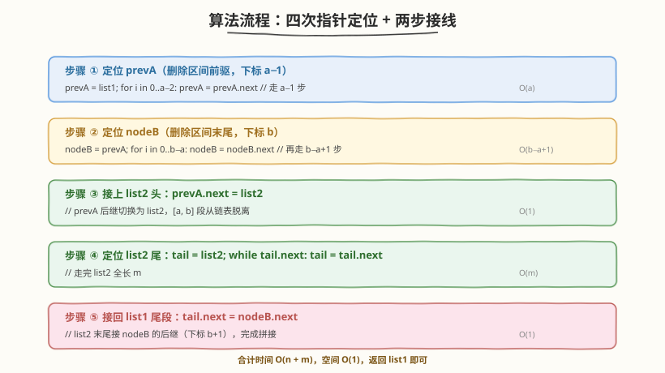
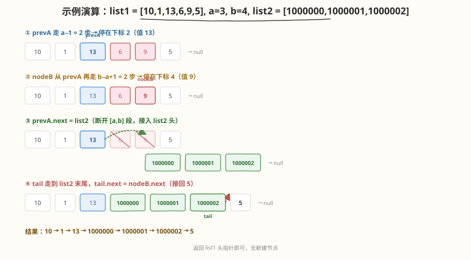

# LeetCode 合并两个链表 题解

## 1. 题目概述

- **标题 / 题号**：合并两个链表（#1669，medium）
- **链接**：https://leetcode.cn/problems/merge-in-between-linked-lists/
- **难度**：中等
- **标签**：链表、双指针

**题意**：给定两个链表 `list1`（`n` 个节点）和 `list2`（`m` 个节点），以及两个整数 `a`、`b`。请将 `list1` 中**下标从 `a` 到 `b`（含两端）**的全部节点删除，并把 `list2` **整体接在被删除节点的位置**，最后返回结果链表的头指针。

**示例 1**：

```text
输入：list1 = [10,1,13,6,9,5], a = 3, b = 4, list2 = [1000000,1000001,1000002]
输出：[10,1,13,1000000,1000001,1000002,5]
解释：删除 list1 下标 3、4 的两个节点（值 6、9），将 list2 接在该位置。
```

**示例 2**：

```text
输入：list1 = [0,1,2,3,4,5,6], a = 2, b = 5, list2 = [1000000,1000001,1000002,1000003,1000004]
输出：[0,1,1000000,1000001,1000002,1000003,1000004,6]
解释：删除 list1 下标 2~5 的四个节点，将 list2 接在该位置。
```

**约束**：

- `3 <= list1.length <= 10^4`
- `1 <= a <= b < list1.length - 1`
- `1 <= list2.length <= 10^4`

> 💡 注意 `a >= 1` 且 `b < list1.length - 1`，这意味着**头节点和尾节点永不被删**——`prevA`（下标 `a−1`）和 `nodeB.next`（下标 `b+1`）必定存在，无需哑节点或空指针特判。这是题目给定的"安全边界"，让本题退化为一道纯指针定位 + 接线的模拟题。

## 2. 解题思路

### 2.1 暴力思路：转数组重建链表

把 `list1` 的值读入数组，按 `[a, b]` 切片删除，再把 `list2` 的值拼进去，最后用数组新建链表。

```text
遍历 list1 收集到数组 → 删除 [a,b] 段 → 插入 list2 的值 → 用值数组新建链表
```

时间 `O(n + m)`，空间 `O(n + m)`。能过，但**新建节点**违反题意（题目要求拼接现有节点），且完全没用到链表"改 `next` 指针即可断/接"的结构特性。

> ⚠️ 链表题的核心优势是 `O(1)` 插入/删除——只需改指针，无需搬移数据。本题要利用这一特性，做到空间 `O(1)`。

### 2.2 核心观察：定位两个锚点 + 两步接线

整道题只做一件事：**把 `list1` 的 `[a, b]` 段替换成 `list2`**。要完成"切除一段、接入另一段"，只需锁定**两个锚点**：

1. **`prevA`**：删除区间的前驱，即 `list1` 中下标为 `a − 1` 的节点。它的新后继将是 `list2` 的头。
2. **`nodeB`**：删除区间的末尾，即 `list1` 中下标为 `b` 的节点。它的后继 `nodeB.next`（下标 `b + 1`）将被接到 `list2` 的尾。

锁定后，只需**两次指针赋值**即可完成拼接：

- `prevA.next = list2`（接上 `list2` 头，`[a, b]` 段从链表脱离）
- `list2` 尾的 `next = nodeB.next`（接回 `list1` 剩余尾段）

![定位 prevA / nodeB，切除 [a, b] 段并接入 list2](../images/merge_in_between_concept.svg)

**两个锚点怎么找？**

- `prevA`：从 `list1` 头出发走 `a − 1` 步（因为头节点下标为 0，走 `a − 1` 步到达下标 `a − 1`）。
- `nodeB`：从 `prevA` 出发再走 `b − a + 1` 步（从下标 `a − 1` 走到下标 `b`，步数 `= b − (a − 1) = b − a + 1`）。
- `list2` 尾：从 `list2` 头出发走到 `next` 为 `null`。

> 💡 **为什么 `prevA` 走 `a − 1` 步而不是 `a` 步？** 因为要拿的是"前驱"而非"待删段第一个"。删除/插入操作必须持有前驱才能改 `next`——这是链表题的通用法则（参见 [19. 删除链表的倒数第N个节点](../0001-0100/19_删除链表的倒数第N个节点.md) 的 `slow.next = slow.next.next`）。本题 `a >= 1` 保证了 `prevA` 始终存在，否则需引入哑节点。

### 2.3 算法流程图



**完整步骤**：

1. **定位 `prevA`**：`prevA = list1`，循环 `a − 1` 次执行 `prevA = prevA.next`。
2. **定位 `nodeB`**：`nodeB = prevA`，循环 `b − a + 1` 次执行 `nodeB = nodeB.next`。
3. **接上 `list2` 头**：`prevA.next = list2`。
4. **定位 `list2` 尾**：`tail = list2`，`while (tail.next != null) tail = tail.next`。
5. **接回 `list1` 尾段**：`tail.next = nodeB.next`。
6. **返回**：`list1`（头节点从未改变）。

> ⚠️ 步骤 3 和 4 的顺序**不可颠倒**：必须先 `prevA.next = list2` 切断 `[a, b]` 段，再去找 `list2` 尾。若先找尾再切断也无妨，但逻辑上"先接线头、再接线尾"更清晰。关键是 `nodeB.next`（即下标 `b + 1`）必须在 `nodeB` 被"遗忘"前取出——只要 `nodeB` 指针还在，`nodeB.next` 随时可取。

### 2.4 示例演算

以 `list1 = [10,1,13,6,9,5]`，`a = 3`，`b = 4`，`list2 = [1000000,1000001,1000002]` 为例：



| 步骤 | 指针定位 | 操作 | 链表状态（list1 视角） |
|------|----------|------|------------------------|
| ① | `prevA` 走 2 步 | 停在下标 2（值 13） | 10→1→**13**→6→9→5 |
| ② | `nodeB` 再走 2 步 | 停在下标 4（值 9） | 10→1→13→6→**9**→5 |
| ③ | — | `prevA.next = list2` | 10→1→13→1000000→1000001→1000002  （6、9 脱离） |
| ④ | `tail` 走到 list2 末尾 | 停在 1000002 | — |
| ⑤ | — | `tail.next = nodeB.next`(=5) | 10→1→13→1000000→1000001→1000002→**5** |

最终返回 `list1`，即 `10 → 1 → 13 → 1000000 → 1000001 → 1000002 → 5`。

> 💡 步骤 ②中 `b − a + 1 = 4 − 3 + 1 = 2` 步：从下标 `a − 1 = 2` 出发，走 2 步到下标 4，正好是 `b`。可对照验证：步数 `=` 目标下标 `−` 起点下标 `= b − (a − 1) = b − a + 1`。

## 3. 参考代码

### C++

```cpp
// 1669. 合并两个链表.cpp —— 定位两个锚点 + 两步接线
// 编译: g++ -O2 -std=c++17 合并两个链表.cpp -o merge_in_between
struct ListNode {
    int val;
    ListNode* next;
    ListNode() : val(0), next(nullptr) {}
    ListNode(int x) : val(x), next(nullptr) {}
    ListNode(int x, ListNode* n) : val(x), next(n) {}
};

class Solution {
public:
    ListNode* mergeInBetween(ListNode* list1, int a, int b, ListNode* list2) {
        // ① 定位 prevA：下标 a-1（走 a-1 步）
        ListNode* prevA = list1;
        for (int i = 0; i < a - 1; ++i) prevA = prevA->next;

        // ② 定位 nodeB：下标 b（从 prevA 再走 b-a+1 步）
        ListNode* nodeB = prevA;
        for (int i = 0; i < b - a + 1; ++i) nodeB = nodeB->next;

        // ③ 接上 list2 头
        prevA->next = list2;

        // ④ 定位 list2 尾
        ListNode* tail = list2;
        while (tail->next) tail = tail->next;

        // ⑤ 接回 list1 尾段（nodeB.next = 下标 b+1）
        tail->next = nodeB->next;

        return list1; // 头节点不变
    }
};
```

### Python

```python
class ListNode:
    def __init__(self, val=0, next=None):
        self.val = val
        self.next = next

class Solution:
    def mergeInBetween(self, list1: ListNode, a: int, b: int, list2: ListNode) -> ListNode:
        # ① 定位 prevA：下标 a-1
        prevA = list1
        for _ in range(a - 1):
            prevA = prevA.next

        # ② 定位 nodeB：下标 b
        nodeB = prevA
        for _ in range(b - a + 1):
            nodeB = nodeB.next

        # ③ 接上 list2 头
        prevA.next = list2

        # ④ 定位 list2 尾
        tail = list2
        while tail.next:
            tail = tail.next

        # ⑤ 接回 list1 尾段
        tail.next = nodeB.next

        return list1
```

> 💡 代码结构极其对称：两个 `for` 定位锚点，两个赋值完成接线。这是"链表区间替换"的通用模板——任何"切一段、接另一段"的需求都可套用此四步。

## 4. 复杂度分析

| 维度 | 复杂度 | 说明 |
|------|--------|------|
| **时间复杂度** | `O(n + m)` | 定位 `prevA` 走 `a − 1` 步，定位 `nodeB` 走 `b − a + 1` 步，合计最多 `b ≤ n`；遍历 `list2` 走 `m` 步；总计 `O(n + m)` |
| **空间复杂度** | `O(1)` | 只用 `prevA`、`nodeB`、`tail` 三个指针，原地拼接，无新建节点 |
| **是否原地** | ✅ | 仅修改 `next` 指针，不分配新节点，符合题意 |

> ⚠️ 本题时间已是理论下界——必须至少看过 `list1` 的前 `b + 1` 个节点和 `list2` 的全部 `m` 个节点才能完成定位与接线，无法更快。

## 5. 扩展：链表区间操作的通用模板

本题是"链表区间替换"的原子操作。掌握"定位两个锚点 + 两步接线"后，可推广到一类问题：

### 5.1 通用模板：切除 `[a, b]` 段并接入新链

```cpp
// 通用：把 list1 的 [a, b] 段替换为 list2
ListNode* splice(ListNode* list1, int a, int b, ListNode* list2) {
    ListNode* prevA = list1;
    for (int i = 0; i < a - 1; ++i) prevA = prevA->next;   // 前驱
    ListNode* nodeB = prevA;
    for (int i = 0; i < b - a + 1; ++i) nodeB = nodeB->next; // 末尾
    prevA->next = list2;                                    // 接头
    ListNode* tail = list2;
    while (tail->next) tail = tail->next;
    tail->next = nodeB->next;                               // 接尾
    return list1;
}
```

### 5.2 边界退化：当 `a` 可能为 0（删除头节点）

本题保证 `a >= 1`，故 `prevA` 必存在。若题目放宽到 `a = 0`（可能删头），则需引入**哑节点**：

```cpp
ListNode dummy(0, list1);
ListNode* prevA = &dummy;       // 从 dummy 出发，走 a 步到下标 a-1 的等价位置
for (int i = 0; i < a; ++i) prevA = prevA->next;
// ... 其余不变，最后返回 dummy.next
```

这与 [19. 删除链表的倒数第N个节点](../0001-0100/19_删除链表的倒数第N个节点.md) 用哑节点统一处理删头如出一辙。

| 题目 | 与本题关系 | 核心改动 |
|------|-----------|---------|
| 19 删除倒数第N个节点 | 同为"定位前驱 + 改 next" | 用快慢双指针一次扫描定位，无需下标 |
| 21 合并两个有序链表 | 同为"链表拼接" | 按值逐个归并，而非按区间整体替换 |
| 82 删除排序链表中的重复元素 II | 同为"定位前驱 + 整段跳过" | 按重复值而非下标定位区间 |

> 💡 链表题的本质是"指针游戏"。无论删除、插入、合并、翻转，核心都是**定位锚点（前驱/后继）+ 改 `next` 指针**。本题用下标定位锚点，是最直白的版本；进阶题用快慢双指针、计数、哨兵等技巧定位锚点，但接线逻辑不变。

## 6. 面试要点

1. **为什么不需要哑节点？**

   - 题目保证 `1 <= a` 且 `b < list1.length - 1`，意味着**头节点（下标 0）和尾节点永不被删**。`prevA`（下标 `a − 1 ≥ 0`）始终是 `list1` 内的有效节点，`nodeB.next`（下标 `b + 1`）也始终存在。
   - 若边界放宽到 `a = 0`（删头），则需引入哑节点统一处理，参见第 5.2 节。面试时主动提这一点能展示对边界的敏感度。

2. **`prevA` 走 `a − 1` 步，`nodeB` 走 `b − a + 1` 步——这两个步数怎么推出来的？**

   - 链表头下标为 0。要到达下标 `k`，从头出发走 `k` 步。故 `prevA`（下标 `a − 1`）走 `a − 1` 步。
   - 从 `prevA`（下标 `a − 1`）到 `nodeB`（下标 `b`），步数 `= b − (a − 1) = b − a + 1`。
   - 口诀：**目标下标减起点下标 = 步数**。

3. **两步接线的顺序能换吗？**

   - `prevA.next = list2` 和 `tail.next = nodeB.next` 的顺序**可以换**——只要 `prevA`、`nodeB`、`list2` 三个指针都已定位，两步互不依赖。
   - 但"先接头、再找尾、后接尾"的写法逻辑最清晰，且 `prevA.next = list2` 后 `[a, b]` 段立即从链表脱离，便于在脑中画图。

4. **被删除的 `[a, b]` 段节点需要手动释放内存吗？**

   - **C++**：在无 GC 的语言中，脱离链表的节点若不释放会造成内存泄漏。面试中可口头提及"实际工程应释放 `[a, b]` 段"，但 LeetCode 判题不检查，通常省略以保持代码简洁。
   - **Python/Java**：有 GC，脱离引用的节点会被自动回收，无需手动处理。

5. **能否一次遍历同时定位 `prevA` 和 `nodeB`？**

   - 可以：用一个指针先走 `a − 1` 步记下 `prevA`，继续走到 `b` 记下 `nodeB`，不必从 `prevA` 重新出发。但总步数仍是 `b`，时间复杂度不变 `O(n)`。
   - 拆成两个 `for` 循环更易读，且 `nodeB` 从 `prevA` 出发能清晰体现"前驱 → 末尾"的相对关系。面试以可读性优先。

> 💡 **一句话总结**：本题是链表区间替换的招牌题——定位 `prevA`（前驱）与 `nodeB`（末尾）两个锚点，再用 `prevA.next = list2` 和 `list2.tail.next = nodeB.next` 两步接线即可。时间 `O(n + m)`、空间 `O(1)`，无需哑节点（因 `a >= 1` 保证头不被删）。掌握这套"定位锚点 + 两步接线"模板，所有链表区间操作题都能套用。

## 同类练习题

| # | 题目 | 与本题的关联 |
|---|------|-------------|
| 19 | [删除链表的倒数第N个节点](https://leetcode.cn/problems/remove-nth-node-from-end-of-list/)（[题解](../0001-0100/19_删除链表的倒数第N个节点.md)） | 同为"定位前驱 + 改 next"，用快慢双指针一次扫描定位，哑节点统一删头 |
| 21 | [合并两个有序链表](https://leetcode.cn/problems/merge-two-sorted-lists/)（[题解](../0001-0100/21_合并两个有序链表.md)） | 链表拼接的入门模板，按值逐个归并而非按区间整体替换 |
| 82 | [删除排序链表中的重复元素 II](https://leetcode.cn/problems/remove-duplicates-from-sorted-list-ii/)（[题解](../0101-0200/82_删除排序链表中的重复元素II.md)） | 定位前驱 + 整段跳过重复组，按重复值而非下标定位区间 |
| 86 | [分隔链表](https://leetcode.cn/problems/partition-list/)（[题解](../0101-0200/86_分隔链表.md)） | 双子链尾插拼接，哑节点稳定分区 |
