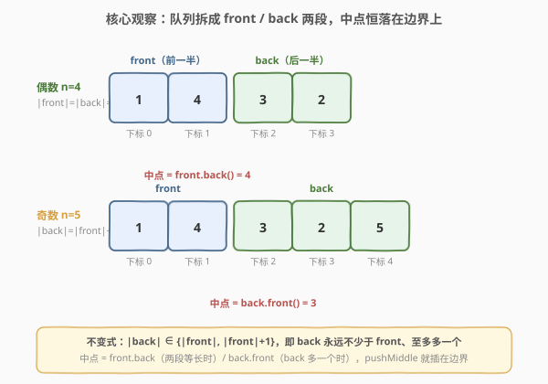
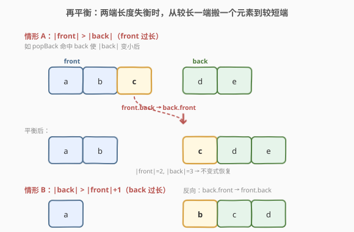
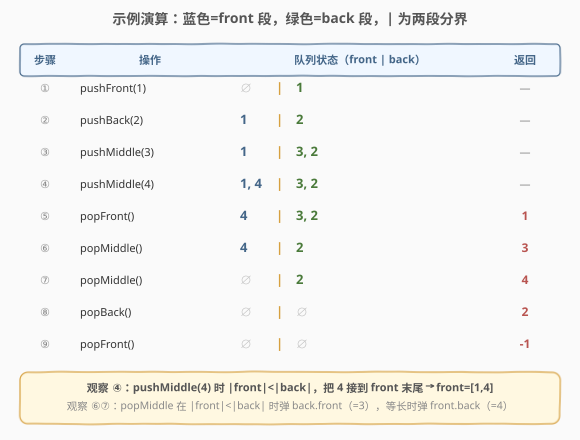

# LeetCode 设计前中后队列 题解

## 1. 题目概述

- **标题 / 题号**：设计前中后队列（#1670，medium）
- **链接**：https://leetcode.cn/problems/design-front-middle-back-queue/
- **难度**：中等
- **标签**：设计、队列、双端队列

**题意**：设计一个支持在**队首、队中、队尾**三处进行 `push` / `pop` 的队列。实现 `FrontMiddleBackQueue` 类：

- `FrontMiddleBackQueue()`：初始化空队列。
- `void pushFront(int val)`：把 `val` 加到队首。
- `void pushMiddle(int val)`：把 `val` 加到**中间位置**。
- `void pushBack(int val)`：把 `val` 加到队尾。
- `int popFront()`：弹出并返回队首元素；队列为空返回 `-1`。
- `int popMiddle()`：弹出并返回**中间元素**；队列为空返回 `-1`。
- `int popBack()`：弹出并返回队尾元素；队列为空返回 `-1`。

> 💡 **"中间"的精确定义**（本题最易踩坑处）：对大小为 $n$ 的队列，中间元素是 **0-indexed 下标 $\lfloor (n-1)/2 \rfloor$** 处的元素（队首下标为 0）。对 `pushMiddle` 而言，插入后队列大小变为 $n+1$，新元素应位于下标 $\lfloor n/2 \rfloor$——即**插入到当前下标 $\lfloor n/2 \rfloor$ 处**（$n$ 为插入前大小）。一句话：`pop` 取 $\lfloor (n-1)/2 \rfloor$，`push` 插 $\lfloor n/2 \rfloor$，二者在奇偶性上错开一格。

**示例 1**：

```text
输入：
["FrontMiddleBackQueue","pushFront","pushBack","pushMiddle","pushMiddle","popFront","popMiddle","popMiddle","popBack","popFront"]
[[],[1],[2],[3],[4],[],[],[],[],[]]
输出：
[null,null,null,null,null,1,3,4,2,-1]

解释：
q.pushFront(1);   // [1]
q.pushBack(2);    // [1, 2]
q.pushMiddle(3);  // [1, 3, 2]      ← 3 插到下标 floor(2/2)=1
q.pushMiddle(4);  // [1, 4, 3, 2]   ← 4 插到下标 floor(3/2)=1
q.popFront();     // 返回 1 → [4, 3, 2]
q.popMiddle();    // 返回 3 → [4, 2]   ← n=3, 下标 floor(2/2)=1 → 元素 3
q.popMiddle();    // 返回 4 → [2]       ← n=2, 下标 floor(1/2)=0 → 元素 4
q.popBack();      // 返回 2 → []
q.popFront();     // 返回 -1（空）
```

**约束**：

- $1 \leq \text{val} \leq 10^9$
- 最多调用 $1000$ 次操作
- 至少会先调用一次 `pushFront` / `pushMiddle` / `pushBack`

> 💡 题目本质是**在序列任意位置插入/删除**的设计题。`pushFront`/`pushBack`/`popFront`/`popBack` 都是端点操作，双端队列天然 $O(1)$；难点只在 `pushMiddle`/`popMiddle`——序列中部的插入删除若用单条 `deque` 是 $O(n)$。突破口是把队列**拆成两条双端队列**，让"中间"永远落在两条队列的**端点**上，从而把中部操作降为 $O(1)$。

## 2. 解题思路

### 2.1 暴力思路：单条双端队列直接模拟

最直白的写法：用一条 `deque<int> q` 存整条队列。

- `pushFront` / `pushBack` / `popFront` / `popBack`：直接调 `deque` 的端点操作，$O(1)$。
- `pushMiddle(val)`：`q.insert(q.begin() + q.size()/2, val)`，在中间插入，$O(n)$。
- `popMiddle()`：`q.erase(q.begin() + (q.size()-1)/2)`，在中间删除，$O(n)$。

```text
pushMiddle(val):  q.insert(pos = q.size()/2, val)     // O(n) 搬移后半段
popMiddle():      val = q[(q.size()-1)/2]; q.erase(pos) // O(n) 搬移后半段
```

这样写**结果正确**，且因 $n \leq 1000$、调用最多 1000 次也能 AC，最坏 $O(n^2) \approx 10^6$。但 `insert`/`erase` 中部要把后半段整体搬移，浪费在"中间操作 $O(n)$"上。要优化到全程 $O(1)$，必须让"中间"不再位于序列中部、而位于某条队列的**端点**。

### 2.2 核心观察：拆成 front / back 两条双端队列，中点恒落边界



把整条队列从中间**切成两段**：`front` 存前一半，`back` 存后一半，并维护一条**不变式**：

$$
\boxed{\;|\text{back}| \in \{|\text{front}|,\ |\text{front}|+1\}\;}
$$

即 `back` 永远**不少于** `front`、且**至多多一个**。等价地：`front` 持有前 $\lfloor n/2 \rfloor$ 个元素，`back` 持有后 $\lceil n/2 \rceil$ 个元素。

在这条不变式下，**"中间"元素永远落在两段的边界端点**：

| 总大小 $n$ | $|\text{front}|, |\text{back}|$ | 中间下标 $\lfloor (n-1)/2 \rfloor$ | 落点 | 取法 |
|------------|--------------------------------|-----------------------------------|------|------|
| 偶数 $2k$ | $k,\ k$ | $k-1$ | `front` 的最后一个 | `front.back()` |
| 奇数 $2k+1$ | $k,\ k+1$ | $k$ | `back` 的第一个 | `back.front()` |

于是 `popMiddle` 只需比较两段长度：等长弹 `front.back()`，`back` 多一个弹 `back.front()`——都是端点操作，$O(1)$。

`pushMiddle` 同理：插入位置 $\lfloor n/2 \rfloor$ 恰好是两段的**边界**。若 $|\text{front}| < |\text{back}|$（$n$ 奇），插到 `front` 末尾（`front.push_back`）；否则插到 `back` 头部（`back.push_front`）。两者都是端点操作 $O(1)$，且**自然维持不变式**，无需再平衡：

- $n=2k$（等长）：`back.push_front` → $|\text{back}|=k+1=|\text{front}|+1$ ✓
- $n=2k+1$（`back` 多一）：`front.push_back` → $|\text{front}|=k+1=|\text{back}|$ ✓

> 💡 **为什么不变式让 `back` 多一个而不是 `front`？** 因为中间下标 $\lfloor (n-1)/2 \rfloor$ 在 $n$ 为奇数时落在正中（第 $k+1$ 个，下标 $k$）。让 `back` 持有这"多出来的中间元素"，`popMiddle` 在奇数情形弹 `back.front()` 语义最自然；若反过来让 `front` 多一个，则偶数情形的中间会跑到 `back.front()`、奇数情形跑到 `front.back()`，规则更绕。选 `back` 多一是为了把"中间"统一表达为"较短段的紧邻后继"。

> ⚠️ 端点操作 `pushFront`/`pushBack`/`popFront`/`popBack` 会**破坏**不变式（往 `front` 头部加元素可能使 `front` 反超 `back`；从 `back` 尾部删元素可能使 `back` 少于 `front`）。这些操作后需要一次**再平衡**——见 2.3。

### 2.3 算法流程图：再平衡



端点操作后，用统一的 `balance()` 修复不变式，只需处理两种失衡方向：

- **情形 A**：$|\text{front}| > |\text{back}|$（`front` 过长，发生于 `pushFront` 后、或 `popBack` 使 `back` 变短后）→ 把 `front.back()` 搬到 `back.front()`。
- **情形 B**：$|\text{back}| > |\text{front}|+1$（`back` 过长，发生于 `pushBack` 后、或 `popFront` 使 `front` 变短后）→ 把 `back.front()` 搬到 `front.back()`。

```text
balance():
    if |front| > |back|:                 # 情形 A
        back.push_front( front.back() ); front.pop_back()
    elif |back| > |front| + 1:           # 情形 B
        front.push_back( back.front() ); back.pop_front()
```

各操作的完整流程：

| 操作 | 核心 | 事后处理 |
|------|------|----------|
| `pushFront(v)` | `front.push_front(v)` | `balance()` |
| `pushBack(v)` | `back.push_back(v)` | `balance()` |
| `pushMiddle(v)` | 若 `\|front\|<\|back\|` 则 `front.push_back(v)` 否则 `back.push_front(v)` | 无（自平衡） |
| `popFront()` | `front` 非空弹 `front.front()`，否则弹 `back.front()`；都空返回 `-1` | `balance()` |
| `popMiddle()` | 若 `\|front\|<\|back\|` 弹 `back.front()` 否则弹 `front.back()`；都空返回 `-1` | 无（自平衡） |
| `popBack()` | `back` 非空弹 `back.back()`，否则返回 `-1` | `balance()` |

> 💡 `pushMiddle`/`popMiddle` **自平衡**：由 2.2 推导，它们的插入/弹删位置选在较短段（或较长段的端点），操作后不变式天然成立，故无需调用 `balance()`。这是本题代码简洁的关键。

> ⚠️ `popFront` 当 `front` 为空但 `back` 非空（即 $n=1$）时，要从 `back` 弹——因为不变式保证 `back` 持有后一半，单元素时必在 `back`。`popBack` 不存在"back 空但 front 非空"的情况：不变式 $|\text{back}|\geq|\text{front}|$ 保证 `back` 空时 `front` 必空。

### 2.4 示例演算



以官方示例为线索，逐步追踪 `front`/`back` 两段的状态（`|` 为两段分界，左侧蓝为 `front`，右侧绿为 `back`）：

| 步骤 | 操作 | front | back | 队列 | 返回 | 说明 |
|------|------|-------|------|------|------|------|
| init | 构造 | `[]` | `[]` | `[]` | — | 两段皆空 |
| ① | `pushFront(1)` | `[]` | `[1]` | `[1]` | — | 先压 `front`，`balance` 情形 A 把 1 搬到 `back` |
| ② | `pushBack(2)` | `[1]` | `[2]` | `[1,2]` | — | 先压 `back`，`balance` 情形 B 把 1 搬回 `front` |
| ③ | `pushMiddle(3)` | `[1]` | `[3,2]` | `[1,3,2]` | — | 等长 → `back.push_front(3)`，自平衡 |
| ④ | `pushMiddle(4)` | `[1,4]` | `[3,2]` | `[1,4,3,2]` | — | `front`<`back` → `front.push_back(4)`，自平衡 |
| ⑤ | `popFront()` | `[4]` | `[3,2]` | `[4,3,2]` | `1` | 弹 `front.front`=1，`balance` 无需动 |
| ⑥ | `popMiddle()` | `[4]` | `[2]` | `[4,2]` | `3` | `front`<`back` → 弹 `back.front`=3 |
| ⑦ | `popMiddle()` | `[]` | `[2]` | `[2]` | `4` | 等长 → 弹 `front.back`=4 |
| ⑧ | `popBack()` | `[]` | `[]` | `[]` | `2` | 弹 `back.back`=2 |
| ⑨ | `popFront()` | `[]` | `[]` | `[]` | `-1` | 两段皆空 |

> 💡 **观察要点**：步骤 ①② 一对 `pushFront`/`pushBack` 触发了两次"搬家"——这是 `balance` 在维持"单元素必须在 `back`"的不变式。步骤 ④ `pushMiddle(4)` 选择插到 `front` 末尾而非 `back` 头部，是因为 $|\text{front}|<|\text{back}|$（奇数大小），把新元素补进较短段以恢复等长。步骤 ⑥⑦ 的 `popMiddle` 因奇偶不同分别从 `back.front`/`front.back` 弹出——正是 2.2 表格的两种落点。

## 3. 参考代码

### C++

```cpp
class FrontMiddleBackQueue {
    deque<int> front, back;

    void balance() {
        if (front.size() > back.size()) {
            back.push_front(front.back());
            front.pop_back();
        } else if (back.size() > front.size() + 1) {
            front.push_back(back.front());
            back.pop_front();
        }
    }

  public:
    FrontMiddleBackQueue() {}

    void pushFront(int val) {
        front.push_front(val);
        balance();
    }

    void pushMiddle(int val) {
        if (front.size() < back.size())
            front.push_back(val);
        else
            back.push_front(val);
    }

    void pushBack(int val) {
        back.push_back(val);
        balance();
    }

    int popFront() {
        if (front.empty() && back.empty()) return -1;
        int val;
        if (front.empty()) {
            val = back.front();
            back.pop_front();
        } else {
            val = front.front();
            front.pop_front();
        }
        balance();
        return val;
    }

    int popMiddle() {
        if (back.empty()) return -1;
        int val;
        if (front.size() < back.size()) {
            val = back.front();
            back.pop_front();
        } else {
            val = front.back();
            front.pop_back();
        }
        return val;
    }

    int popBack() {
        if (back.empty()) return -1;
        int val = back.back();
        back.pop_back();
        balance();
        return val;
    }
};
```

### Python

```python
from collections import deque


class FrontMiddleBackQueue:
    def __init__(self):
        self.front = deque()
        self.back = deque()

    def _balance(self) -> None:
        if len(self.front) > len(self.back):
            self.back.appendleft(self.front.pop())
        elif len(self.back) > len(self.front) + 1:
            self.front.append(self.back.popleft())

    def pushFront(self, val: int) -> None:
        self.front.appendleft(val)
        self._balance()

    def pushMiddle(self, val: int) -> None:
        if len(self.front) < len(self.back):
            self.front.append(val)
        else:
            self.back.appendleft(val)

    def pushBack(self, val: int) -> None:
        self.back.append(val)
        self._balance()

    def popFront(self) -> int:
        if not self.front and not self.back:
            return -1
        if self.front:
            val = self.front.popleft()
        else:
            val = self.back.popleft()
        self._balance()
        return val

    def popMiddle(self) -> int:
        if not self.back:
            return -1
        if len(self.front) < len(self.back):
            return self.back.popleft()
        return self.front.pop()

    def popBack(self) -> int:
        if not self.back:
            return -1
        val = self.back.pop()
        self._balance()
        return val
```

> 💡 **写法细节**：
> - `balance()` 用 `if/elif` 而非两条 `if`：两种失衡方向互斥（不可能同时 $|\text{front}|>|\text{back}|$ 且 $|\text{back}|>|\text{front}|+1$），单次至多搬一个元素即可恢复不变式。
> - `popMiddle` 不调用 `balance`：由 2.2 推导，它从较短段（或等长时的 `front` 尾）弹出后不变式天然成立。若误加 `balance` 也不出错（变成 no-op），但属冗余。
> - `popFront` 的 `front` 空分支处理 $n=1$（元素在 `back`）；`popBack` 无需类似分支，因为不变式保证 `back` 空时 `front` 必空。
> - C++ `deque` 的 `push_front`/`pop_back` 等均为 $O(1)$；Python `collections.deque` 同理，避免用 `list`（头部 `insert(0)`/`pop(0)` 是 $O(n)$）。

## 4. 复杂度分析

| 维度 | 复杂度 | 说明 |
|------|--------|------|
| 时间复杂度（单次 `pushFront`/`pushBack`/`popFront`/`popBack`） | $O(1)$ | 一次端点操作 + 至多一次 `balance`（搬一个端点元素），均为 $O(1)$ |
| 时间复杂度（单次 `pushMiddle`/`popMiddle`） | $O(1)$ | 直接在 `front.back`/`back.front` 端点插入/删除，且自平衡，无需搬移 |
| 时间复杂度（总体 $m$ 次操作） | $O(m)$ | 每次均摊 $O(1)$ |
| 空间复杂度 | $O(n)$ | 两条 `deque` 合计存 $n$ 个元素，$n$ 为当前队列大小 |

> 💡 暴力法用单条 `deque` 的 `insert`/`erase` 做中部操作是 $O(n)$ 单次、$O(nm)$ 总体；拆双端队列后**总体从 $O(nm)$ 降到 $O(m)$**。关键在于把"中间"这个序列中部位置，通过拆段不变式映射到两条队列的端点——这是"用结构变换把 $O(n)$ 操作降为 $O(1)$"的典型设计套路，与 232 用栈实现队列的"双栈倒换"同源。

## 5. 面试要点

1. **为什么"中间"能落在端点上？不变式起了什么作用？**

   - 不变式 $|\text{back}|\in\{|\text{front}|,|\text{front}|+1\}$ 让 `front` 持前 $\lfloor n/2\rfloor$、`back` 持后 $\lceil n/2\rceil$。中间下标 $\lfloor(n-1)/2\rfloor$ 在偶数 $n=2k$ 时为 $k-1$（`front` 最后一个），奇数 $n=2k+1$ 时为 $k$（`back` 第一个）——两种情形都落在某段的端点。不变式把"序列中部"几何位置恒等映射到"双端队列端点"，是降阶的核心。

2. **`pushMiddle` 的两种分支怎么选？为什么自平衡？**

   - 比较 $|\text{front}|$ 与 $|\text{back}|$：若 $|\text{front}|<|\text{back}|$（$n$ 奇），插入位置 $\lfloor n/2\rfloor=k$ 等于 `front` 当前长度，新元素接在 `front` 末尾（`front.push_back`）；否则（$n$ 偶）插入位置等于 `back` 当前第一个的下标，用 `back.push_front`。两种选择都使插入后 $|\text{back}|\in\{|\text{front}|,|\text{front}|+1\}$ 自动成立，故无需 `balance`。

3. **`balance` 为什么用 `if/elif` 且只搬一个元素？**

   - 两种失衡方向互斥。单次端点 `push`/`pop` 最多让某段长度变化 1，因此至多让不变式偏差 1（如 $|\text{front}|=|\text{back}|+1$ 或 $|\text{back}|=|\text{front}|+2$）。搬一个端点元素到另一段即可同时修正"多一"与"少一"，恢复不变式。若一次操作可能改变长度超过 1（本题不会），才需循环搬运。

4. **`popFront` 当 `front` 为空时为什么要从 `back` 弹？`popBack` 为什么没有对称分支？**

   - 不变式保证 $|\text{back}|\geq|\text{front}|$，故 `front` 空时 `back` 可能有 1 个元素（$n=1$），此时唯一的队首就是 `back.front`，须从 `back` 弹。反过来 `back` 空时由不变式知 `front` 必空（$|\text{back}|\geq|\text{front}|\geq0$），所以 `popBack` 只需判 `back` 空，无对称分支。

5. **为什么选 $|\text{back}|\geq|\text{front}|$ 而不是反过来？**

   - 这是为了让"中间"在奇数情形（正中元素）落在 `back.front`——`back` 持有"多出来的中间元素"。若让 `front` 多一个，则偶数情形中间跑到 `back.front`、奇数情形跑到 `front.back`，规则需要"看奇偶选段"反而绕。选 `back` 多一使落点规则统一为"等长看 `front` 尾、不等看 `back` 头"。两种选法都正确，但代码简洁度不同。

6. **如果调用次数放大到 $10^7$、元素需支持随机访问中点附近，方案要怎么改？**

   - 双端队列方案已是均摊 $O(1)$，能扛住 $10^7$。若还需任意下标随机访问，`deque` 不支持 $O(1)$ 随机访问（C++ `deque` 的 `[]` 虽 $O(1)$ 但跨块常数大；Python `deque` 的 `[]` 是 $O(n)$），可改用**平衡树/块状数组（分块）**，把单点插入删除控制在 $O(\sqrt n)$，或用 `rope` 结构。本题规模无需此扩展。

## 同类练习题

| # | 题目 | 与本题的关联 |
|---|------|-------------|
| 232 | [用栈实现队列](https://leetcode.cn/problems/implement-queue-using-stacks/)（[题解](../0201-0300/232_用栈实现队列.md)） | 设计题经典模板，"双栈倒换"把队首操作从 $O(n)$ 降为均摊 $O(1)$，与本题"双端队列拆段"同属"用结构变换把昂贵操作映射到端点"的范式 |
| 641 | [设计循环双端队列](https://leetcode.cn/problems/design-circular-deque/) | 双端队列设计入门，熟悉 `push_front`/`push_back`/`pop_front`/`pop_back` 的 $O(1)$ 实现，是本题端点操作的基础 |
| 933 | [最近的请求次数](https://leetcode.cn/problems/number-of-recent-calls/)（[题解](../0901-1000/933_最近的请求次数.md)） | 队列维护时间窗口，体会"按操作语义选数据结构"的设计思路 |
| 146 | [LRU 缓存](https://leetcode.cn/problems/lru-cache/)（[题解](../0101-0200/146_LRU缓存.md)） | 设计题进阶，哈希 + 双向链表把任意位置删除降到 $O(1)$，是本题"拆段把中部映射到端点"思想的复杂度升级版 |
| 1656 | [设计有序流](https://leetcode.cn/problems/design-an-ordered-stream/)（[题解](../1601-1700/1656_设计有序流.md)） | 同目录设计题，"单调指针 + 均摊"把乱序到达按序吐出降为均摊 $O(1)$，对照本题的均摊与不变式维护 |
