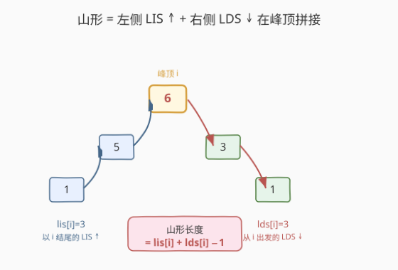
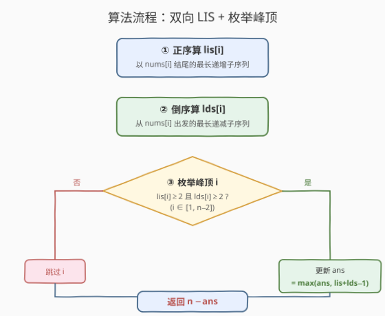

# 得到山形数组的最少删除次数

- **题目名称**：得到山形数组的最少删除次数
- **链接**：[1671. 得到山形数组的最少删除次数](https://leetcode.cn/problems/minimum-number-of-removals-to-make-mountain-array/)
- **难度**：困难
- **标签**：动态规划、二分查找、贪心、最长递增子序列（LIS）

## 1. 题目概述

我们定义 `arr` 是**山形数组**当且仅当它满足：

- `arr.length >= 3`
- 存在某个下标 `i`（$0 < i < \text{arr.length} - 1$）满足：
  - `arr[0] < arr[1] < ... < arr[i-1] < arr[i]`（严格递增到峰顶）
  - `arr[i] > arr[i+1] > ... > arr[arr.length-1]`（峰顶后严格递减）

给你整数数组 `nums`，请你返回将 `nums` 变成山形数组的**最少删除次数**。

**示例 1**：

```text
输入：nums = [1,3,1]
输出：0
解释：数组本身就是山形数组（峰顶在下标 1），不需要删除任何元素。
```

**示例 2**：

```text
输入：nums = [2,1,1,5,6,2,3,1]
输出：3
解释：删除下标为 0、1、5 的元素，剩余 [1,5,6,3,1]，是山形数组（峰顶在下标 2，值 6）。
```

**约束条件**：

- $3 \leq \text{nums.length} \leq 1000$
- $1 \leq \text{nums}[i] \leq 10^9$
- 题目保证 `nums` 删除一些元素后一定能得到山形数组

> 💡 关键约束是「**子序列**」而非子数组——删除后剩余元素保持原顺序但不要求连续。这把问题从「连续滑窗」导向了「最长递增子序列（LIS）」家族。山形的「先升后降」天然对应**从两侧各做一次 LIS**。

---

## 2. 解题思路

### 2.1 暴力思路：枚举峰顶 + 两端 LIS

山形数组有一个唯一的**峰顶**下标 $i$（$0 < i < n-1$），其左侧严格递增、右侧严格递减。最直觉的想法：

1. 枚举每个可能的峰顶 $i$；
2. 在 $i$ **左侧**找一个以 `nums[i]` 结尾的最长严格递增子序列（LIS）；
3. 在 $i$ **右侧**找一个从 `nums[i]` 出发的最长严格递减子序列（LDS）；
4. 拼起来，山形长度 $= \text{lis}[i] + \text{lds}[i] - 1$（峰顶被算两次，减 1）。

「最少删除次数」$= n - \max(\text{山形长度})$。这个方向是对的，但若对每个 $i$ 都重新算一次 LIS，复杂度高达 $O(n^3)$。能否**预处理**每个位置的 LIS/LDS？

### 2.2 核心观察：双向 LIS 预处理



关键洞察来自 [300. 最长递增子序列](../0201-0300/300_最长递增子序列.md)——LIS 的 DP 定义是「以 `i` 结尾的最长递增子序列长度」，**天然给出每个位置的值**。于是我们可以：

> **从左向右**算一遍 $\text{lis}[i]$：以 `nums[i]` **结尾**的最长严格递增子序列长度。
> **从右向左**算一遍 $\text{lds}[i]$：从 `nums[i]` **出发**的最长严格递减子序列长度（等价于在反转数组上做 LIS）。

为什么从右向左做 LIS 就能得到 LDS？因为「从 $i$ 出发严格递减」等价于「从右向左看，以 $i$ 结尾严格递增」——把数组反转方向，递减就变成递增。所以两遍完全相同的 LIS 算法，只是第二遍把扫描方向反过来、把 `<` 换成对右侧更小元素的转移。

**拼山形**：对每个峰顶候选 $i$（$0 < i < n-1$），山形长度为：

$$\text{mountain}[i] = \text{lis}[i] + \text{lds}[i] - 1$$

> ⚠️ **峰顶必须两侧都有元素**：要求 $\text{lis}[i] \geq 2$（左侧至少有一个元素比峰顶小）且 $\text{lds}[i] \geq 2$（右侧至少有一个元素比峰顶小）。否则 $i$ 不是合法峰顶——它要么是递增段的起点，要么是递减段的终点，构不成「先升后降」。若不过滤，会把纯递增/纯递减序列误判为山形。

**答案**：$n - \max_{i} \text{mountain}[i]$。

> 💡 **问题转化的本质**：「最少删除」$=$ $n - $ 「最长保留」。而保留的是一个山形子序列，它由「左侧递增段 + 峰顶 + 右侧递减段」拼成。两侧各自是 LIS 问题，所以本题是 [300](../0201-0300/300_最长递增子序列.md) 的**双向拼接变体**——这正是它被归为困难题的原因：单看每侧都是模板题，难在想到「双向 LIS 在峰顶拼接」这个建模。

### 2.3 算法流程图



**完整步骤**：

1. **正序算 `lis`**：`lis[i]` = 以 `nums[i]` 结尾的最长严格递增子序列长度。
   - 初始化 `lis[i] = 1`。
   - 转移：$\text{lis}[i] = \max(\text{lis}[j] + 1)$，对所有 $j < i$ 且 $\text{nums}[j] < \text{nums}[i]$。
2. **倒序算 `lds`**：`lds[i]` = 从 `nums[i]` 出发的最长严格递减子序列长度。
   - 初始化 `lds[i] = 1`。
   - 转移：$\text{lds}[i] = \max(\text{lds}[j] + 1)$，对所有 $j > i$ 且 $\text{nums}[j] < \text{nums}[i]$（下一个更小才能续接递减段）。
3. **枚举峰顶**：对 $i \in [1, n-2]$，若 $\text{lis}[i] \geq 2$ 且 $\text{lds}[i] \geq 2$，更新 $\text{ans} = \max(\text{ans}, \text{lis}[i] + \text{lds}[i] - 1)$。
4. 返回 $n - \text{ans}$。

> ⚠️ **倒序转移的方向**：算 `lds[i]` 时，$i$ 从 $n-1$ 向 $0$ 倒序遍历，内层 $j$ 从 $i+1$ 向 $n-1$ 正序查找——因为 `lds[i]` 依赖 `lds[j]`（$j > i$），必须先算出右侧的 `lds[j]`。这与正序 LIS 镜像对称：正序 LIS 中 `lis[i]` 依赖 `lis[j]`（$j < i$），先算左侧。

### 2.4 示例演算

![示例演算：nums=[2,1,1,5,6,2,3,1] 的双向 LIS 与峰顶拼接](../images/mountain_array_example_walkthrough.svg)

以**示例 2** `nums = [2,1,1,5,6,2,3,1]`（$n=8$）为例：

**第一步：正序算 `lis`**（以 `nums[i]` 结尾的 LIS 长度）

| $i$ | nums[i] | 可接的前驱 $j$（nums[j]<nums[i]） | lis[i] | 对应子序列 |
|-----|---------|----------------------------------|--------|-----------|
| 0 | 2 | 无 | 1 | [2] |
| 1 | 1 | 无（2 > 1） | 1 | [1] |
| 2 | 1 | 无（前两个均 ≥ 1） | 1 | [1] |
| 3 | 5 | j=0,1,2（2,1,1 < 5） | 2 | [1,5] |
| 4 | 6 | j=3（5 < 6，lis[3]+1=3） | 3 | [1,5,6] |
| 5 | 2 | j=1,2（1 < 2） | 2 | [1,2] |
| 6 | 3 | j=5（2 < 3，lis[5]+1=3） | 3 | [1,2,3] |
| 7 | 1 | 无 | 1 | [1] |

`lis = [1, 1, 1, 2, 3, 2, 3, 1]`

**第二步：倒序算 `lds`**（从 `nums[i]` 出发的 LDS 长度，下一个更小才续接）

| $i$ | nums[i] | 可接的后继 $j$（nums[j]<nums[i]，$j>i$） | lds[i] | 对应子序列 |
|-----|---------|----------------------------------------|--------|-----------|
| 7 | 1 | 无 | 1 | [1] |
| 6 | 3 | j=7（1 < 3） | 2 | [3,1] |
| 5 | 2 | j=7（1 < 2） | 2 | [2,1] |
| 4 | 6 | j=5,6,7（2,3,1 < 6） | 3 | [6,3,1] |
| 3 | 5 | j=5,6,7（2,3,1 < 5） | 3 | [5,3,1] |
| 2 | 1 | 无（右侧均 ≥ 1） | 1 | [1] |
| 1 | 1 | 无 | 1 | [1] |
| 0 | 2 | j=1,2,7（1 < 2） | 2 | [2,1] |

`lds = [2, 1, 1, 3, 3, 2, 2, 1]`

**第三步：枚举峰顶** $i \in [1, 6]$，要求 $\text{lis}[i] \geq 2$ 且 $\text{lds}[i] \geq 2$

| $i$ | lis[i] | lds[i] | 合法? | mountain[i] = lis+lds−1 |
|-----|--------|--------|-------|------------------------|
| 1 | 1 | 1 | ✗（lis<2） | — |
| 2 | 1 | 1 | ✗（lis<2） | — |
| 3 | 2 | 3 | ✓ | 4 |
| 4 | 3 | 3 | ✓ | **5** ← 最大 |
| 5 | 2 | 2 | ✓ | 3 |
| 6 | 3 | 2 | ✓ | 4 |

**最大山形长度** $= 5$（峰顶在 $i=4$，值 $6$；左侧 `[1,5,6]` + 右侧 `[6,3,1]`，去重峰顶后 `[1,5,6,3,1]`）。

**答案** $= n - 5 = 8 - 5 = \mathbf{3}$ ✓

> 💡 **对应到题目解释**：删除下标 0、1、5，剩余下标 `[2,3,4,6,7]` 即 `[1,5,6,3,1]`，正是峰顶 $i=4$ 处 `lis=[1,5,6]`（下标 2,3,4）与 `lds=[6,3,1]`（下标 4,6,7）的拼接。

---

## 3. 参考代码

### C++

```cpp
class Solution {
public:
    int minimumMountainRemovals(vector<int>& nums) {
        int n = nums.size();
        // lis[i]: 以 nums[i] 结尾的最长严格递增子序列长度（从左向右）
        vector<int> lis(n, 1);
        for (int i = 1; i < n; ++i) {
            for (int j = 0; j < i; ++j) {
                if (nums[j] < nums[i]) {
                    lis[i] = max(lis[i], lis[j] + 1);
                }
            }
        }
        // lds[i]: 从 nums[i] 出发的最长严格递减子序列长度（从右向左）
        // 等价于在反转数组上做 LIS：lds[i] 依赖 lds[j]（j>i, nums[j]<nums[i]）
        vector<int> lds(n, 1);
        for (int i = n - 2; i >= 0; --i) {
            for (int j = i + 1; j < n; ++j) {
                if (nums[j] < nums[i]) {
                    lds[i] = max(lds[i], lds[j] + 1);
                }
            }
        }
        // 枚举峰顶：两侧都必须有元素（lis>=2 且 lds>=2）
        int maxMountain = 0;
        for (int i = 1; i < n - 1; ++i) {
            if (lis[i] >= 2 && lds[i] >= 2) {
                maxMountain = max(maxMountain, lis[i] + lds[i] - 1);
            }
        }
        return n - maxMountain;
    }
};
```

### Python

```python
class Solution:
    def minimumMountainRemovals(self, nums: List[int]) -> int:
        n = len(nums)
        # lis[i]: 以 nums[i] 结尾的最长严格递增子序列长度（从左向右）
        lis = [1] * n
        for i in range(1, n):
            for j in range(i):
                if nums[j] < nums[i]:
                    lis[i] = max(lis[i], lis[j] + 1)

        # lds[i]: 从 nums[i] 出发的最长严格递减子序列长度（从右向左）
        # 等价于在反转数组上做 LIS：lds[i] 依赖 lds[j]（j>i, nums[j]<nums[i]）
        lds = [1] * n
        for i in range(n - 2, -1, -1):
            for j in range(i + 1, n):
                if nums[j] < nums[i]:
                    lds[i] = max(lds[i], lds[j] + 1)

        # 枚举峰顶：两侧都必须有元素（lis>=2 且 lds>=2）
        max_mountain = 0
        for i in range(1, n - 1):
            if lis[i] >= 2 and lds[i] >= 2:
                max_mountain = max(max_mountain, lis[i] + lds[i] - 1)
        return n - max_mountain
```

> ⚠️ **易错点**：
> - **峰顶合法性过滤**：必须检查 `lis[i] >= 2 && lds[i] >= 2`。若漏掉，纯递增数组（如 `[1,2,3]`）的 `lds` 全为 1，但 `lis[n-1]=3`，会误算出山形长度 3，返回 $3-3=0$——而 `[1,2,3]` 根本不是山形（没有递减段）。
> - **`lds` 的转移条件是 `nums[j] < nums[i]`**（下一个更小），不是 `nums[j] > nums[i]`。因为「从 $i$ 出发递减」意味着后续元素要越来越小，所以续接的 $j$ 必须满足 `nums[j] < nums[i]`。
> - **减 1**：峰顶 `nums[i]` 在 `lis[i]` 和 `lds[i]` 中各算了一次，拼接时需减 1。
> - **枚举范围**：峰顶 $i \in [1, n-2]$，首尾不能做峰顶（无左侧/右侧元素）。

---

## 4. 复杂度分析

| 维度 | 复杂度 | 说明 |
|------|--------|------|
| **时间复杂度** | $O(n^2)$ | 两遍 LIS 各 $O(n^2)$（双重循环）+ 枚举峰顶 $O(n)$；$n \leq 1000$ 时约 $10^6$ 次操作 |
| **空间复杂度** | $O(n)$ | `lis` 和 `lds` 两个长度为 $n$ 的数组 |
| **可优化** | $O(n \log n)$ | 用 [300 题](../0201-0300/300_最长递增子序列.md)的耐心排序 + 二分加速 LIS（见第 5 节） |

> 💡 本题 $n \leq 1000$，$O(n^2)$ 完全够用（约 $10^6$ 次，远低于时限）。若 $n$ 放大到 $10^5$，需改用 $O(n \log n)$ 的二分 LIS，但需要额外记录每个位置入桶时的长度（见扩展）。

---

## 5. 扩展：$O(n \log n)$ 二分 LIS 加速

[300 题](../0201-0300/300_最长递增子序列.md)的贪心 + 二分用「耐心数组 `tails`」把 LIS 降到 $O(n \log n)$：`tails[k]` = 长度为 $k+1$ 的递增子序列的最小末尾。但 `tails` 只给总长度，不给**每个位置**的 `lis[i]`。本题需要逐位置的 `lis[i]`/`lds[i]`，怎么办？

**关键**：在二分 LIS 过程中，每个元素 `nums[i]` 被放入 `tails[pos]`（`pos = lower_bound(tails, nums[i])`），此时 `lis[i] = pos + 1`（它成为长度为 `pos+1` 子序列的末尾）。记录下来即可：

```python
import bisect

def lengthOfLIS_per_pos(nums):
    n = len(nums)
    lis = [1] * n
    tails = []
    for i, x in enumerate(nums):
        pos = bisect.bisect_left(tails, x)   # 第一个 >= x 的位置
        if pos == len(tails):
            tails.append(x)
        else:
            tails[pos] = x
        lis[i] = pos + 1                      # nums[i] 是长度 pos+1 子序列的末尾
    return lis
```

> ⚠️ **严格递增用 `bisect_left`**（第一个 $\geq x$）：相同元素会替换自己，不增长长度，保证严格。若改为非严格递增（$\leq$），用 `bisect_right`。

对 `lds`，只需在**反转数组**上跑一遍同样的二分 LIS，再把结果下标映回原数组。或等价地，从右向左扫描 `nums`，用 `bisect_left` 维护「右侧更小元素」的 `tails`。完整实现：

```python
import bisect

class Solution:
    def minimumMountainRemovals(self, nums: List[int]) -> int:
        n = len(nums)

        def lis_per_pos(arr):
            lis = [1] * len(arr)
            tails = []
            for i, x in enumerate(arr):
                pos = bisect.bisect_left(tails, x)
                if pos == len(tails):
                    tails.append(x)
                else:
                    tails[pos] = x
                lis[i] = pos + 1
            return lis

        lis = lis_per_pos(nums)                          # 从左向右
        lds_reversed = lis_per_pos(nums[::-1])           # 在反转数组上做 LIS
        lds = lds_reversed[::-1]                         # 映回原下标

        max_mountain = 0
        for i in range(1, n - 1):
            if lis[i] >= 2 and lds[i] >= 2:
                max_mountain = max(max_mountain, lis[i] + lds[i] - 1)
        return n - max_mountain
```

> 💡 **复杂度**：$O(n \log n)$ 时间、$O(n)$ 空间。对 $n \leq 1000$ 收益不明显，但思路适用于 $n$ 更大的变体（如 $n \leq 10^5$ 的山形序列问题）。注意二分法**无法**还原具体子序列（替换会破坏顺序），但本题只需长度，足够。

---

## 6. 面试要点

1. **如何想到「双向 LIS」这个建模？**

   > 山形的「先升后降」可以拆成「左侧递增段 + 峰顶 + 右侧递减段」。左侧递增段是「以峰顶结尾的 LIS」，右侧递减段是「从峰顶出发的 LDS」。两者都是 [300 题](../0201-0300/300_最长递增子序列.md)的变体，且都需要**逐位置**的值（不是总长度），所以用 DP 预处理 `lis[i]`/`lds[i]` 两张表，再在峰顶拼接。「最少删除」转化为「最长山形子序列」是「正难则反」的典型。

2. **为什么 `lds` 要从右向左算？**

   > `lds[i]` 依赖右侧位置 `lds[j]`（$j > i$），所以必须先算出右侧再算左侧——从右向左遍历保证计算 `lds[i]` 时 `lds[j]`（$j>i$）已就绪。这与正序 `lis` 完全镜像：`lis[i]` 依赖左侧 `lis[j]`（$j<i$），所以正序遍历。本质上 `lds` 就是在反转数组上做 `lis`。

3. **为什么必须过滤 `lis[i] >= 2 && lds[i] >= 2`？**

   > 峰顶两侧都必须至少有一个元素。若 `lis[i] = 1`，说明 `nums[i]` 左侧没有比它小的元素，它是递增段的起点，没有「上升」过程；`lds[i] = 1` 同理说明没有「下降」。漏掉过滤会把纯递增/纯递减序列误判为山形，得到错误答案 0。

4. **`lis[i] + lds[i] - 1` 为什么要减 1？**

   > 峰顶 `nums[i]` 在 `lis[i]`（作为递增段末尾）和 `lds[i]`（作为递减段起点）中各被计算一次，拼接时重复，需减去 1。这与 [1143. 最长公共子序列](https://leetcode.cn/problems/longest-common-subsequence/)的 `dp[i][j] = dp[i-1][j-1] + 1`（公共字符算一次）是同一种「去重拼接」思想。

5. **DP 法和二分法各适合什么场景？**

   > DP $O(n^2)$：给出逐位置 `lis[i]`，实现简单，适合 $n \leq 1000$；二分 $O(n \log n)$：在入桶时记录 `lis[i] = pos+1`，适合 $n$ 更大。本题 $n \leq 1000$，DP 已足够，二分是扩展优化。若面试官追问「能否还原山形子序列本身」，DP 加 `prev` 数组可回溯，二分法则需额外记录前驱链。

> 💡 **一句话总结**：1671 的核心是「山形 = 左侧 LIS + 右侧 LDS 在峰顶拼接」——两遍完全镜像的 LIS DP 预处理 `lis`/`lds` 两张表，枚举合法峰顶（两侧长度均 $\geq 2$）取 `lis[i]+lds[i]-1` 的最大值，答案为 $n - \max$。本质是 [300 题](../0201-0300/300_最长递增子序列.md)的双向拼接变体。

---

## 7. 同类练习题

- [300. 最长递增子序列](https://leetcode.cn/problems/longest-increasing-subsequence/)（[题解](../0201-0300/300_最长递增子序列.md)）：LIS 母题，本题每侧的算法来源（DP $O(n^2)$ 与二分 $O(n \log n)$ 两种实现）
- [845. 数组中的最长山脉](https://leetcode.cn/problems/longest-mountain-in-array/)：山形的「子数组」版（要求连续），用双指针/一次扫描，对比本题「子序列」版用 LIS
- [941. 有效的山脉数组](https://leetcode.cn/problems/valid-mountain-array/)：判断整个数组是否山形（不能删元素），单次扫描找峰顶后校验两侧单调，本题的判定简化版
- [1673. 找出最具竞争力的子序列](https://leetcode.cn/problems/find-the-most-competitive-subsequence/)：单调栈挑子序列，同属「保留子序列」家族但用栈而非 DP
- [354. 俄罗斯套娃信封问题](https://leetcode.cn/problems/russian-doll-envelopes/)（[题解](../0301-0400/354_俄罗斯套娃信封问题.md)）：排序 + LIS，另一道把 LIS 嵌入更大问题的困难题
