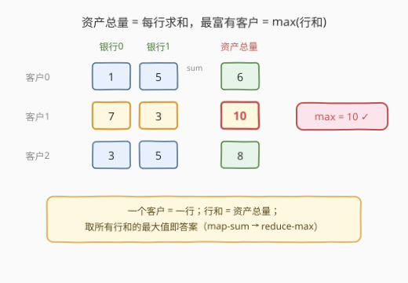
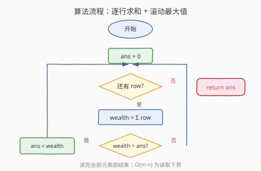

# 最富有客户的资产总量

- **题目名称**：最富有客户的资产总量
- **链接**：[1672. 最富有客户的资产总量](https://leetcode.cn/problems/richest-customer-wealth/)
- **难度**：简单
- **标签**：数组、模拟

## 1. 题目概述

给你一个 $m \times n$ 的整数网格 `accounts`，其中 `accounts[i][j]` 是第 $i$ 位客户在第 $j$ 家银行托管的资产数量。返回**最富有客户**所拥有的**资产总量**。

客户的**资产总量**就是他们在各家银行托管的资产数量之和；最富有客户即资产总量最大的客户。

**示例 1**：

```text
输入：accounts = [[1,2,3],[3,2,1]]
输出：6
解释：第 1 位客户资产总量 = 1+2+3 = 6；第 2 位 = 3+2+1 = 6。两者并列最富有，返回 6。
```

**示例 2**：

```text
输入：accounts = [[1,5],[7,3],[3,5]]
输出：10
解释：三位客户资产总量分别为 6、10、8，最富有的是第 2 位，返回 10。
```

**示例 3**：

```text
输入：accounts = [[2,8,7],[7,1,3],[1,9,5]]
输出：17
```

**约束条件**：

- $m == \text{accounts.length}$
- $n == \text{accounts}[i].\text{length}$
- $1 \leq m, n \leq 50$
- $1 \leq \text{accounts}[i][j] \leq 100$

> 💡 **关键结构**：每位客户对应**一行**，行和即其资产总量；题目本质是在二维数组上做「逐行求和 → 取最大值」的归约。

---

## 2. 解题思路

### 2.1 暴力思路：双重循环逐行求和

最直接的做法：外层遍历每个客户（行），内层遍历该客户的所有银行账户（列）累加得到 `wealth`，用一个变量 `ans` 滚动维护最大值。逻辑朴素，没有任何绕弯——但这道题**暴力即最优**，因为答案必须依赖每一个元素的值，$O(m \cdot n)$ 是读取下界。

### 2.2 核心观察：map-reduce 归约



把问题拆成两个正交的归约步骤：

- **map（逐行求和）**：对每一行做 $\Sigma$ 求和，得到长度为 $m$ 的「资产总量」序列；
- **reduce（取最大）**：在该序列上取 $\max$，即答案。

$$
\text{ans} = \max_{0 \le i < m} \sum_{j=0}^{n-1} \text{accounts}[i][j]
$$

> ⚠️ **为什么 $O(m \cdot n)$ 是下界？** 任意一个 `accounts[i][j]` 都可能成为某行和的决定性一项（例如同行其余元素相同时，它直接决定该行和的大小），从而影响最终 $\max$。因此无法跳过任何元素，必须全部读取。空间上只需一个滚动变量 `ans`，无需存储全部行和——这是「在线归约」的典型特征。

### 2.3 算法流程图



1. **初始化** `ans = 0`（资产均为正，0 是安全下界）
2. **遍历每一行** `row`：
   - 计算 `wealth = sum(row)`
   - 若 `wealth > ans`，则 `ans = wealth`
3. **返回** `ans`

> 💡 由于约束保证 `accounts[i][j] >= 1`，`ans` 初值取 `0` 一定小于等于真实最小行和；若值域含负数，则应初始化为 $-\infty$ 或首行之和。

### 2.4 示例演算

![示例演算：accounts = [[2,8,7],[7,1,3],[1,9,5]]](../images/1672_example_walkthrough.svg)

以示例 3 `accounts = [[2,8,7],[7,1,3],[1,9,5]]` 为例：

| 客户 | 银行0 | 银行1 | 银行2 | 资产总量 | 滚动 max |
|------|-------|-------|-------|----------|----------|
| 0 | 2 | 8 | 7 | 17 | **17 ← 新** |
| 1 | 7 | 1 | 3 | 11 | 17（不变） |
| 2 | 1 | 9 | 5 | 15 | 17（不变） |

行和序列为 $[17, 11, 15]$，$\max = 17$。首行即命中最大值，后续两行只做比较、不更新 `ans`。

---

## 3. 参考代码

### C++（显式双重循环）

```cpp
class Solution {
public:
    int maximumWealth(vector<vector<int>>& accounts) {
        int ans = 0;
        for (const auto& row : accounts) {
            int wealth = 0;
            for (int x : row) wealth += x;
            ans = max(ans, wealth);
        }
        return ans;
    }
};
```

### Python（一行归约）

```python
class Solution:
    def maximumWealth(self, accounts: List[List[int]]) -> int:
        return max(sum(row) for row in accounts)
```

### Python（显式循环，便于跟流程图对照）

```python
class Solution:
    def maximumWealth(self, accounts: List[List[int]]) -> int:
        ans = 0
        for row in accounts:
            wealth = sum(row)
            if wealth > ans:
                ans = wealth
        return ans
```

> 💡 Python 一行版 `max(sum(row) for row in accounts)` 用生成器表达式惰性求值，逐行产出 `sum` 再由 `max` 滚动比较，与 C++ 版的「读一行算一行」语义完全一致，空间同为 $O(1)$。

---

## 4. 复杂度分析

| 维度 | 复杂度 | 说明 |
|------|--------|------|
| 时间复杂度 | $O(m \cdot n)$ | 遍历每个元素一次，每元素 $O(1)$ 累加；已达到读取下界，无法更优 |
| 空间复杂度 | $O(1)$ | 仅用 `ans`、`wealth` 两个整型变量；生成器版亦为 $O(1)$ |

> 💡 对 $m, n \le 50$ 的约束，总操作数至多 $2500$ 次，$O(m \cdot n)$ 远远够用。即便约束放大到 $10^5 \times 10^5$，本解法在时间上仍是最优（只是输入规模本身过大）。

---

## 5. 扩展：列视角与并行求和

**列视角变体**：若题目改问「哪家银行托管的总资产最多」，只需把求和方向从行换成列——对每一列求和再取 $\max$。二维数组的「行归约」与「列归约」是同一模板的两种朝向，时间同为 $O(m \cdot n)$，但按列求和时因内存非连续（C++ 行主序存储）会有一定的 cache 不友好。

**并行化**：当 $m$ 很大时，各行求和彼此独立，天然可并行——把行分片交给多个线程/进程各自求行和与局部最大，再归约全局最大。这是 map-reduce 模型在最简单形态下的并行加速：map 阶段各行独立、reduce 阶段做一次 $\max$ 合并。面试中可作为「数据量大时如何扩展」的延伸回答。

---

## 6. 面试要点

**Q1：为什么这道题的暴力法就是最优解？**
> 答案依赖每个 `accounts[i][j]` 的值——任意元素都可能影响其所在行的行和，进而影响最终 $\max$。因此无法跳过任何元素，读取下界为 $O(m \cdot n)$，双重循环已达到该下界。

**Q2：`ans` 的初值为什么取 0？**
> 约束保证 `accounts[i][j] >= 1`，故任意行和 $\geq n \geq 1 > 0$，0 是安全的下界。若值域含负数，应初始化为 $-\infty$（C++ 用 `INT_MIN`）或先取首行和作为初值，避免「全负输入返回 0」的错误。

**Q3：能否不显式存行和，进一步省空间？**
> 已经在省了——`wealth` 是逐行复用的临时变量，不保留所有行和。整体只用了 `ans` + `wealth` 两个标量，空间 $O(1)$，无法再降。Python 的生成器版 `max(sum(row) for row in accounts)` 也是逐行产出后即丢弃，等价 $O(1)$。

**Q4：如果输入是流式到达（一行一行给），还能解吗？**
> 能。这正是「滚动 max」的优势：每收到一行就求和并更新 `ans`，无需存储整个矩阵。时间和空间仍是 $O(\text{总元素数})$ / $O(1)$，适合在线场景。

**Q5：行主序存储对性能有何影响？**
> C++ 中 `vector<vector<int>>` 按行存储，逐行遍历是连续内存访问，cache 友好；若改成逐列遍历（列视角变体），则会跨行跳跃，cache 命中率下降。对 $50 \times 50$ 的小数据无感，但大规模数据下行优先遍历明显更快。

---

## 7. 同类练习题

- [1572. 矩阵对角线元素的和](https://leetcode.cn/problems/matrix-diagonal-sum/)：同属二维网格求和，改为沿主/副对角线累加（注意奇数阶中心去重）
- [832. 翻转图像](https://leetcode.cn/problems/flipping-an-image/)：逐行对二维网格做「翻转 + 反转」操作，同样的行优先遍历骨架
- [566. 重塑矩阵](https://leetcode.cn/problems/reshape-the-matrix/)：二维网格按行遍历并重塑形状，考察行主序的索引映射
- [1252. 奇数值单元格的数目](https://leetcode.cn/problems/cells-with-odd-values-in-a-rectangular-matrix/)：行/列累加影响后查奇偶，是「行和/列和」思想的间接应用
- [724. 寻找数组的中心下标](https://leetcode.cn/problems/find-pivot-index/)：一维前缀和找中心下标，对照本题「行和 + 取最值」的归约方向
