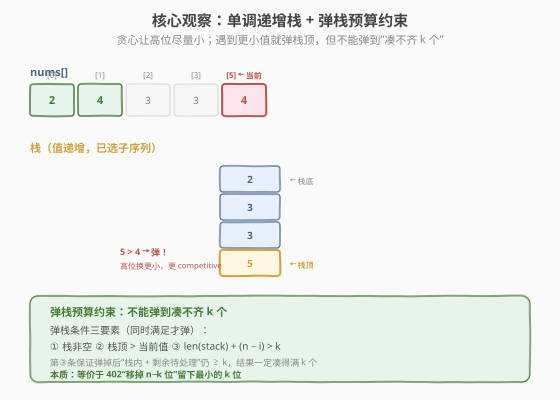
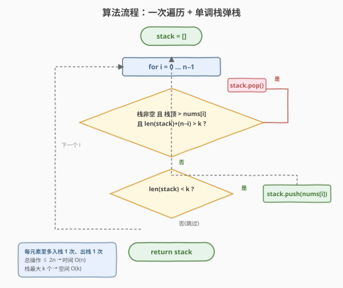

# 找出最具竞争力的子序列

- **题目名称**：找出最具竞争力的子序列
- **链接**：[1673. 找出最具竞争力的子序列](https://leetcode.cn/problems/find-the-most-competitive-subsequence/)
- **难度**：中等
- **标签**：栈、贪心、单调栈、数组

## 1. 题目概述

给你一个整数数组 `nums` 和一个正整数 `k`，返回长度为 `k` 的**最具竞争力**的 `nums` 子序列。

数组的子序列是由删除一些（也可能不删除）元素、且不改变剩余元素顺序得到的序列。**最具竞争力**的定义是字典序最小：两个等长子序列在第一个不相同的位置上，数值更小的那个更具竞争力。

**示例 1**：

```text
输入：nums = [3,5,2,6], k = 2
输出：[2,6]
解释：所有长度为 2 的子序列有 [3,5]、[3,2]、[3,6]、[5,2]、[5,6]、[2,6]，
      其中 [2,6] 字典序最小（第一位 2 比其他都小），最具竞争力。
```

**示例 2**：

```text
输入：nums = [2,4,3,3,5,4,9,6], k = 4
输出：[2,3,3,4]
```

**约束条件**：

- $1 \leq \text{nums.length} \leq 10^5$
- $0 \leq \text{nums}[i] \leq 10^9$
- $1 \leq k \leq \text{nums.length}$

> 💡 关键约束有两个：一是 $n \leq 10^5$，排除了 $O(n^2)$ 暴力；二是「子序列」而非子数组，允许跳过元素但不改变顺序。这把问题直接导向**单调栈贪心**——在保证能凑齐 $k$ 个的前提下，尽量让高位取更小的值。

---

## 2. 解题思路

### 2.1 暴力思路

枚举所有长度为 $k$ 的子序列（共 $\binom{n}{k}$ 个），逐个比较字典序取最小。当 $n = 10^5$、$k = n/2$ 时组合数是天文数字，必然超时。

退一步想：字典序比较是**从左到右逐位**进行的，**高位优先**。所以只要让结果序列的第 0 位尽可能小，其次第 1 位尽可能小……这种「高位贪心」的局部最优恰好导出全局最优。

### 2.2 核心观察：单调递增栈 + 弹栈预算约束



把「让每一位尽可能小」翻译成栈操作：维护一个**单调递增栈**作为已选子序列，扫描 `nums` 时，若当前值比栈顶**更小**，就有动机把栈顶弹掉、用当前值替换到更靠前的高位——这样高位更小，整体字典序更小。

但弹栈不能随心所欲：**弹掉一个已选元素，就必须从后面再补一个回来，否则凑不齐 $k$ 个**。于是弹栈需要满足一个**预算约束**：

> **弹栈三条件（同时满足才弹）**：
> 1. 栈非空；
> 2. $\text{stack.top()} > \text{nums}[i]$（栈顶比当前大，换掉能让高位更小）；
> 3. $\text{len(stack)} + (n - i) > k$（弹掉后「栈内剩余 + 后面待处理」仍 $\geq k$，保证凑得满）。

第 3 条是核心：$n - i$ 是从当前位置到末尾的元素个数（含 `nums[i]`）。弹掉栈顶后，栈变为 $\text{len(stack)} - 1$ 个，加上后续 $n - i$ 个，总数 $\text{len(stack)} - 1 + n - i$ 必须 $\geq k$，即 $\text{len(stack)} + n - i > k$。一旦不满足，说明后面元素已经「刚好够填满」，再弹就凑不齐了，必须收手把剩余元素全部入栈。

> ⚠️ **相等不弹**：条件 2 用**严格** `>`。当 $\text{stack.top()} == \text{nums}[i]$ 时不弹——弹掉相等的元素换成相同的值，字典序不变，却白白消耗了一次「弹栈额度」，可能错失后面更好的机会。保留较早的相等元素更稳妥。

> 💡 **与 [402. 移掉 K 位数字](../0401-0500/402_移掉K位数字.md)的等价性**：402 题要求「删掉 $k$ 个使剩余数字最小」，本题要求「保留 $k$ 个使子序列最小」。令 $k_{\text{删}} = n - k_{\text{保}}$，两题完全等价——都是「在长度约束下求字典序最小的子序列」。402 的弹栈预算是「已删数 $< k_{\text{删}}$」，本题的弹栈预算是「栈内 + 剩余 $> k_{\text{保}}$」，两种表述殊途同归。

### 2.3 算法流程图



**完整步骤**：

1. 初始化空栈 `stack`。
2. 从左到右遍历 `i = 0 … n-1`：
   - **弹栈循环**：当栈非空、`stack[-1] > nums[i]`、且 `len(stack) + (n - i) > k` 时，`stack.pop()`。
   - **入栈**：若 `len(stack) < k`，`stack.append(nums[i])`；否则跳过（栈已满且当前值不优于栈顶）。
3. 遍历结束，`stack` 即为答案（长度恰为 $k$）。

> 💡 **为什么结束时栈长度恰为 $k$**：弹栈预算保证了「栈内 + 剩余 $\geq k$」始终成立。到最后 $i = n-1$ 时剩余为 1，若此时栈长 $< k$，预算条件 $\text{len} + 1 > k$ 不成立（即 $\text{len} \leq k-1$ 时 $\text{len} + 1 \leq k$ 不 $> k$）……实际上预算只在「能凑满」时才允许弹，所以整个过程中栈只会被填到 $k$、不会溢出也不会短缺。更直观地：每个元素要么入栈、要么因「弹掉别人」间接占位，预算保证末尾一定凑满 $k$ 个。

### 2.4 示例演算

![示例演算：nums=[2,4,3,3,5,4,9,6], k=4](../images/competitive_subseq_example_walkthrough.svg)

以**示例 2** `nums = [2,4,3,3,5,4,9,6]`（$n=8$, $k=4$）为例：

| $i$ | nums[i] | 弹栈判定 | 动作 | 栈（栈底→栈顶） |
|-----|---------|----------|------|------------------|
| 0 | 2 | 空栈 | 入栈 | `[2]` |
| 1 | 4 | 2 < 4，不弹 | 入栈 | `[2,4]` |
| 2 | 3 | 4 > 3，预算 $2+6=8>4$ ✓ | 弹 4，入 3 | `[2,3]` |
| 3 | 3 | 3 = 3，不弹（相等保留） | 入栈 | `[2,3,3]` |
| 4 | 5 | 3 < 5，不弹 | 入栈（满 $k=4$） | `[2,3,3,5]` |
| 5 | 4 | 5 > 4，预算 $4+3=7>4$ ✓ | 弹 5，入 4 | `[2,3,3,4]` |
| 6 | 9 | 满，4 < 9 不弹 | 跳过 | `[2,3,3,4]` |
| 7 | 6 | 满，4 < 6 不弹 | 跳过 | `[2,3,3,4]` |

**结果** $= [2, 3, 3, 4]$ ✓

两次关键弹栈（$i=2$ 弹 4 换 3、$i=5$ 弹 5 换 4）把答案从朴素的 `[2,4,3,5]` 压成了 `[2,3,3,4]`——正是贪心「高位换更小」的体现。

---

## 3. 参考代码

### C++

```cpp
class Solution {
public:
    vector<int> mostCompetitive(vector<int>& nums, int k) {
        int n = nums.size();
        vector<int> stk;              // 单调递增栈，作为已选子序列
        for (int i = 0; i < n; ++i) {
            // 弹栈三条件：栈非空、栈顶>当前、弹后仍能凑满 k 个
            while (!stk.empty()
                   && stk.back() > nums[i]
                   && (int)stk.size() + (n - i) > k) {
                stk.pop_back();
            }
            if ((int)stk.size() < k) {
                stk.push_back(nums[i]);
            }
        }
        return stk;
    }
};
```

### Python

```python
class Solution:
    def mostCompetitive(self, nums: List[int], k: int) -> List[int]:
        n = len(nums)
        stk = []                     # 单调递增栈，作为已选子序列
        for i, x in enumerate(nums):
            # 弹栈三条件：栈非空、栈顶>当前、弹后仍能凑满 k 个
            while stk and stk[-1] > x and len(stk) + (n - i) > k:
                stk.pop()
            if len(stk) < k:
                stk.append(x)
        return stk
```

> ⚠️ **易错点**：
> - **预算条件别写反**：是 `len(stk) + (n - i) > k`（弹前判断），不是 `len(stk) > k`。漏掉 `(n - i)` 会在末尾把该保留的元素误弹掉，导致结果不足 $k$ 个。
> - **严格大于**：弹栈条件用 `>` 不用 `>=`。相等时保留原元素，避免无意义的弹栈消耗额度。
> - **入栈前判 `len < k`**：栈满后即便当前值更小也不入栈（预算不允许弹，自然也无法新增），避免栈长度超过 $k$。

---

## 4. 复杂度分析

| 维度 | 复杂度 | 说明 |
|------|--------|------|
| **时间复杂度** | $O(n)$ | 每个元素至多入栈 1 次、出栈 1 次，总操作 $\leq 2n$；单次循环体 $O(1)$ 均摊 |
| **空间复杂度** | $O(k)$ | 栈最多存 $k$ 个元素（输出本身也占 $k$） |

> 💡 $n \leq 10^5$，$O(n)$ 单调栈是本题的最优复杂度，无需进一步优化。单调栈的「每个元素一进一出」是 $O(n)$ 均摊的经典论证，与 [739. 每日温度](https://leetcode.cn/problems/daily-temperatures/)、[84. 柱状图中最大的矩形](https://leetcode.cn/problems/largest-rectangle-in-histogram/) 同源。

---

## 5. 扩展：与 402 移掉 K 位数字的对偶关系

[402. 移掉 K 位数字](../0401-0500/402_移掉K位数字.md)要求「从一个数字字符串中删掉 $k$ 个字符，使剩余数字最小」。设字符串长度为 $n$，则等价于「保留 $n - k$ 个字符使字典序最小」——正是本题 $k_{\text{保}} = n - k_{\text{删}}$ 的特例。

两题的弹栈预算表述不同，但本质一致：

| | 402 移掉 K 位数字 | 1673 找出最具竞争力的子序列 |
|--|-------------------|-----------------------------|
| 目标 | 保留 $n - k_{\text{删}}$ 个使最小 | 保留 $k_{\text{保}}$ 个使最小 |
| 弹栈预算 | 已删除数 $< k_{\text{删}}$ | 栈内 + 剩余 $> k_{\text{保}}$ |
| 等价性 | $k_{\text{删}} = n - k_{\text{保}}$ | 同左 |

402 用「计数删了几个」控制弹栈上限，1673 用「还能凑几个」控制弹栈下限——一个是「还能删」、一个是「还能补」，同一枚硬币的两面。理解了其中一题，另一题可直接套用。

> ⚠️ 402 有个本题没有的细节：**前导零处理**。数字串删完后可能以 0 开头，需要去掉前导零（或返回 "0"）。子序列数值问题无此顾虑，因为数组元素本身就是整数。

---

## 6. 面试要点

1. **如何想到单调栈？**

   > 字典序「高位优先」决定贪心方向：让每一位尽可能小。用栈维护已选序列，遇到更小值时，若能用它替换掉栈顶（即让高位更小），就弹栈。这正是单调栈「用新元素触发旧元素出栈」的招牌模式，与 [739. 每日温度](https://leetcode.cn/problems/daily-temperatures/)「找下一个更大」对称——这里是「用更小值替换更大值」。

2. **弹栈预算条件 `len(stk) + (n - i) > k` 怎么来的？**

   > 弹掉栈顶后，栈剩 $\text{len}-1$ 个，后续还有 $n - i$ 个元素（含当前）可入栈。要保证最终凑满 $k$ 个，需 $(\text{len}-1) + (n-i) \geq k$，即 $\text{len} + (n-i) > k$。不满足时说明后面元素「刚好够填满」，不能再弹，必须把剩余全部保留。

3. **为什么相等时不弹栈（用 `>` 而非 `>=`）？**

   > 弹掉一个相等的元素、再入一个相等的值，字典序不变，却消耗了一次弹栈额度。保留较早的相等元素，把额度留给后面可能出现的更优替换，更稳妥。虽然本题用 `>=` 多数情况也能过（因为相等替换不影响字典序），但 `>` 是更严谨、更省操作的选择。

4. **结束时栈长度一定恰为 $k$ 吗？**

   > 是。预算条件保证了「弹栈只在能凑满时发生」，所以栈不会被弹到不足 $k$；同时入栈受 `len < k` 约束，不会超过 $k$。更形式化地：整个过程维护不变式「$\text{len(stk)} + (n - i) \geq k$ 始终成立」（弹栈只在 $> k$ 时发生，入栈只增不减），到 $i = n$ 时 $\text{len(stk)} + 0 \geq k$ 且 $\text{len(stk)} \leq k$，故 $\text{len(stk)} = k$。

5. **和 402 移掉 K 位数字有什么关系？**

   > 完全等价。402 删 $k_{\text{删}}$ 个留 $n - k_{\text{删}}$ 个，本题留 $k_{\text{保}}$ 个，令 $k_{\text{删}} = n - k_{\text{保}}$ 即可互化。402 用「已删计数 $< k_{\text{删}}$」控弹栈上限，本题用「栈内+剩余 $> k_{\text{保}}$」控弹栈下限，是同一约束的两种表述。402 额外要处理数字串的前导零。

> 💡 **一句话总结**：1673 是「长度约束下字典序最小子序列」的单调栈模板——递增栈遇更小值则弹（受「凑得满 $k$」的预算约束），相等不弹，一进一出 $O(n)$。它与 [402](../0401-0500/402_移掉K位数字.md)「移掉 K 位数字」互为对偶，是单调栈「保留/删除」家族的核心成员。

---

## 7. 同类练习题

- [402. 移掉 K 位数字](https://leetcode.cn/problems/remove-k-digits/)（[题解](../0401-0500/402_移掉K位数字.md)）：本题的对偶题，删 $k$ 个留 $n-k$ 个使最小，单调栈 + 前导零处理
- [321. 拼接最大数](https://leetcode.cn/problems/create-maximum-number/)：从两个数组各取若干拼成最大数，单调栈 + 双数组枚举分配，1673 的「最大版 + 双数组」升级
- [739. 每日温度](https://leetcode.cn/problems/daily-temperatures/)：单调栈招牌题（找下一个更大），与本题「用更小值替换」方向对称，巩固单调栈直觉
- [496. 下一个更大元素 I](https://leetcode.cn/problems/next-greater-element-i/)（[题解](../0401-0500/496_下一个更大元素%20I.md)）：单调栈找下一个更大，配合哈希查询，单调栈入门配套
- [84. 柱状图中最大的矩形](https://leetcode.cn/problems/largest-rectangle-in-histogram/)：单调栈求面积，栈方向与本题相反（递减栈找边界），拓展单调栈应用面
