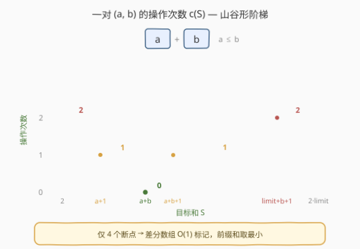
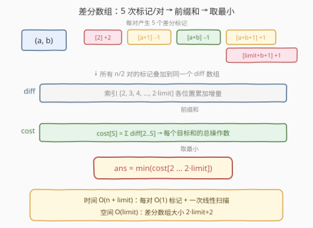

# LeetCode 使数组互补的最少操作次数 题解

## 1. 题目概述

- **标题 / 题号**：使数组互补的最少操作次数（#1674，medium）
- **链接**：https://leetcode.cn/problems/minimum-moves-to-make-array-complementary/
- **难度**：中等
- **标签**：数组、差分数组、区间更新

**题意**：给你一个长度为**偶数** `n` 的整数数组 `nums` 和一个整数 `limit`。每次操作可将 `nums` 中任意整数替换为 `1` 到 `limit` 之间的另一个整数。

若对所有下标 `i`，`nums[i] + nums[n-1-i]` 都等于同一个值，则数组**互补**。返回使数组互补的**最少**操作次数。

**示例 1**：

```text
输入：nums = [1,2,4,3], limit = 4
输出：1
解释：将 nums 变成 [1,2,2,3]（加粗元素是变更的数字），每对对称元素之和 = 4。
```

**示例 2**：

```text
输入：nums = [1,2,2,1], limit = 2
输出：2
解释：将 nums 变成 [2,2,2,2]，每对之和 = 4。不能将数字变更为 3。
```

**示例 3**：

```text
输入：nums = [1,2,1,2], limit = 2
输出：0
解释：nums 已互补，每对之和 = 3。
```

**约束**：

- $2 \le n \le 10^5$，$n$ 为偶数
- $1 \le \text{nums}[i] \le \text{limit} \le 10^5$

> 💡 **关键结构**：数组互补等价于所有对称对 $(\text{nums}[i], \text{nums}[n-1-i])$ 之和相等。共有 $n/2$ 个独立对，目标是为它们选定一个公共和 $S$，使总修改次数最少。

## 2. 解题思路

### 2.1 暴力思路：枚举目标和 S

最直接的做法：枚举目标和 $S \in [2, 2 \cdot \text{limit}]$，对每个 $S$ 遍历所有 $n/2$ 对计算所需操作数，取最小。

对单对 $(a, b)$（设 $a \le b$）达成和 $S$ 的操作数：
- $S = a + b$：无需修改，$0$ 次
- 改一个数即可（$S \in [a+1, \text{limit}+b]$ 且 $S \ne a+b$）：$1$ 次
- 两个都要改（$S \in [2, a] \cup [\text{limit}+b+1, 2 \cdot \text{limit}]$）：$2$ 次

暴力总时间 $O(\text{limit} \cdot n) = O(10^{10})$，必然超时。瓶颈在于**对每个 $S$ 重复扫描所有对**——但每对的代价函数只有几个断点，可以批量叠加。

### 2.2 核心观察：每对的代价是阶梯函数



对一对 $(a, b)$（$a \le b$），操作数 $c(S)$ 随目标和 $S$ 的变化是一个**山谷形阶梯函数**：

| $S$ 所在区间 | 操作数 | 说明 |
|-------------|--------|------|
| $[2,\ a]$ | $2$ | 两个数都太小，必须都改 |
| $[a+1,\ a+b-1]$ | $1$ | 改一个数即可（改 $a$ 或改 $b$） |
| $\{a+b\}$ | $0$ | 已满足，无需修改 |
| $[a+b+1,\ \text{limit}+b]$ | $1$ | 改一个数即可 |
| $[\text{limit}+b+1,\ 2 \cdot \text{limit}]$ | $2$ | 两个数都太大，必须都改 |

> ⚠️ **单改区间的推导**：改 $a$ 为 $x$（$1 \le x \le \text{limit}$）可得 $S = x + b \in [b+1, \text{limit}+b]$；改 $b$ 为 $y$ 得 $S = a + y \in [a+1, a+\text{limit}]$。因 $a \le b$ 且 $a + \text{limit} \ge b + 1$（$a \ge 1$），两区间并集为 $[a+1, \text{limit}+b]$。

**关键洞察**：这个阶梯函数只有 **4 个断点**（$a+1$、$a+b$、$a+b+1$、$\text{limit}+b+1$），而非 $O(\text{limit})$ 个。$n/2$ 对总共只有 $O(n)$ 个断点——可以用**差分数组**一次性叠加所有断点，再前缀和得到每个 $S$ 的总代价。

### 2.3 差分数组加速



将每对的代价分解为「基准 $2$」减去两层折扣：

$$c(S) = \underbrace{2}_{\text{基准}} - \underbrace{\mathbb{1}[S \in [a+1,\ \text{limit}+b]]}_{\text{单改省 1}} - \underbrace{\mathbb{1}[S = a+b]}_{\text{不改省 1}}$$

在差分数组 `diff` 上（`cost[S] = Σ diff[2..S]`），每对只需 **5 次标记**：

| 位置 | 增量 | 含义 |
|------|------|------|
| `diff[2]` | $+2$ | 基准代价从 $S=2$ 起生效 |
| `diff[a+1]` | $-1$ | 进入单改区，代价降 $1$ |
| `diff[a+b]` | $-1$ | 命中不改点，代价再降 $1$ |
| `diff[a+b+1]` | $+1$ | 离开不改点，代价回升 $1$ |
| `diff[limit+b+1]` | $+1$ | 离开单改区，代价回升 $1$ |

所有 $n/2$ 对处理完后，对 `diff` 做一次前缀和即可得到每个 $S$ 的总代价，取最小值即答案。

### 2.4 算法流程

1. **初始化**差分数组 `diff`，大小 $2 \cdot \text{limit} + 2$
2. **遍历**每对 $(a, b)$（$a \le b$），做 5 次差分标记
3. **前缀和**扫描 $S \in [2, 2 \cdot \text{limit}]$，滚动维护最小值
4. **返回**最小值

### 2.5 示例演算

![示例演算：nums=[1,2,4,3], limit=4](../images/1674_example.svg)

以示例 1 `nums = [1,2,4,3], limit = 4` 为例，两对为 $(1,3)$ 和 $(2,4)$：

**对 (1, 3)**：$a=1, b=3$，断点 $a+1=2,\ a+b=4,\ a+b+1=5,\ \text{limit}+b+1=8$

| diff 位置 | 2 | 4 | 5 | 8 |
|-----------|---|---|---|---|
| 增量 | $+2-1=+1$ | $-1$ | $+1$ | $+1$ |

**对 (2, 4)**：$a=2, b=4$，断点 $a+1=3,\ a+b=6,\ a+b+1=7,\ \text{limit}+b+1=9$

| diff 位置 | 2 | 3 | 6 | 7 | 9 |
|-----------|---|---|---|---|---|
| 增量 | $+2$ | $-1$ | $-1$ | $+1$ | $+1$ |

**合并差分数组**：

| $S$ | 2 | 3 | 4 | 5 | 6 | 7 | 8 |
|-----|---|---|---|---|---|---|---|
| `diff[S]` | $+3$ | $-1$ | $-1$ | $+1$ | $-1$ | $+1$ | $+1$ |
| `cost[S]` | $3$ | $2$ | $\mathbf{1}$ | $2$ | $\mathbf{1}$ | $2$ | $3$ |

最小代价 $= 1$（$S=4$ 或 $S=6$），与预期一致。$S=4$：对 $(1,3)$ 无需改，对 $(2,4)$ 改 $4 \to 2$，共 $1$ 次。

## 3. 参考代码

### C++

```cpp
class Solution {
public:
    int minMoves(vector<int>& nums, int limit) {
        int n = nums.size();
        vector<int> diff(2 * limit + 2, 0);
        for (int i = 0; i < n / 2; ++i) {
            int a = min(nums[i], nums[n - 1 - i]);
            int b = max(nums[i], nums[n - 1 - i]);
            diff[2] += 2;
            diff[a + 1] -= 1;
            diff[a + b] -= 1;
            diff[a + b + 1] += 1;
            diff[limit + b + 1] += 1;
        }
        int ans = n;
        int cost = 0;
        for (int s = 2; s <= 2 * limit; ++s) {
            cost += diff[s];
            ans = min(ans, cost);
        }
        return ans;
    }
};
```

### Python

```python
class Solution:
    def minMoves(self, nums: List[int], limit: int) -> int:
        n = len(nums)
        diff = [0] * (2 * limit + 2)
        for i in range(n // 2):
            a, b = nums[i], nums[n - 1 - i]
            if a > b:
                a, b = b, a
            diff[2] += 2
            diff[a + 1] -= 1
            diff[a + b] -= 1
            diff[a + b + 1] += 1
            diff[limit + b + 1] += 1
        ans = n
        cost = 0
        for s in range(2, 2 * limit + 1):
            cost += diff[s]
            if cost < ans:
                ans = cost
        return ans
```

> 💡 `ans` 初始化为 $n$（即 $2 \times n/2$，所有对都改两次的理论最大值），保证任何实际代价都不会超过它。

## 4. 复杂度分析

| 维度 | 复杂度 | 说明 |
|------|--------|------|
| 时间复杂度 | $O(n + \text{limit})$ | 每对 $O(1)$ 差分标记共 $O(n)$；前缀和扫描 $O(\text{limit})$ |
| 空间复杂度 | $O(\text{limit})$ | 差分数组大小 $2 \cdot \text{limit} + 2$ |

> 💡 相比暴力 $O(n \cdot \text{limit})$，差分数组将「每对 $\times$ 每个 $S$」的二维枚举压缩为「每对 $O(1)$ 标记 + 一次线性扫描」，本质是利用阶梯函数**断点稀疏**的特性。

## 5. 扩展：差分数组与阶梯函数叠加

本题是「**差分数组优化区间加**」的典型应用。一般模式：

- 有多个**分段常数函数**（阶梯函数）需要求和；
- 每个函数的断点数远少于定义域长度；
- 对每个断点在差分数组上做 $O(1)$ 标记，最后前缀和得到所有点的总和。

类似场景包括：
- **区间叠加求最值**：多个区间加操作后查询某点的最大值/最小值；
- **事件扫描**：将「区间贡献」转化为「端点事件」，按位置扫描。

若 $\text{limit}$ 极大（如 $10^9$）而断点数仍为 $O(n)$，可将差分数组替换为**离散化 + 排序扫描**，时间降为 $O(n \log n)$。

## 6. 面试要点

**Q1：为什么每对的代价函数只有 4 个断点？**
> 代价随 $S$ 的变化是「$2 \to 1 \to 0 \to 1 \to 2$」的山谷形，跳变发生在 $a+1$（进入单改区）、$a+b$（命中不改点）、$a+b+1$（离开不改点）、$\text{limit}+b+1$（离开单改区），共 4 处。

**Q2：为什么用差分数组而不是线段树？**
> 所有操作是「离线」的——先收集所有断点再统一求值，无需在线查询/更新。差分数组 $O(n + \text{limit})$ 比线段树 $O(n \log \text{limit})$ 更简单更快，且常数极小。

**Q3：`diff` 数组大小为什么是 $2 \cdot \text{limit} + 2$？**
> $S$ 的范围是 $[2, 2 \cdot \text{limit}]$，最大访问索引是 $\text{limit}+b+1 \le 2 \cdot \text{limit}+1$（$b \le \text{limit}$），故数组需覆盖 $0$ 到 $2 \cdot \text{limit}+1$，大小 $2 \cdot \text{limit}+2$。

**Q4：如果 `limit` 很大（$10^9$）怎么办？**
> 将差分数组替换为**离散化**：收集所有断点排序，用哈希表存差分值，按断点顺序扫描相邻断点间的代价。时间 $O(n \log n)$，空间 $O(n)$。

**Q5：为什么 `a ≤ b` 的假设不影响正确性？**
> 一对 $(a, b)$ 的代价只取决于两个数的值，与顺序无关。强制 $a \le b$ 是为了统一断点公式（单改区为 $[a+1, \text{limit}+b]$），避免分类讨论。

## 同类练习题

| # | 题目 | 与本题的关联 |
|---|------|-------------|
| 1109 | [航班预订统计](https://leetcode.cn/problems/corporate-flight-bookings/) | 差分数组区间加模板，最后前缀和还原 |
| 1094 | [拼车](https://leetcode.cn/problems/car-pooling/) | 差分数组判定容量是否超限，同为本题「区间叠加 + 扫描」模式 |
| 1893 | [检查是否区域内所有整数都被覆盖](https://leetcode.cn/problems/check-if-all-the-integers-in-a-range-are-covered/) | 差分数组标记区间覆盖，前缀和判定 |
| 1526 | [形成目标数组的最少操作次数](https://leetcode.cn/problems/minimum-number-of-increments-on-subarrays-to-form-a-target-array/) | 差分思想求最少子数组递增操作，与本题同为「阶梯函数差分」应用 |
| 370 | [区间加法](https://leetcode.cn/problems/range-addition/) | 差分数组原题，最纯粹的区间更新 + 前缀和 |
