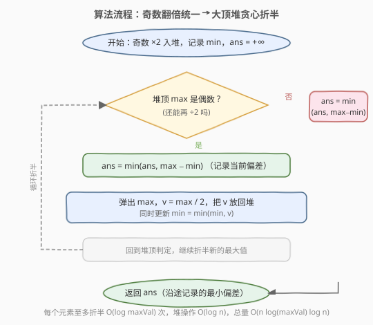

# LeetCode 最小化数组中的最大偏差 题解

## 1. 题目概述

- **标题 / 题号**：最小化数组中的最大偏差（#1675，hard）
- **链接**：https://leetcode.cn/problems/minimum-deviation-in-array/
- **难度**：困难
- **标签**：数组、堆（优先队列）、有序集合、贪心

**题意**：给定一个由 $n$ 个**正整数**组成的数组 `nums`。你可以对数组中的**任意元素**执行以下两种操作**任意次数**：

- 若元素为**偶数**，可以将其**除以 2**（如 $8 \to 4$）；
- 若元素为**奇数**，可以将其**乘以 2**（如 $3 \to 6$）。

数组的**偏差**定义为数组中**任意两个元素的最大差值**，即 $\max(\text{nums}) - \min(\text{nums})$。返回若干次操作后数组能达到的**最小偏差**。

**示例 1**：

```text
输入：nums = [1,2,3,4]
输出：1
解释：1(奇)×2 → 2，4(偶)÷2 → 2，数组变为 [2,2,3,2]，偏差 = 3 − 2 = 1。
```

**示例 2**：

```text
输入：nums = [4,1,5,20,3]
输出：3
解释：1×2→2、20÷2→10、10÷2→5，得 [4,2,5,5,3]，偏差 = 5 − 2 = 3。
```

**示例 3**：

```text
输入：nums = [2,10,8]
输出：3
解释：10÷2→5、8÷2→4，得 [2,5,4]，偏差 = 5 − 2 = 3。
```

**约束**：

- $n == \text{nums.length}$
- $2 \le n \le 10^5$
- $1 \le \text{nums}[i] \le 10^9$

> 💡 难点在于每个元素的**可达取值不是连续区间**，而是一条「÷2 链」。需要先把两类操作**统一**成单向变化，再用堆贪心搜索最优配置。

## 2. 解题思路

### 2.1 暴力思路

每个元素可达的取值构成一条链：

- **奇数** $x$：可做 $\times 2 \to 2x$（变偶），此后只能 $\div 2$ 退回 $x$。故可达集合 $= \{x,\ 2x\}$。
- **偶数** $x$：可做 $\div 2$ 直至变奇停止。可达集合 $= \{x,\ x/2,\ x/4,\ \ldots,\ \text{奇核心}\}$。

暴力做法是**枚举每个元素从其可达集合中选一个值**，组合后计算 $\max - \min$ 取最小。但单个偶数的链长可达 $O(\log(\max\text{Val})) \approx 31$，$n = 10^5$ 时组合数是天文数字。需要换视角：**不要枚举组合，而去单调地「压低最大值」**。

### 2.2 核心观察：奇数翻倍统一 + 大顶堆贪心折半


**观察一：两类操作可统一为「只能 ÷2」**。奇数唯一能做的是 $\times 2$（变偶），做完之后就和偶数一样只能 $\div 2$。因此**预处理时把所有奇数先 $\times 2$**：

- 此后**全数组都是偶数**，唯一可做的操作就是 $\div 2$；
- 每个元素的取值只能沿链**单调减小**，不再有「先变大再变小」的反复。

> ⚠️ **奇数翻倍不丢最优**：若最优解中某奇数 $x$ 取原值 $x$，那只需把翻倍后的 $2x$ **÷2 还原**即可——翻倍只是把链的起点从 $x$ 抬到 $2x$，原值仍在链上。故预处理等价不丢解。

**观察二：缩小偏差唯有降低 max**。统一后所有值只能减小，故 $\min$ 只会不变或变小、$\max$ 只会不变或变小。偏差 $= \max - \min$，要缩小它**唯一有建设性的动作是降低当前的 $\max$**（降 $\min$ 只会让偏差更大或不变）。于是贪心策略浮现：

> 每次取出当前最大值 $\max$，将其 $\div 2$ 放回，沿途记录 $\max - \min$，取最小值；当 $\max$ 变为**奇数**（无法再 $\div 2$）时停止。

**为何贪心正确？** 关键在于：**每一步折半后得到的数组都是一个真实可达的配置**（每个元素都停在自身 ÷2 链上的某一点），所以沿途记录的每一个偏差都是**可达的**，取最小即为答案下界；而降 $\min$ 对缩小偏差无益，故只需探索「降 $\max$」这一维度即可穷尽所有有意义的候选——最优解的 $\max$ 值必然出现在折半序列中。

> 💡 **识别信号**：每个变量取值受限于一维「单调链」，且目标是 $\max - \min$ 的最小化 → 想「堆贪心 + 折半极值」。这与 [1648. 销售价值减少的颜色球](../1601-1700/1648_销售价值减少的颜色球.md)「每次取最大值削一格」同源，只是这里削的方式是 $\div 2$ 而非 $-1$。

### 2.3 算法流程图



流程要点：

1. **预处理**：遍历 `nums`，奇数 $\times 2$；全部入大顶堆，同时维护全局 $\min$，`ans` 初始化为 $+\infty$。
2. **贪心循环**：当堆顶 $\max$ 为偶数时，记录 $\text{ans} = \min(\text{ans},\ \max - \min)$；弹出 $\max$，令 $v = \max / 2$ 放回堆，更新 $\min = \min(\min, v)$。
3. **终止**：堆顶为奇数时无法再折半，做**最后一次** $\text{ans} = \min(\text{ans},\ \max - \min)$ 后返回。

> ⚠️ **最后一次记录别漏**：循环退出时堆顶已是奇数，但这个「奇数 $\max$ 配当前 $\min$」的偏差还没记录，必须在循环外补一次 `ans = min(ans, top - mn)`。

### 2.4 示例演算

以 `nums = [4,1,5,20,3]` 为例：

![示例演算：nums = [4,1,5,20,3]，答案 = 3](../images/mindev_example_walkthrough.svg)

**预处理**：奇数 $1\to2$、$5\to10$、$3\to6$，得 $[4,2,10,20,6]$，$\min=2$，入堆。

| 轮次 | 堆（降序） | $\max$ | $\min$ | dev | ans | 动作 |
|------|-----------|--------|--------|-----|-----|------|
| 初始 | 20,10,6,4,2 | 20 | 2 | 18 | 18 | $20\div2\to10$ |
| 1 | 10,10,6,4,2 | 10 | 2 | 8 | 8 | $10\div2\to5$ |
| 2 | 10,6,5,4,2 | 10 | 2 | 8 | 8 | $10\div2\to5$ |
| 3 | 6,5,5,4,2 | 6 | 2 | 4 | 4 | $6\div2\to3$ |
| 4 | 5,5,4,3,2 | 5✦ | 2 | 3 | 3 | $\max$ 为奇，停止 |

最终可达配置 $[4,2,5,5,3]$，$\max-\min = 5-2 = 3$ ✓。（✦ 表示奇数，折半链终止。）

> 💡 注意 $20 \to 10 \to 5$ 这条链：折半到 $5$ 时变奇停止，恰好贡献了最优 $\max=5$；而 $6\to3$ 把另一个较大的 $6$ 压到 $3$，没有拖低 $\min$。沿途 dev 依次为 $18\to8\to8\to4\to3$，最小值 $3$ 即答案。

## 3. 参考代码

### C++

```cpp
class Solution {
  public:
    int minimumDeviation(vector<int>& nums) {
        priority_queue<int> pq;          // 大顶堆
        int mn = INT_MAX;
        for (int x : nums) {
            if (x & 1) x <<= 1;          // 奇数先 ×2，统一为偶数
            pq.push(x);
            mn = min(mn, x);
        }

        int ans = INT_MAX;
        while (pq.top() % 2 == 0) {      // 堆顶为偶数才能继续 ÷2
            int mx = pq.top();
            ans = min(ans, mx - mn);     // 记录折半前的偏差
            pq.pop();
            int v = mx >> 1;
            pq.push(v);
            mn = min(mn, v);             // 更新最小值
        }
        ans = min(ans, pq.top() - mn);   // 堆顶为奇数时的最终偏差
        return ans;
    }
};
```

### Python

```python
class Solution:
    def minimumDeviation(self, nums: List[int]) -> int:
        pq = []                          # heapq 是小顶堆，存负数模拟大顶堆
        mn = float('inf')
        for x in nums:
            if x & 1:
                x <<= 1                  # 奇数先 ×2
            heapq.heappush(pq, -x)
            mn = min(mn, x)

        ans = float('inf')
        while pq[0] % 2 == 0:            # 堆顶(负数)为偶数；-5%2=1, -20%2=0
            mx = -heapq.heappop(pq)
            ans = min(ans, mx - mn)
            v = mx >> 1
            heapq.heappush(pq, -v)
            mn = min(mn, v)
        ans = min(ans, -pq[0] - mn)
        return ans
```

> ⚠️ **三个易错点**：
> 1. **先翻倍再入堆**：奇数必须先 $\times 2$ 变偶，否则后续无法用「÷2 链」统一处理；漏掉会导致奇数永远无法变化。
> 2. **$\min$ 要随折半更新**：$\max \div 2$ 后的新值可能比当前 $\min$ 还小，必须 `mn = min(mn, v)`，否则偏差算大。
> 3. **循环外的最终记录**：循环在「堆顶为奇」时退出，此时 $\max - \min$ 尚未记录，务必在循环后再 `ans = min(ans, top - mn)`。

## 4. 复杂度分析

| 维度 | 复杂度 | 说明 |
|------|--------|------|
| 时间复杂度 | $O(n \log M \log n)$ | $M = \max(\text{nums}) \le 2\times 10^9$；每个元素至多折半 $O(\log M) \approx 31$ 次，每次堆操作 $O(\log n)$ |
| 空间复杂度 | $O(n)$ | 大顶堆存 $n$ 个元素 |

> 💡 $n = 10^5$、$\log M \approx 31$、$\log n \approx 17$，总操作约 $5 \times 10^7$，可在时限内 AC。折半总次数上界为 $n \log M$，但实际远小于此（多数元素很快变奇停止），常数较松。

## 5. 扩展：有序集合（multiset）解法

大顶堆只暴露 $\max$，$\min$ 需单独维护且只能在折半时被动更新。若改用**有序集合**（C++ `multiset`、Java `TreeMap`），可同时 $O(1)$ 取到 $\max$ 与 $\min$，逻辑更对称：

```cpp
class Solution {
  public:
    int minimumDeviation(vector<int>& nums) {
        multiset<int> s;
        for (int x : nums) {
            if (x & 1) x <<= 1;
            s.insert(x);
        }
        int ans = *s.rbegin() - *s.begin();
        while (*s.rbegin() % 2 == 0) {
            int mx = *s.rbegin();
            s.erase(prev(s.end()));      // 删最大值
            s.insert(mx >> 1);           // 折半放回
            ans = min(ans, *s.rbegin() - *s.begin());
        }
        return ans;
    }
};
```

> 💡 **堆 vs 有序集合**：堆实现 $O(n \log M \log n)$，`multiset` 同为 $O(n \log M \log n)$（每次 insert/erase $O(\log n)$），但后者能直接取 `begin()`/`rbegin()`，省去手动维护 $\min$ 的心智负担。Python 标准库无平衡 BST，仍推荐 heapq + 存负数方案。

## 6. 面试要点

1. **为什么先把所有奇数 ×2？这一步会丢失最优解吗？**

   - 奇数唯一能做的操作是 $\times 2$（变偶），之后只能 $\div 2$。预处理把奇数翻倍，相当于把它的「÷2 链」起点从 $x$ 抬到 $2x$，原值 $x$ 仍在链上（$2x \div 2 = x$）。若最优解中该奇数取原值，翻倍后 ÷2 即可还原，故不丢解；换来的好处是把两类操作统一为「只能 ÷2」，值单调减小。

2. **贪心为什么正确？为什么不需要回溯？**

   - 统一后所有值只能减小，$\min$ 只降不升。缩小偏差 $\max - \min$ 唯有降低 $\max$（降 $\min$ 无益）。每次折半当前 $\max$ 是唯一有建设性的动作；且**每个中间状态都是真实可达配置**，沿途记录的偏差必然可达，取最小即最优。非 $\max$ 元素折半只会拖低 $\min$，对缩小偏差无帮助，故无需回溯探索。

3. **循环终止条件为什么是「堆顶为奇数」？**

   - 预处理后全数组为偶，÷2 可能让某值变奇。奇数无法再 ÷2（题目只允许奇数 ×2，但 ×2 会增大值、与「降 max」方向相反，且翻倍后又会变偶回到 ÷2 链——等价于已经探索过的状态，无意义）。故当当前 $\max$ 变奇，它无法再被降低，循环终止。

4. **$\min$ 为什么不能在入堆时就固定，而要动态更新？**

   - 折半 $\max$ 得到的新值 $v$ 可能小于当前 $\min$（如 $\max=6 \to 3$，而 $\min$ 原为 $4$ 时 $3 < 4$）。若不更新，后续偏差会按错误的 $\min$ 计算，得出偏大的结果。每次折半后 `mn = min(mn, v)` 保证 $\min$ 始终是当前堆内真实最小值。

5. **如果数组全是偶数，预处理会改变结果吗？**

   - 不会。全偶时预处理不做任何操作（`x & 1` 为假），直接进入贪心折半阶段。如示例 3 `[2,10,8]` 原样入堆，结果仍为 3。

## 同类练习题

| # | 题目 | 与本题的关联 |
|---|------|-------------|
| 1648 | [销售价值减少的颜色球](https://leetcode.cn/problems/sell-diminishing-valued-colored-balls/)（[题解](../1601-1700/1648_销售价值减少的颜色球.md)） | 同为「每次取最大值削一格」的堆贪心，本题削法是 ÷2、那题是 −1，思路同源 |
| 239 | [滑动窗口最大值](https://leetcode.cn/problems/sliding-window-maximum/)（[题解](../0201-0300/239_滑动窗口最大值.md)） | 用堆/单调队列动态维护区间极值，对照本题「堆维护当前 max」的技巧 |
| 295 | [数据流的中位数](https://leetcode.cn/problems/find-median-from-data-stream/)（[题解](../0201-0300/295_数据流的中位数.md)） | 双堆分别维护最大/最小半区，对照本题「大顶堆 + 全局 min」的极值维护 |
| 378 | [有序矩阵中第 K 小的元素](https://leetcode.cn/problems/kth-smallest-element-in-a-sorted-matrix/)（[题解](../0301-0400/378_有序矩阵中第K小的元素.md)） | 堆 k 路归并取极值，与本题「反复从堆顶取极值并推进」的堆用法同源 |
| 719 | [找出第 K 小的数对距离](https://leetcode.cn/problems/find-k-th-smallest-pair-distance/)（[题解](../0701-0800/719_找出第K小的数对距离.md)） | 数对差值问题，二分答案 + 双指针计数，对照本题对「差值/偏差」优化的不同切入 |
