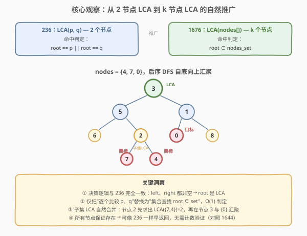
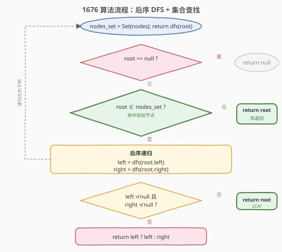
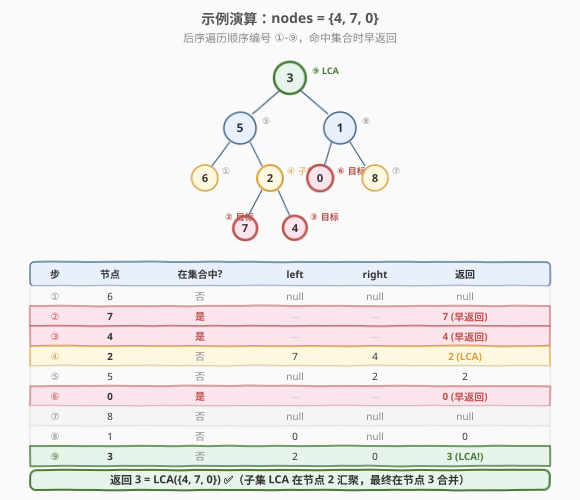

# 二叉树的最近公共祖先 IV

- **题目名称**：二叉树的最近公共祖先 IV
- **链接**：[1676. 二叉树的最近公共祖先 IV](https://leetcode.cn/problems/lowest-common-ancestor-of-a-binary-tree-iv/)
- **难度**：中等
- **标签**：树、二叉树、深度优先搜索、哈希表

## 1. 题目概述

给定一棵二叉树的根节点 `root` 和一个节点数组 `nodes`，找到 `nodes` 中所有节点的**最近公共祖先**（LCA）。

**公共祖先**的定义与 [236. 二叉树的最近公共祖先](../0201-0300/236_二叉树的最近公共祖先.md) 一致：若节点 `x` 的子树中包含 `nodes` 中的**所有**节点（含 `x` 自身），则 `x` 是公共祖先；**最近**公共祖先指深度最大的那个。

**本题的关键区别**：从 236 题的 **2 个节点**推广到 **k 个节点**（`nodes` 数组长度任意）。所有 `nodes` 中的节点**保证存在**于树中。

**示例 1**：

```text
输入：root = [3,5,1,6,2,0,8,null,null,7,4], nodes = [4,7,0]
输出：3
解释：节点 4、7 都在 5 的子树中，节点 0 在 1 的子树中；3 是它们的最近公共祖先。
```

**示例 2**：

```text
输入：root = [3,5,1,6,2,0,8,null,null,7,4], nodes = [7,4]
输出：2
解释：7 和 4 的最近公共祖先是 2。
```

**示例 3**：

```text
输入：root = [3,5,1,6,2,0,8,null,null,7,4], nodes = [5]
输出：5
解释：只有一个节点时，LCA 就是它自身。
```

**约束条件**：

- 树中节点数目范围 `[1, 10^4]`
- `nodes` 数组长度范围 `[1, 10^4]`
- `-10^9 <= Node.val <= 10^9`
- 所有 `Node.val` **互不相同**
- `nodes` 中所有节点**保证存在**于树中

> ⚠️ **与 236 题的区别**：236 题求 2 个节点的 LCA，本题求 **k 个节点**的 LCA。看似需要更复杂的算法，实则只需把 236 的"逐个比较 `root == p || root == q`"替换为"集合查找 `root ∈ nodes_set`"，决策逻辑完全不变。

---

## 2. 解题思路

### 2.1 暴力思路：两两归约

最直白的做法：利用 LCA 的**结合律**——$\text{LCA}(a, b, c) = \text{LCA}(\text{LCA}(a, b), c)$，把 k 节点 LCA 归约为 k−1 次 2 节点 LCA：

```text
ans = nodes[0]
for i in 1..k-1:
    ans = lca_236(root, ans, nodes[i])
return ans
```

正确性：LCA 满足结合律（任意分组求 LCA 结果相同），所以逐步归约等价于一次求 k 节点 LCA。但每次调用 `lca_236` 都需 $O(n)$ 遍历，总共 $O(kn)$ 时间。当 $k$ 较大时效率不佳。

> 💡 能否在**一次遍历**中同时处理 k 个节点？

### 2.2 核心观察：集合查找 + 后序 DFS



关键洞察：236 题的递归决策"**left、right 都非空 → root 是 LCA**"对 k 节点依然成立。目标节点自底向上汇聚，第一个让两侧都非空的节点即为 k 节点的 LCA。唯一需要调整的是**命中判定**：从"逐个比较 `root == p || root == q`"改为"集合查找 `root ∈ nodes_set`"。

具体做法：将 `nodes` 数组存入哈希集合 `nodes_set`，递归函数 `dfs(root)` 的返回值含义与 236 一致：

> `root` 子树中找到的任意目标节点或 LCA 候选；都不在则返回 `null`。

决策规则（与 236 完全相同）：

1. `root == null` → 返回 `null`。
2. `root ∈ nodes_set` → 命中目标，**早返回** `root`（与 236 的 `root == p` 完全对称）。
3. `left = dfs(root.left)`，`right = dfs(root.right)`。
4. 若 `left` 和 `right` **都非空** → 目标分居两侧，`root` 是 LCA，返回 `root`。
5. 否则 → 返回 `left` 或 `right`（非空者）。

> 💡 **为什么早返回是安全的？** 题目保证所有 `nodes` 都存在于树中——这与 236 的保证一致。若 `root` 是目标节点之一，其子树中的其他目标节点"被 root 覆盖"（root 是它们的祖先），不需要单独发现。子树外的目标节点则会在另一侧被找到，最终在某个祖先节点处汇聚。这一推理与 236 中"p 是 q 的祖先"的情况完全相同。

> ⚠️ **对照 1644**：若 `nodes` 中的节点**可能不存在**（如 1644 题的场景），则早返回不安全——必须完整遍历并计数。本题保证存在，可以放心早返回。

### 2.3 算法流程图



整体结构与 236 的后序 DFS 几乎一致，仅在终止条件处多了"集合查找"一步。注意命中目标时**早返回**（不递归子树），这与 1644 的"先查子树再计数"形成鲜明对比。

### 2.4 示例演算



以 `nodes = {4, 7, 0}` 为例，后序遍历顺序为 ⑥→⑦→④→②→⑤→⑥→⑦→⑧→⑨：

| 步 | 节点 | 在集合中? | left | right | 返回 |
|----|------|-----------|------|-------|------|
| ① | 6 | 否 | null | null | null |
| ② | **7** | **是** | — | — | **7**（早返回） |
| ③ | **4** | **是** | — | — | **4**（早返回） |
| ④ | 2 | 否 | 7 | 4 | **2**（两侧非空→子集 LCA） |
| ⑤ | 5 | 否 | null | 2 | 2 |
| ⑥ | **0** | **是** | — | — | **0**（早返回） |
| ⑦ | 8 | 否 | null | null | null |
| ⑧ | 1 | 否 | 0 | null | 0 |
| ⑨ | 3 | 否 | 2 | 0 | **3**（两侧非空→最终 LCA） |

> 💡 **观察要点**：步④在节点 2 处发现 `left=7`、`right=4` 两侧非空，判定 2 是 `{7, 4}` 的子集 LCA；步⑨在节点 3 处发现 `left=2`（代表左侧子集）、`right=0` 两侧非空，判定 3 是全部节点的 LCA。子集 LCA 逐层合并，最终汇聚为全局 LCA——这正是后序 DFS 自底向上的自然结果。

---

## 3. 参考代码

### C++

```cpp
/**
 * Definition for a binary tree node.
 * struct TreeNode {
 *     int val;
 *     TreeNode *left;
 *     TreeNode *right;
 *     TreeNode(int x) : val(x), left(nullptr), right(nullptr) {}
 * };
 */
class Solution {
    unordered_set<TreeNode*> nodes_set;

    TreeNode* dfs(TreeNode* root) {
        if (root == nullptr) {
            return nullptr;
        }
        // 命中目标 → 早返回（与 236 的 root == p || root == q 对称）
        if (nodes_set.count(root)) {
            return root;
        }
        // 后序：先递归左右子树
        TreeNode* left = dfs(root->left);
        TreeNode* right = dfs(root->right);
        // 决策
        if (left != nullptr && right != nullptr) {
            return root; // 目标分居两侧 → root 是 LCA
        }
        return left != nullptr ? left : right; // 向上传递非空那一侧
    }

  public:
    TreeNode* lowestCommonAncestor(TreeNode* root, vector<TreeNode*>& nodes) {
        nodes_set = unordered_set<TreeNode*>(nodes.begin(), nodes.end());
        return dfs(root);
    }
};
```

### Python

```python
class Solution:
    def lowestCommonAncestor(self, root: 'TreeNode', nodes: List['TreeNode']) -> 'TreeNode':
        nodes_set = set(nodes)

        def dfs(root: 'TreeNode') -> 'TreeNode':
            if root is None:
                return None
            # 命中目标 → 早返回（与 236 的 root == p or root == q 对称）
            if root in nodes_set:
                return root
            # 后序：先递归左右子树
            left = dfs(root.left)
            right = dfs(root.right)
            # 决策
            if left and right:
                return root  # 目标分居两侧 → root 是 LCA
            return left if left else right  # 向上传递非空那一侧

        return dfs(root)
```

> ⚠️ **与 236 代码的区别**：仅把 `root == p || root == q` 替换为 `nodes_set.count(root)`（C++）/ `root in nodes_set`（Python）。决策部分（`left && right → return root`）一字不改。这是"输入条件变化但算法结构不变"的典型例子。

---

## 4. 复杂度分析

| 维度 | 复杂度 | 说明 |
|------|--------|------|
| 时间复杂度 | $O(n + k)$ | 建集合 $O(k)$；DFS 遍历每个节点至多一次 $O(n)$。总体 $O(n + k)$，当 $k \le n$ 时为 $O(n)$ |
| 空间复杂度 | $O(h + k)$ | 递归栈 $O(h)$（$h$ 为树高）；哈希集合 $O(k)$。最坏（链状树 + $k = n$）$O(n)$，平衡树 $O(\log n + k)$ |

> 💡 **与暴力法的对比**：暴力法（两两归约）需 $O(kn)$ 时间，本题的集合法仅需 $O(n + k)$——一次遍历即可处理任意数量的目标节点。当 $k$ 较大时（如 $k = n/2$），差距可达 $O(n^2)$ vs $O(n)$。

---

## 5. 扩展：LCA 系列完整对比

LeetCode 的 LCA 五件套围绕"输入条件的变化"展开：

| 题号 | 题目 | 输入条件 | 最优解法 | 空间 |
|------|------|----------|----------|------|
| [235](https://leetcode.cn/problems/lowest-common-ancestor-of-a-binary-search-tree/) | BST 的 LCA | BST + root，2 节点 | 利用有序性迭代 | $O(1)$ |
| [236](../0201-0300/236_二叉树的最近公共祖先.md) | 二叉树的 LCA | root，2 节点，保证存在 | 后序 DFS，命中即早返回 | $O(h)$ |
| [1644](../1601-1700/1644_二叉树的最近公共祖先II.md) | LCA II | root，2 节点，**可能不存在** | 后序 DFS + 计数验证 | $O(h)$ |
| [1650](../1601-1700/1650_二叉树的最近公共祖先III.md) | LCA III | **parent 指针**，无 root | 双指针走相交链表 | $O(1)$ |
| **1676** | LCA IV | root，**k 节点**，保证存在 | 后序 DFS + 集合查找 | $O(h + k)$ |

本题（1676）的核心洞察：**k 节点 LCA 的决策逻辑与 2 节点完全相同**——"两侧都非空 → LCA"对任意 k 都成立。只需把命中判定从"逐个比较"升级为"集合查找"，即可在一次遍历中处理任意数量的目标节点。

---

## 6. 面试要点

1. **本题和 236 题的区别是什么？能否直接套用 236 的代码？**

   - 236 求 2 个节点的 LCA，本题求 k 个节点的 LCA。可以直接套用 236 的框架，仅把终止条件 `root == p || root == q` 替换为 `root ∈ nodes_set`（用哈希集合实现 $O(1)$ 查找）。决策逻辑（两侧非空 → LCA）完全不变。

2. **为什么早返回是安全的？什么情况下不能早返回？**

   - 题目保证所有 `nodes` 都存在于树中，与 236 的保证一致。命中目标节点时早返回不查子树是安全的——子树中的其他目标"被覆盖"。若节点**可能不存在**（如 1644 题），则必须完整遍历并计数，早返回会导致漏数。

3. **暴力法（两两归约）和集合法怎么选？**

   - 暴力法利用 LCA 的结合律 $\text{LCA}(a,b,c) = \text{LCA}(\text{LCA}(a,b), c)$，调用 $k-1$ 次 236 算法，$O(kn)$ 时间。集合法一次遍历 $O(n+k)$ 时间，当 $k$ 较大时优势显著。面试建议先讲暴力法（展示结合律分析），再优化到集合法。

4. **如果 nodes 中某个节点是另一个的祖先，算法如何处理？**

   - 与 236 中"p 是 q 的祖先"完全相同。递归到祖先节点时命中集合、早返回，不查子树。祖先被向上传递，最终作为 LCA 返回。例如 `nodes = {5, 4}`（4 在 5 的子树中），`dfs(5)` 命中早返回 5，5 被传递到根、作为答案返回。

5. **能否不用哈希集合，直接用值比较？**

   - 题目保证所有 `Node.val` 互不相同，所以用值比较也正确。但用节点指针（本题写法）更通用——即使值有重复也能正确工作（比较的是节点身份而非值）。C++ 中用 `unordered_set<TreeNode*>` 比指针，Python 中 `set(nodes)` 比对象身份（`__hash__` 默认按 id），都遵循"节点同一"原则。

---

## 7. 同类练习题

- [236. 二叉树的最近公共祖先](https://leetcode.cn/problems/lowest-common-ancestor-of-a-binary-tree/)（[题解](../0201-0300/236_二叉树的最近公共祖先.md)）：2 节点 LCA 母题，对照本题的集合推广
- [1644. 二叉树的最近公共祖先 II](https://leetcode.cn/problems/lowest-common-ancestor-of-a-binary-tree-ii/)（[题解](../1601-1700/1644_二叉树的最近公共祖先II.md)）：节点可能不存在的变体，后序 DFS + 计数验证
- [1650. 二叉树的最近公共祖先 III](https://leetcode.cn/problems/lowest-common-ancestor-of-a-binary-tree-iii/)（[题解](../1601-1700/1650_二叉树的最近公共祖先III.md)）：带父指针的变体，双指针走相交链表
- [235. 二叉搜索树的最近公共祖先](https://leetcode.cn/problems/lowest-common-ancestor-of-a-binary-search-tree/)：BST 版本，利用有序性 $O(h)$ 迭代
- [1123. 最深叶节点的最近公共祖先](https://leetcode.cn/problems/lowest-common-ancestor-of-deepest-leaves/)：目标节点由"最深叶节点"动态确定，后序 DFS 返回 `(深度, 节点)` 元组
