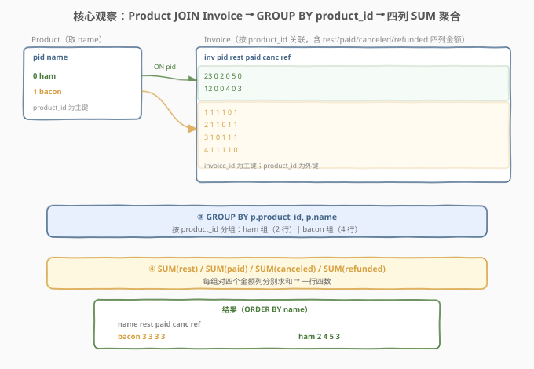
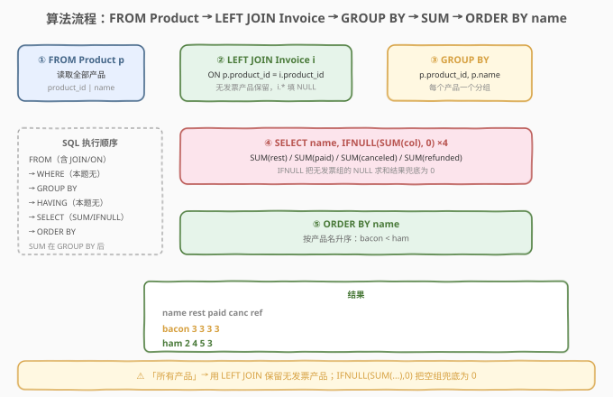
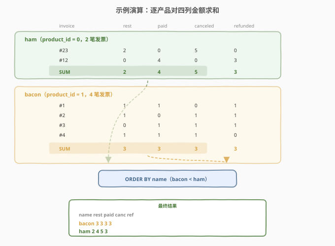

# 发票中的产品金额

- **题目名称**：发票中的产品金额
- **链接**：[1677. 发票中的产品金额 🔒](https://leetcode.cn/problems/products-worth-over-invoices/)
- **难度**：简单
- **标签**：数据库、SQL、`JOIN`、`GROUP BY`、`SUM` 聚合、`IFNULL`/`COALESCE`、`LEFT JOIN` vs `INNER JOIN`、`ORDER BY`

## 1. 题目概述

给定 `Product`（产品）与 `Invoice`（发票）两张表，编写 SQL 查询，对**所有产品**返回每个产品的产品名称，以及全部发票累计的**总应缴款项**、**总已支付金额**、**总已取消金额**、**总已退款金额**。结果按 `product_name`（即 `name`）排序。

**表结构**：

```text
Table: Product
+-------------+---------+
| Column Name | Type    |
+-------------+---------+
| product_id  | int     |  ← 主键
| name        | varchar |
+-------------+---------+
产品 id 与产品名称。名称均为小写英文字母且唯一。

Table: Invoice
+-------------+------+
| Column Name | Type |
+-------------+------+
| invoice_id  | int  |  ← 主键
| product_id  | int  |  ← 外键 → Product
| rest        | int  |  应缴款项
| paid        | int  |  已支付金额
| canceled    | int  |  已取消金额
| refunded    | int  |  已退款金额
+-------------+------+
每张发票记录一个产品的一笔款项明细。
```

**示例 1**：

```text
输入：
Product 表:
+------------+-------+
| product_id | name  |
+------------+-------+
| 0          | ham   |
| 1          | bacon |
+------------+-------+

Invoice 表:
+------------+------------+------+------+----------+----------+
| invoice_id | product_id | rest | paid | canceled | refunded |
+------------+------------+------+------+----------+----------+
| 23         | 0          | 2    | 0    | 5        | 0        |
| 12         | 0          | 0    | 4    | 0        | 3        |
| 1          | 1          | 1    | 1    | 0        | 1        |
| 2          | 1          | 1    | 0    | 1        | 1        |
| 3          | 1          | 0    | 1    | 1        | 1        |
| 4          | 1          | 1    | 1    | 1        | 0        |
+------------+------------+------+------+----------+----------+

Result 表:
+-------+------+------+----------+----------+
| name  | rest | paid | canceled | refunded |
+-------+------+------+----------+----------+
| bacon | 3    | 3    | 3        | 3        |
| ham   | 2    | 4    | 5        | 3        |
+-------+------+------+----------+----------+
```

**解释**：

| 产品 | 发票 | rest 求和 | paid 求和 | canceled 求和 | refunded 求和 |
|------|------|-----------|-----------|---------------|---------------|
| bacon（pid=1） | #1,#2,#3,#4 | 1+1+0+1 = 3 | 1+0+1+1 = 3 | 0+1+1+1 = 3 | 1+1+1+0 = 3 |
| ham（pid=0） | #23,#12 | 2+0 = 2 | 0+4 = 4 | 5+0 = 5 | 0+3 = 3 |

> 💡 **关键结构**：`Invoice` 表的每一行是「一张发票对一个产品的四类款项」，要把同一产品的多张发票**按 `product_id` 分组**后对四个金额列分别求和，再用 `Product` 表把 `product_id` 翻译成 `name`。本质是「**JOIN 关联 + GROUP BY 分组 + 多列 SUM 聚合**」三连。

**约束条件**：

- `product_id` 是 `Product` 表主键
- `invoice_id` 是 `Invoice` 表主键
- `product_id` 在 `Invoice` 表中作为外键
- 产品名称唯一
- 结果按 `product_name`（`name` 列）升序排列

> 💡 本题是 SQL **"多列分组聚合"招牌题**——一张表 `Invoice` 同时携带 `rest/paid/canceled/refunded` 四个金额列，需在同一个 `GROUP BY` 里对四列分别 `SUM`，再用 `JOIN` 取产品名。最大坑点：题目说「**所有产品**」——若某产品没有任何发票，应保留该产品并输出四列均为 0，而非静默丢弃，故 `LEFT JOIN` + `IFNULL` 是最稳妥写法。

---

## 2. 解题思路

### 2.1 暴力思路：逐产品遍历发票累加

最直觉的过程式思路：遍历 `Product` 表每个产品，去 `Invoice` 表里捞所有 `product_id` 相同的发票，把四列金额分别累加，最后按名字排序输出。伪代码：

```text
result = []
for p in Product:
    rest = paid = canceled = refunded = 0
    for i in Invoice where i.product_id == p.product_id:
        rest     += i.rest
        paid     += i.paid
        canceled += i.canceled
        refunded += i.refunded
    result.append((p.name, rest, paid, canceled, refunded))
result.sort(by name)
```

逻辑正确，但**纯 SQL 没有显式逐行循环**——"对每个分组做多列累加"正是 `GROUP BY` + 聚合函数的天然语义。把双重循环交给 SQL 引擎一次扫描完成，比应用层逐行拉取高效得多。

### 2.2 核心观察：JOIN 取名 + GROUP BY 分组 + 多列 SUM



**问题拆解为三个子问题**：

1. **关联产品名**：`Product p JOIN Invoice i ON p.product_id = i.product_id`。`Invoice` 只有 `product_id`，`name` 在 `Product` 表——必须 `JOIN` 才能把数字结果翻译成产品名。

2. **分组**：`GROUP BY p.product_id, p.name`。把同一产品的多张发票归到一组，每组对应结果表的一行。`GROUP BY` 的键是被 SELECT 的非聚合列（`product_id`、`name`），符合 SQL 标准（`ONLY_FULL_GROUP_BY`）。

3. **多列聚合**：在每组上对四个金额列分别 `SUM`——`SUM(i.rest)`、`SUM(i.paid)`、`SUM(i.canceled)`、`SUM(i.refunded)`。一个 `SELECT` 同时写四个 `SUM`，引擎在一次分组扫描中并行累加四列。

$$
\text{rest}_p = \sum_{i \in \text{Invoice}(p)} i.\text{rest},\quad \text{paid}_p = \sum_{i \in \text{Invoice}(p)} i.\text{paid},\quad \ldots
$$

> ⚠️ **为何用 `LEFT JOIN` 而非 `INNER JOIN`**：题目要求「**所有产品**」——若 `Product` 表里有产品在 `Invoice` 表中没有任何发票（题面示例恰好都匹配，但测试数据可能出现），`INNER JOIN` 会把该产品直接丢掉，违反"所有产品"的语义。`LEFT JOIN` 保留该产品行，其 `i.*` 填 `NULL`；而 `SUM(NULL)`（全 NULL 组）返回 `NULL` 而非 `0`，故需 `IFNULL(SUM(...), 0)` 把空组兜底成 0。这是本题最易踩的坑，详见第 5 节。

### 2.3 算法流程图



**逻辑执行步骤**：

| 步骤 | 子句 | 作用 |
|------|------|------|
| ① | `FROM Product p` | 读取全部产品（左表，全保留） |
| ② | `LEFT JOIN Invoice i ON p.product_id = i.product_id` | 按 `product_id` 关联发票；无发票产品 `i.*` 填 `NULL` |
| ③ | `GROUP BY p.product_id, p.name` | 每个产品形成一个分组 |
| ④ | `SELECT name, IFNULL(SUM(col), 0) ×4` | 每组对四列求和，`IFNULL` 把空组 `NULL` 兜底为 0 |
| ⑤ | `ORDER BY name` | 按产品名升序输出 |

> 💡 **SQL 子句执行顺序**：`FROM`（含 `JOIN`/`ON`）→ `WHERE` → `GROUP BY` → `HAVING` → `SELECT`（含 `SUM`/`IFNULL`）→ `ORDER BY`。`SUM` 在 `GROUP BY` 分组完成后对每组计算，`IFNULL` 包在 `SUM` 外层把空组结果转 0，最后 `ORDER BY` 排序输出。本题无 `WHERE`/`HAVING`——所有发票都参与统计，无需过滤。

### 2.4 示例演算

以示例 1 的 2 个产品、6 张发票为例，观察「按 `product_id` 分组 → 四列分别求和 → 按名字排序」的逐步过程：



**步骤 ①②③：JOIN + GROUP BY product_id（形成两个分组）**

| 分组 | 产品 | 含发票 | 四列原始值 |
|------|------|--------|-----------|
| pid=0 | ham | #23, #12 | rest=[2,0] paid=[0,4] canc=[5,0] ref=[0,3] |
| pid=1 | bacon | #1, #2, #3, #4 | rest=[1,1,0,1] paid=[1,0,1,1] canc=[0,1,1,1] ref=[1,1,1,0] |

**步骤 ④：每列分别 SUM**

| 产品 | SUM(rest) | SUM(paid) | SUM(canceled) | SUM(refunded) |
|------|-----------|-----------|---------------|---------------|
| ham | 2+0 = **2** | 0+4 = **4** | 5+0 = **5** | 0+3 = **3** |
| bacon | 1+1+0+1 = **3** | 1+0+1+1 = **3** | 0+1+1+1 = **3** | 1+1+1+0 = **3** |

**步骤 ⑤：ORDER BY name（bacon < ham，bacon 在前）**

| name | rest | paid | canceled | refunded |
|------|------|------|----------|----------|
| bacon | 3 | 3 | 3 | 3 |
| ham | 2 | 4 | 5 | 3 |

> 💡 **排序方向**：`name` 列均为小写英文字母，按字典序 `'bacon' < 'ham'`（首字母 `b` < `h`）。`ORDER BY name` 默认升序（`ASC`），故 `bacon` 行在前。SQL 不保证默认输出顺序，`ORDER BY` 不可省。

---

## 3. 参考代码

### SQL（解法 A：`LEFT JOIN` + `IFNULL(SUM)`，推荐）

```sql
SELECT p.name,
       IFNULL(SUM(i.rest), 0)     AS rest,
       IFNULL(SUM(i.paid), 0)     AS paid,
       IFNULL(SUM(i.canceled), 0) AS canceled,
       IFNULL(SUM(i.refunded), 0) AS refunded
FROM Product p
LEFT JOIN Invoice i ON p.product_id = i.product_id
GROUP BY p.product_id, p.name
ORDER BY p.name;
```

> 💡 **写法要点**：
> - **`LEFT JOIN`**：保留 `Product` 全部行——无发票产品不被丢弃，符合「所有产品」语义。这是与解法 B 的核心区别。
> - **`GROUP BY p.product_id, p.name`**：按产品分组。`product_id` 是主键，`name` 函数依赖于它；为兼容 `ONLY_FULL_GROUP_BY` 模式与跨数据库迁移，把两个非聚合列都列入 `GROUP BY`。
> - **`IFNULL(SUM(col), 0)`**：对无发票的空组，`SUM(NULL)` 返回 `NULL`，`IFNULL` 兜底为 `0`。**`IFNULL` 必须包在 `SUM` 外层**——先求和得到 `NULL`，再转 `0`；若写成 `SUM(IFNULL(col, 0))` 也能工作（先把单行 `NULL` 转 0 再求和），但语义略有差异（见 5.2）。
> - **`ORDER BY p.name`**：题面要求按 `product_name` 排序，不可省。
> - ✓ **最推荐**：语义完整、`NULL` 安全、覆盖「无发票产品」边界。

### SQL（解法 B：`INNER JOIN` + `SUM`，简洁版）

```sql
SELECT p.name,
       SUM(i.rest)     AS rest,
       SUM(i.paid)     AS paid,
       SUM(i.canceled) AS canceled,
       SUM(i.refunded) AS refunded
FROM Product p
JOIN Invoice i ON p.product_id = i.product_id
GROUP BY p.product_id, p.name
ORDER BY p.name;
```

> 💡 **解法 B 的思路**：用 `INNER JOIN`（`JOIN`）只保留有发票的产品，直接 `SUM` 无需 `IFNULL`——因为每个分组至少有一行发票，`SUM` 必非 `NULL`。
>
> ⚠️ **何时失效**：当 `Product` 表存在「没有任何发票」的产品时，`INNER JOIN` 会把它丢掉，违反「所有产品」要求。本题示例数据所有产品都有发票，故解法 B 能通过示例；但若测试用例含无发票产品则会少行。**生产/面试场景优先解法 A**。
>
> **何时可接受**：若题目语义实为「有发票的产品」（且明确排除无发票产品），则 `INNER JOIN` 更简洁高效（无需 `IFNULL` 兜底）。

### SQL（解法 C：先聚合再 `LEFT JOIN`，可读性优）

```sql
SELECT p.name,
       IFNULL(t.rest, 0)     AS rest,
       IFNULL(t.paid, 0)     AS paid,
       IFNULL(t.canceled, 0) AS canceled,
       IFNULL(t.refunded, 0) AS refunded
FROM Product p
LEFT JOIN (
    SELECT product_id,
           SUM(rest)     AS rest,
           SUM(paid)     AS paid,
           SUM(canceled) AS canceled,
           SUM(refunded) AS refunded
    FROM Invoice
    GROUP BY product_id
) t ON p.product_id = t.product_id
ORDER BY p.name;
```

> 💡 **解法 C 的思路**：先在子查询里把 `Invoice` 按 `product_id` 分组聚合成「每个产品一行四列」的中间表 `t`，再 `LEFT JOIN` 回 `Product` 取 `name`。`IFNULL` 兜无发票产品的 `NULL`。
>
> **与解法 A 的对比**：
> - 解法 A 是「先 JOIN 再 GROUP BY」——展开成明细行后分组聚合，中间表较大（行数 = 发票数）。
> - 解法 C 是「先 GROUP BY 再 JOIN」——先把发票压成产品级一行，中间表小（行数 = 产品数），再与 `Product` 连接。对「发票数远多于产品数」的场景，解法 C 的中间表更紧凑，部分优化器更易处理。
> - 两者逻辑等价，现代优化器（MySQL 8.0+）通常生成相近的执行计划。**解法 C 把"聚合"与"取名"两步显式分离，语义更清晰**，适合复杂查询的分步调试。

### Python（pandas）

```python
import pandas as pd

def products_worth_over_invoices(product: pd.DataFrame, invoice: pd.DataFrame) -> pd.DataFrame:
    g = invoice.groupby('product_id').agg(
        rest=('rest', 'sum'),
        paid=('paid', 'sum'),
        canceled=('canceled', 'sum'),
        refunded=('refunded', 'sum'),
    ).reset_index()
    merged = product.merge(g, on='product_id', how='left')
    for col in ['rest', 'paid', 'canceled', 'refunded']:
        merged[col] = merged[col].fillna(0).astype(int)
    result = merged[['name', 'rest', 'paid', 'canceled', 'refunded']]
    return result.sort_values('name').reset_index(drop=True)
```

> 💡 **pandas 对照**：
> - **`groupby('product_id').agg(...)`**：对应 `GROUP BY product_id` + 四列 `SUM`——`agg` 用命名聚合 `(列名, 函数)` 一次产出多列。
> - **`merge(..., how='left')`**：对应 `Product LEFT JOIN 聚合结果`——以 `product` 为左表，保留全部产品；无发票产品在四列上得 `NaN`。
> - **`.fillna(0).astype(int)`**：对应 `IFNULL(SUM(...), 0)`——把 `NaN` 兜底为 0 并转回整型。pandas 的 `sum` 对全 `NaN` 组返回 `NaN`（而非 0），与 SQL 的 `SUM(NULL)` 返回 `NULL` 行为一致，故同样需兜底。
> - **`.sort_values('name')`**：对应 `ORDER BY name`。

---

## 4. 复杂度分析

| 维度 | 解法 A（`LEFT JOIN`+`GROUP BY`） | 解法 B（`INNER JOIN`） | 解法 C（先聚合再 JOIN） | pandas |
|------|----------------------------------|------------------------|------------------------|--------|
| **时间** | $O(n + m)$ | $O(n + m)$ | $O(n + m)$ | $O(n + m)$ |
| **空间** | $O(n + m)$（连接中间表） | $O(n + m)$ | $O(n + m)$ | $O(n + m)$ |
| **NULL 安全** | ✓ `IFNULL` 兜底 | ✗ 无发票产品被丢 | ✓ `IFNULL` 兜底 | ✓ `fillna` 兜底 |
| **覆盖无发票产品** | ✓ | ✗ | ✓ | ✓ |
| **推荐度** | ✓ **首选** | ✓ 仅当全有发票 | ✓ 可读性优 | ✓ 验证用 |

> - $n$ = `Product` 表行数，$m$ = `Invoice` 表行数。
> - **时间**：现代优化器用哈希连接 $O(n + m)$ 完成关联，`GROUP BY` 聚合在连接结果上再做一次 $O(m)$ 扫描（四列 `SUM` 在同一遍扫描中并行累加，不增加常数因子）。解法 C 先对 `Invoice` 做 $O(m)$ 聚合得到 $O(n)$ 行中间表，再与 `Product` 做 $O(n)$ 连接，总计仍 $O(n + m)$。
> - **空间**：解法 A/B 的连接中间表含发票级明细 $O(m)$ 行；解法 C 的中间表为产品级 $O(n)$ 行，空间更省。pandas 需 $O(n + m)$ 存 DataFrame。
> - **索引优化**：在 `Invoice(product_id)` 上建索引可加速连接（嵌套循环连接走索引查找 $O(n \log m)$）；哈希连接对索引依赖较小。`GROUP BY product_id` 若与连接列一致，优化器可合并"连接 + 分组"为单遍扫描。

---

## 5. 扩展：`LEFT JOIN` vs `INNER JOIN` + `IFNULL` 放置位置

### 5.1 「所有产品」语义决定连接类型

SQL 中 `JOIN` 的连接类型决定「无匹配行如何处理」，是聚合查询里最关键的语义选择：

| 连接类型 | 无发票产品的去向 | 是否符合「所有产品」 |
|----------|------------------|----------------------|
| `INNER JOIN` | **被丢弃**（只保留两边都有匹配的行） | ✗ 违反 |
| `LEFT JOIN` | **保留**（左表全保留，右表列填 `NULL`） | ✓ 符合 |
| `RIGHT JOIN` | 保留 `Invoice` 全部（含指向不存在产品的发票，异常） | ✗ 语义错位 |

> 💡 **判定方法**：看题目对"主表"的覆盖要求。本题主表是 `Product`，要求"所有产品"——主表全保留即 `LEFT JOIN`。若题目改为"统计**有发票**的产品的金额"，主表仍是 `Product` 但只要匹配行，则 `INNER JOIN` 更贴切。**面试时先问清「无匹配行要不要保留」，再选连接类型**——这是 SQL 设计的第一步。

### 5.2 `IFNULL(SUM(col), 0)` vs `SUM(IFNULL(col, 0))`

两种写法都能把 `NULL` 转为 0，但处理的对象不同：

| 写法 | 作用对象 | 何时产生 0 | 等价性 |
|------|----------|-----------|--------|
| `IFNULL(SUM(col), 0)` | 求和**结果** | 整组全 `NULL`（无发票）时 `SUM` 为 `NULL` → 转 0 | 处理"空组" |
| `SUM(IFNULL(col, 0))` | 每行**单值** | 单行 `col` 为 `NULL` 时先转 0 再累加 | 处理"行内 NULL" |

> ⚠️ 本题的 `NULL` 来源是「`LEFT JOIN` 无匹配导致整行 `i.*` 为 `NULL`」，整组全 `NULL` → `SUM` 为 `NULL`。两种写法在此场景下**结果相同**：
> - `IFNULL(SUM(col), 0)`：`SUM([NULL]) = NULL` → `IFNULL` → `0`。
> - `SUM(IFNULL(col, 0))`：先把 `NULL` 转 `0` → `SUM([0]) = 0`。
>
> 但**语义侧重不同**：`IFNULL(SUM(col), 0)` 表达"空组兜底"，更贴合本题意图（处理无发票产品）；`SUM(IFNULL(col, 0))` 表达"行内空值兜底"，适合发票本身某些列为 `NULL` 的场景。本题发票金额列理论上非空，故首选 `IFNULL(SUM(col), 0)`。

### 5.3 `GROUP BY` 列的选择与函数依赖

本题 `GROUP BY p.product_id, p.name` 列出了两个非聚合列。但 `product_id` 是 `Product` 主键，`name` 函数依赖于 `product_id`（给定 `product_id` 唯一确定 `name`）：

| `GROUP BY` 写法 | `ONLY_FULL_GROUP_BY` 下 | 说明 |
|-----------------|------------------------|------|
| `GROUP BY p.product_id` | ✓ MySQL 允许（函数依赖） | MySQL 识别 `name` 依赖主键，允许只按主键分组 |
| `GROUP BY p.product_id, p.name` | ✓ 所有数据库 | 显式列出所有非聚合列，最通用 |
| `GROUP BY p.name`（仅 name） | ⚠️ 示例可行 | 题目保证 `name` 唯一，故等价；但若 `name` 不唯一则出错 |

> 💡 **最佳实践**：`GROUP BY` 列出 `SELECT` 中所有非聚合列（`product_id, name`），兼容 `ONLY_FULL_GROUP_BY` 与跨数据库迁移。依赖"函数依赖"特性（只 `GROUP BY` 主键）虽在 MySQL 合法，但 PostgreSQL/SQL Server 对函数依赖识别更严格，显式列出最稳妥。本题 `name` 唯一故只按 `name` 分组也能过，但不宜养成此习惯。

### 5.4 跨数据库的 `NULL` 兜底函数

| 函数 | MySQL | PostgreSQL | SQL Server | Oracle | SQL 标准 |
|------|-------|------------|------------|--------|----------|
| `IFNULL(a, b)` | ✓ | ✗ | ✗ | ✗ | ✗ |
| `COALESCE(a, b)` | ✓ | ✓ | ✓ | ✓ | ✓ |
| `NVL(a, b)` | ✗ | ✗ | ✗ | ✓ | ✗ |
| `ISNULL(a, b)` | ✗（同名但语义不同） | ✗ | ✓ | ✗ | ✗ |

> 💡 **跨数据库首选 `COALESCE`**：`COALESCE(SUM(i.rest), 0)` 在所有主流数据库均可用，是 SQL 标准。`IFNULL` 是 MySQL 方言，LeetCode 用 MySQL 故 `IFNULL` 可用；面试/生产环境迁移建议用 `COALESCE`。两者在此场景完全等价。

---

## 6. 面试要点

1. **为什么用 `LEFT JOIN` 而不是 `INNER JOIN`？**

   > 题目要求「**所有产品**」返回金额汇总。`INNER JOIN` 只保留两边都有匹配的行——若某产品在 `Invoice` 表没有任何发票，会被直接丢弃，违反"所有产品"语义。`LEFT JOIN` 保留 `Product` 全部行，无发票产品其 `i.*` 填 `NULL`，再用 `IFNULL(SUM(...), 0)` 把空组的 `NULL` 求和结果兜底为 0。一句话：**主表全保留用 `LEFT`，只取匹配用 `INNER`**——先问清「无匹配行是否保留」再选连接类型。

2. **为什么需要 `IFNULL(SUM(...), 0)`？不加会怎样？**

   > `LEFT JOIN` 后，无发票产品的分组所有 `i.*` 为 `NULL`，而 `SUM` 忽略 `NULL`——当整组全 `NULL` 时 `SUM` 返回 `NULL`（不是 0）。不加 `IFNULL`，结果里无发票产品的四列会是 `NULL` 而非 `0`，不符合「累计金额」的预期（金额应为 0 而非未知）。`IFNULL(SUM(col), 0)` 把这个 `NULL` 兜底成 0。注意 `IFNULL` 包在 `SUM` 外层——先求和得 `NULL` 再转 0。

3. **`GROUP BY p.product_id, p.name` 为什么要把 `name` 也列进去？**

   > SQL 标准（`ONLY_FULL_GROUP_BY` 模式）要求 `SELECT` 中的非聚合列必须出现在 `GROUP BY` 中。`SELECT p.name` 是非聚合列，故需 `GROUP BY` 它。虽然 `name` 函数依赖于主键 `product_id`（MySQL 允许只按主键分组），但显式列出所有非聚合列兼容性最好、跨数据库最安全。本题 `name` 唯一，只按 `name` 分组也能过，但不宜养成依赖列唯一性的习惯。

4. **一个 `SELECT` 里写四个 `SUM` 会扫描四遍表吗？**

   > 不会。`SUM` 是聚合函数，在 `GROUP BY` 分组完成后对每组遍历一次累加——多个 `SUM` 在**同一遍分组扫描**中并行累加各自的列，不重复扫描。时间复杂度仍是 $O(m)$（$m$ 为发票数），四列 `SUM` 只增加常数因子（每行多做三次加法）。这也是把多列聚合放在一个查询里而非拆成四个子查询的原因——一次扫描完成所有聚合。

5. **如果题目改成「只统计已支付金额大于 0 的发票」，该把条件放 `WHERE` 还是 `HAVING`？**

   > 放 `WHERE`。`WHERE` 在 `GROUP BY` 之前过滤**原始行**——先筛掉 `paid = 0` 的发票行，再分组求和；`HAVING` 在 `GROUP BY` 之后过滤**分组**——基于聚合结果（如 `SUM(paid) > 10`）筛组。本题条件「单张发票 `paid > 0`」是行级谓词，用 `WHERE`：`WHERE i.paid > 0`。若条件是「总已支付 `SUM(paid) > 10`」则是组级谓词，用 `HAVING`。**行级过滤用 `WHERE`，组级过滤用 `HAVING`**——这是 SQL 子句分工的核心考点。

> 💡 **一句话总结**：1677 是 SQL **"多列分组聚合"** 招牌题——核心模板「`Product LEFT JOIN Invoice ON product_id` → `GROUP BY product_id, name` → `IFNULL(SUM(col),0) ×4` → `ORDER BY name`」。三大要点：**「所有产品」用 `LEFT JOIN` 保留无发票产品、`IFNULL(SUM)` 把空组 `NULL` 兜底为 0、多列 `SUM` 在一次分组扫描中并行累加**。与 1068「产品销售分析 I」的纯 `JOIN` 不同，本题在关联之上叠加了 `GROUP BY` + 多列聚合。

---

## 7. 同类练习题

- [1068. 产品销售分析 I](https://leetcode.cn/problems/product-sales-analysis-i/)：`Product JOIN Sales` 基础关联取产品名 + 价格——1677 的简化版（仅 `JOIN` 无聚合），巩固 `ON product_id` 关联骨架，再叠加 `GROUP BY + SUM` 即升级为 1677
- [511. 游戏玩法分析 I](https://leetcode.cn/problems/game-play-analysis-i/)：`GROUP BY player_id` + `MIN(event_date)` 聚合——与 1677 共享 `GROUP BY` 分组骨架，不同聚合函数（`MIN` vs `SUM`），巩固「分组后取单值」范式
- [586. 订单最多的客户](https://leetcode.cn/problems/customer-placing-the-largest-number-of-orders/)：`GROUP BY customer_number` + `COUNT(*)` + `ORDER BY COUNT(*) DESC LIMIT 1`——聚合后取极值行，与 1677 形成"聚合所有行 vs 聚合取最值"对照
- [1174. 即时食物配送 II](https://leetcode.cn/problems/immediate-food-delivery-ii/):`GROUP BY` + 首单判定 + 百分比聚合——`GROUP BY` 进阶，在聚合中叠加条件计数，承接 1677 的多列聚合思想
- [1193. 每月交易 I](https://leetcode.cn/problems/monthly-transactions-i/)：`GROUP BY month, country` + 多列 `SUM`/`COUNT` 聚合——与 1677 同为"多列 `SUM` 一次聚合"模板，但分组键为双列（月+国家），且叠加 `COUNT(IF(...))` 条件计数，是 1677 的进阶版
