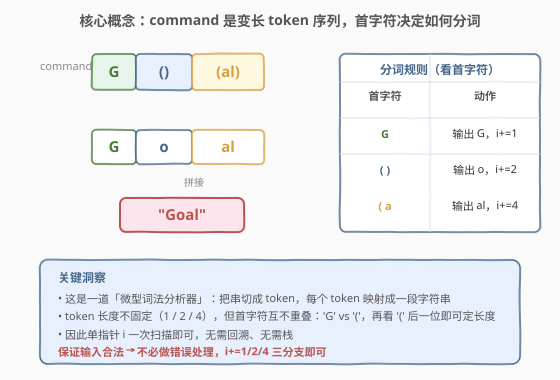
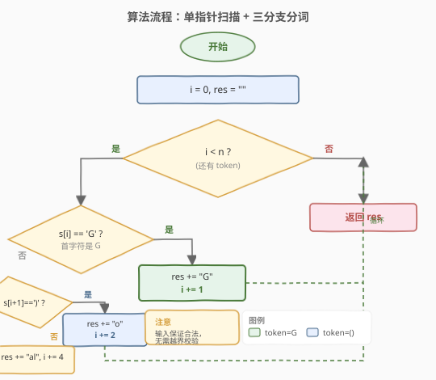
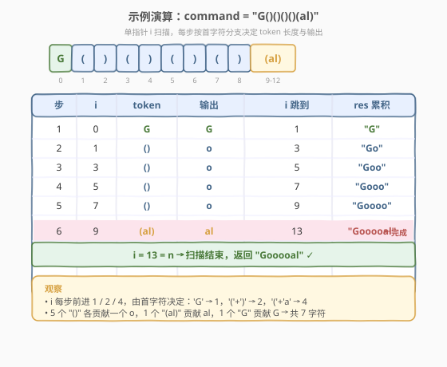

# LeetCode 设计Goal解析器 题解

## 1. 题目概述

- **标题 / 题号**：设计 Goal 解析器（#1678，easy）
- **链接**：https://leetcode.cn/problems/goal-parser-interpretation/
- **难度**：简单
- **标签**：字符串、模拟

**题意**：请你设计一个可以解释字符串 `command` 的 **Goal 解析器**。`command` 由 `"G"`、`"()"` 和/或 `"(al)"` 按某种顺序组成。Goal 解析器会将 `"G"` 解释为字符串 `"G"`、`"()"` 解释为字符串 `"o"`、`"(al)"` 解释为字符串 `"al"`。然后，按原顺序将经解释得到的字符串连接成一个字符串。

给你字符串 `command`，返回 **Goal 解析器** 对 `command` 的解释结果。

**示例 1**：

```text
输入：command = "G()(al)"
输出："Goal"
解释：G -> G，() -> o，(al) -> al，连接得到 "Goal"
```

**示例 2**：

```text
输入：command = "G()()()()(al)"
输出："Gooooal"
```

**示例 3**：

```text
输入：command = "(al)G(al)()()G"
输出："alGalooG"
```

**约束**：

- $1 \leq \text{command.length} \leq 100$
- `command` 由 `"G"`、`"()"` 和/或 `"(al)"` 按某种顺序组成

> 💡 **输入保证合法**：题目明确 `command` 只能由这三种 token 任意拼接而成，不会出现 `"(x)"`、`"G()"` 之外的乱码。因此**无需做错误处理或回溯**，只需识别 token 边界即可。

## 2. 解题思路

### 2.1 暴力思路：直接 replace

最省事的做法：把 `"(al)"` 替换成 `"al"`、把 `"()"` 替换成 `"o"`，剩下的 `"G"` 不动。

```python
return command.replace("(al)", "al").replace("()", "o")
```

由于 `"G"`、`"()"`、`"(al)"` 三者互不重叠（`"G"` 不含括号，`"()"` 不是 `"(al)"` 的子串），两次 `replace` 互不干扰，顺序无关。时间 $O(n)$，空间 $O(n)$（建新串）。能过，但**没有体现「分词」的思考过程**，面试中作为引子即可。

### 2.2 核心观察：单指针扫描 + 首字符分词



关键洞察：`command` 是一个**变长 token 序列**，本质是一道微型「词法分析器」。三种 token 的首字符互不重叠：

- 首字符为 `'G'` → token 是 `"G"`（长度 1）→ 输出 `"G"`
- 首字符为 `'('` → 再看下一位：
  - 下一位 `')'` → token 是 `"()"`（长度 2）→ 输出 `"o"`
  - 下一位 `'a'` → token 是 `"(al)"`（长度 4）→ 输出 `"al"`

因此用**单指针 `i`** 一次扫描，根据首字符走三分支，`i` 对应前进 $1/2/4$ 步，无需回溯、无需栈。

> 💡 **为什么不用栈？** 这不是嵌套结构（括号不递归嵌套），而是平铺的 token 序列。`'('` 后紧跟的字符已能确定整个 token，无需用栈匹配 `'('` 与 `')'`。和 [20. 有效括号] 的本质区别就在这里——后者括号可任意嵌套，必须用栈；本题括号只出现在固定 2/4 字符的 token 内，扁平化处理即可。

### 2.3 算法流程图



```text
1. i = 0, res = ""
2. 当 i < n：
   a. 若 command[i] == 'G'：res += "G"，i += 1
   b. 否则（command[i] == '('）：
      i. 若 command[i+1] == ')'：res += "o"，i += 2
      ii. 否则：res += "al"，i += 4
3. 返回 res
```

> ⚠️ **越界安全**：题目保证输入合法，所以遇到 `'('` 时其后必有 `")"` 或 `"al)"`，`command[i+1]` 不会越界。若题目不保证合法，则需在分支前检查 `i+1 < n` 等条件并做错误处理。

### 2.4 示例演算



以 `command = "G()()()()(al)"`（示例 2）为例，`n = 13`：

| 步 | i | token | 输出 | i 跳到 | res 累积 |
|----|---|-------|------|--------|----------|
| 1 | 0 | `G` | G | 1 | `"G"` |
| 2 | 1 | `()` | o | 3 | `"Go"` |
| 3 | 3 | `()` | o | 5 | `"Goo"` |
| 4 | 5 | `()` | o | 7 | `"Gooo"` |
| 5 | 7 | `()` | o | 9 | `"Goooo"` |
| 6 | 9 | `(al)` | al | 13 | `"Gooooal"` |

第 6 步后 `i = 13 = n`，循环结束，返回 `"Gooooal"` ✓。

> 💡 `i` 每步前进 $1/2/4$，步数等于 token 数（这里是 6），而**非字符数 13**——这正是「分词」相对于「逐字符」的效率体现：循环次数由 token 数决定。

## 3. 参考代码

### C++（单指针三分支）

```cpp
class Solution {
public:
    string interpret(string command) {
        string res;
        int i = 0, n = command.size();
        while (i < n) {
            if (command[i] == 'G') {
                res += 'G';
                i += 1;
            } else if (command[i + 1] == ')') {
                res += 'o';
                i += 2;
            } else {
                res += "al";
                i += 4;
            }
        }
        return res;
    }
};
```

### Python（单指针三分支）

```python
class Solution:
    def interpret(self, command: str) -> str:
        res = []
        i, n = 0, len(command)
        while i < n:
            if command[i] == 'G':
                res.append('G')
                i += 1
            elif command[i + 1] == ')':
                res.append('o')
                i += 2
            else:
                res.append('al')
                i += 4
        return ''.join(res)
```

> 💡 Python 用列表 `res.append` + 末尾 `''.join` 比字符串 `+=` 拼接更高效（字符串不可变，`+=` 每次重建）。C++ 的 `std::string` 支持原地追加，`res +=` 即可。

### Python（replace 一行，对照用）

```python
class Solution:
    def interpret(self, command: str) -> str:
        return command.replace("(al)", "al").replace("()", "o")
```

## 4. 复杂度分析

| 维度 | 复杂度 | 说明 |
|------|--------|------|
| 时间复杂度 | $O(n)$ | 指针 `i` 单调递增到 `n`，每步 $O(1)$；`replace` 版同样扫描两趟 $O(n)$ |
| 空间复杂度 | $O(n)$ | 输出字符串长度 $\leq n$；额外仅指针 `i` 等常数变量 $O(1)$ |

> 💡 输出本身最坏占 $O(n)$（如全 `"G"` 时输出与输入等长），故空间下界即 $O(n)$。单指针法的优势在于**额外空间 $O(1)$**，而 `replace` 中间会产生多个临时串。

## 5. 扩展：字典映射 + 通用 token 识别

若 token 种类变多（例如再引入 `"(ple)"` → `"ple"` 等长 token），逐一写 `if/elif` 会冗长。可把规则做成字典，按「首字符 + 预读若干位」查表：

```python
class Solution:
    def interpret(self, command: str) -> str:
        rules = {'G': ('G', 1), '()': ('o', 2), '(al)': ('al', 4)}
        res, i, n = [], 0, len(command)
        while i < n:
            if command[i] == 'G':
                out, step = rules['G']
            elif command[i + 1] == ')':
                out, step = rules['()']
            else:
                out, step = rules['(al)']
            res.append(out)
            i += step
        return ''.join(res)
```

进一步通用化：固定 4 字符窗口预读，用最长匹配优先（先试 4 字符 `(al)`，再 2 字符 `()`，再 1 字符 `G`）。本题 token 固定且少，三分支 `if` 已是最简；字典法只为展示「规则数据化」的思路，便于规则扩展时维护。

## 6. 面试要点

**Q1：为什么用单指针而不是栈？**
> 栈用于处理**可嵌套**的结构（如括号匹配、表达式求值），需要记层级。本题括号只出现在固定长度的 token `"()"` / `"(al)"` 内，**不嵌套**，token 边界由首字符及紧跟一位即可确定，单指针前进 $1/2/4$ 即可，无需栈。

**Q2：`replace` 两次的顺序重要吗？**
> 不重要。`"G"`、`"()"`、`"(al)"` 三者互不为子串：`"()"` 替换不会破坏 `"(al)"`（`"()"` 不是 `"(al)"` 的子串），反之亦然。任意顺序结果一致。但若 token 集存在包含关系（如 `"ab"` 与 `"abc"`），则需**先替换长的再替换短的**。

**Q3：指针 `i` 前进步长 1/2/4 是怎么定的？**
> 由 token 长度直接决定：`'G'` 占 1 字符；`'('` 开头的 token，看下一位 `')'` 则 token 是 `"()"` 长 2，下一位 `'a'` 则 token 是 `"(al)"` 长 4。前进步长 = 当前 token 长度，保证 `i` 跳过整个 token 落在下一个 token 首字符。

**Q4：如果不保证输入合法，怎么处理？**
> 需在 `'('` 分支前检查 `i+1 < n`；若 `command[i+1]` 既非 `')'` 也非 `'a'`，或 `"(al)"` 后两位不匹配，应报错或跳过。本题约束保证合法，省去了这层防御。面试中可主动提一句「输入合法前提」，体现对边界条件的意识。

**Q5：这道题和「词法分析 / tokenizer」的关系？**
> 本质就是一个极简 tokenizer：把字符流转成 token 流，再对每个 token 做映射。编译器前端的词法分析器、配置文件解析（如 URL query string 切 `&` 分隔的键值对）都是同一范式——「识别 token 边界 + 查表映射」。本题只是 token 表极小、规则极简的入门版。

## 同类练习题

| # | 题目 | 与本题的关联 |
|---|------|-------------|
| 20 | [有效括号](https://leetcode.cn/problems/valid-parentheses/)（[题解](../0001-0100/20_有效括号.md)） | 用栈匹配**可嵌套**括号，对照本题「扁平 token、无需栈」的差异 |
| 1614 | [括号嵌套的最大深度](https://leetcode.cn/problems/maximum-nesting-depth-of-the-parentheses/)（[题解](./1614_括号嵌套的最大深度.md)） | 单趟扫描括号深度，同为简单字符串模拟，体会「嵌套需计数 vs 扁平需分词」 |
| 8 | [字符串转换整数 (atoi)](https://leetcode.cn/problems/string-to-integer-atoi/)（[题解](../0001-0100/8_字符串转换整数atoi.md)） | 逐字符状态机解析，对照本题「首字符决定分支」的简化版自动机 |
| 1662 | [检查两个字符串数组是否相等](https://leetcode.cn/problems/check-if-two-string-arrays-are-equivalent/)（[题解](./1662_检查两个字符串数组是否相等.md)） | 字符串逐段比对 / 拼接，同区间同难度，对照「拼接 vs 分词」两种字符串处理方向 |
