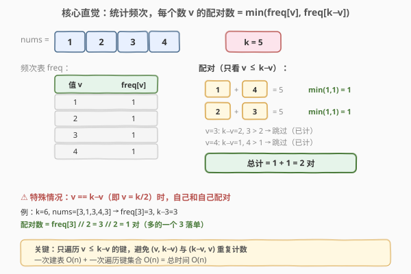
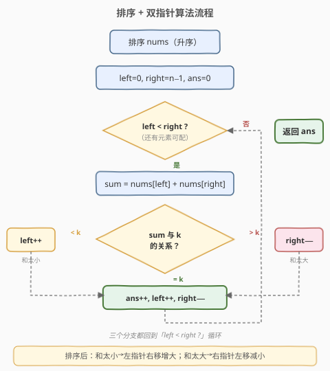

# LeetCode K和数对的最大数目 题解

## 1. 题目概述

- **标题 / 题号**：K和数对的最大数目（#1679，medium）
- **链接**：https://leetcode.cn/problems/max-number-of-k-sum-pairs/
- **难度**：中等
- **标签**：数组、哈希表、排序、双指针

**题意**：给你一个整数数组 `nums` 和一个整数 `k`。每一步操作中，你需要从数组中选出和为 `k` 的**两个**整数，并将它们移出数组。返回你可以对数组执行的**最大操作数**。

**示例 1**：

```text
输入：nums = [1,2,3,4], k = 5
输出：2
解释：开始时 nums = [1,2,3,4]：
- 移出 1 和 4 ，之后 nums = [2,3]
- 移出 2 和 3 ，之后 nums = []
不再有和为 5 的数对，因此最多执行 2 次操作。
```

**示例 2**：

```text
输入：nums = [3,1,3,4,3], k = 6
输出：1
解释：开始时 nums = [3,1,3,4,3]：
- 移出前两个 3 ，之后 nums = [1,4,3]
不再有和为 6 的数对，因此最多执行 1 次操作。
```

**约束**：

- $1 \leq \text{nums.length} \leq 10^5$
- $1 \leq \text{nums}[i] \leq 10^9$
- $1 \leq k \leq 10^9$

> 💡 本题是 [1. 两数之和](1_两数之和.md) 的"计数版"——不再找**一对**返回下标，而是问最多能凑出**多少对**。元素均为正、规模达 $10^5$，要求优于 $O(n^2)$。

## 2. 解题思路

### 2.1 暴力思路：每次操作扫一遍找数对

最直观的做法：每次操作时用两层循环枚举所有 $(i, j)$ 数对，找到 `nums[i] + nums[j] == k` 后移除这两个元素，操作数加一，重复直到找不到。每次找数对 $O(n^2)$，最多 $n/2$ 次操作，总时间 $O(n^3)$，对 $10^5$ 规模完全不可行。

问题在于：每次操作都从头扫描，没有利用"哪些值能互相配对"这一全局信息。一旦知道每个值出现了多少次，配对数就能直接算出来。

### 2.2 核心观察：哈希表统计频次，一次算清所有配对



关键直觉：两个数 $a + b = k$ 意味着 $b = k - a$。如果统计出每个值出现的**频次** `freq[v]`，那么值 $v$ 能贡献的配对数就是 $\min(\text{freq}[v], \text{freq}[k-v])$——左边有多少个 $v$、右边有多少个 $k-v$，取较少者即为能凑出的对数。

**特殊情形**：当 $v = k - v$（即 $v = k/2$）时，是**自己和自己配对**。此时配对数 $= \text{freq}[v] \mathbin{//} 2$（多的一个落单）。例：$k=6$，有三个 $3$，则 $3+3=6$ 可凑 $3 \mathbin{//} 2 = 1$ 对。

> ⚠️ **避免重复计数**：$(v, k\text{-}v)$ 和 $(k\text{-}v, v)$ 是同一对。遍历哈希表的键时，只处理 $v \leq k\text{-}v$ 的键，跳过 $v > k\text{-}v$ 的键（已被另一侧统计过）。

> 💡 **与 [1. 两数之和](1_两数之和.md) 的同与异**：两题共享"查补数 $k - v$"的核心直觉。区别在于：第 1 题只需找一对、返回下标，用"边查边存"的一次遍历哈希；本题需要算**全部配对数**，必须先完整建表再统计——因为同一个值可能被多次配对消耗，"边查边存"无法预知后续还有多少补数可用。

### 2.3 算法流程图：排序 + 双指针

另一种视角是**排序 + 双指针**——排序后，左右指针从两端向中间收拢，根据 `sum` 与 `k` 的大小关系决定移动哪一侧：



排序保证了单调性：`sum < k` 时左指针右移可增大和，`sum > k` 时右指针左移可减小和，`sum == k` 时两边同时移动记录一对。整个过程无需处理"自己配自己"的特殊情形——排序后 `left < right` 天然保证取的是两个不同位置的元素。

### 2.4 示例演算

![示例演算：nums=[3,1,3,4,3], k=6](../images/ksum_pairs_walkthrough.svg)

以**示例 2** `nums = [3,1,3,4,3], k = 6` 为例，排序后为 `[1,3,3,3,4]`：

| 步骤 | left | right | nums[left] | nums[right] | sum | 动作 | ans |
|------|------|-------|------------|-------------|-----|------|-----|
| 1 | 0 | 4 | 1 | 4 | 5 | $< k$，left++ | 0 |
| 2 | 1 | 4 | 3 | 4 | 7 | $> k$，right−− | 0 |
| 3 | 1 | 3 | 3 | 3 | 6 | $= k$ ✓，ans++, left++, right−− | 1 |
| 4 | 2 | 2 | — | — | — | left $\geq$ right，结束 | 1 |

步骤 3 命中 $3+3=6$：三个 3 中取走两个配成一对，剩下一个 3 与 1、4 均无法凑 6。最终 `ans = 1`，与示例一致。

对照哈希表法：`freq = {3:3, 1:1, 4:1}`，$v=3$ 时 $k\text{-}v=3$，$v = k\text{-}v$，配对数 $= 3 \mathbin{//} 2 = 1$，结果一致。

## 3. 参考代码

### 方法一：哈希表计数（O(n) 时间，推荐）

### C++

```cpp
class Solution {
public:
    int maxOperations(vector<int>& nums, int k) {
        unordered_map<int, int> freq;
        for (int x : nums) freq[x]++;

        int ans = 0;
        for (auto& [v, cnt] : freq) {
            int comp = k - v;
            if (comp < v) continue;          // 已由 comp 侧统计过，跳过
            if (comp == v) {
                ans += cnt / 2;              // 自己和自己配对
            } else {
                auto it = freq.find(comp);
                if (it != freq.end())
                    ans += min(cnt, it->second);
            }
        }
        return ans;
    }
};
```

### Python

```python
class Solution:
    def maxOperations(self, nums: List[int], k: int) -> int:
        freq = Counter(nums)
        ans = 0
        for v, cnt in freq.items():
            comp = k - v
            if comp < v:
                continue                    # 已由 comp 侧统计过，跳过
            if comp == v:
                ans += cnt // 2             # 自己和自己配对
            elif comp in freq:
                ans += min(cnt, freq[comp])
        return ans
```

> ⚠️ **`comp < v` 跳过的作用**：保证每对 $(v, k\text{-}v)$ 只在较小值 $v$ 处统计一次。若不加此判断，$(3, 4)$ 会在 $v=3$ 和 $v=4$ 各算一遍，结果翻倍。当 $v = k\text{-}v$ 时 `comp == v`，不满足 `comp < v`，不会被跳过，走整除分支。

### 方法二：排序 + 双指针（O(1) 额外空间）

### C++

```cpp
class Solution {
public:
    int maxOperations(vector<int>& nums, int k) {
        sort(nums.begin(), nums.end());
        int left = 0, right = nums.size() - 1, ans = 0;
        while (left < right) {
            int sum = nums[left] + nums[right];
            if (sum == k) {
                ans++;
                left++;
                right--;
            } else if (sum < k) {
                left++;
            } else {
                right--;
            }
        }
        return ans;
    }
};
```

### Python

```python
class Solution:
    def maxOperations(self, nums: List[int], k: int) -> int:
        nums.sort()
        left, right = 0, len(nums) - 1
        ans = 0
        while left < right:
            s = nums[left] + nums[right]
            if s == k:
                ans += 1
                left += 1
                right -= 1
            elif s < k:
                left += 1
            else:
                right -= 1
        return ans
```

> 💡 **双指针无需特判 $v = k/2$**：排序后 `left < right` 保证取的是两个不同位置的元素。即使 `nums[left] == nums[right] == k/2`，只要 `left != right` 就是合法配对。而哈希表法需要 `freq[v] // 2` 整除来处理"自己配自己"——这是两种视角的本质差异。

## 4. 复杂度分析

| 维度 | 方法 | 复杂度 | 说明 |
|------|------|--------|------|
| 时间复杂度 | 哈希表计数 | $O(n)$ | 一次遍历建表 + 一次遍历键集合，均为 $O(n)$ |
| 空间复杂度 | 哈希表计数 | $O(n)$ | 哈希表最多存 $n$ 个不同值 |
| 时间复杂度 | 排序+双指针 | $O(n \log n)$ | 排序 $O(n \log n)$ + 双指针 $O(n)$ |
| 空间复杂度 | 排序+双指针 | $O(\log n)$ | 排序的栈空间（C++ `sort` 为内省排序） |

> 💡 **如何选择**：哈希表法时间更优 $O(n)$，适合追求速度；双指针法空间更优 $O(\log n)$，且代码更简洁无特判。$n = 10^5$ 时两者都能轻松通过。面试中可先给哈希表法（体现与第 1 题的联系），再给双指针法（体现与第 167 题的联系），展示两数之和家族的全貌。

## 5. 扩展：边查边减的哈希表写法

方法一的哈希表法是"先建完整表再统计"。还有一种"边查边减"的单趟写法：遍历每个元素时，查补数是否在表中且有剩余计数，命中则配对、补数计数减一；未命中则把当前元素计数加一。效果等价，无需处理 $v = k/2$ 特判和重复计数：

```cpp
class Solution {
public:
    int maxOperations(vector<int>& nums, int k) {
        unordered_map<int, int> freq;
        int ans = 0;
        for (int x : nums) {
            int comp = k - x;
            if (freq[comp] > 0) {    // 补数有剩余，直接配对
                freq[comp]--;
                ans++;
            } else {
                freq[x]++;           // 暂存，等后续补数到来
            }
        }
        return ans;
    }
};
```

> 💡 这种写法与 [1. 两数之和](1_两数之和.md) 的"先查后存"结构完全一致——查到补数就配对（相当于返回），查不到就存入等后续。区别是第 1 题存下标、本题存计数。适合面试时快速手写，但需理解"为什么不会漏配"：任何一对 $(a, b)$ 中后出现的那个一定能查到先出现的。

## 6. 面试要点

1. **本题和第 1 题"两数之和"的关系是什么？**

   - 同属"查补数 $k - v$"家族。第 1 题找一对返回下标（哈希存值→下标），本题算全部配对数（哈希存值→计数）。核心直觉一致，但本题需要考虑同一值多次配对和自配对（$v = k/2$）的情形。

2. **哈希表法为什么要 `comp < v` 跳过？**

   - $(v, k\text{-}v)$ 和 $(k\text{-}v, v)$ 是同一对。若不跳过，每对会被统计两次。只处理 $v \leq k\text{-}v$ 的键，保证每对只算一次。当 $v = k\text{-}v$ 时走整除分支 `freq[v] // 2`。

3. **双指针法为什么不需要处理 $v = k/2$ 的特殊情形？**

   - 排序后 `left < right` 天然保证取两个不同位置的元素。即使两指针指向的值相同（都是 $k/2$），只要位置不同就是合法配对。哈希表法需要整除是因为它按"值"而非"位置"统计，同一个值的多个出现需要两两配对。

4. **"边查边减"写法为什么不会漏配？**

   - 任何一对 $(a, b)$，后出现的那个一定能查到先出现的（因为先出现的已存入表）。遍历一次即可覆盖所有配对，无需预建完整表。这与第 1 题"边查边存"的正确性论证相同。

5. **如果数组中有负数或零，两种方法还适用吗？**

   - 双指针法**仍适用**——排序后双指针的正确性依赖单调性（`sum < k` 时左移增大、`sum > k` 时右移减小），与元素正负无关。哈希表法也适用，但需注意 $k\text{-}v$ 可能不在频次表中（返回 0 对）。本题约束 $\text{nums}[i] \geq 1$，无此问题。

## 同类练习题

| # | 题目 | 与本题的关联 |
|---|------|-------------|
| 1 | [两数之和](https://leetcode.cn/problems/two-sum/)（[题解](../0001-0100/1_两数之和.md)） | 哈希表查补数返回下标，本题的"找一对"原型 |
| 15 | [三数之和](https://leetcode.cn/problems/3sum/)（[题解](../0001-0100/15_三数之和.md)） | 排序 + 双指针 + 去重，两数之和家族的"三数版" |
| 167 | [两数之和 II - 输入有序数组](https://leetcode.cn/problems/two-sum-ii-input-array-is-sorted/) | 有序数组双指针找两数之和，本题双指针法的基础模板 |
| 454 | [四数相加 II](https://leetcode.cn/problems/4sum-ii/)（[题解](../0401-0500/454_四数相加II.md)） | 分组 + 哈希 Meet in the Middle，四个独立数组的计数版 |
