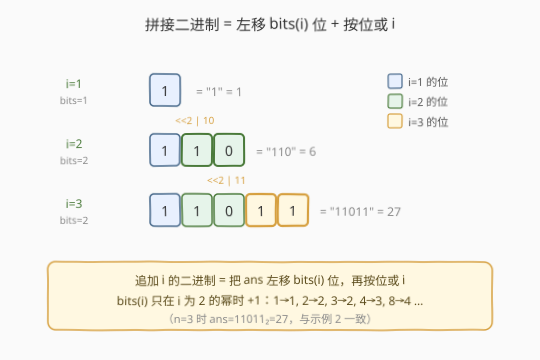
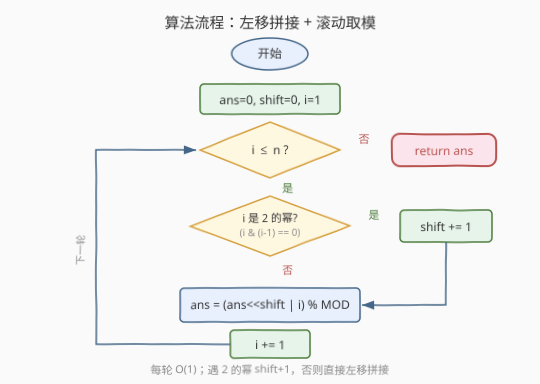
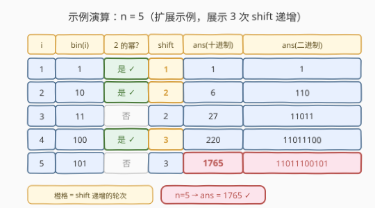

# 连接连续二进制数字

- **题目名称**：连接连续二进制数字
- **链接**：[1680. 连接连续二进制数字](https://leetcode.cn/problems/concatenation-of-consecutive-binary-numbers/)
- **难度**：中等
- **标签**：位运算、数学、模拟

## 1. 题目概述

给你一个整数 $n$，请你将 $1$ 到 $n$ 的二进制表示**连接起来**，并返回连接结果对应的**十进制**数字对 $10^9 + 7$ 取余的结果。

**示例 1**：

```text
输入：n = 1
输出：1
解释：二进制的 "1" 对应着十进制的 1。
```

**示例 2**：

```text
输入：n = 3
输出：27
解释：二进制下，1、2、3 分别对应 "1"、"10"、"11"。
将它们依次连接得到 "11011"，对应十进制的 27。
```

**示例 3**：

```text
输入：n = 12
输出：505379714
解释：连接结果为 "1101110010111011110001001101010111100"。
对应的十进制数字为 118505380540，对 10^9 + 7 取余后结果为 505379714。
```

**约束条件**：

- $1 \leq n \leq 10^5$

> 💡 **关键结构**：把 $1\ldots n$ 每个数的二进制串首尾相接，本质是在一个不断增长的二进制串**末尾追加**新位。追加 $k$ 个新位 = 把现有值左移 $k$ 位再拼上新值，这天然导向位运算递推。

---

## 2. 解题思路

### 2.1 暴力思路：字符串拼接

最直观的做法：维护一个二进制字符串 `s`，遍历 $i=1\ldots n$，逐个把 `bin(i)` 拼到 `s` 末尾，最后 `int(s, 2) % MOD` 得到答案。

```python
def concatenatedBinary(n):
    s = ""
    for i in range(1, n + 1):
        s += bin(i)[2:]
    return int(s, 2) % (10**9 + 7)
```

逻辑无误，但有两个代价：

- **空间**：$n=10^5$ 时拼接串长度约 $\sum_{i=1}^{n}\lfloor\log_2 i\rfloor+1 \approx n\log_2 n \approx 1.7\times 10^6$ 位，需存储一个超长字符串；
- **时间**：`int(s, 2)` 对百万位的大整数做解析，常数较大。

> ⚠️ 暴力法把“数值”降级成了“字符串”，丢掉了「**末尾追加二进制位 = 左移 + 按位或**」这一可增量计算的结构，导致无法边算边取模，必须最后一次性处理一个巨大数字。

### 2.2 核心观察：左移 + 按位或（增量拼接）



设处理完 $i-1$ 后的答案为 $\text{ans}$（其对应二进制串为前 $i-1$ 个数的拼接）。处理 $i$ 时，要把 $i$ 的二进制表示（共 $\text{bits}(i)$ 位）追加到 $\text{ans}$ 末尾：

- 把 $\text{ans}$ **左移** $\text{bits}(i)$ 位，腾出末尾 $\text{bits}(i)$ 个空位；
- 再**按位或** $i$（等价于加上 $i$，因为空位都是 0）。

于是得到递推：

$$
\text{ans}_i = \big(\text{ans}_{i-1} \ll \text{bits}(i)\big) \;|\; i
$$

其中 $\text{bits}(i) = \lfloor\log_2 i\rfloor + 1$，即 $i$ 的二进制位数。

**第二个观察——位长度只在 2 的幂处 +1**：

| $i$ 取值区间 | $\text{bits}(i)$ |
|--------------|-------------------|
| $1$ | $1$ |
| $2,3$ | $2$ |
| $4\ldots 7$ | $3$ |
| $8\ldots 15$ | $4$ |

每当 $i$ 是 $2$ 的幂（$1,2,4,8,\ldots$），就进入新的位长度区间，$\text{bits}(i)$ 比 $i-1$ 多 1。于是不必每次调用对数，只需维护一个 `shift` 计数器，遇到 $i\ \&\ (i-1) == 0$ 时 `shift += 1` 即可（这是 [231. 2 的幂](https://leetcode.cn/problems/power-of-two/) 的经典判定）。

**第三个观察——可以滚动取模**：

每步操作是 $\text{ans} \times 2^{\text{shift}} + i$。由同余的性质

$$
(a \times c + b) \bmod m = \big(((a \bmod m) \times c) \bmod m + b\big) \bmod m
$$

每轮都对 $\text{ans}$ 取模，结果完全一致，却把数值始终控制在 $[0, \text{MOD})$ 内，避免大整数。

> 💡 把三步观察合起来，就得到 $O(n)$ 时间、$O(1)$ 空间的最优递推：每轮判一次 2 的幂 → 维护 `shift` → 左移或运算 → 取模。

### 2.3 算法流程图



1. **初始化** `ans = 0`、`shift = 0`、`i = 1`
2. **循环** `i` 从 $1$ 到 $n$：
   - 若 `i & (i-1) == 0`（$i$ 是 $2$ 的幂），`shift += 1`
   - `ans = ((ans << shift) | i) % MOD`
3. **返回** `ans`

> ⚠️ **溢出提醒（C++）**：`ans << shift` 中 `ans` 可达 $10^9$ 量级、`shift` 最大为 $17$（因 $n \leq 10^5 < 2^{17}$），乘积约 $1.3\times 10^{14}$，超出 32 位 `int` 但在 `long long`（$\approx 9.2\times 10^{18}$）范围内。故中间量必须用 64 位整型承载，取模后再落回。

### 2.4 示例演算



以 $n=5$ 走一遍（该示例覆盖了 $i=1,2,4$ 三次 `shift` 递增，便于观察位长度的变化）：

| $i$ | $\text{bin}(i)$ | $2$ 的幂? | `shift` | 计算 $\text{ans}\ll\text{shift}\;|\;i$ | $\text{ans}$（十进制） | $\text{ans}$（二进制） |
|-----|------------------|-----------|---------|------------------------------------------|-------------------------|------------------------|
| 1 | `1` | 是 ✓ | **1** | $(0\ll1)\,|\,1$ | 1 | `1` |
| 2 | `10` | 是 ✓ | **2** | $(1\ll2)\,|\,2$ | 6 | `110` |
| 3 | `11` | 否 | 2 | $(6\ll2)\,|\,3$ | 27 | `11011` |
| 4 | `100` | 是 ✓ | **3** | $(27\ll3)\,|\,4$ | 220 | `11011100` |
| 5 | `101` | 否 | 3 | $(220\ll3)\,|\,5$ | **1765** | `11011100101` |

可以看到：

- 橙色行（$i=1,2,4$）是 `shift` 递增的轮次，分别把位长度推向 $1\to2\to3$；
- 其余行 `shift` 不变，只做「左移 + 或」；
- 最终 $n=5$ 时 $\text{ans}=1765$，二进制串 `11011100101` 正是 `1 10 11 100 101` 的拼接，验证递推正确。

> 💡 校验示例 2：$n=3$ 时表中 $\text{ans}=27$，与题目给出的 `"11011"_2=27` 一致；示例 3 $n=12$ 输出 $505379714$，由取模递推同样得到（完整十进制为 $118505380540$，对 $10^9+7$ 取余恰为 $505379714$）。

---

## 3. 参考代码

### C++

```cpp
class Solution {
public:
    int concatenatedBinary(int n) {
        const long long MOD = 1e9 + 7;
        long long ans = 0;
        int shift = 0;
        for (int i = 1; i <= n; ++i) {
            if ((i & (i - 1)) == 0) ++shift;      // i 是 2 的幂，位长度 +1
            ans = ((ans << shift) | i) % MOD;
        }
        return ans;
    }
};
```

### Python

```python
class Solution:
    def concatenatedBinary(self, n: int) -> int:
        MOD = 10**9 + 7
        ans = 0
        shift = 0
        for i in range(1, n + 1):
            if i & (i - 1) == 0:                  # i 是 2 的幂，位长度 +1
                shift += 1
            ans = ((ans << shift) | i) % MOD
        return ans
```

### Python（直接用 `i.bit_length()`，省去 shift 计数器）

```python
class Solution:
    def concatenatedBinary(self, n: int) -> int:
        MOD = 10**9 + 7
        ans = 0
        for i in range(1, n + 1):
            ans = ((ans << i.bit_length()) | i) % MOD
        return ans
```

> 💡 第三种写法用 Python 内置的 `int.bit_length()` 直接取位长度，省掉 `shift` 变量，语义更直白；C++ 可用 `32 - __builtin_clz(i)` 等价替代。两者与 `shift` 计数器版**完全等价**——`shift` 计数器只是把「求位长度」优化成「遇 2 的幂自增」的 $O(1)$ 维护，避免了每次调用对数/内置函数。

---

## 4. 复杂度分析

| 维度 | 复杂度 | 说明 |
|------|--------|------|
| 时间复杂度 | $O(n)$ | 遍历 $1\ldots n$ 一次，每轮位运算 + 取模均为 $O(1)$ |
| 空间复杂度 | $O(1)$ | 仅 `ans`、`shift`、`i` 三个整型变量，不随 $n$ 增长 |

> 💡 对 $n \le 10^5$ 的约束，$O(n)$ 总操作约 $10^5$ 次，远在时限内。即便约束放大到 $10^7$，本解法在时间上仍是最优——每个 $i$ 的贡献都不可省略，$O(n)$ 是读取下界。

---

## 5. 扩展：取模的正确性与位长度的求法

**取模为何不影响结果？** 全程只用到乘 $2^{\text{shift}}$（即左移）和加 $i$ 两种运算，二者都对加法和乘法同余保持封闭：

$$
\text{ans}_i \bmod m = \big(((\text{ans}_{i-1} \bmod m) \cdot 2^{\text{shift}}) \bmod m + i\big) \bmod m
$$

因此每轮取模与「先算完整大数、最后一次性取模」结果恒等，却把中间值压在 $[0,m)$ 内，避免大整数运算。

**位长度的三种求法对比**：

| 方法 | 写法 | 说明 |
|------|------|------|
| `shift` 计数器 | `if (i&(i-1))==0: shift++` | 利用「位长度在 2 的幂处 +1」，纯整数比较，最省 |
| 内置位长度 | Python `i.bit_length()` / C++ `32-__builtin_clz(i)` | $O(1)$，语义直白，可读性最佳 |
| 对数 | `floor(log2(i))+1` | 浮点误差风险，不推荐 |

三者均为 $O(1)$，复杂度相同；`shift` 计数器版的优雅之处在于把「位长度变化」与「2 的幂判定」合二为一，是一题多考点的典型串联。

---

## 6. 面试要点

**Q1：为什么左移 + 按位或等价于字符串拼接？**
> 把现有二进制串左移 $k$ 位，等于在末尾补 $k$ 个 0；再按位或上 $i$（其有效位恰为 $k=\text{bits}(i)$ 位），就把这 $k$ 位填成了 $i$ 的二进制。两步合起来正是「在串尾追加 $i$ 的二进制表示」。

**Q2：为什么 `shift` 只在 $i$ 是 2 的幂时 +1？**
> $i$ 的二进制位数 $\text{bits}(i)=\lfloor\log_2 i\rfloor+1$ 随 $i$ 单调不减，且仅在 $i$ 跨过 $2$ 的幂（$1,2,4,8,\ldots$）时跳变 $+1$。而 $i\ \&\ (i-1)==0$ 恰是 $2$ 的幂的充要判定（见 231 题），故用它触发 `shift` 自增即可，无需对数。

**Q3：C++ 中为什么必须用 `long long`？**
> 取模前 `ans` 最大接近 $10^9$，`shift` 最大 $17$，`ans << shift` 可达约 $1.3\times 10^{14}$，超出 32 位 `int`（$\approx 2.1\times 10^9$）范围。用 `long long`（$\approx 9.2\times 10^{18}$）承载中间量，取模后再返回 `int` 即可。Python 原生大整数无此问题，但取模同样能压低数值、提升速度。

**Q4：能否不维护 `shift`，直接每轮求位长度？**
> 能。Python 用 `i.bit_length()`、C++ 用 `32 - __builtin_clz(i)` 即可，复杂度同为 $O(n)$。`shift` 计数器只是把求位长度优化成「遇 2 的幂自增」的纯整数比较，是常数更小、也更能体现观察力的写法，面试时可作为「还能怎么优化」的延伸。

**Q5：暴力字符串法错了吗？为什么不用它？**
> 逻辑没错，能过题。但它把数值退化为字符串，丢失了「左移 + 或」的增量结构，无法边算边取模，必须存一个 $O(n\log n)$ 长度的串并做一次大整数解析，空间和常数都更差。面试中从暴力出发、再引出位运算递推，正是展示「从模拟到数学」优化思路的好例子。

---

## 7. 同类练习题

- [231. 2 的幂](https://leetcode.cn/problems/power-of-two/)：本题判定 `shift` 递增时机的基石（`n & (n-1) == 0` 判 2 的幂），先练熟这一技巧
- [67. 二进制求和](https://leetcode.cn/problems/add-binary/)：同样是「二进制串上的运算」，对照本题「拼接」与「加法」两种位级操作的处理差异
- [190. 颠倒二进制位](https://leetcode.cn/problems/reverse-bits/)：纯位运算构造题，强化对左移/右移/按位或的直觉
- [371. 两整数之和](https://leetcode.cn/problems/sum-of-two-integers/)：用位运算模拟加法，与本题「左移 + 或实现拼接」属同一套位运算工具箱
- [400. 第 N 位数字](https://leetcode.cn/problems/nth-digit/)：同样是「按位长度分层定位」的思路，对照十进制按位数分层与本题二进制按位长度分组
