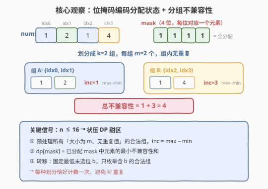
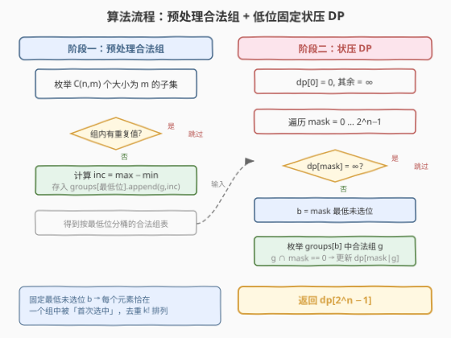
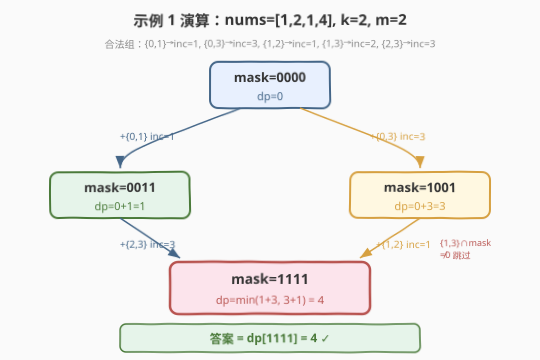

# 最小不兼容性

- **题目名称**：最小不兼容性
- **链接**：[1681. 最小不兼容性](https://leetcode.cn/problems/minimum-incompatibility/)
- **难度**：困难
- **标签**：动态规划、状态压缩、位运算、子集枚举

## 1. 题目概述

给定一个整数数组 `nums` 和一个整数 `k`，需要将数组划分为 `k` 个**大小相同**的子集，使得同一子集内**没有两个相同的元素**。每个子集的**不兼容性**定义为该子集中最大值与最小值之差。求所有子集不兼容性之和的**最小值**，若无法划分则返回 `-1`。

**示例 1**：

```text
输入：nums = [1,2,1,4], k = 2
输出：4
解释：最优分配为 [1,2] 和 [1,4]，不兼容性和 = (2-1) + (4-1) = 4。
     [1,1] 和 [2,4] 虽然和更小，但第一个子集有重复元素，不可行。
```

**示例 2**：

```text
输入：nums = [6,3,8,1,3,1,2,2], k = 4
输出：6
解释：最优分配为 [1,2], [2,3], [6,8], [1,3]，
     不兼容性和 = (2-1) + (3-2) + (8-6) + (3-1) = 6。
```

**示例 3**：

```text
输入：nums = [5,3,3,6,3,3], k = 3
输出：-1
解释：元素 3 出现 4 次 > k=3，无法放入 3 个互不重复的子集。
```

**约束条件**：

- $1 \le k \le \text{nums.length} \le 16$
- `nums.length` 能被 `k` 整除
- $1 \le \text{nums}[i] \le \text{nums.length}$

> ⚠️ **关键信号**：$n \le 16$ 是**状压 DP** 的经典甜区——$2^{16} = 65536$ 个状态完全可以枚举。每个子集大小 $m = n/k$，需要预处理所有「大小为 $m$、无重复值」的合法组，再用位掩码 DP 逐步填入。

---

## 2. 解题思路

### 2.1 暴力思路：枚举所有划分

最直白的做法是枚举将 $n$ 个元素分成 $k$ 组（每组 $m = n/k$ 个）的所有方案，对每种方案检查组内无重复并计算不兼容性之和，取最小值。

但划分方案数是多重排列数 $\frac{n!}{(m!)^k}$，当 $n=16, k=4, m=4$ 时约 $2.6 \times 10^9$，完全不可行。需要利用**子结构**避免重复枚举。

### 2.2 核心观察：位掩码编码分配状态



关键洞察：用 $n$ 位二进制整数 `mask` 表示「**已分配到某组的元素集合**」——第 $i$ 位为 1 表示 `nums[i]` 已被分入某个组。设：

$$
dp[\text{mask}] = \text{将 mask 中元素分配完毕后，已产生的不兼容性最小和}
$$

**转移**：对当前 `mask`，从**尚未分配**的元素中选出一个合法组 $g$（大小为 $m$、组内无重复值），则：

$$
dp[\text{mask} \cup g] = \min\big(dp[\text{mask} \cup g],\;\; dp[\text{mask}] + \text{incompat}[g]\big)
$$

其中 $\text{incompat}[g] = \max(g) - \min(g)$。

> 💡 **为什么用位掩码而不是逐元素分配？** 逐元素分配无法表达「一个组内无重复」的约束——需要知道同组已有哪些值。而位掩码 + 预处理合法组的方式，把「选一个完整组」作为原子操作，约束在预处理阶段一次性检查，DP 阶段只做无重叠拼接。

> ⚠️ **去重关键：固定最低未选位**。若对每个 `mask` 枚举所有合法组，同一划分会被以 $k!$ 种不同顺序计数。解决办法：找到 `mask` 中**最低的未选位** $b$，只枚举**包含 $b$** 的合法组。因为 $b$ 是尚未分配的最小下标，任何合法划分中 $b$ 必属于某个组——固定「下一个组必须含 $b$」后，每种划分恰好被计数一次。

### 2.3 算法流程图



**阶段一：预处理合法组**

1. 令 $m = n / k$（每个子集的大小）。
2. 枚举所有大小为 $m$ 的下标子集，检查对应 `nums` 值是否互不相同。
3. 对合法组计算 $\text{incompat} = \max - \min$，按**最低位**分桶存入 `groups[b]`。

**阶段二：状压 DP**

1. 初始化 $dp[0] = 0$，其余 $dp[\cdot] = \infty$。
2. 遍历 `mask` 从 $0$ 到 $2^n - 1$，跳过 $dp[\text{mask}] = \infty$ 的不可达状态。
3. 找 `mask` 中最低未选位 $b = \text{ctz}(\sim\text{mask})$。
4. 遍历 `groups[b]` 中的合法组 $g$，若 $g \cap \text{mask} = \emptyset$，更新 $dp[\text{mask} \cup g]$。
5. 返回 $dp[2^n - 1]$，若仍为 $\infty$ 则返回 $-1$。

> 💡 **提前剪枝**：若任何值出现次数 $> k$，则该值无法放入 $k$ 个互不重复的子集，直接返回 $-1$。这是充要条件——排序后轮转分配即可证明：若每值频次 $\le k$，必存在合法划分。

### 2.4 示例演算

以 `nums = [1,2,1,4], k = 2` 为例，$n = 4, m = 2$。



**预处理合法组**（下标对，组内值不重复）：

| 下标对 | 值 | 重复? | incompat | 最低位 |
|--------|----|-------|----------|--------|
| {0,1} | {1,2} | 否 | 1 | 0 |
| {0,2} | {1,1} | **是，跳过** | — | — |
| {0,3} | {1,4} | 否 | 3 | 0 |
| {1,2} | {2,1} | 否 | 1 | 1 |
| {1,3} | {2,4} | 否 | 2 | 1 |
| {2,3} | {1,4} | 否 | 3 | 2 |

分桶后：`groups[0] = [{0,1}→1, {0,3}→3]`，`groups[1] = [{1,2}→1, {1,3}→2]`，`groups[2] = [{2,3}→3]`。

**DP 演化**：

| 步 | mask | dp[mask] | 最低未选位 b | 枚举组 g | 操作 |
|----|------|----------|-------------|----------|------|
| ① | 0000 | 0 | 0 | {0,1}→inc=1 | dp[0011] = 0+1 = 1 |
| ② | 0000 | 0 | 0 | {0,3}→inc=3 | dp[1001] = 0+3 = 3 |
| ③ | 0011 | 1 | 2 | {2,3}→inc=3 | dp[1111] = 1+3 = 4 |
| ④ | 1001 | 3 | 1 | {1,2}→inc=1 | dp[1111] = min(4, 3+1) = 4 |
| ⑤ | 1001 | 3 | 1 | {1,3}→inc=2 | g∩mask ≠ 0，**跳过** |

最终 $dp[1111] = 4$ ✓，与示例 1 一致。

> 💡 **步⑤为什么跳过**：组 {1,3} 的 mask 是 `1010`，与当前已分配 `mask=1001` 按位与得 `1000 ≠ 0`（下标 3 已在组 B 中），说明元素 3 已被分配，不能重复使用。这正是位掩码「按位与判重叠」的精髓。

---

## 3. 参考代码

### C++

```cpp
class Solution {
  public:
    int minimumIncompatibility(vector<int>& nums, int k) {
        int n = nums.size();
        int m = n / k;

        // 提前剪枝：任何值出现 > k 次则无解
        int cnt[17] = {};
        for (int x : nums) cnt[x]++;
        for (int v = 1; v <= n; v++)
            if (cnt[v] > k) return -1;

        int full = (1 << n) - 1;
        const int INF = 1e9;
        vector<int> dp(1 << n, INF);
        dp[0] = 0;

        // 预处理合法组，按最低位分桶
        vector<vector<pair<int,int>>> groups(n);
        for (int mask = 0; mask <= full; mask++) {
            if (__builtin_popcount(mask) != m) continue;
            int seen = 0, mn = n + 1, mx = 0;
            bool ok = true;
            for (int i = 0; i < n; i++) {
                if (!(mask >> i & 1)) continue;
                int v = nums[i];
                if (seen & (1 << v)) { ok = false; break; }
                seen |= (1 << v);
                mn = min(mn, v);
                mx = max(mx, v);
            }
            if (!ok) continue;
            int b = __builtin_ctz(mask);          // 最低位
            groups[b].push_back({mask, mx - mn});
        }

        // 状压 DP
        for (int mask = 0; mask <= full; mask++) {
            if (dp[mask] >= INF) continue;
            int rest = full ^ mask;
            if (rest == 0) continue;
            int b = __builtin_ctz(rest);          // 最低未选位
            for (auto& [g, inc] : groups[b]) {
                if (g & mask) continue;            // 已分配则跳过
                int nm = mask | g;
                dp[nm] = min(dp[nm], dp[mask] + inc);
            }
        }

        return dp[full] >= INF ? -1 : dp[full];
    }
};
```

### Python

```python
class Solution:
    def minimumIncompatibility(self, nums: List[int], k: int) -> int:
        n = len(nums)
        m = n // k

        from collections import Counter
        if any(c > k for c in Counter(nums).values()):
            return -1

        full = (1 << n) - 1

        # 预处理合法组，按最低位分桶
        groups = [[] for _ in range(n)]
        from itertools import combinations
        for combo in combinations(range(n), m):
            vals = set()
            ok = True
            mn, mx = n + 1, 0
            for i in combo:
                v = nums[i]
                if v in vals:
                    ok = False
                    break
                vals.add(v)
                mn = min(mn, v)
                mx = max(mx, v)
            if ok:
                gmask = 0
                for i in combo:
                    gmask |= (1 << i)
                groups[combo[0]].append((gmask, mx - mn))

        INF = 10 ** 9
        dp = [INF] * (1 << n)
        dp[0] = 0

        for mask in range(1 << n):
            if dp[mask] >= INF:
                continue
            rest = full ^ mask
            if rest == 0:
                continue
            b = (rest & -rest).bit_length() - 1   # 最低未选位
            for g, inc in groups[b]:
                if g & mask:
                    continue
                nm = mask | g
                if dp[mask] + inc < dp[nm]:
                    dp[nm] = dp[mask] + inc

        return dp[full] if dp[full] < INF else -1
```

> 💡 **实现细节**：
> - **`seen` 位掩码查重**：`nums[i] ≤ n ≤ 16`，用整数的位表示某个值是否已在组内出现，`seen & (1 << v)` 判重、`seen |= (1 << v)` 标记，$O(1)$ 完成。
> - **最低位分桶**：`groups[b]` 只存最低位为 $b$ 的合法组。DP 时 `b = ctz(rest)` 定位最低未选位，直接取 `groups[b]` 遍历，避免枚举全部合法组。
> - **Python 取最低位**：`(rest & -rest).bit_length() - 1` 等价于 C++ 的 `__builtin_ctz(rest)`，先隔离最低 set bit 再取位置。
> - **`(rest & -rest)` 原理**：补码表示下 `-rest = ~rest + 1`，与 `rest` 按位与恰好保留最低的 1 位。

---

## 4. 复杂度分析

| 维度 | 复杂度 | 说明 |
|------|--------|------|
| 时间复杂度 | $O\!\left(2^n \cdot \binom{n-1}{m-1}\right)$ | 预处理 $O\!\left(\binom{n}{m} \cdot n\right)$；DP 对每个 mask 枚举含最低未选位的合法组，最坏 $\binom{n-1}{m-1}$ 个 |
| 空间复杂度 | $O(2^n)$ | dp 数组 $2^n$ + 预处理分桶表共 $\binom{n}{m}$ 个组 |

> 💡 **实际远好于最坏界**：DP 只处理 $dp[\text{mask}] < \infty$ 的可达状态，且 `popcount(mask)` 必为 $m$ 的倍数。以 $n=16, k=4, m=4$ 为例，可达 mask 仅 $C(16,0)+C(16,4)+C(16,8)+C(16,12)+C(16,16) \approx 16537$ 个，远少于 $2^{16}=65536$。每步枚举的合法组数也随剩余元素减少而急剧下降，实际运算量在百万级。

---

## 5. 扩展：DFS 回溯 + 剪枝

$n \le 16$ 的规模同样适合 DFS 回溯。思路是逐元素分配：对每个未分配元素，尝试将其放入已有的 $k$ 个组之一（若该组未含同值）或开新组。剪枝策略：

- **排序降序**：先分配大值，缩小搜索空间；
- **同层去重**：若多个空组等价，只放第一个；
- **下界剪枝**：当前累计不兼容性 + 剩余下界 $\ge$ 已知最优则回溯。

回溯的优势是常数小、空间 $O(n)$；劣势是最坏复杂度仍为指数级，难以稳定分析。状压 DP 虽空间 $O(2^n)$，但时间上界清晰、无重复计算，是面试中「规模确定时」的稳妥选择。两种方法在 $n \le 16$ 下均可 AC。

---

## 6. 面试要点

1. **为什么要固定最低未选位？**

   - 若对每个 `mask` 枚举所有合法组，同一划分会以 $k!$ 种组序被重复计数。固定最低未选位 $b$ 后，每步「下一个组必含 $b$」——$b$ 是剩余元素中最小的，在任何划分中必属于某个组，固定其归属即唯一确定了组的选取顺序，消除排列重复。

2. **频次 > k 为什么一定无解？**

   - 有 $k$ 个组，每组最多含某值一次，故某值最多出现 $k$ 次。若超过 $k$ 次，必然有组含重复值。反之若每值 $\le k$ 次，排序后轮转分配（第 $i$ 个值放入第 $i \bmod k$ 组）即可构造合法划分，故该条件**充要**。

3. **预处理合法组的时间是多少？是否可接受？**

   - 枚举 $C(n, m)$ 个大小为 $m$ 的子集，每组 $O(n)$ 检查，共 $O(C(n,m) \cdot n)$。$n=16, m=4$ 时约 $C(16,4) \times 16 \approx 29120$，可忽略不计。即使最坏 $m=8$（$k=2$），$C(16,8) \times 16 \approx 205920$，仍很快。

4. **能否用贪心（如每次选差最小的组）？**

   - 不能。贪心缺乏全局最优保证。反例：`nums=[1,2,3,4,1,4], k=3`，贪心可能先配 [1,2](inc=1)、[3,4](inc=1)，剩余 [1,4](inc=3)，总和 5；但最优为 [1,3](inc=2)、[2,4](inc=2)、[1,4](inc=3)，总和 7——可见贪心甚至方向不定。状压 DP 穷举所有合法组组合，保证全局最优。

5. **`g & mask` 为什么能 $O(1)$ 判重叠？**

   - `g` 和 `mask` 都是 $n$ 位整数，按位与结果非零表示存在公共 set bit（即某元素同时在组和已分配集中）。整数按位与是 $O(1)$ 操作（$n \le 16$，单次机器字运算），无需逐位扫描。

---

## 7. 同类练习题

- [1655. 分配重复整数](https://leetcode.cn/problems/distribute-repeating-integers/)（[题解](./1655_分配重复整数.md)）：状压 DP + 子集枚举，`mask` 编码已满足顾客集合，与本题「mask 编码已分配元素」同构，只是状态维度不同
- [698. 划分为 K 个相等的子集](https://leetcode.cn/problems/partition-to-k-equal-sum-subsets/)（[题解](../0601-0700/698_划分为K个相等的子集.md)）：状压 DP / 回溯，`mask` 表示已用元素，把数分成 K 组——「子集划分」型状压的范本
- [473. 火柴拼正方形](https://leetcode.cn/problems/matchsticks-to-square/)（[题解](../0401-0500/473_火柴拼正方形.md)）：698 的 $k=4$ 特例，回溯 + 三重剪枝，与本题同为「等大分组」问题
- [1494. 并行课程 II](https://leetcode.cn/problems/parallel-courses-ii/)（[题解](../1401-1500/1494_并行课程II.md)）：状压 DP + 子集枚举，每步从可选集中挑一个子集，转移模式与本题「每步选一个合法组」一致
- [1659. 最大化网格幸福感](https://leetcode.cn/problems/maximize-grid-happiness/)（[题解](./1659_最大化网格幸福感.md)）：状压 DP 进阶，轮廓线 DP，与本题同为 bitmask 系列的困难题
