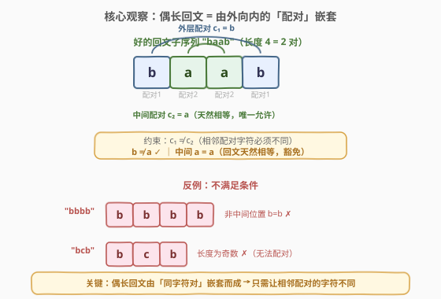
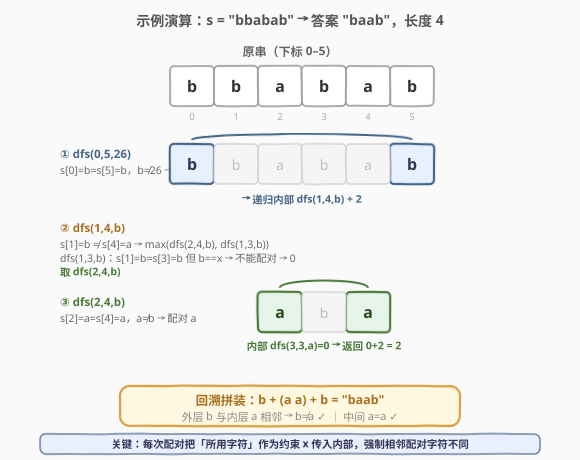

# 最长回文子序列 II

- **题目名称**：最长回文子序列 II
- **链接**：[1682. 最长回文子序列 II](https://leetcode.cn/problems/longest-palindromic-subsequence-ii)
- **难度**：中等
- **标签**：动态规划、区间 DP、字符串

## 1. 题目概述

字符串 `s` 的某个子序列符合下列条件时，称为「**好的回文子序列**」：

1. 它是 `s` 的子序列。
2. 它是回文序列（反转后与原序列相等）。
3. 长度为**偶数**。
4. **除中间的两个字符外**，其余任意两个连续字符不相等。

例如，`s = "abcabcabb"` 时，`"abba"` 是「好的回文子序列」；而 `"bcb"`（长度不是偶数）和 `"bbbb"`（含有相等的连续字符）不是。

给定字符串 `s`，返回 `s` 的**最长「好的回文子序列」**的**长度**。

**示例 1**：

```text
输入：s = "bbabab"
输出：4
解释：最长「好的回文子序列」是 "baab"。
```

**示例 2**：

```text
输入：s = "dcbccacdb"
输出：4
解释：最长「好的回文子序列」是 "dccd"。
```

**约束条件**：

- `1 <= s.length <= 250`
- `s` 仅包含小写英文字母

> 💡 本题是 [516. 最长回文子序列](../0501-0600/516_最长回文子序列.md) 的加强版：在「回文子序列」之上叠加了「偶数长度」与「除中间外相邻字符不等」两个限制。516 的二维区间 DP 不够用了——需要**多带一维「上一次配对所用字符」**作为约束向下传递，这是本题的关键。

---

## 2. 解题思路

### 2.1 暴力思路：枚举所有子序列

枚举 `s` 的所有子序列（共 $2^n$ 个），逐个判定是否满足四个条件，取最长者。`n ≤ 250` 时 $2^{250}$ 完全不可行，且存在大量重复子问题（同一个区间被反复求解）。

### 2.2 核心观察：偶长回文 = 由外向内的「同字符配对」嵌套



一个**偶长回文**可以看作若干「同字符对」由外向内嵌套：

$$\text{结果} = c_1\,c_2\,\cdots\,c_m\,c_m\,\cdots\,c_2\,c_1$$

其中第 $k$ 对的两个字符都是 $c_k$，位于结果的首尾对称位置。于是：

- **回文**：天然满足（对称同字符）。
- **偶数长度**：配对数 $\times 2$，天然偶数。
- **中间两个字符**：$c_m\,c_m$ 必然相等（回文性质），这正是被**豁免**的那一对。
- **其余相邻对**：$c_k\,c_{k+1}$（$k < m$）必须不等，即 $c_k \neq c_{k+1}$。

> 💡 **关键转化**：条件 4「除中间外相邻字符不等」等价于 **「相邻两次配对所用的字符必须不同」**。因此只需在 516 的区间 DP 基础上，多记一维 `x` = 「上一次（更外层）配对所用的字符」，强制本次配对字符 $\neq x$ 即可。中间那一对天然相等，恰好是豁免对象，无需特殊处理。

> ⚠️ 注意 `i ≥ j` 时返回 `0` 而非 `1`：本题只允许偶数长度，单个字符无法凑成一对，不贡献长度。这与 516（`dp[i][i]=1`）不同。

### 2.3 算法流程图

![算法流程：dfs(i,j,x) → i≥j 返回 0；s[i]==s[j] 且 s[i]≠x 则配对 +2 并把约束传为 s[i]；否则舍弃一端取 max](../images/lps2_algorithm_flow.svg)

**状态定义**：`dfs(i, j, x)` = 子串 `s[i..j]`（闭区间）内，且**外层已有一对字符为 `x`**（即本次最外一对的字符必须 $\neq x$）时，能凑出的最长「好的回文子序列」长度。`x = 26` 表示尚无外层配对、不施加约束。

**转移**：

```text
若 i >= j：                              # 凑不出一对
    dfs(i, j, x) = 0

若 s[i] == s[j] 且 s[i] != x：           # 可作新一对外层配对
    dfs(i, j, x) = dfs(i + 1, j - 1, s[i]) + 2

否则：                                    # 两端不能同时作首尾
    dfs(i, j, x) = max(dfs(i + 1, j, x),  # 舍弃左端 s[i]
                       dfs(i, j - 1, x))  # 舍弃右端 s[j]
```

**答案**：`dfs(0, n - 1, 26)`。

> 💡 **为什么 `s[i]==s[j]` 且 `s[i]!=x` 时直接配对、不与「舍弃一端」取 max？** 因为此时配对**一定不劣于**舍弃一端（证明见 2.5）。直觉：任何不含 `s[i]`（或不含 `s[j]`）的可行解都在更小的子区间内，而把 `s[i]`、`s[j]` 作为外层配对接上去，长度 `+2`，且约束从 `x` 变为 `s[i]`（仅多限制一个字符），至多损失内部 2 个长度（见下方引理），`+2` 恰好补回。

### 2.4 示例演算

以 `s = "bbabab"` 为例：



**递归展开**（`x = 26` 表示无约束；字符以 0–25 编码，`b=1, a=0`）：

| 步骤 | 调用 | 判定 | 结果 |
|------|------|------|------|
| ① | `dfs(0,5,26)` | `s[0]=b=s[5]=b`，`b≠26` → 配对外层 b | `dfs(1,4,b)+2` |
| ② | `dfs(1,4,b)` | `s[1]=b ≠ s[4]=a` → 舍弃一端 | `max(dfs(2,4,b), dfs(1,3,b))` |
| ③ | `dfs(2,4,b)` | `s[2]=a=s[4]=a`，`a≠b` → 配对 a | `dfs(3,3,a)+2 = 0+2 = 2` ✓ |
| ④ | `dfs(1,3,b)` | `s[1]=b=s[3]=b` 但 `b==x` → 不能配对 | `max(dfs(2,3,b), dfs(1,2,b)) = 0` |

回溯：`dfs(1,4,b) = max(2, 0) = 2`，`dfs(0,5,26) = 2 + 2 = 4`。拼装 `b + (a a) + b = "baab"`：外层 `b` 与内层 `a` 相邻 `b≠a ✓`，中间 `a=a ✓`。

### 2.5 配对最优性证明

**引理**：对任意区间 `R` 与字符 `c, x`（`c ≠ x`），$\text{dfs}(R, c) + 2 \geq \text{dfs}(R, x)$。

> 设 `R` 在约束 `x` 下的最优解最外层配对字符为 `d`（`d ≠ x`）。若 `d ≠ c`，则该解也满足约束 `c`，$\text{dfs}(R,c) \geq \text{dfs}(R,x)$，成立。若 `d = c`，剥去最外层那一对，内部最外层字符 `d' ≠ d = c`（相邻配对必须不同），故内部满足约束 `c`，$\text{dfs}(R,c) \geq \text{dfs}(R,x) - 2$，即 $\text{dfs}(R,c)+2 \geq \text{dfs}(R,x)$。$\square$

**定理**：当 `s[i]==s[j]=c` 且 `c≠x` 时，`dfs(i,j,x) = dfs(i+1,j-1,c) + 2`（配对最优）。

> 任取 `s[i..j]` 在约束 `x` 下的最优解 `P`。若 `P` 同时用 `s[i]`、`s[j]`，则它们就是最外层配对（首尾），`P = c + P' + c`，`P'` 为 `s[i+1..j-1]` 在约束 `c` 下的可行解，$|P| = \text{dfs}(i+1,j-1,c)+2$。若 `P` 不含 `s[i]`，则 `P` 完全落在 `s[i+1..j]` 内，$|P| \leq \text{dfs}(i+1,j,x)$；而 `s[i+1..j]` 去掉末尾 `s[j]=c` 即 `s[i+1..j-1]`，由引理 $\text{dfs}(i+1,j-1,c)+2 \geq \text{dfs}(i+1,j-1,x) \geq \text{dfs}(i+1,j,x) \geq |P|$（`P` 不含 `s[j]` 时落在 `s[i+1..j-1]` 内；含 `s[j]` 时 `s[j]=c` 为 `P` 最外层配对，剥去后内部满足约束 `c`，仍得 `+2` 不劣）。对称地不含 `s[j]` 同理。故配对不劣于任何情形。$\square$

---

## 3. 参考代码

### Python

```python
class Solution:
    def longestPalindromeSubseq(self, s: str) -> int:
        @cache                              # 自动记忆化 (i, j, x) 三元组
        def dfs(i: int, j: int, x: str) -> int:
            if i >= j:                      # 凑不出一对 → 偶数长度要求
                return 0
            if s[i] == s[j] and s[i] != x:  # 可作新一对外层配对
                return dfs(i + 1, j - 1, s[i]) + 2
            return max(dfs(i + 1, j, x),    # 舍弃左端
                       dfs(i, j - 1, x))    # 舍弃右端

        ans = dfs(0, len(s) - 1, '')        # '' 表示尚无外层配对，不约束
        dfs.cache_clear()                    # 释放缓存
        return ans
```

### C++

```cpp
// 1682. 最长回文子序列 II.cpp —— 区间 DP + 记忆化（第三维 x = 外层配对字符）
// 编译: g++ -O2 -std=c++17 1682.cpp -o lps2
class Solution {
public:
    int f[252][252][27];                    // f[i][j][x]，x∈[0,26]，26 表示无约束

    int longestPalindromeSubseq(string s) {
        int n = s.size();
        memset(f, -1, sizeof f);
        function<int(int, int, int)> dfs = [&](int i, int j, int x) -> int {
            if (i >= j) return 0;                              // 凑不出一对
            int &res = f[i][j][x];
            if (res != -1) return res;                         // 记忆化命中
            int ci = s[i] - 'a', cj = s[j] - 'a';
            if (ci == cj && ci != x)                           // 可作新一对外层配对
                res = dfs(i + 1, j - 1, ci) + 2;
            else
                res = max(dfs(i + 1, j, x), dfs(i, j - 1, x)); // 舍弃一端
            return res;
        };
        return dfs(0, n - 1, 26);                              // 26 = 无约束
    }
};
```

> 💡 **实现细节**：① Python 用空串 `''` 作「无约束」标记（与任何单字符都不等），`@cache` 自动处理三元组记忆化，最简洁。② C++ 用整数 `0..25` 表示字符、`26` 表示无约束，三维数组 `f[n][n][27]` 初始化为 `-1` 作「未计算」哨兵；`n ≤ 250`，数组大小约 $250^2 \times 27 \approx 1.7\text{M}$，可静态分配。③ 递归 lambda 用 `std::function` 包装以支持自引用。

---

## 4. 复杂度分析

| 维度 | 记忆化 DFS | 说明 |
|------|-----------|------|
| **时间** | $O(n^2 \cdot C)$ | 状态数 $n \times n \times (C+1)$，每状态 $O(1)$ 转移；$C = 26$ |
| **空间** | $O(n^2 \cdot C)$ | memo 表大小；$n \leq 250$ 时约 $1.7 \times 10^6$ 项 |
| **递归栈** | $O(n)$ | 最深递归 $n$ 层 |

> ⚠️ $n \leq 250$，$C = 26$：约 $250 \times 250 \times 27 \approx 1.69 \times 10^6$ 个状态，每状态 $O(1)$，远低于时限。相比 516 多出的 $C$ 倍来自「约束字符」这一维——这是把「相邻配对字符不等」编码进状态的代价。

---

## 5. 扩展：自底向上迭代 DP

记忆化搜索可改写为自底向上填表。`dp[i][j][x]` 依赖更短的区间（`i+1` 行、`j-1` 列），故 `i` 倒序、`j` 正序，`x` 任意序：

```python
class Solution:
    def longestPalindromeSubseq(self, s: str) -> int:
        n = len(s)
        dp = [[[0] * 27 for _ in range(n)] for _ in range(n)]
        for i in range(n - 1, -1, -1):          # i 自下而上
            for j in range(i + 1, n):           # j 自左而右
                for x in range(27):
                    ci, cj = ord(s[i]) - 97, ord(s[j]) - 97
                    if ci == cj and ci != x:
                        inner = dp[i + 1][j - 1][ci] if i + 1 <= j - 1 else 0
                        dp[i][j][x] = inner + 2
                    else:
                        a = dp[i + 1][j][x] if i + 1 < n else 0
                        b = dp[i][j - 1][x] if j - 1 >= 0 else 0
                        dp[i][j][x] = max(a, b)
        return dp[0][n - 1][26]
```

时间、空间同记忆化版本 $O(n^2 \cdot C)$。记忆化搜索只访问**可达**状态（实际远少于上界），常数更优；迭代版无需递归栈、适合禁用深递归的场合。

---

## 6. 面试要点

1. **`dfs(i, j, x)` 中第三维 `x` 的作用是什么？为什么需要它？**

   > `x` 是「上一次（更外层）配对所用的字符」。条件 4 要求除中间外相邻字符不等，等价于「相邻两次配对的字符必须不同」。把外层配对字符作为 `x` 向内传递，强制内层最外一对 $\neq x$，就把该约束编进了状态。没有这一维就无法区分「这一对能不能接在某个外层之后」。

2. **为什么 `i >= j` 返回 `0` 而不是像 516 那样 `dp[i][i]=1`？**

   > 本题要求**偶数长度**，所有贡献都来自「成对」的字符（每次 `+2`）。单个字符凑不成一对，长度贡献为 0。`i == j`（单字符）和 `i > j`（空）都返回 0，让转移式统一成立，无需对长度 2 特判。

3. **`s[i]==s[j]` 且 `s[i]==x` 时为什么不能配对？走哪个分支？**

   > 配对会把 `s[i]` 接到外层 `x` 字符旁边，二者相等 → 违反「相邻配对字符不同」。此时落入 `else` 分支：`max(dfs(i+1,j,x), dfs(i,j-1,x))`，即舍弃左端或右端继续找其它配对。注意这里 `s[i]==s[j]` 但因约束不能配，正是 `x` 维度发挥作用的关键场景。

4. **配对条件满足时为何不与「舍弃一端」取 max？配对一定最优吗？**

   > 一定最优（见 2.5 证明）。核心引理：把约束从 `x` 收紧到 `c`（`c≠x`）至多使内部最优值少 2（剥去最外层那对即可），而配对带来 `+2` 恰好补回。因此 `dfs(i+1,j-1,c)+2 ≥ max(dfs(i+1,j,x), dfs(i,j-1,x))`，直接配对即可。

5. **本题与 516「最长回文子序列」的异同？**

   > 同：都是区间 DP，`dfs(i,j)` 表示子串内的最长值，两端相同则向内缩 `+2`，不同则舍弃一端取 max。异：① 本题要求偶数长度，`i≥j` 返回 0（516 返回 1）；② 本题多了「相邻配对字符不同」约束，需第三维 `x` 记录外层配对字符并向下传递；③ 516 两端相同时「直接配对」的直觉证明依赖「配对不劣」，本题同样成立但证明需借助引理（约束收紧至多损 2）。

> 💡 **一句话总结**：1682 在 516 的区间 DP 上加一维「外层配对字符 `x`」并强制 `s[i]≠x` 才能配对，把「除中间外相邻字符不等」编码进状态。`dfs(i,j,x)`：`i≥j` 返 0；`s[i]==s[j]` 且 `s[i]≠x` 则 `dfs(i+1,j-1,s[i])+2`；否则 `max(左缩, 右缩)`。$O(n^2 C)$ 时间与空间，$C=26$。

---

## 7. 同类练习题

- [516. 最长回文子序列](https://leetcode.cn/problems/longest-palindromic-subsequence/)（[题解](../0501-0600/516_最长回文子序列.md)）：本题的基础版，二维区间 DP，对比理解「第三维约束」从何而来
- [1312. 让字符串成为回文串的最少插入次数](https://leetcode.cn/problems/minimum-insertion-steps-to-make-a-string-palindrome/)：区间 DP 直接变体，`n - 最长回文子序列长度`，巩固 `dfs(i,j)` 模板
- [1216. 验证回文串 III](https://leetcode.cn/problems/valid-palindrome-iii/)：区间 DP 判定「最多删 k 个字符能否成回文」，`dp[i][j]` = 最少删除数
- [1745. 分割回文串 IV](https://leetcode.cn/problems/palindrome-partitioning-iv/)：预处理回文表 + 区间判定，练习回文相关 DP 的组合
- [5. 最长回文子串](https://leetcode.cn/problems/longest-palindromic-substring/)（[题解](../0001-0100/5_最长回文子串.md)）：求连续回文子串，中心扩展；对比「子串 vs 子序列」「连续 vs 配对」
