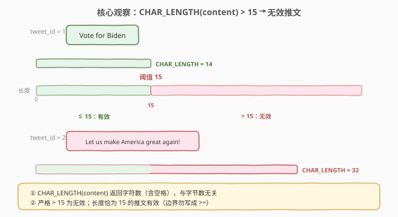
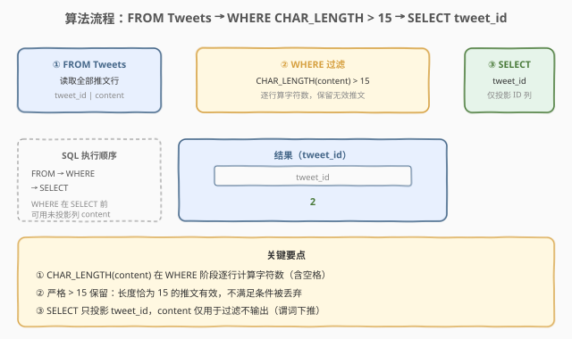
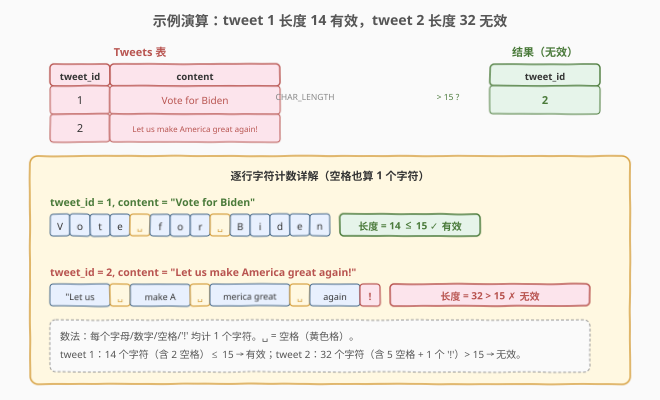

# LeetCode 无效的推文 题解

## 1. 题目概述

- **标题 / 题号**：无效的推文（#1683，easy）
- **链接**：https://leetcode.cn/problems/invalid-tweets/
- **难度**：简单
- **标签**：数据库、SQL、`WHERE` 过滤、`CHAR_LENGTH`、字符计数、`LENGTH` 字节计数、单表查询

**题意**：给定 `Tweets`（推文）表，编写 SQL 查询，找出所有**无效推文**的编号（`tweet_id`）。当推文内容中的字符数**严格大于** `15` 时，该推文是无效的。以任意顺序返回结果。

**表结构**：

```text
Table: Tweets
+----------------+---------+
| Column Name    | Type    |
+----------------+---------+
| tweet_id       | int     |  ← 主键
| content        | varchar |
+----------------+---------+
```

在 SQL 中，`tweet_id` 是这个表的主键。`content` 只包含字母数字字符、`'!'`、`' '`，不包含其它特殊字符。

**示例 1**：

```text
输入：
Tweets 表:
+----------+----------------------------------+
| tweet_id | content                          |
+----------+----------------------------------+
| 1        | Vote for Biden                   |
| 2        | Let us make America great again! |
+----------+----------------------------------+

输出：
+----------+
| tweet_id |
+----------+
| 2        |
+----------+
```

**解释**：

| tweet_id | content | 字符数 | 是否 > 15 | 判定 |
|----------|---------|--------|-----------|------|
| 1 | `Vote for Biden` | 14 | 否 | 有效 |
| 2 | `Let us make America great again!` | 32 | 是 | 无效 |

**约束**：

- `tweet_id` 是 `Tweets` 表的主键（非空、唯一）。
- `content` 列只包含字母数字字符、`'!'`、`' '`。
- 当 `content` 的字符数**严格大于** 15 时推文无效（即 `> 15`，不是 `>= 15`）。
- 结果可按任意顺序返回。

> 💡 本题是 SQL **"`WHERE` 条件过滤入门招牌题"**——核心是用 `CHAR_LENGTH(content) > 15` 一行过滤。最大考点不在"难"，而在辨析 **`CHAR_LENGTH`（按字符计数）与 `LENGTH`（MySQL 按字节计数）** 的区别：对纯 ASCII 数据两者结果相同，但一旦涉及多字节字符（UTF-8 中文/emoji）就会产生分歧。语义上"推文字数"指的是字符数，故应使用 `CHAR_LENGTH`。

## 2. 解题思路

### 2.1 暴力思路：应用层逐行判定

最直觉的过程式思路：把 `Tweets` 表全部拉到应用层，在 Python/Java 中逐行调用 `len(content)` 判定长度是否超过 15，收集符合条件的 `tweet_id`：

```text
result = []
for row in Tweets:
    if len(row.content) > 15:
        result.append(row.tweet_id)
```

逻辑正确，但**把"按长度过滤"这层数据库天然能做的工作甩给了应用层**——既要全量拉取数据（含所有不需要的 `content` 文本），又产生不必要的网络往返。更关键的是，它**回避了"如何在纯 SQL 中度量字符串长度并据此过滤"这一真正考点**。

> ⚠️ 暴力思路的根本问题：**没有正面解决"SQL 如何度量字符串长度"**。SQL 提供了 `CHAR_LENGTH()` / `LENGTH()` 等内置函数，完全可以在 `WHERE` 子句中一步完成过滤，无需把数据拉到应用层。能被数据库高效过滤的谓词就应下推到数据库，这是"谓词下推"的基本原则。

### 2.2 核心观察：`CHAR_LENGTH` 字符计数 + `WHERE` 过滤



**问题拆解为两个子问题**：

1. **度量字符串长度**：用 `CHAR_LENGTH(content)` 返回 `content` 的**字符数**（无论单字节还是多字节字符，每个字符计 1）。
   - `CHAR_LENGTH('Vote for Biden')` = 14（14 个字符）。
   - `CHAR_LENGTH('Let us make America great again!')` = 32（32 个字符）。

2. **按长度过滤**：用 `WHERE CHAR_LENGTH(content) > 15` 筛出字符数严格大于 15 的行，即无效推文。

> 💡 **`CHAR_LENGTH` 的语义**：返回字符串的**字符数**，与字符的存储字节数无关。对 ASCII 字符（1 字节）`CHAR_LENGTH` = `LENGTH`；对多字节字符（如 UTF-8 下中文占 3 字节、emoji 占 4 字节）`CHAR_LENGTH` 仍按"1 个字符"计数。这正是"推文字数"的语义——用户看到的是字符数而非字节数。

> ⚠️ **`> 15` 而非 `>= 15`**：题面明确"字符数**严格大于** 15 时无效"，即恰好 15 个字符的推文是**有效**的。边界值 15 不满足条件，必须用严格大于 `>`。这是本题最易踩的边界坑——把 `>` 写成 `>=` 会把长度恰为 15 的有效推文误判为无效。

### 2.3 算法流程图



**逻辑执行步骤**：

| 步骤 | 子句 | 作用 | 本题对应 |
|------|------|------|----------|
| ① | `FROM Tweets` | 读取全部推文行 | 获取 `tweet_id` 和待判定的 `content` |
| ② | `WHERE CHAR_LENGTH(content) > 15` | 逐行计算字符数并过滤 | 字符数严格大于 15 的行保留（无效推文） |
| ③ | `SELECT tweet_id` | 投影输出列 | 只返回 `tweet_id`，不返回 `content` |

> 💡 **SQL 子句执行顺序**：`FROM` → `WHERE` → `GROUP BY` → `HAVING` → `SELECT` → `ORDER BY` → `LIMIT`。本题 `WHERE` 在 `SELECT` **之前**执行——即在过滤时 `content` 列尚未被投影掉，`CHAR_LENGTH(content)` 可以正常引用。这也解释了为何 `WHERE` 能使用表中任意列（包括不在 `SELECT` 中的列）做谓词。

### 2.4 示例演算

以示例 1 的 2 条推文为例，观察「度量字符数 → 过滤」的逐步过程：



**步骤 ①②：FROM + WHERE（逐行计算字符数并过滤）**

| tweet_id | content | CHAR_LENGTH(content) | > 15 ? | 是否保留 |
|----------|---------|----------------------|--------|----------|
| 1 | `Vote for Biden` | 14 | 否 | 丢弃（有效推文） |
| 2 | `Let us make America great again!` | 32 | 是 | 保留（无效推文） |

**步骤 ③：SELECT tweet_id（投影输出）**

| tweet_id |
|----------|
| 2 |

> 💡 **字符数怎么数**：`Vote for Biden` 共 14 个字符——`V`(1) `o`(2) `t`(3) `e`(4) `(空格)`(5) `f`(6) `o`(7) `r`(8) `(空格)`(9) `B`(10) `i`(11) `d`(12) `e`(13) `n`(14)。注意**空格也算一个字符**，`CHAR_LENGTH` 不忽略空白。这正是"推文字数"的直观语义——发推时屏幕上看到的每一个字符（含空格）都占一个字数。

## 3. 参考代码

### SQL（解法 A：`CHAR_LENGTH`，推荐）

```sql
SELECT tweet_id
FROM Tweets
WHERE CHAR_LENGTH(content) > 15;
```

> 💡 **写法要点**：
> - **`CHAR_LENGTH(content)`**：返回 `content` 的**字符数**，与字符存储字节数无关。这是"推文字数"的语义正确度量。
> - **`> 15`**：严格大于，长度恰为 15 的推文有效（不满足条件）。
> - **`SELECT tweet_id`**：只投影需要的列，不返回 `content`，减少输出数据量。
> - ✓ **最推荐**：语义清晰、字符计数正确、跨数据库通用（MySQL/PostgreSQL/SQL Server 均支持 `CHAR_LENGTH`，SQL Server 中为 `LEN`）。

### SQL（解法 B：`LENGTH`，字节数——注意多字节陷阱）

```sql
SELECT tweet_id
FROM Tweets
WHERE LENGTH(content) > 15;
```

> 💡 **解法 B 的思路**：用 `LENGTH(content)` 替代 `CHAR_LENGTH(content)`。
>
> **与解法 A 的区别**：
> - 在 **MySQL** 中，`LENGTH(str)` 返回字符串的**字节数**（而非字符数）。对纯 ASCII 字符（每个 1 字节），`LENGTH` = `CHAR_LENGTH`，结果相同。
> - 本题约束 `content` 只含字母数字、`'!'`、`' '`，均为 ASCII，故 `LENGTH` 与 `CHAR_LENGTH` 结果一致，解法 B 在本题可通过。
> - **但语义上 `LENGTH` 是错的**：一旦 `content` 含多字节字符（如 UTF-8 中文占 3 字节、emoji 占 4 字节），`LENGTH` 会把 1 个字符算成 3 或 4，导致长度为 6 的中文推文被误判为长度 18 而标记无效。"推文字数"指字符数，应始终用 `CHAR_LENGTH`。
> - 在 **PostgreSQL** 中 `LENGTH(str)` 默认返回字符数（与 `CHAR_LENGTH` 相同），与 MySQL 语义不同——这是跨数据库迁移时最易踩的坑。

### SQL（解法 C：`CHARACTER_LENGTH`，SQL 标准同义词）

```sql
SELECT tweet_id
FROM Tweets
WHERE CHARACTER_LENGTH(content) > 15;
```

> 💡 **解法 C 使用 `CHARACTER_LENGTH`**：它是 SQL 标准中对 `CHAR_LENGTH` 的正式名称，两者在 MySQL/PostgreSQL 中**完全等价**（同义词）。`CHAR_LENGTH` 是更常用的简写形式，`CHARACTER_LENGTH` 则更贴近 SQL 标准（SQL-92）。选哪个纯属风格偏好，行为一致。SQL Server 中两者均不可用，需用 `LEN(content)`。

### Python（pandas）

```python
import pandas as pd

def invalid_tweets(tweets: pd.DataFrame) -> pd.DataFrame:
    return tweets[tweets['content'].str.len() > 15][['tweet_id']]
```

> 💡 **pandas 对照**：
> - **`str.len()`**：pandas 字符串访问器 `.str.len()` 返回每个字符串的**字符数**——对应 SQL 的 `CHAR_LENGTH`，而非 `LENGTH`（字节数）。Python 3 中 `str` 按 Unicode 字符计数，与 `CHAR_LENGTH` 语义一致。
> - **`tweets[...][['tweet_id']]`**：布尔索引过滤行（对应 `WHERE`），再 `[['tweet_id']]` 投影列（对应 `SELECT tweet_id`）。注意双层 `[[ ]]` 返回 DataFrame 而非 Series。
> - **边界一致**：`str.len() > 15` 同样是严格大于，长度恰为 15 的推文不保留，与 SQL 行为一致。

## 4. 复杂度分析

| 维度 | 解法 A（`CHAR_LENGTH`） | 解法 B（`LENGTH`） | 解法 C（`CHARACTER_LENGTH`） | pandas |
|------|------------------------|---------------------|------------------------------|--------|
| **时间** | $O(n \cdot L)$ | $O(n \cdot L)$ | $O(n \cdot L)$ | $O(n \cdot L)$ |
| **空间** | $O(k)$ | $O(k)$ | $O(k)$ | $O(n \cdot L)$ |
| **可读性** | ✓ 直观 | ✓ 直观 | ✓ 直观 | ✓ 简洁 |
| **字符语义** | ✓ 字符数 | ⚠ 字节数 | ✓ 字符数 | ✓ 字符数 |
| **跨数据库** | ✓ 通用 | MySQL 字节/PG 字符 | ✓ 通用 | — |
| **推荐度** | ✓ **首选** | ⚠ 仅 ASCII 安全 | ✓ 备选 | ✓ 验证用 |

> - $n$ = `Tweets` 表行数，$L$ = `content` 列平均长度，$k$ = 无效推文行数（输出大小）。
> - **时间**：每行对 `content` 计算 `CHAR_LENGTH` 需扫描整个字符串 $O(L)$；$n$ 行总计 $O(n \cdot L)$。实际中推文长度有上限，$L$ 可视为常数，故 $O(n)$。
> - **空间**：SQL 解法只需 $O(k)$ 存输出结果集（仅 `tweet_id`），无额外中间结构；pandas 需 $O(n \cdot L)$ 把整个 DataFrame 载入内存。
> - **索引**：`WHERE CHAR_LENGTH(content) > 15` 是**函数谓词**，无法直接利用 `content` 上的普通 B+ 树索引（索引对原始值排序，不对函数值排序）。若 `content` 长度过滤是高频查询，可考虑在 `content` 上建**函数索引**（MySQL 8.0.13+ 支持 `CREATE INDEX idx_len ON Tweets ((CHAR_LENGTH(content)))`），或冗余一列 `content_len` 并建普通索引。

## 5. 扩展：`CHAR_LENGTH` vs `LENGTH` vs `CHARACTER_LENGTH`

三个长度函数看似相近，实则在**计数单位**与**跨数据库语义**上有重要差异。本题虽因数据纯 ASCII 而不暴露问题，但理解三者的区别是 SQL 字符串处理的基本功。

### 5.1 三者的语义对照

| 函数 | 计数单位 | MySQL | PostgreSQL | SQL Server | Oracle | SQL 标准 |
|------|----------|-------|------------|------------|--------|----------|
| `CHAR_LENGTH(str)` | 字符数 | ✓ | ✓ | ✗（用 `LEN`） | ✓（`CHAR_LENGTH`） | ✓ |
| `CHARACTER_LENGTH(str)` | 字符数 | ✓（同义） | ✓（同义） | ✗ | ✓ | ✓（正式名） |
| `LENGTH(str)` | MySQL=字节 / PG=字符 | 字节数 | 字符数 | ✗（用 `LEN`） | 字节数 | ✗ |
| `LEN(str)` | 字符数 | ✗ | ✗ | ✓ | ✗ | ✗（SQL Server 方言） |
| `OCTET_LENGTH(str)` | 字节数 | ✓ | ✓ | ✗ | ✓ | ✓ |

> 💡 **核心结论**：
> - **要字符数**：用 `CHAR_LENGTH`（或 `CHARACTER_LENGTH`），跨数据库最安全（SQL Server 例外用 `LEN`）。
> - **要字节数**：用 `OCTET_LENGTH`（SQL 标准），MySQL 中 `LENGTH` 也返回字节数但非标准且与 PostgreSQL 语义冲突。
> - **避免 `LENGTH`**：它在 MySQL（字节）和 PostgreSQL（字符）中语义不同，跨库迁移时是隐患。

### 5.2 多字节字符下的差异示例

设字符串 `s = '你好'`（两个中文字符，UTF-8 下每个占 3 字节）：

| 函数（MySQL，utf8mb4） | 表达式 | 结果 | 说明 |
|------------------------|--------|------|------|
| `CHAR_LENGTH(s)` | `CHAR_LENGTH('你好')` | 2 | 2 个字符 |
| `LENGTH(s)` | `LENGTH('你好')` | 6 | 2 × 3 字节 = 6 字节 |
| `OCTET_LENGTH(s)` | `OCTET_LENGTH('你好')` | 6 | 6 字节（同 `LENGTH`） |

| 函数（PostgreSQL） | 表达式 | 结果 | 说明 |
|------------------------|--------|------|------|
| `CHAR_LENGTH(s)` | `CHAR_LENGTH('你好')` | 2 | 2 个字符 |
| `LENGTH(s)` | `LENGTH('你好')` | 2 | 2 个字符（PG 中 `LENGTH` = 字符数） |
| `OCTET_LENGTH(s)` | `OCTET_LENGTH('你好')` | 6 | 6 字节 |

> ⚠️ **如果本题的 `content` 允许中文**：用 `LENGTH(content) > 15`（MySQL 字节数）会把一条 6 个中文字符的推文（18 字节）误判为无效，而它实际只有 6 个字符（远小于 15）。这就是为何"推文字数"这类**面向用户的长度限制必须用 `CHAR_LENGTH`**——用户感知的是字符数，不是字节数。Twitter/X 的 280 字限制也是按字符计（且对 CJK 有额外权重规则），绝非按字节。

### 5.3 函数谓词与索引

`WHERE CHAR_LENGTH(content) > 15` 把列包在函数里，这是**非 SARGable**（Search Argument-able）谓词——查询优化器无法利用 `content` 上的普通索引做范围扫描，只能全表扫描后逐行计算函数值。

若该过滤是高频查询且表很大，可考虑：

```sql
-- 方案 1：MySQL 8.0.13+ 函数索引
CREATE INDEX idx_content_len ON Tweets ((CHAR_LENGTH(content)));

-- 方案 2：冗余长度列 + 普通索引（兼容性更好）
ALTER TABLE Tweets ADD COLUMN content_len INT GENERATED ALWAYS AS (CHAR_LENGTH(content)) STORED;
CREATE INDEX idx_content_len ON Tweets (content_len);
```

> 💡 **SARGable 谓词**：能利用索引的谓词。`WHERE col > 15` 是 SARGable；`WHERE f(col) > 15` 通常不是（除非有函数索引）。能下推为列直接比较就别包函数——这是 SQL 性能优化的常识。

## 6. 面试要点

1. **`CHAR_LENGTH` 和 `LENGTH` 在 MySQL 中有什么区别？**

   > `CHAR_LENGTH(str)` 返回字符串的**字符数**，每个字符（含多字节字符）计 1；`LENGTH(str)` 在 MySQL 中返回字符串的**字节数**，多字节字符按其实际占用字节计算。对纯 ASCII 数据两者结果相同（1 字符 = 1 字节），但对 UTF-8 中文/emoji 等多字节字符差异显著。本题约束 `content` 为 ASCII，两者结果一致，但语义上"推文字数"应使用 `CHAR_LENGTH`。

2. **为什么用 `> 15` 而不是 `>= 15`？**

   > 题面明确"字符数**严格大于** 15 时无效"，即长度恰为 15 的推文是**有效**的。`> 15` 排除等于 15 的情况；若误用 `>= 15` 会把长度恰为 15 的有效推文误判为无效。SQL 中的边界条件务必对照题面"严格大于/大于等于"的措辞，这是最常见的一字符之差踩坑点。

3. **`CHARACTER_LENGTH` 和 `CHAR_LENGTH` 是同一个函数吗？**

   > 是。`CHARACTER_LENGTH` 是 SQL 标准中的正式名称，`CHAR_LENGTH` 是其简写同义词，两者在 MySQL 和 PostgreSQL 中行为完全一致。日常编码多用 `CHAR_LENGTH`（更简洁），阅读 SQL 标准文档时多见 `CHARACTER_LENGTH`。SQL Server 中两者均不支持，需用 `LEN()`。

4. **`WHERE` 子句能引用不在 `SELECT` 中的列吗？为什么？**

   > 能。SQL 的逻辑执行顺序是 `FROM` → `WHERE` → ... → `SELECT`，`WHERE` 在 `SELECT` 之前执行，此时表中所有列都可用，无论最终是否投影输出。本题 `WHERE CHAR_LENGTH(content) > 15` 引用了 `content`，但 `SELECT` 只输出 `tweet_id`——`content` 仅用于过滤判定，不出现在结果中，这是谓词下推的典型场景。

5. **为什么 `WHERE CHAR_LENGTH(content) > 15` 不一定能用索引？**

   > 因为它是**函数谓词**（非 SARGable）。普通 B+ 树索引按 `content` 的原始值排序，而非按 `CHAR_LENGTH(content)` 的值排序，优化器无法用索引做范围扫描。若该过滤高频且表大，可建**函数索引**（MySQL 8.0.13+ `CREATE INDEX ... ON T ((CHAR_LENGTH(content)))`）或冗余一列 `content_len`（生成列）并建普通索引。性能敏感场景应避免把列包在函数里做谓词。

> 💡 **一句话总结**：1683 是 SQL **"`WHERE` 过滤入门招牌题"**——核心模板「`SELECT tweet_id FROM Tweets WHERE CHAR_LENGTH(content) > 15`」。三大要点：**用 `CHAR_LENGTH` 度量字符数（禁 `LENGTH` 字节数）、严格大于 `> 15`（边界值 15 有效）、函数谓词非 SARGable（高频查询需函数索引）**。与 595「`WHERE` 多条件过滤」同为 SQL 入门经典，但 1683 引入了字符串长度度量这一维度，是辨析 `CHAR_LENGTH`/`LENGTH` 的最佳教学题。

## 同类练习题

| # | 题目 | 与本题的关联 |
|---|------|-------------|
| 595 | [大的国家](https://leetcode.cn/problems/big-countries/)（[题解](../0501-0600/595_大的国家.md)） | SQL `WHERE` 多条件过滤入门——`WHERE area >= 3000000 OR population >= 25000000`，与 1683 同为"单表 `WHERE` 过滤"最基础范式，但 595 是数值列直接比较（SARGable），1683 是函数谓词（非 SARGable），形成对照 |
| 584 | [寻找用户推荐人](https://leetcode.cn/problems/find-customer-referee/)（[题解](../0501-0600/584_寻找用户推荐人.md)） | SQL `WHERE` + `IS NULL` / `<>` 过滤——筛选 `referee_id <> 2` 且处理 `NULL` 语义，与 1683 同为单表 `WHERE` 过滤，但 584 考察 `NULL` 与比较运算符的 UNKNOWN 三值逻辑 |
| 1517 | [查找拥有有效邮箱的用户](https://leetcode.cn/problems/find-users-with-valid-e-mails/)（[题解](../1501-1600/1517_查找拥有有效邮箱的用户.md)） | SQL 字符串 `REGEXP`/`LIKE` 模式匹配过滤——用正则判定邮箱格式合法性，与 1683 同为"字符串列做 `WHERE` 谓词"，但 1517 是模式匹配、1683 是长度度量 |
| 1527 | [患某种疾病的患者](https://leetcode.cn/problems/patients-with-a-condition/)（[题解](../1501-1600/1527_患某种疾病的患者.md)） | SQL `LIKE '%DIAB1%'` 前缀匹配过滤——用通配符筛选患病记录，与 1683 共享"字符串列 `WHERE` 过滤"主题，但 1527 考察 `LIKE` 通配符、1683 考察 `CHAR_LENGTH` 长度 |
| 183 | [从不订购的客户](https://leetcode.cn/problems/customers-who-never-order/)（[题解](../0101-0200/183_从不订购的客户.md)） | SQL `LEFT JOIN` + `IS NULL` 反连接过滤——筛选"无匹配"行，与 1683 形成"连接过滤 vs 单表谓词过滤"对照，同为 SQL 过滤家族的两类范式 |
