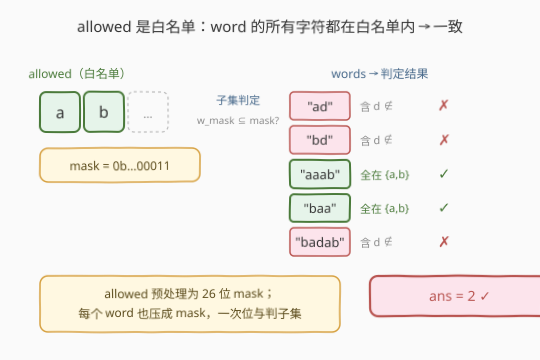
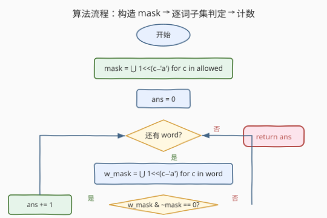
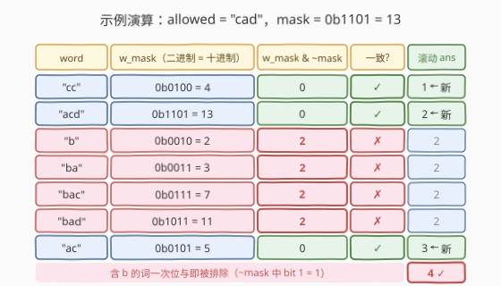

# 统计一致字符串的数目

- **题目名称**：统计一致字符串的数目
- **链接**：[1684. 统计一致字符串的数目](https://leetcode.cn/problems/count-the-number-of-consistent-strings/)
- **难度**：简单
- **标签**：位运算、哈希表、字符串

## 1. 题目概述

给你一个由**不同字符**组成的字符串 `allowed` 和一个字符串数组 `words`。如果某个字符串的**每一个字符**都在 `allowed` 中出现，就称它为**一致字符串**。返回 `words` 中一致字符串的数目。

**示例 1**：

```text
输入：allowed = "ab", words = ["ad","bd","aaab","baa","badab"]
输出：2
解释："aaab" 和 "baa" 是一致字符串，因为它们只含字符 'a' 和 'b'。
```

**示例 2**：

```text
输入：allowed = "abc", words = ["a","b","c","ab","ac","bc","abc"]
输出：7
解释：所有字符串都一致。
```

**示例 3**：

```text
输入：allowed = "cad", words = ["cc","acd","b","ba","bac","bad","ac","d"]
输出：4
解释："cc"、"acd"、"ac"、"d" 是一致字符串。
```

**约束条件**：

- $1 \leq \text{words.length} \leq 10^4$
- $1 \leq \text{allowed.length} \leq 26$
- $1 \leq \text{words}[i].\text{length} \leq 10$
- `allowed` 中的字符 **互不相同**
- `words[i]` 和 `allowed` 只包含小写英文字母

> 💡 **关键结构**：`allowed` 是一个**白名单集合**，判断每个 `word` 是否「所有字符都在白名单内」即「子集关系」——$\text{set}(\text{word}) \subseteq \text{set}(\text{allowed})$。题目本质是「集合包含判定 × 计数」。

---

## 2. 解题思路

### 2.1 暴力思路：对每个 word 逐字符扫描 allowed

最朴素做法：对每个 `word`，对其中每个字符 `c`，再线性扫描 `allowed` 查找是否存在。时间 $O(|\text{allowed}| \cdot \sum_i |\text{word}_i|)$，最坏 $26 \times 10^4 \times 10 \approx 2.6 \times 10^6$，虽然能过但常数大、思路差——`allowed` 在整个过程中不变，却被反复扫描。

### 2.2 核心观察：把 allowed 预处理为 O(1) 查询的「白名单」



`allowed` 在整个判定过程中**不变**，应预处理成 $O(1)$ 查询的结构。两种等价实现：

- **哈希集合**：`allowed_set = set(allowed)`，查 `c in allowed_set` 平均 $O(1)$。
- **位掩码**（更省）：26 位整数 `mask`，第 $i$ 位为 1 表示字符 `'a'+i` 在白名单中。查 `(mask >> (c - 'a')) & 1`。

判定一个 `word` 一致 ⟺ 它的**所有字符**都在白名单 ⟺ $\text{set}(\text{word}) \subseteq \text{set}(\text{allowed})$。

> 💡 **位掩码优势**：① 一个 `int` 即可表示完整白名单，常数小于哈希集合；② 整个 `word` 也可压缩成一个掩码 `w_mask`，判定 `w_mask & ~mask == 0`（即 `w_mask` 是 `mask` 的子集），无需逐字符查表，常数更优。

> ⚠️ `allowed` 中字符互不相同，故 `mask` 的各位不会重复置位；但 `word` 中字符可能重复，构造 `w_mask` 时按位 OR 天然去重，不影响子集判定。

### 2.3 算法流程图



1. **构造白名单**：`mask = 0`；对 `c` in `allowed`：`mask |= 1 << (c - 'a')`
2. **初始化** `ans = 0`
3. **遍历每个 `word`**：
   - 计算 `w_mask = 0`；对 `c` in `word`：`w_mask |= 1 << (c - 'a')`
   - 若 `w_mask & ~mask == 0`（即 `w_mask` 是 `mask` 的子集），则 `ans += 1`
4. **返回** `ans`

> 💡 子集判定等价写法：`(w_mask | mask) == mask` 或 `(w_mask & mask) == w_mask`，三者都表达「`w_mask` 的所有 1 位都在 `mask` 中」。

### 2.4 示例演算

以示例 3 `allowed = "cad", words = ["cc","acd","b","ba","bac","bad","ac","d"]` 为例：



`mask` 中置位的位：`a`(0)、`c`(2)、`d`(3)，即 $mask = 0b1101 = 13$。

| word | w_mask（二进制 = 十进制） | w_mask & ~mask | 一致? |
|------|---------------------------|----------------|-------|
| "cc"  | $0b0100 = 4$   | 0 | ✓ |
| "acd" | $0b1101 = 13$  | 0 | ✓ |
| "b"   | $0b0010 = 2$   | 2 | ✗ |
| "ba"  | $0b0011 = 3$   | 2 | ✗ |
| "bac" | $0b0111 = 7$   | 2 | ✗ |
| "bad" | $0b1011 = 11$  | 2 | ✗ |
| "ac"  | $0b0101 = 5$   | 0 | ✓ |
| "d"   | $0b1000 = 8$   | 0 | ✓ |

`ans = 4`。关键观察：`b` 不在白名单，故 `~mask` 的 bit 1 恒为 1，**任何含 `b` 的词**都被一次位与运算排除——这正是位掩码「整体判定」相对于「逐字符查表」的效率来源。

---

## 3. 参考代码

### Python（位掩码）

```python
class Solution:
    def countConsistentStrings(self, allowed: str, words: List[str]) -> int:
        mask = 0
        for c in allowed:
            mask |= 1 << (ord(c) - 97)

        ans = 0
        for w in words:
            w_mask = 0
            for c in w:
                w_mask |= 1 << (ord(c) - 97)
            if (w_mask & ~mask) == 0:    # w_mask 是 mask 的子集
                ans += 1
        return ans
```

### Python（集合，更直观）

```python
class Solution:
    def countConsistentStrings(self, allowed: str, words: List[str]) -> int:
        s = set(allowed)
        return sum(all(c in s for c in w) for w in words)
```

### C++（位掩码）

```cpp
class Solution {
public:
    int countConsistentStrings(string allowed, vector<string>& words) {
        int mask = 0;
        for (char c : allowed) mask |= 1 << (c - 'a');
        int ans = 0;
        for (const string& w : words) {
            int w_mask = 0;
            for (char c : w) w_mask |= 1 << (c - 'a');
            if ((w_mask & ~mask) == 0) ++ans;   // 子集判定
        }
        return ans;
    }
};
```

> 💡 **实现细节**：① 字符转位：`1 << (c - 'a')`，Python 用 `ord(c) - 97` 避免依赖字面量。② 子集判定 `(w_mask & ~mask) == 0` 等价于「`w_mask` 的所有置位都在 `mask` 中」。③ C++ 中 `~mask` 在 `int` 上会高位取反成负数，但与 `w_mask`（仅低 26 位）相与后高位为 0，结果非负，判定仍然正确；若担心可读性可改写 `(w_mask | mask) == mask`。

---

## 4. 复杂度分析

| 维度 | 复杂度 | 说明 |
|------|--------|------|
| 时间 | $O(|\text{allowed}| + \sum_i |\text{words}_i|)$ | 预处理 `mask` 一次 + 遍历所有 `word` 的所有字符一次；每字符 $O(1)$ 位运算 |
| 空间 | $O(1)$ | 仅 `mask`、`w_mask`、`ans` 三个整数；与输入规模无关 |

> 💡 约束下最大操作数约 $26 + 10^4 \times 10 \approx 10^5$，远低于时限。位掩码版相比哈希集合版常数更小（一次整数位与 vs 多次哈希查询），在大数据量下优势明显。

---

## 5. 扩展：早期剪枝与流式判定

**逐字符剪枝**：构造 `w_mask` 时若发现某个 `c` 不在 `mask` 中，可立即判定该词不一致并 `break`，无需扫描完整 `word`。平均情况下能跳过大量字符（尤其 `word` 较长时）：

```python
for w in words:
    ok = True
    for c in w:
        if not (mask >> (ord(c) - 97)) & 1:
            ok = False
            break
    if ok:
        ans += 1
```

**与子集判定的取舍**：子集判定需要完整构造 `w_mask`（遍历全词），但常数小（最后只一次位与）；逐字符剪枝可能提前终止，但每次都做移位 + 位与。当 `word` 很短（本题 $\leq 10$）且不一致词占比高时，剪枝略优；当词较长或绝大多数词一致时，子集判定更优。两者渐近复杂度相同，选哪个看数据分布。

**流式扩展**：若 `words` 是数据流（不能全部加载），逐词判定 + 计数天然支持，无需存储历史——这是「单遍扫描 + 滚动计数」的典型模式。

---

## 6. 面试要点

**Q1：为什么把 `allowed` 预处理成掩码而不是每次线性扫描？**
> `allowed` 在所有判定中不变，是典型的「可预处理不变量」。线性扫描每次 $O(|\text{allowed}|)$，预处理后查询 $O(1)$，整体由 $O(|\text{allowed}| \cdot \sum|w_i|)$ 降到 $O(|\text{allowed}| + \sum|w_i|)$。这是「空间换时间 + 预处理」的最朴素体现。

**Q2：子集判定 `(w_mask & ~mask) == 0` 的原理是什么？**
> `~mask` 的置位是 `mask` 中为 0 的位（即「不在白名单」的字符位）。`w_mask & ~mask` 提取出 `w_mask` 中那些「不在白名单」的位——若结果为 0，说明 `w_mask` 的所有置位都在 `mask` 中，即 $\text{set}(\text{word}) \subseteq \text{set}(\text{allowed})$。等价写法：`(w_mask | mask) == mask` 或 `(w_mask & mask) == w_mask`。

**Q3：`allowed` 字符互不相同这个条件用到了吗？如果允许重复呢？**
> 用到了——它保证 `mask` 构造时不会重复置位（虽然 `|=` 本身幂等，重复也无害）。若 `allowed` 允许重复字符，掩码法仍然正确（`|=` 幂等），集合法也正确（`set` 天然去重），无需修改；只是题目保证「互不相同」让约束更清晰，无需考虑去重逻辑。

**Q4：位掩码 vs 哈希集合，何时选哪个？**
> 字符集小且已知（如 26 个小写字母）→ 位掩码更省（一个 `int`）、更快（一次位与判定整词）；字符集大或动态（如 Unicode）→ 哈希集合更通用。位掩码的天花板是 64 位（`long long`）或 128 位（`bitset`），超过此范围必须用集合。

**Q5：如果 `words` 中词很长（如 $10^5$），子集判定还合适吗？**
> 仍合适——构造 `w_mask` 时按位 OR 天然去重，长词的掩码仍是 26 位整数，最终一次位与即判定。复杂度 $O(|w|)$ 来自遍历构造 `w_mask`，但若改用「逐字符查 `mask` + 早期剪枝」，可在首次发现非法字符时立即终止，平均更优。两者渐近相同，看数据分布选常数更小的。

> 💡 **一句话总结**：1684 把 `allowed` 压成 26 位掩码，每个 `word` 也压成掩码，一次 `w_mask & ~mask == 0` 判定子集关系，计数即可。$O(|\text{allowed}| + \sum|w_i|)$ 时间、$O(1)$ 空间，是「预处理不变量 + 位运算子集判定」的最小应用。

---

## 7. 同类练习题

- [1832. 判断句子是否为全字母句](https://leetcode.cn/problems/check-if-the-sentence-is-pangram/)：26 位掩码判定「是否所有字母都出现」，掩码构造方向相反（判全集而非子集）
- [771. 宝石与石](https://leetcode.cn/problems/jewels-and-stones/)：`jewels` 作白名单，统计 `stones` 中属于宝石的字符数，同样的「预处理白名单 + 逐字符查询」骨架
- [1165. 单行键盘](https://leetcode.cn/problems/single-row-keyboard/)：键盘字符串作布局，逐字符查位置并累加距离，预处理「字符→下标」映射
- [500. 键盘行](https://leetcode.cn/problems/keyboard-row/)：三行键盘各作一个白名单集合，判定单词是否完全属于某行，本题的多集合版
- [1528. 重新排列字符串](https://leetcode.cn/problems/shuffle-string/)：字符 → 位置映射 + 重排，练习字符级索引操作
