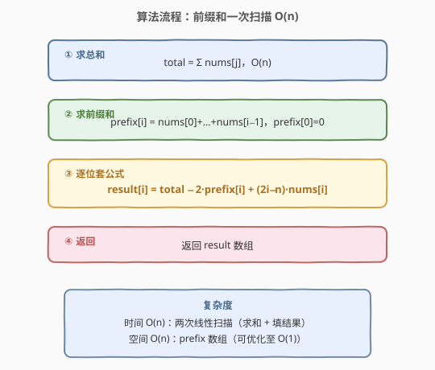

# 有序数组中差绝对值之和

- **题目名称**：有序数组中差绝对值之和
- **链接**：[1685. 有序数组中差绝对值之和](https://leetcode.cn/problems/sum-of-absolute-differences-in-a-sorted-array/)
- **难度**：中等
- **标签**：数组、前缀和、数学

## 1. 题目概述

给你一个 **非递减** 有序整数数组 `nums`。请建立并返回一个整数数组 `result`，它跟 `nums` 长度相同，且 `result[i]` 等于 `nums[i]` 与数组中所有其他元素差的绝对值之和：

$$\text{result}[i] = \sum_{j \neq i} |\text{nums}[i] - \text{nums}[j]|$$

**示例 1**：

```text
输入：nums = [2,3,5]
输出：[4,3,5]
解释：
result[0] = |2-2| + |2-3| + |2-5| = 0 + 1 + 3 = 4
result[1] = |3-2| + |3-3| + |3-5| = 1 + 0 + 2 = 3
result[2] = |5-2| + |5-3| + |5-5| = 3 + 2 + 0 = 5
```

**示例 2**：

```text
输入：nums = [1,4,6,8,10]
输出：[24,15,13,15,21]
```

**约束条件**：

- $2 \leq \text{nums.length} \leq 10^5$
- $1 \leq \text{nums}[i] \leq \text{nums}[i+1] \leq 10^4$

> 💡 **关键前提**：数组**有序**是本题的灵魂。无序数组求所有差绝对值之和只能 $O(n^2)$；有序性让我们能确定每一侧绝对值的正负方向，从而**去掉绝对值符号**，用前缀和在 $O(n)$ 内完成。

---

## 2. 解题思路

### 2.1 暴力思路

对每个 $i$，遍历所有 $j \neq i$ 累加 $|\text{nums}[i] - \text{nums}[j]|$。时间复杂度 $O(n^2)$，$n \leq 10^5$ 时约 $10^{10}$ 次运算，**超时**。

### 2.2 核心观察：有序性去掉绝对值

![核心观察：有序数组按 i 分裂，左侧 nums[j]≤nums[i] 绝对值展开为 nums[i]−nums[j]，右侧同理](../images/sada_split_concept.svg)

数组**非递减**，对位置 $i$：

- **左侧**（$j < i$）：$\text{nums}[j] \leq \text{nums}[i]$，故 $|\text{nums}[i] - \text{nums}[j]| = \text{nums}[i] - \text{nums}[j]$
- **右侧**（$j > i$）：$\text{nums}[j] \geq \text{nums}[i]$，故 $|\text{nums}[i] - \text{nums}[j]| = \text{nums}[j] - \text{nums}[i]$

绝对值符号被有序性消去后，求和可拆成「$\text{nums}[i]$ 的倍数」与「区间和」两部分：

$$\text{result}[i] = \underbrace{i \cdot \text{nums}[i] - \text{leftSum}}_{\text{左侧}} + \underbrace{\text{rightSum} - (n-1-i) \cdot \text{nums}[i]}_{\text{右侧}}$$

其中 $\text{leftSum} = \sum_{j<i} \text{nums}[j]$，$\text{rightSum} = \sum_{j>i} \text{nums}[j]$。

合并同类项，记 $\text{total} = \text{leftSum} + \text{nums}[i] + \text{rightSum}$，且 $\text{leftSum} = \text{prefix}[i]$（前缀和），$\text{rightSum} = \text{total} - \text{prefix}[i] - \text{nums}[i]$：

$$\boxed{\text{result}[i] = \text{total} - 2 \cdot \text{prefix}[i] + (2i - n) \cdot \text{nums}[i]}$$

> 💡 **直觉理解**：$\text{total} - 2 \cdot \text{prefix}[i]$ 是「右半和减左半和」（右侧元素 collectively 比 $\text{nums}[i]$ 大的贡献，减去左侧元素 collectively 比 $\text{nums}[i]$ 小的贡献），$(2i - n)$ 是「左侧个数减右侧个数」乘以 $\text{nums}[i]$ 的修正项。当 $i$ 在正中间时 $(2i - n) \approx 0$，结果最小，呈 **V 形**对称分布。

### 2.3 算法流程图



**步骤**：

1. **求总和**：$\text{total} = \sum_{j=0}^{n-1} \text{nums}[j]$，一次遍历 $O(n)$。
2. **求前缀和**：$\text{prefix}[0] = 0$，$\text{prefix}[i] = \text{prefix}[i-1] + \text{nums}[i-1]$，一次遍历 $O(n)$。
3. **逐位填结果**：对每个 $i$，套公式 $\text{result}[i] = \text{total} - 2 \cdot \text{prefix}[i] + (2i - n) \cdot \text{nums}[i]$，一次遍历 $O(n)$。

> ⚠️ **数据范围**：$n \leq 10^5$，$\text{nums}[i] \leq 10^4$，$\text{total} \leq 10^9$，$\text{result}[i] \leq n \times 10^4 = 10^9$。C++ `int` 上限约 $2.1 \times 10^9$，刚好不溢出，但建议用 `long long` 求和更稳妥；Python 无此顾虑。

### 2.4 示例演算

以 `nums = [1, 4, 6, 8, 10]`，$n = 5$，$\text{total} = 29$ 为例：

![示例演算：逐行展示 prefix[i]、2i−n、total−2·prefix[i]、result[i] 的计算过程](../images/sada_example_walkthrough.svg)

| $i$ | $\text{nums}[i]$ | $\text{prefix}[i]$ | $2i-n$ | $\text{total}-2\cdot\text{prefix}[i]$ | $(2i-n)\cdot\text{nums}[i]$ | $\text{result}[i]$ |
|-----|-------------------|---------------------|--------|----------------------------------------|------------------------------|---------------------|
| 0   | 1                 | 0                   | $-5$   | 29                                     | $-5$                         | $29-5 = 24$         |
| 1   | 4                 | 1                   | $-3$   | 27                                     | $-12$                        | $27-12 = 15$        |
| 2   | 6                 | 5                   | $-1$   | 19                                     | $-6$                         | $19-6 = 13$         |
| 3   | 8                 | 11                  | $1$    | 7                                      | $8$                          | $7+8 = 15$          |
| 4   | 10                | 19                  | $3$    | $-9$                                   | $30$                         | $-9+30 = 21$        |

验证 $i=2$（$\text{nums}[2]=6$）：左 $= |6-1|+|6-4| = 5+2 = 7$，右 $= |8-6|+|10-6| = 2+4 = 6$，$\text{result}[2] = 7+6 = 13$ ✓

> 💡 注意结果 $[24, 15, 13, 15, 21]$ 呈 **V 形**：中间最小，两端最大。这是因为越靠中间的元素，离所有其他元素越近，绝对值之和越小。

---

## 3. 参考代码

### Python

```python
class Solution:
    def getSumAbsoluteDifferences(self, nums: List[int]) -> List[int]:
        n = len(nums)
        total = sum(nums)
        result = []
        prefix = 0
        for i in range(n):
            result.append(total - 2 * prefix + (2 * i - n) * nums[i])
            prefix += nums[i]
        return result
```

### C++

```cpp
class Solution {
public:
    vector<int> getSumAbsoluteDifferences(vector<int>& nums) {
        int n = nums.size();
        long long total = accumulate(nums.begin(), nums.end(), 0LL);
        vector<int> result(n);
        long long prefix = 0;
        for (int i = 0; i < n; i++) {
            result[i] = total - 2 * prefix + (2LL * i - n) * nums[i];
            prefix += nums[i];
        }
        return result;
    }
};
```

> 💡 **实现细节**：① 用 `prefix` 变量滚动累加代替显式前缀和数组，空间降至 $O(1)$（输出数组不计）。② C++ 用 `long long` 中间量防溢出：`2LL * i - n` 在乘以 `nums[i]` 前先提升为 64 位，`total` 和 `prefix` 同理。③ Python 用 `sum()` 内建求总和，循环中边算边累加 `prefix`，无需额外数组。

---

## 4. 复杂度分析

| 维度 | 复杂度 | 说明 |
|------|--------|------|
| 时间 | $O(n)$ | 一次求和 + 一次填结果，共两次线性扫描 |
| 空间 | $O(1)$ | 仅用 `total`、`prefix` 两个滚动变量（输出数组不计额外空间） |

> ⚠️ 暴力法 $O(n^2)$ 在 $n = 10^5$ 时约 $10^{10}$ 次运算，必超时。前缀和将每位 $O(n)$ 的计算降为 $O(1)$，是本题从「超时」到「通过」的关键。

---

## 5. 扩展：相邻递推法

除了前缀和公式，还可以用**相邻结果递推**求解。观察相邻两位 $\text{result}[i]$ 与 $\text{result}[i+1]$ 的关系：

当从 $i$ 移到 $i+1$ 时，$\text{nums}[i]$ 从「右侧」变为「左侧」：

- 对 $i$ 位置：$\text{nums}[i]$ 与左侧 $i$ 个元素比较时为「大端」，与右侧 $n-1-i$ 个元素比较时为「小端」。
- 对 $i+1$ 位置：$\text{nums}[i]$ 变成左侧元素。

经推导可得递推关系：

$$\text{result}[i+1] = \text{result}[i] + (2i + 2 - n) \cdot (\text{nums}[i+1] - \text{nums}[i])$$

先用暴力算 $\text{result}[0] = \text{total} - n \cdot \text{nums}[0]$（首位所有元素都 $\geq \text{nums}[0]$，无需前缀和），再逐位递推：

```python
class Solution:
    def getSumAbsoluteDifferences(self, nums: List[int]) -> List[int]:
        n = len(nums)
        total = sum(nums)
        result = [0] * n
        result[0] = total - n * nums[0]
        for i in range(1, n):
            result[i] = result[i - 1] + (2 * i - n) * (nums[i] - nums[i - 1])
        return result
```

时间 $O(n)$，空间 $O(1)$，与公式法等价但思路不同——公式法是「每位独立计算」，递推法是「利用相邻关系传递」。

---

## 6. 面试要点

1. **为什么有序性是关键？无序数组能这样做吗？**

   > 有序性保证了 $j < i$ 时 $\text{nums}[j] \leq \text{nums}[i]$，从而 $|\text{nums}[i] - \text{nums}[j]| = \text{nums}[i] - \text{nums}[j]$，去掉绝对值后才能拆成「倍数项 + 区间和」用前缀和 $O(1)$ 计算。无序数组无法确定每一侧的正负方向，只能逐对计算 $O(n^2)$，或排序后 $O(n \log n)$（但排序会改变下标对应关系，除非题目只要求返回值集合）。

2. **公式 $\text{result}[i] = \text{total} - 2 \cdot \text{prefix}[i] + (2i - n) \cdot \text{nums}[i]$ 各项含义？**

   > $\text{total} - 2 \cdot \text{prefix}[i]$：$\text{rightSum} - \text{leftSum}$，即右侧总和减左侧总和（不含 $\text{nums}[i]$ 自身，因 $\text{total} - \text{leftSum} - \text{nums}[i] = \text{rightSum}$，$\text{total} - 2\cdot\text{leftSum} = \text{rightSum} - \text{leftSum} + \text{nums}[i] - \text{nums}[i]$，化简后 $\text{nums}[i]$ 抵消）。$(2i - n) \cdot \text{nums}[i]$：左侧元素个数 $i$ 减右侧元素个数 $n - 1 - i$，即 $2i - n + 1$，但 $\text{nums}[i]$ 自身项 $\text{total}$ 中已含一次 $\text{nums}[i]$，最终修正项为 $(2i - n) \cdot \text{nums}[i]$。

3. **结果为什么呈 V 形对称？**

   > 越靠中间的元素，离所有其他元素越近，绝对值之和越小。极端情况：若所有元素相等，$\text{result}[i] = 0$。若元素严格递增，中间位置 $i \approx n/2$ 时 $(2i - n) \approx 0$，修正项最小，且 $\text{total} - 2 \cdot \text{prefix}[i]$ 在中点附近也接近最小（前缀和约等于总和一半）。

4. **如何优化空间到 $O(1)$？**

   > 不显式存储前缀和数组，用一个 `prefix` 变量在遍历时滚动累加：计算 $\text{result}[i]$ 时 `prefix` = $\text{nums}[0] + \cdots + \text{nums}[i-1]$，算完后 `prefix += nums[i]`。输出数组不计入额外空间。

5. **本题与 238. 除自身以外的数组之积 的异同？**

   > 同：都是对每位计算「除自身外所有元素的聚合」，都用前缀/后缀思想把 $O(n^2)$ 降为 $O(n)$。异：238 是**乘积**（左积 × 右积），用前缀积与后缀积相乘；本题是**绝对值之和**，依赖有序性去绝对值后用前缀和。238 数组无需有序，本题必须有序。

> 💡 **一句话总结**：有序数组去绝对值 → 左侧 $\text{nums}[i] - \text{nums}[j]$、右侧 $\text{nums}[j] - \text{nums}[i]$ → 拆成倍数项 + 区间和 → 前缀和 $O(1)$ 查询 → 公式 $\text{result}[i] = \text{total} - 2\cdot\text{prefix}[i] + (2i - n)\cdot\text{nums}[i]$，总 $O(n)$ 时间 $O(1)$ 空间。

---

## 7. 同类练习题

- [238. 除自身以外数组的乘积](https://leetcode.cn/problems/product-of-array-except-self/)（[题解](../0201-0300/238_除自身以外数组的乘积.md)）：同「除自身外聚合」结构，前缀积 × 后缀积，对比前缀和的加法版本
- [303. 区域和检索 - 数组不可变](https://leetcode.cn/problems/range-sum-query-immutable/)（[题解](../0301-0400/303_区域和检索-数组不可变.md)）：前缀和基础模板，巩固 $\text{sum}(l, r) = \text{prefix}[r+1] - \text{prefix}[l]$ 的用法
- [528. 按权重随机选择](https://leetcode.cn/problems/random-pick-with-weight/)（[题解](../0501-0600/528_按权重随机选择.md)）：前缀和 + 二分查找，前缀和的另一经典应用场景
- [2602. 使数组元素全部相等的最少操作次数](https://leetcode.cn/problems/minimum-operations-to-make-all-array-elements-equal/)：排序 + 前缀和 + 二分，同样是「有序数组 + 绝对值之和」的套路
- [3427. 将数组变更为非递减](https://leetcode.cn/problems/make-array-non-decreasing/)：前缀和变体应用，练习前缀和的灵活运用
