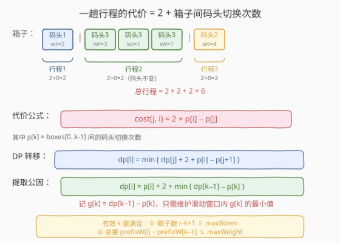
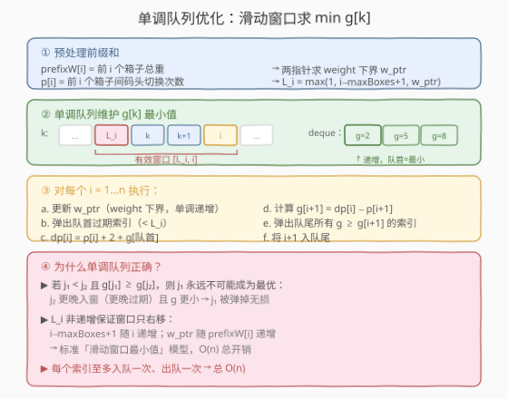
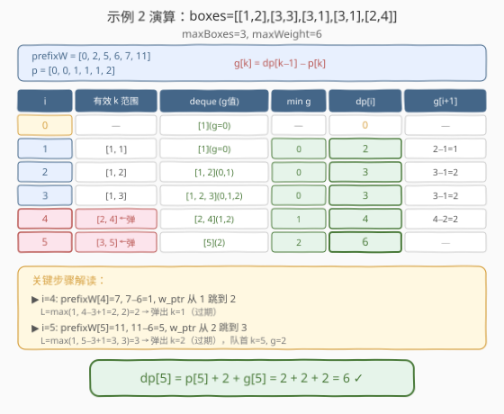

# LeetCode 从仓库到码头运输箱子 题解

## 1. 题目概述

- **标题 / 题号**：从仓库到码头运输箱子（#1687，hard）
- **链接**：https://leetcode.cn/problems/delivering-boxes-from-storage-to-ports/
- **难度**：困难
- **标签**：动态规划、单调队列、滑动窗口、前缀和

**题意**：有一辆货运卡车，需要按**数组顺序**将 `n` 个箱子从仓库运送到码头。每趟运输受**箱子数** `maxBoxes` 和**总重量** `maxWeight` 双重限制。箱子 `boxes[i] = [ports_i, weight_i]`，其中 `ports_i` 为目标码头、`weight_i` 为重量。

每趟行程的代价计算规则：

1. 卡车从仓库装上若干箱子（按序取，不超限）。
2. 按顺序送达：卡车到最前面箱子的码头卸货，若已在同一码头则无需额外行程。
3. 所有箱子卸完后，卡车空驶返回仓库（1 趟行程）。
4. 全部送完后卡车必须停在仓库。

**示例 1**：

```text
输入：boxes = [[1,1],[2,1],[1,1]], portsCount = 2, maxBoxes = 3, maxWeight = 3
输出：4
解释：一趟运完 3 个箱子。仓库→码头1→码头2→码头1→仓库 = 4 趟行程。
```

**示例 2**：

```text
输入：boxes = [[1,2],[3,3],[3,1],[3,1],[2,4]], portsCount = 3, maxBoxes = 3, maxWeight = 6
输出：6
解释：分 3 趟：[箱0]→2趟, [箱1,2,3]→2趟, [箱4]→2趟, 共 6。
```

**示例 4**：

```text
输入：boxes = [[2,4],[2,5],[3,1],[3,2],[3,7],[3,1],[4,4],[1,3],[5,2]], portsCount = 5, maxBoxes = 5, maxWeight = 7
输出：14
解释：分 6 趟：2+2+2+2+3+3 = 14。
```

**约束**：

- $1 \le \text{boxes.length} \le 10^5$
- $1 \le \text{portsCount}, \text{maxBoxes}, \text{maxWeight} \le 10^5$
- $1 \le \text{ports}_i \le \text{portsCount}$
- $1 \le \text{weight}_i \le \text{maxWeight}$

> ⚠️ **关键信号**：$n \le 10^5$ 意味着 $O(n^2)$ DP 必超时，需要用**单调队列**将转移优化到 $O(n)$。代价公式可拆为「常数 + 前缀差」，使得 `min` 可提取为滑动窗口极值——这是优化的突破口。

## 2. 解题思路

### 2.1 暴力思路：枚举每趟的起点

定义 `dp[i]` = 运送前 `i` 个箱子的最少行程数。转移时枚举最后一趟运送箱子 `j+1..i`（`j` 从 `i-1` 往前枚举到合法边界），代价为该趟的行程数：

$$dp[i] = \min_{j} \big\{ dp[j] + \text{cost}(j+1,\, i) \big\}$$

每趟的代价 = 从仓库出发（1 趟）+ 箱子间码头切换次数 + 返回仓库（1 趟）= $2 + \text{boxes}[j+1..i]$ 内相邻码头不同的次数。

但 $n \le 10^5$，$O(n^2)$ 枚举每个 $j$ 必然超时，需要利用代价的结构性来优化。

### 2.2 核心观察：代价拆分为前缀差，min 提取为滑动窗口极值



**代价公式化**：定义 $p[k]$ 为前 $k$ 个箱子间的码头切换次数（$p[0]=p[1]=0$，$p[k] = p[k-1] + [\text{port}_k \ne \text{port}_{k-1}]$）。则一趟运送箱子 $k..i$ 的代价为：

$$\text{cost}(k, i) = 2 + p[i] - p[k]$$

**DP 重写**：将 $j+1$ 换元为 $k$，转移变为：

$$dp[i] = \min_{k} \big\{ dp[k-1] + 2 + p[i] - p[k] \big\} = p[i] + 2 + \min_{k}\big\{ \underbrace{dp[k-1] - p[k]}_{g[k]} \big\}$$

> 💡 **关键转化**：$p[i] + 2$ 与 $k$ 无关，可提取到 $\min$ 外。只需维护滑动窗口内 $g[k] = dp[k-1] - p[k]$ 的最小值。这是一个标准的**滑动窗口最小值**问题，可用单调队列 $O(n)$ 解决。

**有效 $k$ 的范围**：$k$ 需满足两个约束——

| 约束 | 条件 | 下界 |
|------|------|------|
| 箱子数 | $i - k + 1 \le \text{maxBoxes}$ | $k \ge i - \text{maxBoxes} + 1$ |
| 总重量 | $\text{prefixW}[i] - \text{prefixW}[k-1] \le \text{maxWeight}$ | $k \ge w_i$（二分/两指针求） |

因此 $L_i = \max(1,\; i - \text{maxBoxes} + 1,\; w_i)$，且 $L_i$ **随 $i$ 单调递增**（两项都是递增的），满足滑动窗口条件。

### 2.3 算法流程图



**阶段一：预处理**

1. 计算 `prefixW[i]`（前 $i$ 个箱子总重）和 `p[i]`（前 $i$ 个箱子间码头切换次数）。
2. 初始化 $dp[0] = 0$，$g[1] = dp[0] - p[1] = 0$，单调队列 `deque = [1]`。

**阶段二：递推**

对 $i = 1, 2, \ldots, n$：

1. **更新 weight 下界**：两指针 `w_ptr` 前移直到 `prefixW[w_ptr - 1] >= prefixW[i] - maxWeight`。
2. **计算窗口左界**：$L_i = \max(1,\; i - \text{maxBoxes} + 1,\; \text{w\_ptr})$。
3. **弹出队首过期索引**：`while deque.front() < L_i: pop_front()`。
4. **转移**：$dp[i] = p[i] + 2 + g[\text{deque.front()}]$。
5. **入队**：若 $i < n$，计算 $g[i+1] = dp[i] - p[i+1]$，弹出队尾所有 $g \ge g[i+1]$ 的索引，将 $i+1$ 入队尾。

> 💡 **单调队列正确性**：若 $j_1 < j_2$ 且 $g[j_1] \ge g[j_2]$，则 $j_1$ 永远不可能成为最优——$j_2$ 更晚过期（窗口右移才过期）且 $g$ 更小。故弹出 $g$ 大的旧索引无损。每个索引至多入队、出队各一次，总 $O(n)$。

### 2.4 示例演算

以示例 2 为例：`boxes = [[1,2],[3,3],[3,1],[3,1],[2,4]]`, `maxBoxes=3`, `maxWeight=6`。



**预处理**：
- `prefixW = [0, 2, 5, 6, 7, 11]`
- `p = [0, 0, 1, 1, 1, 2]`（码头切换：1→3 计 1 次，3→3 不计，3→3 不计，3→2 计 1 次）

**逐步推导**：

| 步 | $i$ | $L_i$ | deque (g值) | min $g$ | $dp[i]$ | $g[i+1]$ | 说明 |
|----|-----|--------|-------------|---------|---------|-----------|------|
| ① | 1 | 1 | [1](0) | 0 | $0+2+0=2$ | $2-1=1$ | 单箱，2 趟 |
| ② | 2 | 1 | [1, 2](0, 1) | 0 | $1+2+0=3$ | $3-1=2$ | 合并 2 箱更优 |
| ③ | 3 | 1 | [1, 2, 3](0, 1, 2) | 0 | $1+2+0=3$ | $3-1=2$ | 3 箱同码头3，2 趟 |
| ④ | 4 | 2 | [2, 4](1, 2) | 1 | $1+2+1=4$ | $4-2=2$ | $w\_ptr$ 跳到 2，弹 k=1 |
| ⑤ | 5 | 3 | [5](2) | 2 | $2+2+2=6$ | — | $w\_ptr$ 跳到 3，弹 k=2 |

> 💡 **步骤④关键**：`prefixW[4]=7`，`7 - 6 = 1`，`w_ptr` 从 1 跳到 2（因为 `prefixW[0]=0 < 1` 但 `prefixW[1]=2 >= 1`）。同时 `i - maxBoxes + 1 = 4 - 3 + 1 = 2`。所以 $L_4 = 2$，弹出 $k=1$。队首变为 $k=2$, $g=1$，`dp[4] = 1 + 2 + 1 = 4`。

> 💡 **步骤⑤关键**：`prefixW[5]=11`，`11 - 6 = 5`，`w_ptr` 跳到 3（`prefixW[2]=5 >= 5`）。$L_5 = 3$，弹出 $k=2$。队首 $k=5$, $g=2$，`dp[5] = 2 + 2 + 2 = 6`。✓

## 3. 参考代码

### Python

```python
from collections import deque
from typing import List

class Solution:
    def boxDelivering(self, boxes: List[List[int]], portsCount: int,
                      maxBoxes: int, maxWeight: int) -> int:
        n = len(boxes)
        # 前缀和：prefixW[i] = 前 i 个箱子总重
        prefixW = [0] * (n + 1)
        for i in range(n):
            prefixW[i + 1] = prefixW[i] + boxes[i][1]
        # p[i] = 前 i 个箱子间码头切换次数
        p = [0] * (n + 1)
        for i in range(2, n + 1):
            p[i] = p[i - 1] + (1 if boxes[i - 1][0] != boxes[i - 2][0] else 0)

        dp = [0] * (n + 1)
        dq = deque([1])          # 队列存索引 k，g[k] 递增
        w_ptr = 1                # weight 下界两指针

        for i in range(1, n + 1):
            # 更新 weight 下界
            target = prefixW[i] - maxWeight
            while w_ptr <= i and prefixW[w_ptr - 1] < target:
                w_ptr += 1
            L = max(1, i - maxBoxes + 1, w_ptr)

            # 弹出队首过期索引
            while dq and dq[0] < L:
                dq.popleft()

            # 转移
            k = dq[0]
            dp[i] = p[i] + 2 + dp[k - 1] - p[k]

            # 入队 i+1
            if i < n:
                g_new = dp[i] - p[i + 1]
                while dq and dp[dq[-1] - 1] - p[dq[-1]] >= g_new:
                    dq.pop()
                dq.append(i + 1)

        return dp[n]
```

### C++

```cpp
// 1687. 从仓库到码头运输箱子.cpp —— DP + 单调队列优化 O(n)
// 编译: g++ -O2 -std=c++17 1687.cpp -o deliver
class Solution {
public:
    int boxDelivering(vector<vector<int>>& boxes, int portsCount,
                      int maxBoxes, int maxWeight) {
        int n = boxes.size();
        vector<long long> prefixW(n + 1, 0);
        for (int i = 0; i < n; i++)
            prefixW[i + 1] = prefixW[i] + boxes[i][1];

        vector<int> p(n + 1, 0);
        for (int i = 2; i <= n; i++)
            p[i] = p[i - 1] + (boxes[i - 1][0] != boxes[i - 2][0] ? 1 : 0);

        vector<int> dp(n + 1, 0);
        deque<int> dq;
        dq.push_back(1);                    // k=1, g[1]=dp[0]-p[1]=0
        int w_ptr = 1;

        for (int i = 1; i <= n; i++) {
            long long target = prefixW[i] - maxWeight;
            while (w_ptr <= i && prefixW[w_ptr - 1] < target)
                w_ptr++;
            int L = max({1, i - maxBoxes + 1, w_ptr});

            while (!dq.empty() && dq.front() < L)
                dq.pop_front();

            int k = dq.front();
            dp[i] = p[i] + 2 + dp[k - 1] - p[k];

            if (i < n) {
                int g_new = dp[i] - p[i + 1];
                while (!dq.empty() && dp[dq.back() - 1] - p[dq.back()] >= g_new)
                    dq.pop_back();
                dq.push_back(i + 1);
            }
        }
        return dp[n];
    }
};
```

> 💡 **实现细节**：
> - **`prefixW` 用 `long long`**：$n \le 10^5$，$w_i \le 10^5$，总重可达 $10^{10}$，超出 `int` 范围。C++ 中必须用 `long long`；Python 天然无溢出。
> - **两指针替代二分**：`w_ptr` 随 `prefixW[i]` 单调递增，用 while 循环前移即可，无需每步二分。总移动量 $\le n$，均摊 $O(1)$。
> - **`g` 不显式存储**：$g[k] = dp[k-1] - p[k]$，比较时直接用 `dp[dq.back()-1] - p[dq.back()]` 在线计算，省去额外数组。
> - **队列存索引而非值**：弹队首时需判断索引是否过期（$< L_i$），存索引才能做范围检查。

## 4. 复杂度分析

| 维度 | 复杂度 | 说明 |
|------|--------|------|
| **时间** | $O(n)$ | 预处理 $O(n)$；主循环 $n$ 步，每步均摊 $O(1)$（两指针 + 队列入出各至多 $n$ 次） |
| **空间** | $O(n)$ | `prefixW`、`p`、`dp` 三个 $O(n)$ 数组 + 单调队列 $O(n)$ |
| **常数** | 中等 | 3 个数组 + deque，内存访问友好 |

> ⚠️ $n \le 10^5$，$O(n)$ 远低于时限。若用 $O(n^2)$ 暴力 DP 或 $O(n \log n)$ 线段树均可 AC，但单调队列是最优解。线段树写法思路相同（查询区间 $[L_i, i]$ 的 $g$ 最小值），但常数大 $\log$ 倍且代码更长。

## 5. 扩展：线段树解法

单调队列要求窗口左界 $L_i$ 单调递增。若问题变形导致 $L_i$ 非单调（如允许箱子非顺序选取），则需用**线段树**维护 $g[k]$ 的区间最小值，查询 $[L_i, i]$ 的 $\min$，更新 $g[i+1]$ 为单点修改。

线段树写法：
- `query(L, i)`：返回 $g$ 在 $[L, i]$ 的最小值。
- `update(i+1, g[i+1])`：单点赋值。

时间 $O(n \log n)$，空间 $O(n)$。优点是对 $L_i$ 无单调性要求，适用范围更广。本题中 $L_i$ 天然单调，单调队列更优。

> 💡 **同端口压缩优化**（可选）：若连续多个箱子去同一码头，则这些位置的 $g[k]$ 递增（$p$ 不变、$dp$ 递增），队列中只会保留第一个。可跳过中间箱子的入队操作，进一步减少常数，但渐近复杂度不变。

## 6. 面试要点

1. **一趟行程的代价如何计算？**

   > $2 + $ 箱子间码头切换次数。其中 2 = 从仓库到第一个码头（1 趟）+ 最后一个码头返回仓库（1 趟）。中间相邻箱子若码头不同则各加 1 趟。用前缀和 $p[i]$ 编码切换次数后，代价 $= 2 + p[i] - p[k]$（$k$ 为本趟起始箱子）。

2. **为什么能把 $\min$ 提取到外面？**

   > 代价 $dp[k-1] + 2 + p[i] - p[k]$ 中，$p[i] + 2$ 与 $k$ 无关，可提出。剩余 $dp[k-1] - p[k] = g[k]$ 只与 $k$ 有关。因此 $dp[i] = p[i] + 2 + \min_k g[k]$，把对 $k$ 的依赖压缩为「窗口内 $g$ 的最小值」这一标量查询。

3. **单调队列为什么正确？窗口左界 $L_i$ 一定单调递增吗？**

   > $L_i = \max(1,\; i - \text{maxBoxes}+1,\; w_i)$。第一项常数；第二项随 $i$ 递增；$w_i$ 是满足 `prefixW[k-1] >= prefixW[i] - maxWeight` 的最小 $k$，因 `prefixW` 单调递增故 $w_i$ 也单调递增。三项的 max 自然递增。满足滑动窗口条件后，单调队列维护「$g$ 值递增的索引序列」即可——队首即最小，弹尾即去冗余。

4. **为什么用两指针而不是二分求 $w_i$？**

   > $w_i$ 单调递增，用 `w_ptr` 指针前移即可。每步前移总量 $\le n$，均摊 $O(1)$。二分虽也 $O(\log n)$，但常数更大且不如两指针直观。两指针的关键前提是 `prefixW` 单调——本题中重量均为正，天然满足。

5. **若 `maxBoxes` 或 `maxWeight` 极小（如 1），算法是否退化？**

   > 不退化。每个箱子单独一趟时，窗口大小为 1（$L_i = i$），单调队列退化为单元素，$dp[i] = p[i] + 2 + g[i] = p[i] + 2 + dp[i-1] - p[i] = dp[i-1] + 2$。仍 $O(n)$，每步常数操作。

> 💡 **一句话总结**：1687 的核心是把 DP 转移中的代价拆为「前缀差 + 常数」，提取 $\min$ 后转化为滑动窗口最小值，用单调队列 $O(n)$ 解决。关键洞察：$g[k] = dp[k-1] - p[k]$ 与 $k$ 无关的 $p[i]+2$ 分离，窗口左界 $L_i$ 由箱子数和重量双重约束决定且单调递增。

## 同类练习题

| # | 题目 | 与本题的关联 |
|---|------|-------------|
| 1425 | [带限制的子序列和](https://leetcode.cn/problems/constrained-subsequence-sum/)（[题解](../1401-1500/1425_带限制的子序列和.md)） | DP + 单调队列优化，`dp[i] = max(dp[j]) + nums[i]`（$j \in [i-k, i-1]$），与本题同为「滑动窗口极值优化 DP」的招牌题 |
| 239 | [滑动窗口最大值](https://leetcode.cn/problems/sliding-window-maximum/)（[题解](../0201-0300/239_滑动窗口最大值.md)） | 单调队列模板题，理解「弹尾去冗余、弹首去过期」的机制，是本题优化的基础 |
| 1499 | [满足不等式的最大值](https://leetcode.cn/problems/max-value-of-equation/)（[题解](../1401-1500/1499_满足不等式的最大值.md)） | 单调队列优化，将双变量最值转化为滑动窗口极值，与本题「提取公因后求 min」思路一致 |
| 1011 | [在 D 天内送达包裹的能力](https://leetcode.cn/problems/capacity-to-ship-packages-within-d-days/)（[题解](../1001-1100/1011_在D天内送达包裹的能力.md)） | 同为「箱子/包裹运输」主题，但用二分答案 + 贪心验证，对比理解「DP 优化」与「二分答案」两种范式 |
| 410 | [分割数组的最大值](https://leetcode.cn/problems/split-array-largest-sum/)（[题解](../0401-0500/410_分割数组的最大值.md)） | 二分答案 + 贪心划分，与 1011 同模板，可作为「运输问题」的对比练习 |
