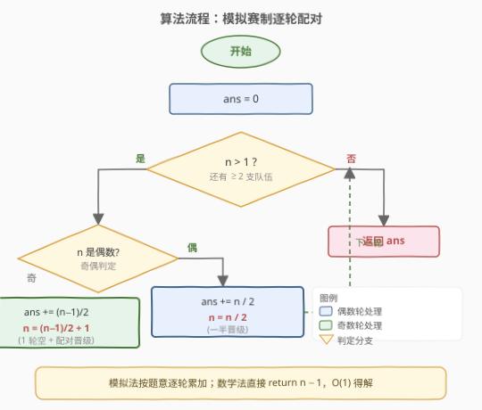
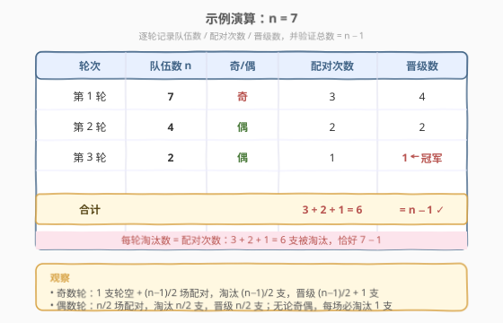

# 比赛中的配对次数

- **题目名称**：比赛中的配对次数
- **链接**：[1688. 比赛中的配对次数](https://leetcode.cn/problems/count-of-matches-in-tournament/)
- **难度**：简单
- **标签**：数学、模拟

## 1. 题目概述

给你一个整数 `n`，表示比赛中的队伍数。比赛遵循一种独特的赛制：

- 若当前队伍数是**偶数**，每支队伍与另一支配对，共进行 `n / 2` 场比赛，产生 `n / 2` 支队伍进入下一轮；
- 若当前队伍数为**奇数**，随机轮空并晋级 1 支队伍，其余队伍配对，共进行 `(n - 1) / 2` 场比赛，产生 `(n - 1) / 2 + 1` 支队伍进入下一轮。

返回在比赛中进行的**配对次数**，直到决出获胜队伍为止。

**示例 1**：

```text
输入：n = 7
输出：6
解释：
- 第 1 轮：队伍数 = 7，配对次数 = 3，4 支晋级。
- 第 2 轮：队伍数 = 4，配对次数 = 2，2 支晋级。
- 第 3 轮：队伍数 = 2，配对次数 = 1，决出 1 支获胜队伍。
总配对次数 = 3 + 2 + 1 = 6
```

**示例 2**：

```text
输入：n = 14
输出：13
解释：
- 第 1 轮：队伍数 = 14，配对次数 = 7，7 支晋级。
- 第 2 轮：队伍数 = 7，配对次数 = 3，4 支晋级。
- 第 3 轮：队伍数 = 4，配对次数 = 2，2 支晋级。
- 第 4 轮：队伍数 = 2，配对次数 = 1，决出 1 支获胜队伍。
总配对次数 = 7 + 3 + 2 + 1 = 13
```

**约束条件**：

- $1 \leq n \leq 200$

> 💡 **关键结构**：每进行一场比赛，必有一支队伍被淘汰。从 $n$ 支队伍到 1 个冠军，要淘汰 $n-1$ 支——这就是答案的本质。

---

## 2. 解题思路

### 2.1 暴力思路：模拟赛制逐轮配对

最直接的做法是**严格按题意模拟**：维护当前队伍数 `n` 与累计比赛数 `ans`，只要 `n > 1` 就按奇偶分支更新——偶数则 `ans += n/2, n = n/2`；奇数则 `ans += (n-1)/2, n = (n-1)/2 + 1`。逻辑清晰、与题面一一对应，是容易想到的保底解法。

由于每轮 `n` 至少减半（偶数直接折半；奇数 `(n-1)/2 + 1` 也近似折半），轮数只有 $O(\log n)$，模拟完全够用。

### 2.2 核心观察：每场淘汰一队 → 答案恒为 $n-1$


跳出"逐轮累加"的视角，抓住一个**贯穿全程的不变量**：

> **每进行一场比赛，恰好淘汰一支队伍。**

- 偶数轮：`n/2` 场比赛淘汰 `n/2` 支，剩下 `n/2` 支；
- 奇数轮：`(n-1)/2` 场比赛淘汰 `(n-1)/2` 支，加上 1 支轮空，剩下 `(n-1)/2 + 1` 支。

无论奇偶，**比赛场数 ≡ 被淘汰队伍数**。而要从 $n$ 支队伍决出 1 个冠军，必须淘汰 $n - 1$ 支。因此：

$$
\text{比赛场数} = \text{被淘汰队伍数} = n - 1
$$

> ⚠️ **为什么奇偶规则不影响总量？** 奇偶分支只决定"这一轮淘汰几支、晋级几支"的分配方式，但**每一支被淘汰的队伍都对应恰好一场比赛**这一对应关系永远成立。轮空只是"暂不淘汰"，并不改变最终需要淘汰的总数。因此总场数被初始队伍数 $n$ 与终局队伍数 $1$ 唯一确定，与中途如何分组无关。

### 2.3 算法流程图



模拟法的流程如上：初始化 `ans = 0`，循环判断 `n > 1`，按奇偶分支累加并更新 `n`，直到只剩 1 支队伍返回 `ans`。而数学法直接 `return n - 1`，一步到位。

### 2.4 示例演算



以 `n = 7`（示例 1）为例，逐轮记录：

| 轮次 | 队伍数 $n$ | 奇/偶 | 配对次数 | 晋级数 |
|------|-----------|-------|---------|--------|
| 1 | 7 | 奇 | 3 | 4 |
| 2 | 4 | 偶 | 2 | 2 |
| 3 | 2 | 偶 | 1 | 1 ← 冠军 |
| **合计** | | | **3 + 2 + 1 = 6** | **= 7 − 1 ✓** |

每轮淘汰数 = 配对次数，累计淘汰 $3 + 2 + 1 = 6 = 7 - 1$，与"淘汰 $n-1$ 支"的论证吻合。

---

## 3. 参考代码

### C++（数学法，$O(1)$）

```cpp
class Solution {
public:
    int numberOfMatches(int n) {
        return n - 1;
    }
};
```

### C++（模拟法，与流程图对照）

```cpp
class Solution {
public:
    int numberOfMatches(int n) {
        int ans = 0;
        while (n > 1) {
            if (n % 2 == 0) {
                ans += n / 2;
                n = n / 2;
            } else {
                ans += (n - 1) / 2;
                n = (n - 1) / 2 + 1;
            }
        }
        return ans;
    }
};
```

### Python

```python
class Solution:
    def numberOfMatches(self, n: int) -> int:
        return n - 1
```

### Python（模拟法）

```python
class Solution:
    def numberOfMatches(self, n: int) -> int:
        ans = 0
        while n > 1:
            if n % 2 == 0:
                ans += n // 2
                n = n // 2
            else:
                ans += (n - 1) // 2
                n = (n - 1) // 2 + 1
        return ans
```

> 💡 **面试建议**：先口述模拟法证明你读懂了题意，再点出"每场淘汰一队"的不变量引出 `n - 1`，体现从模拟到数学的优化思维。直接写 `return n - 1` 而不讲清楚不变量，面试官可能认为你只是背了答案。

---

## 4. 复杂度分析

| 维度 | 复杂度 | 说明 |
|------|--------|------|
| 时间复杂度（数学法） | $O(1)$ | 一次减法返回，与 $n$ 无关 |
| 时间复杂度（模拟法） | $O(\log n)$ | 每轮 $n$ 近似折半，轮数为 $\lfloor \log_2 n \rfloor + 1$ |
| 空间复杂度 | $O(1)$ | 仅用 `ans`、`n` 两个整型变量 |

> 💡 对 $n \le 200$ 的约束，模拟法至多约 8 轮，两种方法都远超够用门槛。数学法的优势在于把 $O(\log n)$ 降到 $O(1)$，并揭示了问题的本质结构。

---

## 5. 扩展：不变量思维与"总数守恒"

本题是**不变量思维**的典型范例：与其追踪过程的每一步（逐轮累加），不如找一个在过程中保持恒定的对应关系。

- **对应关系**：1 场比赛 ↔ 1 支淘汰队伍；
- **守恒量**：被淘汰队伍总数 = 初始队伍数 − 终局队伍数 = $n - 1$；
- **结论**：总场数由首尾状态唯一决定，与中间过程无关。

类似"总数守恒"的思路在很多题目中出现：只要能找到"每个操作固定消耗/产生 1 个单位"的对应关系，答案就可由首尾状态直接给出，无需模拟过程。例如 [292. Nim 游戏](https://leetcode.cn/problems/nim-game/)（每轮取 1~3 块，对手必胜边界由总数模 4 决定）、[319. 灯泡开关](https://leetcode.cn/problems/bulb-switcher/)（只有平方数位置被切换奇数次，答案为 $\lfloor\sqrt{n}\rfloor$），都是跳出模拟、寻找不变量的代表。

---

## 6. 面试要点

**Q1：为什么答案是 $n - 1$ 而不是逐轮模拟？**
> 每场比赛恰好淘汰一支队伍，这是个贯穿全程的不变量。从 $n$ 支队伍到 1 个冠军必须淘汰 $n - 1$ 支，每支淘汰对应一场比赛，故总场数 = $n - 1$。奇偶规则只影响每轮的分配，不改变总淘汰数。

**Q2：模拟法和数学法分别是什么复杂度？**
> 模拟法每轮 $n$ 近似折半，轮数 $O(\log n)$，空间 $O(1)$；数学法一次减法，时间 $O(1)$，空间 $O(1)$。对 $n \le 200$ 二者都极快，但数学法揭示了问题本质。

**Q3：奇数轮的"轮空"会不会影响总场数？**
> 不会。轮空只是让一支队伍暂时不参赛、不被淘汰，但它最终仍要在后续某轮通过比赛被淘汰（或成为冠军）。每一支被淘汰的队伍都对应恰好一场比赛，这一对应关系与是否有轮空无关。

**Q4：如果赛制改成"每场淘汰 2 支"（如三人赛取第一名），答案怎么变？**
> 此时每场比赛淘汰 2 支，要淘汰 $n - 1$ 支，需 $\lceil (n-1)/2 \rceil$ 场（最后可能剩 2 支时一场决出冠军淘汰 1 支需单独处理）。关键仍是先定"每场淘汰几支"的对应关系，再用总数守恒推答案。

**Q5：面试时该先写哪个解法？**
> 先口述模拟法（证明读懂题意、能落地），再点出不变量引出 $n - 1$ 的数学法。体现"先正确、再优化、最后抽象出本质"的递进思维，比直接甩出 `return n - 1` 更有说服力。

---

## 7. 同类练习题

- [292. Nim 游戏](https://leetcode.cn/problems/nim-game/)：每轮取 1~3 块石头，靠总数模 4 的不变量直接判定胜负，同样跳出模拟找规律
- [319. 灯泡开关](https://leetcode.cn/problems/bulb-switcher/)：看似要模拟 $n$ 轮开关，实则只有平方数位置被切换奇数次，答案为 $\lfloor\sqrt{n}\rfloor$
- [258. 各位相加](https://leetcode.cn/problems/add-digits/)：反复求数位和直到一位数，数字根公式 $1 + (n-1) \bmod 9$ 即可 $O(1)$ 求解
- [231. 2 的幂](https://leetcode.cn/problems/power-of-two/)：用 $n\ \&\ (n-1) == 0$ 的位运算不变量替代逐位检查（[题解](../0201-0300/231_2的幂.md)）
- [29. 两数相除](https://leetcode.cn/problems/divide-two-integers/)：用减法/位移模拟除法的过程型题目，对照本题"能找不变量就不模拟"的思路（[题解](../0201-0300/29_两数相除.md)）
