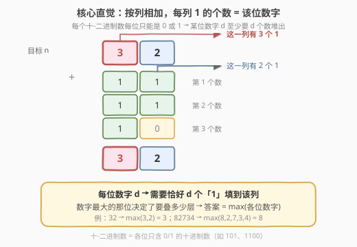
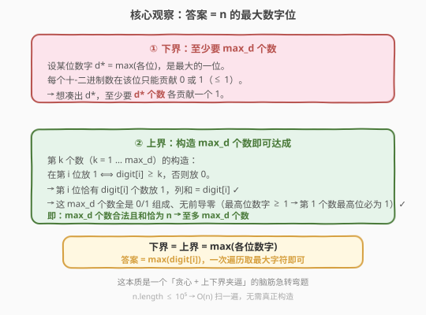
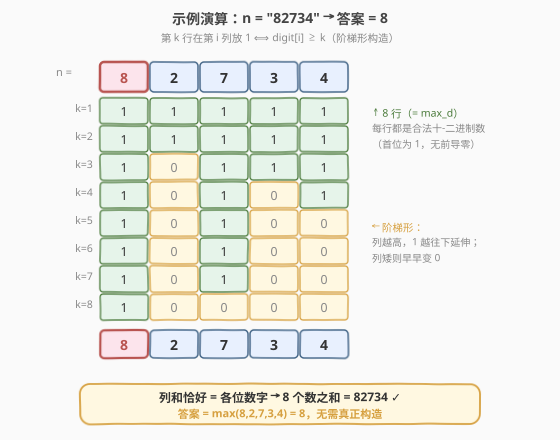

# LeetCode 十-二进制数的最少数目 题解

## 1. 题目概述

- **标题 / 题号**：十-二进制数的最少数目（#1689，medium）
- **链接**：https://leetcode.cn/problems/partitioning-into-minimum-number-of-deci-binary-numbers/
- **难度**：中等
- **标签**：贪心、数学、字符串

**题意**：如果一个十进制数字不含任何前导零，且每一位上的数字不是 `0` 就是 `1`，那么该数字就是一个**十-二进制数**（deci-binary）。例如，`101` 和 `1100` 都是十-二进制数，而 `112` 和 `3001` 不是。

给你一个表示十进制整数的字符串 `n`，返回和为 `n` 的**十-二进制数的最少数目**。

**示例 1**：

```text
输入：n = "32"
输出：3
解释：10 + 11 + 11 = 32
```

**示例 2**：

```text
输入：n = "82734"
输出：8
```

**示例 3**：

```text
输入：n = "27346209830709182346"
输出：9
```

**约束**：

- $1 \leq \text{n.length} \leq 10^5$
- `n` 仅由数字组成
- `n` 不含任何前导零，总是表示正整数

> 💡 本题是一道**脑筋急转弯式贪心题**：表面上是"把 `n` 拆成最少的 0/1 串之和"，实际答案就藏在 `n` 自己身上——**最大的一位数字**。难点不在编码（一次遍历取 `max` 即可），而在论证"为什么这就是最优"。

## 2. 解题思路

### 2.1 暴力思路：搜索/DP 枚举拆分

最朴素的想法：尝试用若干个十-二进制数相加凑出 `n`，搜索或 DP 求最少个数。但 `n` 长度可达 $10^5$，光是候选的十-二进制数就指数级膨胀（每个十-二进制数本身可长达 $10^5$ 位），搜索空间完全无法处理。

问题在于：逐个数去凑，没有抓住"**每一位是独立的**"这一结构。换一个视角——**按列相加**——答案立刻浮现。

### 2.2 核心观察：按列相加，最大数字决定层数



把所有参与相加的十-二进制数**按列对齐竖式相加**。由于每个十-二进制数每一位只能是 `0` 或 `1`：

- 要让第 $i$ 位凑出数字 $d_i$，这一列就必须**恰好有 $d_i$ 个数**在该位放 `1`（其余放 `0`）。
- 整个竖式的**行数**（= 数的个数）至少要能容纳"最胖"的那一列——即 $\max_i d_i$。

以 `n = "32"` 为例：第 1 位是 `3`，需要 3 个数在此放 `1`；第 2 位是 `2`，需要 2 个数在此放 `1`。竖式至少要 3 行才能让第 1 位堆出 3 个 1。这正是答案 = 3 的由来。

> 💡 **关键转化**：把"凑最少个数"变成"竖式最少需要几行"。每一列所需行数 = 该位数字，整体所需行数 = 各列需求的最大值。这把一个组合优化问题降维成了"取最大字符"。

### 2.3 上下界夹逼：为什么答案恰为最大数字



设 $d^* = \max_i d_i$ 为 `n` 中最大的一位数字。用"下界 + 上界"夹逼证明答案恰为 $d^*$：

**① 下界（至少 $d^*$ 个数）**：设 $d^*$ 出现在第 $j$ 位。每个十-二进制数在第 $j$ 位至多贡献 `1`，要凑出 $d^*$ 至少需要 $d^*$ 个数各贡献一个 1。故所需个数 $\geq d^*$。

**② 上界（构造 $d^*$ 个数即可达成）**：按下述规则构造 $d^*$ 个十-二进制数 $b_1, b_2, \dots, b_{d^*}$：

$$b_k \text{ 的第 } i \text{ 位} = \begin{cases} 1, & d_i \geq k \\ 0, & d_i < k \end{cases}, \quad k = 1, 2, \dots, d^*$$

- **合法性**：每个 $b_k$ 各位只有 0/1 ✓；最高位 $d_{\text{high}} \geq 1$，故 $b_1$ 最高位为 1，无前导零 ✓。
- **和正确**：第 $i$ 位上，满足 $k \leq d_i$ 的 $b_k$ 恰有 $d_i$ 个放 1，列和 $= d_i$ ✓。

因此 $d^*$ 个数合法且和恰为 $n$，所需个数 $\leq d^*$。

由 ①②：**答案 $= d^* = \max_i d_i$**。

> ⚠️ 注意构造式本身**无需实现**——它只是用来证明"上界可达"。实际代码只需扫一遍取最大数字字符。这种"构造性证明上界 + 显然下界夹逼"是贪心题的典型论证范式。

### 2.4 示例演算：n = "82734"



以 `n = "82734"` 为例，$d^* = \max(8,2,7,3,4) = 8$。按下界-上界构造，第 $k$ 行（$k=1..8$）在第 $i$ 列放 1 当且仅当该位数字 $\geq k$：

| $k$ | 8 | 2 | 7 | 3 | 4 | 说明 |
|-----|---|---|---|---|---|------|
| 1 | 1 | 1 | 1 | 1 | 1 | 所有位 $\geq 1$ |
| 2 | 1 | 1 | 1 | 1 | 1 | 所有位 $\geq 2$ |
| 3 | 1 | 0 | 1 | 1 | 1 | 位 2 < 3 → 该列变 0 |
| 4 | 1 | 0 | 1 | 0 | 1 | 位 2、3 < 4 |
| 5 | 1 | 0 | 1 | 0 | 0 | 位 2、3、4 < 5 |
| 6 | 1 | 0 | 1 | 0 | 0 | 同上 |
| 7 | 1 | 0 | 1 | 0 | 0 | 同上 |
| 8 | 1 | 0 | 0 | 0 | 0 | 仅位 8 ≥ 8 |
| **列和** | **8** | **2** | **7** | **3** | **4** | = `82734` ✓ |

阶梯形一目了然：**列越高（数字越大），1 越往下延伸**；列矮则早早变 0。8 行的列和恰好还原 `82734`，验证答案 = 8。

> 💡 示例 3 中 `n = "27346209830709182346"`，最大数字是 `9`，故答案 = 9——长度虽达 20 位，但只要最大数字 ≤ 9，答案就被封顶在 9。这也解释了为何约束 `n.length` 高达 $10^5$ 却仍能 $O(n)$ 秒解：答案上界恒为 9。

## 3. 参考代码

### Python

```python
class Solution:
    def minPartitions(self, n: str) -> int:
        return max(int(ch) for ch in n)
```

### C++

```cpp
// 1689. 十-二进制数的最少数目.cpp —— 答案 = n 中最大的一位数字
// 编译: g++ -O2 -std=c++17 1689.cpp -o deci_binary
class Solution {
public:
    int minPartitions(string n) {
        int ans = 0;
        for (char ch : n) {
            ans = max(ans, ch - '0');
            if (ans == 9) break;          // 提前终止：数字最大就是 9
        }
        return ans;
    }
};
```

> 💡 **实现细节**：① 字符 `'0'..'9'` 直接比较即可，甚至不必转 int——`max(ch)` 同样正确（'9' 是最大字符）。② C++ 遇到 `9` 立即 `break`，因为 9 已是单数字上界，无需继续扫。③ Python 的 `max(n)`（对字符串取 max）直接返回最大字符，再 `int()` 转换即可，是最简写法：`return int(max(n))`。

### Python 极简版

```python
class Solution:
    def minPartitions(self, n: str) -> int:
        return int(max(n))                # 字符串 max 按字典序，'0'<'1'<...<'9'
```

## 4. 复杂度分析

| 维度 | 复杂度 | 说明 |
|------|--------|------|
| **时间** | $O(n)$ | 一次遍历取最大字符；遇 `9` 可提前终止，最坏仍 $O(n)$ |
| **空间** | $O(1)$ | 只用常数个变量，原地处理字符串 |

> ⚠️ $n$ 长度达 $10^5$，但答案恒 $\leq 9$。$O(n)$ 扫描完全够用，无需任何额外数据结构。若面试官追问"能否 $O(1)$"——理论上不行，因为必须读取整个输入才能确定最大值（信息论下界 $\Omega(n)$）。

## 5. 扩展：若允许负数位 / 其他进制

本题的精髓是"每位独立、每数每位置贡献上限为 1"。可推广到若干变体：

- **每位贡献上限为 $b$**：若改成"每位数字是 $0..b$ 的数之和"，每个加数每位取 $0..b$，则答案是 $\lceil d^* / b \rceil$（每列至少要 $\lceil d_i / b \rceil$ 行）。本题即 $b=1$ 的特例。
- **不同进制**：若 `n` 是 $B$ 进制串，加数每位取 $0..B\!-\!1$ 且无前导零——答案仍为 $\max_i d_i$（每位贡献上限为 1 的逻辑不变，只是数字范围变成 $0..B\!-\!1$）。
- **进位版**：若加数允许有进位（不再是按列独立的 0/1），问题退化为普通大数加法分解，最少个数可能更少——但失去"按列独立"的结构，会复杂得多，不在本题讨论范围。

## 6. 面试要点

1. **为什么答案是最大数字位？一句话说清。**

   > 把所有加数按列竖式相加：每个加数每位只能贡献 0 或 1，所以某位数字 $d_i$ 必须由 $d_i$ 个加数在该位堆出 1。整个竖式的行数由"最胖"的列决定 = $\max_i d_i$。下界（最大列至少要这么多行）与上界（阶梯形构造恰好用这么多行）相等，故答案即为最大数字。

2. **如何证明"上界可达"——即真的能用 $d^*$ 个数凑出 `n`？**

   > 给出构造：第 $k$ 个数在第 $i$ 位放 1 ⟺ $d_i \geq k$。这样第 $i$ 列恰有 $d_i$ 个 1，和为 $d_i$，各位拼回 `n`。每个数都是 0/1 串、首位为 1（因 $d_{\text{high}} \geq 1$ 使 $b_1$ 最高位为 1）无前导零，合法。构造证明存在性，无需真正实现。

3. **`n.length` 高达 $10^5$，答案最大能是多少？**

   > 恒 $\leq 9$。因为每位数字 $\in [0,9]$，$d^* \leq 9$。无论 `n` 多长，答案封顶在 9。这也意味着即使输入是 20 位、$10^5$ 位的超长串，答案仍是个位数，$O(n)$ 扫一遍即可。

4. **能否 $O(1)$ 解决？为什么不行？**

   > 不能。必须读取整个输入才能确定最大数字——若漏掉某位，该位可能恰好是 9 而改变答案。这是信息论下界 $\Omega(n)$：输入有 $n$ 个字符，任何正确算法在最坏情况下都得看完所有字符。

5. **这题是贪心还是脑筋急转弯？贪心体现在哪？**

   > 既是脑筋急转弯也是贪心。贪心体现在"每个数每位尽可能贡献 1（贡献上限）"这一选择策略——在每个位置上不浪费任何一次放置 1 的机会，从而用最少的行堆满所有列。证明用"下界（每列独立需求）+ 上界（构造达成）夹逼"，是贪心正确性的标准范式。

> 💡 **一句话总结**：1689 的答案就是 `max(n)`——所有加数按列竖式相加，最大数字位决定至少要堆几行；阶梯形构造证明该下界可达。$O(n)$ 扫一遍取最大字符，遇 9 提前终止。

## 同类练习题

| # | 题目 | 与本题的关联 |
|---|------|-------------|
| 1323 | [6 和 9 组成的最大数字](https://leetcode.cn/problems/maximum-69-number/) | 同样是"扫一遍数字字符"的脑筋急转弯，把第一个 6 换成 9 求最大值，对比"取最大"与"贪心替换"的差异 |
| 258 | [各位相加](https://leetcode.cn/problems/add-digits/)（[题解](../0201-0300/258_各位相加.md)） | 按位数字处理 + 数学规律（数根），同为"答案藏在数字位本身"的题感 |
| 2998 | [使 X 与 Y 的最少操作次数](https://leetcode.cn/problems/minimum-number-of-operations-to-make-x-and-y-equal/) | 贪心 + 上下界夹逼论证，从终点倒推的最少操作，思路范式相近 |
| 171 | [Excel 表列序号](https://leetcode.cn/problems/excel-sheet-column-number/)（[题解](../0001-0100/171_Excel表列序号.md)） | 进制转换类"扫一遍字符"题，对比"逐位处理字符串"的不同视角 |
