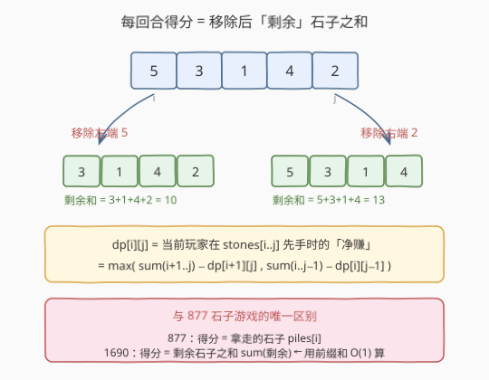
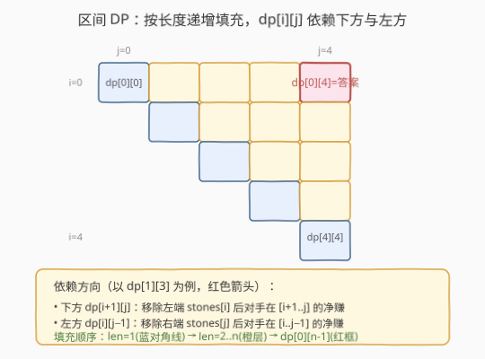
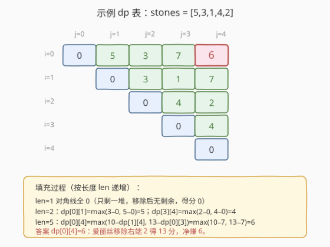

# 石子游戏 VII

- **题目名称**：石子游戏 VII
- **链接**：[1690. 石子游戏 VII](https://leetcode.cn/problems/stone-game-vii/)
- **难度**：中等
- **标签**：数组、数学、动态规划、博弈型区间 DP、前缀和

## 1. 题目概述

`n` 块石子排成一排，每个石头有一个正整数值 `stones[i]`。爱丽丝和鲍勃轮流进行，**爱丽丝先手**。每个玩家的回合中，可以移除**最左**或**最右**的那块石子，并获得与**该行中剩余石头值之和**相等的得分。当没有石头可移除时，得分较高者获胜。

鲍勃总是输，所以他尽力**减小得分差值**；爱丽丝则尽力**扩大得分差值**。两人都发挥最佳水平，返回**爱丽丝得分 − 鲍勃得分**的差值。

**示例 1**：

```text
输入：stones = [5,3,1,4,2]
输出：6
解释：
- 爱丽丝移除 2，得分 5+3+1+4 = 13。爱丽丝=13，鲍勃=0，石子=[5,3,1,4]
- 鲍勃移除 5，得分 3+1+4 = 8。爱丽丝=13，鲍勃=8，石子=[3,1,4]
- 爱丽丝移除 3，得分 1+4 = 5。爱丽丝=18，鲍勃=8，石子=[1,4]
- 鲍勃移除 1，得分 4。爱丽丝=18，鲍勃=12，石子=[4]
- 爱丽丝移除 4，得分 0。爱丽丝=18，鲍勃=12，石子=[]
差值 18 − 12 = 6
```

**示例 2**：

```text
输入：stones = [7,90,5,1,100,10,10,2]
输出：122
```

**约束条件**：

- `n == stones.length`
- `2 <= n <= 1000`
- `1 <= stones[i] <= 1000`

> ⚠️ 注意与 [877. 石子游戏](../0801-0900/877_石子游戏.md) 的关键区别：877 的得分是「**拿走的那块石子**」，本题的得分是「**移除后剩余石子之和**」。这一变化让每次得分随区间缩短而递减，但博弈型区间 DP 的「净赚」框架仍然适用。

---

## 2. 解题思路

### 2.1 暴力思路

每一步先手有「移除左端」或「移除右端」两种选择，移除后获得「剩余石子之和」作为本回合得分，随后剩余区间交给对手继续先手。两人都最优，需递归枚举所有分支，复杂度 $O(2^n)$，`n = 1000` 必爆。同一区间会被反复求解，天然适合区间 DP。

### 2.2 核心观察：博弈型区间 DP（净赚 + 前缀和）



承接 [877. 石子游戏](../0801-0900/877_石子游戏.md) 的「净赚」状态定义：

> $\text{dp}[i][j]$ = 当前玩家在区间 `stones[i..j]` 上**先手**时，能比对手**多拿**的分数（净赚）。

爱丽丝要最大化得分差、鲍勃要最小化它，两人目标相反（对「差值」这一支付函数而言是零和博弈）。因此只需追踪差值即可刻画状态。

**关键差别在「本回合得分」**：877 中移除 `piles[i]` 直接获得 `piles[i]`；本题移除 `stones[i]` 后获得的是**剩余区间 `stones[i+1..j]` 的和**。用前缀和数组 `prefix` 可 $O(1)$ 求任意区间和：

- **移除左端 `stones[i]`**：本回合得分 $= \text{sum}(i+1, j)$；剩余 `[i+1, j]` 轮到对手先手，对手净赚 $\text{dp}[i+1][j]$；先手净赚 $= \text{sum}(i+1, j) - \text{dp}[i+1][j]$。
- **移除右端 `stones[j]`**：本回合得分 $= \text{sum}(i, j-1)$；对手在 `[i, j-1]` 净赚 $\text{dp}[i][j-1]$；先手净赚 $= \text{sum}(i, j-1) - \text{dp}[i][j-1]$。

先手取两者较大：

$$
\text{dp}[i][j] = \max\bigl(\text{sum}(i+1, j) - \text{dp}[i+1][j],\ \ \text{sum}(i, j-1) - \text{dp}[i][j-1]\bigr)
$$

其中 $\text{sum}(l, r) = \text{prefix}[r+1] - \text{prefix}[l]$。

> 💡 **减号的含义**：先手本回合拿了 $\text{sum}(i+1, j)$，但随后对手在剩余区间成为「先手」并拿到净赚 $\text{dp}[i+1][j]$；从先手视角看这是**对手的**收益，要减去。这正是 Minimax「我选最大、对手选最小对我」的紧凑表达——**外层始终是 `max`**，对手的「让我拿得少」已被减法吸收，无需改成 `min`。

**边界**：`dp[i][i] = 0`。只剩一块石子时，移除后剩余为空，本回合得分 = 0，对手也无石子可拿，净赚为 0。

**答案**：`dp[0][n-1]`，即爱丽丝在整段上先手的净赚。

### 2.3 算法流程图



按**区间长度**从短到长递推：长度 1 填主对角线（全 0），长度 2 填紧邻对角线，……，长度 `n` 填右上角 `dp[0][n-1]`。每个 `dp[i][j]` 只依赖其**下方** `dp[i+1][j]` 和**左方** `dp[i][j-1]`（均为长度 `len-1`），按长度递增即可保证依赖已就绪。

### 2.4 示例演算

以 `stones = [5,3,1,4,2]` 为例，前缀和 `prefix = [0, 5, 8, 9, 13, 15]`，填 `5×5` 上三角 dp 表：



| 长度 | 区间 `[i,j]` | 计算 | dp 值 |
|------|--------------|------|-------|
| 1 | `[0,0]`…`[4,4]` | 边界 | 0, 0, 0, 0, 0 |
| 2 | `[0,1]` | max(sum(1,1)−0, sum(0,0)−0) = max(3, 5) | 5 |
| 2 | `[1,2]` | max(sum(2,2), sum(1,1)) = max(1, 3) | 3 |
| 2 | `[2,3]` | max(sum(3,3), sum(2,2)) = max(4, 1) | 4 |
| 2 | `[3,4]` | max(sum(4,4), sum(3,3)) = max(2, 4) | 4 |
| 3 | `[0,2]` | max(sum(1,2)−dp[1][2], sum(0,1)−dp[0][1]) = max(4−3, 8−5) = max(1, 3) | 3 |
| 3 | `[1,3]` | max(5−4, 4−3) = max(1, 1) | 1 |
| 3 | `[2,4]` | max(6−4, 5−4) = max(2, 1) | 2 |
| 4 | `[0,3]` | max(sum(1,3)−dp[1][3], sum(0,2)−dp[0][2]) = max(8−1, 9−3) = max(7, 6) | 7 |
| 4 | `[1,4]` | max(7−2, 8−1) = max(5, 7) | 7 |
| 5 | `[0,4]` | max(sum(1,4)−dp[1][4], sum(0,3)−dp[0][3]) = max(10−7, 13−7) = max(3, 6) | **6** |

`dp[0][4] = 6`，即爱丽丝净赢 6 分，与示例一致。最优首手为移除右端 `2`（得分 `sum(0,3)=13`，净赚 `13−7=6`），随后鲍勃在 `[5,3,1,4]` 上的净赚被限制为 `dp[0][3]=7`。

---

## 3. 参考代码

### C++

```cpp
class Solution {
  public:
    int stoneGameVII(vector<int>& stones) {
        int n = stones.size();
        // 前缀和：prefix[k] = sum(stones[0..k-1])
        vector<int> prefix(n + 1, 0);
        for (int i = 0; i < n; i++) prefix[i + 1] = prefix[i] + stones[i];

        // dp[i][j] = 先手在 stones[i..j] 上的净赚
        vector<vector<int>> dp(n, vector<int>(n, 0));
        // 边界 dp[i][i] = 0 已由初始化给出

        for (int len = 2; len <= n; len++) {        // 按区间长度递增
            for (int i = 0; i + len - 1 < n; i++) { // 枚举左端点
                int j = i + len - 1;                // 右端点
                int sumL = prefix[j + 1] - prefix[i + 1]; // 移除左端后剩余和 sum(i+1, j)
                int sumR = prefix[j]     - prefix[i];     // 移除右端后剩余和 sum(i, j-1)
                dp[i][j] = max(sumL - dp[i + 1][j],
                               sumR - dp[i][j - 1]);
            }
        }
        return dp[0][n - 1];
    }
};
```

### Python

```python
class Solution:
    def stoneGameVII(self, stones: List[int]) -> int:
        n = len(stones)
        # 前缀和：prefix[k] = sum(stones[0..k-1])
        prefix = [0] * (n + 1)
        for i in range(n):
            prefix[i + 1] = prefix[i] + stones[i]

        # dp[i][j] = 先手在 stones[i..j] 上的净赚
        dp = [[0] * n for _ in range(n)]
        # 边界 dp[i][i] = 0 已由初始化给出

        for length in range(2, n + 1):          # 按区间长度递增
            for i in range(n - length + 1):     # 枚举左端点
                j = i + length - 1              # 右端点
                sum_l = prefix[j + 1] - prefix[i + 1]  # 移除左端后剩余和 sum(i+1, j)
                sum_r = prefix[j]     - prefix[i]      # 移除右端后剩余和 sum(i, j-1)
                dp[i][j] = max(sum_l - dp[i + 1][j],
                               sum_r - dp[i][j - 1])
        return dp[0][n - 1]
```

> 💡 **空间优化**：`dp[i][j]` 只依赖「下一行」`dp[i+1][j]` 和「同行左侧」`dp[i][j-1]`。若固定 `i` 从右向左扫 `j`，可用**一维数组** `dp[j]` 滚动（外层 `i` 从 `n-1` 到 `0`，内层 `j` 从 `i+1` 到 `n-1`），空间降到 $O(n)$。`n = 1000` 时二维 $O(n^2) = 4\,\text{MB}$ 也完全可接受，面试中可主动提出滚动优化以加分。

---

## 4. 复杂度分析

| 维度 | 复杂度 | 说明 |
|------|--------|------|
| 时间复杂度 | $O(n^2)$ | 两重循环按区间长度与左端点枚举，共约 $n^2/2$ 个状态，每个 $O(1)$ 转移（前缀和保证区间和 $O(1)$） |
| 空间复杂度 | $O(n^2)$ | 二维 dp 表 + $O(n)$ 前缀和；一维滚动可优化至 $O(n)$ |

> ⚠️ `n <= 1000`，$O(n^2)$ 约 $5 \times 10^5$ 个状态，每个状态 $O(1)$，总操作量在 $10^6$ 量级，完全在时限内。若误用记忆化递归，Python 可能因递归深度 `n=1000` 触发栈溢出，需改 `sys.setrecursionlimit` 或直接用迭代。

---

## 5. 扩展：与 877 石子游戏的对照

本题与 [877. 石子游戏](../0801-0900/877_石子游戏.md) 是博弈型区间 DP 的姊妹题，骨架完全一致，差别仅在「本回合得分」的来源：

| 维度 | 877 石子游戏 | 1690 石子游戏 VII |
|------|--------------|-------------------|
| 本回合得分 | 拿走的那块 `piles[i]` | 移除后**剩余区间和** `sum(i+1, j)` |
| 转移 | $\max(\text{piles}[i]-\text{dp}[i+1][j],\ \text{piles}[j]-\text{dp}[i][j-1])$ | $\max(\text{sum}(i+1,j)-\text{dp}[i+1][j],\ \text{sum}(i,j-1)-\text{dp}[i][j-1])$ |
| 边界 | `dp[i][i] = piles[i]`（拿走唯一堆） | `dp[i][i] = 0`（移除后无剩余，得分 0） |
| 区间和 | 不需要 | 需要**前缀和** $O(1)$ 查询 |
| 答案 | `dp[0][n-1] > 0`（布尔） | `dp[0][n-1]`（整数差值） |
| 外层算子 | `max` | `max`（减法已吸收 Minimax 翻转） |

> 💡 **通用模板**：任何「两人轮流从两端取，零和」的博弈题，都可套用「净赚」状态定义 + `max(gain - dp[sub])` 转移。只需把 `gain` 换成该题的得分规则（拿走的值 / 剩余和 / 其他），边界按题意调整即可。这是 [486. 预测赢家](https://leetcode.cn/problems/predict-the-winner/)、[1682](1682_最长回文子序列II.md) 等一系列题的母模板。

---

## 6. 面试要点

1. **为什么用「净赚」而不是分别记两人得分？**
   - 爱丽丝要最大化「得分差」，鲍勃要最小化它——两人的目标恰好相反（对「差值」这一支付函数而言是零和博弈）。因此只需追踪一个一维量「差值」即可刻画状态，转移只需一个 `max`，且天然消除「当前轮到谁」的额外维度——对手在子区间上的 `dp` 已是其作为先手的净赚，减去即可。

2. **状态转移里为什么是减号 `sum(i+1,j) − dp[i+1][j]`？**
   - 先手本回合拿了 `sum(i+1,j)`，随后**身份互换**：对手成为剩余区间 `[i+1,j]` 的先手，会拿到净赚 `dp[i+1][j]`。从原先手视角，这是对手的收益，要从净赚里扣除。外层仍是 `max`——对手「让我后续拿得少」已被减法吸收。

3. **边界为什么是 `dp[i][i] = 0` 而非 `stones[i]`？**
   - 877 中拿走唯一堆直接得 `piles[i]`，故 `dp[i][i] = piles[i]`；本题移除唯一石子后**剩余为空**，得分 = 空和 = 0，对手也无可拿，净赚 0。边界由「得分来源」决定。

4. **为什么要前缀和？能现算区间和吗？**
   - 转移中每次需 `sum(i+1,j)` 与 `sum(i,j-1)`。若现算 $O(len)$，总复杂度退化到 $O(n^3)$，`n=1000` 约 $10^9$ 会超时。前缀和把区间和降到 $O(1)$，总复杂度 $O(n^2)$。

5. **总得分不是定值，DP 还成立吗？**
   - 成立，且这是个常见混淆点。877 中每回合拿走一个值，所有回合得分之和恒为 $\sum \text{piles}$（定值）。本题每次得分 = 当时的**剩余和**，剩余和随石子被移除而递减，故**总得分依赖移除顺序**——例如 `[5,3,1,4,2]` 最优局总得分 $18+12=30$，换种走法总得分会变。
   - 但「净赚」DP 不依赖总分为定值：`dp[i][j]` 刻画的是**差值**的最优值。递推 `gain − dp[sub]` 中，`gain` 是本回合确定的得分，`dp[sub]` 是子博弈差值的最优值（minimax 下唯一）。差值的**可加性**（本回合差 + 子博弈差 = 总差）足以支撑递推，无需总分为定值。因此外层 `max` 仍然正确：先手选让「本回合得分 − 对手后续净赚」最大的那一端。

---

## 7. 同类练习题

- [877. 石子游戏](https://leetcode.cn/problems/stone-game/)（[题解](../0801-0900/877_石子游戏.md)）：博弈型区间 DP 母模板，得分 = 拿走的石子；本题的直接前驱，对照边界与转移差异
- [486. 预测赢家](https://leetcode.cn/problems/predict-the-winner/)：877 的无特殊约束版（奇数长度、允许平局），同一净赚框架，判定改为 `>= 0`
- [1563. 石子游戏 V](https://leetcode.cn/problems/stone-game-v/)（[题解](../1501-1600/1563_石子游戏 V.md)）：不是从两端取而是「选一段一分为二」，得分规则不同，仍是区间 DP + 博弈
- [1140. 石子游戏 II](https://leetcode.cn/problems/stone-game-ii/)：从「两端取」改为「左端取 M 堆」，博弈 DP + 前缀和，体会状态定义随取法变化
- [312. 戳气球](https://leetcode.cn/problems/burst-balloons/)（[题解](../0301-0400/312_戳气球.md)）：区间 DP 经典，按「最后戳的位置」而非「两端」划分区间，对比两种切分方式
