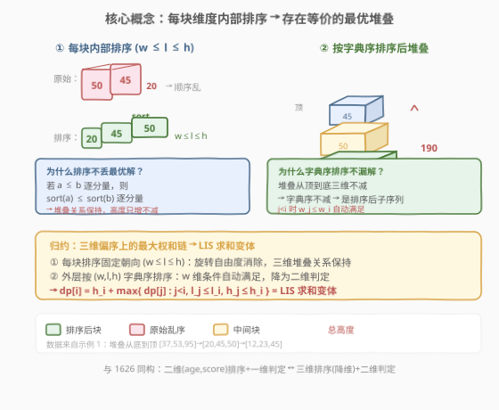
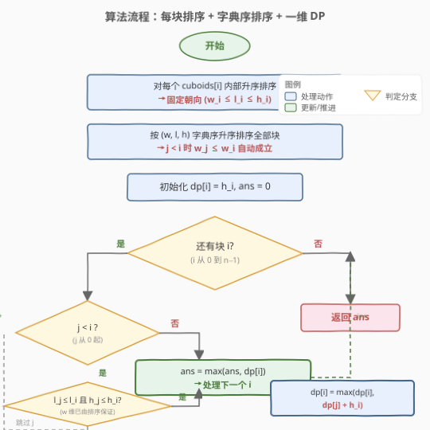

# LeetCode 堆叠长方体的最大高度 题解

## 1. 题目概述

- **标题 / 题号**：堆叠长方体的最大高度（#1691，hard）
- **链接**：https://leetcode.cn/problems/maximum-height-by-stacking-cuboids/
- **难度**：困难
- **标签**：动态规划、排序、最长递增子序列变体

**题意**：给定 $n$ 个长方体 `cuboids`，第 $i$ 个长方体的长宽高为 `cuboids[i] = [width_i, length_i, height_i]`。从中选出一个**子集**堆叠起来，规则：

- 长方体 $i$ 能放在 $j$ 上方，当且仅当 $width_i \le width_j$ 且 $length_i \le length_j$ 且 $height_i \le height_j$（三个维度都不超过下方）；
- **可以旋转**：即可以重新排列每个长方体三个维度的指派，谁做长、谁做宽、谁做高任意安排；
- 返回能堆出的**最大总高度**（每块贡献其当前朝向的高度）。

**示例 1**：

```text
输入：cuboids = [[50,45,20],[95,37,53],[45,23,12]]
输出：190
解释：
  第 1 块放底部，53×37 一面朝下，高度 95；
  第 0 块放中间，45×20 一面朝下，高度 50；
  第 2 块放上面，23×12 一面朝下，高度 45。
  总高度 = 95 + 50 + 45 = 190。
```

**示例 2**：

```text
输入：cuboids = [[38,25,45],[76,35,3]]
输出：76
解释：两块互相放不下，选第 1 块旋转成 35×3 朝下，高度 76。
```

**示例 3**：

```text
输入：cuboids = [[7,11,17],[7,17,11],[11,7,17],[11,17,7],[17,7,11],[17,11,7]]
输出：102
解释：六块尺寸完全相同，全部按 11×7 朝下，高度 17，总高 6×17 = 102。
```

**约束**：

- $n == cuboids.length$
- $1 \le n \le 100$
- $1 \le width_i, length_i, height_i \le 100$

> 💡 **关键信号**：$n \le 100$ → $O(n^2)$ DP 完全够用；"旋转 + 三维比较"暗示**先固定每块的最优朝向**，再在一维序列上做 LIS 求和变体——与 [1626. 无冲突的最佳球队](../1601-1700/1626_无冲突的最佳球队.md) 同构，只是从二维升到三维。

## 2. 解题思路

### 2.1 暴力思路：枚举朝向 + 枚举子集

每块有 $3! = 6$ 种朝向，$n$ 块共 $6^n$ 种朝向组合；对每种组合再枚举 $2^n$ 个子集并检查堆叠合法性。$n = 100$ 时完全不可行。

### 2.2 核心观察：固定朝向 = 每块内部排序



**第一步：消除"旋转"自由度。**

题目允许任意旋转，看似要枚举 $6^n$ 种朝向。关键观察是：**存在一个最优解，其中每块都按"宽 $\le$ 长 $\le$ 高"定向**。即把每块三个维度升序排序，最小者当宽、中间者当长、最大者当高。

> ⚠️ **为什么这样定向不丢失最优解？** 设某最优堆叠中，下方块 $A$ 与上方块 $B$ 满足 $w_B \le w_A$、$l_B \le l_A$、$h_B \le h_A$（分量对应）。把 $A$、$B$ 各自内部排序得 $\hat A, \hat B$。**核心引理**：若 $\vec a \le \vec b$（逐分量），则 $\mathrm{sort}(\vec a) \le \mathrm{sort}(\vec b)$（逐分量）。
>
> 证明：第 $k$ 小的顺序统计量是各分量的**单调非降函数**——增大任一分量不会让第 $k$ 小变小。从 $\vec a$ 出发，把每个分量逐步增大到 $\vec b$ 的对应分量，每步第 $k$ 小都不减，故 $\mathrm{sort}(\vec a)_k \le \mathrm{sort}(\vec b)_k$。
>
> 因此堆叠关系在"每块内部排序"变换下**保持成立**，且每块的高度变成 $\max$ 维度——**只增不减**。所以排序后的解总高度 $\ge$ 原解，仍最优。

**第二步：消除"子集顺序"自由度。**

每块固定为 $(w_i \le l_i \le h_i)$ 后，"可堆叠"是三维的偏序关系：$i$ 能放在 $j$ 上当且仅当 $w_i \le w_j \wedge l_i \le l_j \wedge h_i \le h_j$。

把所有块按 $(w, l, h)$ **字典序升序**排序。则对排序后位置 $j < i$，必有 $w_j \le w_i$（字典序保证）。于是判定 $i$ 能否放 $j$ 上方只需再查 $l_j \le l_i$ 和 $h_j \le h_i$ 两个条件。

> 💡 **为什么排序不会漏解？** 堆叠从底到顶三个维度单调不增，意味着从顶到底三个维度单调不减。把堆叠序列按字典序排好后，序列中"下方的块"在排序后位置必然**不晚于**上方块（因为下方块三个维度都 $\ge$ 上方块，字典序也 $\ge$）。所以任意合法堆叠都对应排序后序列的一个**子序列**。

**第三步：归约为最大和"不下降子序列"。**

定义 $dp[i]$ = 以排序后第 $i$ 块为**顶**（最上方）时能获得的最大总高度。转移：

$$dp[i] = h_i + \max\{\, dp[j] : 0 \le j < i,\ l_j \le l_i,\ h_j \le h_i \,\}$$

若无可接的前驱，则 $dp[i] = h_i$（单独成堆）。答案为 $\max_i dp[i]$。

> 💡 **与 1626 的对照**：
> - 1626：按 `(age, score)` 排序，$dp[i] = score_i + \max\{dp[j] : score_j \le score_i\}$，一维判定
> - 1691：每块内部排序 + 按 `(w, l, h)` 排序，$dp[i] = h_i + \max\{dp[j] : l_j \le l_i, h_j \le h_i\}$，二维判定
>
> 两者都是 **LIS 求和变体**，1691 只是把"一维不下降"升级为"多维不下降"。

### 2.3 算法流程图



```text
1. 对每个 cuboids[i] 内部升序排序 → (w_i ≤ l_i ≤ h_i)
2. 把所有块按 (w, l, h) 字典序升序排序
3. dp[i] = h_i + max{ dp[j] : 0 ≤ j < i, l_j ≤ l_i, h_j ≤ h_i }
   （若无可接前驱，则 dp[i] = h_i）
4. 返回 max(dp[i])
```

### 2.4 示例演算

![示例演算：cuboids = [[50,45,20],[95,37,53],[45,23,12]]](../images/1691_example_walkthrough.svg)

以**示例 1**（`cuboids = [[50,45,20],[95,37,53],[45,23,12]]`）为例：

**第一步：每块内部排序**：

| 原下标 | 原始 | 排序后 (w, l, h) |
|--------|------|------------------|
| 0 | [50, 45, 20] | [20, 45, 50] |
| 1 | [95, 37, 53] | [37, 53, 95] |
| 2 | [45, 23, 12] | [12, 23, 45] |

**第二步：按 (w, l, h) 字典序排序**：

| 排序后序号 | 原下标 | w | l | h |
|-----------|--------|---|---|---|
| 0 | 2 | 12 | 23 | 45 |
| 1 | 0 | 20 | 45 | 50 |
| 2 | 1 | 37 | 53 | 95 |

**第三步：DP 递推**（$w_j \le w_i$ 已由排序保证，只需查 $l, h$）：

| 序号 | (w, l, h) | 可接前驱（$j<i$ 且 $l_j \le l_i$ 且 $h_j \le h_i$） | dp[i] | 说明 |
|------|-----------|---------------------------------------------------|-------|------|
| 0 | (12, 23, 45) | 无 | 45 | 单独成堆 |
| 1 | (20, 45, 50) | j=0：23≤50 ✓ 且 45≤50 ✓ | 50 + 45 = **95** | 接 dp[0] |
| 2 | (37, 53, 95) | j=0：23≤95 ✓ 且 45≤95 ✓；j=1：45≤95 ✓ 且 50≤95 ✓ | 95 + 95 = **190** ← 峰值 | 接 dp[1]=95 最优 |

**答案**：$\max(45, 95, 190) = 190$ ✓

对应堆叠（从底到顶）：原下标 {1, 0, 2}，即 [37,53,95]→[20,45,50]→[12,23,45]，高度 95+50+45=190，与官方解释一致。

## 3. 参考代码

### C++

```cpp
class Solution {
public:
    int maxHeight(vector<vector<int>>& cuboids) {
        int n = cuboids.size();
        for (auto& c : cuboids)
            sort(c.begin(), c.end());
        sort(cuboids.begin(), cuboids.end());

        vector<int> dp(n);
        int ans = 0;
        for (int i = 0; i < n; ++i) {
            int h = cuboids[i][2];
            dp[i] = h;
            for (int j = 0; j < i; ++j) {
                if (cuboids[j][1] <= cuboids[i][1] &&
                    cuboids[j][2] <= cuboids[i][2]) {
                    dp[i] = max(dp[i], dp[j] + h);
                }
            }
            ans = max(ans, dp[i]);
        }
        return ans;
    }
};
```

### Python

```python
class Solution:
    def maxHeight(self, cuboids: List[List[int]]) -> int:
        for c in cuboids:
            c.sort()
        cuboids.sort()

        n = len(cuboids)
        dp = [0] * n
        ans = 0
        for i in range(n):
            h = cuboids[i][2]
            dp[i] = h
            for j in range(i):
                if cuboids[j][1] <= cuboids[i][1] and cuboids[j][2] <= cuboids[i][2]:
                    dp[i] = max(dp[i], dp[j] + h)
            ans = max(ans, dp[i])
        return ans
```

> 💡 **实现细节**：
> - `sort(c.begin(), c.end())` 对每块的三个维度升序排序，把最小者固定为 $w$、中间为 $l$、最大为 $h$。
> - 外层 `sort(cuboids...)` 对 `vector<vector<int>>` 字典序排序，等价于按 `(w, l, h)` 升序。字典序保证 $j < i \Rightarrow w_j \le w_i$，所以内层只需比较 $l$ 和 $h$。
> - `dp[i]` 初始化为 $h_i$（单独成堆），再扫描前驱尝试接上。
> - 注意 `cuboids[j][2]` 是排序后第 $j$ 块的 $h$，用它做高度判定。

## 4. 复杂度分析

| 维度 | 复杂度 | 说明 |
|------|--------|------|
| 时间复杂度 | $O(n^2)$ | 每块内部排序 $O(n \log 3) = O(n)$ + 外层排序 $O(n \log n)$ + 双重循环 DP $O(n^2)$，DP 主导 |
| 空间复杂度 | $O(n)$ | `dp` 数组 $O(n)$（排序为原地） |

> 💡 对 $n = 100$，$O(n^2) = 10^4$，绰绰有余。若 $n$ 放大到 $10^5$ 且维度值域较小，可用 CDQ 分治或树状数组优化到 $O(n \log n)$（三维偏序问题）。

## 5. 扩展：从一维 LIS 到三维偏序

本题本质是**三维偏序上的最大权和链**。把每块看作三维空间中的点 $(w_i, l_i, h_i)$，权重为 $h_i$，求一条点列使每个维度单调不减、权和最大。这是经典的**偏序集上的最长链**问题，复杂度随维度递增：

| 维度 | 模板题 | 解法 |
|------|--------|------|
| 一维 | [300. 最长递增子序列](https://leetcode.cn/problems/longest-increasing-subsequence/) | $O(n^2)$ DP / $O(n \log n)$ 二分 |
| 二维 | [354. 俄罗斯套娃信封问题](https://leetcode.cn/problems/russian-doll-envelopes/) | 一维排序 + 另一维 LIS $O(n \log n)$ |
| 三维 | [1691. 堆叠长方体的最大高度](https://leetcode.cn/problems/maximum-height-by-stacking-cuboids/) | **本题**，每块内部排序"降维"后变二维判定，$O(n^2)$ |
| 一般三维偏序 | 计数/求和型 | CDQ 分治 + 树状数组，$O(n \log^2 n)$ |

> 💡 **本题能"降维"的根因**：旋转自由度让我们把每块固定为 $w \le l \le h$，于是"三维偏序可堆叠"等价转化为"在 $l, h$ 两维上不下降"——$w$ 维由外层排序自动满足。这是题目设计上的精妙之处。

## 6. 面试要点

**Q1：为什么每块内部排序后不丢失最优解？**
> 核心引理：若 $\vec a \le \vec b$ 逐分量，则 $\mathrm{sort}(\vec a) \le \mathrm{sort}(\vec b)$ 逐分量（顺序统计量是各分量的单调非降函数）。所以堆叠关系在"每块内部排序"变换下保持成立，且每块高度变为 $\max$ 维度——只增不减，故排序后的解总高度 $\ge$ 原解，仍最优。

**Q2：为什么外层按字典序排序后，内层只需比较 $l$ 和 $h$？**
> 字典序排序保证 $j < i \Rightarrow w_j \le w_i$（若 $w_j = w_i$ 则继续比 $l$，但 $w_j \le w_i$ 恒成立）。$w$ 维条件已自动满足，所以只需再查 $l_j \le l_i$ 和 $h_j \le h_i$。注意不能省略 $l$ 的判定：$w_j < w_i$ 时 $l_j$ 仍可能 $> l_i$。

**Q3：本题与 1626、354 的关系？**
> 三者都是"排序归约 + LIS 求和/计数变体"。1626 是二维（age, score）排序后一维判定；354 是二维信封按一维排序后另一维做 LIS；1691 是三维，但旋转降维后变成二维判定 + 一维 DP。掌握 300/354/1626 后本题是自然延伸。

**Q4：DP 的状态定义为什么是"以第 $i$ 块为顶"而不是"以第 $i$ 块为底"？**
> 两种定义等价。"以 $i$ 为顶"时转移是"在 $i$ 下方接更小的块"，对应 $dp[i] = h_i + \max\{dp[j] : j \text{ 在 } i \text{ 下方}\}$，由于 $j < i$ 已排序，前驱都在已处理集合中，无后效性。"以 $i$ 为底"则需反向处理，本质相同。选"为顶"是因为按排序正序处理更直观。

**Q5：如果禁止旋转（每块朝向固定），算法怎么改？**
> 删掉"每块内部排序"那一步即可——直接用原始 $(w, l, h)$ 做外层字典序排序 + 二维判定 DP。旋转自由度是本题能降维的关键，去掉后仍是 $O(n^2)$，但常数更小。

## 同类练习题

| # | 题目 | 与本题的关联 |
|---|------|-------------|
| 300 | [最长递增子序列](https://leetcode.cn/problems/longest-increasing-subsequence/)（[题解](../0201-0300/300_最长递增子序列.md)） | 一维 LIS 母题，对比 DP 状态定义与转移 |
| 354 | [俄罗斯套娃信封问题](https://leetcode.cn/problems/russian-doll-envelopes/) | 二维偏序，一维排序 + 另一维 LIS，理解"排序降维"思想 |
| 1626 | [无冲突的最佳球队](https://leetcode.cn/problems/best-team-with-no-conflicts/)（[题解](../1601-1700/1626_无冲突的最佳球队.md)） | 二维排序 + 一维 DP 求最大和不下降子序列，与本题结构同构 |
| 1697 | [检查边界距离相等的字符串对](https://leetcode.cn/problems/checking-existence-of-edge-length-limited-paths/) | 另一类"排序 + 离线处理"范式，体会排序在偏序问题中的通用价值 |
