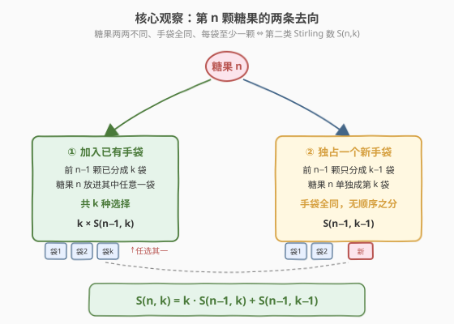
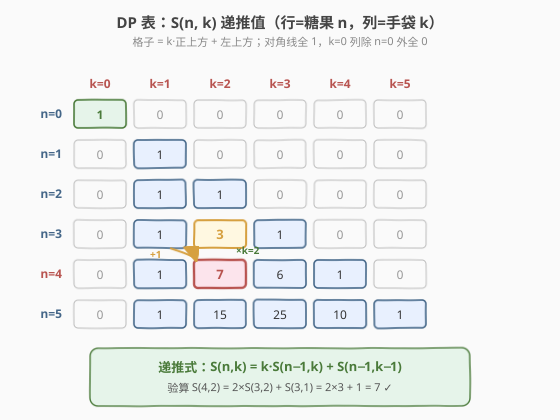
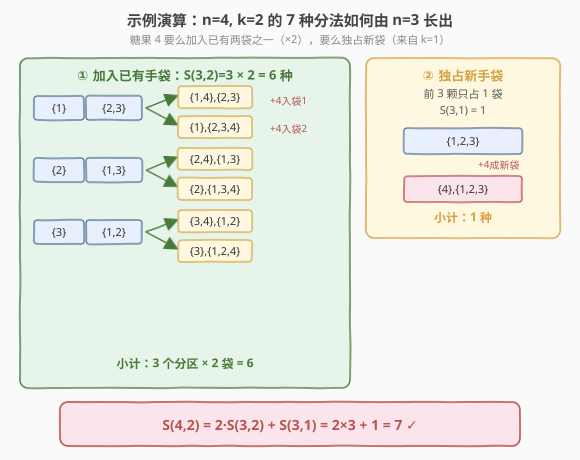

# 计算分配糖果的不同方式

- **题目名称**：计算分配糖果的不同方式
- **链接**：[1692. 计算分配糖果的不同方式](https://leetcode.cn/problems/count-ways-to-distribute-candies/)
- **难度**：困难
- **标签**：动态规划、组合数学、计数

## 1. 题目概述

现有 $n$ 颗**不同**糖果（标记为 $1$ 到 $n$）和 $k$ 个**相同**的手袋。把糖果分配到各个手袋中，要求**每个手袋里至少有一颗糖果**。

不考虑手袋和糖果的摆放顺序。若某种分配方式中存在一个手袋里的糖果集合，与另一种分配方式中所有手袋里的糖果集合都不同，则认为这两种分配方式**不同**。换言之，**手袋全同（无标号）**，两种分配只有当它们对应同一个**集合划分**时才算同一种。

返回分配糖果的不同方式数，对 $10^9 + 7$ 取模。

**示例 1**：

```text
输入：n = 3, k = 2
输出：3
解释：把糖果分配到 2 个手袋中，共 3 种方式：
  (1), (2,3)
  (1,2), (3)
  (1,3), (2)
```

**示例 2**：

```text
输入：n = 4, k = 2
输出：7
解释：共 7 种方式：
  (1), (2,3,4)
  (1,2), (3,4)
  (1,3), (2,4)
  (1,4), (2,3)
  (1,2,3), (4)
  (1,2,4), (3)
  (1,3,4), (2)
```

**示例 3**：

```text
输入：n = 20, k = 5
输出：206085257
解释：共 1881780996 种方式，对 10^9+7 取模得 206085257。
```

**约束条件**：

- $1 \le k \le n \le 1000$

> 💡 题目本质是**集合划分计数**：把 $n$ 个**有区别**的元素划分为 $k$ 个**无标号、非空**的子集，求方案数。这正是**第二类 Stirling 数** $\left\{\begin{matrix}n\\k\end{matrix}\right\}$ 的定义。手袋「全同」对应子集「无标号」，糖果「不同」对应元素「有区别」，每袋「至少一颗」对应子集「非空」——三个条件严丝合缝地刻画了第二类 Stirling 数。

---

## 2. 解题思路

### 2.1 暴力思路：枚举所有划分

最直白的做法是回溯枚举：对每颗糖果，尝试把它放进已有的某个手袋或新建一个手袋，最终保留「恰好用了 $k$ 个袋」的方案。这等价于枚举集合划分，方案数恰为 Bell 数级别——$n=20$ 时 $B(20) \approx 5.1 \times 10^{13}$，而 $n$ 最大可达 $1000$，完全不可行。

```text
dfs(i, used):         # 处理第 i 颗糖果，已用 used 个袋
    if i == n:  return (used == k) ? 1 : 0
    total = 0
    for b in 1..used:            # 加入已有某个袋
        total += dfs(i+1, used)
    if used < k:                 # 独占一个新袋
        total += dfs(i+1, used+1)
    return total
```

这是「构造并数数」，时间正比于划分总数。而本题只需**个数**，应当用 DP 把构造过程压缩成状态转移。

### 2.2 核心观察：第二类 Stirling 数递推



关键洞察：把「$n$ 颗糖果分进 $k$ 袋」拆成**只看最后一颗糖**的子结构。设：

$$
f[i][j] = \text{将 } i \text{ 颗糖果分进 } j \text{ 个手袋的方案数} \quad (\text{即 } \left\{\begin{matrix}i\\j\end{matrix}\right\})
$$

考虑第 $i$ 颗糖果的去向，只有**两条互斥分支**：

1. **加入已有手袋**：前 $i-1$ 颗已经分成 $j$ 个非空袋，第 $i$ 颗放进其中**任意一袋**。袋有 $j$ 个，故贡献 $j \times f[i-1][j]$。
2. **独占一个新手袋**：前 $i-1$ 颗只分成 $j-1$ 个非空袋，第 $i$ 颗单独成第 $j$ 袋。手袋全同无标号，新袋无选择可言，故贡献 $f[i-1][j-1]$。

两分支相加即为状态转移方程：

$$
f[i][j] = j \cdot f[i-1][j] + f[i-1][j-1]
$$

**边界**：$f[0][0] = 1$（0 颗糖分进 0 袋，空划分恰一种）；$f[i][0] = 0$（$i>0$，无袋可放）；$f[0][j] = 0$（$j>0$，无糖却要分袋）。**答案**为 $f[n][k]$。

> 💡 **为什么这是对的？** 关键在于「**手袋全同**」让分支 ② 的选择数恰好为 1：第 $i$ 颗单成一袋后，这 $j$ 个袋之间无法区分，不存在「放进哪个新袋」的多选。对比「**手袋有标号**」的情形——分支 ① 仍是 $j$ 倍，但分支 ② 会变成「新袋可标号为 $1..j$ 中尚未使用的任一个」，即 $j$ 倍，此时答案变成 $j^{\,i}$（满射函数计数）。**标号与否，决定了分支 ② 是否带系数 $j$**，这是理解 Stirling 数与幂函数关系的核心。

> ⚠️ **手袋「全同」与「摆放顺序」**：题目说「不考虑手袋和糖果的摆放顺序」，即袋与袋之间无序、袋内糖果也无序。这正是「集合的集合」（集合划分）的语义：$\{(1),(2,3)\}$ 与 $\{(2,3),(1)\}$ 是同一个划分。若袋有标号，则 $(1)|_{袋1}(2,3)|_{袋2}$ 与 $(2,3)|_{袋1}(1)|_{袋2}$ 是两种，需除以 $j!$ 才回到本题——这正是第 5 节容斥公式的由来。

### 2.3 算法流程图



流程要点：

1. **初始化** 二维表 $f[0..n][0..k]$ 全零，置 $f[0][0]=1$。
2. **外层** $i$ 从 $1$ 到 $n$：逐颗糖果处理。
3. **内层** $j$ 从 $1$ 到 $\min(i, k)$：$j > i$ 时 $f[i][j]=0$（糖果不够分，天然为 0，可跳过）。
4. **转移** $f[i][j] = (j \cdot f[i-1][j] + f[i-1][j-1]) \bmod M$。
5. **返回** $f[n][k]$。

> ⚠️ **溢出陷阱**：$j \cdot f[i-1][j]$ 中 $j, f$ 均 $\le 10^9+7$，乘积可达 $10^{18}$，超出 32 位 `int` 范围。C++ 中必须先转 `long long` 再相乘取模；Python 原生大整数无此问题。

### 2.4 示例演算

以 `n = 4, k = 2` 为例，从 $f[3][2]=3$ 与 $f[3][1]=1$ 出发长出 $f[4][2]$：



- **分支 ①（加入已有袋）**：$f[3][2]=3$ 个划分，每划分把糖果 4 放进两个已有袋之一，得 $3 \times 2 = 6$ 种：
  - $\{1\},\{2,3\}$ → $\{1,4\},\{2,3\}$ 与 $\{1\},\{2,3,4\}$
  - $\{2\},\{1,3\}$ → $\{2,4\},\{1,3\}$ 与 $\{2\},\{1,3,4\}$
  - $\{3\},\{1,2\}$ → $\{3,4\},\{1,2\}$ 与 $\{3\},\{1,2,4\}$
- **分支 ②（独占新袋）**：$f[3][1]=1$（即 $\{1,2,3\}$），糖果 4 单成一袋，得 $1$ 种：$\{4\},\{1,2,3\}$。

合计 $6 + 1 = 7$ ✓，与示例 2 完全一致。验算递推：$f[4][2] = 2 \times f[3][2] + f[3][1] = 2 \times 3 + 1 = 7$。

> 💡 **DP 表的对角线全 1**：$f[i][i]=1$（每颗糖独占一袋，唯一分法），$f[i][1]=1$（全部糖挤一袋，唯一分法）。这两条「骨架」是递推的天然边界，可在实现中直接初始化以省去部分内层循环。

---

## 3. 参考代码

### C++

```cpp
class Solution {
  public:
    int waysToDistribute(int n, int k) {
        const int mod = 1e9 + 7;
        vector<vector<int>> f(n + 1, vector<int>(k + 1, 0));
        f[0][0] = 1;
        for (int i = 1; i <= n; ++i) {
            for (int j = 1; j <= min(i, k); ++j) {
                f[i][j] = (1LL * f[i - 1][j] * j + f[i - 1][j - 1]) % mod;
            }
        }
        return f[n][k];
    }
};
```

### Python

```python
class Solution:
    def waysToDistribute(self, n: int, k: int) -> int:
        mod = 10**9 + 7
        f = [[0] * (k + 1) for _ in range(n + 1)]
        f[0][0] = 1
        for i in range(1, n + 1):
            for j in range(1, min(i, k) + 1):
                f[i][j] = (f[i - 1][j] * j + f[i - 1][j - 1]) % mod
        return f[n][k]
```

> 💡 **写法细节**：
> - **内层上界 `min(i, k)`**：$j > i$ 时糖果数不足以分成 $j$ 个非空袋，$f[i][j]$ 必为 0，跳过以省时。这是 Stirling 数「上三角全零」性质的直接利用。
> - **`f[0][0]=1` 的语义**：0 颗糖分进 0 袋是「空划分」，恰一种——这是递推的唯一真源。若误设为 0，整张表会被污染成全零。
> - **C++ 的 `1LL` 强转**：`f[i-1][j] * j` 两个 `int` 相乘在取模前已可能溢出，必须先把左操作数提升为 `long long`。这是计数 DP 取模题的标配写法。

---

## 4. 复杂度分析

| 维度 | 复杂度 | 说明 |
|------|--------|------|
| 时间复杂度 | $O(n \cdot k)$ | 双重循环，内层最多 $k$ 次；$n,k \le 1000$ 时约 $10^6$ 次运算 |
| 空间复杂度（额外） | $O(n \cdot k)$ | 二维表 $(n+1)\times(k+1)$；可滚动数组优化至 $O(k)$，见第 5 节 |

> 💡 本题 $n, k \le 1000$，$O(nk) \approx 10^6$，远低于时限。二维表约 $4\text{MB}$（`int`），内存充裕。若 $n,k$ 同步放大到 $10^4$，则需切换为 1D 滚动或容斥公式（第 5 节）。

---

## 5. 扩展：滚动数组优化与容斥闭式

### 5.1 一维滚动数组（$O(k)$ 空间）

转移 $f[i][j] = j \cdot f[i-1][j] + f[i-1][j-1]$ 依赖「**正上方**」（同列上一行）与「**左上方**」（左一列上一行）。压成一维 `dp[j]` 后，若内层 $j$ 从小到大，计算 `dp[j]` 时 `dp[j-1]` 已被覆盖成本行新值，读到的不是上一行的 $f[i-1][j-1]$——递推被破坏。

**解法**：内层 $j$ **从大到小**遍历（与 0-1 背包「容量倒序保旧值」同理）。此时 `dp[j]`、`dp[j-1]` 均仍是上一行旧值，转移正确：

```cpp
class Solution {
  public:
    int waysToDistribute(int n, int k) {
        const int mod = 1e9 + 7;
        vector<int> dp(k + 1, 0);
        dp[0] = 1;                       // f[0][0] = 1
        for (int i = 1; i <= n; ++i) {
            int up = min(i, k);
            for (int j = up; j >= 1; --j) {   // 倒序：保 dp[j-1] 为上一行旧值
                dp[j] = (1LL * dp[j] * j + dp[j - 1]) % mod;
            }
            dp[0] = 0;                   // i>=1 后 f[i][0]=0
        }
        return dp[k];
    }
};
```

> ⚠️ **方向不可反**：$j$ 必须降序。若升序，`dp[j-1]` 已是本行新值，相当于误用了 $f[i][j-1]$ 而非 $f[i-1][j-1]$，递推失效——这与 [474. 一和零](https://leetcode.cn/problems/ones-and-zeroes/) 中「二维费用 0-1 背包两维容量都倒序」是同一类陷阱。

### 5.2 容斥原理闭式

手袋「全同」难以直接计数，但「手袋**有标号**」容易算：$n$ 颗糖分进 $k$ 个**有标号**袋且每袋非空，等价于 $n \to k$ 的**满射函数**计数。由容斥原理（排除空袋）：

$$
\text{满射数} = \sum_{t=0}^{k} (-1)^t \binom{k}{t} (k-t)^n
$$

由于 $k$ 个袋全同，每个无标号划分恰对应 $k!$ 个有标号分配（袋的排列）。故：

$$
\left\{\begin{matrix}n\\k\end{matrix}\right\} = \frac{1}{k!} \sum_{t=0}^{k} (-1)^t \binom{k}{t} (k-t)^n
$$

实现需预处理阶乘与逆元（费马小定理），复杂度 $O(k \log n)$（快速幂）或 $O(k)$（预处理幂）。对单次查询比 DP 快，但实现更重，适合 $n$ 极大、$k$ 较小的场景。

> 💡 **DP 与容斥的对照**：DP 递推 $f[i][j]=j\cdot f[i-1][j]+f[i-1][j-1]$ 是「**逐元素决策**」；容斥公式是「**先有标号再除 $k!$**」。二者殊途同归：前者自底向上累加方案，后者用容斥一步到位再消除标号冗余。这正呼应了 [1641. 统计字典序元音字符串的数目](../1601-1700/1641_统计字典序元音字符串的数目.md) 中「DP 递推 ↔ 组合闭式」的等价关系。

---

## 6. 面试要点

1. **怎么看出这是第二类 Stirling 数？**

   - 三个关键词同时出现即可对号入座：元素**有区别**（糖果两两不同）、分组**无标号**（手袋全同）、分组**非空**（每袋至少一颗）。三者缺一变换模型：去「有区别」变整数拆分；去「无标号」变满射函数 $j^n$；去「非空」变允许空袋的分组数。面试时先默念这三条判别模型。

2. **递推里「乘 $j$」的 $j$ 从哪来？「不乘 $j$」又是什么情况？**

   - 「乘 $j$」对应「加入已有袋」：已有 $j$ 个非空袋，第 $i$ 颗糖任选其一。「不乘 $j$」（系数 1）对应「独占新袋」：手袋全同，新袋无标号可选。若袋**有标号**，新袋也可标号为 $1..j$ 任一，分支 ② 同样带 $j$ 倍，此时递推变成 $f[i][j]=j\cdot(f[i-1][j]+f[i-1][j-1])$，解为 $j^{\,i}$。

3. **一维滚动为什么内层必须倒序？**

   - 转移 $f[i][j]=j\cdot f[i-1][j]+f[i-1][j-1]$ 两个依赖都来自**上一行**。压成一维后，倒序遍历能保证计算 `dp[j]` 时 `dp[j]` 与 `dp[j-1]` 都未被本行覆盖、仍是上一行旧值。升序则 `dp[j-1]` 已变本行新值，误读为 $f[i][j-1]$。这与 0-1 背包「倒序保旧」原理完全一致。

4. **`f[0][0]=1` 为什么不能是 0？**

   - 它是整张递推表的唯一真源：$f[1][1]=1\cdot f[0][1]+f[0][0]=0+1=1$。若 $f[0][0]=0$，则 $f[1][1]=0$，进而整表全零。空集恰有一种空划分，这是组合计数的标准约定（与 $0!=1$、空串匹配同源）。

5. **能直接套组合公式吗？何时选 DP 何时选容斥？**

   - 单次查询、$n,k\le 1000$ 时 DP 最直观；若 $n$ 极大（如 $10^9$）而 $k$ 很小，容斥闭式 $\frac{1}{k!}\sum(-1)^t\binom{k}{t}(k-t)^n$ 配快速幂更优（$O(k\log n)$）。多次查询不同 $n$ 同 $k$ 时，可预处理 $k$ 以内的组合数与逆元后批量算。**DP 适合稠密小范围，容斥适合稀疏大范围**。

---

## 7. 同类练习题

- [1641. 统计字典序元音字符串的数目](https://leetcode.cn/problems/count-sorted-vowel-strings/)（[题解](../1601-1700/1641_统计字典序元音字符串的数目.md)）：计数型 DP 配组合闭式，与本题「DP 递推 ↔ 容斥/组合公式」的等价思路一致
- [96. 不同的二叉搜索树](https://leetcode.cn/problems/unique-binary-search-trees/)（[题解](../0001-0100/96_不同的二叉搜索树.md)）：计数 DP 配 Catalan 闭式，同属「逐元素/逐位置递推，最终对应一个经典组合数」的范式
- [1639. 通过给定词典构造目标字符串的方案数](https://leetcode.cn/problems/number-of-ways-to-form-a-target-string-given-a-dictionary/)（[题解](../1601-1700/1639_通过给定词典构造目标字符串的方案数.md)）：计数方案数 DP + $10^9+7$ 取模，对照理解「方案累加型」转移与本题「分支相加型」转移的异同
- [1282. 用户分组](https://leetcode.cn/problems/group-the-people-given-the-group-size-they-belong-to/)（[题解](../1201-1300/1282_用户分组.md)）：集合划分思想的具体构造题，对照本题「数划分个数」与彼「输出一个划分方案」，体会计数 vs 构造的分野
- [474. 一和零](https://leetcode.cn/problems/ones-and-zeroes/)（[题解](../0401-0500/474_一和零.md)）：二维费用 0-1 背包，内层容量倒序滚动——与本题 1D 滚动「倒序保旧值」同源，对照巩固滚动方向直觉
