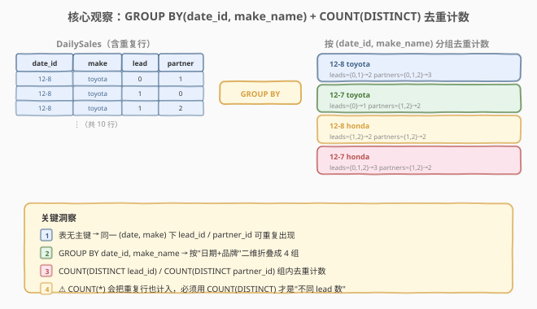
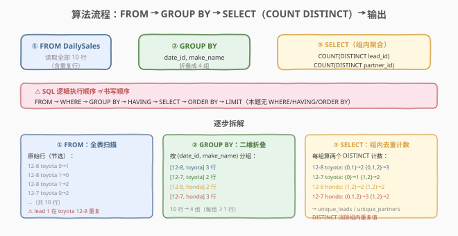
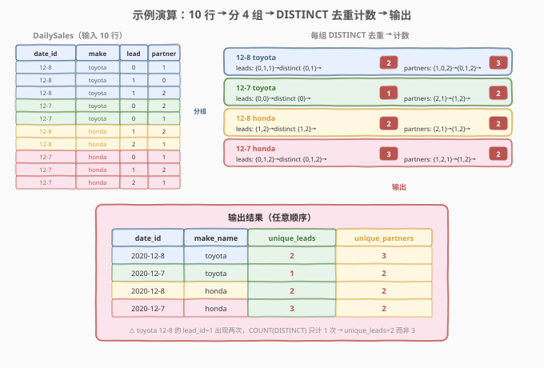

# 每天的领导和合伙人

- **题目名称**：每天的领导和合伙人
- **链接**：[1693. 每天的领导和合伙人](https://leetcode.cn/problems/daily-leads-and-partners/)
- **难度**：简单
- **标签**：数据库、SQL、`GROUP BY`、`COUNT(DISTINCT)`、多列分组、去重计数、单表查询

## 1. 题目概述

给定 `DailySales`（每日销售）表，编写 SQL 查询，对于每个 `date_id` 和 `make_name` 的组合，统计**不同**（distinct）`lead_id` 的数量和**不同** `partner_id` 的数量。以任意顺序返回结果。

**表结构**：

```text
Table: DailySales
+-------------+---------+
| Column Name | Type    |
+-------------+---------+
| date_id     | date    |
| make_name   | varchar |
| lead_id     | int     |
| partner_id  | int     |
+-------------+---------+
此表没有主键（即可能包含重复行）。
此表包含售出产品的日期、产品名称以及售给的销售线索 ID 和合伙人 ID。
make_name 只包含小写英文字母。
```

**示例 1**：

```text
输入：
DailySales 表:
+-----------+-----------+---------+------------+
| date_id   | make_name | lead_id | partner_id |
+-----------+-----------+---------+------------+
| 2020-12-8 | toyota    | 0       | 1          |
| 2020-12-8 | toyota    | 1       | 0          |
| 2020-12-8 | toyota    | 1       | 2          |
| 2020-12-7 | toyota    | 0       | 2          |
| 2020-12-7 | toyota    | 0       | 1          |
| 2020-12-8 | honda     | 1       | 2          |
| 2020-12-8 | honda     | 2       | 1          |
| 2020-12-7 | honda     | 0       | 1          |
| 2020-12-7 | honda     | 1       | 2          |
| 2020-12-7 | honda     | 2       | 1          |
+-----------+-----------+---------+------------+

输出：
+-----------+-----------+--------------+-----------------+
| date_id   | make_name | unique_leads | unique_partners |
+-----------+-----------+--------------+-----------------+
| 2020-12-8 | toyota    | 2            | 3               |
| 2020-12-7 | toyota    | 1            | 2               |
| 2020-12-8 | honda     | 2            | 2               |
| 2020-12-7 | honda     | 3            | 2               |
+-----------+-----------+--------------+-----------------+
```

**解释**：

| date_id | make_name | 组内 lead_id | unique_leads | 组内 partner_id | unique_partners |
|---------|-----------|--------------|--------------|-----------------|-----------------|
| 2020-12-8 | toyota | 0, 1, **1** | 2（{0,1}） | 1, 0, 2 | 3（{0,1,2}） |
| 2020-12-7 | toyota | 0, **0** | 1（{0}） | 2, 1 | 2（{1,2}） |
| 2020-12-8 | honda | 1, 2 | 2（{1,2}） | 2, 1 | 2（{1,2}） |
| 2020-12-7 | honda | 0, 1, 2 | 3（{0,1,2}） | 1, 2, **1** | 2（{1,2}） |

注意 `toyota` 在 `2020-12-8` 的 `lead_id` 列中 `1` 出现了两次（重复行），但去重后只有 `{0, 1}` 两个不同值，故 `unique_leads = 2`；同理 `honda` 在 `2020-12-7` 的 `partner_id` 列中 `1` 重复，去重后 `unique_partners = 2`。

**约束条件**：

- `DailySales` 表**没有主键**，可能包含重复行——同一 `(date_id, make_name, lead_id, partner_id)` 组合可能多次出现。
- `make_name` 只包含小写英文字母。
- 需统计的是**不同** `lead_id` / `partner_id` 的数量（去重计数），而非行数。
- 结果可按任意顺序返回。

> 💡 本题是 SQL **"多列分组 + 去重计数"入门招牌题**——核心三步：① `GROUP BY date_id, make_name` 按日期+品牌二维分组；② `COUNT(DISTINCT lead_id)` 统计组内不同线索数；③ `COUNT(DISTINCT partner_id)` 统计组内不同合伙人数。最大考点是辨析 **`COUNT(DISTINCT col)`（去重计数）与 `COUNT(col)` / `COUNT(*)`（行数计数）** 的区别——因为表无主键、允许重复行，用 `COUNT(*)` 会把重复行也计入导致结果偏大。

---

## 2. 解题思路

### 2.1 暴力思路：逐组收集去重再计数

最直觉的过程式思路：遍历每个 `(date_id, make_name)` 组合，把组内所有 `lead_id` 收集到一个集合中（天然去重），再数集合大小；`partner_id` 同理：

```text
result = []
for each (date, make) in DailySales:   # 遍历每个日期+品牌组合
    leads = set()
    partners = set()
    for row in DailySales where date_id == date and make_name == make:
        leads.add(row.lead_id)         # 集合自动去重
        partners.add(row.partner_id)
    result.append((date, make, len(leads), len(partners)))
```

逻辑正确，但**纯 SQL 没有显式逐行循环**——"按组合分组 + 组内去重计数"需换成集合式表达：用 `GROUP BY date_id, make_name` 把表按日期+品牌折叠成一组，再用聚合函数 `COUNT(DISTINCT lead_id)` 一次性完成"组内去重 + 计数"两步。

> ⚠️ 暴力思路暴露了一个关键点：**表无主键，组内可能有重复值**。若用 `COUNT(lead_id)`（不去重）替代 `COUNT(DISTINCT lead_id)`，会把 `toyota` 在 `2020-12-8` 的 3 行（lead_id 为 0,1,1）计为 3 而非 2——结果错误。这正是本题的核心考点。

### 2.2 核心观察：GROUP BY 多列 + COUNT(DISTINCT) 去重计数



**问题拆解为三个子问题**：

1. **按日期+品牌二维分组**：`GROUP BY date_id, make_name`。把 `DailySales` 的 10 行按 `(date_id, make_name)` 折叠成 4 组——`(12-8, toyota)`、`(12-7, toyota)`、`(12-8, honda)`、`(12-7, honda)`。
   - `GROUP BY` 可接多列，用逗号分隔。多列分组等价于"按这些列的**组合值**分组"——只有所有分组列的值都相同的行才会被归入同一组。
   - 本题分组键是 `(date_id, make_name)` 两列，而非单列。若只 `GROUP BY date_id`，会把同一天不同品牌的数据混在一起，丢失品牌维度。

2. **组内去重计数 lead_id**：`COUNT(DISTINCT lead_id)`。对每个分组，先在 `lead_id` 列上去重（消除重复值），再计数。例如 `(12-8, toyota)` 组的 `lead_id` 为 `{0, 1, 1}`，去重后 `{0, 1}`，计数为 `2`。
   - ⚠️ **必须用 `DISTINCT`**！因为表无主键，同一组内 `lead_id` 可能重复出现。`COUNT(lead_id)` 计的是非 NULL 行数（不去重），会把重复值多次计入；`COUNT(DISTINCT lead_id)` 先去重再计数，才是"不同 lead 数"。

3. **组内去重计数 partner_id**：`COUNT(DISTINCT partner_id)`。同理，对 `partner_id` 列去重后计数。例如 `(12-7, honda)` 组的 `partner_id` 为 `{1, 2, 1}`，去重后 `{1, 2}`，计数为 `2`。

> ⚠️ **`COUNT(DISTINCT)` vs `COUNT()` 的选择标准**：当题目说"**不同的/distinct** X 的数量"时，必须用 `COUNT(DISTINCT X)`；当题目说"**行数/记录数/次数**"时，用 `COUNT(*)` 或 `COUNT(X)`。本题明确要求"distinct lead_id's"和"distinct partner_id's"，故两个都用 `COUNT(DISTINCT)`。混淆两者是 SQL 计数题最常见错误。

> 💡 **`COUNT(DISTINCT)` 的实现机制**：数据库引擎对每个分组内部维护一个哈希表（或排序去重），消除 `lead_id` 的重复值后再计数。时间复杂度为组内元素数 $O(s)$（哈希去重），空间复杂度为组内不同值数 $O(u)$。当组内重复率高时，去重效果显著。

### 2.3 算法流程图



**逻辑执行步骤**（注意 SQL 子句执行顺序与书写顺序不同）：

| 步骤 | 子句 | 作用 | 本题对应 |
|------|------|------|----------|
| ① | `FROM DailySales` | 确定数据源 | 读取全部 10 行销售记录（含重复行） |
| ② | `GROUP BY date_id, make_name` | 按日期+品牌二维分组 | 折叠成 4 组 |
| ③ | `SELECT` | 选输出列 + 求值聚合表达式 | `date_id` + `make_name` + `COUNT(DISTINCT lead_id)` + `COUNT(DISTINCT partner_id)` |

> 💡 **SQL 子句执行顺序**：`FROM`（含 `JOIN`/`ON`）→ `WHERE` → `GROUP BY` → `HAVING` → `SELECT` → `ORDER BY` → `LIMIT`。本题没有 `WHERE`/`HAVING`/`ORDER BY`。`GROUP BY` 先把行折叠成组，`SELECT` 阶段才对每组求值 `COUNT(DISTINCT ...)` 聚合函数。聚合函数作用于"组内所有行"，而非整张表。

### 2.4 示例演算

以示例 1 的 10 行数据为例，观察「按 (date_id, make_name) 分组 → 组内 DISTINCT 去重计数 → 输出」的逐步过程：



**步骤 ①②：GROUP BY date_id, make_name（按颜色分组）**

| 分组 | date_id | make_name | 组内行数 | 组内 lead_id | 组内 partner_id |
|------|---------|-----------|----------|--------------|-----------------|
| G1 | 2020-12-8 | toyota | 3 | 0, 1, **1** | 1, 0, 2 |
| G2 | 2020-12-7 | toyota | 2 | 0, **0** | 2, 1 |
| G3 | 2020-12-8 | honda | 2 | 1, 2 | 2, 1 |
| G4 | 2020-12-7 | honda | 3 | 0, 1, 2 | 1, 2, **1** |

> ⚠️ 注意 G1 的 `lead_id` 有重复值 `1`（出现 2 次），G2 的 `lead_id` 有重复值 `0`（出现 2 次），G4 的 `partner_id` 有重复值 `1`（出现 2 次）。这些重复正是 `DISTINCT` 要消除的。

**步骤 ③：SELECT COUNT(DISTINCT ...)（组内去重计数）**

| 分组 | lead_id 去重后 | unique_leads | partner_id 去重后 | unique_partners |
|------|----------------|--------------|-------------------|-----------------|
| G1 | {0, 1} | 2 | {0, 1, 2} | 3 |
| G2 | {0} | 1 | {1, 2} | 2 |
| G3 | {1, 2} | 2 | {1, 2} | 2 |
| G4 | {0, 1, 2} | 3 | {1, 2} | 2 |

**最终输出**（任意顺序）：

| date_id | make_name | unique_leads | unique_partners |
|---------|-----------|--------------|-----------------|
| 2020-12-8 | toyota | 2 | 3 |
| 2020-12-7 | toyota | 1 | 2 |
| 2020-12-8 | honda | 2 | 2 |
| 2020-12-7 | honda | 3 | 2 |

> 💡 **验证关键行**：G1 `(12-8, toyota)` 有 3 行但 `lead_id` 只有 `{0, 1}` 两个不同值（`1` 重复），故 `unique_leads = 2` 而非 3。若误用 `COUNT(lead_id)` 会得到 3——这是本题最易踩的坑。同理 G4 `(12-7, honda)` 有 3 行但 `partner_id` 只有 `{1, 2}` 两个不同值（`1` 重复），`unique_partners = 2` 而非 3。

---

## 3. 参考代码

### SQL（解法 A：`GROUP BY` + `COUNT(DISTINCT)`，推荐）

```sql
SELECT date_id,
       make_name,
       COUNT(DISTINCT lead_id)    AS unique_leads,
       COUNT(DISTINCT partner_id) AS unique_partners
FROM DailySales
GROUP BY date_id, make_name;
```

> 💡 **写法要点**：
> - **`GROUP BY date_id, make_name`**：按日期+品牌二维分组，逗号分隔多列。只有两列值都相同的行才归入同组。
> - **`COUNT(DISTINCT lead_id)`**：组内对 `lead_id` 去重后计数——先消除重复值再数个数。对应题目"distinct lead_id's"。
> - **`COUNT(DISTINCT partner_id)`**：组内对 `partner_id` 去重后计数。对应题目"distinct partner_id's"。
> - **`AS unique_leads` / `AS unique_partners`**：列别名与题目输出列名一致。
> - **无 `ORDER BY`**：题目允许任意顺序返回，故省略排序。
> - ✓ **最推荐**：一行 `GROUP BY` + 两个 `COUNT(DISTINCT)`，简洁且语义精确。

### SQL（解法 B：子查询先 DISTINCT 再分组）

```sql
SELECT date_id,
       make_name,
       COUNT(lead_id)    AS unique_leads,
       COUNT(partner_id) AS unique_partners
FROM (
    SELECT DISTINCT date_id, make_name, lead_id, partner_id
    FROM DailySales
) t
GROUP BY date_id, make_name;
```

> 💡 **解法 B 的思路**：先用 `SELECT DISTINCT` 对整表去重（消除完全相同的行），再在外层用普通 `COUNT(lead_id)` 计数。
>
> **与解法 A 的关系**：逻辑**不完全等价**！`SELECT DISTINCT` 去重的是"整行完全相同"的行，而 `COUNT(DISTINCT lead_id)` 是"组内 `lead_id` 列值去重"。只有当 `lead_id` 和 `partner_id` 的重复模式完全一致时两者才相同。本题中 `lead_id` 和 `partner_id` 是独立的——同一 `lead_id` 可对应不同 `partner_id`，故整行去重后 `COUNT(lead_id)` 仍可能把同一 `lead_id`（搭配不同 `partner_id`）计多次。
>
> ⚠️ **解法 B 是错误的**！它无法正确处理"`lead_id` 相同但 `partner_id` 不同"的行。例如若组内有 `(lead=1, partner=2)` 和 `(lead=1, partner=3)` 两行，`SELECT DISTINCT` 不会去重它们（整行不同），外层 `COUNT(lead_id)` 会计 2 而非 1。本题示例恰好不暴露此问题，但逻辑上解法 B 是错的。**正确做法是解法 A：每列独立 `COUNT(DISTINCT)`**。这里列出解法 B 仅为反面教材，警示"整行 DISTINCT ≠ 列级 DISTINCT"。

### Python（pandas）

```python
import pandas as pd

def daily_leads_and_partners(daily_sales: pd.DataFrame) -> pd.DataFrame:
    result = daily_sales.groupby(['date_id', 'make_name']).agg(
        unique_leads=('lead_id', 'nunique'),
        unique_partners=('partner_id', 'nunique')
    ).reset_index()
    return result
```

> 💡 **pandas 对照**：
> - **`groupby(['date_id', 'make_name'])`**：对应 `GROUP BY date_id, make_name`——按两列分组，传列表表示多列分组键。
> - **`.agg(lead_id='nunique', partner_id='nunique')`**：`nunique`（number of unique）对应 `COUNT(DISTINCT)`——统计不同值的个数，天然去重。pandas 中 `count` 不去重（对应 `COUNT`），`nunique` 去重（对应 `COUNT(DISTINCT)`）。
> - **`.reset_index()`**：把分组键从索引恢复为普通列，对应 SQL 中 `date_id`/`make_name` 作为普通输出列。
> - 无 `.sort_values()`：对应无 `ORDER BY`，任意顺序返回。

---

## 4. 复杂度分析

| 维度 | 解法 A（`COUNT(DISTINCT)`） | pandas |
|------|----------------------------|--------|
| **时间** | $O(n \cdot \log k)$ | $O(n)$ |
| **空间** | $O(k \cdot u)$ | $O(n)$ |
| **可读性** | ✓ 简洁 | ✓ 清晰 |
| **正确性** | ✓ 列级去重 | ✓ `nunique` 列级去重 |
| **推荐度** | ✓ **首选** | ✓ 验证用 |

> - $n$ = `DailySales` 表行数，$k$ = 不同 `(date_id, make_name)` 组合数（结果行数），$u$ = 组内不同 `lead_id`/`partner_id` 的平均数。
> - **时间**：`GROUP BY` 需一次全表扫描 $O(n)$；每组内 `COUNT(DISTINCT)` 需对组内元素去重，通常用哈希表 $O(s)$（$s$ 为组内行数）或排序 $O(s \log s)$。总计 $O(n + k \cdot s \log s)$，简化为 $O(n \log k)$（因 $k \cdot s \approx n$）。pandas 的 `nunique` 基于哈希表，每组 $O(s)$，总计 $O(n)$。
> - **空间**：`GROUP BY` 需 $O(k)$ 存每组的哈希表；每组去重哈希表存不同值需 $O(u)$，总计 $O(k \cdot u)$。pandas 需 $O(n)$ 存整个 DataFrame。
> - **索引优化**：若 `DailySales(date_id, make_name)` 上有复合索引，`GROUP BY date_id, make_name` 可走索引有序扫描避免额外排序（MySQL 的松散索引扫描）。`COUNT(DISTINCT)` 仍需组内去重，无法完全避免。

---

## 5. 扩展：`COUNT(DISTINCT)` 深入辨析

### 5.1 `COUNT(*)` vs `COUNT(col)` vs `COUNT(DISTINCT col)`

三种 `COUNT` 形态在**去重**和 **NULL 处理**上有重要差异：

| 写法 | 语义 | 是否去重 | NULL 处理 | 本题适用 |
|------|------|----------|-----------|----------|
| `COUNT(*)` | 统计行数（含 NULL 行） | 否 | 计入所有行 | ✗（会多算重复行） |
| `COUNT(lead_id)` | 统计 `lead_id` 非 NULL 的行数 | 否 | 忽略 NULL 行 | ✗（不去重，重复值多算） |
| `COUNT(DISTINCT lead_id)` | 统计不同 `lead_id` 的个数 | 是 | 忽略 NULL 且去重 | ✓（题目要求 distinct） |

> 💡 **核心结论**：题目说"**distinct / 不同**"→ 用 `COUNT(DISTINCT col)`；题目说"**行数 / 次数 / 记录数**"→ 用 `COUNT(*)` 或 `COUNT(col)`。本题明确要求"distinct lead_id's"和"distinct partner_id's"，两个都必须用 `COUNT(DISTINCT)`。

### 5.2 为什么不能用 `SELECT DISTINCT` 整行去重替代

这是本题最常见的误区——用 `SELECT DISTINCT` 先对整表去重，再用 `COUNT` 计数（即第 3 节解法 B）。问题在于 **整行去重与列级去重语义不同**：

```text
组内数据（假设）：
  lead_id=1, partner_id=2
  lead_id=1, partner_id=3
  lead_id=1, partner_id=2   ← 整行重复

SELECT DISTINCT 去重后：
  lead_id=1, partner_id=2
  lead_id=1, partner_id=3
  → COUNT(lead_id) = 2  ✗ 错误！

COUNT(DISTINCT lead_id)：
  lead_id 去重 → {1}
  → COUNT = 1  ✓ 正确
```

> ⚠️ `SELECT DISTINCT` 去重的是"所有列组合完全相同"的行；`COUNT(DISTINCT lead_id)` 去重的是"`lead_id` 列值相同"的行（不管其他列）。当 `lead_id` 相同但 `partner_id` 不同时，`SELECT DISTINCT` 不去重，但 `COUNT(DISTINCT lead_id)` 会去重。**每列独立去重必须用 `COUNT(DISTINCT col)`，不能用整行 `DISTINCT` 替代**。

### 5.3 多列 `GROUP BY` 的分组语义

`GROUP BY date_id, make_name` 中的逗号不是"分别分组"，而是"按组合值分组"：

| 写法 | 分组方式 | 本题效果 |
|------|----------|----------|
| `GROUP BY date_id` | 仅按日期分组 | 同一天不同品牌混在一起 ✗ |
| `GROUP BY make_name` | 仅按品牌分组 | 同一品牌不同日期混在一起 ✗ |
| `GROUP BY date_id, make_name` | 按(日期,品牌)组合分组 | 每个日期+品牌独立一组 ✓ |

> 💡 **多列分组 = 按组合值分组**：`GROUP BY a, b` 等价于"把 `(a, b)` 看作一个复合键，按键值分组"。只有 `a` 和 `b` 都相同的行才归入同组。本题要"for each `date_id` and `make_name`"，即每个(日期,品牌)组合一行，故用 `GROUP BY date_id, make_name`。

### 5.4 `COUNT(DISTINCT)` 的 NULL 处理

`COUNT(DISTINCT col)` 会**先排除 NULL 值**再去重计数——NULL 不算一个"值"：

| 组内 `lead_id` 值 | `COUNT(DISTINCT lead_id)` | 说明 |
|-------------------|---------------------------|------|
| `{0, 1, 1}` | 2 | 去重后 {0, 1} |
| `{0, NULL, 1}` | 2 | NULL 被排除，去重后 {0, 1} |
| `{NULL, NULL}` | 0 | 全为 NULL，无可计数的值 |
| `{}` (空组) | 0 | 空组无值 |

> 💡 本题 `lead_id` / `partner_id` 为 `int` 类型且题目未提及 NULL，实际数据中不会出现 NULL。但理解 `COUNT(DISTINCT)` 的 NULL 行为很重要——它**忽略 NULL**，与 `COUNT(*)`（计入 NULL 行）不同。若需把 NULL 当作一个独立值计数，需用 `COUNT(DISTINCT IFNULL(col, 'NULL_PLACEHOLDER'))`。

---

## 6. 面试要点

1. **为什么用 `COUNT(DISTINCT lead_id)` 而不是 `COUNT(lead_id)` 或 `COUNT(*)`？**

   > 题目要求统计"**distinct** lead_id's"——不同线索 ID 的数量。表无主键，同一 `(date_id, make_name)` 组内 `lead_id` 可能重复出现（如 `toyota` 在 `2020-12-8` 的 `lead_id=1` 出现两次）。`COUNT(lead_id)` 计的是非 NULL 行数（不去重），会得 3；`COUNT(DISTINCT lead_id)` 先去重再计数，正确得 2。`COUNT(*)` 更糟——它连 NULL 行也计入。凡是题目说"distinct / 不同"就必须用 `COUNT(DISTINCT)`。

2. **`GROUP BY date_id, make_name` 中逗号的作用是什么？能否只 `GROUP BY date_id`？**

   > 逗号分隔多列分组键，表示"按这些列的**组合值**分组"——只有 `date_id` 和 `make_name` 都相同的行才归入同组。若只 `GROUP BY date_id`，同一天不同品牌的数据会混入同一组，丢失品牌维度——`toyota` 和 `honda` 在 `2020-12-8` 的线索/合伙人数会合并成一个数字，不符合"for each `date_id` and `make_name`"的要求。题目要求每个(日期,品牌)组合一行，故必须 `GROUP BY date_id, make_name`。

3. **能否用 `SELECT DISTINCT` 整表去重替代 `COUNT(DISTINCT)`？为什么？**

   > 不能。`SELECT DISTINCT` 去重的是"整行所有列完全相同"的行，而 `COUNT(DISTINCT lead_id)` 去重的是"`lead_id` 列值相同"的行（不管 `partner_id`）。当组内有 `(lead=1, partner=2)` 和 `(lead=1, partner=3)` 两行时——整行不同，`SELECT DISTINCT` 不去重；但 `lead_id` 相同，`COUNT(DISTINCT lead_id)` 去重为 1。`lead_id` 和 `partner_id` 是两个独立的维度，必须各自用 `COUNT(DISTINCT)` 独立去重，不能靠整行 `DISTINCT` 一步到位。

4. **`COUNT(DISTINCT)` 如何处理 NULL 值？**

   > `COUNT(DISTINCT col)` 会先排除 `col` 为 NULL 的行，再对剩余非 NULL 值去重计数。NULL 不算一个"值"——即使组内有多行 NULL，它们也不计入结果。若组内全部为 NULL，`COUNT(DISTINCT col)` 返回 0。这与 `COUNT(*)`（计入所有行含 NULL 行）不同。本题 `lead_id`/`partner_id` 为 `int` 且无 NULL，实际不受影响，但理解此行为对处理含 NULL 的数据很重要。

5. **`COUNT(DISTINCT)` 的性能特点是什么？大数据量下有何优化方案？**

   > `COUNT(DISTINCT col)` 需对每组内的值去重，通常用哈希表（$O(s)$ 时间/空间，$s$ 为组内行数）或排序（$O(s \log s)$ 时间）。当组内数据量大或不同值多时，哈希表内存开销可能成为瓶颈。MySQL 中 `COUNT(DISTINCT)` 若值范围有限可优化；PostgreSQL 有更高效的排序去重实现。大数据量下的优化方案：① 在分组列上建复合索引使 `GROUP BY` 走索引有序扫描；② 若只需近似去重计数，可用 HyperLogLog 等概率算法（`APPROX_COUNT_DISTINCT`）；③ 预聚合物化视图。

> 💡 **一句话总结**：1693 是 SQL **"多列分组 + 去重计数"入门招牌题**——核心模板「`GROUP BY date_id, make_name` → `COUNT(DISTINCT lead_id)` + `COUNT(DISTINCT partner_id)`」。三大要点：**多列 `GROUP BY` 按组合值分组（非分别分组）、`COUNT(DISTINCT)` 列级去重（禁 `COUNT(*)`/整行 `DISTINCT` 替代）、表无主键时 `DISTINCT` 不可或缺**。与 1565「`COUNT` + `COUNT(DISTINCT)` 并存」同为去重计数家族经典。

---

## 7. 同类练习题

- [1565. 按月统计订单数与顾客数](https://leetcode.cn/problems/monthly-transactions-i/)（[题解](../1501-1600/1565_按月统计订单数与顾客数.md)）：`GROUP BY` 多列 + `COUNT` + `COUNT(DISTINCT)` 并存——同一 `GROUP BY` 中订单数用 `COUNT`（不去重）、顾客数用 `COUNT(DISTINCT)`（去重），与 1693 同为"区分去重与不去重"的最佳对照题
- [1484. 按日期分组销售产品](https://leetcode.cn/problems/group-sold-products-by-the-date/)（[题解](../1301-1400/1484_按日期分组销售产品.md)）：`GROUP BY` + `COUNT(DISTINCT)` + `GROUP_CONCAT(DISTINCT)`——单列分组 + 去重计数 + 去重拼接，与 1693 共享"`COUNT(DISTINCT)` 去重计数"骨架，但多了字符串聚合维度
- [1141. 查询近30天活跃用户数](https://leetcode.cn/problems/user-activity-for-the-past-30-days-i/)（[题解](../1101-1200/1141_查询近30天活跃用户数.md)）：`WHERE` 日期过滤 + `GROUP BY` + `COUNT(DISTINCT user_id)`——同用户同日多条记录需去重，与 1693 同为"`COUNT(DISTINCT)` 去重计数"模板，但多了 `WHERE` 过滤前置
- [1241. 每个帖子的评论数](https://leetcode.cn/problems/number-of-comments-per-post/)（[题解](../1201-1300/1241_每个帖子的评论数.md)）：`LEFT JOIN` + `GROUP BY` + `COUNT(DISTINCT)`——重复评论需去重计数，与 1693 共享"`COUNT(DISTINCT)` 去重"主题，但多了 `LEFT JOIN` 多表关联维度
- [1633. 各赛事的用户注册率](https://leetcode.cn/problems/percentage-of-users-attended-a-contest/)（[题解](../1601-1700/1633_各赛事的用户注册率.md)）：`GROUP BY` + `COUNT` + 标量子查询求百分比——单列分组计数（有主键保证无需 `DISTINCT`），与 1693 的"无主键必须 `DISTINCT`"形成对照，体会主键保证对 `COUNT` 写法的影响
