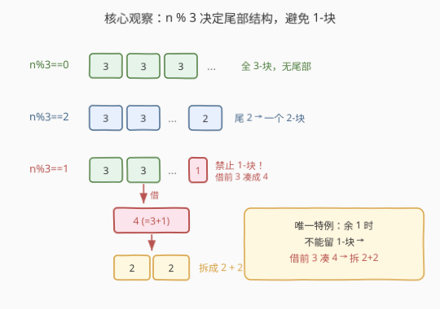
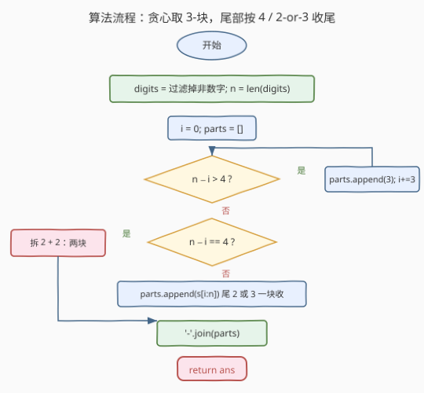
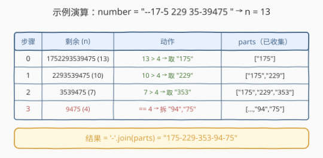

# LeetCode 重新格式化电话号码 题解

## 1. 题目概述

- **标题 / 题号**：重新格式化电话号码（#1694，easy）
- **链接**：https://leetcode.cn/problems/reformat-phone-number/
- **难度**：简单
- **标签**：字符串、模拟

**题意**：给定一个字符串形式的电话号码 `number`，由**数字**、空格 `' '` 和破折号 `'-'` 组成。要求按下述规则重新格式化：

1. **删除**所有空格和破折号，只保留数字；
2. 从左到右**每 3 个一组**分块，**直到**剩下 4 个或更少数字；
3. 剩余数字按下述规则再分块：
   - 2 个数字：一个 2-块；
   - 3 个数字：一个 3-块；
   - 4 个数字：**两个** 2-块。
4. 用破折号 `'-'` 连接所有块。

> ⚠️ **硬约束**：不允许出现仅含 1 个数字的块；最多允许两个 2-块。

**示例 1**：

```text
输入：number = "1-23-45 6"
输出："123-456"
解释：数字 "123456"，共 6 位 → 两个 3-块。
```

**示例 2**：

```text
输入：number = "123 4-567"
输出："123-45-67"
解释：数字 "1234567"，共 7 位 → 一个 3-块 + 尾 4 拆成 "45" 与 "67"。
```

**示例 3**：

```text
输入：number = "123 4-5678"
输出："123-456-78"
解释：数字 "12345678"，共 8 位 → 两个 3-块 + 尾 2-块 "78"。
```

**示例 4**：

```text
输入：number = "12"
输出："12"
```

**示例 5**：

```text
输入：number = "--17-5 229 35-39475 "
输出："175-229-353-94-75"
解释：数字 "1752293539475"，共 13 位 → 三个 3-块 + 尾 4 拆成 "94"、"75"。
```

**约束**：

- $2 \leq \text{number.length} \leq 100$
- `number` 由数字和 `'-'`、`' '` 组成
- `number` 中至少含 2 个数字

> 💡 **关键结构**：题目本质是「过滤 + 定长分块 + 尾部特判」。难点不在过滤，而在**尾部 4 的拆分**——这是唯一会破坏「全 3-块」节奏的情形。

## 2. 解题思路

### 2.1 暴力思路：完全模拟题目描述

最直接的做法是照搬题目文字：先把非数字字符删掉得到纯数字串 `digits`，然后**反复从左取 3 个**塞进结果列表，直到剩余 $\leq 4$，再对剩余的 2/3/4 分别套规则。这个思路正确但「机械」——它没有意识到**整个分块结构其实由数字总数 $n$ 唯一决定**，尾部分布可以提前算出来。

### 2.2 核心观察：尾部结构由 $n \bmod 3$ 唯一决定



设纯数字串长度为 $n$。按「每 3 一组」从左切，尾部剩余位数由 $n \bmod 3$ 决定：

| $n \bmod 3$ | 尾部剩余 | 处理 | 说明 |
|-------------|----------|------|------|
| $0$ | $0$ | 无尾部 | 全部是 3-块，完美 |
| $2$ | $2$ | 一个 2-块 | 合法，直接收尾 |
| $1$ | $1$ | **禁止 1-块！** | 唯一特例 |

**特例的处理（核心）**：当 $n \bmod 3 = 1$ 时，尾部会剩 1 位——这是规则不允许的。解决办法是**从末尾的 3-块里「借」1 位过来**，把尾部凑成 $1 + 3 = 4$ 位，再按规则把 4 拆成 $2 + 2$。

> 💡 **为什么是 4 → 2+2 而不是别的？** 因为 4 是最小的、能被 2 整除且不产生 1-块的数。拆成 2+2 既满足「无 1-块」，又满足「最多两个 2-块」（恰好用满配额）。这是题目规则的内在必然性，不是任意规定。

> ⚠️ 注意「借位」是**逻辑上的**——实现时不需要真的移动字符，只要在取 3-块时**提前停 4 位**，把最后 4 位单独按 2+2 处理即可。等价地：$n \bmod 3 = 1$ 时，前 $n - 4$ 位每 3 一组，末 4 位拆 2+2。

于是贪心模拟可以写得很简洁：维护游标 $i$，**只要剩余 $> 4$ 就取 3-块**；剩余 $\leq 4$ 时：

- 剩 4：拆成两个 2-块；
- 剩 2 或 3：作为一个块收尾。

### 2.3 算法流程图



1. **过滤**：`digits = [c for c in number if c.isdigit()]`，记 $n = |\text{digits}|$
2. **初始化**：`parts = []`，游标 `i = 0`
3. **循环** `while i < n`：
   - 若 $n - i == 4$：追加 `digits[i:i+2]`、`digits[i+2:i+4]`，`i += 4`
   - 否则若 $n - i < 4$（即 2 或 3）：追加 `digits[i:n]`，`i = n`
   - 否则（$n - i > 4$）：追加 `digits[i:i+3]`，`i += 3`
4. **返回** `'−'.join(parts)`

> 💡 **判断顺序很关键**：必须**先判 `== 4`** 再判 `< 4`。因为 4 既「$\leq 4$」又需要特殊拆分，若先命中 `< 4` 分支会把 4 当成一个整块，违反「4 必须拆 2+2」。

### 2.4 示例演算

以示例 5 `number = "--17-5 229 35-39475 "` 为例，过滤后 `digits = "1752293539475"`，$n = 13$：



| 步骤 | 剩余 (n−i) | 动作 | parts |
|------|-----------|------|-------|
| 0 | 13 | $13 > 4$ → 取 `"175"` | `["175"]` |
| 1 | 10 | $10 > 4$ → 取 `"229"` | `["175","229"]` |
| 2 | 7 | $7 > 4$ → 取 `"353"` | `["175","229","353"]` |
| 3 | 4 | $== 4$ → 拆 `"94"`、`"75"` | `["175","229","353","94","75"]` |

最终 `'-'.join(parts) = "175-229-353-94-75"`，与期望一致。注意步骤 3 正是 $n \bmod 3 = 1$ 触发的「4 → 2+2」特例。

## 3. 参考代码

### Python（贪心模拟）

```python
class Solution:
    def reformatNumber(self, number: str) -> str:
        s = [c for c in number if c.isdigit()]
        n = len(s)
        parts, i = [], 0
        while i < n:
            if n - i == 4:              # 剩 4：拆成 2 + 2
                parts.append(''.join(s[i:i+2]))
                parts.append(''.join(s[i+2:i+4]))
                i += 4
            elif n - i < 4:             # 剩 2 或 3：一块收尾
                parts.append(''.join(s[i:]))
                i = n
            else:                       # 剩 > 4：取 3-块
                parts.append(''.join(s[i:i+3]))
                i += 3
        return '-'.join(parts)
```

### C++（贪心模拟）

```cpp
class Solution {
public:
    string reformatNumber(string number) {
        string s;
        for (char c : number) if (isdigit(c)) s.push_back(c);
        int n = s.size(), i = 0;
        vector<string> parts;
        while (i < n) {
            if (n - i == 4) {                        // 剩 4：拆 2 + 2
                parts.push_back(s.substr(i, 2));
                parts.push_back(s.substr(i + 2, 2));
                i += 4;
            } else if (n - i < 4) {                  // 剩 2 或 3：一块收尾
                parts.push_back(s.substr(i));
                i = n;
            } else {                                 // 剩 > 4：取 3-块
                parts.push_back(s.substr(i, 3));
                i += 3;
            }
        }
        string ans;
        for (int k = 0; k < (int)parts.size(); ++k) {
            if (k) ans += "-";
            ans += parts[k];
        }
        return ans;
    }
};
```

> 💡 **实现细节**：① 过滤用 `isdigit`，比手写 `'0' <= c && c <= '9'` 更可读且兼容 locale。② Python 中 `s[i:]` 自动截到末尾，等价于 C++ 的 `s.substr(i)`（缺省第二参数即到尾）。③ 判断顺序 `==4` → `<4` → `else` 不能换，理由见 2.3。

## 4. 复杂度分析

| 维度 | 复杂度 | 说明 |
|------|--------|------|
| 时间 | $O(n)$ | 过滤一遍 $O(n)$ + 分块遍历一遍 $O(n)$ + join $O(n)$；每字符常数次切片 |
| 空间 | $O(n)$ | `parts` 列表与最终字符串均与 $n$ 同阶；不计输出则为 $O(n)$ 缓冲 |

> 💡 约束 $n \leq 100$，最大操作数约几百次，远低于时限。即便 $n$ 放大到 $10^6$，$O(n)$ 仍轻松通过——本题瓶颈在常数而非渐近复杂度。

## 5. 扩展：用 $n \bmod 3$ 闭式分类一步到位

2.2 节指出尾部结构由 $n \bmod 3$ 唯一决定，可直接据此分类，**无需在循环里反复判断剩余量**：

```python
class Solution:
    def reformatNumber(self, number: str) -> str:
        s = ''.join(c for c in number if c.isdigit())
        n = len(s)
        i, parts = 0, []
        if n % 3 == 1:                      # 尾 4 → 拆 2+2，前段每 3
            while i < n - 4:
                parts.append(s[i:i+3]); i += 3
            parts.append(s[i:i+2])
            parts.append(s[i+2:i+4])
        elif n % 3 == 2:                    # 尾 2，前段每 3
            while i < n - 2:
                parts.append(s[i:i+3]); i += 3
            parts.append(s[i:i+2])
        else:                               # n % 3 == 0，全 3
            while i < n:
                parts.append(s[i:i+3]); i += 3
        return '-'.join(parts)
```

**两种写法对比**：

| 维度 | 贪心 while 循环 | $n \bmod 3$ 闭式 |
|------|----------------|------------------|
| 思路 | 模拟题目描述，直觉清晰 | 数学分类，结构提前确定 |
| 循环内判断 | 每轮 2 次比较 | 0 次（分类后纯切分） |
| 可读性 | 更贴近题面 | 更体现「为什么」 |
| 正确性风险 | 判断顺序易写错（`==4` 须先判） | 分类互斥，不易错 |

> 💡 面试时建议先讲贪心模拟（贴合题意、易沟通），再用 $n \bmod 3$ 闭式作为「优化/洞察」收尾——既展示模拟能力，又展示数学抽象能力。

## 6. 面试要点

**Q1：为什么 $n \bmod 3 = 1$ 时要「借前 3 凑成 4」而不是直接留一个 1-块？**
> 规则明确禁止 1-块。余 1 时尾部剩 1 位，无法独立成块；从末尾 3-块借 1 位凑成 4，再拆成 2+2，是唯一既消除 1-块、又不超过「两个 2-块」上限的方案。拆成 2+2 恰好用满两个 2-块配额，是规则的内在必然。

**Q2：贪心 while 循环里判断顺序能换吗？**
> 不能。必须先判 `n - i == 4` 再判 `n - i < 4`。4 既满足「$\leq 4$」又需要拆成 2+2；若先命中 `< 4` 分支会把 4 当整块输出，违反规则。若把 `< 4` 写成 `<= 4` 同样会误吞 4。正确写法是三段互斥：`==4` / `<4`（此时只能是 2 或 3）/ `else`（>4）。

**Q3：贪心模拟和 $n \bmod 3$ 闭式分类，哪个更好？**
> 渐近复杂度相同，都是 $O(n)$ 时间、$O(n)$ 空间。贪心模拟贴题面、易沟通，适合先讲；闭式分类把尾部结构提前算清，循环内零判断，常数更小且不易写错顺序。两者本质等价——闭式只是把「逐轮判断剩余量」上提为「一次性分类」。

**Q4：如果块大小从 3 改成可配置的 $K$（尾部规则类似：禁 1-块、允许至多 $K-1$ 个小块），如何扩展？**
> 核心仍是 $n \bmod K$ 分类。余 $r \in \{0, \dots, K-1\}$，其中 $r = 1$ 是唯一特例：借前 $K$ 凑成 $K+1$，再拆成两个合法小块（如 $K=3$ 时 $4 \to 2+2$；$K=4$ 时 $5 \to 2+3$）。其余 $r$ 直接作为一个 $r$-块收尾。这是一道很好的「参数化推广」面试追问。

**Q5：为什么要先过滤非数字再分块，而不是边扫描边分块？**
> 分块规则依赖**总数字数 $n$**（决定尾部是 2、3 还是 4 → 2+2）。若边扫描边分块，$n$ 未知，无法判断当前是否进入尾部特例区。先过滤得到 $n$，整个结构随即确定——这是「先量化再决策」的典型模式，也使代码更清晰。

> 💡 **一句话总结**：1694 是「过滤 + 定长分块 + 尾部特判」的字符串模拟题，唯一非平凡点是 $n \bmod 3 = 1$ 时把尾 4 拆成 2+2 以避免 1-块。$O(n)$ 时间、$O(n)$ 空间，核心是判断顺序与尾部分类。

## 同类练习题

| # | 题目 | 与本题的关联 |
|---|------|-------------|
| 1662 | [检查两个字符串数组是否相等](https://leetcode.cn/problems/check-if-two-string-arrays-are-equivalent/) | 字符串拼接规整后比较，同样涉及「先把碎片拼成整体再处理」 |
| 2109 | [向字符串添加空格](https://leetcode.cn/problems/adding-spaces-to-a-string/) | 在指定位置插入分隔符，与本题「用 `-` 连接块」互为正反操作 |
| 2129 | [将标题首字母大写](https://leetcode.cn/problems/capitalize-the-title/) | 字符串重新格式化，按规则改写并控制输出形态 |
| 1614 | [括号嵌套的最大深度](https://leetcode.cn/problems/maximum-nesting-depth-of-the-parentheses/) | 同区间简单字符串扫描，单遍遍历维护状态 |
| 1684 | [统计一致字符串的数目](https://leetcode.cn/problems/count-the-number-of-consistent-strings/) | 同区间同难度的字符串过滤题，对照「过滤」这一步的不同用法 |
