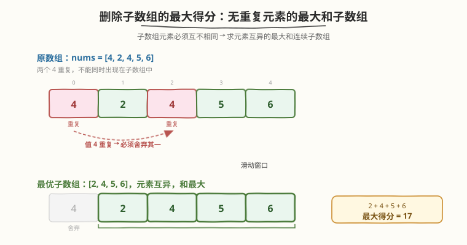
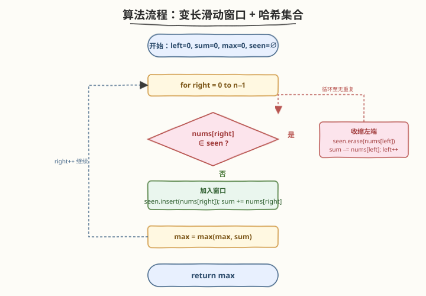

# LeetCode 删除子数组的最大得分 题解

## 1. 题目概述

- **标题 / 题号**：删除子数组的最大得分（#1695，medium）
- **链接**：https://leetcode.cn/problems/maximum-erasure-value/
- **难度**：中等
- **标签**：数组、滑动窗口、哈希表

**题意**：给你一个正整数数组 `nums`，请你从中删除一个含有**若干不同元素**的子数组。删除子数组的**得分**就是子数组各元素之**和**。返回**只删除一个**子数组可获得的**最大得分**。

子数组定义为原数组中连续的一段 `a[l], a[l+1], ..., a[r]`。

**示例 1**：

```text
输入：nums = [4,2,4,5,6]
输出：17
解释：最优子数组是 [2,4,5,6]，元素互异，和 = 2+4+5+6 = 17。
```

**示例 2**：

```text
输入：nums = [5,2,1,2,5,2,1,2,5]
输出：8
解释：最优子数组是 [5,2,1] 或 [1,2,5]，和 = 8。
```

**约束**：

- $1 \leq \text{nums.length} \leq 10^5$
- $1 \leq \text{nums}[i] \leq 10^4$

> 💡 关键约束是「**子数组元素必须互不相同**」与「**元素均为正**」。前者把问题归约为「求元素互异的最大和连续子数组」——这正是 [3. 无重复字符的最长子串] 的「求最长无重复子串」的求和版；后者保证窗口扩展时和单调递增，且「最大和」与「最长无重复子数组」在正数前提下等价。

## 2. 解题思路

### 2.1 暴力思路：枚举所有子数组

枚举所有连续子数组 `[l, r]`，对每个子数组检查元素是否互异（用哈希集合），若互异则计算和并更新最大值。共 $O(n^2)$ 个子数组，每个检查 $O(n)$，总时间 $O(n^3)$；若边扩展边查重可降到 $O(n^2)$。$n \leq 10^5$ 时不可行。

### 2.2 核心观察：滑动窗口 + 哈希集合



关键洞察是：**维护一个元素互异的窗口 `[left, right]`，当 `nums[right]` 已在窗口中出现时，从左端逐步收缩直到移除那个重复元素**。由于所有元素为正，窗口越宽和越大，因此不必担心「收缩后和反而更大」——每次收缩都是在剔除重复，是为了让窗口重新合法。

> 💡 **与 [3. 无重复字符的最长子串] 的关系**：3 题维护「无重复字符的最长窗口」，记录的是**长度**；本题维护「无重复元素的最大和窗口」，记录的是**元素和**。窗口的扩张/收缩逻辑完全一致，只是把 `max_len = max(max_len, right - left + 1)` 换成了 `max_sum = max(max_sum, window_sum)`。可以理解为 3 题的「求和变体」。

> ⚠️ **为什么正数前提重要？** 若数组含负数/零，「最大和」不再等价于「最长无重复子数组」——一个更短但含大正数的窗口可能优于更长但含小数的窗口。本题保证 $\text{nums}[i] \geq 1$，所以「尽可能宽的合法窗口」就是「最大和窗口」，收缩策略天然正确。

### 2.3 算法流程：变长滑动窗口



1. 初始化 `left = 0`，`window_sum = 0`，`max_sum = 0`，空哈希集合 `seen`。
2. 遍历 `right` 从 $0$ 到 $n-1$：
   - **去重收缩**：当 `nums[right]` 已在 `seen` 中时，循环执行 `seen.erase(nums[left])`、`window_sum -= nums[left]`、`left++`，直到 `nums[right]` 不再在 `seen` 中。
   - **加入窗口**：`seen.insert(nums[right])`，`window_sum += nums[right]`。
   - **更新答案**：`max_sum = max(max_sum, window_sum)`。
3. 返回 `max_sum`。

> 💡 **为何是 $O(n)$？** 虽然 `while` 循环看似可能嵌套，但 `left` 在整个过程中只从 $0$ 单调推进到 $n-1$，每个元素至多被「加入」和「移除」各一次，故两指针合计移动 $O(n)$ 次，均摊后每个 `right` 的摊还代价为 $O(1)$。

### 2.4 示例演算

![示例演算：nums=[4,2,4,5,6]](../images/max_erasure_value_example_walkthrough.svg)

以**示例 1** `nums = [4,2,4,5,6]` 为例：

| 步骤 | right | 动作 | 窗口 | window_sum | seen | max_sum |
|------|-------|------|------|-----------|------|---------|
| 1 | 0 | 加入 4 | [4] | 4 | {4} | 4 |
| 2 | 1 | 加入 2 | [4,2] | 6 | {4,2} | 6 |
| 3 | 2 | 4 ∈ seen → 移除 nums[0]=4，再加入 4 | [2,4] | 6 | {2,4} | 6 |
| 4 | 3 | 加入 5 | [2,4,5] | 11 | {2,4,5} | 11 |
| 5 | 4 | 加入 6 | [2,4,5,6] | 17 | {2,4,5,6} | 17 |

最终 `max_sum = 17`（子数组 `[2,4,5,6]`）。

## 3. 参考代码

### C++

```cpp
class Solution {
public:
    int maximumUniqueSubarray(vector<int>& nums) {
        unordered_set<int> seen;
        int left = 0, window_sum = 0, max_sum = 0;
        for (int right = 0; right < (int)nums.size(); ++right) {
            while (seen.count(nums[right])) {
                seen.erase(nums[left]);
                window_sum -= nums[left];
                ++left;
            }
            seen.insert(nums[right]);
            window_sum += nums[right];
            max_sum = max(max_sum, window_sum);
        }
        return max_sum;
    }
};
```

### Python

```python
class Solution:
    def maximumUniqueSubarray(self, nums: List[int]) -> int:
        seen = set()
        left = 0
        window_sum = 0
        max_sum = 0
        for right, val in enumerate(nums):
            while val in seen:
                seen.remove(nums[left])
                window_sum -= nums[left]
                left += 1
            seen.add(val)
            window_sum += val
            max_sum = max(max_sum, window_sum)
        return max_sum
```

## 4. 复杂度分析

| 维度 | 复杂度 | 说明 |
|------|--------|------|
| 时间复杂度 | $O(n)$ | `right` 从 $0$ 遍历到 $n-1$；`left` 同样单调推进，每个元素至多入窗/出窗各一次，两指针合计 $O(n)$ |
| 空间复杂度 | $O(n)$ | 哈希集合 `seen` 最坏存放全部 $n$ 个不同元素 |

> 💡 对比暴力 $O(n^2)$，滑动窗口利用「单调双指针各走一次」把双重枚举压成单趟扫描。与 [3. 无重复字符的最长子串] 共用同一套「哈希集合 + 收缩左端」模板，只是优化目标从「最长长度」换成了「最大和」。

## 5. 扩展：哈希表存最新下标（跳跃式收缩）

上述写法用 `while` 逐步收缩左端。还有一种等价写法：用哈希表 `last_pos` 记录每个值**最近一次出现的下标**，遇到重复时直接把 `left` 跳到 `last_pos[val] + 1`，避免逐个弹出。但此时需同步维护 `window_sum` 的正确性——被跳过的元素不能再从 `window_sum` 中扣除，因此通常仍需配合前缀和或在跳跃时累减，实现稍复杂。两者时间复杂度同为 $O(n)$，集合版更直观、更贴合 [3. 无重复字符的最长子串] 的标准模板。

```python
def maximumUniqueSubarray(self, nums: List[int]) -> int:
    last_pos = {}          # 值 → 最近下标
    left = 0
    window_sum = 0
    max_sum = 0
    for right, val in enumerate(nums):
        if val in last_pos and last_pos[val] >= left:
            # 跳过 [left, last_pos[val]] 这一段，同步扣除和
            for i in range(left, last_pos[val] + 1):
                window_sum -= nums[i]
            left = last_pos[val] + 1
        last_pos[val] = right
        window_sum += val
        max_sum = max(max_sum, window_sum)
    return max_sum
```

> ⚠️ 上面的「跳跃版」内层 `for` 仍是均摊 $O(n)$（每个元素至多被跳过一次），但写法不如集合版简洁。更优雅的跳跃实现需引入前缀和数组 `pref`，用 `window_sum = pref[right+1] - pref[left]` 直接计算窗口和，从而做到真正的「$O(1)$ 跳跃」。

## 6. 面试要点

1. **如何把题目归约到滑动窗口？**

   - 题目要求「子数组元素互异 + 和最大」。元素互异 ⟺ 窗口内无重复值，可用哈希集合判重；和最大 ⟺ 在合法前提下窗口尽量宽（正数保证）。这正是 [3. 无重复字符的最长子串] 的求和变体，直接套用「遇重复收缩左端」的滑窗模板。

2. **为什么 `while` 收缩不会导致超时？**

   - `left` 在整个循环中只单调右移，从 $0$ 最多到 $n-1$，每个元素至多被加入和移除各一次。虽然 `while` 嵌套在 `for` 内，但总操作数为 $O(n)$，均摊到每个 `right` 为 $O(1)$。

3. **为什么元素必须为正？如果含负数怎么办？**

   - 正数保证「窗口越宽和越大」，因此收缩左端去掉重复后，窗口和一定不大于收缩前（在剔除元素），不存在「收缩后和反而变大」的反常情况。若含负数，「最大和无重复子数组」不再等价于「最长无重复子数组」，但滑动窗口仍可用于维护「无重复」这一约束——只是不能贪心地认为「越宽越好」，需要在所有合法窗口中取最大和，逻辑仍成立（每次合法窗口都更新 `max_sum`）。

4. **集合版和哈希表跳跃版有什么取舍？**

   - 集合版：写法直观、与 [3. 无重复字符的最长子串] 模板一致，`while` 逐个移除；哈希表跳跃版：`left` 直接跳到重复值之后，配合前缀和可 $O(1)$ 跳跃，但实现更复杂。两者时间同为 $O(n)$，面试中优先集合版，便于讲解和减少出 bug 风险。

5. **`max_sum` 初始化为 $0$ 安全吗？**

   - 安全。因为 $\text{nums}[i] \geq 1$，任何非空窗口的和都 $\geq 1 > 0$，所以 `max_sum = 0` 作为下界不会误判。若题目允许 $0$ 或负数，则应初始化为负无穷。

## 同类练习题

| # | 题目 | 与本题的关联 |
|---|------|-------------|
| 3 | [无重复字符的最长子串](https://leetcode.cn/problems/longest-substring-without-repeating-characters/) | 本题的「母题」，同为滑动窗口 + 哈希判重，但求最长长度而非最大和 |
| 209 | [长度最小的子数组](https://leetcode.cn/problems/minimum-size-subarray-sum/) | 变长滑窗求和（正数单调性），求最短而非最大，收缩与记录条件对称翻转 |
| 713 | [乘积小于 K 的子数组](https://leetcode.cn/problems/subarray-product-less-than-k/) | 变长滑窗维护乘积并计数，同为「正数单调性 + 双指针」范式 |
| 1658 | [将 x 减到 0 的最小操作数](https://leetcode.cn/problems/minimum-operations-to-reduce-x-to-zero/) | 变长滑窗求最长子数组（和为 target），同区间的滑动窗口姊妹题 |
