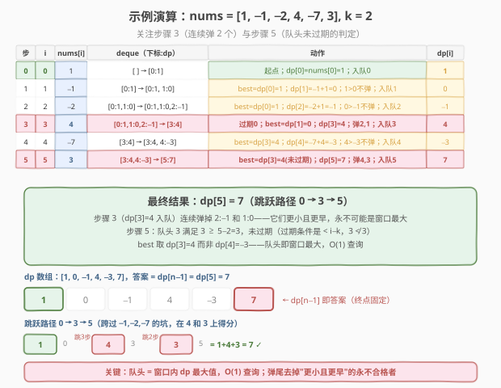

# 跳跃游戏 VI

- **题目名称**：跳跃游戏 VI
- **链接**：[1696. 跳跃游戏 VI](https://leetcode.cn/problems/jump-game-vi/)
- **难度**：中等
- **标签**：动态规划、单调队列、滑动窗口、数组

## 1. 题目概述

给定一个下标从 `0` 开始的整数数组 `nums` 和一个整数 `k`。一开始在下标 `0` 处，每一步最多可以往前跳 `k` 步（不能跳出数组边界），即从下标 `i` 可以跳到 $[i+1,\ \min(n-1,\ i+k)]$ 内的任意位置。目标是到达数组最后一个位置（下标 $n-1$），**得分**为经过的所有数字之和。求能得到的**最大得分**。

**示例 1**：

```text
输入：nums = [1,-1,-2,4,-7,3], k = 2
输出：7
解释：选择子序列 [1,-1,4,3]（加粗数字），和为 7。
      0→1(−1)→3(4)→5(3)，每步跨度 1、2、2，均 ≤ k=2。
```

**示例 2**：

```text
输入：nums = [10,-5,-2,4,0,3], k = 3
输出：17
解释：选择子序列 [10,4,3]（加粗数字），和为 17。
      0→3(4)→5(3)，跨度 3、2，均 ≤ k=3。
```

**示例 3**：

```text
输入：nums = [1,-5,-20,4,-1,3,-6,-3], k = 2
输出：0
解释：0→3(4)→5(3)→7(−3)，得分 1+4+3+(−3)=0；其它路径更差。
```

**约束条件**：

- $1 \le \text{nums.length},\ k \le 10^5$
- $-10^4 \le \text{nums}[i] \le 10^4$

> 💡 本题的灵魂是「**从 0 出发、跳跃步长 $\le k$、必须到达 $n-1$**」——把"任意路径"限制为"步长受限的路径"。翻译成 DP 语言：到达下标 $i$ 的最大得分 `dp[i]`，只依赖**前 $k$ 步范围内**的 `dp[j]`（$i-k \le j \le i-1$）的最大值。于是 `dp[i]` 的转移只依赖一个**长度为 $k$ 的滑动窗口内 `dp` 的最大值**——这正是 [239. 滑动窗口最大值](../0201-0300/239_滑动窗口最大值.md) 的单调队列场景，只是把"维护 `nums` 的窗口 max"换成"维护 `dp` 的窗口 max"。

---

## 2. 解题思路

### 2.1 暴力思路：DP + 线性扫描窗口

**状态定义**：`dp[i]` = 从下标 `0` 跳到下标 `i` 的**最大得分**（必须经过 `i`）。

**转移**：到达 `i` 的前一步可以是 $[i-k,\ i-1]$ 内的任意 $j$（且不能小于 $0$）。在所有合法前驱中取 `dp[j]` 最大的，再加上 `nums[i]`：

$$dp[i] = \text{nums}[i] + \max_{\max(0,\,i-k) \le j \le i-1} dp[j]$$

- 边界：$dp[0] = \text{nums}[0]$（起点固定，得分即 `nums[0]`）。
- 答案：$dp[n-1]$（终点固定，必须到达最后一个位置）。

> ⚠️ **与 [1425. 带限制的子序列和](../1401-1500/1425_带限制的子序列和.md) 的关键差异**：1425 的子序列可从任意位置开始、任意位置结束，故转移里有 $\max(0,\ \cdot)$ 表示"前驱全负时从 `nums[i]` 另起一段"，答案是 $\max_i dp[i]$。本题**起点固定为 0、终点固定为 $n-1$**——每一步都必须从某个前驱跳过来，**不存在"另起一段"的选项**，所以转移里没有 $\max(0,\ \cdot)$，只有 $\max dp[j]$；答案也固定为 $dp[n-1]$ 而非全局最大。可以把 1696 理解成 1425 的"强制从 0 走到 $n-1$"的**路径版**。

**暴力实现**：对每个 $i$，线性扫描窗口 $[\max(0,i-k),\ i-1]$ 求 $\max dp[j]$：

```text
dp[0] = nums[0]
for i = 1..n-1:
    best = -∞
    for j = max(0,i-k)..i-1:
        best = max(best, dp[j])
    dp[i] = nums[i] + best
return dp[n-1]
```

时间复杂度 $O(nk)$。本题 $n, k$ 均可达 $10^5$，最坏 $10^{10}$ 次运算，**严重超时**。

> ⚠️ 瓶颈在于"对每个 $i$ 重新求一遍窗口内 $dp$ 的最大值"。相邻 $i$ 的窗口只差一个元素（右端进一个、左端出一个），但暴力完全没复用——这正是 [239. 滑动窗口最大值](../0201-0300/239_滑动窗口最大值.md) 暴力 $O(nk)$ 的翻版。用**单调队列**维护窗口内 $dp$ 的最大值，可把每次查询降到均摊 $O(1)$。

### 2.2 核心观察：单调队列维护窗口内 dp 的最大值

![核心观察：dp[i] 依赖窗口 [i−k, i−1] 内 dp 最大值，单调队列 O(1) 取最大](../images/1696_concept.svg)

**关键定义**：用一个**双端队列**存下标，对应 $dp$ 值从队头到队尾**单调递减**。队头始终是当前窗口 $[i-k,\ i-1]$ 内 $dp$ 值最大的下标。

**两个操作**（与 239 完全同构，只是把 `nums` 换成 `dp`）：

1. **过期出队（左端）**：队头下标 $< i - k$（已滑出窗口），从队头弹出。
2. **入队弹尾（右端）**：新算出的 $dp[i]$ 入队前，从队尾弹出所有 $dp[\cdot] \le dp[i]$ 的下标——它们**更小且更早**，只要 $dp[i]$ 还在窗口里，这些旧值永远不可能成为最大，可安全丢弃。

**查询**：队头对应的 $dp[\text{front}]$ 即窗口最大值，$O(1)$ 取得。于是：

$$dp[i] = \text{nums}[i] + dp[\text{deque.front}]$$

> 💡 **为什么本题不需要 $\max(0,\ \cdot)$？** 因为起点固定为 0，每个 $i \ge 1$ 都必须从某个前驱 $j \in [i-k,\ i-1]$ 跳过来——窗口里至少有 $i-1$（上一步刚算出的），绝不会为空。没有"另起一段"的退路，所以直接取窗口最大值加上 `nums[i]` 即可。对比 1425 的子序列可以任意起点，才需要 $\max(0,\ \cdot)$ 兜底"单开一段"。

> 💡 **与 239 的同构关系**：239 维护的是"`nums` 的滑动窗口最大值"，本题维护的是"`dp` 的滑动窗口最大值"。两题的单调队列代码几乎一字不差——存下标、左端过期、右端弹尾、队头即最值。区别仅在于：239 的窗口是 $[i-k+1,\ i]$（含当前元素），本题的窗口是 $[i-k,\ i-1]$（不含当前，因为 $dp[i]$ 还没算出来），所以过期条件从 `front ≤ i - k` 变为 `front < i - k`。

### 2.3 算法流程图

![算法流程：遍历 → 过期出队 → 查询算 dp[i] → 入队弹尾 → 终点返回](../images/1696_algorithm_flow.svg)

**完整步骤**：

1. **初始化**：`dp[0] = nums[0]`，把下标 `0` 入队（队列初始含 `0`）。
2. 对 $i$ 从 $1$ 到 $n-1$ 循环：
   - **过期出队**：`while deque 非空 且 deque.front() < i - k：pop_front()`。
   - **查询并计算**：`best = dp[deque.front()]`（队列非空，因 $i-1$ 必在窗口内）；`dp[i] = nums[i] + best`。
   - **入队弹尾**：`while dp[deque.back()] ≤ dp[i]：pop_back()`；`push_back(i)`。
3. **返回** `dp[n-1]`。

> ⚠️ **顺序不能反**：先过期出队（清理窗口），再查询（此时队头是合法窗口内的最大），再算 $dp[i]$，最后入队弹尾（$dp[i]$ 供后续 $i$ 使用，不能提前入队否则会把自己也算进窗口）。与 239 的"先过期、再弹尾、后取值"一脉相承。

### 2.4 示例演算

以示例 1 `nums = [1, -1, -2, 4, -7, 3], k = 2` 为例：



| 步 | i | nums[i] | deque（下标:dp，入队后） | 动作 | dp[i] |
|----|---|---------|-------------------------|------|-------|
| 0 | 0 | 1 | `[0:1]` | 起点；$dp[0]=1$；入队 0 | 1 |
| 1 | 1 | −1 | `[0:1, 1:0]` | best=$dp[0]$=1；$dp[1]=-1+1=0$；$1>0$ 不弹；入队 1 | 0 |
| 2 | 2 | −2 | `[0:1, 1:0, 2:−1]` | best=$dp[0]$=1；$dp[2]=-2+1=-1$；$0>-1$ 不弹；入队 2 | −1 |
| 3 | 3 | 4 | `[3:4]` | 过期 0（$0<3-2$）；best=$dp[1]$=0；$dp[3]=4+0=4$；$-1\le4$ 弹 2；$0\le4$ 弹 1；入队 3 | 4 |
| 4 | 4 | −7 | `[3:4, 4:−3]` | best=$dp[3]$=4；$dp[4]=-7+4=-3$；$4>-3$ 不弹；入队 4 | −3 |
| 5 | 5 | 3 | `[5:7]` | best=$dp[3]$=4（$3 \ge 5-2$ 未过期）；$dp[5]=3+4=7$；$-3\le7$ 弹 4；$4\le7$ 弹 3；入队 5 | 7 |

**步骤 3 是关键**：$dp[3]=4$ 入队时连续弹掉 `2:−1` 和 `1:0`——它们都比 4 小且更早，只要下标 3 还在窗口内，这两个旧值永远不可能成为最大。弹掉后队头直接是 `[3:4]`，后续 $dp[4]$、$dp[5]$ 一查即得 4。

**步骤 5 的过期判定**：$i=5,\ k=2$ 时窗口为 $[5-2,\ 5-1]=[3,4]$，队头下标 3 满足 $3 \ge 5-2=3$，**未过期**（过期条件是 `front < i-k` 即 $< 3$，而 $3 \not< 3$）。故 best 取 $dp[3]=4$ 而非 $dp[4]=-3$——这正是单调队列"队头即窗口最大"的威力。

最终 $dp = [1, 0, -1, 4, -3, 7]$，答案 $= dp[5] = 7$，对应跳跃路径 $0 \to 3 \to 5$（跨过 $-1,-2$ 的坑，在 4 和 3 上得分）。

> 💡 每个下标入队 1 次、出队 1 次（弹尾或过期），总操作 $\le 2n$，与 239 的均摊分析完全一致。

---

## 3. 参考代码

### C++

```cpp
// 跳跃游戏 VI.cpp —— DP + 单调队列，O(n)
// 编译: g++ -O2 -std=c++17 跳跃游戏VI.cpp -o jg6
#include <vector>
#include <deque>
using namespace std;

class Solution {
public:
    int maxResult(vector<int>& nums, int k) {
        int n = nums.size();
        deque<int> dq;            // 存下标，对应 dp 值单调递减
        vector<int> dp(n);
        dp[0] = nums[0];
        dq.push_back(0);

        for (int i = 1; i < n; ++i) {
            // ① 过期出队：队头下标滑出窗口 [i-k, i-1]
            while (!dq.empty() && dq.front() < i - k) {
                dq.pop_front();
            }
            // ② 查询窗口内 dp 最大值，计算 dp[i]（队列必非空，i-1 在窗口内）
            dp[i] = nums[i] + dp[dq.front()];
            // ③ 入队弹尾：弹出所有 dp ≤ dp[i] 的（更小且更早，永不可能是最大）
            while (!dq.empty() && dp[dq.back()] <= dp[i]) {
                dq.pop_back();
            }
            dq.push_back(i);
        }
        return dp[n - 1];
    }
};
```

### Python

```python
from collections import deque

class Solution:
    def maxResult(self, nums: list[int], k: int) -> int:
        n = len(nums)
        dq = deque()               # 存下标，对应 dp 值单调递减
        dp = [0] * n
        dp[0] = nums[0]
        dq.append(0)

        for i in range(1, n):
            # ① 过期出队
            while dq and dq[0] < i - k:
                dq.popleft()
            # ② 查询窗口内 dp 最大值，计算 dp[i]
            dp[i] = nums[i] + dp[dq[0]]
            # ③ 入队弹尾
            while dq and dp[dq[-1]] <= dp[i]:
                dq.pop()
            dq.append(i)
        return dp[n - 1]
```

> 💡 **实现细节**：① 过期条件是 `front < i - k`（不是 `≤ i - k`），因为窗口是 $[i-k,\ i-1]$，下标 $i-k$ 仍合法（距 $i$ 恰好 $k$），只有 $< i-k$ 才过期——对比 239 的窗口 $[i-k+1,\ i]$ 用 `front ≤ i - k`。② 不需要 `max(0, best)`：起点固定 0，每个 $i \ge 1$ 的窗口必含 $i-1$，队列非空。③ 弹尾用 `≤` 而非 `<`：相同 $dp$ 值只保留最新的（旧的同值先过期，留着无意义），队列更紧凑，与 239 一致。

> 💡 **空间优化**：`dp` 数组可省去——在 deque 中存 `(下标, dp值)` 二元组即可同时判断过期与维护单调，空间降为 $O(k)$（队列最多存 $k$ 个元素）。但可读性略降，主代码保留 `dp` 数组以便对照转移式。

---

## 4. 复杂度分析

| 维度 | 单调队列 DP（主） | 暴力 DP | 堆 + 懒惰删除（第 5 节） |
|------|------------------|---------|--------------------------|
| 时间复杂度 | $O(n)$ | $O(nk)$ | $O(n \log n)$ |
| 空间复杂度 | $O(n)$（dp 数组）/ $O(k)$（优化） | $O(n)$ | $O(n)$ |
| 实际运算量 | $n=10^5$ 约 $2 \times 10^5$ 次操作，毫秒级 | 最坏 $10^{10}$，超时 | 约 $10^5 \log 10^5 \approx 1.7 \times 10^6$，毫秒级 |

> ⚠️ **均摊分析**：`while` 嵌套在 `for` 里看似 $O(nk)$，但每个下标至多入队 1 次、出队 1 次（弹尾或过期），两个 `while` 的总弹出次数 $\le 2n$，故总时间 $O(n)$。与 [239. 滑动窗口最大值](../0201-0300/239_滑动窗口最大值.md) 的均摊论证完全一致——这是所有单调结构的共性。

---

## 5. 扩展：堆 + 懒惰删除的 $O(n \log n)$ 解法

若不熟悉单调队列，可用**大顶堆**维护窗口内 $dp$ 的最大值：堆中存 `(dp值, 下标)`，每次取堆顶前检查下标是否过期（$< i-k$），过期则弹出（懒惰删除）。

```python
import heapq

class Solution:
    def maxResult(self, nums: list[int], k: int) -> int:
        n = len(nums)
        dp = [0] * n
        dp[0] = nums[0]
        heap = [(-dp[0], 0)]      # 大顶堆（存 -dp, 下标）
        for i in range(1, n):
            # 懒惰删除：弹出过期的堆顶
            while heap and heap[0][1] < i - k:
                heapq.heappop(heap)
            best = -heap[0][0]
            dp[i] = nums[i] + best
            heapq.heappush(heap, (-dp[i], i))
        return dp[n - 1]
```

堆的每次操作 $O(\log n)$，总 $O(n \log n)$。堆不利用"窗口连续滑动"的特性，过期元素只能堆积后批量清理，常数比单调队列大。但堆更通用（不要求窗口连续），适合"动态集合最值"场景。

> 💡 **单调队列 vs 堆**：当转移形如 $f(i) = g(i) + \max_{j \in \text{窗口}} f(j)$ 且窗口连续滑动时，单调队列 $O(n)$ 优于堆 $O(n \log n)$。若窗口不连续（如"满足某条件的所有历史状态"），则只能用堆或有序集合。本题窗口连续，单调队列是首选——这正是 239 的核心结论在 DP 上的直接应用。

> 💡 **与 1425 的对照**：把本题的 `dp[i] = nums[i] + dp[front]` 改成 `dp[i] = nums[i] + max(0, dp[front])`、把返回 `dp[n-1]` 改成 `max(dp)`，就变成了 [1425. 带限制的子序列和](../1401-1500/1425_带限制的子序列和.md)。两题共用同一套单调队列骨架，区别仅在「路径（固定首尾） vs 子序列（任意首尾）」。

---

## 6. 面试要点

1. **为什么状态定义为"到达下标 `i` 的最大得分"而不是"前 $i$ 个的最大得分"？**

   > 因为约束是"跳跃步长 $\le k$"，这个限制作用于**相邻两跳**，而非前缀整体。定义 `dp[i]` = 到达 `i` 的最大得分，则前一跳只能从 $[i-k,\ i-1]$ 中选，转移干净地依赖一个窗口。若定义"前 $i$ 个的最大得分"则无法表达"最后落在哪"的步长约束——缺少位置信息，转移不成立。

2. **为什么本题没有 $\max(0,\ \cdot)$，而 1425 有？**

   > 本题**起点固定为 0**，每个 $i \ge 1$ 都必须从某个前驱跳过来，没有"从 `nums[i]` 另起一段"的选项——窗口必含 $i-1$，队列非空，直接取最大值即可。1425 是子序列问题，可从任意位置开始，当前驱全负时不如单开一段，故需 $\max(0,\ \cdot)$ 兜底。这是"路径版 vs 子序列版"的本质差异。

3. **为什么用单调队列而不是堆或线段树？**

   > 单调队列 $O(n)$，堆 $O(n \log n)$，线段树 $O(n \log n)$。本题窗口**连续滑动**（$[i-k,\ i-1]$ 每步右移一位），单调队列能利用这一特性：新元素入队时批量弹掉比它小的旧元素，因为那些旧元素"更小且更早过期"，永不可能再成为最大。堆/线段树不利用窗口连续性，常数更大。当窗口连续滑动时，单调队列是最优选择。

4. **过期条件为什么是 `front < i - k` 而不是 `front ≤ i - k`？**

   > 窗口是 $[i-k,\ i-1]$，下标 $i-k$ 仍合法（距 $i$ 恰好 $k$）。只有 $< i-k$ 的才滑出窗口。对比 [239](../0201-0300/239_滑动窗口最大值.md) 的窗口 $[i-k+1,\ i]$（含当前元素），过期条件是 `front ≤ i - k`。两题窗口定义差 1，过期条件差一个等号——务必对齐自己代码里的窗口边界。

5. **弹尾条件为什么用 `≤` 而不是 `<`？**

   > 用 `≤`（弹掉"小或等"的）：相同 $dp$ 值只保留最新的一个，因为旧的同值下标先过期，留着它过期后还得再查下一个，不如现在弹掉。用 `<`（只弹严格更小）也能过，但队列更长。两种都正确，`≤` 更紧凑。与 239 一致。

> 💡 **一句话总结**：1696 的本质是"**DP 转移依赖滑动窗口内 $dp$ 的最大值**"——把跳跃步长 $\le k$ 的限制翻译成 `dp[i] = nums[i] + max{dp[j] : i-k ≤ j ≤ i-1}`，再用 [239. 滑动窗口最大值](../0201-0300/239_滑动窗口最大值.md) 的单调队列把窗口 max 查询从 $O(k)$ 降到均摊 $O(1)$，整体 $O(n)$。它是 [1425. 带限制的子序列和](../1401-1500/1425_带限制的子序列和.md) 的"固定首尾路径版"——去掉 $\max(0,\ \cdot)$、答案从 $\max(dp)$ 收窄为 $dp[n-1]$。

---

## 7. 同类练习题

- [239. 滑动窗口最大值](https://leetcode.cn/problems/sliding-window-maximum/)（[题解](../0201-0300/239_滑动窗口最大值.md)）：单调队列招牌题，维护 `nums` 的窗口 max；本题把 `nums` 换成 `dp`，代码几乎一字不差
- [1425. 带限制的子序列和](https://leetcode.cn/problems/constrained-subsequence-sum/)（[题解](../1401-1500/1425_带限制的子序列和.md)）：几乎同题的"子序列版"，转移多一个 $\max(0,\ \cdot)$、答案取 $\max(dp)$，对照理解"路径 vs 子序列"
- [53. 最大子数组和](https://leetcode.cn/problems/maximum-subarray/)（[题解](../0001-0100/53_最大子数组和.md)）：Kadane 算法，续接前一位的无约束版——本题续接窗口内最优前驱
- [45. 跳跃游戏 II](https://leetcode.cn/problems/jump-game-ii/)（[题解](../0001-0100/45_跳跃游戏II.md)）：同属"跳跃游戏"系列，但求最少跳跃次数（贪心），本题求最大得分（DP），对照"计数 vs 求和"的视角差异
- [1499. 满足不等式的最大值](https://leetcode.cn/problems/max-value-of-equation/)：单调队列优化 DP，队列维护形如 $y_j - x_j$ 的最值，与本题"维护 $dp$ 窗口 max"同属单调队列优化 DP 范式
