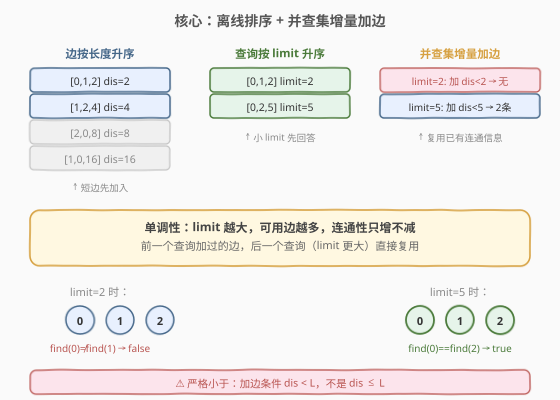
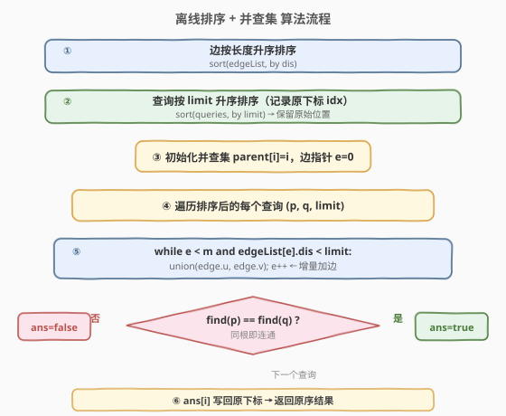
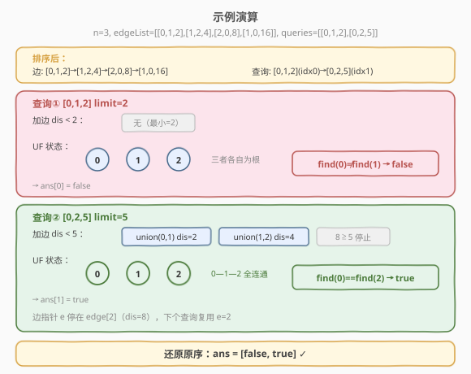

# LeetCode 检查边长度限制的路径是否存在 题解

## 1. 题目概述

- **标题 / 题号**：检查边长度限制的路径是否存在（#1697，hard）
- **链接**：https://leetcode.cn/problems/checking-existence-of-edge-length-limited-paths/
- **难度**：困难
- **标签**：并查集、离线查询、排序

**题意**：给你一个 `n` 个点组成的无向图边集 `edgeList`，其中 `edgeList[i] = [ui, vi, disi]` 表示点 `ui` 和点 `vi` 之间有一条长度为 `disi` 的边。两个点之间可能有**多条边**。

给你一个查询数组 `queries`，其中 `queries[j] = [pj, qj, limitj]`，对于每个查询，判断是否存在从 `pj` 到 `qj` 的路径，且这条路径上的每一条边都**严格小于** `limitj`。

返回布尔数组 `answer`，`answer[j]` 对应第 `j` 个查询的结果。

**示例 1**：

```text
输入：n = 3, edgeList = [[0,1,2],[1,2,4],[2,0,8],[1,0,16]], queries = [[0,1,2],[0,2,5]]
输出：[false,true]
解释：0 和 1 之间有两条重边，长度分别为 2 和 16。
- 查询 [0,1,2]：0 和 1 之间没有长度严格小于 2 的边 → false
- 查询 [0,2,5]：路径 0→1→2，两条边长度 2 和 4 都 < 5 → true
```

**示例 2**：

```text
输入：n = 5, edgeList = [[0,1,10],[1,2,5],[2,3,9],[3,4,13]], queries = [[0,4,14],[1,4,13]]
输出：[true,false]
解释：
- 查询 [0,4,14]：路径 0→1→2→3→4，四条边 10,5,9,13 都 < 14 → true
- 查询 [1,4,13]：路径 1→2→3→4，边 13 不满足 < 13 → false
```

**约束**：

- `2 <= n <= 10^5`
- `1 <= edgeList.length, queries.length <= 10^5`
- `edgeList[i].length == 3`，`queries[j].length == 3`
- `0 <= ui, vi, pj, qj <= n - 1`
- `ui != vi`，`pj != qj`
- `1 <= disi, limitj <= 10^9`
- 两个点之间可能有多条边

## 2. 解题思路

### 2.1 暴力思路

对每个查询 `[p, q, limit]`，在图中只保留长度 `< limit` 的边，然后从 `p` 出发做 BFS/DFS 看能否到达 `q`。单次查询 $O(n + m)$，共 $q$ 次查询总复杂度 $O(q \cdot (n+m))$，在 $n, m, q \le 10^5$ 时达到 $10^{10}$ 量级，**必然超时**。

问题出在「每个查询独立建图、独立搜索」——大量重复工作。突破口是：**把查询离线排序，让并查集增量加边，复用已有连通信息**。

### 2.2 核心观察：离线排序 + 并查集增量加边



关键观察：**查询只问「limit 之内能否连通」，而 limit 越大，可用的边越多，连通性只会增强不会减弱**——这是单调的。

因此可以：

1. **边按长度升序排序**：让短边先加入并查集。
2. **查询按 limit 升序排序**：让小 limit 的查询先回答。
3. **双指针扫描**：处理 limit 为 `L` 的查询时，把所有 `dis < L` 且尚未加入的边依次 `union` 进并查集，然后查 `find(p) == find(q)` 即可。

> 💡 关键直觉：排序后，前一个查询加过的边对后一个查询（limit 更大）仍然有效，只需**追加**新解锁的边，不必重来。并查集的增量 `union` 天然支持这种「只加边、不删边」的场景，均摊 $O(\alpha)$。

> ⚠️ 注意题目要求「严格小于」：加边条件是 `dis < L`（不是 `dis <= L`）。若题目改为 `<= L`，只需把条件换成 `dis <= L`。

### 2.3 算法流程图



### 2.4 示例演算



以 `n = 3, edgeList = [[0,1,2],[1,2,4],[2,0,8],[1,0,16]], queries = [[0,1,2],[0,2,5]]` 为例：

**准备阶段**：
- 边按长度排序：`[0,1,2] → [1,2,4] → [2,0,8] → [1,0,16]`
- 查询按 limit 排序（记录原下标）：`[0,1,2](idx=0) → [0,2,5](idx=1)`
- 初始 `parent = [0, 1, 2]`，边指针 `e = 0`

**处理查询 [0,1,2]（limit=2）**：
- 加边 `dis < 2`：`edge[0].dis=2`，`2 < 2` 为假，不加任何边。
- `find(0)=0`、`find(1)=1`，不同根 → `answer[0] = false`

**处理查询 [0,2,5]（limit=5）**：
- 加边 `dis < 5`：`edge[0].dis=2 < 5` → `union(0,1)`，`parent[1]=0`；`edge[1].dis=4 < 5` → `union(1,2)`，`parent[2]=0`；`edge[2].dis=8 < 5` 为假，停止。
- `find(0)=0`、`find(2)=0`，**同根** → `answer[1] = true`

**还原原序**：`answer = [false, true]`

## 3. 参考代码

### C++（离线排序 + 并查集 + 路径压缩 + 按秩合并）

```cpp
class UnionFind {
  public:
    vector<int> parent;
    vector<int> rank_;

    UnionFind(int n) {
        parent.resize(n);
        rank_.assign(n, 0);
        for (int i = 0; i < n; i++) parent[i] = i;
    }

    int find(int x) {
        if (parent[x] != x) parent[x] = find(parent[x]);   // 路径压缩
        return parent[x];
    }

    void unite(int x, int y) {
        int rx = find(x), ry = find(y);
        if (rx == ry) return;
        if (rank_[rx] < rank_[ry]) parent[rx] = ry;        // 按秩合并
        else if (rank_[rx] > rank_[ry]) parent[ry] = rx;
        else { parent[ry] = rx; rank_[rx]++; }
    }
};

class Solution {
  public:
    vector<bool> distanceLimitedPathsExist(int n,
        vector<vector<int>>& edgeList,
        vector<vector<int>>& queries)
    {
        // 1. 边按长度升序排序
        sort(edgeList.begin(), edgeList.end(),
             [](const auto& a, const auto& b) { return a[2] < b[2]; });

        // 2. 查询按 limit 升序排序，记录原下标
        int q = queries.size();
        vector<int> idx(q);
        iota(idx.begin(), idx.end(), 0);
        sort(idx.begin(), idx.end(),
             [&](int i, int j) { return queries[i][2] < queries[j][2]; });

        // 3. 双指针：按 limit 升序处理查询，增量加边
        UnionFind uf(n);
        vector<bool> ans(q);
        int e = 0;
        int m = edgeList.size();
        for (int i : idx) {
            int p = queries[i][0], qi = queries[i][1], limit = queries[i][2];
            while (e < m && edgeList[e][2] < limit) {       // 严格小于
                uf.unite(edgeList[e][0], edgeList[e][1]);
                e++;
            }
            ans[i] = (uf.find(p) == uf.find(qi));           // 还原原序
        }
        return ans;
    }
};
```

### Python（离线排序 + 并查集 + 路径压缩）

```python
class Solution:
    def distanceLimitedPathsExist(self, n: int,
        edgeList: List[List[int]],
        queries: List[List[int]]) -> List[bool]:
        # 1. 边按长度升序
        edgeList.sort(key=lambda e: e[2])

        # 2. 查询按 limit 升序，记录原下标
        idx = sorted(range(len(queries)), key=lambda i: queries[i][2])

        # 3. 并查集
        parent = list(range(n))
        def find(x):
            while parent[x] != x:
                parent[x] = parent[parent[x]]               # 隔代压缩
                x = parent[x]
            return x
        def union(x, y):
            rx, ry = find(x), find(y)
            if rx != ry:
                parent[rx] = ry

        # 4. 双指针增量加边
        ans = [False] * len(queries)
        e = 0
        m = len(edgeList)
        for i in idx:
            p, q, limit = queries[i]
            while e < m and edgeList[e][2] < limit:         # 严格小于
                union(edgeList[e][0], edgeList[e][1])
                e += 1
            ans[i] = (find(p) == find(q))                   # 还原原序
        return ans
```

## 4. 复杂度分析

| 维度 | 复杂度 | 说明 |
|------|--------|------|
| 时间复杂度 | $O((m + q) \log m + q \log q + (m + q)\,\alpha(n))$ | 排序边 $O(m \log m)$、排序查询 $O(q \log q)$；双指针扫描每条边至多 `union` 一次、每条查询 `find` 两次，共 $O((m+q)\alpha(n))$ |
| 空间复杂度 | $O(n + q)$ | 并查集 `parent`/`rank` 各 $O(n)$；查询下标数组与答案数组各 $O(q)$ |

> 💡 当 $n, m, q \le 10^5$ 时，排序主导复杂度约 $10^5 \log 10^5 \approx 1.7 \times 10^6$，并查集部分近似线性，整体轻松通过。

## 5. 扩展：在线查询的困境与 Kruskal 重构树

1. **为什么必须离线？** 若查询必须按输入顺序即时回答（在线），排序就不可行——某个大 limit 查询加进所有短边后，后续小 limit 查询无法「撤回」已加的边。并查集只支持加边不支持删边。在线场景需要更高级的 **Kruskal 重构树**：按 Kruskal 顺序加边时为每次 `union` 创建虚点，最终树上的 LCA 权值即为两点间「瓶颈边」的最大值——查询 `max_edge(p, q) < limit` 等价于 LCA 权值 `< limit`，可在线 $O(\log n)$ 回答。

2. **重边处理**：两点间可能有多条边。并查集天然处理重边——短边先 `union` 成功后，同两点的长边 `union` 时已同根、直接跳过，无需去重。

3. **「严格小于」vs「小于等于」**：题目要求严格 `< limit`，加边条件用 `dis < L`。若改为 `<= limit`，条件换成 `dis <= L` 即可，其余不变。

## 6. 面试要点

1. **为什么要离线排序？不能逐个查询 BFS 吗？**

   - 逐个查询独立 BFS 每次 $O(n+m)$，$q$ 次查询 $O(q(n+m))$ 在 $10^5$ 规模下超时。离线排序后，边和查询都只遍历一次，并查集增量加边复用连通信息，总复杂度降至近似 $O((m+q)\alpha(n))$。

2. **为什么并查集适合这道题？**

   - 并查集擅长「只加边、不删边」的动态连通性查询。排序后 limit 递增，可用边单调增多，恰好是「只加不删」的场景。每次 `union` 均摊 $O(\alpha(n))$，比 BFS 重建图高效得多。

3. **双指针的终止条件为什么是 `dis < limit` 而不是 `dis <= limit`？**

   - 题目要求路径上每条边**严格小于** `limit`，所以只加入 `dis < limit` 的边。若用 `<=` 会把等于 limit 的边也算进去，导致误判 `true`。

4. **如何把排序后的答案还原到原始顺序？**

   - 排序查询时用下标数组 `idx` 记录原始位置，处理完按 `ans[i] = result` 写回，`i` 是原下标。这是离线查询的通用套路。

5. **边和查询的排序顺序可以反过来吗（降序）？**

   - 可以，但需要「反向」思考——从大 limit 开始，用全部边初始化并查集，然后按 limit 降序「删边」。但并查集不支持删边，所以降序不可行。升序是唯一可行的方向，因为只加不删。

## 同类练习题

| # | 题目 | 与本题的关联 |
|---|------|-------------|
| 547 | [省份数量](https://leetcode.cn/problems/number-of-provinces/)（[题解](../0501-0600/547_省份数量.md)） | 并查集基础模板，统计连通分量，本题的并查集底座 |
| 684 | [冗余连接](https://leetcode.cn/problems/redundant-connection/)（[题解](../0601-0700/684_冗余连接.md)） | 并查集逐条加边判环，与本题「增量加边」思想一致 |
| 1627 | [带阈值的图连通性](https://leetcode.cn/problems/graph-connectivity-with-threshold/) | 同为并查集 + 离线查询，用阈值筛选边后判连通，套路完全一致 |
| 1631 | [最小体力消耗路径](https://leetcode.cn/problems/path-with-minimum-effort/) | 并查集加边到起点终点连通，瓶颈边的权值即为答案，承接本题思路 |
| 1202 | [交换字符串中的元素](https://leetcode.cn/problems/smallest-string-with-swaps/) | 并查集合并可交换位置，同属一个连通分量的字符可任意排列 |
