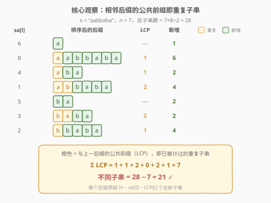
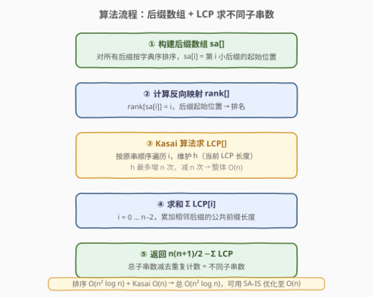
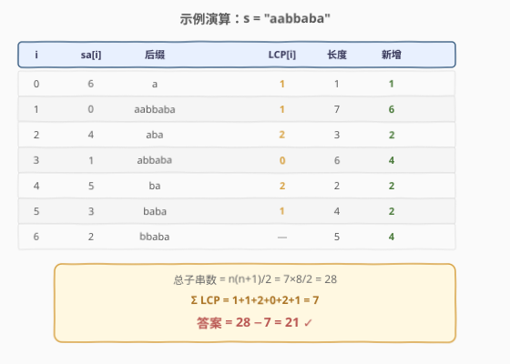

# LeetCode 字符串的不同子字符串个数 题解

## 1. 题目概述

- **标题 / 题号**：字符串的不同子字符串个数（#1698，medium）
- **链接**：https://leetcode.cn/problems/number-of-distinct-substrings-in-a-string/
- **难度**：中等
- **标签**：后缀数组、字符串、哈希函数、滚动哈希、字典树

**题意**：给定一个字符串 $s$，返回 $s$ 的**不同子字符串**的个数。

字符串的**子字符串**是由原字符串删除开头若干个字符（可能是 0 个）并删除结尾若干个字符（可能是 0 个）形成的字符串。本题只统计**非空**子串。

**示例 1**：

```text
输入：s = "aabbaba"
输出：21
解释：不同子字符串的集合是
  ["a","b","aa","bb","ab","ba","aab","abb","bab","bba","aba",
   "aabb","abba","bbab","baba","aabba","abbab","bbaba",
   "aabbab","abbaba","aabbaba"]
```

**示例 2**：

```text
输入：s = "abcdefg"
输出：28
解释：所有字符互不相同，每个子串都独一无二，共 7×8/2 = 28 个。
```

**约束**：

- $1 \le s.length \le 500$
- $s$ 由小写英文字母组成。

> **进阶**：你可以以 $O(n)$ 时间复杂度解决此问题吗？

> 💡 长度为 $n$ 的字符串共有 $\frac{n(n+1)}{2}$ 个非空子串。若全部互异（如示例 2），答案就是这个总数；有重复时需扣减。关键在于**高效统计重复**——这正是后缀数组 + LCP 的用武之地。

## 2. 解题思路

### 2.1 暴力思路：枚举所有子串去重

最直白的做法：双重循环枚举所有子串 $s[i:j]$，丢进哈希集合，最后返回集合大小。

```text
ss = set()
for i in 0..n-1:
    for j in i+1..n:
        ss.add(s[i:j])      # 子串切片 + 哈希
return |ss|
```

时间复杂度 $O(n^3)$：$\frac{n(n+1)}{2}$ 个子串，每个切片与哈希需 $O(n)$。对 $n \le 500$ 约 $1.25 \times 10^7$ 次操作，C++ 勉强可行（借助 `string_view` 免拷贝），Python 则偏慢。

> ⚠️ 这种「先全部生成再去重」的策略没有利用子串之间的**结构关系**。$O(n^3)$ 的瓶颈在于把每个子串当作独立对象处理——而实际上，子串是后缀的**前缀**，排序后缀后，重复子串会**聚集在相邻位置**。

### 2.2 核心观察：后缀数组 + LCP



关键洞察：**子串 = 某个后缀的前缀**。如果把所有后缀按字典序排序，那么相邻两个后缀的**最长公共前缀（LCP）**恰好衡量了它们有多少前缀（即子串）是重复的。

设排序后的后缀依次为 $\text{sa}[0], \text{sa}[1], \dots, \text{sa}[n-1]$，定义：

$$
\text{lcp}[i] = \text{LCP}(\text{suffix}(\text{sa}[i]),\; \text{suffix}(\text{sa}[i+1])), \quad i = 0, 1, \dots, n-2
$$

**核心结论**：

$$
\text{不同子串数} = \frac{n(n+1)}{2} - \sum_{i=0}^{n-2} \text{lcp}[i]
$$

> 💡 **为什么是对的？** 排序后，后缀 $\text{sa}[i]$ 贡献了 $n - \text{sa}[i]$ 个前缀（即子串）。其中前 $\text{lcp}[i-1]$ 个前缀已出现在上一个后缀中（是重复的），故**新增**的不同子串数为 $(n - \text{sa}[i]) - \text{lcp}[i-1]$。对所有后缀求和：
>
> $$\sum_{i=0}^{n-1} \bigl((n - \text{sa}[i]) - \text{lcp}[i-1]\bigr) = \frac{n(n+1)}{2} - \sum_{i=0}^{n-2} \text{lcp}[i]$$
>
> （约定 $\text{lcp}[-1] = 0$；第一项 $\text{lcp}[i-1]$ 的求和恰为 $\sum_{i=0}^{n-2}\text{lcp}[i]$，因为 $\text{lcp}[i]$ 是 $\text{sa}[i]$ 与 $\text{sa}[i+1]$ 的公共前缀，即 $\text{sa}[i+1]$ 的重复量。）

以 $s = \text{"aabbaba"}$ 为例，7 个后缀排序后为：

| 排序序号 | 起始位置 sa[i] | 后缀 | 与上一后缀的 LCP | 新增子串数 |
|---|---|---|---|---|
| 0 | 6 | `a` | — | 1 |
| 1 | 0 | `aabbaba` | 1 (`a`) | 6 |
| 2 | 4 | `aba` | 1 (`a`) | 2 |
| 3 | 1 | `abbaba` | 2 (`ab`) | 4 |
| 4 | 5 | `ba` | 0 | 2 |
| 5 | 3 | `baba` | 2 (`ba`) | 2 |
| 6 | 2 | `bbaba` | 1 (`b`) | 4 |

$\sum \text{lcp} = 1+1+2+0+2+1 = 7$，不同子串 $= 28 - 7 = 21$ ✓。

> ⚠️ **LCP 为什么只看「相邻」？** 排序保证：若后缀 $A$ 和 $C$ 有公共前缀 $p$，而 $A < B < C$（字典序），则 $B$ 也以 $p$ 为前缀（$B$ 介于 $A$、$C$ 之间，前缀必然与它们一致到 $|p|$ 位）。因此**非相邻**后缀的公共前缀已被相邻链传递覆盖，只需统计相邻对即可——这是 LCP 数组去重的数学根基。

### 2.3 算法流程图



流程要点：

1. **构建后缀数组** `sa[]`：对 $s$ 的所有后缀按字典序排序，`sa[i]` 存第 $i$ 小后缀的起始下标。朴素排序为 $O(n^2 \log n)$（$n \log n$ 次比较，每次比 $O(n)$ 字符）；对 $n \le 500$ 完全够用。进阶可用倍增法 $O(n \log^2 n)$ 或 SA-IS $O(n)$。
2. **计算反向映射** `rank[]`：`rank[sa[i]] = i`，即「起始下标 → 排名」，为 Kasai 算法服务。
3. **Kasai 算法求 LCP**：按**原串顺序**（$i$ 从 $0$ 到 $n-1$）遍历，维护当前公共前缀长度 $h$。利用 `rank` 找到 $i$ 的后继后缀，从 $h$ 处继续比较，无需从头。$h$ 每步至多 $+1$、总共至多 $+n$，故总比较次数 $\le 2n$，**整体 $O(n)$**。
4. **求和**：累加 $\text{lcp}[0..n-2]$。
5. **返回** $\frac{n(n+1)}{2} - \sum \text{lcp}$。

> 💡 **Kasai 的精妙**：朴素求 LCP 需对每对相邻后缀从头比较，$O(n^2)$。Kasai 的关键性质是 $\text{lcp}(\text{rank}[i]+1) \ge \text{lcp}(\text{rank}[i]) - 1$——去掉首字符后公共前缀至多缩短 1。因此维护 $h$ 只增不减（摊还 $O(n)$），是后缀数组领域的经典线性算法。

### 2.4 示例演算

以 $s = \text{"aabbaba"}$ 完整演算后缀数组 + LCP 的全过程：



**第 1 步 — 排序后缀**：

```text
原始后缀:        排序后:
0: aabbaba       sa[0]=6: a
1: abbaba        sa[1]=0: aabbaba
2: bbaba         sa[2]=4: aba
3: baba          sa[3]=1: abbaba
4: aba           sa[4]=5: ba
5: ba            sa[5]=3: baba
6: a             sa[6]=2: bbaba
```

**第 2 步 — Kasai 求 LCP**：

从 $i=0$（后缀 `aabbaba`，rank=1）出发，后继 `sa[2]=4`（`aba`），比较得 LCP=1。$h$ 减 1 赋给下一轮 $i=1$（后缀 `abbaba`，rank=3），后继 `sa[4]=5`（`ba`），从 $h=0$ 继续比较，LCP=0。依此类推：

```text
lcp = [1, 1, 2, 0, 2, 1]
```

**第 3 步 — 计算**：

$$
\text{答案} = \frac{7 \times 8}{2} - (1+1+2+0+2+1) = 28 - 7 = 21 \; ✓
$$

与示例 1 给出的 21 个不同子串完全吻合。

## 3. 参考代码

### C++

```cpp
class Solution {
  public:
    int countDistinct(string s) {
        int n = s.size();
        // 1. 构建后缀数组：对所有后缀按字典序排序
        vector<int> sa(n);
        iota(sa.begin(), sa.end(), 0);
        sort(sa.begin(), sa.end(), [&](int a, int b) {
            return string_view(s.data() + a, n - a) < string_view(s.data() + b, n - b);
        });
        // 2. 反向映射 rank[]
        vector<int> rank(n);
        for (int i = 0; i < n; ++i) rank[sa[i]] = i;
        // 3. Kasai 算法求 LCP 数组
        vector<int> lcp(n - 1);
        for (int i = 0, h = 0; i < n; ++i) {
            if (rank[i] == n - 1) { h = 0; continue; }
            int j = sa[rank[i] + 1];        // 排名后继的后缀起始位置
            while (i + h < n && j + h < n && s[i + h] == s[j + h]) ++h;
            lcp[rank[i]] = h;
            if (h > 0) --h;                 // 性质：下一轮 h 至少为 h-1
        }
        // 4. 答案 = 总子串数 - Σ LCP
        long long total = 1LL * n * (n + 1) / 2;
        for (int x : lcp) total -= x;
        return total;
    }
};
```

### Python

```python
class Solution:
    def countDistinct(self, s: str) -> int:
        n = len(s)
        # 1. 构建后缀数组
        sa = sorted(range(n), key=lambda i: s[i:])
        # 2. 反向映射 rank[]
        rank = [0] * n
        for i in range(n):
            rank[sa[i]] = i
        # 3. Kasai 算法求 LCP 数组
        lcp = [0] * (n - 1)
        h = 0
        for i in range(n):
            if rank[i] == n - 1:
                h = 0
                continue
            j = sa[rank[i] + 1]
            while i + h < n and j + h < n and s[i + h] == s[j + h]:
                h += 1
            lcp[rank[i]] = h
            if h > 0:
                h -= 1
        # 4. 答案 = 总子串数 - Σ LCP
        return n * (n + 1) // 2 - sum(lcp)
```

> 💡 **写法细节**：
> - **`string_view` 免拷贝**：C++ 用 `string_view(s.data() + a, n - a)` 比较后缀，避免 `s.substr()` 每次复制 $O(n)$ 字符。对 $n = 500$ 影响不大，但好习惯。
> - **Kasai 的 `h` 递减**：内层 `while` 结束后执行 `if (h > 0) --h`，利用 $\text{lcp}[\text{rank}[i]+1] \ge \text{lcp}[\text{rank}[i]] - 1$ 的性质，保证 $h$ 的总增量 $\le n$，从而整体 $O(n)$。
> - **`1LL` 防溢出**：`n * (n + 1)` 在 `int` 下 $n = 500$ 时不会溢出（$500 \times 501 = 250500$），但写成 `1LL *` 是计数题的安全习惯。

## 4. 复杂度分析

| 维度 | 复杂度 | 说明 |
|------|--------|------|
| 时间复杂度 | $O(n^2 \log n)$ | 朴素排序后缀 $O(n^2 \log n)$（$n\log n$ 次比较 × 每次 $O(n)$ 字符比较）+ Kasai LCP $O(n)$ |
| 空间复杂度 | $O(n)$ | 后缀数组 `sa`、`rank`、`lcp` 各 $O(n)$ |

> 💡 本题 $n \le 500$，$O(n^2 \log n) \approx 500^2 \times 9 \approx 2.25 \times 10^6$，远低于时限。若 $n$ 放大到 $10^5$，需改用倍增法（$O(n \log^2 n)$）或 SA-IS（$O(n)$）构建后缀数组，LCP 仍用 Kasai $O(n)$，整体线性/线性对数。

## 5. 扩展：字符串哈希与后缀自动机

### 5.1 字符串哈希 $O(n^2)$

将多项式哈希 $h[i] = (h[i-1] \cdot B + s[i]) \bmod M$ 预处理为前缀数组后，任意子串 $s[l..r]$ 的哈希值可在 $O(1)$ 内算出：

$$
\text{hash}(l, r) = h[r] - h[l-1] \cdot B^{r-l+1} \bmod M
$$

枚举所有 $O(n^2)$ 个子串，$O(1)$ 算哈希丢进集合即可。取 $B = 131$、$M = 2^{64}$（C++ 用 `unsigned long long` 自然溢出），冲突概率极低。

```cpp
class Solution {
  public:
    int countDistinct(string s) {
        using ull = unsigned long long;
        int n = s.size(), base = 131;
        vector<ull> h(n + 1), p(n + 1);
        p[0] = 1;
        for (int i = 0; i < n; ++i) {
            p[i + 1] = p[i] * base;
            h[i + 1] = h[i] * base + s[i];
        }
        unordered_set<ull> ss;
        for (int i = 1; i <= n; ++i)
            for (int j = i; j <= n; ++j)
                ss.insert(h[j] - h[i - 1] * p[j - i + 1]);
        return ss.size();
    }
};
```

> ⚠️ **哈希冲突**：单哈希在对抗数据下可被构造碰撞。稳妥做法是双哈希（$B_1=131, M_1=10^9+7$；$B_2=13331, M_2=10^9+9$），用 `(h1, h2)` pair 作为键。本题 $n \le 500$、非对抗环境，单哈希足矣。这与 [187. 重复的 DNA 序列](https://leetcode.cn/problems/repeated-dna-sequences/)（[题解](../0101-0200/187_重复的DNA序列.md)）的滚动哈希思路一脉相承。

### 5.2 后缀自动机 $O(n)$——满足进阶要求

题目进阶问能否 $O(n)$ 解决。**后缀自动机（SAM）**是正解：SAM 的每个状态 $v$ 对应一组子串，长度区间为 $(\text{len}(\text{link}(v)),\, \text{len}(v)]$，贡献 $\text{len}(v) - \text{len}(\text{link}(v))$ 个不同子串。对所有状态求和即为答案：

$$
\text{答案} = \sum_{v \neq \text{root}} \bigl(\text{len}(v) - \text{len}(\text{link}(v))\bigr)
$$

SAM 在线构建 $O(n)$，求和 $O(n)$，满足进阶的 $O(n)$ 要求。实现较后缀数组更重（状态转移表 + link 指针），适合作为进阶学习。另一个 $O(n)$ 方案是 **SA-IS 线性后缀数组 + Kasai LCP**，思路与本文一致，仅将排序换为线性构造。

> 💡 **三条路线对比**：
>
> | 方法 | 时间 | 空间 | 适用场景 |
> |------|------|------|----------|
> | 暴力枚举 + HashSet | $O(n^3)$ | $O(n^2)$ | $n \le 200$，面试快速写 |
> | 字符串哈希 | $O(n^2)$ | $O(n^2)$ | $n \le 5000$，实现简单 |
> | 后缀数组 + LCP | $O(n^2\log n)$ / $O(n)$ | $O(n)$ | $n \le 10^5$，LCP 去重优雅 |
> | 后缀自动机 SAM | $O(n)$ | $O(n)$ | $n \le 10^6$，进阶线性解 |

## 6. 面试要点

1. **为什么子串去重可以转化为后缀排序 + LCP？**

   - 子串 = 后缀的前缀。后缀排序后，相同前缀的后缀**相邻排列**，相邻后缀的 LCP 长度 = 重复前缀数。总子串数减去所有相邻 LCP 之和即为不同子串数。这是「排序使重复聚集，相邻统计即可覆盖全部重复」的经典范式。

2. **Kasai 算法为什么是 $O(n)$ 而不是 $O(n^2)$？**

   - 核心性质 $\text{lcp}[\text{rank}[i]+1] \ge \text{lcp}[\text{rank}[i]] - 1$：去掉首字符后，公共前缀至多缩短 1。维护的 $h$ 每轮至多 $+1$，全程至多 $+n$ 次，而 `--h` 也不超过 $n$ 次，故 `while` 的总执行次数 $\le 2n$，整体线性。

3. **只统计相邻 LCP 会遗漏吗？非相邻后缀的公共前缀怎么办？**

   - 不会遗漏。排序保证传递性：若 $\text{sa}[a] < \text{sa}[b] < \text{sa}[c]$ 且 $\text{sa}[a]$、$\text{sa}[c]$ 有长度 $k$ 的公共前缀，则 $\text{sa}[b]$ 也有（它排在中间，前 $k$ 个字符必然与两端一致）。因此非相邻的公共前缀被相邻链逐步传递覆盖，相邻 LCP 之最小值 = 任意距离的 LCP。

4. **字符串哈希什么时候比后缀数组更合适？**

   - $n$ 较小（$\le 5000$）且只需去重计数时，哈希实现更短、更不易出错。后缀数组的优势在于 LCP 还能回答「最长重复子串」「子串排名」等 richer 查询。对抗数据下哈希需双哈希防碰撞，后缀数组无此顾虑。

5. **进阶 $O(n)$ 有哪些方案？**

   - 两条路：① SA-IS 线性后缀数组 + Kasai LCP，思路与本文一致，仅将排序换为 $O(n)$ 构造；② 后缀自动机 SAM，每个状态贡献 $\text{len}(v) - \text{len}(\text{link}(v))$ 个新子串，求和即答案。两者均 $O(n)$ 时间空间。SAM 在线构建更适合流式数据，SA-IS 更适合配合 LCP 做后续分析。

## 同类练习题

| # | 题目 | 与本题的关联 |
|---|------|-------------|
| 187 | [重复的 DNA 序列](https://leetcode.cn/problems/repeated-dna-sequences/)（[题解](../0001-0100/187_重复的DNA序列.md)） | 滚动哈希 + 固定窗口去重，与本文字符串哈希解法同源，对照理解「哈希去重」的滑动窗口变体 |
| 1044 | [最长重复子串](https://leetcode.cn/problems/longest-duplicate-substring/) | 后缀数组 + LCP 求最长重复子串（$\max(\text{lcp}[i])$），与本题「$\sum \text{lcp}$ 去重」互为正反——一个求最长、一个求总和 |
| 718 | [最长重复子数组](https://leetcode.cn/problems/maximum-length-of-repeated-subarray/)（[题解](../0701-0800/718_最长重复子数组.md)） | 二维 DP 求两串最长公共子串，与 LCP「相邻后缀公共前缀」思想对照——单串 LCP 是双串公共子串的退化 |
| 1316 | [不同的循环子字符串](https://leetcode.cn/problems/distinct-echo-substrings/)（[题解](../1301-1400/1316_不同的循环子字符串.md)） | 滚动哈希去重计数，与本题「子串去重」主题一致但约束更强（回声结构），对照巩固哈希去重模板 |
| 1692 | [计算分配糖果的不同方式](https://leetcode.cn/problems/count-ways-to-distribute-candies/)（[题解](../1601-1700/1692_计算分配糖果的不同方式.md)） | 同为 16xx 区间的计数题，对照「组合计数 DP」与本题「后缀结构计数」两种去重计数范式 |
