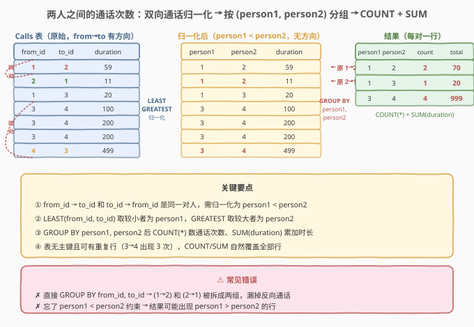
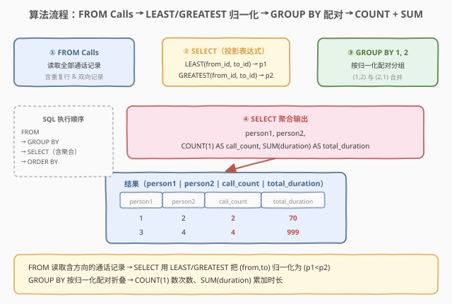
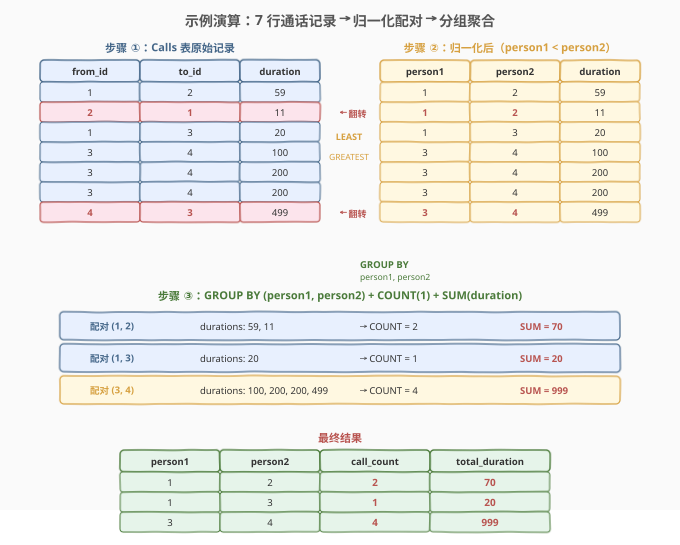

# LeetCode 两人之间的通话次数 题解

## 1. 题目概述

- **标题 / 题号**：两人之间的通话次数（#1699，medium）
- **链接**：https://leetcode.cn/problems/number-of-calls-between-two-persons/
- **难度**：中等
- **标签**：数据库、SQL、`GROUP BY`、`COUNT`、`SUM`、`LEAST`/`GREATEST`、双向归一化、`IF`/`CASE`、`UNION ALL`、LeetCode 锁题

**题意**：给定 `Calls`（通话记录）表，每行记录一次通话的发起方 `from_id`、接收方 `to_id` 和通话时长 `duration`。同一对人之间的通话可能以任意方向记录（A 打给 B 或 B 打给 A 均算同一对人）。编写 SQL 查询，报告**每对人**之间的**通话次数**与**总通话时长**，输出列 `(person1, person2, call_count, total_duration)`，其中 `person1 < person2`。结果顺序任意。

**表结构**：

```text
Table: Calls
+-------------+---------+
| Column Name | Type    |
+-------------+---------+
| from_id     | int     |  ← 发起方
| to_id       | int     |  ← 接收方
| duration    | int     |  ← 通话时长（秒）
+-------------+---------+
此表无主键，可能包含重复行。
每行记录 from_id 与 to_id 之间的一次通话时长。
from_id != to_id（不会自己打给自己）。
```

**示例 1**：

```text
输入：
Calls 表:
+---------+-------+----------+
| from_id | to_id | duration |
+---------+-------+----------+
| 1       | 2     | 59       |
| 2       | 1     | 11       |
| 1       | 3     | 20       |
| 3       | 4     | 100      |
| 3       | 4     | 200      |
| 3       | 4     | 200      |
| 4       | 3     | 499      |
+---------+-------+----------+

Result 表:
+---------+---------+------------+----------------+
| person1 | person2 | call_count | total_duration |
+---------+---------+------------+----------------+
| 1       | 2       | 2          | 70             |
| 1       | 3       | 1          | 20             |
| 3       | 4       | 4          | 999            |
+---------+---------+------------+----------------+
```

**解释**：

| 配对 | 含通话 | call_count | total_duration |
|------|--------|------------|----------------|
| (1, 2) | 1→2(59s) + 2→1(11s) | 2 | 59 + 11 = 70 |
| (1, 3) | 1→3(20s) | 1 | 20 |
| (3, 4) | 3→4(100s) + 3→4(200s) + 3→4(200s) + 4→3(499s) | 4 | 100 + 200 + 200 + 499 = 999 |

> 💡 **关键结构**：`Calls` 表的 `from_id`/`to_id` 有方向性——`1→2` 和 `2→1` 是同一对人之间的通话，但被记录为两行不同的 `(from_id, to_id)`。必须先把双向配对**归一化**为 `person1 < person2` 的统一形式，再按配对分组聚合。本质是「**双向归一化 + GROUP BY 配对 + COUNT/SUM 聚合**」三连。

**约束**：

- `Calls` 表无主键，可能包含完全相同的重复行（如 `3→4, 200` 出现两次）
- `from_id != to_id`
- 结果要求 `person1 < person2`
- 结果顺序任意

> 💡 本题是 SQL **"双向配对归一化"招牌题**——核心难点不在聚合本身，而在于识别出 `from_id → to_id` 和 `to_id → from_id` 是同一对人，需要用 `LEAST`/`GREATEST`（或 `IF`/`CASE`）把两个 ID 归一化为 `person1 < person2` 的统一形式后再分组。最大坑点：直接 `GROUP BY from_id, to_id` 会把同一对人的双向通话拆成两组，漏掉一半数据。

## 2. 解题思路

### 2.1 暴力思路：逐对扫描累加

最直觉的过程式思路：遍历所有出现过的用户 ID 对，对每对人 `(a, b)`（`a < b`），去 `Calls` 表里捞所有 `(from_id=a AND to_id=b)` 或 `(from_id=b AND to_id=a)` 的行，计数并累加时长。伪代码：

```text
result = []
pairs = set of (min(f,t), max(f,t)) for each row in Calls
for (a, b) in pairs where a < b:
    count = 0
    total = 0
    for row in Calls where (from=a AND to=b) OR (from=b AND to=a):
        count += 1
        total += row.duration
    result.append((a, b, count, total))
```

逻辑正确，但**纯 SQL 没有显式逐行循环**——"把双向配对归一化后分组累加"正是 `GROUP BY` + 聚合函数的天然语义。关键在于先用表达式把 `(from_id, to_id)` 映射为 `(LEAST, GREATEST)` 归一化形式，再交给 SQL 引擎一次扫描完成分组聚合。

### 2.2 核心观察：LEAST/GREATEST 归一化 + GROUP BY 配对



**问题拆解为三个子问题**：

1. **归一化配对**：`LEAST(from_id, to_id) AS person1, GREATEST(from_id, to_id) AS person2`。`LEAST` 取两 ID 中较小者为 `person1`，`GREATEST` 取较大者为 `person2`——无论原始方向是 `1→2` 还是 `2→1`，归一化后都变成 `(1, 2)`。这是本题的核心转换。

   $$
   \text{person1} = \min(\text{from\_id}, \text{to\_id}),\quad \text{person2} = \max(\text{from\_id}, \text{to\_id})
   $$

2. **分组**：`GROUP BY person1, person2`（或 `GROUP BY 1, 2` 按列位置）。把归一化后相同的配对归到一组——`(1→2, 59)` 和 `(2→1, 11)` 归一化后都是 `(1, 2)`，故被合并到同一组。

3. **聚合**：`COUNT(1) AS call_count, SUM(duration) AS total_duration`。每组对通话次数计数、对时长求和。一个 `SELECT` 同时写 `COUNT` 和 `SUM`，引擎在一次分组扫描中并行完成两个聚合。

> ⚠️ **为何不能直接 `GROUP BY from_id, to_id`**：`from_id → to_id` 有方向性——`1→2` 和 `2→1` 会被当作两个不同的 `(from_id, to_id)` 组，各自独立计数。结果会出现 `(1, 2, 1, 59)` 和 `(2, 1, 1, 11)` 两行，而非合并的 `(1, 2, 2, 70)` 一行。**归一化是本题不可省略的第一步**——先消除方向性，再分组。

> 💡 **`LEAST`/`GREATEST` 的本质**：它们是 SQL 标准的多元取小/取大函数，`LEAST(a, b) = \min(a, b)`、`GREATEST(a, b) = \max(a, b)`。在本题中用于把无序的 `(from_id, to_id)` 对映射为有序的 `(person1, person2)` 对（`person1 < person2`），消除方向性。等价写法有 `IF(from_id < to_id, from_id, to_id)` / `CASE WHEN from_id < to_id THEN from_id ELSE to_id END`（见解法 B）。

### 2.3 算法流程图



**逻辑执行步骤**（注意 SQL 子句执行顺序与书写顺序不同）：

| 步骤 | 子句 | 作用 | 本题对应 |
|------|------|------|----------|
| ① | `FROM Calls` | 读取全部通话记录 | 含重复行和双向记录 |
| ② | `SELECT LEAST(...) AS person1, GREATEST(...) AS person2` | 投影归一化表达式 | 消除 from/to 方向性 |
| ③ | `GROUP BY 1, 2` | 按归一化配对分组 | `(1→2)` 与 `(2→1)` 合并为一组 |
| ④ | `COUNT(1) AS call_count, SUM(duration) AS total_duration` | 聚合输出 | 每组数次数、累加时长 |

> 💡 **SQL 子句执行顺序**：`FROM` → `GROUP BY` → `SELECT`（含 `COUNT`/`SUM`）→ `ORDER BY`。`GROUP BY` 在 `SELECT` 之前执行——但 MySQL 允许 `GROUP BY 1, 2` 引用 `SELECT` 中的列位置（别名位置），优化器会先解析 `SELECT` 表达式再执行 `GROUP BY`。也可直接 `GROUP BY LEAST(from_id, to_id), GREATEST(from_id, to_id)` 显式写出表达式，但 `GROUP BY 1, 2` 更简洁。本题无 `WHERE`/`HAVING`/`ORDER BY`——所有行都参与统计，结果顺序任意。

### 2.4 示例演算

以示例 1 的 7 行通话记录为例，观察「归一化配对 → 分组聚合」的逐步过程：



**步骤 ①②：原始记录 → LEAST/GREATEST 归一化**

| 原始 (from→to, dur) | person1 = LEAST | person2 = GREATEST | duration | 备注 |
|---------------------|-----------------|---------------------|----------|------|
| (1→2, 59) | 1 | 2 | 59 | 正常 |
| (2→1, 11) | **1** | **2** | 11 | **翻转**（2>1 故 LEAST=1） |
| (1→3, 20) | 1 | 3 | 20 | 正常 |
| (3→4, 100) | 3 | 4 | 100 | 正常 |
| (3→4, 200) | 3 | 4 | 200 | 重复行 |
| (3→4, 200) | 3 | 4 | 200 | 重复行 |
| (4→3, 499) | **3** | **4** | 499 | **翻转**（4>3 故 LEAST=3） |

> 💡 **翻转行**：`2→1` 归一化后变成 `(1, 2)`——`LEAST(2,1)=1`、`GREATEST(2,1)=2`。同理 `4→3` 变成 `(3, 4)`。归一化后不再有方向性，同一对人的所有通话都映射到同一个 `(person1, person2)` 组。

**步骤 ③④：GROUP BY (person1, person2) + COUNT(1) + SUM(duration)**

| 配对 | 含通话 | call_count = COUNT(1) | total_duration = SUM(duration) |
|------|--------|------------------------|--------------------------------|
| (1, 2) | 59, 11 | 2 | 59 + 11 = **70** |
| (1, 3) | 20 | 1 | **20** |
| (3, 4) | 100, 200, 200, 499 | 4 | 100 + 200 + 200 + 499 = **999** |

> 💡 **重复行的处理**：`Calls` 表无主键且允许重复——`(3→4, 200)` 出现两次，两行都参与 `COUNT` 和 `SUM`，故 `(3, 4)` 配对的 `call_count = 4`（而非 3）、`total_duration = 999`（含两个 200）。这与"去重统计不同配对数"不同：本题统计的是**通话次数**（每行算一次），重复行各自计数。

## 3. 参考代码

### SQL（解法 A：`LEAST`/`GREATEST` + `GROUP BY 1, 2`，推荐）

```sql
SELECT LEAST(from_id, to_id)    AS person1,
       GREATEST(from_id, to_id) AS person2,
       COUNT(1)                 AS call_count,
       SUM(duration)            AS total_duration
FROM Calls
GROUP BY 1, 2;
```

> 💡 **写法要点**：
> - **`LEAST(from_id, to_id)`**：取两 ID 中较小者为 `person1`，保证 `person1 < person2`（因 `from_id != to_id`，故 `LEAST != GREATEST`，严格小于）。
> - **`GREATEST(from_id, to_id)`**：取较大者为 `person2`。`LEAST` + `GREATEST` 一步完成双向归一化。
> - **`GROUP BY 1, 2`**：按 `SELECT` 第 1、2 列（即 `person1`、`person2`）分组。也可写 `GROUP BY LEAST(from_id, to_id), GREATEST(from_id, to_id)` 显式列出表达式，但 `1, 2` 更简洁。MySQL / PostgreSQL 均支持列位置引用。
> - **`COUNT(1)`**：统计组内行数（通话次数）。`COUNT(1)` 与 `COUNT(*)` 等价——`1` 是常量表达式，每行非 `NULL`，故计全部行。也可用 `COUNT(*)`。
> - **`SUM(duration)`**：组内时长求和。
> - ✓ **最推荐**：一行归一化表达式 + 一行分组，最简洁直观。

### SQL（解法 B：`IF`/`CASE` 条件表达式 + `GROUP BY`）

```sql
SELECT IF(from_id < to_id, from_id, to_id)   AS person1,
       IF(from_id < to_id, to_id, from_id)   AS person2,
       COUNT(1)                              AS call_count,
       SUM(duration)                         AS total_duration
FROM Calls
GROUP BY 1, 2;
```

> 💡 **解法 B 的思路**：用 `IF(from_id < to_id, from_id, to_id)` 代替 `LEAST`——当 `from_id < to_id` 时取 `from_id` 为 `person1`，否则取 `to_id`。逻辑等价于 `LEAST(from_id, to_id)`：若 `from_id < to_id` 则 `from_id` 是较小者，否则 `to_id` 是较小者。
>
> **`IF` vs `CASE`**：`IF(cond, a, b)` 是 MySQL 方言，等价于标准 SQL 的 `CASE WHEN cond THEN a ELSE b END`。跨数据库迁移时用 `CASE WHEN`：
> ```sql
> SELECT CASE WHEN from_id < to_id THEN from_id ELSE to_id END AS person1,
>        CASE WHEN from_id < to_id THEN to_id ELSE from_id END AS person2,
>        ...
> ```
>
> **与解法 A 的对比**：`LEAST`/`GREATEST` 更简洁（一个函数调用 vs 两个 `IF` 表达式），且语义更直接（"取最小/最大"比"如果小于则取前者"更易理解）。**面试/生产首选解法 A**，解法 B 适合不支持 `LEAST`/`GREATEST` 的数据库（如部分 SQLite 版本）。

### SQL（解法 C：`UNION ALL` 展开双向 + 过滤）

```sql
WITH caller AS (
    SELECT from_id AS person1, to_id AS person2, duration
    FROM Calls
    UNION ALL
    SELECT to_id AS person1, from_id AS person2, duration
    FROM Calls
)
SELECT person1, person2,
       COUNT(1)   AS call_count,
       SUM(duration) AS total_duration
FROM caller
WHERE person1 < person2
GROUP BY person1, person2;
```

> 💡 **解法 C 的思路**：把每行通话"展开"为两个方向——原行 `(from, to, dur)` 产生 `(from, to, dur)` 和 `(to, from, dur)` 两行（`UNION ALL` 保留重复）。再用 `WHERE person1 < person2` 过滤，只保留 `person1` 较小的方向。这样每条原始通话恰好保留一行（较小 ID 在前的那行），再 `GROUP BY` 聚合。
>
> **为何可行**：对每对 `(a, b)`（`a < b`），`UNION ALL` 后产生 `(a, b)` 和 `(b, a)` 两个方向各一份，`WHERE person1 < person2` 只留 `(a, b)` 方向。原始通话无论记为 `a→b` 还是 `b→a`，展开后都同时产生 `(a, b)` 和 `(b, a)`，过滤后都留 `(a, b)` 一行——故每条原始通话恰好贡献一行。
>
> **与解法 A 的对比**：解法 C 把表翻倍（`UNION ALL` 产生 $2n$ 行再过滤回 $n$ 行），中间结果更大，效率略低。但思路更"暴力直观"——不依赖 `LEAST`/`GREATEST` 函数，纯靠 `UNION ALL` + `WHERE` 实现归一化。适合作为概念验证或面试中"如果不能用 `LEAST` 怎么办"的备选方案。

### Python（pandas）

```python
import pandas as pd

def number_of_calls(calls: pd.DataFrame) -> pd.DataFrame:
    calls['person1'] = calls[['from_id', 'to_id']].min(axis=1)
    calls['person2'] = calls[['from_id', 'to_id']].max(axis=1)
    result = calls.groupby(['person1', 'person2']).agg(
        call_count=('duration', 'count'),
        total_duration=('duration', 'sum')
    ).reset_index()
    return result
```

> 💡 **pandas 对照**：
> - **`calls[['from_id', 'to_id']].min(axis=1)`**：对应 `LEAST(from_id, to_id)`——对每行取两列的最小值（`axis=1` 表示横向即跨列）。
> - **`.max(axis=1)`**：对应 `GREATEST(from_id, to_id)`。
> - **`groupby(['person1', 'person2']).agg(...)`**：对应 `GROUP BY person1, person2` + `COUNT`/`SUM`——用命名聚合 `(列名, 函数)` 一次产出两列。
> - **`count`** 对应 `COUNT(1)`，**`sum`** 对应 `SUM(duration)`。

## 4. 复杂度分析

| 维度 | 解法 A（`LEAST`/`GREATEST`） | 解法 B（`IF`/`CASE`） | 解法 C（`UNION ALL`） | pandas |
|------|------------------------------|------------------------|------------------------|--------|
| **时间** | $O(n)$ | $O(n)$ | $O(n)$ | $O(n)$ |
| **空间** | $O(n)$（分组哈希表） | $O(n)$ | $O(2n)$（UNION ALL 翻倍） | $O(n)$ |
| **中间结果** | 原始 $n$ 行 | 原始 $n$ 行 | 翻倍 $2n$ 行 → 过滤回 $n$ | 原始 $n$ 行 |
| **跨数据库** | ✓ MySQL/PG | ✓ 全部（用 `CASE`） | ✓ 全部 | — |
| **推荐度** | ✓ **首选** | ✓ 备选 | ✓ 概念验证 | ✓ 验证用 |

> - $n$ = `Calls` 表行数。
> - **时间**：三种解法均为 $O(n)$——一次扫描 + 一次分组哈希。`LEAST`/`GREATEST`/`IF` 都是 $O(1)$ 表达式求值，不增加复杂度。解法 C 的 `UNION ALL` 产生 $2n$ 行再过滤，常数因子略大但仍 $O(n)$。
> - **空间**：解法 A/B 的分组哈希表含「不同配对数」个桶，最坏 $O(n)$（每行一个不同配对）；解法 C 中间表含 $2n$ 行。pandas 需 $O(n)$ 存 DataFrame。
> - **索引优化**：本题无 `WHERE` 过滤（全表扫描），索引帮助有限。若后续需按某用户筛选（如"用户 1 的所有通话"），在 `from_id`/`to_id` 上建索引可加速。`GROUP BY` 的哈希聚合不依赖索引有序性。

## 5. 扩展：`LEAST`/`GREATEST` vs `IF`/`CASE` vs `UNION ALL` 的取舍

### 5.1 三种归一化手法的等价性

把无序对 `(a, b)` 映射为有序对 `(min, max)` 有三种 SQL 写法，逻辑完全等价：

| 手法 | 表达式 | 数据库支持 | 简洁度 |
|------|--------|-----------|--------|
| `LEAST`/`GREATEST` | `LEAST(a,b), GREATEST(a,b)` | MySQL / PG / Oracle | ✓✓✓ 最简洁 |
| `IF`/`CASE` | `IF(a<b, a, b), IF(a<b, b, a)` | `IF`: MySQL；`CASE`: 全部 | ✓✓ |
| `UNION ALL` + `WHERE` | 展开双向再过滤 `a<b` | 全部 | ✓ 最冗长 |

> 💡 **`LEAST`/`GREATEST` 的优势**：一个函数调用即可表达"取小/取大"，语义最直接——读者一眼看出"把两个 ID 排序为小/大"。`IF` 需要写两个表达式且含条件判断，略冗长。`UNION ALL` 需要子查询 + 过滤，最冗长但不依赖任何函数。
>
> **跨数据库注意**：`LEAST`/`GREATEST` 在 MySQL、PostgreSQL、Oracle 中均支持，但部分老版 SQLite 不支持（需用 `MIN`/`MAX` 标量函数或 `CASE WHEN` 替代）。LeetCode 用 MySQL，`LEAST`/`GREATEST` 可放心使用。

### 5.2 `GROUP BY 1, 2` 列位置 vs 表达式 vs 别名

本题 `GROUP BY 1, 2` 引用 `SELECT` 的列位置。三种写法等价：

| `GROUP BY` 写法 | 语法 | 说明 |
|-----------------|------|------|
| `GROUP BY 1, 2` | 列位置 | MySQL / PG 支持，最简洁 |
| `GROUP BY LEAST(from_id, to_id), GREATEST(from_id, to_id)` | 表达式 | 标准SQL，显式写出归一化表达式 |
| `GROUP BY person1, person2` | 别名 | MySQL 支持，PG 部分版本支持 |

> ⚠️ **`GROUP BY` 别名的陷阱**：MySQL 允许 `GROUP BY` 引用 `SELECT` 的别名（如 `GROUP BY person1, person2`），但这是 MySQL 扩展——SQL 标准不允许在 `GROUP BY` 中使用别名（因为 `GROUP BY` 在 `SELECT` 之前执行，别名此时尚未定义）。PostgreSQL / SQL Server 对此支持不一。**最通用写法是 `GROUP BY` 表达式**（显式写出 `LEAST(...)`），但最简洁是 `GROUP BY 1, 2`（列位置）。面试中若被问"标准 SQL 怎么写"，用表达式形式。

### 5.3 `COUNT(1)` vs `COUNT(*)` vs `COUNT(column)`

三种 `COUNT` 写法在本题中结果相同，但语义不同：

| 写法 | 语义 | 本题结果 |
|------|------|----------|
| `COUNT(1)` | 计非 NULL 行数（`1` 是常量，恒非 NULL） | 组内行数 |
| `COUNT(*)` | 计全部行数（含 NULL 行） | 组内行数 |
| `COUNT(duration)` | 计 `duration` 非 NULL 的行数 | 组内行数（若 `duration` 恒非 NULL） |

> 💡 **`COUNT(1)` 与 `COUNT(*)` 完全等价**：`COUNT(1)` 对每行计算常量 `1`（非 NULL），故计全部行；`COUNT(*)` 直接计行数。现代优化器对两者生成相同执行计划。**`COUNT(column)` 不同**：只计 `column` 非 NULL 的行——若 `duration` 可能为 `NULL`，`COUNT(duration)` 会漏计空值行。本题 `duration` 是 `int` 且非空，三者结果相同。**习惯上 `COUNT(1)`/`COUNT(*)` 用于计行数，`COUNT(column)` 用于计某列非空值数**。

### 5.4 无主键表与重复行

`Calls` 表无主键且允许重复行——`(3→4, 200)` 出现两次。这对聚合的影响：

| 聚合函数 | 对重复行的行为 | 本题影响 |
|----------|---------------|----------|
| `COUNT(1)` | 每行计一次（含重复） | `call_count` 含重复 |
| `SUM(duration)` | 每行累加（含重复） | `total_duration` 含重复 |

> 💡 **本题语义**：题目要求"通话次数"——每次通话算一次，即使是相同的 `(from, to, duration)` 也算独立的一次通话（可能两人确实打了两次时长相同的电话）。故重复行**应被计入**，`COUNT`/`SUM` 自然覆盖全部行，无需 `DISTINCT`。若题意改为"不同配对数"或"不同时长种类数"，才需 `COUNT(DISTINCT ...)`。

## 6. 面试要点

1. **为什么不能直接 `GROUP BY from_id, to_id`？**

   > `from_id → to_id` 有方向性——`1→2` 和 `2→1` 会被当作两个不同的 `(from_id, to_id)` 组，各自独立计数。结果会出现 `(1, 2, 1, 59)` 和 `(2, 1, 1, 11)` 两行，而非合并的 `(1, 2, 2, 70)` 一行。必须先用 `LEAST`/`GREATEST` 把双向配对归一化为 `person1 < person2` 的统一形式，再 `GROUP BY`——消除方向性是本题不可省略的第一步。

2. **`LEAST`/`GREATEST` 和 `IF(from_id < to_id, ...)` 有什么区别？**

   > 逻辑完全等价。`LEAST(a, b) = \min(a, b)` 一步取较小者；`IF(a < b, a, b)` 用条件判断取较小者——当 `a < b` 时取 `a`，否则取 `b`。两者结果相同，但 `LEAST`/`GREATEST` 更简洁（一个函数调用 vs 两个条件表达式），语义更直接。`IF` 是 MySQL 方言，跨数据库用 `CASE WHEN`。`LEAST`/`GREATEST` 在 MySQL / PostgreSQL / Oracle 中均支持。

3. **`GROUP BY 1, 2` 是什么意思？和 `GROUP BY person1, person2` 有什么区别？**

   > `GROUP BY 1, 2` 引用 `SELECT` 子句第 1、2 列的位置（即 `person1`、`person2` 对应的表达式 `LEAST(...)`、`GREATEST(...)`）。MySQL / PostgreSQL 支持列位置引用。`GROUP BY person1, person2` 引用别名——MySQL 允许（扩展特性），但 SQL 标准不允许（`GROUP BY` 在 `SELECT` 之前执行，别名尚未定义）。最通用的标准写法是 `GROUP BY LEAST(from_id, to_id), GREATEST(from_id, to_id)` 显式写出表达式，但 `GROUP BY 1, 2` 最简洁。

4. **表无主键且有重复行，`COUNT` 和 `SUM` 会怎样处理？**

   > `COUNT(1)` 和 `SUM(duration)` 对每行独立计数/累加，不区分是否重复。`(3→4, 200)` 出现两次，两行都计入 `COUNT` 和 `SUM`——`call_count` 含重复（4 而非 3），`total_duration` 也含重复（999 含两个 200）。本题语义是"通话次数"（每次通话算一次），重复行应被计入，无需 `DISTINCT`。若题意改为"不同通话种类数"，才需 `COUNT(DISTINCT ...)`。

5. **如果题目改为"只统计通话时长超过 50 秒的配对"，条件放 `WHERE` 还是 `HAVING`？**

   > 取决于条件是行级还是组级。"单次通话时长 > 50 秒"是行级谓词，放 `WHERE`：`WHERE duration > 50`，先过滤行再分组。但"配对总时长 > 50 秒"是组级谓词（基于 `SUM(duration)`），放 `HAVING`：`HAVING SUM(duration) > 50`，先分组再筛组。**行级过滤用 `WHERE`，组级过滤用 `HAVING`**——这是 SQL 子句分工的核心考点。

> 💡 **一句话总结**：1699 是 SQL **"双向配对归一化"** 招牌题——核心模板「`LEAST(from_id, to_id) AS person1, GREATEST(from_id, to_id) AS person2` → `GROUP BY 1, 2` → `COUNT(1) + SUM(duration)`」。三大要点：**`LEAST`/`GREATEST` 消除 from/to 方向性（禁直接 `GROUP BY from_id, to_id`）、`GROUP BY 1, 2` 按归一化配对分组、无主键表的重复行自然计入 `COUNT`/`SUM`**。与 1677「JOIN + GROUP BY + SUM」不同，本题在聚合之前叠加了双向归一化转换。

## 同类练习题

| # | 题目 | 与本题的关联 |
|---|------|-------------|
| 1677 | [发票中的产品金额](https://leetcode.cn/problems/products-worth-over-invoices/)（[题解](../1601-1700/1677_发票中的产品金额.md)） | `Product LEFT JOIN Invoice` + `GROUP BY` + 多列 `SUM`——与 1699 共享 `GROUP BY` + `COUNT`/`SUM` 聚合骨架，但 1677 是多表 JOIN 取名后聚合，1699 是单表归一化后聚合，巩固"分组聚合"模板 |
| 1661 | [每台机器的进程平均运行时间](https://leetcode.cn/problems/average-time-of-process-per-machine/)（[题解](../1601-1700/1661_每台机器的进程平均运行时间.md)） | 自连接配对 start/end + `GROUP BY` + `AVG`——与 1699 同为"单表变换后分组聚合"范式，但 1661 的变换是自连接（横向配对两行），1699 的变换是 `LEAST`/`GREATEST`（纵向归一化方向） |
| 1459 | [矩形面积](https://leetcode.cn/problems/rectangles-area/)（[题解](../1401-1500/1459_矩形面积.md)） | 自连接 + `ON p1.id < p2.id` 去重配对——与 1699 共享"配对去重"思想，但 1459 用 `JOIN ON` 条件保证 `p1 < p2`，1699 用 `LEAST`/`GREATEST` 归一化，两种去重手法对照 |
| 610 | [判断三角形](https://leetcode.cn/problems/triangle-judgement/)（[题解](../0601-0700/610_判断三角形.md)） | `GREATEST` 取最大边压缩判定——与 1699 共享 `GREATEST` 函数用法，但 610 用 `GREATEST` 取极值做数学判定，1699 用 `LEAST`/`GREATEST` 做配对归一化，同一函数不同场景 |
| 608 | [树节点](https://leetcode.cn/problems/tree-node/) | `CASE WHEN` / 自连接判定节点类型——与 1699 解法 B 的 `CASE WHEN` 归一化写法共享条件表达式思想，巩固 `CASE WHEN` 的灵活运用 |
