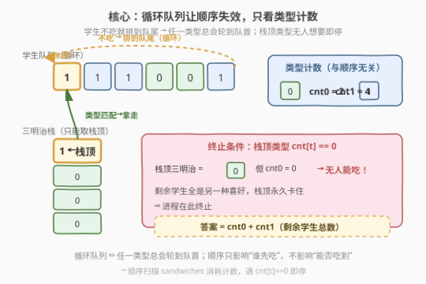

# LeetCode 无法吃午餐的学生数量 题解

## 1. 题目概述

- **标题 / 题号**：无法吃午餐的学生数量（#1700，easy）
- **链接**：https://leetcode.cn/problems/number-of-students-unable-to-eat-lunch/
- **难度**：简单
- **标签**：队列、栈、模拟、计数

**题意**：学校的自助午餐提供圆形和方形的三明治，分别用数字 `0` 和 `1` 表示。所有学生站成一个队列，每个学生要么喜欢圆形（`0`）要么喜欢方形（`1`）。三明治数量与学生数量相同，三明治放在一个**栈**里。每一轮：

- 如果队首学生**喜欢**栈顶三明治，就拿走它并离开队列；
- 否则，这名学生**放弃**这个三明治，回到队列**末尾**。

这个过程持续到队列里所有学生都不喜欢栈顶三明治为止。给定 `students`（初始队列）与 `sandwiches`（栈，`sandwiches[0]` 是栈顶），返回无法吃午餐的学生数量。

**示例 1**：

```text
输入：students = [1,1,0,0], sandwiches = [0,1,0,1]
输出：0
解释：每个三明治最终都被对应喜好的学生拿走，无人剩余。
```

**示例 2**：

```text
输入：students = [1,1,1,0,0,1], sandwiches = [1,0,0,0,1,1]
输出：3
解释：栈顶依次为 1,0,0,0… 前三个被拿走后，栈顶变成 0，
      但剩下的 3 名学生都喜欢 1，没人吃 0 → 停止，剩 3 人。
```

**约束**：

- $1 \le \text{students.length} = \text{sandwiches.length} \le 100$
- `students[i]`、`sandwiches[i]` 只能是 `0` 或 `1`

> 💡 **关键结构**：学生是**循环队列**（不吃就排到队尾），三明治是**栈**（只能从栈顶取）。两类对象只有一个共同变量——三明治的**类型**。只要某类型三明治还堆在栈顶，对应喜好的学生总会轮到队首把它吃掉；真正卡住进程的，是栈顶三明治的类型**已无学生想要**。

## 2. 解题思路

### 2.1 暴力思路：队列模拟

最直接的做法是**严格按题意模拟**：用一个队列维护学生顺序，一个指针指向栈顶三明治。每轮看队首：

- 队首喜好 $=$ 栈顶类型：队首出队、栈顶下移，匹配数 $+1$；
- 否则：队首挪到队尾，继续下一轮。

难点在于**何时停机**——不能无限循环。用一个计数器 `rotations` 记录「连续未匹配的轮转次数」，一旦它等于当前队列长度（说明一整圈没人吃栈顶三明治），即可停机。

模拟法逻辑清晰、与题面一一对应，是容易想到的保底解法。但最坏情况每个三明治都要让队列空转一整圈，复杂度 $O(n^2)$（$n \le 100$ 时仍可过）。

### 2.2 核心观察：学生顺序无关，只看类型计数



跳出「逐个轮转」的视角，抓住一个**贯穿全程的性质**：

> **学生队列是循环的——任何喜好的学生，最终都会轮到队首。**

这意味着：栈顶三明治能否被拿走，**与学生的具体排队顺序无关**，只取决于「**还有没有学生喜欢这个类型**」。理由是：

1. 若栈顶类型为 $t$，且至少还有一名学生喜欢 $t$：由于队列循环，这名学生**必定**会在有限轮内到达队首，拿走它——栈顶下移；
2. 若栈顶类型为 $t$，但**已经没有**学生喜欢 $t$（`cnt[t] == 0`）：栈顶永远卡住，剩余学生全是另一种喜好，谁也吃不了它——**进程在此终止**。

于是问题坍缩为**类型计数**：统计喜欢 `0`、`1` 的学生数 `cnt0`、`cnt1`，然后**按栈顶顺序**逐个消耗三明治——遇到类型 $t$ 的三明治，若 `cnt[t] > 0` 就 `cnt[t]--`（一名学生拿走），否则**立刻停机**，剩下的 `cnt0 + cnt1` 即为答案。

> ⚠️ **为什么顺序无关？** 关键在「循环」二字。普通队列里，队首是固定的，顺序决定谁能吃到；但循环队列里，所有人都会反复到达队首，**顺序只影响谁先吃，不影响能否吃到**。能卡住进程的唯一因素是「栈顶类型无人想要」。这正是不变量思维：与其追踪学生挪动的过程，不如抓住「栈顶三明治能否被消化」这一终止条件。

> 💡 **三明治顺序不能忽略**：学生顺序无关，但三明治是栈，**顺序固定**（必须从栈顶往下吃）。因此按 `sandwiches` 数组顺序遍历消耗计数，遇到 `cnt[t]==0` 即停——这一步忠实地模拟了「栈顶卡住则停止」的语义。

### 2.3 算法流程图


**计数法**流程如左半所示：先统计 `cnt0/cnt1`，再顺序扫描三明治，按类型减计数，遇零即停，返回剩余总数。**模拟法**流程如右半所示：队列 + 栈顶指针 + 轮转计数器，匹配则出队下移、不匹配则轮转，整圈未匹配即停。

### 2.4 示例演算

![示例演算：students=[1,1,1,0,0,1], sandwiches=[1,0,0,0,1,1]](../images/1700_example_walkthrough.svg)

以示例 2 为例，`students = [1,1,1,0,0,1]`、`sandwiches = [1,0,0,0,1,1]`：

**第一步**：统计学生类型 → `cnt0 = 2`，`cnt1 = 4`。

**第二步**：按栈顶顺序逐个消耗三明治：

| 步骤 | 栈顶三明治 | 喜好该类型的学生数 | 动作 | 剩余 cnt0 / cnt1 |
|------|-----------|-------------------|------|------------------|
| 1 | 1 | cnt1 = 4 > 0 | 一名 1 型学生拿走 | 2 / 3 |
| 2 | 0 | cnt0 = 2 > 0 | 一名 0 型学生拿走 | 1 / 3 |
| 3 | 0 | cnt0 = 1 > 0 | 一名 0 型学生拿走 | 0 / 3 |
| 4 | 0 | cnt0 = 0 | **无人想要 → 停机** | 0 / 3 |

**结果**：剩余学生数 $= \text{cnt0} + \text{cnt1} = 0 + 3 = 3$ ✓，与示例输出一致。

注意第 4 步：栈顶是 `0`，但 `cnt0` 已被耗尽——剩余 3 名学生全是 `1` 型，无人能吃这个 `0`，栈顶永久卡住，进程终止。这正是计数法「遇零即停」的物理含义。

## 3. 参考代码

### C++（计数法，$O(n)$）

```cpp
class Solution {
public:
    int countStudents(vector<int>& students, vector<int>& sandwiches) {
        int cnt0 = 0, cnt1 = 0;
        for (int s : students) {
            if (s == 0) cnt0++;
            else cnt1++;
        }
        for (int t : sandwiches) {
            if (t == 0 && cnt0 > 0) cnt0--;
            else if (t == 1 && cnt1 > 0) cnt1--;
            else break;
        }
        return cnt0 + cnt1;
    }
};
```

### C++（队列模拟法，与流程图对照）

```cpp
class Solution {
public:
    int countStudents(vector<int>& students, vector<int>& sandwiches) {
        deque<int> q(students.begin(), students.end());
        int i = 0, rotations = 0;
        while (!q.empty()) {
            if (q.front() == sandwiches[i]) {
                q.pop_front();
                i++;
                rotations = 0;
            } else {
                q.push_back(q.front());
                q.pop_front();
                if (++rotations == (int)q.size()) break;
            }
        }
        return q.size();
    }
};
```

### Python

```python
class Solution:
    def countStudents(self, students: List[int], sandwiches: List[int]) -> int:
        cnt = [0, 0]
        for s in students:
            cnt[s] += 1
        for t in sandwiches:
            if cnt[t] > 0:
                cnt[t] -= 1
            else:
                break
        return cnt[0] + cnt[1]
```

### Python（队列模拟法）

```python
class Solution:
    def countStudents(self, students: List[int], sandwiches: List[int]) -> int:
        q = deque(students)
        i = 0
        rotations = 0
        while q:
            if q[0] == sandwiches[i]:
                q.popleft()
                i += 1
                rotations = 0
            else:
                q.append(q.popleft())
                rotations += 1
                if rotations == len(q):
                    break
        return len(q)
```

> 💡 **面试建议**：先口述队列模拟法（证明读懂题意、能落地，并主动提出「整圈未匹配即停」的终止判定），再点出「循环队列让顺序失效、只看类型计数」的性质，引出 $O(n)$ 计数法。体现从模拟到优化的递进思维，而非直接甩出计数代码。

## 4. 复杂度分析

| 维度 | 复杂度 | 说明 |
|------|--------|------|
| 时间复杂度（计数法） | $O(n)$ | 一次遍历统计计数 + 一次遍历消耗三明治，各 $O(n)$ |
| 时间复杂度（模拟法） | $O(n^2)$ | 最坏每个三明治都让队列空转一整圈，$n$ 个三明治 × $n$ 长队列 |
| 空间复杂度（计数法） | $O(1)$ | 仅 `cnt0`、`cnt1` 两个整型变量 |
| 空间复杂度（模拟法） | $O(n)$ | 需要额外队列存学生 |

> 💡 对 $n \le 100$ 的约束，两种方法都远超够用门槛。计数法的优势在于把 $O(n^2)$ 模拟压成 $O(n)$ 单趟扫描，并揭示了「顺序无关、只看类型计数」的问题本质。

## 5. 扩展：循环队列的「顺序无关性」

本题是**循环结构简化问题**的典型范例：当容器是**循环队列**时，元素的相对顺序不再决定可达性——每个元素都会反复出现在出口位置，唯一能阻断流程的是「出口所需类型已耗尽」。

这种「顺序无关、只看计数」的思路在多类题目中出现：

- **循环移除型**：如 [剑指 Offer 62. 圆圈中最后剩下的数字](https://leetcode.cn/problems/yuan-quan-zhong-zui-hou-sheng-xia-de-shu-zi-lcof/)（约瑟夫环），看似要逐个模拟删除，实则可用递推 $f(n,m) = (f(n-1,m) + m) \bmod n$ 一步到位。
- **类型匹配型**：如 [2073. 买票需要的时间](https://leetcode.cn/problems/time-needed-to-buy-tickets/)，队伍循环购票，每人买到指定数量即离队——同样可按位置统计贡献而非逐轮模拟。

> 💡 **判断信号**：题目里出现「不吃就排到队尾」「循环」「回到末尾」等描述时，先问自己一个问题——**顺序还重要吗？** 若出口条件只依赖类型/数量而非具体身份，计数法往往能把模拟降维。

## 6. 面试要点

**Q1：为什么学生顺序不影响答案？**
> 队列是循环的——任何喜好的学生都会反复到达队首。栈顶三明治能否被拿走，只取决于「还有没有学生喜欢这个类型」，与谁先到队首无关。能卡住进程的唯一因素是栈顶类型已无学生想要。

**Q2：模拟法怎么判断该停机了？**
> 用一个 `rotations` 计数器记录「连续未匹配的轮转次数」。一旦它等于当前队列长度，说明一整圈下来没人能吃栈顶三明治——所有剩余学生都与栈顶类型相反，进程必停。

**Q3：计数法为什么按 sandwiches 顺序遍历？**
> 三明治是栈，**只能从栈顶往下吃**，顺序固定。学生顺序无关，但三明治顺序不能乱——按 `sandwiches` 数组顺序消耗计数，遇到 `cnt[t]==0` 即停，恰好模拟了「栈顶卡住则停止」的语义。

**Q4：两种方法的复杂度分别是多少？**
> 计数法时间 $O(n)$、空间 $O(1)$；模拟法时间 $O(n^2)$、空间 $O(n)$（额外队列）。$n \le 100$ 时两者都能过，但计数法揭示了问题本质，是更优解。

**Q5：面试时该先写哪个解法？**
> 先口述模拟法（证明读懂题意、能落地，主动提出终止判定），再点出「循环队列让顺序失效」引出计数法。体现「先正确、再优化、最后抽象本质」的递进思维，比直接甩计数代码更有说服力。

## 同类练习题

| # | 题目 | 与本题的关联 |
|---|------|-------------|
| 2073 | [买票需要的时间](https://leetcode.cn/problems/time-needed-to-buy-tickets/) | 循环队伍购票，按位置统计贡献而非逐轮模拟，同属「循环结构降维」思路 |
| 933 | [最近的请求次数](https://leetcode.cn/problems/number-of-recent-calls/) | 队列按时间窗口出队，计数而非模拟每一笔，对照理解队列的统计用法 |
| 232 | [用栈实现队列](https://leetcode.cn/problems/implement-queue-using-stacks/)（[题解](../0201-0300/232_用栈实现队列.md)） | 栈与队列相互模拟的经典设计题，对照本题「学生队列 + 三明治栈」的双容器结构 |
| 剑指 Offer 62 | [圆圈中最后剩下的数字](https://leetcode.cn/problems/yuan-quan-zhong-zui-hou-sheng-xia-de-shu-zi-lcof/) | 约瑟夫环，循环删除看似要模拟，实则递推公式一步到位，同为「循环结构→数学降维」 |
| 387 | [字符串中的第一个唯一字符](https://leetcode.cn/problems/first-unique-character-in-a-string/) | 先计数再按顺序找首个，与本题「先统计类型再按栈序消耗」的两阶段计数思路一致 |
