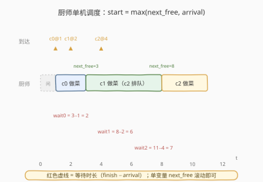
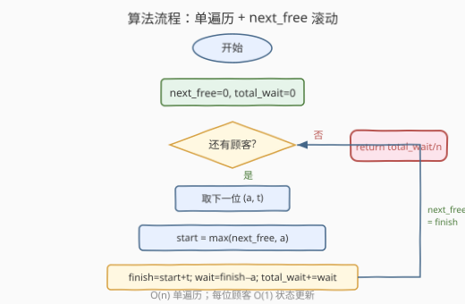
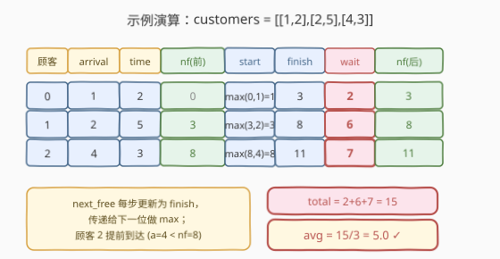

# 平均等待时间

- **题目名称**：平均等待时间
- **链接**：[1701. 平均等待时间](https://leetcode.cn/problems/average-waiting-time/)
- **难度**：中等
- **标签**：数组、模拟、贪心

## 1. 题目概述

有一个餐厅，只有**一位厨师**，他**同一时刻只能做一份订单**，并**严格按照订单递交的顺序**做菜。给定顾客数组 `customers`，其中 `customers[i] = [arrival_i, time_i]`：

- `arrival_i` 是第 $i$ 位顾客到达的时间，**按非递减顺序**给出；
- `time_i` 是厨师为第 $i$ 位顾客做菜所需的时间。

当一位顾客到达时，他把订单交给厨师；厨师**一旦空闲就立刻开始**做这份菜。顾客会一直等待，直到厨师完成他的订单。每位顾客的**等待时间** = 「订单完成时刻」 − 「到达时刻」。请返回所有顾客的**平均等待时间**，与标准答案误差在 $10^{-5}$ 内即视为正确。

**示例 1**：

```text
输入：customers = [[1,2],[2,5],[4,3]]
输出：5.00000
解释：
  顾客 0：时刻 1 到达，厨师空闲，1 开始 → 3 完成，等待 3-1 = 2
  顾客 1：时刻 2 到达，厨师忙到 3，3 开始 → 8 完成，等待 8-2 = 6
  顾客 2：时刻 4 到达，厨师忙到 8，8 开始 → 11 完成，等待 11-4 = 7
  平均 = (2+6+7)/3 = 5
```

**示例 2**：

```text
输入：customers = [[5,2],[5,4],[10,3],[20,1]]
输出：3.25000
解释：
  顾客 0：5 到达，5→7，等 2
  顾客 1：5 到达，7→11，等 6
  顾客 2：10 到达，11→14，等 4
  顾客 3：20 到达，厨师自 14 起空闲，20→21，等 1
  平均 = (2+6+4+1)/4 = 3.25
```

**约束条件**：

- $1 \le \text{customers.length} \le 10^5$
- $1 \le \text{arrival}_i, \text{time}_i \le 10^4$
- $\text{arrival}_i \le \text{arrival}_{i+1}$

> 💡 **关键结构**：单机 + FIFO 顺序 + 到达时间有序。由于到达时间已排序、且厨师不会插队，所有订单的执行顺序与到达顺序完全一致——这就把「调度」退化成了「逐单滚动」，只需一个变量记住「厨师下次空闲的时刻」。

---

## 2. 解题思路

### 2.1 暴力思路：离散时间步模拟

最直觉的做法是把时间轴**离散化**：让时钟 $t$ 从 $0$ 起一格一格地走，每一格检查两件事——是否有顾客在这一刻到达、厨师是否正在做菜。维护一个「当前正在做的订单剩余时间」计数器，每走一格减一，减到 0 即厨师变空闲；顾客到达时若厨师空闲则立刻接单，否则排队。

```text
t = 0
queue = []                       # 等待中的顾客
remaining = 0                    # 当前订单剩余时间
for t in 0, 1, 2, ... T_max:     # T_max = 最后一个完成时刻
    if remaining > 0: remaining -= 1
    把所有 arrival == t 的顾客 push 进 queue
    if remaining == 0 and queue 非空:
        接单 c = queue.pop()
        remaining = c.time
        记录完成时刻 t + remaining
```

这种「时钟一拍一拍走」的写法时间复杂度 $O(T_{\max})$，其中 $T_{\max}$ 是最后一个订单的完成时刻。本题 $n \le 10^5$ 且每个 $\text{time}_i \le 10^4$，最坏情况下 $T_{\max}$ 可达 $10^9$ 量级（顾客几乎首尾相接、总做菜时长拉满），逐时刻模拟必然超时。

> ⚠️ **症结**：在厨师持续忙碌的时段里，时间一格格走却**什么事件都不发生**——这些「空转」的时钟拍纯属浪费。真正有意义的只有两类事件：**顾客到达**和**订单完成**。

### 2.2 核心观察：事件驱动 + 单变量滚动



关键洞察：由于到达时间**已排序**、且厨师**严格 FIFO**，订单的执行顺序就是到达顺序。因此**无需维护区间列表或事件队列**，只要记住一个标量 `next_free`——「厨师做完当前所有已接订单的时刻」——就足够推导下一位顾客的起始时刻。

对第 $i$ 位顾客（到达 `a`、做菜 `t`）：

$$
\text{start}_i = \max(\text{next\_free},\ a)
$$

- 若 `next_free <= a`：厨师在他到达前已空闲，开始时刻就是 `a`（厨师可能空等了一段，如示例 2 中顾客 3 到达前厨师从 14 闲到 20）；
- 若 `next_free > a`：厨师仍在忙，顾客排队到 `next_free` 才开始。

完成时刻与等待时间随之确定：

$$
\text{finish}_i = \text{start}_i + t, \qquad \text{wait}_i = \text{finish}_i - a
$$

做完之后，厨师下次空闲时刻更新为本次完成时刻：

$$
\text{next\_free} \leftarrow \text{finish}_i
$$

于是整条流程压成一个**单遍历、单变量**的滚动递推：

$$
\text{next\_free}_i = \max(\text{next\_free}_{i-1},\ \text{arrival}_i) + \text{time}_i
$$

> 💡 **为什么 `next_free` 是 `finish` 而非 `start`？** 因为顾客做完菜后厨师「下次空闲」恰是这份菜的完成时刻——下一位顾客能开火的最早时间正是此值。若误存成 `start`，相当于假设每份菜瞬间做完，会把后续顾客的等待时间算短。`next_free` 的语义是「**累积已接订单的完成时刻**」，它把历史所有做菜时长压缩进一个数。

> ⚠️ **「空等」与「排队」的不对称**：当 `next_free < arrival` 时，厨师从 `next_free` 到 `arrival` 这段是**空闲空等**（无人可做），这段时间不计入任何人的等待时间——顾客还没到。当 `next_free > arrival` 时，顾客从 `arrival` 到 `next_free` 这段是**排队干等**，这段时间计入该顾客的等待时间。`max` 运算正是用来区分这两种情形：取较大者即「能开火的最早时刻」。

### 2.3 算法流程图



1. **初始化** `next_free = 0`、`total_wait = 0`。
2. **遍历** 每位顾客 `(a, t)`：
   - `start = max(next_free, a)`
   - `finish = start + t`
   - `wait = finish - a`
   - `total_wait += wait`
   - `next_free = finish`
3. **返回** `total_wait / n`。

> 💡 **`next_free` 初值取 0**：第一位顾客到达时 `a >= 1 > 0`，`max(0, a) = a`，即立刻开火，符合题意。也可取 `-∞` 或第一位顾客的 `arrival`，效果相同——只要初值 `<= arrival_0` 即可。

### 2.4 示例演算

以示例 1 `customers = [[1,2],[2,5],[4,3]]` 为例：



| 顾客 | arrival | time | next_free(前) | start | finish | wait | next_free(后) |
|------|---------|------|---------------|-------|--------|------|---------------|
| 0 | 1 | 2 | 0 | max(0,1)=1 | 3 | 3−1=**2** | 3 |
| 1 | 2 | 5 | 3 | max(3,2)=3 | 8 | 8−2=**6** | 8 |
| 2 | 4 | 3 | 8 | max(8,4)=8 | 11 | 11−4=**7** | 11 |

`total_wait = 2 + 6 + 7 = 15`，`n = 3`，平均 = $15/3 = 5.00000$ ✓。

注意顾客 2 在时刻 4 到达，但厨师忙到 8 才开始他的菜——`max(8, 4) = 8` 把「顾客提前到达、厨师尚未空闲」的情形正确捕获，多等的 $8-4=4$ 计入了 `wait`。

---

## 3. 参考代码

### C++

```cpp
class Solution {
public:
    double averageWaitingTime(vector<vector<int>>& customers) {
        long long nextFree = 0, totalWait = 0;
        for (const auto& c : customers) {
            int arrival = c[0], time = c[1];
            long long start = max(nextFree, (long long)arrival);
            long long finish = start + time;
            totalWait += finish - arrival;
            nextFree = finish;
        }
        return (double)totalWait / customers.size();
    }
};
```

### Python

```python
class Solution:
    def averageWaitingTime(self, customers: List[List[int]]) -> float:
        next_free = 0
        total_wait = 0
        for a, t in customers:
            start = max(next_free, a)
            finish = start + t
            total_wait += finish - a
            next_free = finish
        return total_wait / len(customers)
```

> ⚠️ **溢出陷阱（C++）**：$n \le 10^5$、单次 `wait` 最坏约 $10^5 \times 10^4 + 10^4 \approx 10^9$，`total_wait` 累加可达 $10^{14}$，超出 32 位 `int`（约 $2.1 \times 10^9$）范围。必须用 `long long` 存 `nextFree` 与 `totalWait`。`max(nextFree, (long long)arrival)` 中的强转也必不可少，否则 `int` 与 `long long` 比较时仍可能发生隐式截断。Python 原生大整数无此问题。

> 💡 **返回类型**：题目要求浮点、误差 $10^{-5}$。C++ 中 `(double)totalWait / n` 必须先把分子转 `double` 再除；若写成 `totalWait / n`（两个整数）会触发整除截断。Python 3 的 `/` 天然是浮点除，无需处理。

---

## 4. 复杂度分析

| 维度 | 复杂度 | 说明 |
|------|--------|------|
| 时间复杂度 | $O(n)$ | 单遍历，每位顾客 $O(1)$ 的 `max`、加法与累加；$n \le 10^5$ 时约 $10^5$ 次运算 |
| 空间复杂度 | $O(1)$ | 仅 `next_free`、`total_wait` 两个标量，不随 $n$ 增长 |

> 💡 本题 $n \le 10^5$，$O(n)$ 远低于时限。关键在于**避免**逐时刻模拟的 $O(T_{\max})$——当时间跨度大时那会退化到 $10^9$ 级。事件驱动把「空转的时钟拍」全部跳过：每一位顾客对应一次状态更新，$n$ 个事件即 $n$ 次操作。

---

## 5. 扩展：多厨师变体与事件堆调度

### 5.1 从单机到多机

本题的 `next_free` 单变量能成立，本质依赖两个前提：**单**厨师 + **FIFO** 顺序。一旦把厨师数量增加到 $k$ 个，订单便不再排队等同一台机器——下一份菜该交给谁、何时能开火，取决于**最早空闲**的那台机器。此时一个标量不够用，需要维护「每台机器的空闲时刻」集合，并每次取出最小值。

数据结构选择：

- **小顶堆**（`priority_queue` / `heapq`）：存各厨师「下次空闲时刻」，每次 $O(\log k)$ 取最小、$O(\log k)$ 更新。整体 $O(n \log k)$。
- 这正是 [1606. 找到处理最多请求的服务器](../1601-1700/1606_找到处理最多请求的服务器.md) 的核心模型——$k$ 台服务器按请求到达时刻分配，用堆维护每台的空闲时间。

### 5.2 非_fifo 调度：最短任务优先

若题目改为「厨师可**抢占**或**按最短剩余时间**挑订单」，则 FIFO 不再成立，需要在「订单完成」事件发生时从**等待队列**里重新选下一份菜（如 [1834. 单线程 CPU](https://leetcode.cn/problems/single-threaded-cpu/) 按**最短处理时间**选）。此时需把「到达」与「完成」两类事件混合排序，用事件堆驱动：

```text
events = 所有 (arrival_i, i) 进堆；可用订单池按 processing_time 排序
while 还有未处理订单:
    取出当前时刻 t 下所有已到达订单入池
    若池空：跳到下一个到达事件
    否则：取池中 processing_time 最小者执行，推进 t += time，记完成
```

复杂度 $O(n \log n)$。对照本题可见：**FIFO + 单机** 把调度简化成单变量滚动；**抢占/最短优先 + 单机** 必须用事件堆。问题越「自由」，数据结构越重。

> 💡 **调度理论的缩影**：本题是「单机 FIFO」$P\,1 \mid r_j \mid \sum \overline{C}_j$ 的最简形态，已知最优调度即「按到达顺序」（FCFS）。一旦目标换成 $\sum C_j$ 最小（总完成时间），最优策略变成 SPT（最短处理时间优先）——这是 [1834](https://leetcode.cn/problems/single-threaded-cpu/) 的理论基础。调度算法随目标函数而变，但「事件驱动 + 堆」是通用的模拟骨架。

---

## 6. 面试要点

**Q1：为什么可以用一个 `next_free` 变量代替队列/区间列表？**
> 两个前提同时成立：①厨师**只有一位**，不存在「哪台机器先空」的选择；②订单**严格按到达顺序**执行（FIFO），不存在重排。于是历史订单的影响全部折叠进「累积完成时刻」这一个标量——下一位顾客能开火的最早时间恰是上一位的完成时刻。一旦去掉任一前提（多机或可抢占），单变量就不够，需升级为堆。

**Q2：`start = max(next_free, arrival)` 中的 `max` 在区分什么？**
> 区分「厨师空等」与「顾客排队」两种不对称情形。`next_free <= arrival` 时，厨师从 `next_free` 到 `arrival` 是**空闲空等**（无人可做），这段时间不计入任何人等待时间；`next_free > arrival` 时，顾客从 `arrival` 到 `next_free` 是**排队干等**，计入该顾客等待时间。`max` 取较大者即「能开火的最早时刻」，把两种情形统一表达。

**Q3：C++ 实现中为什么必须用 `long long`？**
> 极端情形下顾客几乎首尾相接，`next_free` 累积做菜时长可达 $n \cdot \max(\text{time}) \approx 10^5 \times 10^4 = 10^9$；`total_wait` 最坏可叠加 $n$ 个这样的值到 $10^{14}$ 量级，远超 32 位 `int`（约 $2.1 \times 10^9$）。`long long`（约 $9.2 \times 10^{18}$）安全。同时 `max` 两边类型须一致，强转 `(long long)arrival` 防止隐式转换陷阱。

**Q4：为什么返回 `(double)totalWait / n` 而非 `totalWait / n`？**
> C++ 中两个整数相除触发**整除截断**，会丢掉小数部分（如 $15/2$ 得 $7$ 而非 $7.5$）。必须先把分子转 `double` 再除，使除法升级为浮点除。题目允许 $10^{-5}$ 误差，`double` 的约 15 位有效数字远超所需。Python 3 的 `/` 天然是浮点除，无需此处理。

**Q5：如果到达时间未排序，该怎么改？**
> 先按 `arrival` 排序（$O(n \log n)$），再套用同样的单遍历。本题约束保证有序，可省去排序；但面试时若被问「到达顺序乱序」，先排序再滚动即得 $O(n \log n)$ 解。注意：若厨师仍 FIFO 且订单**按到达先后**执行，排序后逻辑不变；若允许按其他策略（如最短任务优先）重排，则需切换到第 5 节的事件堆方案。

---

## 7. 同类练习题

- [1606. 找到处理最多请求的服务器](https://leetcode.cn/problems/find-servers-that-handled-most-number-of-requests/)（[题解](../1601-1700/1606_找到处理最多请求的服务器.md)）：多机调度变体——从单厨师升级为 $k$ 台服务器，单变量 `next_free` 升级为「空闲时刻小顶堆」+ 有序集合找可用机器，对照理解「单机 FIFO」与「多机分配」的数据结构分野
- [1834. 单线程 CPU](https://leetcode.cn/problems/single-threaded-cpu/)：同为单机调度，但订单**不按到达顺序**执行——厨师在空闲时刻从等待池中挑**处理时间最短**的订单，需用事件堆混合「到达」与「完成」两类事件，对照 FIFO 与 SPT 两种调度策略
- [933. 最近的请求次数](https://leetcode.cn/problems/number-of-recent-calls/)（[题解](../0901-1000/933_最近的请求次数.md)）：队列模拟时间窗口——同样是「按时间到达的事件流」，用队列维护窗口内的请求，与本题「按到达顺序逐个处理」的 FIFO 骨架同源
- [1882. 使用服务器处理任务](https://leetcode.cn/problems/process-tasks-using-servers/)：1606 的进阶版——多服务器 + 按权重选机 + 按最短任务优先选任务，综合了「多机调度」与「非 FIFO 选择」两方面的堆运用，是本题调度思想的复杂化全景
- [54. 螺旋矩阵](https://leetcode.cn/problems/spiral-matrix/)：另一类「单遍历模拟」——按方向边界逐步推进，无需额外数据结构，对照体会「模拟题中用最少状态变量完成遍历」的共性
