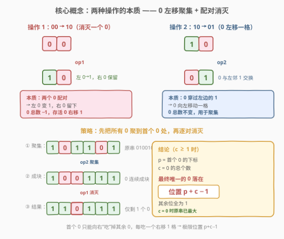
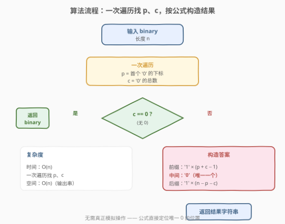
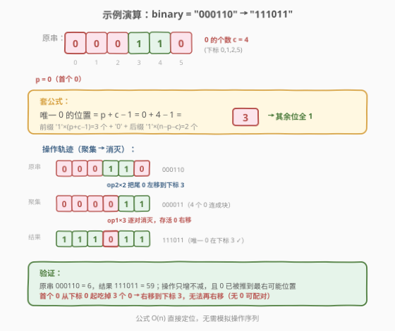

# LeetCode 修改后的最大二进制字符串 题解

## 1. 题目概述

- **标题 / 题号**：修改后的最大二进制字符串（#1702，medium）
- **链接**：https://leetcode.cn/problems/maximum-binary-string-after-change/
- **难度**：中等
- **标签**：贪心、字符串、数学

**题意**：给定一个仅由 `'0'` 和 `'1'` 组成的二进制字符串 `binary`，你可以**任意次**使用下面两种操作修改它：

- **操作 1**：如果串中包含子串 `"00"`，可以用 `"10"` 替换它。例如 `"00010" → "10010"`。
- **操作 2**：如果串中包含子串 `"10"`，可以用 `"01"` 替换它。例如 `"00010" → "00001"`。

返回执行上述操作任意次后能得到的**最大二进制字符串**（即对应十进制数值最大的串）。

**示例 1**：

```text
输入：binary = "000110"
输出："111011"
解释：一种可行转换序列：
  "000110" → "000101" → "100101" → "110101" → "110011" → "111011"
```

**示例 2**：

```text
输入：binary = "01"
输出："01"
解释：无法进行任何操作。
```

**约束**：

- $1 \le \text{binary.length} \le 10^5$
- `binary` 仅包含 `'0'` 和 `'1'`。

> 💡 **关键直觉**：两个操作看似都能用，但**操作 2 把 `0` 往左挪、操作 1 把成对的 `0` 消灭一个**。要让串最大，应尽量**消灭 `0`** 并把**唯一幸存的 `0` 推到尽可能靠右**的位置。本题要发现的是：幸存 `0` 的最终位置由一条简洁公式直接决定，无需真正模拟操作。

## 2. 解题思路

### 2.1 暴力思路：BFS 搜索所有可达串

把每个二进制串看成图中的节点，两种操作是转移边，BFS 搜索所有可达状态取最大。但长度 $n \le 10^5$ 时状态空间是 $2^n$ 级别，**完全不可行**。需要洞察操作的本质，把「构造过程」压缩成「直接定位」。

### 2.2 核心观察：0 的左移聚集与配对消灭



把两种操作翻译成对 **`0` 的运动** 的描述：

| 操作 | 形式 | 对 `0` 的影响 |
|------|------|---------------|
| 操作 1 | `"00" → "10"` | **消灭**左侧的 `0`（变 `1`），右侧 `0` 保留；`0` 总数 $-1$，幸存 `0` 相对原对右移一格 |
| 操作 2 | `"10" → "01"` | `0` 与左邻的 `1` 交换，即 `0` **向左移动一格**；`0` 总数不变 |

由此得到两个根本事实：

1. **`0` 只能向左移动**（操作 2），或**被消灭**（操作 1）。没有任何操作能让一个孤立的 `0` 向右移动——向右移动只能通过「吃掉右侧另一个 `0`」实现（操作 1 中幸存 `0` 落在原对的右位）。
2. **每次操作 1 让 `0` 总数 $-1$**，且**无法把 `0` 总数降到 $0$**（操作 1 总会留下一个 `0`）。故若原串有 $c \ge 1$ 个 `0`，最终必剩**恰好 $1$ 个 `0`**；若 $c = 0$，原串全 `1` 已是最大。

**策略**：用操作 2 把所有 `0` 聚到首个 `0` 所在位置形成连续块，再用操作 1 逐对消灭。设首个 `0` 下标为 $p$，`0` 总数为 $c$：

- **聚集**：第 $j$ 个 `0`（$j \ge 2$）原在 $z_j > p$，它左边一路都是 `1`，反复用操作 2 把它左移，最终落到 $p + j - 1$。于是 $c$ 个 `0` 占据下标 $p, p+1, \dots, p+c-1$。
- **消灭**：对块左端反复用操作 1：`[p,p+1]` 处 `"00"→"10"` 让下标 $p$ 变 `1`，新块从 $p+1$ 起；重复 $c-1$ 次后，唯一幸存 `0` 落在 $p + c - 1$。

$$\boxed{\text{最终串} = \texttt{'1'} \times (p + c - 1) \;+\; \texttt{'0'} \;+\; \texttt{'1'} \times (n - p - c)}$$

> 💡 **为什么 $p + c - 1$ 是幸存 `0` 的最右可能位置？** 考察**首个 `0`** 的下标。操作 2 不会让首个 `0` 右移（它只能左移或不动，左移会让串变小故不取）；操作 1 让首个 `0` 变 `1`，新首个 `0` 跳到右侧相邻的 `0`——即首个 `0` **只能向右“吃”掉其余 `0`**，每吃一个右移一格。它至多吃掉 $c - 1$ 个 `0`，故极限位置 $\le p + (c-1) = p + c - 1$。而我们上面的聚集+消灭策略恰好达到该上界，故为最优。

> ⚠️ **`c = 0` 与 `c = 1` 的特例**：$c = 0$ 时全 `1`，直接返回原串；$c = 1$ 时 $p + c - 1 = p$，幸存 `0` 原地不动——孤立 `0` 无法右移（无 `0` 可配对），公式退化为原串，与示例 2 `"01" → "01"` 吻合。

### 2.3 算法流程图



**步骤**：

1. **一次遍历**：记录首个 `'0'` 的下标 $p$（初始 $-1$），同时统计 `'0'` 总数 $c$。
2. **判定**：若 $c = 0$（$p = -1$），原串全 `1`，直接返回 `binary`。
3. **构造**：否则返回 `'1' * (p + c - 1) + '0' + '1' * (n - p - c)`。

> ⚠️ **边界检查**：$p + c - 1 \le n - 1$ 恒成立。因为首个 `0` 前有 $p$ 个 `1`，全串有 $c$ 个 `0`，故 $p + c \le n$，从而 $p + c - 1 \le n - 1$，后缀长度 $n - p - c \ge 0$ 不会越界。

### 2.4 示例演算

以 `binary = "000110"`（$n = 6$）为例：



- **定位**：首个 `'0'` 在下标 $p = 0$；`'0'` 分布在下标 $0,1,2,5$，总数 $c = 4$。
- **套公式**：唯一幸存 `0` 落在 $p + c - 1 = 0 + 4 - 1 = 3$。
- **构造**：前缀 `'1' * 3 = "111"` + `'0'` + 后缀 `'1' * (6 - 0 - 4) = "11"` → **`"111011"`** ✓

**操作轨迹**（验证公式可达）：

```text
000110           ← 原串，0 在 {0,1,2,5}
  op2 [4,5] "10"→"01" : 000101   ← 尾 0 左移到下标 4
  op2 [3,4] "10"→"01" : 000011   ← 继续左移到下标 3，4 个 0 成块 {0,1,2,3}
  op1 [0,1] "00"→"10" : 100011   ← 消灭下标 0 的 0，块右端右移
  op1 [1,2] "00"→"10" : 110011
  op1 [2,3] "00"→"10" : 111011   ← 唯一 0 落在下标 3 ✓
```

验算：`000110`₂ $= 6$，`111011`₂ $= 59$；操作链单调递增，且幸存 `0` 已被推到最右可能位置，无法再右移（无 `0` 可配对）。

> 💡 **与官方转换链的关系**：题面给出的 `"000110"→"000101"→"100101"→"110101"→"110011"→"111011"` 是另一种合法顺序（先消灭后聚集交替进行），终点相同。这正说明**终点唯一**——无论操作顺序如何，最优结果都是把唯一 `0` 推到 $p + c - 1$。

## 3. 参考代码

### Python

```python
class Solution:
    def maximumBinaryString(self, binary: str) -> str:
        p = binary.find('0')
        if p == -1:
            return binary
        c = binary.count('0')
        n = len(binary)
        return '1' * (p + c - 1) + '0' + '1' * (n - p - c)
```

### C++

```cpp
class Solution {
public:
    string maximumBinaryString(string binary) {
        int p = binary.find('0');
        if (p == string::npos) return binary;
        int c = count(binary.begin(), binary.end(), '0');
        int n = binary.size();
        return string(p + c - 1, '1') + '0' + string(n - p - c, '1');
    }
};
```

> 💡 **实现细节**：① Python 的 `str.find` 在找不到时返回 `-1`，C++ 的 `string::find` 返回 `string::npos`，二者都用于判定「无 `0`」直接返回原串。② 无需显式模拟操作，**一次 `find` + 一次 `count`** 即得 $p, c$，再 `O(n)` 拼串。③ 构造时三段长度之和 $(p+c-1) + 1 + (n-p-c) = n$，与原串等长，无需额外边界处理。

## 4. 复杂度分析

| 维度 | 复杂度 | 说明 |
|------|--------|------|
| 时间 | $O(n)$ | `find`、`count`、构造各一次线性扫描，共三轮 $O(n)$ |
| 空间 | $O(n)$ | 输出字符串本身占 $n$；额外仅 $O(1)$ 几个整型变量 |

> ⚠️ 暴力 BFS 状态空间 $2^n$，$n = 10^5$ 时天文数字。本题从「搜索可达状态」转为「公式直接定位」，是典型的**不变量/守恒量驱动**的贪心题——找到「幸存 `0` 位置上界」后一步到位。

## 5. 扩展：操作不变量与可达性证明

### 5.1 用不变量严格证明最优性

上面的论证依赖「首个 `0` 只能向右吃 `0`」。这里给出更形式化的**不变量**刻画。定义：

$$\text{first}_0(s) = \min\{i : s[i] = \texttt{'0'}\}, \qquad \text{cnt}_0(s) = |\{i : s[i] = \texttt{'0'}\}|$$

考察两种操作对 $(\text{first}_0, \text{cnt}_0)$ 的影响：

| 操作 | $\text{cnt}_0$ 变化 | $\text{first}_0$ 变化 |
|------|---------------------|------------------------|
| `00→10`（块首处） | $-1$ | $+1$（首个 `0` 被消灭，跳到下一个 `0`） |
| `00→10`（非块首） | $-1$ | 不变（块首未动） |
| `10→01`（涉及首个 `0`） | $0$ | $-1$（首个 `0` 左移，**串变小，不取**） |
| `10→01`（非首个 `0`） | $0$ | 不变 |

在**不使串变小**的前提下（即不让首个 `0` 左移），$\text{first}_0$ 只能通过操作 1 **单调不减**，且每次操作 1 让 $\text{cnt}_0$ 减 $1$。从 $(p, c)$ 出发，$\text{cnt}_0$ 最多减到 $1$（共 $c - 1$ 次操作 1），相应 $\text{first}_0$ 最多增加 $c - 1$，到达 $p + c - 1$。这给出严格上界，且聚集+消灭策略达到上界，故最优。

### 5.2 一般化：操作图论视角

把二进制串看成节点、两种操作看成有向边，本题问的是**可达集中字典序/数值最大者**。当操作具有**守恒量**（如本题「`0` 个数最多减到 1」+「首个 `0` 单调性」）时，可达集的极值往往由不变量直接决定，无需搜索。这与 [753. 破解保险箱](https://leetcode.cn/problems/cracking-the-safe/)（de Bruijn 图欧拉回路）、[332. 重新安排行程](https://leetcode.cn/problems/reconstruct-itinerary/)（欧拉路径）同属「**图论极值问题转化为不变量刻画**」的范式，只是本题的不变量更朴素。

> 💡 **延伸思考**：若再加一种操作 `"11" → "00"`（允许分裂 `1` 为 `00`），则 $\text{cnt}_0$ 不再单调，最优结构会改变——这提示我们**判断能否贪心，先看操作是否诱导出单调不变量**。

## 6. 面试要点

1. **两种操作分别对 `0` 做了什么？**

   > 操作 1 `"00"→"10"`：消灭左侧 `0`，`0` 总数 $-1$，幸存 `0` 落在原对右位（相对右移）。操作 2 `"10"→"01"`：`0` 与左邻 `1` 交换，`0` 向左移动一格，`0` 总数不变。一句话：**操作 2 聚集 `0`，操作 1 消灭 `0`**。

2. **为什么最终只剩一个 `0`？能把 `0` 全消灭吗？**

   > 不能。操作 1 总是把 `"00"` 变 `"10"`，结果里仍含一个 `0`；没有任何操作能把孤立的 `0` 变成 `1`。故 $c \ge 1$ 时最终必剩 $1$ 个 `0`，$c = 0$ 时原串全 `1` 已是最大。

3. **幸存 `0` 的最右位置为什么是 $p + c - 1$？**

   > 首个 `0` 要右移只能靠操作 1「吃掉右侧相邻的 `0`」，每吃一个右移一格、`0` 总数减一。它至多吃掉其余 $c - 1$ 个 `0`，故极限位置 $\le p + (c - 1) = p + c - 1$。聚集全部 `0` 到 $p$ 起的连续块再逐对消灭，恰好达到该上界，故最优。

4. **为什么不直接模拟操作？复杂度差在哪？**

   > 模拟需反复扫描找 `"00"`/`"10"` 并替换，最坏 $O(n^2)$（如全 `0` 串要 $n-1$ 次操作 1，每次扫描 $O(n)$）。而公式法只需一次 `find` + 一次 `count` 共 $O(n)$，再 $O(n)$ 拼串，总 $O(n)$。关键是从「过程」抽象出「终态不变量」。

5. **`c = 1` 时公式退化为原串，对吗？为什么不能让孤立 `0` 右移？**

   > 对。$c = 1$ 时 $p + c - 1 = p$，结果即原串。孤立 `0` 右侧若是 `1`，模式是 `"01"` 而非 `"10"`，操作 2 不适用；操作 1 需要 `"00"` 也不适用。没有任何操作能让孤立 `0` 右移，它只能左移（操作 2 `"10"→"01"`，但那会让串变小），故原地不动即最优。

> 💡 **一句话总结**：操作 2 把 `0` 聚到首个 `0` 处成块，操作 1 逐对消灭——幸存 `0` 落在 $p + c - 1$，公式 $O(n)$ 直接构造；其余位全 `1`。

## 同类练习题

| # | 题目 | 与本题的关联 |
|---|------|-------------|
| 1754 | [构造字典序最大的合并后的字符串](https://leetcode.cn/problems/largest-merge-of-two-strings/) | 贪心构造字典序最大串，同属「**直觉贪心 + 一次扫描构造**」家族，对照体会「局部最优即全局最优」的判定 |
| 321 | [拼接最大数](https://leetcode.cn/problems/create-maximum-number/)（[题解](../0301-0400/321_拼接最大数.md)） | 从两个数组拼最大数，贪心 + 单调栈，对照「**构造最大串**」的不同技术路线 |
| 402 | [移掉 K 位数字](https://leetcode.cn/problems/remove-k-digits/)（[题解](../0401-0500/402_移掉K位数字.md)） | 单调栈贪心构造最小/最大串，与本题「**用不变量直接定位终态**」形成「过程模拟 vs 不变量定位」的对照 |
| 1625 | [执行操作后字典序最小的字符串](https://leetcode.cn/problems/lexicographically-smallest-string-after-applying-operations/)（[题解](../1601-1700/1625_执行操作后字典序最小的字符串.md)） | 同类「**有限操作下的极值串**」问题，但操作含轮转与加法、不变量不同，需 BFS/枚举，对照理解「**何时能公式化、何时需搜索**」 |
| 899 | [有序队列](https://leetcode.cn/problems/orderly-queue/) | 字符串在受限操作下的最小表示，$k=1$ 时需找最小轮转、$k\ge2$ 时可任意排列——另一类「**操作能力决定可达集**」的典型，与本题「`0` 只能左移/被消灭」的受限能力分析同源 |
